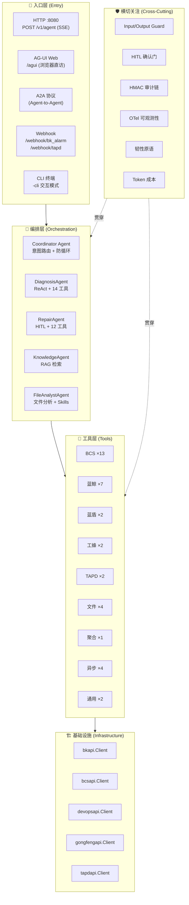
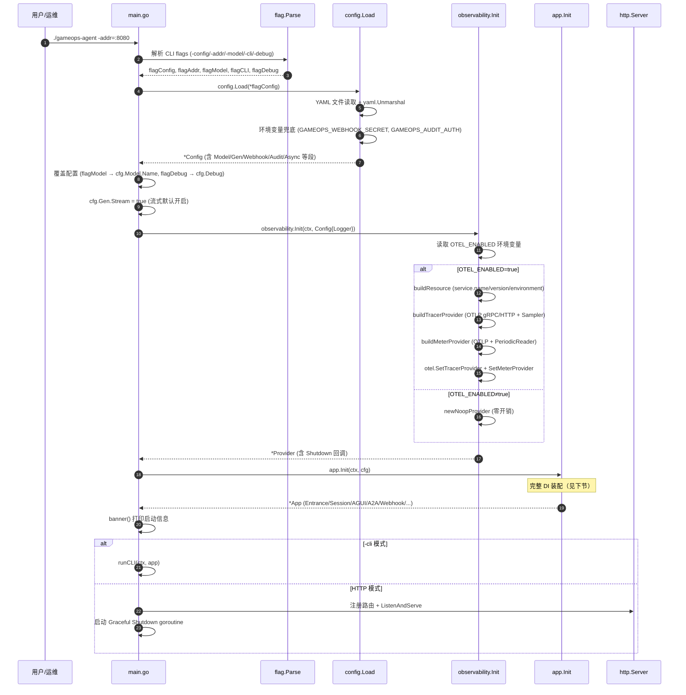
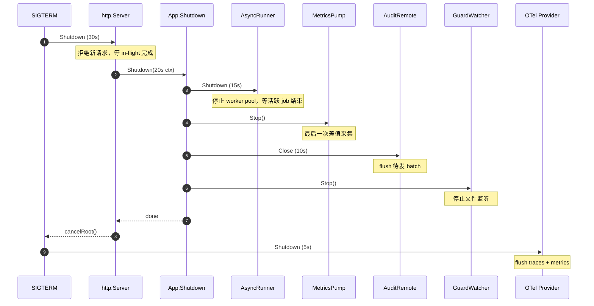

---

# GameOps Agent 解析文档 #1 — 架构总览与启动流程

> 覆盖范围：系统分层、启动时序、DI 装配、Graceful Shutdown  
> 核心文件：`main.go`、`src/app/app.go`、`src/app/shutdown.go`、`src/config/loader.go`

---

## 一、系统分层架构

GameOps Agent 采用经典的**分层 + 横切关注**架构，自上而下分为 5 层：



### 各层职责

| 层 | 职责 | 关键特征 |
|---|------|---------|
| **入口层** | 接收外部请求，转换为统一的 Agent 调用 | 多协议并存（SSE/AG-UI/A2A/Webhook/CLI），共享同一 Session |
| **编排层** | LLM 驱动的意图路由与任务执行 | Coordinator 纯路由无工具；子 Agent 各持专属工具集 |
| **工具层** | 封装平台 API 为 LLM 可调用的 FunctionTool | TargetedTool 分发机制；HITL 两段式确认 |
| **横切层** | 安全、审计、可观测性等贯穿全链路 | 通过 Callbacks 机制注入，不侵入业务代码 |
| **基础设施** | HTTP 客户端封装，对接 5 大平台 | Mock/Real 双模式；统一 Envelope 解析 |

---

## 二、启动时序（完整流程）



### 2.1 Flag 解析（main.go）

```go
var (
    flagConfig = flag.String("config", "", "YAML 配置文件路径")
    flagAddr   = flag.String("addr", ":8080", "HTTP 监听地址")
    flagModel  = flag.String("model", "", "覆盖 LLM 模型名称")
    flagCLI    = flag.Bool("cli", false, "启用交互式终端模式")
    flagDebug  = flag.Bool("debug", false, "开启调试模式")
)
```

**设计要点**：
- 所有 flag 都有合理默认值，`go run .` 即可零配置启动
- `-model` 覆盖 YAML 中的 `model.name`，便于快速切换模型联调
- `-cli` 模式复用同一套 Agent/Session 装配，只是入口从 HTTP 变为 stdin

### 2.2 配置加载（config/loader.go）

```go
func Load(path string) (*Config, error) {
    cfg := Default()          // 先填充默认值
    if path == "" {
        return cfg, nil       // 无配置文件 → 纯默认启动
    }
    data, _ := os.ReadFile(path)
    yaml.Unmarshal(data, cfg) // YAML 覆盖默认值
    // 环境变量兜底（12-factor 原则：密钥不入 YAML）
    if cfg.Webhook.Secret == "" {
        cfg.Webhook.Secret = os.Getenv("GAMEOPS_WEBHOOK_SECRET")
    }
    if cfg.Audit.Remote.AuthHeader == "" {
        cfg.Audit.Remote.AuthHeader = os.Getenv("GAMEOPS_AUDIT_AUTH")
    }
    return cfg, nil
}
```

**配置结构全景**：

| 配置段 | 类型 | 职责 |
|--------|------|------|
| `Model` | `ModelConfig` | LLM 模型名/BaseURL/APIKey |
| `Gen` | `GenerationConfig` | temperature/top_p/max_tokens/stream |
| `MCPFile` | `string` | mcp_servers.yaml 路径 |
| `Debug` | `bool` | 调试模式开关 |
| `Webhook` | `WebhookConfig` | 告警接入 + 报告持久化 + 幂等窗口 |
| `GuardRulesPath` | `string` | 防护规则 YAML 路径（热加载） |
| `Audit` | `AuditConfig` | 本地文件 + 远端聚合网关 |
| `Async` | `AsyncConfig` | 异步执行器开关 + 并发/队列/超时参数 |

**默认配置**：
```go
func Default() *Config {
    return &Config{
        Model: ModelConfig{Name: "hunyuan-turbo-s"},
        Gen:   GenerationConfig{Temperature: 0.3, TopP: 0.9, Stream: true},
        MCPFile: "mcp_servers.yaml",
        Debug:   false,
    }
}
```

### 2.3 OTel 可观测性初始化（observability/otel.go）

**环境变量驱动**，默认 Noop（零依赖本地可跑）：

| 环境变量 | 作用 | 默认值 |
|---------|------|--------|
| `OTEL_ENABLED` | 总开关 | `false` |
| `OTEL_EXPORTER_OTLP_ENDPOINT` | OTLP 端点 | 空 |
| `OTEL_EXPORTER_OTLP_PROTOCOL` | `grpc` / `http/protobuf` | `http/protobuf` |
| `OTEL_SERVICE_NAME` | 服务名 | `gameops-agent` |
| `OTEL_TRACES_SAMPLER` | 采样策略 | `parentbased_always_on` |
| `OTEL_METRICS_DISABLED` | 紧急止血开关 | `false` |
| `OTEL_METRICS_INTERVAL` | 采集间隔 | `15s` |

**核心实现**：
```go
func Init(ctx context.Context, cfg Config) (*Provider, error) {
    if !readEnabled(cfg) {
        return newNoopProvider(), nil  // 零开销路径
    }
    res := buildResource(ctx, cfg)     // service.name + version + environment
    tp := buildTracerProvider(ctx, cfg, res)  // OTLP Exporter + Sampler
    mp := buildMeterProvider(ctx, cfg, res)   // OTLP Exporter + PeriodicReader
    otel.SetTracerProvider(tp)
    otel.SetMeterProvider(mp)
    return &Provider{tracer, meter, shutdown, enabled: true}, nil
}
```

**关键设计**：
- Metric Exporter 构造失败时**不阻塞启动**，降级为 Noop（"观测故障不反压业务"）
- Provider 对外只暴露 `Tracer()` / `Meter()` 全局函数，业务侧不感知底层实现
- 遵循 OTel GenAI Semantic Conventions v1.30

---

## 三、DI 装配（app.Init 全流程）

`app.Init` 是整个系统的**核心装配器**，负责将所有模块组装为一个可运行的 `*App` 实例。

```mermaid
flowchart TD
    Start["app.Init(ctx, cfg)"] --> Guards["0. 注册全局 Guards<br/>(InputGuard + OutputGuard + LLM Span)"]
    Guards --> Model["1. 构造 LLM Model<br/>(openaimodel.New)"]
    Model --> MCP["2. 加载 MCP Servers<br/>(mcp_servers.yaml)"]
    MCP --> Infra["2.1 构造基础设施客户端<br/>(bk/bcs/gongfeng/devops/tapd)"]
    Infra --> Tools["2.1 装配本地工具集<br/>(9 大工具组 → allLocalTools)"]
    Tools --> Async["2.2 异步框架装配<br/>(AsyncRunner + job_* 4件套)"]
    Async --> GenCfg["3. 构造 GenConfig<br/>(temperature/topP/maxTokens)"]
    GenCfg --> KB["4.0 构造 KnowledgeAgent<br/>(本地 KB + iWiki)"]
    KB --> Skills["4.1 加载技能系统<br/>(Skills)"]
    Skills --> Callbacks["4.2 构造 Agent 级 Callbacks<br/>(safety_guard + audit_hook + OTel)"]
    Callbacks --> Diag["4.3 构造 DiagnosisAgent<br/>(ReAct + 14 只读工具)"]
    Diag --> File["4.4 构造 FileAnalystAgent<br/>(文件工具 + Skills)"]
    File --> Repair["4.5 构造 RepairAgent<br/>(HITL + 12 写工具)"]
    Repair --> Coord["5. 构造 Coordinator<br/>(4 个 SubAgents)"]
    Coord --> Session["6. 构造 Session 服务<br/>(InMem/Redis + Summarizer)"]
    Session --> AGUI["7. 构造 AG-UI Server"]
    AGUI --> A2A["8. 构造 A2A Server"]
    A2A --> Webhook["9. 构造 Webhook Handler<br/>(Runner + Store + Deduper)"]
    Webhook --> AuditSigner["10. 装配审计 HMAC Signer"]
    AuditSigner --> AuditRemote["11. 装配审计远端 Sink"]
    AuditRemote --> MetricsPump["12. 启动 Metrics Pump"]
    MetricsPump --> Return["返回 *App"]
```



### 3.1 Step 0：注册全局 Guards

```go
func registerGlobalGuards() (*appplugin.InputGuard, *appplugin.OutputGuard) {
    agents.ResetGlobalModelHooks()  // 幂等：多次 Init 保证干净
    inGuard := appplugin.NewInputGuard(...)   // Prompt 注入检测
    outGuard := appplugin.NewOutputGuard(...) // PII 脱敏
    // 挂载到全局 Model Callbacks
    agents.RegisterGlobalModelHooks(cb.BeforeModel, cb.AfterModel)
    // 追加 LLM Span + Counter (gen_ai.chat)
    agents.RegisterGlobalModelHooks(beforeLLM, afterLLM)
    return inGuard, outGuard
}
```

**设计要点**：
- 全局钩子由 `agents.NewDefaultModelCallbacks()` 统一拾取，**无需逐个 Agent 装配**
- InputGuard 命中即短路（OWASP LLM01 防护）
- OutputGuard 命中即打码（OWASP LLM06 防护）
- 返回 guard 句柄供后续 `RuleWatcher` 热加载

### 3.2 Step 1：构造 LLM Model

```go
func buildModel(cfg config.ModelConfig) *openaimodel.Model {
    name := cfg.Name  // 默认 "hunyuan-turbo-s"
    var opts []openaimodel.Option
    if cfg.BaseURL != "" {
        opts = append(opts, openaimodel.WithBaseURL(cfg.BaseURL))
    }
    if cfg.APIKey != "" {
        opts = append(opts, openaimodel.WithAPIKey(cfg.APIKey))
    }
    return openaimodel.New(name, opts...)
}
```

**框架行为**：`openaimodel.New` 自动从 `OPENAI_API_KEY` / `OPENAI_BASE_URL` 读取环境变量，配置显式给出时才覆盖。支持 OpenAI 兼容协议（混元/DeepSeek/Anthropic/Gemini/Ollama）。

### 3.3 Step 2.1：本地工具集装配

```go
// 构造 5 大平台客户端
bkClient := bkapi.NewClient()
bcsClient := bcsapi.NewClient()
gongfengClient := gongfengapi.NewClient()
devopsClient := devopsapi.NewClient()
tapdClient := tapdapi.NewClient()

// 按 target 分组装配
var allLocalTools []tools.TargetedTool
allLocalTools = append(allLocalTools, bktools.NewAllTargeted(bkClient)...)
allLocalTools = append(allLocalTools, bcstools.NewAllTargetedWithWaiter(bcsClient, readyWaiter)...)
allLocalTools = append(allLocalTools, compositetools.NewAllTargeted(bkClient, bcsClient)...)
allLocalTools = append(allLocalTools, gongfengtools.NewAllTargeted(gongfengClient)...)
allLocalTools = append(allLocalTools, devopstools.NewAllTargeted(devopsClient)...)
allLocalTools = append(allLocalTools, tapdtools.NewAllTargeted(tapdClient)...)
```

**TargetedTool 分发机制**：每个工具带 `target` 标签，Agent 通过 `tools.FilterByTargets` 按需获取可见工具集：

| Agent | FocusedTargets | 可见工具 |
|-------|---------------|---------|
| DiagnosisAgent | `bk-monitor`, `bcs-read`, `tapd-read` | 14 只读工具 |
| RepairAgent | `bcs-write`, `bk-write`, `gongfeng`, `devops`, `tapd` | 12 写工具 |
| KnowledgeAgent | 无本地工具 | KB + iWiki |
| FileAnalystAgent | 独立 | file_detect/read/json/log |

### 3.4 Step 2.2：异步框架装配

```go
if cfg.Async.Enabled {
    registry := async.NewToolRegistry()
    executor := async.ExecutorFunc(func(ctx, name, args) (any, error) {
        // 闭包桥接：按名从 registry 取 tool.Tool → CallableTool → Call
        raw, _ := registry.Lookup(name)
        callable := raw.(tool.CallableTool)
        return callable.Call(ctx, payload)
    })
    asyncRunner = async.New(cfg, store, executor)
    registerAsyncWhitelist(registry, allLocalTools, cfg.Async.AsyncToolNames)
    allLocalTools = append(allLocalTools, asynctools.NewAllTargeted(asyncRunner, registry)...)
}
```

**关键设计**：
- `Executor` 用闭包桥接，`async` 包不直接依赖 `tool.Tool` 类型（解耦框架升级）
- 白名单机制：只有长耗时写工具才值得异步化
- `job_*` 4 件套（submit/status/wait/cancel）的 target 为 `*`，所有 Agent 可见

### 3.5 Step 4：构造专家 Agent

以 DiagnosisAgent 为例：

```go
diagnosisA, err := diagnosis.New(diagnosis.Dep{
    Model:         mdl,
    GenConfig:     gen,
    MCPTool:       mcpTool,
    LocalTools:    tools.FilterByTargets(allLocalTools, diagnosis.FocusedTargets),
    ToolCallbacks: diagCallbacks,  // safety_guard + audit_hook + OTel span
})
```

**Agent 级 Callbacks 组合**：
```go
func buildAgentCallbacks(agentName string) *tool.Callbacks {
    cb := tool.NewCallbacks()
    appplugin.NewSafetyGuard(...).Register(cb)   // 高危拦截
    appplugin.NewAuditHook(...).Register(cb)     // 审计记录
    // OTel Tool Span + Counter (gen_ai.execute_tool)
    cb.RegisterBeforeTool(beforeTool)
    cb.RegisterAfterTool(afterTool)
    return cb
}
```

### 3.6 Step 5：构造 Coordinator

```go
subAgents := []agent.Agent{knowledgeA, diagnosisA, fileA, repairA}
entrance, err := coordinator.New(coordinator.Dep{
    Model:     mdl,
    GenConfig: gen,
    SubAgents: subAgents,
})
```

Coordinator 是**入口 Agent**，无工具、纯路由，通过框架 `WithSubAgents` + `WithEndInvocationAfterTransfer` 实现 Transfer 后结束本轮。

### 3.7 Step 6：Session 服务

```go
func New(cfg Config, model *openaimodel.Model) session.Service {
    if model == nil {
        // 降级：纯内存 session（仍保留多轮记忆，不自动总结）
        return inmemory.NewSessionService(...)
    }
    // 完整版：带 LLM Summarizer
    sum := summary.NewSummarizer(model,
        summary.WithChecksAny(
            summary.CheckEventThreshold(20),   // 20 条事件触发
            summary.CheckTokenThreshold(6000), // 6000 token 触发
            summary.CheckTimeThreshold(10min), // 10 分钟触发
        ),
    )
    return inmemory.NewSessionService(
        inmemory.WithSummarizer(sum),
        inmemory.WithSessionEventLimit(40),
        inmemory.WithAsyncSummaryNum(2),
    )
}
```

**后端切换**：通过 `SESSION_BACKEND` 环境变量 + build tag 实现 InMem/Redis 无缝切换：
- 默认 `inmem`：零依赖可跑
- `redis`（需 `-tags redis`）：生产 K8s 部署，支持跨副本共享会话

### 3.8 Step 9：Webhook 装配

```go
webhookHandler, err := webhooksvc.New(webhooksvc.Config{
    Runner:       &agentRunnerAdapter{r: agentRunner},  // 适配器
    Store:        reports,                               // MemStore 或 FileStore
    Secret:       cfg.Webhook.Secret,                   // HMAC 签名校验
    Metrics:      observability.IncWebhookRequest,      // OTel Counter
    Summarizer:   summarizer,                           // 报告总结
    DedupeWindow: dedupeWindow,                         // 幂等窗口
})
```

**agentRunnerAdapter**：把框架 `runner.Runner` 的 event chan 语义转换为 Webhook 需要的"一次性执行"接口：
```go
func (a *agentRunnerAdapter) Run(ctx, userID, sessionID, prompt string) error {
    ch, err := a.r.Run(ctx, userID, sessionID, model.NewUserMessage(prompt))
    // 消费完 event chan 即可
    for ev := range ch { ... }
    return firstErr
}
```

---

## 四、HTTP 路由注册

```go
mux := http.NewServeMux()
mux.HandleFunc("/healthz", ...)           // 健康检查
mux.HandleFunc("/v1/agent", sseSvc.HandleSSE)  // SSE 流式 Agent
a.AGUI.Mount(mux)                         // AG-UI Web 前端 (条件)
a.Webhook.Mount(mux)                      // Webhook 入口 (条件)
```

| 端点 | 方法 | 职责 |
|------|------|------|
| `/healthz` | GET | K8s 健康检查 |
| `/v1/agent` | POST | SSE 流式对话（主入口） |
| `/agui` | ALL | AG-UI Web 前端（需 `-tags agui`） |
| `/webhook/bk_alarm` | POST | 蓝鲸告警 Webhook |
| `/webhook/tapd` | POST | TAPD Webhook |
| `/v1/report/{case_id}` | GET | 修复报告查询 |

### SSE 请求处理流程

```go
func (s *Service) HandleSSE(w http.ResponseWriter, r *http.Request) {
    // 1. 解析 JSON body → Request{User, Content, SessionID}
    // 2. 设置 SSE Header (Content-Type: text/event-stream)
    // 3. runner.Run(ctx, userID, sessionID, UserMessage)
    // 4. forward(ctx, w, flusher, eventChan)
}
```

**事件分流优先级**（forward 方法）：
1. `error` → 发 `event:error`
2. `transfer` → 发 `event:agent_transfer`（Coordinator ↔ 子 Agent）
3. `tool_call` → 发 `event:tool_call`（工具开始执行可视化）
4. `tool_response` → HITL PendingResult 发 `event:confirmation_required`；其他隐藏
5. `delta` → 发 `event:delta`（流式文本增量）
6. `final` → 发 `event:final`（仅入口 Agent 的 Done 才视为结束）

---

## 五、Graceful Shutdown

### 5.1 信号触发（main.go）

```go
go func() {
    sigCh := make(chan os.Signal, 1)
    signal.Notify(sigCh, syscall.SIGINT, syscall.SIGTERM)
    sig := <-sigCh

    // Step 1: 停止接受新连接 (30s 超时)
    srv.Shutdown(shutdownCtx)

    // Step 2: 通知 application 关闭依赖 (20s 超时)
    a.Shutdown(appCtx)

    // Step 3: 触发 main 退出 → defer 链执行 OTel flush
    cancelRoot()
}()
```

### 5.2 App.Shutdown（app/shutdown.go）

```go
func (a *App) Shutdown(ctx context.Context) {
    // 1. AsyncRunner 排空 (15s)：停止接受新 job + 等 in-flight 完成
    a.AsyncRunner.Shutdown(stepCtx)

    // 2. MetricsPump 停止采样
    a.MetricsPump.Stop()

    // 3. AuditRemote flush (10s)：把 in-flight batch 刷出
    a.AuditRemote.Close(timeout)

    // 4. GuardWatcher 停止 fsnotify
    a.GuardWatcher.Stop()

    // 5. MCPTool：当前无显式 Close，由 GC 处理
}
```

### 5.3 关闭顺序设计



**设计原则**：
- **外层先停 → 内层后停**：先拒绝新流量，再排空内部状态
- **每步独立超时**：避免某一步卡住整体
- **可重入**：多次调用对已 Stop 的资源是 no-op
- **HITL 会话持久化**：Redis Session 保证重启后新副本可继续

---

## 六、CLI 模式

```go
func runCLI(ctx context.Context, a *app.App) {
    // 复用 App.Session，保证 CLI 多轮对话可记忆
    r := runner.NewRunner("gameops-agent-cli", a.Entrance,
        runner.WithSessionService(a.Session))

    for {
        input := scanner.Text()
        eventCh, _ := r.Run(ctx, userID, sessionID, model.NewUserMessage(input))
        for ev := range eventCh {
            printEvent(ev)  // 增量打印 delta
            if ev.Done && ev.Author == a.Entrance.Info().Name {
                break       // 入口 Agent Done → 本轮结束
            }
        }
    }
}
```

**与 HTTP 模式的共享**：
- 同一个 `App.Entrance`（Coordinator Agent）
- 同一个 `App.Session`（多轮记忆）
- 同一套 Guards/Audit/Callbacks

---

## 七、框架代码与自定义代码边界

### 7.1 框架提供（trpc-agent-go）

| 模块 | 框架包路径 | 职责 |
|------|-----------|------|
| Agent 构造 | `trpc-agent-go/agent` | `agent.New()` + `WithSubAgents` + `WithEndInvocationAfterTransfer` |
| Runner | `trpc-agent-go/runner` | `runner.NewRunner()` + `WithSessionService` → 返回 event channel |
| Model | `trpc-agent-go/model/openai` | OpenAI 兼容 LLM 调用 |
| Session | `trpc-agent-go/session` | `session.Service` 接口 + inmemory/redis 实现 |
| Summary | `trpc-agent-go/session/summary` | LLM 自动总结器 |
| Tool | `trpc-agent-go/tool` | `tool.Tool` / `tool.CallableTool` / `tool.Callbacks` |
| Event | `trpc-agent-go/event` | 流式事件模型 |

### 7.2 自定义实现（本项目）

| 模块 | 文件 | 自定义内容 |
|------|------|-----------|
| **DI 装配** | `src/app/app.go` | 全量手工装配，无 Wire/Dig 框架 |
| **Graceful Shutdown** | `src/app/shutdown.go` | 分步超时 + 顺序保证 |
| **配置加载** | `src/config/loader.go` | YAML + 环境变量兜底 |
| **全局 Guards** | `src/app/app.go#registerGlobalGuards` | InputGuard/OutputGuard 注册到全局 Model Callbacks |
| **Agent Callbacks** | `src/app/app.go#buildAgentCallbacks` | safety_guard + audit_hook + OTel span 三合一 |
| **Async 装配** | `src/app/app.go` | Executor 闭包桥接 + 白名单注册 |
| **ReadyWaiter 胶水** | `src/app/ready_waiter_glue.go` | FastPoll 指标翻译（解决循环 import） |
| **SSE 服务** | `src/services/sse/` | 事件分流 + HITL 识别 + Transfer 可视化 |
| **Session 封装** | `src/session/` | Backend 切换 + 环境变量配置 + Redis stub |
| **OTel 初始化** | `src/observability/otel.go` | 环境变量驱动 + Graceful Degrade |
| **agentRunnerAdapter** | `src/app/app.go` | Runner → Webhook 接口适配 |

---

## 八、关键设计决策总结

| 决策 | 理由 |
|------|------|
| **手工 DI 而非 Wire/Dig** | 装配逻辑含大量条件分支（Mock/Real、Async 开关、build tag），代码生成器难以表达 |
| **默认 Noop 策略** | OTel/Redis/MCP 等外部依赖缺失时自动降级，保证 `go run .` 零依赖可跑 |
| **环境变量优先于 YAML** | 密钥类配置遵循 12-factor 原则，不入版本控制 |
| **全局 Callbacks 而非逐 Agent 注册** | Guards 是"全局策略"，不应因新增 Agent 而遗漏 |
| **Executor 闭包桥接** | async 包不依赖 tool.Tool 类型，解耦框架升级 |
| **外层先停内层后停** | Shutdown 顺序保证数据不丢（先拒新请求 → 排空活跃任务 → flush 审计） |
| **SSE 事件分流** | 前端可按 event name 结构化渲染，无需解析文本内容 |
| **Session Backend 切换** | build tag + 环境变量，源码零改动即可切换存储后端 |
