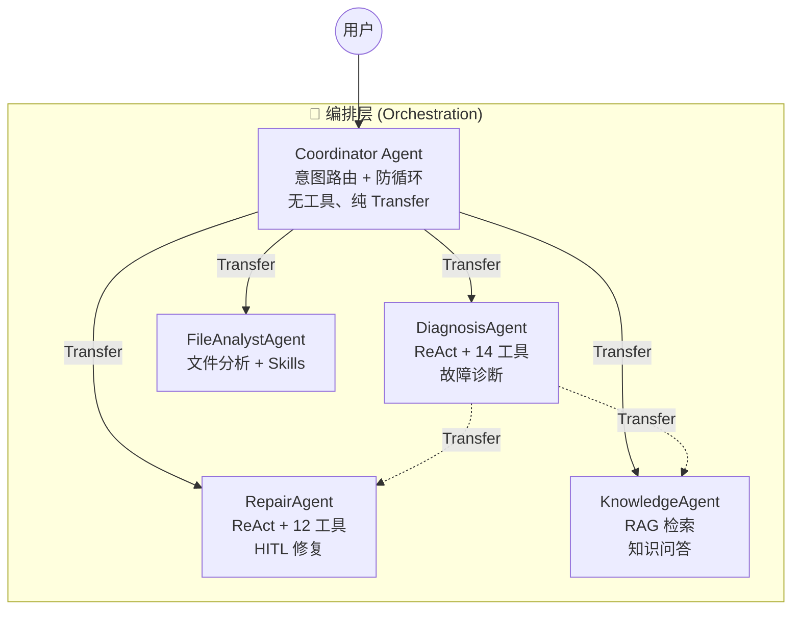
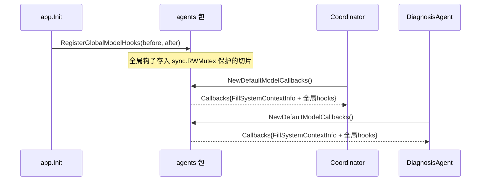
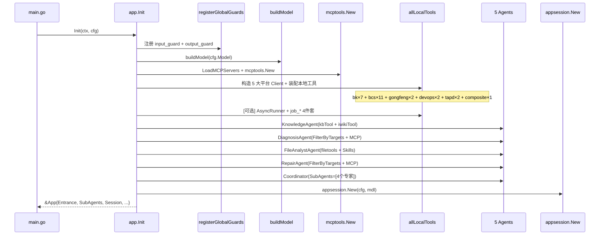
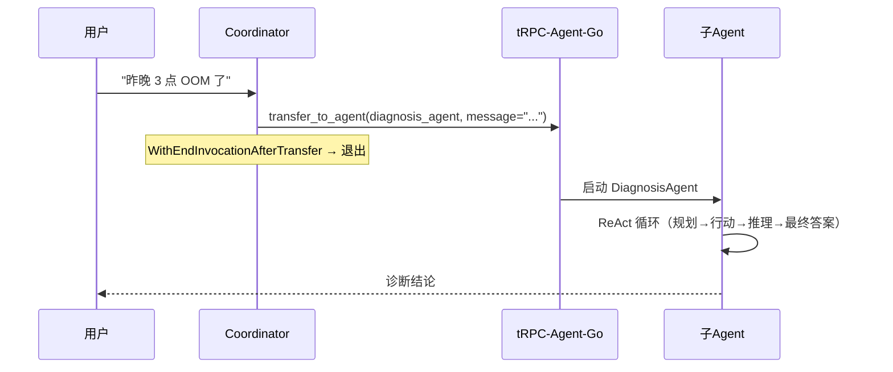
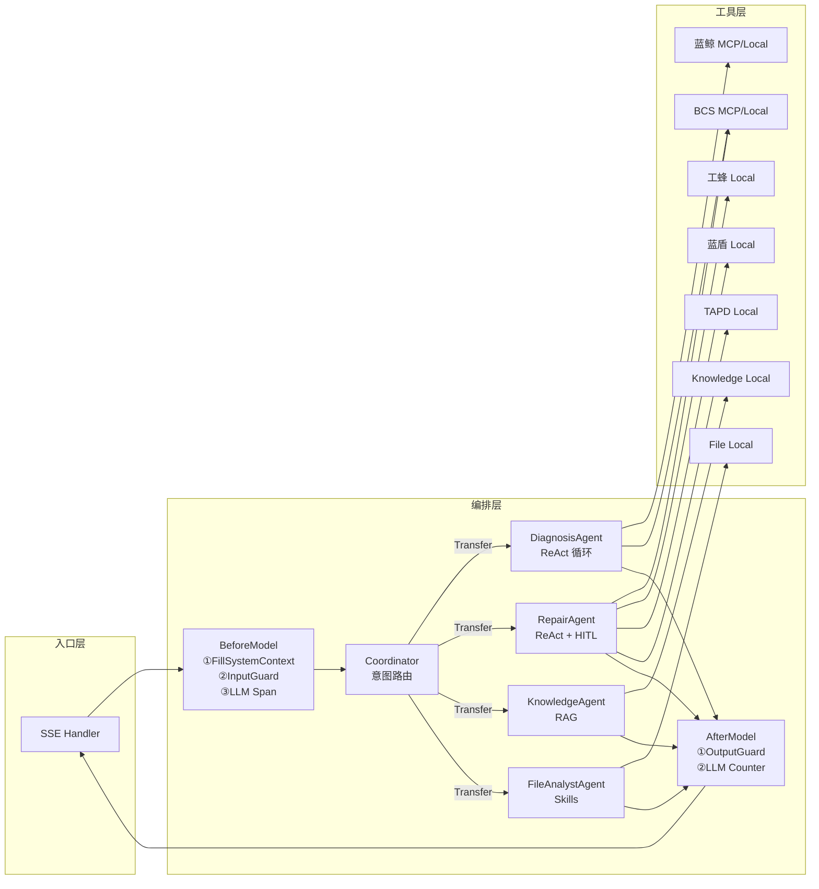

# 02 — Agent 编排层

> 覆盖范围：Coordinator 路由、子 Agent 构造、ReAct Planner、Prompt 工程、全局 Model Callbacks、DI 装配  
> 核心文件：`src/agents/` 全部、`src/app/app.go`（Agent 装配段）

---

## 一、编排层总览

编排层是 GameOps Agent 的"大脑"，负责将用户请求路由到正确的专家 Agent，并驱动 Agent 内部的推理-行动循环。



### 1.1 设计原则

| 原则 | 体现 |
|------|------|
| **单一职责** | Coordinator 只做路由，不挂业务工具；每个子 Agent 只关注自己的领域 |
| **防循环** | `WithEndInvocationAfterTransfer(true)` 确保 Transfer 后立即退出当前轮 |
| **统一横切** | 全局 Model Callbacks 一次注册，5 个 Agent 自动继承 InputGuard/OutputGuard |
| **Target 分发** | 工具按 target 标签分组，Agent 按 `FocusedTargets` 按需获取可见工具集 |
| **中文化** | 自定义 ReAct Planner 使用中文标签，面向中文运维工程师 |

---

## 二、目录结构

```
src/agents/
├── common.go                    # 全局 Model Callbacks + GenConfig + 时间上下文注入
├── react.go                     # 中文化 ReAct Planner（自定义实现）
├── coordinator/
│   ├── agent.go                 # Coordinator Agent 构造
│   └── system_prompt.md         # Coordinator 路由 Prompt
├── diagnosis_agent/
│   ├── agent.go                 # DiagnosisAgent 构造
│   ├── system_prompt.md         # 诊断 Prompt（291 行，含工具使用规范）
│   └── prompt_test.go           # Prompt 模板单测
├── repair_agent/
│   ├── agent.go                 # RepairAgent 构造
│   ├── system_prompt.md         # 修复 Prompt（417 行，含 HITL 规范 + 工具决策树）
│   └── prompt_test.go           # Prompt 模板单测
├── knowledge_agent/
│   ├── agent.go                 # KnowledgeAgent 构造
│   └── system_prompt.md         # 知识问答 Prompt
└── file_analyst_agent/
    ├── agent.go                 # FileAnalystAgent 构造
    └── system_prompt.md         # 文件分析 Prompt
```

---

## 三、自定义实现：中文化 ReAct Planner

> 文件：[react.go](D:/UGit/Go-Agent/project-agent/src/agents/react.go)

### 3.1 设计动机

框架原生 `planner/react` 使用英文标签（`***Planning***` / `***Reasoning***` / `***Action***` / `***Final Answer***`），但本项目面向中文运维工程师，需要：

1. 推理过程直接可读，无需 LLM 额外翻译
2. 降低 Token 消耗（中文标签比英文短）
3. 保持与框架 `planner.Planner` 接口的完全兼容

### 3.2 中文标签定义

```go
const (
    PlanningTag    = "\n***规划***\n"
    ReplanningTag  = "\n***重新规划***\n"
    ReasoningTag   = "\n***推理***\n"
    ActionTag      = "\n***行动***\n"
    FinalAnswerTag = "\n***最终答案***\n"
)
```

### 3.3 接口实现

`ReactPlanner` 实现了框架的 `planner.Planner` 接口，包含两个核心方法：

```go
// 编译期接口检查
var _ planner.Planner = (*ReactPlanner)(nil)

type ReactPlanner struct{}
```

#### `BuildPlanningInstruction` — 生成规划指令

在每次 LLM 请求的 System Prompt 末尾追加结构化的规划指令，指导 LLM 按 ReAct 范式输出：

```
回答问题时，优先使用提供的工具收集信息，而不是仅依赖模型记忆。

请按以下流程回答：(1) 先用自然语言制定一份计划；(2) 然后使用工具执行计划，
在工具调用之间进行推理，总结当前状态并明确下一步；(3) 最后给出一个最终答案。

请按以下格式组织输出：(1) 规划部分放在 ***规划*** 下；(2) 工具调用放在 ***行动*** 下，
推理放在 ***推理*** 下；(3) 最终答案放在 ***最终答案*** 下。
```

指令由 7 个子模块拼接而成：

| 子模块 | 职责 |
|--------|------|
| `buildHighLevelPreamble` | 总体流程说明（规划→行动→最终答案） |
| `buildPlanningPreamble` | 规划要求（编号列表、可修订） |
| `buildActionPreamble` | 行动要求（第一人称声明、结果总结） |
| `buildReasoningPreamble` | 推理要求（基于工具输出总结进展） |
| `buildFinalAnswerPreamble` | 最终答案要求（精确、遵循格式） |
| `buildToolCodePreamble` | 工具调用约束（合法、自包含、不引用外部库） |
| `buildUserInputPreamble` | 补充约束（主动澄清、避免重复调用） |

#### `ProcessPlanningResponse` — 响应后处理

过滤掉 LLM 返回的无名工具调用（`Function.Name == ""`），防止框架层因空名 ToolCall 报错：

```go
func (p *ReactPlanner) ProcessPlanningResponse(
    _ context.Context,
    _ *agent.Invocation,
    response *model.Response,
) *model.Response {
    // 遍历 Choices，过滤掉 Name 为空的 ToolCall
    for i, choice := range response.Choices {
        var filtered []model.ToolCall
        for _, tc := range choice.Message.ToolCalls {
            if tc.Function.Name != "" {
                filtered = append(filtered, tc)
            }
        }
        processed.Choices[i].Message.ToolCalls = filtered
    }
    return &processed
}
```

### 3.4 使用方式

DiagnosisAgent 和 RepairAgent 在构造时注入：

```go
llmagent.WithPlanner(agents.NewReactPlanner())
```

KnowledgeAgent 和 FileAnalystAgent **不使用** Planner（它们的任务较简单，不需要多步推理链）。

---

## 四、自定义实现：全局 Model Callbacks

> 文件：[common.go](D:/UGit/Go-Agent/project-agent/src/agents/common.go)

### 4.1 设计动机

`input_guard`（Prompt Injection 检测）和 `output_guard`（PII 脱敏）需要挂到**每个** Agent 的 `model.Callbacks` 上。为避免在 5 个 Agent 里重复样板代码，采用"全局注册 + 统一入口"模式：



### 4.2 时间上下文注入 — `FillSystemContextInfo`

```go
var FillSystemContextInfo = func(ctx context.Context, req *agentmodel.Request) (*agentmodel.Response, error) {
    suffix := timeContextSuffix()
    for i, msg := range req.Messages {
        if msg.Role == agentmodel.RoleSystem {
            req.Messages[i].Content = req.Messages[i].Content + suffix
        }
    }
    return nil, nil
}
```

在每次 LLM 调用前，向 System 消息追加：

```
## 上下文信息
- 当前日期: 2026-06-08 17:59:24
- 当前时间戳(ms): 1749379164000
- 今日开始时间戳(ms): 1749312000000
```

**作用**：帮助 LLM 理解「凌晨 3 点」「过去 1 小时」等时序语义，精确构造时间窗口查询。

### 4.3 全局钩子注册机制

```go
var (
    globalModelMu          sync.RWMutex
    globalBeforeModelHooks []agentmodel.BeforeModelCallbackStructured
    globalAfterModelHooks  []agentmodel.AfterModelCallbackStructured
)

// app 层调用一次
func RegisterGlobalModelHooks(
    before []agentmodel.BeforeModelCallbackStructured,
    after []agentmodel.AfterModelCallbackStructured,
)

// 各 Agent 构造时统一调用
func NewDefaultModelCallbacks() *agentmodel.Callbacks {
    cb := agentmodel.NewCallbacks().
        RegisterBeforeModel(FillSystemContextInfo) // 时间上下文始终第一个

    // 追加全局 before hooks（input_guard + LLM span）
    for _, h := range before { cb.RegisterBeforeModel(h) }
    // 追加全局 after hooks（output_guard + LLM counter）
    for _, h := range after { cb.RegisterAfterModel(h) }
    return cb
}
```

### 4.4 GenConfig 封装

```go
type GenConfig struct {
    Temperature float64  // [0.0, 2.0]，典型 0.1~0.8
    TopP        float64  // [0.0, 1.0]
    MaxTokens   int      // 0 表示不限制
    Stream      bool     // 是否流式输出
}

func BuildGenConfig(cfg GenConfig) agentmodel.GenerationConfig
```

将业务层配置转为框架原生 `GenerationConfig`，集中管理避免各 Agent 重复转换。

---

## 五、Coordinator Agent — 意图路由器

> 文件：[coordinator/agent.go](D:/UGit/Go-Agent/project-agent/src/agents/coordinator/agent.go)

### 5.1 核心特征

| 特征 | 说明 |
|------|------|
| **无工具** | 不挂任何业务工具，只使用框架内置的 `transfer_to_agent` |
| **纯路由** | 通过 Prompt 驱动意图识别，将请求分发到 4 个子 Agent |
| **防循环** | `WithEndInvocationAfterTransfer(true)` — Transfer 后立即结束本轮 |
| **并行工具** | `WithEnableParallelTools(true)` — 虽然只有 transfer，保持一致性 |

### 5.2 构造代码

```go
func New(dep Dep) (agent.Agent, error) {
    prompt := defaultSystemPrompt  // embed system_prompt.md
    if dep.SystemPrompt != "" {
        prompt = dep.SystemPrompt  // 支持配置中心热更新
    }

    modelCallbacks := agents.NewDefaultModelCallbacks()

    return llmagent.New(
        AgentName,  // "coordinator"
        llmagent.WithModel(dep.Model),
        llmagent.WithDescription(agentDesc),
        llmagent.WithInstruction(prompt),
        llmagent.WithGenerationConfig(agents.BuildGenConfig(dep.GenConfig)),
        llmagent.WithModelCallbacks(modelCallbacks),
        llmagent.WithSubAgents(dep.SubAgents),  // 4 个专家 Agent
        llmagent.WithEnableParallelTools(true),
        llmagent.WithEndInvocationAfterTransfer(true),  // D7: 防循环
    ), nil
}
```

### 5.3 路由决策规则（Prompt 工程）

Coordinator 的 System Prompt 定义了 5 级优先路由规则：

```
Rule 1: 用户附带文件/图片 → file_analyst_agent
Rule 2: 用户明确要求修复/回滚/创建 MR → repair_agent
Rule 3: 用户描述故障现象、要求定位根因 → diagnosis_agent
Rule 4: 用户问"怎么做"/"是什么"/"为什么" → knowledge_agent
Rule 5: 兜底 → knowledge_agent
```

**执行纪律**：
- 单轮只发起一次 Transfer
- Transfer 的 `message` 字段必须转述用户原始意图（不是"请处理"）
- 不做 Transfer 循环（从子 Agent 拿到"需确认"的输出直接回给用户）
- 多步任务由子 Agent 之间接力，不由 Coordinator 同轮多次调度

---

## 六、DiagnosisAgent — 故障诊断专家

> 文件：[diagnosis_agent/agent.go](D:/UGit/Go-Agent/project-agent/src/agents/diagnosis_agent/agent.go)

### 6.1 核心特征

| 特征 | 说明 |
|------|------|
| **ReAct Planner** | 中文化规划-推理-行动循环 |
| **14 只读工具** | bk-monitor × 6 + bcs-read × 5 + tapd-read × 1 + 通用 × 2 |
| **并行工具** | `WithEnableParallelTools(true)` — 同时查多个数据源 |
| **会话摘要** | `WithAddSessionSummary(true)` — 长对话自动压缩 |
| **MCP + 本地混合** | MCP ToolSet（Helm 只读）+ 本地 FunctionTool（BCS 读） |

### 6.2 Target 分发

```go
var FocusedTargets = []string{"bk-monitor", "bcs-read", "tapd-read", "*"}
```

通过 `tools.FilterByTargets(allLocalTools, FocusedTargets)` 在 app 层按需过滤，DiagnosisAgent 只能看到只读工具。

### 6.3 MCP ToolSet 加载

```go
func collectToolSets(mt mcptools.API) []tool.ToolSet {
    var toolSets []tool.ToolSet
    seen := map[string]struct{}{}
    for _, target := range FocusedTargets {
        for _, name := range mt.GetMCPListByTarget(target) {
            if _, ok := seen[name]; ok { continue }
            seen[name] = struct{}{}
            if ts := mt.GetMCPToolsByName(name); ts != nil {
                toolSets = append(toolSets, ts)
            }
        }
    }
    return toolSets
}
```

**去重逻辑**：同一个 MCP Server 可能被多个 target 引用，`seen` map 确保不重复加载。

### 6.4 Prompt 工程亮点（291 行）

DiagnosisAgent 的 System Prompt 是最长的，包含：

1. **工具使用规范**：每个工具的参数说明、典型用途、诊断链路示例
2. **三级诊断链**：`bcs_resource_query` → `bcs_pod_describe` → `bcs_node_describe`
3. **双源日志聚合**：`logs_unified_query` 跨源对齐时间线
4. **诊断方法论**：
   - Step 1：并行信息收集（3~5 个查询）
   - Step 2：交叉验证与归因
   - Step 3：结构化结论输出（根因/证据/建议/置信度）
5. **Transfer 规则**：诊断完成后可主动 Transfer 给 repair_agent

---

## 七、RepairAgent — 全链路自动修复专家

> 文件：[repair_agent/agent.go](D:/UGit/Go-Agent/project-agent/src/agents/repair_agent/agent.go)

### 7.1 核心特征

| 特征 | 说明 |
|------|------|
| **ReAct Planner** | 中文化规划-推理-行动循环 |
| **12 写工具** | bcs-write × 6 + bk-write × 1 + gongfeng × 2 + devops × 2 + tapd × 1 |
| **串行工具** | `WithEnableParallelTools(false)` — 修复有副作用，串行更安全 |
| **强制 HITL** | 所有写操作必须走两段式确认 |
| **safety_guard** | Agent 级 tool.Callbacks 拦截高危操作 |

### 7.2 Target 分发

```go
var FocusedTargets = []string{"bcs-write", "bk-write", "gongfeng", "devops", "tapd", "tapd-read", "*"}
```

### 7.3 关键设计决策：串行工具执行

```go
llmagent.WithEnableParallelTools(false) // 修复流程有副作用，串行更安全
```

**原因**：修复操作有严格的顺序依赖（如先 rollback 再 scale），并行执行可能导致竞态条件。

### 7.4 Prompt 工程亮点（417 行，最长）

RepairAgent 的 System Prompt 是整个系统中最复杂的，包含：

1. **安全红线**（6 条铁律）：绝不自动合并 MR、绝不 force push 等
2. **工具选择决策树**（D26）：按用户诉求语义自顶向下选择正确工具
3. **误区自检表**：常见选错场景对照
4. **统一生产红线**：Critical 自动触发条件、生产 ns 识别规则
5. **每个工具的详细规范**：参数说明、Severity 分级、典型链路
6. **标准修复流程**：Plan→Confirm→Execute→Observe→Report
7. **异步执行规范**：何时用 `job_submit`、三条铁律

---

## 八、KnowledgeAgent — 运维知识专家

> 文件：[knowledge_agent/agent.go](D:/UGit/Go-Agent/project-agent/src/agents/knowledge_agent/agent.go)

### 8.1 核心特征

| 特征 | 说明 |
|------|------|
| **无 Planner** | 任务简单，不需要多步推理链 |
| **RAG 检索** | 本地 knowledge_search + iWiki 工具 |
| **仅通用 MCP** | 只加载 target="*" 的 MCP ToolSet |
| **并行工具** | `WithEnableParallelTools(true)` |
| **Stub 降级** | 知识库未就绪时自动降级为模型常识回答 |

### 8.2 工具加载（仅通用）

```go
// 知识问答只加载通用工具（target="*"）
var toolSets []tool.ToolSet
if dep.MCPTool != nil {
    for _, name := range dep.MCPTool.GetMCPListByTarget("*") {
        if ts := dep.MCPTool.GetMCPToolsByName(name); ts != nil {
            toolSets = append(toolSets, ts)
        }
    }
}
```

### 8.3 Prompt 工程亮点

1. **Agentic RAG 流程**：判断是否需要检索 → 检索 → 基于检索回答
2. **CRAG 策略**：首轮结果不相关时改写 query 重新检索
3. **Stub 降级处理**：`knowledge_search` 返回 `stub: true` 时明确告知用户
4. **严禁幻觉**：没有证据支撑的内容不输出
5. **概念 vs 场景区分**：概念性问题自己答，场景性问题 Transfer 给 diagnosis_agent

---

## 九、FileAnalystAgent — 文件分析专家

> 文件：[file_analyst_agent/agent.go](D:/UGit/Go-Agent/project-agent/src/agents/file_analyst_agent/agent.go)

### 9.1 核心特征

| 特征 | 说明 |
|------|------|
| **无 Planner** | 文件分析流程相对固定 |
| **Skills 技能系统** | 可选注入 FSRepository + CodeExecutor |
| **本地工具** | file_detect / file_read_slice / json_query / log_analyze |
| **并行工具** | `WithEnableParallelTools(true)` |
| **优雅降级** | Skills 缺失时回退到"仅 FunctionTool"模式 |

### 9.2 Skills 条件注入

```go
opts := []llmagent.Option{...}
if dep.SkillRepo != nil && dep.CodeExecutor != nil {
    opts = append(opts,
        llmagent.WithSkills(dep.SkillRepo),
        llmagent.WithCodeExecutor(dep.CodeExecutor),
    )
}
```

**设计**：两者必须同时非 nil 才启用，缺失时静默降级，不阻塞启动。

### 9.3 Prompt 工程亮点

1. **强制 file_detect 前置**：所有文件分析任务第一步必须调用 `file_detect`
2. **按类型分支**：log → `log_analyze`；json → `json_query`；yaml → `file_read_slice`；binary → 拒绝
3. **结构化输出**：文件类型 + 核心发现 + 关键数据表格 + 建议下一步

---

## 十、DI 装配流程（app.go）

> 文件：[app.go](D:/UGit/Go-Agent/project-agent/src/app/app.go)

### 10.1 装配时序图



### 10.2 关键装配代码解析

#### Step 0：全局 Guard 注册

```go
inGuard, outGuard := registerGlobalGuards()
```

在任何 Agent 构造之前完成，确保后续 `NewDefaultModelCallbacks()` 能拾取到钩子。

#### Step 1：LLM Model 构造

```go
mdl := buildModel(cfg.Model)
```

使用 `openaimodel.New`，支持 OpenAI 兼容协议（混元/DeepSeek/Anthropic/Gemini/Ollama）。

#### Step 2：MCP + 本地工具装配

```go
// MCP 远程工具
mcpTool, _ := mcptools.New(ctx, mcpConfigs)

// 本地工具（带 target 标签）
allLocalTools = append(allLocalTools, bktools.NewAllTargeted(bkClient)...)
allLocalTools = append(allLocalTools, bcstools.NewAllTargetedWithWaiter(bcsClient, readyWaiter)...)
allLocalTools = append(allLocalTools, gongfengtools.NewAllTargeted(gongfengClient)...)
allLocalTools = append(allLocalTools, compositetools.NewAllTargeted(bkClient, bcsClient)...)
allLocalTools = append(allLocalTools, devopstools.NewAllTargeted(devopsClient)...)
allLocalTools = append(allLocalTools, tapdtools.NewAllTargeted(tapdClient)...)
```

#### Step 3：Agent 级插件装配

```go
func buildAgentCallbacks(agentName string) *tool.Callbacks {
    cb := tool.NewCallbacks()
    // 1. safety_guard：拦截高危操作
    appplugin.NewSafetyGuard(...).Register(cb)
    // 2. audit_hook：审计记录
    appplugin.NewAuditHook(...).Register(cb)
    // 3. OTel Tool Span：可观测性
    beforeTool, afterTool := observability.NewToolSpanCallback()
    cb.RegisterBeforeTool(beforeTool)
    cb.RegisterAfterTool(afterTool)
    return cb
}
```

#### Step 4：Agent 构造 + Target 过滤

```go
// DiagnosisAgent 只拿只读工具
diagnosisA, _ := diagnosis.New(diagnosis.Dep{
    LocalTools: tools.FilterByTargets(allLocalTools, diagnosis.FocusedTargets),
    // ["bk-monitor", "bcs-read", "tapd-read", "*"]
})

// RepairAgent 拿写工具
repairA, _ := repair.New(repair.Dep{
    LocalTools: tools.FilterByTargets(allLocalTools, repair.FocusedTargets),
    // ["bcs-write", "bk-write", "gongfeng", "devops", "tapd", "tapd-read", "*"]
})
```

#### Step 5：Coordinator 组装

```go
subAgents := []agent.Agent{knowledgeA, diagnosisA, fileA, repairA}
entrance, _ := coordinator.New(coordinator.Dep{
    Model:     mdl,
    GenConfig: gen,
    SubAgents: subAgents,
})
```

---

## 十一、框架能力使用总结

### 11.1 使用的框架包

| 框架包 | 用途 |
|--------|------|
| `trpc-agent-go/agent` | Agent 接口定义 |
| `trpc-agent-go/agent/llmagent` | LLM Agent 构造器（核心） |
| `trpc-agent-go/model` | Request/Response/Callbacks 模型 |
| `trpc-agent-go/model/openai` | OpenAI 兼容 Model 实现 |
| `trpc-agent-go/planner` | Planner 接口定义 |
| `trpc-agent-go/runner` | Agent 执行器 |
| `trpc-agent-go/tool` | Tool/ToolSet/Callbacks 接口 |
| `trpc-agent-go/session` | Session 服务接口 |
| `trpc-agent-go/skill` | FSRepository 技能仓库 |
| `trpc-agent-go/codeexecutor` | 代码执行器接口 |
| `trpc-agent-go/event` | 事件模型 |

### 11.2 使用的框架 Option 一览

| Option | 使用者 | 说明 |
|--------|--------|------|
| `WithModel` | 全部 | 注入 LLM Model |
| `WithDescription` | 全部 | Agent 描述（Transfer 时展示） |
| `WithInstruction` | 全部 | System Prompt |
| `WithGenerationConfig` | 全部 | 温度/TopP/MaxTokens/Stream |
| `WithModelCallbacks` | 全部 | BeforeModel/AfterModel 钩子 |
| `WithSubAgents` | Coordinator | 注册子 Agent |
| `WithEndInvocationAfterTransfer` | Coordinator | Transfer 后结束本轮 |
| `WithTools` | 除 Coordinator | 本地 FunctionTool |
| `WithToolSets` | Diagnosis/Repair/Knowledge | MCP ToolSet |
| `WithPlanner` | Diagnosis/Repair | ReAct Planner |
| `WithEnableParallelTools` | 全部 | 并行/串行工具调用 |
| `WithAddSessionSummary` | Diagnosis | 长对话自动摘要 |
| `WithToolCallbacks` | Diagnosis/Repair/FileAnalyst | Agent 级工具钩子 |
| `WithSkills` | FileAnalyst | 技能仓库 |
| `WithCodeExecutor` | FileAnalyst | 代码执行器 |

### 11.3 框架原生 Transfer/Handoff 机制

Coordinator 通过框架内置的 `transfer_to_agent` 工具实现路由：



---

## 十二、Agent 对比矩阵

| 维度 | Coordinator | DiagnosisAgent | RepairAgent | KnowledgeAgent | FileAnalystAgent |
|------|-------------|----------------|-------------|----------------|------------------|
| **Planner** | ❌ | ✅ ReAct | ✅ ReAct | ❌ | ❌ |
| **工具数** | 0（仅 transfer） | 14 只读 | 12 写 | 2（RAG） | 4 本地 |
| **MCP** | ❌ | ✅ | ✅ | ✅（仅 *） | ❌ |
| **并行工具** | ✅ | ✅ | ❌（串行） | ✅ | ✅ |
| **HITL** | ❌ | ❌ | ✅ 强制 | ❌ | ❌ |
| **Skills** | ❌ | ❌ | ❌ | ❌ | ✅ 可选 |
| **ToolCallbacks** | ❌ | ✅ 防御前置 | ✅ 必须 | ❌ | ✅ 可选 |
| **SessionSummary** | ❌ | ✅ | ❌ | ❌ | ❌ |
| **EndAfterTransfer** | ✅ | ❌ | ❌ | ❌ | ❌ |
| **Prompt 行数** | 75 | 291 | 417 | 71 | 103 |

---

## 十三、设计亮点与工程实践

### 13.1 Prompt 即配置

所有 Agent 的 System Prompt 通过 `//go:embed` 嵌入，同时支持 `dep.SystemPrompt` 覆盖：

```go
//go:embed system_prompt.md
var defaultSystemPrompt string

func New(dep Dep) (agent.Agent, error) {
    prompt := defaultSystemPrompt
    if dep.SystemPrompt != "" {
        prompt = dep.SystemPrompt  // 配置中心热更新
    }
    ...
}
```

**好处**：
- 开发期：Prompt 作为 Markdown 文件，可独立编辑、版本管理、Code Review
- 运行期：支持从配置中心动态下发，无需重新编译

### 13.2 防御性设计

1. **编译期接口检查**：`var _ planner.Planner = (*ReactPlanner)(nil)`
2. **线程安全**：全局钩子用 `sync.RWMutex` 保护
3. **幂等重置**：`ResetGlobalModelHooks()` 支持多次 Init 或热重载
4. **nil 安全**：所有可选依赖（MCPTool/SkillRepo/ToolCallbacks）缺失时静默降级

### 13.3 可测试性

- `timeContextSuffix()` 和 `fmtTemplate()` 独立函数便于单测
- `prompt_test.go` 验证 Prompt 模板渲染正确性
- `ResetGlobalModelHooks()` 让测试间互不干扰

---

## 十四、数据流全景



---

## 十五、总结

Agent 编排层的核心设计哲学是**"框架做骨架，自定义做灵魂"**：

- **框架提供**：Agent 生命周期管理、Transfer/Handoff 机制、Tool 调用链、Session 管理、Model 抽象
- **自定义实现**：中文化 ReAct Planner、全局 Model Callbacks 装饰器、Target 分发机制、Prompt 工程

这种分层使得：
1. 框架升级时业务代码改动最小（只需适配 Option 变化）
2. 新增 Agent 只需定义 Prompt + 声明 FocusedTargets，复用全部基础设施
3. 横切关注（Guard/Audit/OTel）一次注册全局生效，零侵入
