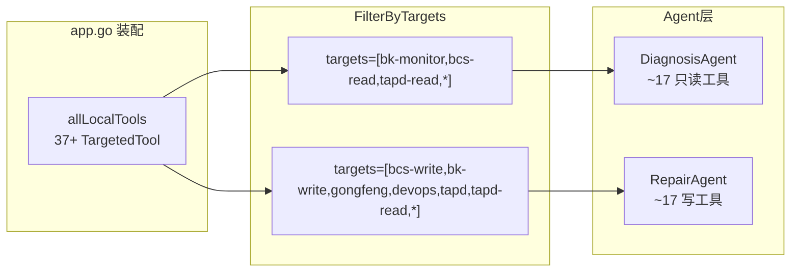
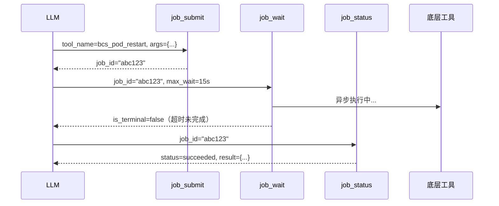
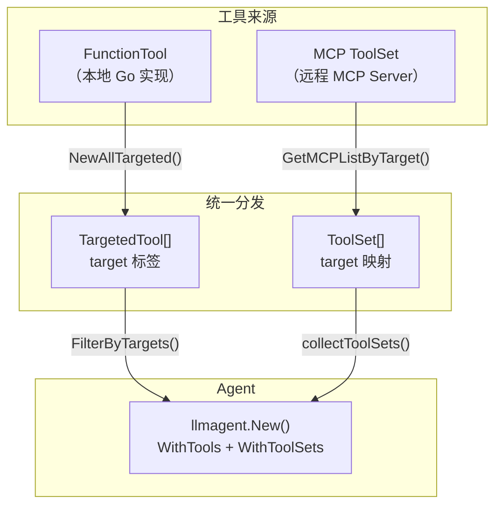
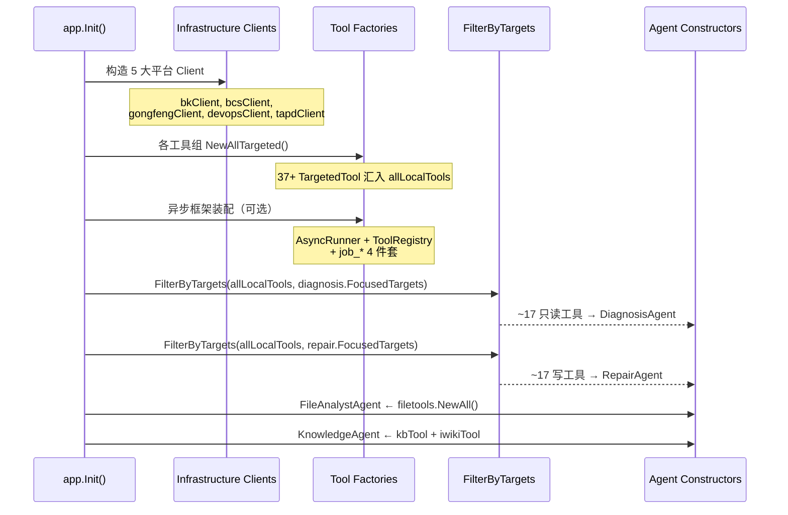
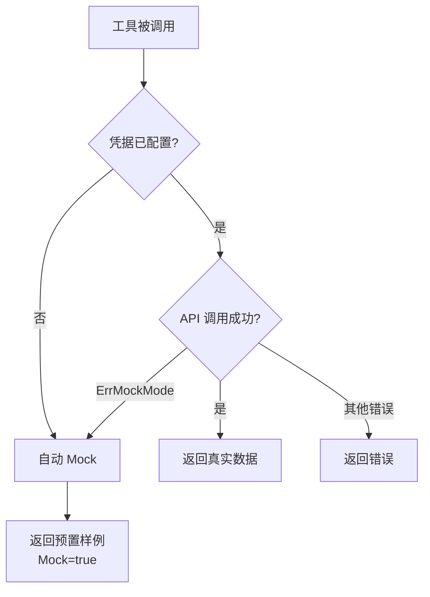
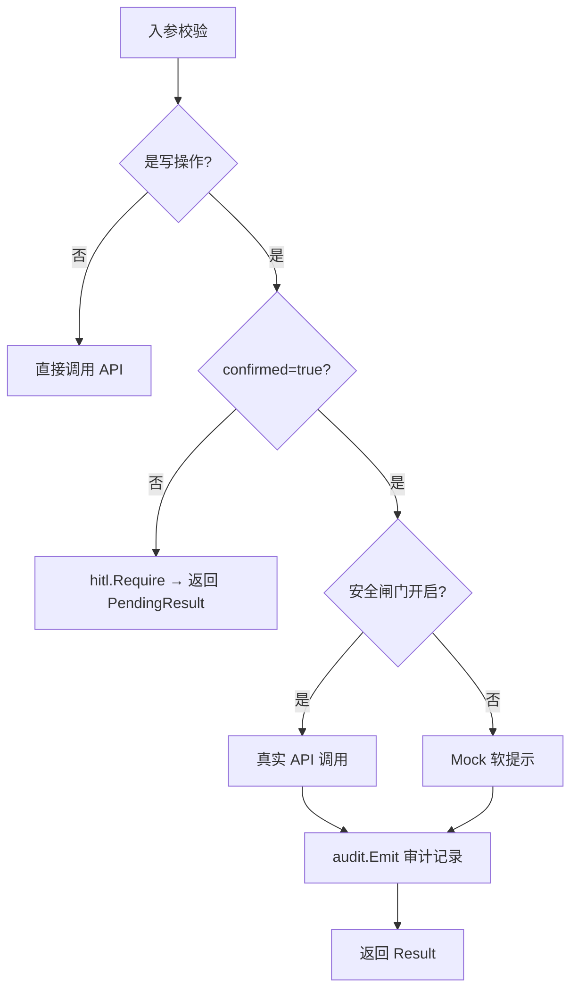

---

# 03 — 工具层与 Target 分发

## 一、概述

工具层是 GameOps Agent 的"手脚"——Agent 编排层通过 LLM 决策选择工具，工具层负责真正与外部平台交互。本文档覆盖：

1. **TargetedTool 分发机制**：按 target 标签将工具精准分配给不同 Agent
2. **9 大工具组**：37+ 个 FunctionTool 的完整清单与设计模式
3. **MCP 工具管理**：远程 MCP Server 的配置、加载与 target 映射
4. **Metrics 中间件**：工具调用可观测性的装饰器模式
5. **装配层集成**：app.go 如何将工具注入各 Agent

---

## 二、核心架构：TargetedTool 分发机制

### 2.1 设计动机

Agent 系统中工具数量达 37+，如果全部挂给每个 Agent，会导致：
- LLM 工具选择准确率下降（选择空间过大）
- 安全风险（诊断 Agent 不应看到写操作工具）
- 上下文浪费（工具声明占用 token）

解决方案：**按 target 标签分组，Agent 只看到自己关注的工具子集**。

### 2.2 核心代码

**文件**：[targeted.go](D:/UGit/Go-Agent/project-agent/src/tools/targeted.go)

```go
// TargetedTool 带 target 标签的工具。
type TargetedTool struct {
    Target string
    Tool   tool.Tool
}

// Target 约定：
//   - "bk-monitor"  蓝鲸监控（诊断用）
//   - "bcs-read"    BCS 容器只读（诊断用）
//   - "bcs-write"   BCS 容器写操作（修复用）
//   - "gongfeng"    工蜂 Git（修复用）
//   - "devops"      蓝盾 CI/CD（修复用）
//   - "tapd"        TAPD（修复用）
//   - "*"           所有 Agent 都可见的通用工具
```

**过滤函数**：

```go
func FilterByTargets(targetedTools []TargetedTool, targets []string) []tool.Tool {
    // targets 为空 → 返回空列表
    // targets 含 "*" → 返回全部工具
    // 否则 → 精确匹配 target 字段（工具自身标记为 "*" 也会被选中）
}
```

### 2.3 Agent 的 FocusedTargets 配置

| Agent | FocusedTargets | 可见工具数 |
|-------|---------------|-----------|
| **DiagnosisAgent** | `["bk-monitor", "bcs-read", "tapd-read", "*"]` | ~17（6 蓝鲸读 + 6 BCS 读 + 1 聚合 + 4 异步） |
| **RepairAgent** | `["bcs-write", "bk-write", "gongfeng", "devops", "tapd", "tapd-read", "*"]` | ~17（7 BCS 写 + 1 蓝鲸写 + 2 工蜂 + 2 蓝盾 + 1 TAPD 写 + 4 异步） |
| **KnowledgeAgent** | 独立注入（本地 knowledge + iWiki） | 2 |
| **FileAnalystAgent** | 独立注入（file_tools） | 4 |

### 2.4 分发流程图



---

## 三、9 大工具组详解

### 3.1 BCS 工具组（13 个）

**文件**：[bcs_tools.go](D:/UGit/Go-Agent/project-agent/src/tools/bcs_tools/bcs_tools.go)

**设计划分**：

| Target | 工具名 | 文件 | 职责 |
|--------|--------|------|------|
| `bcs-read` | `bcs_project_query` | `project.go` | 项目元数据查询 |
| `bcs-read` | `bcs_cluster_query` | `cluster.go` | 集群列表/详情 |
| `bcs-read` | `bcs_resource_query` | `resource.go` | K8s 资源通用查询 |
| `bcs-read` | `bcs_pod_logs_tail` | `pod_logs_tail.go` | Pod 日志拉取（诊断链核心） |
| `bcs-read` | `bcs_pod_describe` | `pod_describe.go` | Pod 深度诊断（Events+结构化 Summary） |
| `bcs-read` | `bcs_node_describe` | `node_describe.go` | Node 深度诊断（Conditions/Capacity/Taints） |
| `bcs-write` | `bcs_helm_manage` | `helm.go` | Helm Release 部署/回滚/卸载 |
| `bcs-write` | `bcs_scale_deployment` | `scale.go` | Deployment 副本伸缩 |
| `bcs-write` | `bcs_pod_restart` | `pod_restart.go` | Pod 重启/滚动/驱逐 |
| `bcs-write` | `bcs_configmap_update` | `configmap_update.go` | ConfigMap 热更/快照/回滚 |
| `bcs-write` | `bcs_secret_update` | `secret_update.go` | Secret 热更（base64 自动编码+脱敏审计） |
| `bcs-write` | `bcs_hpa_patch` | `hpa_patch.go` | HPA 写操作（改 min/max/冻结） |
| `bcs-write` | `bcs_network_update` | `network_update.go` | 网络层统一更新（Service/Ingress patch） |

**工厂函数设计**：

```go
// 标准入口：使用默认 ReadyWaiter
func NewAllTargeted(client *bcsapi.Client) []tools.TargetedTool

// 可注入 Waiter 的入口（D19.8 抽象可替换性验证）
func NewAllTargetedWithWaiter(client *bcsapi.Client, waiter ReadyWaiter) []tools.TargetedTool
```

**Metrics 包装**：所有 13 个工具在工厂函数末尾统一经过 `wrapMetrics()` 装饰，自动获得可观测性指标。

#### 3.1.1 ReadyWaiter 抽象

**文件**：[ready_waiter.go](D:/UGit/Go-Agent/project-agent/src/tools/bcs_tools/ready_waiter.go)、[fast_poll_waiter.go](D:/UGit/Go-Agent/project-agent/src/tools/bcs_tools/fast_poll_waiter.go)

三个写工具（helm/scale/pod_restart）都支持 `wait_for_ready=true`，等待 Deployment 收敛到就绪状态。

```go
// ReadyWaiter 接口定义
type ReadyWaiter interface {
    Wait(ctx context.Context, spec ReadySpec) (ready bool, err error)
}

// ReadySpec 描述等待条件
type ReadySpec struct {
    Mode       string  // "delete_pod" / "rollout_restart" / "scale_deployment" / "helm_rollback"
    ClusterID  string
    Namespace  string
    Deployment string
    // ...
}
```

**两种实现**：

| 实现 | 策略 | 感知延迟 | 适用场景 |
|------|------|---------|---------|
| `bcsReadyWaiter` | 固定 2s 轮询 + ±20% jitter | ~1s | 传统稳态 |
| `FastPollWaiter` | 阶梯退避（0→250ms→500ms→1s→2s） | ~125ms | 快场景优化 |

**装配层切换**（环境变量 `GAMEOPS_READY_WAITER`）：
- `"fast"` 或未设置 → FastPollWaiter（默认）
- `"poll"` → 传统轮询
- `"noop"` → 禁用等待（紧急逃生通道）

#### 3.1.2 写工具典型模式（以 Helm 为例）

**文件**：[helm.go](D:/UGit/Go-Agent/project-agent/src/tools/bcs_tools/helm.go)

```go
func newHelmToolWithWaiter(client *bcsapi.Client, waiter ReadyWaiter) tool.Tool {
    fn := func(ctx context.Context, in HelmInput) (*Result, error) {
        // 1. 入参校验
        if action == "" || in.ClusterID == "" {
            return nil, fmt.Errorf("action 和 cluster_id 为必填项")
        }

        // 2. HITL 安全门（写操作必经）
        writeOps := map[string]bool{"rollback": true, "install": true, "uninstall": true}
        if writeOps[action] {
            p := buildHelmPlan(in, action)
            if pending, need := hitl.Require(in.Confirmed, p); need {
                return &Result{OK: false, Message: pending.Message, Data: pending}, nil
            }
        }

        // 3. 真实 API 调用（Mock 兜底）
        // ...

        // 4. ReadyWaiter 等待（可选）
        if in.WaitForReady && waiter != nil {
            ready, err := waiter.Wait(ctx, ReadySpec{...})
            // ...
        }

        // 5. 审计记录
        audit.Emit(audit.Event{...})

        return result, nil
    }
    return function.NewFunctionTool(fn, function.WithName("bcs_helm_manage"), ...)
}
```

---

### 3.2 蓝鲸工具组（7 个）

**文件**：[bk_tools.go](D:/UGit/Go-Agent/project-agent/src/tools/bk_tools/bk_tools.go)

| Target | 工具名 | 文件 | 职责 |
|--------|--------|------|------|
| `bk-monitor` | `bk_metrics_query` | `metrics.go` | 指标查询 |
| `bk-monitor` | `bk_log_query` | `log.go` | 日志查询 |
| `bk-monitor` | `bk_alarm_query` | `alarm.go` | 告警查询 |
| `bk-monitor` | `bk_event_query` | `event.go` | 事件查询 |
| `bk-monitor` | `bk_tracing_query` | `tracing.go` | APM Trace 查询 |
| `bk-monitor` | `bk_metadata_query` | `metadata.go` | 元数据（拓扑/主机/模块）查询 |
| `bk-write` | `bk_alarm_silence` | `alarm_silence.go` | 告警静默/抑制/撤销（HITL） |

**读工具典型模式**（以 alarm 为例）：

```go
func newAlarmTool(client *bkapi.Client) tool.Tool {
    fn := func(ctx context.Context, in AlarmInput) (*Result, error) {
        // 1. 入参校验 + 默认值
        if in.BKBizID == 0 { return nil, fmt.Errorf("bk_biz_id 为必填项") }

        // 2. 构造请求体
        reqBody := map[string]any{...}

        // 3. 调用 API（Mock 自动兜底）
        err := client.PostJSON(ctx, "/api/bk-monitor/prod/alert/search/", reqBody, &respData)
        if errors.Is(err, bkapi.ErrMockMode) {
            return mockAlarm(in), nil
        }

        return &Result{OK: true, Data: respData}, nil
    }
    return function.NewFunctionTool(fn, function.WithName("bk_alarm_query"), ...)
}
```

**告警静默工具**（`bk_alarm_silence`）是蓝鲸工具组唯一的写工具，支持 4 种 scope：
- `by_strategy`：按策略 ID 静默（最精准）
- `by_target`：按 IP/Pod/集群静默
- `by_dimension`：按标签静默（最危险，Critical 级别）
- `unsilence`：撤销静默（Low 级别，鼓励使用）

架构级硬上限：`duration_seconds` 最大 24h，防止"永久静默"变成监控黑洞。

---

### 3.3 蓝盾工具组（2 个）

**文件**：[devops_tools.go](D:/UGit/Go-Agent/project-agent/src/tools/devops_tools/devops_tools.go)

| Target | 工具名 | 职责 | Severity |
|--------|--------|------|----------|
| `devops` | `devops_pipeline_rerun` | 重跑流水线 | Medium |
| `devops` | `devops_build_cancel` | 取消正在运行的构建 | Medium |

**双重安全闸门**：
1. HITL 两段式确认
2. 环境变量 `DEVOPS_ALLOW_AUTO_OPS` 必须显式打开才真正下发

```go
func isAutoOpsAllowed() bool {
    switch strings.ToLower(os.Getenv("DEVOPS_ALLOW_AUTO_OPS")) {
    case "1", "true", "yes", "on":
        return true
    }
    return false
}
```

---

### 3.4 工蜂工具组（2 个）

**文件**：[gongfeng_tools.go](D:/UGit/Go-Agent/project-agent/src/tools/gongfeng_tools/gongfeng_tools.go)

| Target | 工具名 | 职责 | Severity |
|--------|--------|------|----------|
| `gongfeng` | `gongfeng_mr_create` | 创建 Merge Request | Medium |
| `gongfeng` | `gongfeng_mr_merge` | 合并 Merge Request | **Critical** |

**团队政策**：MR 合并属于最高危动作，默认不真实下发。需 `GONGFENG_ALLOW_AUTO_MERGE=1` 显式打开。

```go
// 团队政策：合并 MR 属于最高危动作，默认依旧不真实下发，仅输出软提示。
// 仅在显式打开 GONGFENG_ALLOW_AUTO_MERGE=1 时才会调用真实 API。
```

---

### 3.5 TAPD 工具组（2 个）

**文件**：[tapd_tools.go](D:/UGit/Go-Agent/project-agent/src/tools/tapd_tools/tapd_tools.go)

| Target | 工具名 | 职责 | Severity |
|--------|--------|------|----------|
| `tapd-read` | `tapd_bug_query` | 查询缺陷单（只读） | — |
| `tapd` | `tapd_bug_create` | 登记缺陷单（软写） | Low |

**最小破坏面原则**：
- 不提供 `tapd_bug_close` 或 `tapd_bug_update`
- Agent 绝不自动关闭/状态流转单据
- 即便是"软写"（只登记不影响生产），仍走 HITL

---

### 3.6 文件工具组（4 个）

**文件**：[file_tools.go](D:/UGit/Go-Agent/project-agent/src/tools/file_tools/file_tools.go)

| Target | 工具名 | 文件 | 职责 |
|--------|--------|------|------|
| `file-local` | `file_detect` | `detect.go` | 文件类型识别 + 基本统计 |
| `file-local` | `file_read_slice` | `read.go` | 分段读取（offset/size） |
| `file-local` | `json_query` | `json_query.go` | JSON 按路径查询 |
| `file-local` | `log_analyze` | `log_analyze.go` | 日志错误分布 + 时间聚集 + 高频模式 |

**安全约束**：
- 所有路径必须位于 `FILE_ANALYZE_ROOT` 白名单下（默认 `data/samples/` 与 `/tmp/`）
- 单次读取字节数硬上限 1 MiB
- 不允许追踪软链接跳出 root

```go
type Config struct {
    AllowRoots   []string  // 允许访问的根目录白名单
    MaxReadBytes int64     // 单次读取字节数硬上限（默认 1 MiB）
}
```

---

### 3.7 聚合工具组（1 个）

**文件**：[composite_tools.go](D:/UGit/Go-Agent/project-agent/src/tools/composite_tools/composite_tools.go)、[logs_unified.go](D:/UGit/Go-Agent/project-agent/src/tools/composite_tools/logs_unified.go)

| Target | 工具名 | 职责 |
|--------|--------|------|
| `bcs-read` | `logs_unified_query` | 双源日志聚合（K8s stdout + 蓝鲸日志平台） |

**为什么独立成包**：
- 跨越 bk 和 bcs 两个 infrastructure 域
- 放在任一原包都要 import 对方，违反"按 target 分组、按 infra 后端分包"原则
- 只 import infrastructure 层（bkapi / bcsapi），不 import bk_tools / bcs_tools

**核心设计**：
1. 并发两路 fetch，任一失败不阻塞另一路（失败隔离）
2. 按时间戳合并排序，统一 `entries[]` 输出
3. 每条带 `source` 字段标识来源（`k8s_stdout` / `bk_log`）

```go
// 输出契约
entries[] {
    source:    "k8s_stdout" | "bk_log"
    timestamp: RFC3339Nano
    pod:       Pod 名
    container: 容器名（仅 k8s_stdout）
    level:     日志级别（仅 bk_log）
    message:   行内容
}
```

---

### 3.8 异步工具组（4 个）

**文件**：[async_tools.go](D:/UGit/Go-Agent/project-agent/src/tools/async_tools/async_tools.go)

| Target | 工具名 | 职责 |
|--------|--------|------|
| `*` | `job_submit` | 异步投递任务，立即返回 JobID |
| `*` | `job_status` | 查询 Job 状态/进度/结果 |
| `*` | `job_cancel` | 取消活动中的 Job |
| `*` | `job_wait` | 半阻塞等待（带超时上限 25s） |

**设计原则**：
- target=`"*"`：控制流元工具，对所有 Agent 都可见
- 非侵入式并列：不改动存量工具，LLM 通过"先 submit，再 status 轮询"达成伪异步
- 白名单校验：`job_submit` 的 `tool_name` 必须是已注册的异步可执行工具

**典型使用流程**：



**装配层注册**：

```go
// 白名单注册：只注册"写操作且耗时 > 10s"的工具
registerAsyncWhitelist(registry, allLocalTools, cfg.Async.AsyncToolNames)
// 追加 job_* 4 件套
allLocalTools = append(allLocalTools, asynctools.NewAllTargeted(asyncRunner, registry)...)
```

---

### 3.9 通用工具组（2 个）

**文件**：[util.go](D:/UGit/Go-Agent/project-agent/src/tools/util_tools/util.go)

| Target | 工具名 | 职责 |
|--------|--------|------|
| `*` | `ParseTimestampMilli` | 时间戳解析（支持毫秒/秒/RFC3339/中文格式） |
| `*` | `EncodeBase64` / `DecodeBase64` | Base64 编解码 |

这些是纯计算工具，不依赖外部 API，对所有 Agent 可见。

---

## 四、MCP 工具管理

### 4.1 架构设计

**文件**：[mcptool.go](D:/UGit/Go-Agent/project-agent/src/tools/mcp_tools/mcptool.go)、[mcptool_impl.go](D:/UGit/Go-Agent/project-agent/src/tools/mcp_tools/mcptool_impl.go)

MCP（Model Context Protocol）工具是远程服务提供的工具，通过 Streamable HTTP 或 SSE 协议连接。

```go
// API 定义了 MCP 工具管理的外部接口
type API interface {
    // 通过 target 获取 MCP 服务名列表
    GetMCPListByTarget(target string) []string
    // 通过服务名获取 ToolSet
    GetMCPToolsByName(mcpName string) tool.ToolSet
    // 返回所有已加载的 ToolSet
    GetAllToolSets() []tool.ToolSet
}
```

### 4.2 配置格式

**文件**：[mcp_servers.yaml](D:/UGit/Go-Agent/project-agent/mcp_servers.yaml)

```yaml
mcp_servers:
  - name: bk-metrics          # 内部唯一名称
    target: bk-monitor         # 目标服务域
    url: ${BK_MCP_METRICS_URL} # 端点地址（支持环境变量）
    transport: streamable      # 传输协议
    timeout: 30                # 连接超时（秒）
    auth_header: X-Bkapi-Authorization
    auth_value: ${BK_APIGW_AUTH}
    enabled: false             # 是否启用
```

### 4.3 ServerConfig 结构

```go
type ServerConfig struct {
    Name         string   `yaml:"name"`          // 唯一标识
    Target       string   `yaml:"target"`        // 目标服务域
    URL          string   `yaml:"url"`           // MCP 端点
    Transport    string   `yaml:"transport"`     // streamable | sse
    TimeoutSec   int      `yaml:"timeout"`       // 连接超时
    AuthHeader   string   `yaml:"auth_header"`   // 认证 Header 名
    AuthValue    string   `yaml:"auth_value"`    // 认证值（支持 ${ENV_VAR}）
    AllowedTools []string `yaml:"allowed_tools"` // 工具白名单
    Enabled      *bool    `yaml:"enabled"`       // 是否启用
}
```

### 4.4 初始化流程

```go
func newImpl(_ context.Context, configs []ServerConfig) (API, error) {
    // 遍历 configs：
    //   1. 跳过 Enabled=false 的
    //   2. 解析 Transport（默认 streamable）
    //   3. 展开 AuthValue 中的 ${ENV_VAR} 占位符
    //   4. 构造 mcp.NewMCPToolSet（框架提供）
    //   5. 建立 target → MCP 名列表 映射
    //   6. 建立 MCP 名 → ToolSet 映射
}
```

### 4.5 Agent 如何消费 MCP 工具

```go
// DiagnosisAgent 的 collectToolSets 函数
func collectToolSets(mt mcptools.API) []tool.ToolSet {
    var toolSets []tool.ToolSet
    seen := map[string]struct{}{}
    for _, target := range FocusedTargets {
        for _, name := range mt.GetMCPListByTarget(target) {
            if _, ok := seen[name]; ok { continue }
            seen[name] = struct{}{}
            if ts := mt.GetMCPToolsByName(name); ts != nil {
                toolSets = append(toolSets, ts)
            }
        }
    }
    return toolSets
}
```

### 4.6 MCP 与 FunctionTool 的关系



当前状态：MCP Server 全部 `enabled: false`，通过 FunctionTool 直接对接蓝鲸 APIGW。未来取得真实 MCP 端点后可无缝切换。

---

## 五、Metrics 中间件（工具可观测性）

### 5.1 设计模式

**文件**：[metrics_middleware.go](D:/UGit/Go-Agent/project-agent/src/tools/bcs_tools/metrics_middleware.go)

采用**装饰器模式**包装 `tool.CallableTool`，在 `Call` 前后自动打 4 个指标：

```go
type metricsMiddleware struct {
    inner    tool.CallableTool
    toolName string
}

func WithMetrics(inner tool.CallableTool, toolName string) tool.CallableTool {
    return &metricsMiddleware{inner: inner, toolName: toolName}
}
```

### 5.2 四大指标

| # | 指标 | 触发条件 | 用途 |
|---|------|---------|------|
| 1 | `ObserveToolCallDuration` | 每次 Call 结束 | 工具耗时分布（status=ok/error/pending） |
| 2 | `IncToolHITLStage` | 返回 PendingResult 或 confirmed=true | HITL 漏斗分析（plan→confirmed 转化率） |
| 3 | `IncToolReject` | Call 返回 error | 拒绝原因分类（r3_primary_key/hpa_conflict 等） |
| 4 | `IncToolInputAnomaly` | error 含参数问题关键词 | LLM 参数构造异常检测 |

### 5.3 HITL 阶段识别

```go
// 黑盒识别：把 result 序列化为 JSON，检查是否含 "awaiting_confirmation"
func isPendingResult(result any) bool {
    bs, _ := json.Marshal(result)
    return strings.Contains(string(bs), `"awaiting_confirmation"`)
}
```

不依赖 hitl 包的具体类型，避免循环导入。

---

## 六、装配层集成（app.go）

### 6.1 完整装配时序



### 6.2 关键装配代码

```go
// 1. 构造 Infrastructure 客户端
bkClient := bkapi.NewClient()
bcsClient := bcsapi.NewClient()
gongfengClient := gongfengapi.NewClient()
devopsClient := devopsapi.NewClient()
tapdClient := tapdapi.NewClient()

// 2. 汇聚所有本地工具
var allLocalTools []tools.TargetedTool
allLocalTools = append(allLocalTools, bktools.NewAllTargeted(bkClient)...)
allLocalTools = append(allLocalTools, bcstools.NewAllTargetedWithWaiter(bcsClient, readyWaiter)...)
allLocalTools = append(allLocalTools, compositetools.NewAllTargeted(bkClient, bcsClient)...)
allLocalTools = append(allLocalTools, gongfengtools.NewAllTargeted(gongfengClient)...)
allLocalTools = append(allLocalTools, devopstools.NewAllTargeted(devopsClient)...)
allLocalTools = append(allLocalTools, tapdtools.NewAllTargeted(tapdClient)...)
allLocalTools = append(allLocalTools, asynctools.NewAllTargeted(asyncRunner, registry)...)

// 3. 按 target 分发给各 Agent
diagnosisA, _ := diagnosis.New(diagnosis.Dep{
    LocalTools: tools.FilterByTargets(allLocalTools, diagnosis.FocusedTargets),
    // ...
})
repairA, _ := repair.New(repair.Dep{
    LocalTools: tools.FilterByTargets(allLocalTools, repair.FocusedTargets),
    // ...
})
```

---

## 七、统一设计模式总结

### 7.1 工具统一返回结构

所有工具组都定义了相同的 `Result` 结构：

```go
type Result struct {
    OK      bool   `json:"ok"`              // 是否成功
    Mock    bool   `json:"mock,omitempty"`   // 是否 Mock 模式
    Message string `json:"message,omitempty"` // 消息
    Data    any    `json:"data,omitempty"`   // 工具自定义数据
}
```

### 7.2 Mock/Real 双模式

所有工具遵循统一的 Mock 兜底策略：



### 7.3 写工具标准流程



### 7.4 框架代码 vs 自定义代码

| 层面 | 框架提供 | 自定义实现 |
|------|---------|-----------|
| **工具定义** | `function.NewFunctionTool(fn, opts...)` | 具体的 fn 函数逻辑 |
| **工具声明** | `function.WithName()` / `WithDescription()` | 工具名、描述文案 |
| **MCP 连接** | `mcp.NewMCPToolSet(config, opts...)` | ServerConfig 解析、target 映射 |
| **工具过滤** | `tool.NewIncludeToolNamesFilter()` | `FilterByTargets()` 按 target 分发 |
| **工具注入** | `llmagent.WithTools()` / `WithToolSets()` | 装配层的 allLocalTools 汇聚逻辑 |
| **并行调用** | `llmagent.WithEnableParallelTools(true)` | — |
| **工具回调** | `llmagent.WithToolCallbacks()` | safety_guard + audit_hook |

---

## 八、工具组全景对照表

| 工具组 | 包名 | 数量 | Target(s) | 读/写 | HITL | 安全闸门 |
|--------|------|------|-----------|-------|------|---------|
| BCS | `bcs_tools` | 13 | `bcs-read` / `bcs-write` | 6读 + 7写 | 写工具全部 | — |
| 蓝鲸 | `bk_tools` | 7 | `bk-monitor` / `bk-write` | 6读 + 1写 | 写工具 | 24h 硬上限 |
| 蓝盾 | `devops_tools` | 2 | `devops` | 2写 | 全部 | `DEVOPS_ALLOW_AUTO_OPS` |
| 工蜂 | `gongfeng_tools` | 2 | `gongfeng` | 2写 | 全部 | `GONGFENG_ALLOW_AUTO_MERGE` |
| TAPD | `tapd_tools` | 2 | `tapd-read` / `tapd` | 1读 + 1写 | 写工具 | — |
| 文件 | `file_tools` | 4 | `file-local` | 4读 | — | 路径白名单 |
| 聚合 | `composite_tools` | 1 | `bcs-read` | 1读 | — | — |
| 异步 | `async_tools` | 4 | `*` | 控制流 | — | 白名单校验 |
| 通用 | `util_tools` | 2 | `*` | 纯计算 | — | — |
| **合计** | — | **37** | — | — | — | — |

---

## 九、关键设计决策 FAQ

### Q1：为什么不用框架的 ToolFilter 而自己实现 FilterByTargets？

框架的 `ToolFilter` 是在 MCP ToolSet 级别过滤单个工具名，而 `FilterByTargets` 是在装配层按"服务域"批量分发。两者互补：
- `FilterByTargets`：装配时按 target 分发整组工具给 Agent
- `AllowedTools`（MCP 配置）：在单个 MCP Server 内过滤具体工具名

### Q2：为什么 composite_tools 不 import bk_tools / bcs_tools？

> tool 包之间互相 import 会形成能力装配层的隐式依赖，未来任一 tool 包重构都会牵动 composite。保持"composite 只认 client，不认工具"。

### Q3：为什么异步工具 target="*"？

异步 4 件套是**控制流元工具**，不属于任何业务域。所有 Agent 都可能需要异步化长耗时操作，按场景筛选会限制其通用性。

### Q4：为什么 Metrics 中间件只在 BCS 工具组实现？

BCS 工具组数量最多（13 个）、写操作最复杂，是可观测性需求最强的。其他工具组可按需复用 `WithMetrics` 模式扩展。

### Q5：ReadyWaiter 为什么不直接用 K8s watch？

> bcsapi 目前全是同步 REST，没有 chunked stream 消费；新增 watch 通道要改 client、处理断流重连、resourceVersion 管理——改动面远超当前阶段。FastPoll 用廉价方法拿 80% 收益。
