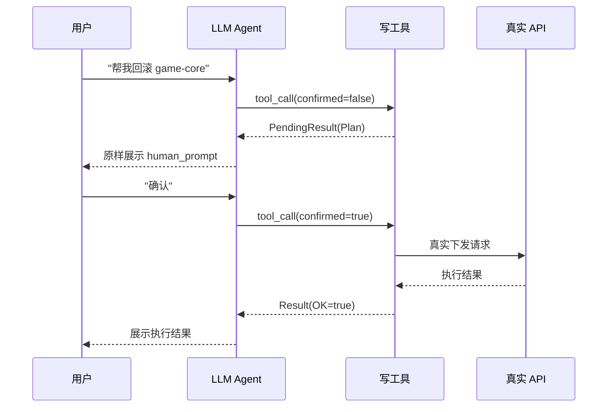
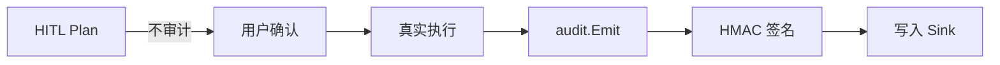
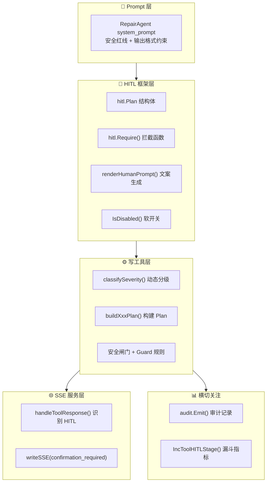

---

# 04 — HITL 两段式确认框架

## 一、设计背景与核心理念

### 1.1 为什么需要 HITL

运维 Agent 最大的风险点是 **LLM 在没有人类参与的情况下直接执行高危写操作**。典型场景包括：

- Helm rollback / uninstall
- 合并 MR（直接改 master 分支代码）
- 重跑发布流水线 / 取消构建
- 修改 ConfigMap / Secret
- 调整 HPA / Scale Deployment
- 修改网络资源（Service / Ingress）

Anthropic、OpenAI、Google 的工具调用最佳实践都明确强调：**破坏性操作必须强制 Human-in-the-Loop**。

### 1.2 两段式确认模式

本项目实现的核心模式为 **Plan → Confirm → Execute**：



**三阶段语义**：

| 阶段 | confirmed 值 | 行为 | 是否触达真实 API |
|------|-------------|------|----------------|
| **Plan** | `false` | 返回结构化执行计划 | ❌ |
| **Confirm** | 用户回复"确认" | LLM 识别确认意图 | — |
| **Execute** | `true` | 真正执行写操作 | ✅ |

---

## 二、核心实现代码

### 2.1 包结构

```
src/tools/hitl/
├── hitl.go          # 核心框架（128 行）
└── hitl_test.go     # 5 组测试用例（106 行）
```

HITL 包的设计原则是 **纯函数化**：不持有任何状态，只提供 `Plan` 结构 + `Require` 函数，方便各工具内嵌调用，不需要提前注册。

### 2.2 Severity 四级分类

文件：[hitl.go](D:/UGit/Go-Agent/project-agent/src/tools/hitl/hitl.go)

```go
type Severity string

const (
    SeverityCritical Severity = "critical"  // 不可逆 / 影响生产 / 影响面大
    SeverityHigh     Severity = "high"      // 有副作用但可回滚 / 影响单集群或单服务
    SeverityMedium   Severity = "medium"    // 轻度副作用 / 易回滚
    SeverityLow      Severity = "low"       // 软写 / 仅登记性质
)
```

**分级示例**：

| 级别 | 典型操作 | 特征 |
|------|---------|------|
| **Critical** | helm uninstall / MR merge / 生产 ns 缩容到 0 / Secret 生产写 / set_tls | 不可逆或影响面极大 |
| **High** | helm rollback / scale 翻倍 / HPA 常规修改 / ConfigMap delete | 有副作用但可回滚 |
| **Medium** | 重跑流水线 / MR create / ConfigMap set(非生产) | 轻度副作用 |
| **Low** | 创建 TAPD 缺陷单 / ConfigMap set(非生产+none rollout) | 仅登记性质 |

### 2.3 Plan 结构体

```go
type Plan struct {
    Action        string         `json:"action"`                    // 将要执行的动作
    Severity      Severity       `json:"severity"`                  // 破坏等级
    Target        string         `json:"target"`                    // 作用对象
    SideEffect    string         `json:"side_effect"`               // 副作用一句话描述
    ImpactScope   string         `json:"impact_scope,omitempty"`    // 影响范围
    RollbackPlan  string         `json:"rollback_plan,omitempty"`   // 回滚预案
    Params        map[string]any `json:"params,omitempty"`          // 关键入参（去敏后）
    RequireReason bool           `json:"require_reason,omitempty"`  // 是否要求用户提供变更原因
}
```

**设计要点**：
- 所有字段显式列出，避免散落到 description 里
- `Params` 由工具层负责脱敏（不含 token/secret）
- `RequireReason` 语义：`confirmed=true` 且空 reason 才拒绝（不是前置硬拒绝）

### 2.4 PendingResult 结构体

```go
type PendingResult struct {
    OK          bool   `json:"ok"`           // 固定为 false（语义：未执行）
    Status      string `json:"status"`       // 固定为 "awaiting_confirmation"
    Message     string `json:"message"`      // 给 LLM 的指令
    HumanPrompt string `json:"human_prompt"` // 建议展示给用户的原文
    Plan        Plan   `json:"plan"`
}
```

### 2.5 核心函数：Require

```go
func Require(confirmed bool, p Plan) (PendingResult, bool) {
    if confirmed || IsDisabled() {
        return PendingResult{}, false  // 不拦截
    }
    return BuildPending(p), true       // 拦截，返回 Plan
}
```

**判定逻辑**：
1. `confirmed=true` → 不拦截（用户已确认）
2. `HITL_DISABLE=1` → 不拦截（仅测试/CI 环境）
3. 其他 → 返回 `PendingResult`，提示上层 return

### 2.6 human_prompt 渲染

```go
func renderHumanPrompt(p Plan) string {
    // 生成三段式 Markdown 确认文案：
    // ⚠ **即将执行写操作：{action}**（严重级别：{severity}）
    // • **作用对象**：{target}
    // • **副作用**：{side_effect}
    // • **影响范围**：{impact_scope}
    // • **回滚预案**：{rollback_plan}
    // • **关键参数**：key=value, ...
    //
    // 请回复『**确认**』以继续；或提供不同参数重新发起。
    // （RequireReason=true 时追加：请同时简述本次变更原因）
}
```

### 2.7 软开关机制

```go
func IsDisabled() bool {
    switch strings.ToLower(strings.TrimSpace(os.Getenv("HITL_DISABLE"))) {
    case "1", "true", "yes", "on":
        return true
    }
    return false
}
```

**用途**：仅供 CI / 集成测试使用，生产环境绝不开启。

---

## 三、写工具接入模式

### 3.1 标准接入范式

所有写工具遵循统一的接入模式（以 `gongfeng_mr_create` 为例）：

```go
func newMRCreateTool(c *gongfengapi.Client) tool.Tool {
    fn := func(_ context.Context, in MRCreateInput) (*Result, error) {
        // 1. 入参校验
        if in.ProjectID == "" || in.SourceBranch == "" { ... }

        // 2. 构建 Plan
        plan := hitl.Plan{
            Action:       "gongfeng.mr.create",
            Severity:     hitl.SeverityMedium,
            Target:       fmt.Sprintf("%s  %s → %s", in.ProjectID, ...),
            SideEffect:   "创建 Merge Request（不会自动合并）",
            ImpactScope:  "目标分支下即将收到新的 MR",
            RollbackPlan: "可在工蜂前端关闭该 MR",
            Params:       map[string]any{...},
        }

        // 3. HITL 拦截判定
        if pending, need := hitl.Require(in.Confirmed, plan); need {
            return &Result{OK: false, Message: pending.Message, Data: pending}, nil
        }

        // 4. 真实执行（仅 confirmed=true 才到达这里）
        result, apiErr := c.CreateMR(ctx, ...)

        // 5. 审计记录
        audit.Emit(audit.Event{
            Agent:    "repair_agent",
            Action:   plan.Action,
            Severity: string(plan.Severity),
            Target:   plan.Target,
            Params:   plan.Params,
            Success:  result.OK,
            Err:      apiErr,
            Mock:     c.IsMock(),
        })
        return result, nil
    }
    return function.NewFunctionTool(fn, ...)
}
```

### 3.2 RequireReason 的时序约束

**关键设计**：`reason` 强制校验**必须**放在 `hitl.Require` 之后：

```go
// ✅ 正确：先 HITL，再校验 reason
plan := buildHPAPlan(...)
if pending, need := hitl.Require(in.Confirmed, plan); need {
    return &Result{OK: false, Message: pending.Message, Data: pending}, nil
}
// hitl 已放行（confirmed=true），此时 RequireReason 仍未补就硬拒绝
if requireReason && strings.TrimSpace(in.Reason) == "" {
    return nil, fmt.Errorf("必须填写 reason 说明变更原因")
}
```

**原因**：Plan 阶段调用方还没看见 Severity / RequireReason，强制要 reason 等于把"协商提示"变成"前置硬拒绝"，违反两段式语义。`RequireReason=true` 的语义是让 LLM 从 Plan 中读到后再带 reason 重发。

### 3.3 安全闸门（双保险）

除了 HITL 确认外，部分高危工具还有**独立的安全闸门**：

| 工具 | 环境变量 | 默认值 | 作用 |
|------|---------|--------|------|
| `gongfeng_mr_merge` | `GONGFENG_ALLOW_AUTO_MERGE` | `false` | 即便 confirmed=true，未开此开关仍走 Mock |
| `devops_pipeline_rerun` | `DEVOPS_ALLOW_AUTO_OPS` | `false` | 同上 |
| `devops_build_cancel` | `DEVOPS_ALLOW_AUTO_OPS` | `false` | 同上 |

**设计思路**：HITL 保障"用户知情"，安全闸门保障"运维团队授权"。两者正交。

---

## 四、动态 Severity 分级策略

### 4.1 BCS Scale Deployment

文件：[scale.go](D:/UGit/Go-Agent/project-agent/src/tools/bcs_tools/scale.go)

```go
func classifySeverity(from, to int, namespace string) (hitl.Severity, bool) {
    // 缩容到 0：特殊对待
    if to == 0 && from > 0 {
        if isProdNamespace(namespace) {
            return hitl.SeverityCritical, true   // 生产 ns → Critical + RequireReason
        }
        return hitl.SeverityHigh, false          // 非生产 → High
    }
    // 相对变化比例
    ratio := float64(absDelta) / float64(base)
    switch {
    case ratio >= 1.0:  return hitl.SeverityHigh   // 翻倍或以上
    case ratio >= 0.5:  return hitl.SeverityHigh   // 超过一半
    }
    // 大规模部署（目标 >100）额外加一档
    if to > 100 && severity == hitl.SeverityMedium {
        severity = hitl.SeverityHigh
    }
    return severity, false
}
```

**特点**：Severity 不是写死的，而是根据 `|Δ|/current` 和绝对副本数**动态计算**。

### 4.2 BCS HPA Patch

文件：[hpa_patch.go](D:/UGit/Go-Agent/project-agent/src/tools/bcs_tools/hpa_patch.go)

```go
func classifyHPASeverity(in, before, targetMin, targetMax, op) (hitl.Severity, bool) {
    // 1) op=disable → Critical + RequireReason（冻结弹性 = 拆方向盘）
    // 2) prod ns → Critical + RequireReason
    // 3) targetMax > HPAMaxCeiling(100) → Critical + RequireReason
    // 4) 幅度突变（增长>3x 或降幅>50%）→ Critical
    // 5) 其他 → High（HPA 起步就比 scale 严一级）
}
```

**HPA 比 Scale 更严的原因**：HPA 是"副本数的法官"，scale 改错可以被 HPA 纠正回来，HPA 改错则直接决定后续所有扩缩容行为的上下限。

### 4.3 BCS ConfigMap Update

文件：[configmap_update.go](D:/UGit/Go-Agent/project-agent/src/tools/bcs_tools/configmap_update.go)

```go
func classifyConfigmapSeverity(op, ns string, keysCount int, rollout string, hasSensitive bool) hitl.Severity {
    // 敏感键名永远 Critical
    // 生产 ns + immediate_restart → Critical
    // 生产 ns + rolling_restart → High
    // keys 过多(>10) → High
    // 非生产 ns + none rollout → Low
    // 其他 → Medium
}
```

**双维度矩阵**：`op(set/delete)` × `rollout_strategy(none/rolling/immediate)` × `namespace(prod/非prod)` × `敏感键`。

### 4.4 BCS Secret Update

文件：[secret_update.go](D:/UGit/Go-Agent/project-agent/src/tools/bcs_tools/secret_update.go)

```go
func classifySecretSeverity(op, ns string, keysCount int, rollout string) hitl.Severity {
    // 生产 ns Secret 写：默认 Critical（Secret 事关身份）
    // 生产 + set + 温和 rollout + keys 少 → High（降一档）
    // 非生产 delete → High
    // 非生产 set + keys 多 / immediate → High
    // 非生产 set + keys 少 + 温和 → Medium
}
```

**比 ConfigMap 整体更高一档**：Secret 包含凭据/证书，泄露或错改的后果更严重。

### 4.5 BCS Network Update

文件：[network_update.go](D:/UGit/Go-Agent/project-agent/src/tools/bcs_tools/network_update.go)

```go
func classifyNetworkSeverity(in NetworkUpdateInput, op string) (hitl.Severity, bool) {
    // set_tls → Critical + RequireReason（证书影响所有 HTTPS 客户端）
    // prod ns → Critical + RequireReason
    // update_spec（通用改）→ Critical（盲区大）
    // 其他 → High
}
```

### 4.6 完整写工具 Severity 矩阵

| 工具 | Target | 默认 Severity | RequireReason 条件 |
|------|--------|--------------|-------------------|
| `bcs_helm_manage`(rollback) | bcs-write | High | ❌ |
| `bcs_helm_manage`(install) | bcs-write | High | ❌ |
| `bcs_helm_manage`(uninstall) | bcs-write | **Critical** | ✅ |
| `bcs_scale_deployment` | bcs-write | 动态(Medium~Critical) | 生产 ns 缩容到 0 |
| `bcs_pod_restart` | bcs-write | 动态(Medium~Critical) | 生产 ns |
| `bcs_hpa_patch` | bcs-write | 动态(High~Critical) | disable/prod/天花板 |
| `bcs_configmap_update` | bcs-write | 动态(Low~Critical) | 敏感键/生产+immediate |
| `bcs_secret_update` | bcs-write | 动态(Medium~Critical) | 生产 ns / immutable |
| `bcs_network_update` | bcs-write | 动态(High~Critical) | set_tls/prod ns |
| `gongfeng_mr_create` | gongfeng | Medium | ❌ |
| `gongfeng_mr_merge` | gongfeng | **Critical** | ✅ |
| `devops_pipeline_rerun` | devops | Medium | ❌ |
| `devops_build_cancel` | devops | Medium | ✅ |
| `tapd_bug_create` | tapd | Low | ❌ |

---

## 五、SSE 层集成

### 5.1 事件分流

文件：[sse.go](D:/UGit/Go-Agent/project-agent/src/services/sse/sse.go)

SSE 服务的 `forward` 方法按优先级分流事件：

```go
func (s *Service) forward(ctx, w, flusher, ch) {
    for ev := range ch {
        // 1. error → event=error
        // 2. transfer → event=agent_transfer
        // 3. tool_call → event=tool_call（跳过 transfer_to_agent）
        // 4. tool_response → 如果是 HITL PendingResult → event=confirmation_required
        // 5. delta → event=delta（流式文本）
        // 6. final → event=final
    }
}
```

### 5.2 HITL 事件识别

```go
func (s *Service) handleToolResponse(w, flusher, ev) {
    for _, c := range ev.Response.Choices {
        if c.Message.Role != model.RoleTool { continue }
        payload := c.Message.Content
        // 快速过滤：必须同时包含两个关键字
        if !strings.Contains(payload, "awaiting_confirmation") ||
           !strings.Contains(payload, "human_prompt") {
            continue
        }
        // 解析为 HITL PendingResult 结构
        var parsed struct { ... }
        if err := extractPendingResult(payload, &parsed); err != nil { continue }
        // 输出 confirmation_required 事件
        writeSSE(w, flusher, Response{
            EventName: "confirmation_required",
            Data: Data{
                Response: parsed.HumanPrompt,
                Author:   ev.Author,
                Confirm:  &ConfirmPayload{...},
            },
        })
    }
}
```

### 5.3 ConfirmPayload 结构

文件：[types.go](D:/UGit/Go-Agent/project-agent/src/services/sse/types.go)

```go
type ConfirmPayload struct {
    Action      string         `json:"action"`
    Severity    string         `json:"severity"`
    Target      string         `json:"target"`
    SideEffect  string         `json:"side_effect,omitempty"`
    ImpactScope string         `json:"impact_scope,omitempty"`
    Rollback    string         `json:"rollback,omitempty"`
    Params      map[string]any `json:"params,omitempty"`
    HumanPrompt string         `json:"human_prompt"`
}
```

### 5.4 SSE 事件示例

```
event:confirmation_required
data:{
  "response":"⚠ 即将执行 bcs.helm.rollback ...",
  "author":"repair_agent",
  "event_type":"confirmation_required",
  "confirmation":{
    "action":"bcs.helm.rollback",
    "severity":"high",
    "target":"BCS-K8S-001/letsgo/game-core",
    "side_effect":"release 回滚到 revision=4",
    "impact_scope":"命名空间下所有 Pod 滚动重启",
    "rollback":"若回滚后仍异常，再指向更早 revision",
    "params":{"revision":4},
    "human_prompt":"⚠ **即将执行写操作：bcs.helm.rollback**..."
  }
}
```

### 5.5 前端对接协议

前端拿到 `confirmation_required` 事件后应：
1. **锁定输入框**，高亮渲染 `human_prompt`
2. 显示「确认」/「取消」按钮，或允许用户输入修改意见
3. 用户点击确认后，发送新一轮 `/v1/agent` 请求，content 为「确认」
4. Agent 会带 `confirmed=true` 重新调用工具真正执行

### 5.6 extractPendingResult 双格式兼容

```go
func extractPendingResult(payload string, v any) error {
    // 1. 优先嵌套格式 {"data": {...}}
    // 2. 嵌套无 data 字段，再按平铺直接 Unmarshal
    // 3. 两者都失败才返回 error
}
```

**设计原因**：工具响应的 content 可能是纯 JSON（框架直接 marshal 了 Result）或包裹在 `{"data": {...}}` 里（取决于 Tool.Call 的包装）。

---

## 六、审计集成

### 6.1 审计时机

审计记录**仅在 HITL 通过且 API 调用结束后**产生。Plan 阶段不产生审计记录。



### 6.2 审计 Event 结构

文件：[audit.go](D:/UGit/Go-Agent/project-agent/src/audit/audit.go)

```go
type Event struct {
    User      string         // 触发用户
    Agent     string         // 发起的 Agent 名
    Action    string         // 动作名（与 hitl.Plan.Action 对齐）
    Severity  string         // 破坏等级
    Target    string         // 作用对象
    Params    map[string]any // 关键入参（脱敏后）
    Reason    string         // 用户提供的变更原因
    Success   bool           // 执行结果
    Err       error          // 失败时的错误
    SessionID string         // 可关联 SSE 会话
    Mock      bool           // 是否走 Mock 客户端
}
```

### 6.3 审计 Record 与 HMAC 签名

```go
type Record struct {
    TS        string         `json:"ts"`          // RFC3339 时间戳
    User      string         `json:"user"`
    Agent     string         `json:"agent"`
    Action    string         `json:"action"`
    Severity  string         `json:"severity"`
    Target    string         `json:"target"`
    Params    map[string]any `json:"params"`
    Reason    string         `json:"reason"`
    Result    string         `json:"result"`      // success / failure
    ErrorMsg  string         `json:"error"`
    SessionID string         `json:"session_id"`
    Mock      bool           `json:"mock"`
    // HMAC 签名字段
    SigAlg    string         `json:"sig_alg"`     // HMAC-SHA256
    SigKID    string         `json:"sig_kid"`     // 密钥 ID
    PrevSig   string         `json:"prev_sig"`    // 链式签名（防删除攻击）
    Sig       string         `json:"sig"`         // 签名摘要
}
```

### 6.4 典型审计调用

```go
audit.Emit(audit.Event{
    Agent:    "repair_agent",
    Action:   plan.Action,
    Severity: string(plan.Severity),
    Target:   plan.Target,
    Params:   plan.Params,
    Reason:   in.Reason,
    Success:  result.OK,
    Err:      apiErr,
    Mock:     c.IsMock() || !isAutoOpsAllowed() || result.Mock,
})
```

---

## 七、可观测性集成

### 7.1 HITL 漏斗指标

文件：[metrics_toolcall.go](D:/UGit/Go-Agent/project-agent/src/observability/metrics_toolcall.go)

```go
const MetricToolHITLStage = "gameops.tool_call.hitl_stage.total"
// 维度：{tool, stage}，stage ∈ plan / confirmed / rejected / disabled
```

**漏斗阶段**：

| Stage | 含义 | 触发时机 |
|-------|------|---------|
| `plan` | 返回了 Plan，等待用户确认 | 工具返回 PendingResult |
| `confirmed` | 用户确认后真正执行 | confirmed=true 且执行成功 |
| `rejected` | Plan 返回后用户拒绝/超时 | 用户取消或超时 |
| `disabled` | HITL_DISABLE=1 直通 | 测试/CI 模式 |

### 7.2 WithMetrics 装饰器

文件：[metrics_middleware.go](D:/UGit/Go-Agent/project-agent/src/tools/bcs_tools/metrics_middleware.go)

```go
func (m *metricsMiddleware) Call(ctx context.Context, argsJSON []byte) (any, error) {
    confirmedInInput := extractConfirmed(argsJSON)
    result, err := m.inner.Call(ctx, argsJSON)
    elapsed := time.Since(start).Seconds()

    // 指标 1：耗时分布
    ObserveToolCallDuration(ctx, m.toolName, status, elapsed)

    // 指标 2：HITL 漏斗
    if isPendingResult(result) {
        IncToolHITLStage(ctx, m.toolName, HITLStagePlan)
    } else if confirmedInInput {
        IncToolHITLStage(ctx, m.toolName, HITLStageConfirmed)
    }

    // 指标 3：拒绝原因
    if err != nil {
        IncToolReject(ctx, m.toolName, extractRejectReason(err.Error()))
    }

    // 指标 4：入参异常
    if err != nil {
        if anomaly := extractInputAnomaly(err.Error()); anomaly != "" {
            IncToolInputAnomaly(ctx, m.toolName, anomaly)
        }
    }
    return result, err
}
```

**黑盒识别 HITL Plan**：通过把 `any` 结果序列化为 JSON 后检查 `"awaiting_confirmation"` 字符串来判定，不依赖 hitl 包的具体类型，避免循环导入。

### 7.3 相关告警规则

| 告警名 | 触发条件 | 含义 |
|--------|---------|------|
| `WriteToolBurst` | 5 个写工具调用量突增 | `*_ALLOW_AUTO_*` 闸门被长期打开 |
| `ConfirmationRequiredStuck` | confirmation_required 占比>50% 持续 15min | 确认→final 链路断了 |

---

## 八、Prompt 工程

### 8.1 RepairAgent 安全红线

文件：[system_prompt.md](D:/UGit/Go-Agent/project-agent/src/agents/repair_agent/system_prompt.md)

RepairAgent 的 system prompt 中明确规定了 HITL 纪律：

```markdown
## 🚨 安全红线（D6 核心纪律，必须遵守）

1. **所有写操作必须走两段式确认（HITL）**：
   - 第一次调用工具时**不要**带 confirmed=true
   - 将 Plan 中的 human_prompt 字段**原样**展示给用户
   - 只有在用户明确回复「确认」后，才带 confirmed=true 重新调用
   - 如果用户给出修改，必须**重新跑一遍两段式**
2. **绝不自动合并 MR**
3. **绝不自动关闭 TAPD 单**
4. **绝不执行 force push / 删除分支 / 直推 master**
```

### 8.2 输出格式约束

**Plan 阶段**（收到 awaiting_confirmation 后）：
```
（展示 human_prompt 全文）

根据诊断结论「<简述根因>」，我建议采用上述方案。
如需调整参数，请直接告诉我；如无修改，请回复「确认」继续。
```

**Execute 阶段**（confirmed=true 调用后）：
```
**执行结果**：✅ 成功 / ❌ 失败

**关键证据**：<返回的 build_no / mr_iid / rollback revision 等>

**人工下一步**：
- [ ] 观察监控 X 分钟
- [ ] 审核/合并 MR（如有）
- [ ] 更新 TAPD 单状态
```

### 8.3 HITL 与 Async 的关系

```markdown
**三条铁律**：
1. HITL 与 async 不冲突：HITL 在同步侧已先走完，再把 confirmed=true 的工具丢给 job_submit
2. **不要用 job_submit 绕过 HITL**
3. 读工具不要 async
```

---

## 九、测试覆盖

### 9.1 hitl 包单元测试

文件：[hitl_test.go](D:/UGit/Go-Agent/project-agent/src/tools/hitl/hitl_test.go)

| 测试用例 | 验证点 |
|---------|--------|
| `TestRequire_NotConfirmed_ShouldIntercept` | confirmed=false 必须拦截 |
| `TestRequire_Confirmed_ShouldPass` | confirmed=true 不应拦截 |
| `TestRequire_Disabled_ShouldBypass` | HITL_DISABLE=1 完全绕过 |
| `TestIsDisabled_VariousTruthy` | 10 种环境变量值的布尔解析 |
| `TestRenderHumanPrompt_ContainsAllFields` | human_prompt 包含所有 Plan 字段 |
| `TestPlan_RequireReason_HintInPrompt` | RequireReason=true 时提示"变更原因" |

### 9.2 写工具两段式测试

各写工具包都有完整的两段式行为测试：

```go
// 第一阶段：未 confirmed → 必须返回 Plan
r := callTool(t, tl, `{...}`)
assert(r.OK == false)
assert(r.Data contains "awaiting_confirmation")

// 第二阶段：confirmed=true → 真正执行
r = callTool(t, tl, `{..., "confirmed":true}`)
assert(r.OK == true)
```

### 9.3 SSE 层测试

文件：[sse_test.go](D:/UGit/Go-Agent/project-agent/src/services/sse/sse_test.go)

| 测试用例 | 验证点 |
|---------|--------|
| `TestHandleToolResponse_PendingConfirmation` | HITL 响应正确转为 confirmation_required 事件 |
| `TestHandleToolResponse_NonHITL` | 非 HITL 工具响应被静默跳过 |

### 9.4 集成测试

文件：[bcs_full_flow_test.go](D:/UGit/Go-Agent/project-agent/src/integration/bcs_full_flow_test.go)

- **Scenario B**：修复侧写操作 HITL 两段式协同（scale → hpa_patch → secret_update）
- **Scenario E**：network_update 多 op 贯穿（set_selector HITL + set_tls Critical+reason）

---

## 十、架构总结

### 10.1 分层职责



### 10.2 核心设计原则

| 原则 | 实现方式 |
|------|---------|
| **纯函数化** | hitl 包不持有状态，Plan + Require 即用即走 |
| **动态分级** | Severity 由工具层根据上下文（ns/操作/幅度）动态计算 |
| **双保险** | HITL（用户知情）+ 安全闸门（团队授权）正交 |
| **Prompt 纪律** | system_prompt 明确规定两段式使用规范 |
| **可观测** | 漏斗指标 + 拒绝原因 + 入参异常全链路埋点 |
| **审计闭环** | 仅 confirmed 后审计，HMAC 链式签名防篡改 |
| **测试完备** | 单元测试 + 集成测试 + E2E 场景全覆盖 |

### 10.3 核心文件索引

| 文件 | 职责 |
|------|------|
| `src/tools/hitl/hitl.go` | HITL 框架核心（Plan/PendingResult/Require/renderHumanPrompt） |
| `src/tools/hitl/hitl_test.go` | 框架单元测试（5 组） |
| `src/tools/bcs_tools/scale.go` | Scale 动态 Severity + HITL 接入 |
| `src/tools/bcs_tools/hpa_patch.go` | HPA 多层防护 + HITL 接入 |
| `src/tools/bcs_tools/configmap_update.go` | ConfigMap 双维度分级 + HITL 接入 |
| `src/tools/bcs_tools/secret_update.go` | Secret 高档分级 + HITL 接入 |
| `src/tools/bcs_tools/network_update.go` | Network 三层防护 + HITL 接入 |
| `src/tools/bcs_tools/metrics_middleware.go` | WithMetrics 装饰器（HITL 漏斗埋点） |
| `src/tools/gongfeng_tools/gongfeng_tools.go` | MR create/merge HITL 接入 |
| `src/tools/devops_tools/devops_tools.go` | Pipeline rerun / Build cancel HITL 接入 |
| `src/services/sse/sse.go` | SSE 层 HITL 事件识别与转发 |
| `src/services/sse/types.go` | ConfirmPayload 类型定义 |
| `src/audit/audit.go` | 审计记录（仅 confirmed 后触发） |
| `src/observability/metrics_toolcall.go` | HITL 漏斗指标定义 |
| `src/agents/repair_agent/system_prompt.md` | RepairAgent HITL 纪律约束 |

---
