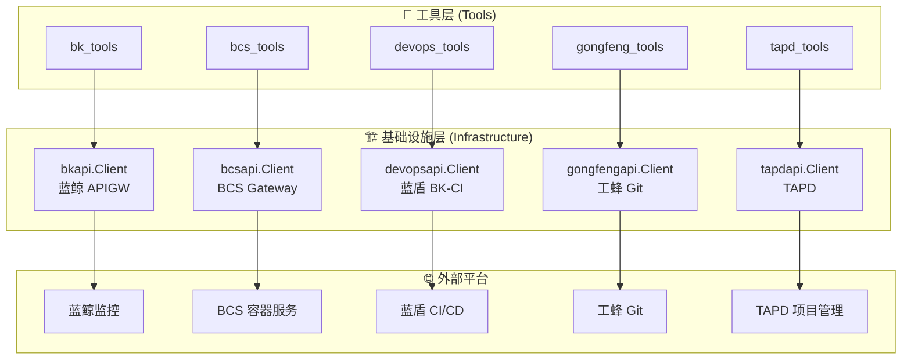
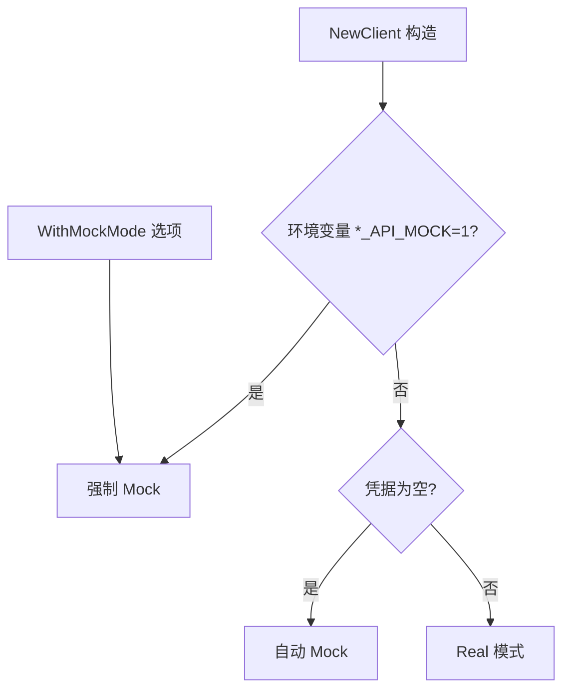
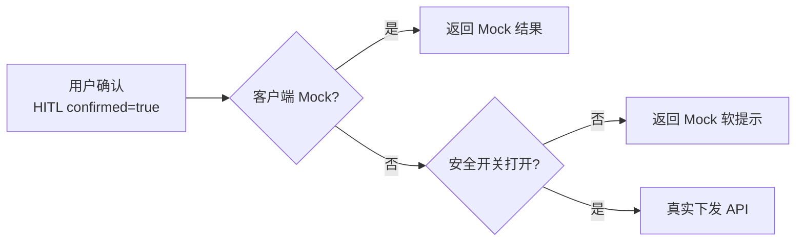
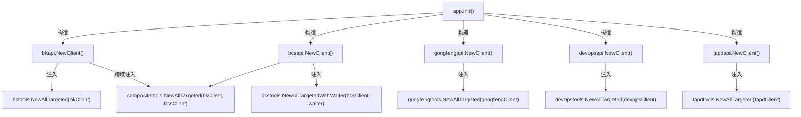
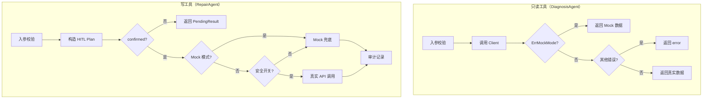
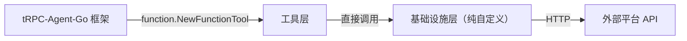

---

# 05 — 基础设施层（HTTP Client）

## 一、设计背景与核心理念

### 1.1 基础设施层的定位

基础设施层（`src/infrastructure/`）是 GameOps Agent 与外部平台通信的**唯一出口**。它位于工具层（`src/tools/`）之下，为上层提供统一的 HTTP 客户端抽象，屏蔽各平台差异化的认证方式、响应格式和错误处理。



### 1.2 统一设计原则

5 大客户端遵循一致的设计模式：

| 原则 | 说明 |
|------|------|
| **Mock/Real 双模式** | 未配凭据自动 Mock，环境变量强制 Mock，零配置即可本地开发 |
| **Functional Options** | `WithBaseURL` / `WithToken` / `WithTimeout` 等选项式构造 |
| **环境变量驱动** | 凭据、BaseURL、Mock 开关全部从环境变量读取，无需修改代码 |
| **安全闸门** | 高危操作（MR 合并、流水线重跑）默认不真实下发，需显式开关 |
| **统一 Envelope 解析** | 各平台响应格式归一化处理，上层无需关心外壳结构 |
| **错误归一化** | 非 2xx 响应统一转为 `fmt.Errorf`，含状态码 + 截断 body |
| **httptest 友好** | 支持注入自定义 `*http.Client`，单测无需真实网络 |

---

## 二、目录结构

```
src/infrastructure/
├── bcsapi/
│   └── client.go          # BCS Gateway 客户端（264 行）
├── bkapi/
│   └── client.go          # 蓝鲸 APIGW 客户端（228 行）
├── devopsapi/
│   ├── client.go          # 蓝盾 BK-CI 客户端（305 行）
│   └── client_test.go     # httptest 单测（185 行）
├── gongfengapi/
│   ├── client.go          # 工蜂 Git 客户端（291 行）
│   └── client_test.go     # httptest 单测（172 行）
└── tapdapi/
    ├── client.go          # TAPD 客户端（311 行）
    └── client_test.go     # httptest 单测（158 行）
```

---

## 三、5 大平台客户端详解

### 3.1 BCS Gateway 客户端（bcsapi）

**文件**：[client.go](D:/UGit/Go-Agent/project-agent/src/infrastructure/bcsapi/client.go)

#### 3.1.1 认证方式

```
Authorization: Bearer <BCS_TOKEN>
Content-Type: application/json
Accept: application/json
```

BCS Gateway 使用标准 Bearer Token 认证，通过 `setAuth` 方法统一注入：

```go
func (c *Client) setAuth(req *http.Request) {
    req.Header.Set("Authorization", "Bearer "+c.token)
    req.Header.Set("Content-Type", "application/json")
    req.Header.Set("Accept", "application/json")
}
```

#### 3.1.2 环境变量

| 变量 | 说明 | 必填 |
|------|------|------|
| `BCS_GATEWAY_URL` | BCS Gateway 基础域名 | 是（空则 Mock） |
| `BCS_TOKEN` | BCS 访问 Token | 是（空则 Mock） |
| `BCS_API_MOCK` | `"1"/"true"` 强制 Mock | 否 |

#### 3.1.3 核心方法

| 方法 | 用途 | 特殊说明 |
|------|------|---------|
| `Get` | GET + JSON 解析 | 支持 query map 自动拼接 |
| `GetRaw` | GET + 原始字节返回 | 用于 Pod logs 等 text/plain 端点，支持 `maxBytes` 截断防 OOM |
| `PostJSON` | POST + JSON | 通用写请求 |
| `PutJSON` | PUT + JSON | 幂等写入（如 scale replicas） |
| `DeleteJSON` | DELETE + 可选 JSON body | K8s Eviction API 需要 body |
| `PatchJSON` | PATCH + Strategic Merge Patch | rollout restart 场景，Content-Type 为 `application/strategic-merge-patch+json` |

#### 3.1.4 GetRaw 设计亮点

`GetRaw` 是 BCS 客户端独有的方法，专为 Pod 日志等非 JSON 端点设计：

```go
func (c *Client) GetRaw(ctx context.Context, path string, query map[string]string, maxBytes int) ([]byte, error) {
    // ...
    req.Header.Set("Accept", "text/plain, */*")
    // ...
    var reader io.Reader = resp.Body
    if maxBytes > 0 {
        // +1 是为了判断"是否真的被截断"
        reader = io.LimitReader(resp.Body, int64(maxBytes)+1)
    }
    body, err := io.ReadAll(reader)
    // 超限截断
    if maxBytes > 0 && len(body) > maxBytes {
        body = append(body[:maxBytes], []byte("\n...(truncated)")...)
    }
    return body, nil
}
```

**设计考量**：
- Pod 日志可能上百 MB，全部读进内存会 OOM
- LLM 上下文也装不下超大文本
- `maxBytes` 是硬防线，上层 `bcs_pod_logs_tail` 还会在业务层再做一次友好截断

#### 3.1.5 HTTP 方法工厂

所有写方法（POST/PUT/DELETE/PATCH）通过内部 `sendJSON` 工厂统一实现：

```go
func (c *Client) sendJSON(ctx context.Context, method, path string, reqBody any, respOut any, contentTypeOverride string) error {
    if c.mockMode {
        return ErrMockMode
    }
    // ... 构造请求 ...
    if contentTypeOverride != "" {
        req.Header.Set("Content-Type", contentTypeOverride)
    }
    return c.do(req, respOut)
}
```

---

### 3.2 蓝鲸 APIGW 客户端（bkapi）

**文件**：[client.go](D:/UGit/Go-Agent/project-agent/src/infrastructure/bkapi/client.go)

#### 3.2.1 认证方式

蓝鲸 APIGW 使用自定义 Header 携带 JSON 格式凭据：

```
X-Bkapi-Authorization: {"bk_app_code":"xxx","bk_app_secret":"yyy"}
```

实现代码：

```go
func (c *Client) setAuthHeaders(req *http.Request) {
    auth := map[string]string{
        "bk_app_code":   c.appCode,
        "bk_app_secret": c.appSecret,
    }
    authJSON, _ := json.Marshal(auth)
    req.Header.Set("X-Bkapi-Authorization", string(authJSON))
    req.Header.Set("Content-Type", "application/json")
    req.Header.Set("Accept", "application/json")
}
```

#### 3.2.2 环境变量

| 变量 | 说明 | 必填 |
|------|------|------|
| `BK_APP_CODE` | 蓝鲸应用 ID | 是（空则 Mock） |
| `BK_APP_SECRET` | 蓝鲸应用密钥 | 是（空则 Mock） |
| `BK_APIGW_BASE_URL` | APIGW 基础域名 | 是（空则 Mock） |
| `BK_API_MOCK` | `"1"/"true"` 强制 Mock | 否 |

#### 3.2.3 核心方法

| 方法 | 用途 |
|------|------|
| `GetJSON` | GET + query map + JSON 解析 |
| `PostJSON` | POST + JSON（告警查询、指标查询等） |
| `PutJSON` | PUT + JSON（告警静默更新） |
| `DeleteJSON` | DELETE + 可选 body（告警静默取消） |

#### 3.2.4 与 BCS 客户端的差异

- 无 `GetRaw`（蓝鲸 API 全部返回 JSON）
- 无 `PatchJSON`（蓝鲸 API 不使用 PATCH 语义）
- 认证头格式完全不同（JSON 嵌套 vs Bearer Token）

---

### 3.3 蓝盾 BK-CI 客户端（devopsapi）

**文件**：[client.go](D:/UGit/Go-Agent/project-agent/src/infrastructure/devopsapi/client.go)

#### 3.3.1 认证方式

蓝盾使用双 Header 认证：

```
X-DEVOPS-ACCESS-TOKEN: <token>
X-DEVOPS-UID: <user>           # 可选，蓝盾 v4 之后逐步要求
```

#### 3.3.2 环境变量

| 变量 | 说明 | 必填 |
|------|------|------|
| `DEVOPS_BASE_URL` | 蓝盾基础域名（默认 `https://devops.woa.com`） | 否 |
| `DEVOPS_TOKEN` | 访问 Token | 是（空则 Mock） |
| `DEVOPS_USER` | 操作人 UID | 否 |
| `DEVOPS_API_MOCK` | `"1"/"true"` 强制 Mock | 否 |

#### 3.3.3 Envelope 解析

蓝盾 API 返回标准外壳 `{"status":0, "message":"", "data":...}`，`status==0` 表示成功：

```go
type devopsEnvelope struct {
    Status  int             `json:"status"`
    Message string          `json:"message"`
    Data    json.RawMessage `json:"data"`
}
```

`DoJSON` 方法内部先尝试 envelope 解析，若 `status != 0` 则转为业务错误；若响应不符合 envelope 格式则退化为直接反序列化：

```go
var env devopsEnvelope
if err := json.Unmarshal(body, &env); err == nil && (env.Status != 0 || len(env.Data) > 0 || env.Message != "") {
    if env.Status != 0 {
        return fmt.Errorf("devops api status=%d message=%s", env.Status, env.Message)
    }
    // 从 env.Data 中解析真实数据
    return json.Unmarshal(env.Data, dataOut)
}
// 非 envelope：直接反序列化
return json.Unmarshal(body, dataOut)
```

#### 3.3.4 领域方法

| 方法 | 对应 API | 说明 |
|------|---------|------|
| `BuildHistory` | `GET /ms/process/api/service/builds/:projectId/:pipelineId/history` | 查询构建历史，兼容 `{records:[...]}` 和 `[...]` 两种格式 |
| `PipelineStart` | `POST /ms/process/api/service/builds/:projectId/:pipelineId/start` | 触发/重跑流水线，支持 `retryStart` 参数 |
| `BuildCancel` | `POST /ms/process/api/service/builds/:projectId/:pipelineId/:buildId/cancel` | 取消指定构建 |

#### 3.3.5 BuildHistory 的兼容设计

蓝盾历史接口 `data` 可能是 `{"records":[...]}` 或直接 `[...]`，客户端两种都尝试：

```go
func (c *Client) BuildHistory(ctx context.Context, in BuildHistoryInput) ([]Build, error) {
    // 先尝试 wrapper 格式
    var wrapper struct { Records []Build `json:"records"` }
    if err := c.DoJSON(..., &wrapper); err == nil && len(wrapper.Records) > 0 {
        return wrapper.Records, nil
    }
    // 退化：直接尝试 []Build
    var list []Build
    if err := c.DoJSON(..., &list); err != nil {
        return nil, err
    }
    return list, nil
}
```

---

### 3.4 工蜂 Git 客户端（gongfengapi）

**文件**：[client.go](D:/UGit/Go-Agent/project-agent/src/infrastructure/gongfengapi/client.go)

#### 3.4.1 认证方式

工蜂使用 GitLab 风格的 Private Token 认证：

```
PRIVATE-TOKEN: <token>
```

#### 3.4.2 环境变量

| 变量 | 说明 | 必填 |
|------|------|------|
| `GONGFENG_BASE_URL` | 工蜂 API 基础域名（默认 `https://git.woa.com/api/v3`） | 否 |
| `GONGFENG_TOKEN` | Private Token | 是（空则 Mock） |
| `GONGFENG_API_MOCK` | `"1"/"true"` 强制 Mock | 否 |

#### 3.4.3 领域方法

| 方法 | 对应 API | 说明 |
|------|---------|------|
| `CreateMR` | `POST /projects/:id/merge_requests` | 创建 MR，支持指定评审人 |
| `MergeMR` | `PUT /projects/:id/merge_requests/:iid/merge` | 合并 MR（最高危险） |
| `GetMR` | `GET /projects/:id/merge_requests/:iid` | 查询指定 MR |

#### 3.4.4 MR 数据模型

```go
type MergeRequest struct {
    IID          int      `json:"iid"`
    Title        string   `json:"title"`
    State        string   `json:"state"`
    SourceBranch string   `json:"source_branch"`
    TargetBranch string   `json:"target_branch"`
    WebURL       string   `json:"web_url"`
    CreatedAt    string   `json:"created_at"`
    MergedAt     string   `json:"merged_at,omitempty"`
    Author       any      `json:"author,omitempty"`
}
```

#### 3.4.5 URL 编码处理

工蜂对接 GitLab v3 风格 API，`id` 支持 URL-encoded namespace/path 形式：

```go
projectPart := url.PathEscape(in.ProjectID)  // "video/game-core" → "video%2Fgame-core"
```

---

### 3.5 TAPD 客户端（tapdapi）

**文件**：[client.go](D:/UGit/Go-Agent/project-agent/src/infrastructure/tapdapi/client.go)

#### 3.5.1 认证方式

TAPD 使用 HTTP Basic Auth：

```
Authorization: Basic base64(user:token)
```

实现代码：

```go
req.SetBasicAuth(c.User, c.Token)
```

#### 3.5.2 环境变量

| 变量 | 说明 | 必填 |
|------|------|------|
| `TAPD_BASE_URL` | TAPD API 域名（默认 `https://api.tapd.cn`） | 否 |
| `TAPD_USER` | API 用户名 | 是（空则 Mock） |
| `TAPD_TOKEN` | API 密码 / App Secret | 是（空则 Mock） |
| `TAPD_WORKSPACE_ID` | 默认工作区 | 否 |
| `TAPD_API_MOCK` | `"1"/"true"` 强制 Mock | 否 |

#### 3.5.3 Envelope 解析

TAPD 使用 `{"status":1,"data":[...],"info":"success"}` 格式，`status=1` 表示成功（注意与蓝盾的 `status=0` 不同）：

```go
type envelope struct {
    Status int             `json:"status"`
    Data   json.RawMessage `json:"data"`
    Info   string          `json:"info"`
}
```

#### 3.5.4 请求格式差异

TAPD 是唯一使用 **form-urlencoded** 作为 POST 请求格式的客户端（其他 4 个全部使用 JSON）：

```go
case http.MethodPost:
    values := url.Values{}
    for k, v := range params {
        if v != "" { values.Set(k, v) }
    }
    req, err = http.NewRequestWithContext(ctx, http.MethodPost, fullURL,
        bytes.NewReader([]byte(values.Encode())))
    if req != nil {
        req.Header.Set("Content-Type", "application/x-www-form-urlencoded")
    }
```

#### 3.5.5 领域方法

| 方法 | 对应 API | 说明 |
|------|---------|------|
| `QueryBugs` | `GET /bugs` | 查询缺陷，支持 workspace/keyword/status/owner 过滤 |
| `CreateBug` | `POST /bugs` | 创建缺陷（软写） |

#### 3.5.6 Bug 查询响应的特殊结构

TAPD `/bugs` GET 返回的结构是嵌套的 `[]{"Bug":{...}}`，需要额外解包：

```go
type bugQueryResp []struct {
    Bug Bug `json:"Bug"`
}

// 解包
out := make([]Bug, 0, len(raw))
for _, item := range raw {
    out = append(out, item.Bug)
}
```

---

## 四、Mock/Real 双模式机制

### 4.1 自动判定逻辑

所有客户端遵循相同的 Mock 判定三级优先级：



代码模式（以 BCS 为例）：

```go
func NewClient(opts ...Option) *Client {
    c := &Client{
        baseURL: os.Getenv("BCS_GATEWAY_URL"),
        token:   os.Getenv("BCS_TOKEN"),
        // ...
    }
    for _, o := range opts { o(c) }
    // 优先级 1：环境变量强制
    if isTruthy(os.Getenv("BCS_API_MOCK")) { c.mockMode = true }
    // 优先级 2：凭据缺失
    if c.baseURL == "" || c.token == "" { c.mockMode = true }
    return c
}
```

### 4.2 ErrMockMode 哨兵错误

每个客户端定义自己的 `ErrMockMode` 哨兵错误：

```go
var ErrMockMode = fmt.Errorf("bcsapi: running in mock mode (...)")
```

工具层通过 `errors.Is(err, xxxapi.ErrMockMode)` 判定并切换到 Mock 数据：

```go
err := client.PostJSON(ctx, path, reqBody, &respData)
if errors.Is(err, bkapi.ErrMockMode) {
    return mockAlarm(in), nil  // 返回预置样例
}
if err != nil {
    return nil, fmt.Errorf("调用失败: %w", err)
}
return &Result{OK: true, Data: respData}, nil
```

### 4.3 Mock 数据的设计原则

| 原则 | 说明 |
|------|------|
| **结构一致** | Mock 返回的字段与真实 API 完全对齐 |
| **标记透明** | `Result.Mock = true` 让上层/LLM 知道这是模拟数据 |
| **场景覆盖** | 每个 Mock 函数返回 2-3 条样例，覆盖典型场景 |
| **可过滤** | 支持按入参过滤 Mock 数据（如按 ClusterID 筛选） |

---

## 五、安全闸门机制

### 5.1 双重安全闸门

对于高危写操作，系统实现了**双重安全闸门**：



### 5.2 安全开关环境变量

| 工具组 | 环境变量 | 默认值 | 控制范围 |
|--------|---------|--------|---------|
| 工蜂 MR 合并 | `GONGFENG_ALLOW_AUTO_MERGE` | `false` | MR 合并操作 |
| 蓝盾流水线 | `DEVOPS_ALLOW_AUTO_OPS` | `false` | 流水线重跑/构建取消 |

代码模式（以工蜂为例）：

```go
func isAutoMergeAllowed() bool {
    switch strings.ToLower(strings.TrimSpace(os.Getenv("GONGFENG_ALLOW_AUTO_MERGE"))) {
    case "1", "true", "yes", "on":
        return true
    }
    return false
}

// 工具执行逻辑
if !c.IsMock() && isAutoMergeAllowed() {
    mr, err := c.MergeMR(ctx, input)  // 真实下发
    // ...
}
if result == nil {
    result = mockMRMerge(in)  // 安全闸门未开，走 Mock
}
```

### 5.3 安全闸门 vs HITL 的关系

| 层级 | 机制 | 作用 |
|------|------|------|
| **第一层** | HITL `confirmed` | 确保用户知情并同意执行 |
| **第二层** | 安全开关 | 确保运维团队显式授权 Agent 执行真实操作 |
| **第三层** | Mock 模式 | 凭据未配置时的最终兜底 |

即便用户 `confirmed=true`，若安全开关未打开，仍然只返回 Mock 软提示。这是**运维团队级别的策略控制**，优先级高于单次用户确认。

---

## 六、装配与依赖注入

### 6.1 app.Init 中的装配

所有客户端在 `app.Init` 中统一构造，然后注入到对应的工具组：

```go
// src/app/app.go — Init 函数
bkClient := bkapi.NewClient()
bcsClient := bcsapi.NewClient()
gongfengClient := gongfengapi.NewClient()
devopsClient := devopsapi.NewClient()
tapdClient := tapdapi.NewClient()

var allLocalTools []tools.TargetedTool
allLocalTools = append(allLocalTools, bktools.NewAllTargeted(bkClient)...)
allLocalTools = append(allLocalTools, bcstools.NewAllTargetedWithWaiter(bcsClient, readyWaiter)...)
allLocalTools = append(allLocalTools, gongfengtools.NewAllTargeted(gongfengClient)...)
allLocalTools = append(allLocalTools, devopstools.NewAllTargeted(devopsClient)...)
allLocalTools = append(allLocalTools, tapdtools.NewAllTargeted(tapdClient)...)
```

### 6.2 依赖关系图



### 6.3 跨域聚合工具

`composite_tools` 是唯一需要同时注入两个客户端的工具组（BK + BCS），用于跨源日志聚合：

```go
allLocalTools = append(allLocalTools, compositetools.NewAllTargeted(bkClient, bcsClient)...)
```

这种设计避免了 `bk_tools` 与 `bcs_tools` 之间产生互相 import 的包耦合。

---

## 七、工具层调用模式

### 7.1 只读工具调用模式

只读工具（DiagnosisAgent 使用）的调用模式简洁直接：

```go
// src/tools/bcs_tools/cluster.go
func newClusterTool(client *bcsapi.Client) tool.Tool {
    fn := func(ctx context.Context, in ClusterInput) (*Result, error) {
        // 1. 入参校验
        if in.ProjectID == "" {
            return nil, fmt.Errorf("project_id 为必填项")
        }
        // 2. 构造请求参数
        query := map[string]string{"projectID": in.ProjectID}
        // 3. 调用基础设施层
        var respData map[string]any
        err := client.Get(ctx, "/bcsapi/v4/clustermanager/v1/cluster", query, &respData)
        // 4. Mock 降级
        if errors.Is(err, bcsapi.ErrMockMode) {
            return mockCluster(in), nil
        }
        // 5. 错误处理
        if err != nil {
            return nil, fmt.Errorf("查询 BCS 集群失败: %w", err)
        }
        // 6. 返回结果
        return &Result{OK: true, Data: respData}, nil
    }
    return function.NewFunctionTool(fn, ...)
}
```

### 7.2 写工具调用模式

写工具（RepairAgent 使用）增加了 HITL + 安全闸门 + 审计：

```go
// src/tools/gongfeng_tools/gongfeng_tools.go
func newMRCreateTool(c *gongfengapi.Client) tool.Tool {
    fn := func(_ context.Context, in MRCreateInput) (*Result, error) {
        // 1. 入参校验
        // 2. 构造 HITL Plan
        plan := hitl.Plan{Action: "gongfeng.mr.create", Severity: hitl.SeverityMedium, ...}
        // 3. HITL 拦截（未确认则返回 Plan）
        if pending, need := hitl.Require(in.Confirmed, plan); need {
            return &Result{OK: false, Message: pending.Message, Data: pending}, nil
        }
        // 4. 真实调用（受安全闸门控制）
        var result *Result
        if !c.IsMock() {
            mr, err := c.CreateMR(context.Background(), ...)
            if err == nil { result = &Result{OK: true, Data: mr} }
        }
        // 5. Mock 兜底
        if result == nil { result = mockMRCreate(in) }
        // 6. 审计记录
        audit.Emit(audit.Event{...})
        return result, nil
    }
}
```

### 7.3 调用模式对比



---

## 八、测试策略

### 8.1 httptest 模式

所有客户端支持通过 `WithHTTPClient` 注入 `httptest.Server` 的 Client，实现无网络依赖的单测：

```go
func TestBuildHistory_Real(t *testing.T) {
    srv := httptest.NewServer(http.HandlerFunc(func(w http.ResponseWriter, r *http.Request) {
        // 验证认证头
        if r.Header.Get("X-DEVOPS-ACCESS-TOKEN") != "real-token" {
            http.Error(w, "missing token", http.StatusUnauthorized)
            return
        }
        // 返回模拟响应
        json.NewEncoder(w).Encode(map[string]any{
            "status": 0, "message": "",
            "data": map[string]any{"records": [...]},
        })
    }))
    defer srv.Close()

    c := NewClient(
        WithBaseURL(srv.URL),
        WithToken("real-token"),
        WithHTTPClient(srv.Client()),
    )
    builds, err := c.BuildHistory(ctx, input)
    // 断言...
}
```

### 8.2 测试覆盖矩阵

| 测试场景 | 覆盖客户端 | 验证点 |
|---------|-----------|--------|
| Mock 自动判定 | 全部 5 个 | Token 为空 → Mock |
| 强制 Mock | 全部 5 个 | `*_API_MOCK=1` → Mock |
| 正常调用 | devops/gongfeng/tapd | httptest 模拟成功响应 |
| HTTP 错误 | devops/gongfeng/tapd | 非 2xx → 归一化 error |
| Envelope 错误 | devops/tapd | status 非成功 → 业务 error |
| 认证头验证 | devops/gongfeng/tapd | 验证 Header 正确设置 |
| 请求格式验证 | tapd | POST 使用 form-urlencoded |

---

## 九、5 大客户端对比总结

| 维度 | bcsapi | bkapi | devopsapi | gongfengapi | tapdapi |
|------|--------|-------|-----------|-------------|---------|
| **认证方式** | Bearer Token | X-Bkapi-Authorization (JSON) | X-DEVOPS-ACCESS-TOKEN + UID | PRIVATE-TOKEN | HTTP Basic Auth |
| **请求格式** | JSON | JSON | JSON | JSON | GET: query / POST: form-urlencoded |
| **响应外壳** | 无（直接 K8s 格式） | 无（直接 JSON） | `{status,message,data}` | 无（GitLab 格式） | `{status,data,info}` |
| **成功标志** | HTTP 2xx | HTTP 2xx | `status==0` | HTTP 2xx | `status==1` |
| **特殊方法** | GetRaw / PatchJSON | — | BuildHistory 兼容 | URL PathEscape | form-urlencoded POST |
| **领域方法** | 无（通用 CRUD） | 无（通用 CRUD） | BuildHistory / PipelineStart / BuildCancel | CreateMR / MergeMR / GetMR | QueryBugs / CreateBug |
| **安全闸门** | — | — | `DEVOPS_ALLOW_AUTO_OPS` | `GONGFENG_ALLOW_AUTO_MERGE` | — |
| **默认 BaseURL** | 无（必须配置） | 无（必须配置） | `https://devops.woa.com` | `https://git.woa.com/api/v3` | `https://api.tapd.cn` |

---

## 十、设计亮点与工程决策

### 10.1 为什么不用统一的 HTTP Client 基类

虽然 5 个客户端有大量相似代码（Option 模式、Mock 判定、do 方法），但项目选择**各自独立实现**而非抽取公共基类。原因：

1. **认证方式差异大**：Bearer / JSON Header / Custom Header / Basic Auth / Private Token，统一抽象反而增加复杂度
2. **响应格式不同**：有 envelope 的（devops/tapd）和没有的（bcs/bk/gongfeng），解析逻辑无法统一
3. **请求格式不同**：TAPD 用 form-urlencoded，其他用 JSON
4. **独立演进**：各平台 API 升级互不影响，无需担心基类改动的连锁反应
5. **代码量可控**：每个客户端 200-300 行，复制成本远低于抽象维护成本

### 10.2 isTruthy 的统一实现

所有客户端都内联了相同的 `isTruthy` 函数，支持 `"1"/"true"/"yes"/"on"` 四种写法：

```go
func isTruthy(s string) bool {
    switch strings.ToLower(strings.TrimSpace(s)) {
    case "1", "true", "yes", "on":
        return true
    }
    return false
}
```

这是有意为之——避免引入共享 util 包导致的包依赖，保持每个客户端包的**零外部依赖**（仅依赖标准库）。

### 10.3 truncate 防日志爆炸

所有客户端在错误信息中截断响应 body 到 512 字节：

```go
return fmt.Errorf("bcs http %d: %s", resp.StatusCode, truncate(string(body), 512))
```

这防止了异常响应（如 HTML 错误页面）污染日志和 LLM 上下文。

### 10.4 Context 贯穿

所有请求方法都接受 `context.Context` 作为第一个参数，支持：
- 超时控制（`context.WithTimeout`）
- 取消传播（用户断开 SSE 连接时取消下游请求）
- Trace 传播（OTel span 跨服务追踪）

---

## 十一、环境变量完整清单

| 客户端 | 变量名 | 用途 | 默认值 |
|--------|--------|------|--------|
| bcsapi | `BCS_GATEWAY_URL` | BCS Gateway 域名 | —（空则 Mock） |
| bcsapi | `BCS_TOKEN` | BCS Token | —（空则 Mock） |
| bcsapi | `BCS_API_MOCK` | 强制 Mock | `false` |
| bkapi | `BK_APP_CODE` | 蓝鲸应用 ID | —（空则 Mock） |
| bkapi | `BK_APP_SECRET` | 蓝鲸应用密钥 | —（空则 Mock） |
| bkapi | `BK_APIGW_BASE_URL` | APIGW 域名 | —（空则 Mock） |
| bkapi | `BK_API_MOCK` | 强制 Mock | `false` |
| devopsapi | `DEVOPS_BASE_URL` | 蓝盾域名 | `https://devops.woa.com` |
| devopsapi | `DEVOPS_TOKEN` | 访问 Token | —（空则 Mock） |
| devopsapi | `DEVOPS_USER` | 操作人 UID | —（可选） |
| devopsapi | `DEVOPS_API_MOCK` | 强制 Mock | `false` |
| gongfengapi | `GONGFENG_BASE_URL` | 工蜂 API 域名 | `https://git.woa.com/api/v3` |
| gongfengapi | `GONGFENG_TOKEN` | Private Token | —（空则 Mock） |
| gongfengapi | `GONGFENG_API_MOCK` | 强制 Mock | `false` |
| tapdapi | `TAPD_BASE_URL` | TAPD API 域名 | `https://api.tapd.cn` |
| tapdapi | `TAPD_USER` | API 用户名 | —（空则 Mock） |
| tapdapi | `TAPD_TOKEN` | API 密码 | —（空则 Mock） |
| tapdapi | `TAPD_WORKSPACE_ID` | 默认工作区 | —（可选） |
| tapdapi | `TAPD_API_MOCK` | 强制 Mock | `false` |
| 安全闸门 | `GONGFENG_ALLOW_AUTO_MERGE` | 允许 Agent 合并 MR | `false` |
| 安全闸门 | `DEVOPS_ALLOW_AUTO_OPS` | 允许 Agent 操作流水线 | `false` |

---

## 十二、与框架的关系

基础设施层是**纯自定义实现**，不依赖 tRPC-Agent-Go 框架的任何组件。它是项目中最"传统"的一层——标准的 Go HTTP Client 封装，遵循 Go 社区最佳实践：

- **Functional Options 模式**（Rob Pike 风格）
- **哨兵错误**（`errors.Is` 判定）
- **Context 贯穿**
- **httptest 友好**

框架的介入点在**工具层**：工具层使用 `function.NewFunctionTool` 将基础设施层的调用包装为 Agent 可调用的 Tool，并通过 `TargetedTool` 机制分发给不同的 Agent。


