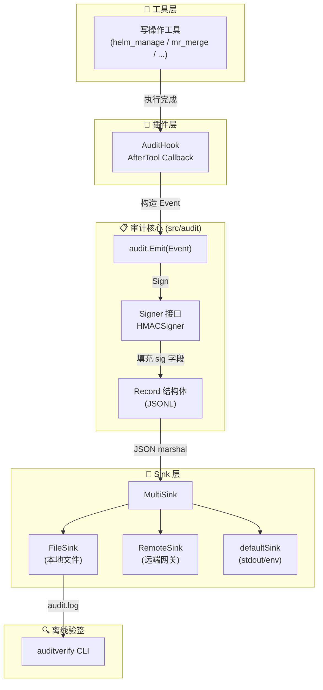
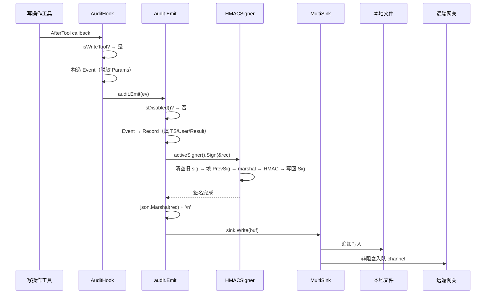
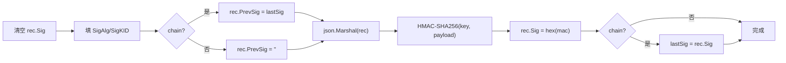
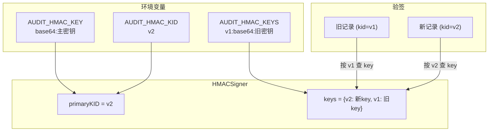
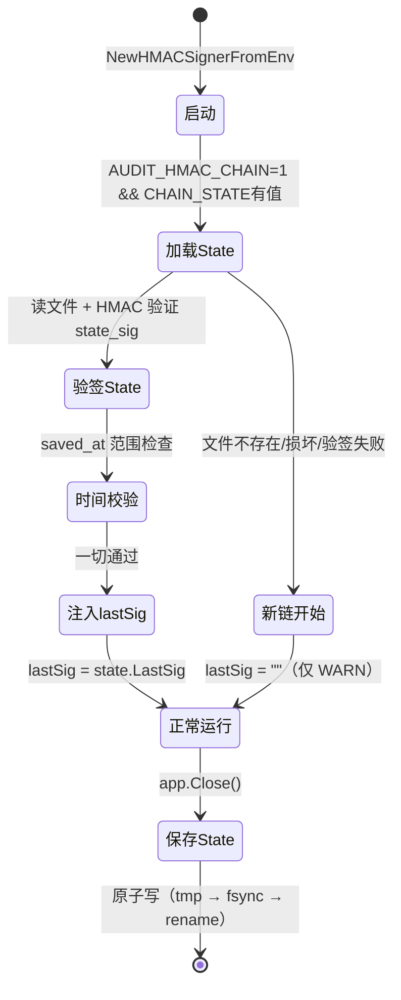
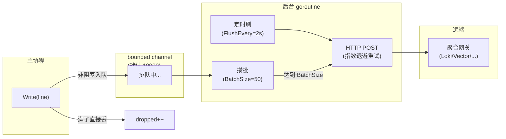
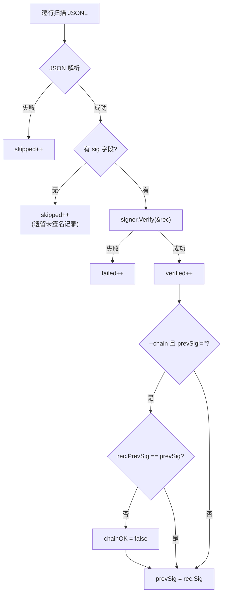
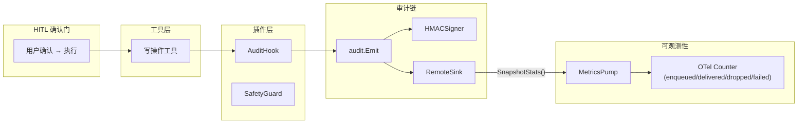

---

# 06 — 审计链与安全

## 一、模块定位

**审计链**是 GameOps Agent 的"事后问责"基础设施：所有通过 HITL 放行的写操作（Helm 部署/回滚、MR 合并、流水线重跑等）在执行成功后，必须追加一条**结构化、可验签、可链式追溯**的审计日志。

核心目标：

| 维度 | 要求 |
|------|------|
| **合规** | 满足 RBAC & 审计日志路线项（D17 系列），支持离线验签 |
| **防篡改** | HMAC-SHA256 签名 + 链式 prev_sig 防中间删除 |
| **零阻塞** | 签名/写日志失败不影响主流程，仅 stderr 告警 |
| **可扩展** | Sink 抽象 + Signer 接口，未来可替换为 KMS/Ed25519/Kafka |

---

## 二、文件清单与职责

| 文件 | 行数 | 核心职责 |
|------|------|---------|
| [`audit.go`](/D:/UGit/Go-Agent/project-agent/src/audit/audit.go) | 267 | Record/Event 结构体、Sink 抽象、`Emit` 主入口、defaultSink、MemorySink |
| [`hmac.go`](/D:/UGit/Go-Agent/project-agent/src/audit/hmac.go) | 619 | Signer 接口、HMACSigner 实现、Sign/Verify/VerifyLine、链式 state 持久化 |
| [`remote_sink.go`](/D:/UGit/Go-Agent/project-agent/src/audit/remote_sink.go) | 424 | RemoteSink（非阻塞远端推送）、MultiSink、FileSink |
| [`audit_hook.go`](/D:/UGit/Go-Agent/project-agent/src/plugin/audit_hook.go) | 186 | AuditHook 插件（AfterTool 阶段自动 Emit） |
| [`main.go`](/D:/UGit/Go-Agent/project-agent/src/cmd/auditverify/main.go) | 183 | 离线验签 CLI（独立 binary，不依赖 app 重型栈） |

---

## 三、架构总览



---

## 四、核心数据结构

### 4.1 Record — 审计记录

```go
type Record struct {
    TS        string         `json:"ts"`                  // RFC3339 时间戳
    User      string         `json:"user"`                // 触发用户
    Agent     string         `json:"agent,omitempty"`     // 发起 Agent
    Action    string         `json:"action"`              // 动作名（与 hitl.Plan.Action 对齐）
    Severity  string         `json:"severity"`            // critical/high/medium/low
    Target    string         `json:"target"`              // 作用对象
    Params    map[string]any `json:"params,omitempty"`    // 关键入参（已脱敏）
    Reason    string         `json:"reason,omitempty"`    // 变更原因
    Result    string         `json:"result"`              // success / failure
    ErrorMsg  string         `json:"error,omitempty"`     // 失败错误信息
    SessionID string         `json:"session_id,omitempty"`// 关联 SSE 会话
    Mock      bool           `json:"mock,omitempty"`      // 是否 Mock 模式

    // ---- HMAC 签名字段 ----
    SigAlg  string `json:"sig_alg,omitempty"`   // 签名算法（HMAC-SHA256）
    SigKID  string `json:"sig_kid,omitempty"`   // 签名密钥 ID
    PrevSig string `json:"prev_sig,omitempty"`  // 链式：上一条的 Sig
    Sig     string `json:"sig,omitempty"`       // HMAC 摘要（hex）
}
```

**设计要点**：
- 签名字段使用 `omitempty`：未签名记录零字节开销，向下兼容
- `Sig` 是最后一个字段：Sign/Verify 清空它再 marshal，顺序只影响可读性
- 所有字段参与签名覆盖（除 sig/sig_alg/sig_kid 本身）

### 4.2 Event — 调用方便捷输入

```go
type Event struct {
    User, Agent, Action, Severity, Target, Reason, SessionID string
    Params  map[string]any
    Success bool
    Err     error
    Mock    bool
}
```

工具层只需构造 `Event`，`Emit` 内部负责转换为 `Record` + 时间戳填充 + 签名。

---

## 五、Emit 主流程



**关键设计决策**：

1. **签名失败不阻塞**：`Sign` 返错只打 stderr，记录仍然落盘（"弱完整性"优于"因签名故障丢失"）
2. **Marshal 两次**：第一次为签名计算 canonical payload，第二次为最终输出（低 QPS 可接受）
3. **环境变量控制**：`AUDIT_DISABLE=1` 完全跳过，适用于 CI/本地调试

---

## 六、HMAC 签名机制

### 6.1 Signer 接口

```go
type Signer interface {
    Sign(rec *Record) error  // 就地修改 rec，填入签名字段
    KeyID() string           // 当前主 kid
}
```

接口设计为未来扩展预留：KMS 异步签名、Ed25519、批量签名等只需另写实现。

### 6.2 HMACSigner 核心字段

```go
type HMACSigner struct {
    primaryKID string            // 签名用的主 kid
    keys       map[string][]byte // 所有已知 kid → raw key（含历史 key）
    chain      bool              // 链式签名开关
    chainMu    sync.Mutex        // 保护 lastSig
    lastSig    string            // 最近一次签名值（链式用）
    stateFile  string            // 链式 state 持久化路径
    loaded     bool              // 是否已从 state 文件加载
}
```

### 6.3 Sign 流程



### 6.4 Verify 流程

```go
func (s *HMACSigner) Verify(rec *Record) error {
    // 1. 备份 rec.Sig
    // 2. 清空 rec.Sig
    // 3. json.Marshal → canonical payload
    // 4. HMAC-SHA256 重算
    // 5. hmac.Equal 常量时间比较（防时序攻击）
    // 6. 恢复 rec.Sig（只读语义）
}
```

### 6.5 密钥轮换



**轮换协议**：
- 签名始终用 `primaryKID`（当前主密钥）
- 验签按记录中的 `sig_kid` 查找对应 key
- 旧 kid 保留在 `AUDIT_HMAC_KEYS` 中，直到所有历史日志过期

### 6.6 密钥编码约定

```go
func decodeBase64Key(v string) ([]byte, error) {
    // 格式：base64:<标准 base64 编码>
    // 最低 16 字节（128 bit）
    // 为什么强制 base64：HMAC key 可含任意字节（包括 0x00），
    // 明文字符串会被 shell 截断/转义
}
```

---

## 七、链式签名（Chain）

### 7.1 原理

每条记录的 `PrevSig` 字段引用上一条的 `Sig`，形成单向链表：

```
Record₁: PrevSig="" , Sig=abc123...
Record₂: PrevSig=abc123..., Sig=def456...
Record₃: PrevSig=def456..., Sig=ghi789...
```

**防攻击效果**：
- 攻击者删除 Record₂ → Record₃ 的 PrevSig 指向不存在的 sig → 离线验证发现断链
- 攻击者改 Record₃.PrevSig 指向 Record₁.Sig → PrevSig 参与了 HMAC，sig 变了 → 验签失败

### 7.2 跨重启持久化（D17.7）



**chainState 结构**：

```go
type chainState struct {
    LastSig    string `json:"last_sig"`
    PrimaryKID string `json:"primary_kid"`    // 入签：防 kid 篡改
    SavedAt    string `json:"saved_at"`       // 入签：防回滚攻击
    StateSig   string `json:"state_sig,omitempty"` // state 自身的 HMAC
}
```

**安全保护**：
- State 文件自身带 HMAC 签名（防攻击者直接改 `last_sig`）
- `SavedAt` 时间范围校验：未来超 5 分钟拒绝（防时钟回拨）、过去超 1 年拒绝（防回滚攻击）
- 原子写：`tmp → fsync → rename`，防 OOM/SIGKILL 时读到半截文件
- 加载失败永不 panic：退化为新链从空开始，仅 WARN

---

## 八、Sink 体系

### 8.1 Sink 接口

```go
type Sink interface {
    Write(line []byte) error
}
```

### 8.2 实现矩阵

| Sink | 用途 | 特点 |
|------|------|------|
| `defaultSink` | 默认（stdout/file via env） | 读 `AUDIT_SINK`/`AUDIT_FILE` 环境变量 |
| `FileSink` | 显式文件路径 | 每次 open/close，rotate 友好 |
| `RemoteSink` | 远端聚合网关 | 非阻塞 channel + 后台 worker |
| `MultiSink` | 组合多个 Sink | 任一子 Sink 失败不影响其他 |
| `MemorySink` | 测试用 | 线程安全内存 buffer |

### 8.3 RemoteSink 设计



**关键设计**：

| 特性 | 实现 |
|------|------|
| **非阻塞** | Write 只往 channel 丢，满了丢弃 + atomic 计数 |
| **背压策略** | 丢新不丢旧（本地文件是 source of truth） |
| **重试** | 5xx/429 指数退避重试（200ms → 400ms → 800ms），4xx 不重试 |
| **优雅关闭** | Close 排空 channel + 等 worker 退出（带超时） |
| **批量编码** | NDJSON（默认）或 JSON array（按 ContentType 切换） |
| **可观测** | 4 个 atomic 计数：enqueued/dropped/delivered/failed |

---

## 九、AuditHook 插件

### 9.1 设计定位

`AuditHook` 是一个 **AfterTool Callback 插件**，挂载在 Agent 的 `tool.Callbacks` 上。它在工具执行完成后自动判断是否为写操作，如果是则构造 `audit.Event` 并调用 `Emit`。

### 9.2 核心逻辑

```go
func (h *AuditHook) after(ctx context.Context, args *tool.AfterToolArgs) (*tool.AfterToolResult, error) {
    // 1. 非写操作 → 跳过
    if !h.isWriteTool(args.ToolName) { return nil, nil }
    
    // 2. 解析入参
    params := map[string]any{}
    json.Unmarshal(args.Arguments, &params)
    
    // 3. 从 ctx 提取 Agent 名
    agentName := h.agentName
    if inv, ok := agent.InvocationFromContext(ctx); ok { agentName = inv.AgentName }
    
    // 4. 构造 Event 并 Emit
    audit.Emit(audit.Event{
        Agent:    agentName,
        Action:   "tool." + args.ToolName,
        Severity: h.severity(args.ToolName),
        Target:   extractTarget(params),
        Params:   shrinkParams(params),  // 脱敏
        Success:  args.Error == nil,
        Err:      args.Error,
    })
}
```

### 9.3 写操作白名单

```go
func DefaultWriteTools() []string {
    return []string{
        "gongfeng_mr_",         // mr_create / mr_merge
        "gongfeng_push",        // 直接 push
        "devops_pipeline_",     // pipeline_rerun / pipeline_trigger
        "devops_build_cancel",  // 取消构建
        "bcs_helm_manage",      // deploy/upgrade/rollback/uninstall
        "tapd_bug_create",      // 创建缺陷单
        "tapd_issue_update",    // 更新工单
    }
}
```

匹配规则：**前缀匹配或全名匹配**。

### 9.4 Severity 路由

```go
func defaultSeverity(toolName string) string {
    switch {
    case contains("uninstall") || prefix("gongfeng_mr_merge") || prefix("gongfeng_push"):
        return "critical"
    case contains("helm_manage") || prefix("devops_pipeline_"):
        return "high"
    default:
        return "medium"
    }
}
```

### 9.5 参数脱敏

`shrinkParams` 自动剔除含 `token`/`secret`/`password`/`api_key` 字样的字段，防止敏感信息泄入审计日志。

---

## 十、离线验签 CLI

### 10.1 用法

```bash
# 基本验签
auditverify --file /var/log/gameops/audit.log

# 链式完整性校验 + 详细输出
auditverify --file audit.log --chain --verbose

# 从 stdin 读取（管道场景）
cat audit.log | auditverify --file - --chain
```

### 10.2 环境变量

与 agent 进程完全一致：

| 变量 | 说明 |
|------|------|
| `AUDIT_HMAC_KEY` | 主密钥（base64 编码） |
| `AUDIT_HMAC_KID` | 主 kid 名 |
| `AUDIT_HMAC_KEYS` | 历史 kid 集合（`kid1:base64:xxx,kid2:base64:yyy`） |

### 10.3 处理逻辑



### 10.4 输出与退出码

```
──── auditverify ────────────────────────────────────
total=1000 verified=980 failed=2 skipped=18
kid_stats={v1:100, v2:880}
chain_ok=false
```

| 退出码 | 含义 |
|--------|------|
| 0 | 全部通过 |
| 1 | 有 failed 或 chain 断裂 |
| 2 | 参数错误 / 文件打不开 / 无 HMAC key |

### 10.5 设计要点

- **独立 binary**：不依赖 app/config/trpc-agent-go 重型栈，合规机器只拷 binary 即可
- **链式 best-effort**：遇到 kid 未知的行当作"链锚点"重置，保证老密钥退役后仍能跑完
- **三档分类**：verified（签名正确）/ failed（签名错误）/ skipped（无签名或解析失败）

---

## 十一、App 层装配

### 11.1 Signer 初始化

```go
// src/app/app.go Init() 中：
if auditSigner, err := audit.NewHMACSignerFromEnv(); err != nil {
    return nil, fmt.Errorf("audit hmac: %w", err)  // REQUIRED=1 + 无 key → fail-fast
} else if auditSigner != nil {
    audit.SetSigner(auditSigner)  // 注入全局 Signer
    log.Printf("[app] audit HMAC signer enabled (kid=%s)", auditSigner.KeyID())
}
```

**三态设计**：
1. 未配 key + 未 REQUIRED → `(nil, nil)` → 不签名（本地开发零配置）
2. 未配 key + REQUIRED=1 → `(nil, err)` → 启动失败（生产强依赖）
3. 配了有效 key → `(signer, nil)` → 正常签名

### 11.2 RemoteSink 装配

```go
auditRemote := startAuditRemote(cfg.Audit)
```

`startAuditRemote` 按配置组合 Sink：

| LocalFile | Remote.URL | 最终 Sink |
|-----------|-----------|-----------|
| 空 | 空 | defaultSink（环境变量控制） |
| 有 | 空 | FileSink |
| 空 | 有 | MultiSink(defaultSink + RemoteSink) |
| 有 | 有 | MultiSink(FileSink + RemoteSink) |

### 11.3 优雅关闭

```go
func (a *App) Close() {
    // 1. 停 MetricsPump（flush 最后一次差值）
    a.MetricsPump.Stop()
    // 2. 关 AuditRemote（最多 5s flush in-flight batch）
    a.AuditRemote.Close(5 * time.Second)
    // 3. 关 Signer（链式 state 持久化落盘）
    audit.CloseSigner()
}
```

**顺序不能反**：先停 pump 再关 remote，确保最后一次 Stats 差值能被采集。

---

## 十二、配置参考

### 12.1 环境变量（HMAC 签名）

| 变量 | 默认 | 说明 |
|------|------|------|
| `AUDIT_HMAC_KEY` | 空（不签名） | 主密钥，格式 `base64:<标准base64>` |
| `AUDIT_HMAC_KID` | `"default"` | 主密钥 ID |
| `AUDIT_HMAC_KEYS` | 空 | 旧密钥集合，格式 `kid1:base64:xxx,kid2:base64:yyy` |
| `AUDIT_HMAC_REQUIRED` | 空 | `=1` 时未配 key 直接 panic |
| `AUDIT_HMAC_CHAIN` | 空 | `=1` 启用链式签名 |
| `AUDIT_HMAC_CHAIN_STATE` | 空 | 链式 state 文件路径 |

### 12.2 环境变量（基础审计）

| 变量 | 默认 | 说明 |
|------|------|------|
| `AUDIT_DISABLE` | 空 | `=1` 完全禁用审计 |
| `AUDIT_SINK` | `stdout` | 输出通道：`stdout`/`file`/`both` |
| `AUDIT_FILE` | `audit.log` | 文件路径（`AUDIT_SINK=file/both` 时生效） |

### 12.3 YAML 配置（远端汇聚）

```yaml
audit:
  local_file: "/var/log/gameops/audit.log"
  remote:
    url: "https://audit-gw.example.com/ingest"
    auth_header: "Bearer xxx"
    headers:
      X-Tenant: "gameops"
    content_type: "application/x-ndjson"
    batch_size: 50
    flush_every_sec: 2
    buffer_size: 10000
    timeout_sec: 5
    max_retries: 3
```

---

## 十三、安全分析

### 13.1 威胁模型与防护

| 威胁 | 防护手段 |
|------|---------|
| 篡改记录内容（如 result: failure→success） | HMAC-SHA256 签名覆盖全部业务字段 |
| 删除中间记录 | 链式 prev_sig：断链可被离线检测 |
| 重放旧 state 文件 | saved_at 时间范围校验（未来 5min / 过去 1年） |
| 篡改 state 文件的 last_sig | state 文件自身带 HMAC 签名 |
| 时序攻击（猜 sig） | `hmac.Equal` 常量时间比较 |
| 密钥泄露后的历史记录 | 多 kid 轮换 + 旧 kid 可验不可签 |
| 弱密钥 | 强制 base64 编码 + 最低 16 字节（128 bit） |
| 审计日志丢失 | 本地文件是 source of truth + 远端 best-effort |

### 13.2 降级策略

| 场景 | 行为 |
|------|------|
| 未配 HMAC key（本地开发） | 正常 Emit，无签名字段 |
| 签名失败 | stderr 告警，记录仍落盘（无签名） |
| 远端不可达 | 本地照常写，远端 dropped 计数 + 后续离线回灌 |
| State 文件损坏 | 新链从空开始，仅 WARN |
| 远端构造失败 | 不阻塞启动，降级为纯本地 |

---

## 十四、测试覆盖

### 14.1 HMAC 测试矩阵（hmac_test.go，816 行）

| 测试类别 | 用例数 | 覆盖点 |
|---------|--------|--------|
| Sign/Verify 往返 | 1 | 字段齐全 + 往返成功 |
| 篡改检测 | 9 | Result/Action/User/Target/Severity/Reason/TS/Mock/Params |
| 未知 kid | 1 | Verify 报 "unknown kid" |
| 错误 key | 1 | 同 kid 不同 key → mismatch |
| 密钥轮换 | 1 | 新 signer 验老 kid 记录 |
| 链式 prev_sig | 2 | 链接正确 + 防删除攻击 |
| VerifyLine | 1 | JSONL 直接验（正/篡改/语法错） |
| Env 构造 | 5 | 空-不required/空-required/有效/过短/坏格式 |
| Emit 集成 | 2 | 有 signer 产 sig / 无 signer 无 sig |
| State 持久化 | 8 | 往返/不存在/篡改sig/篡改last_sig/未来/太老/kid退役/Close |

### 14.2 RemoteSink 测试矩阵（remote_sink_test.go，421 行）

| 测试类别 | 覆盖点 |
|---------|--------|
| URL 必填 | 空 URL 报错 |
| 默认值回填 | BatchSize/BufferSize/Timeout/Retries |
| Happy Path | Write → batch → HTTP 200 |
| Ticker 刷新 | 未达 BatchSize 靠 ticker 触发 |
| 背压丢弃 | buffer 满 → dropped 计数 |
| 5xx 重试 | 指数退避后成功 |
| 4xx 不重试 | 只打一次 |
| 429 重试 | 限流后重试成功 |
| Close 后 Write | 不 panic，计入 dropped |
| NDJSON 编码 | 默认格式正确 |
| JSON Array 编码 | `[]` 包裹 |
| MultiSink | 同时写多个子 Sink |
| 端到端 | Emit → MultiSink(Memory+Remote) |

### 14.3 性能基准（hmac_bench_test.go）

| Benchmark | 预期 |
|-----------|------|
| `BenchmarkHMACSign_Single` | ≥ 1M ops/s（~500ns/op） |
| `BenchmarkHMACSign_Chain` | 链式开销 < 30% |
| `BenchmarkHMACVerify` | 与 Sign 同量级 |
| `BenchmarkHMACSign_Parallel` | 并发安全 + 线性扩展 |

---

## 十五、与其他模块的协作关系



**关键协作点**：
1. **HITL → 审计**：只有通过 HITL 确认的写操作才会触发审计
2. **AuditHook → Emit**：通过 `tool.Callbacks` 的 AfterTool 阶段自动触发
3. **RemoteSink → OTel**：`SnapshotStats()` 方法暴露四元组计数，MetricsPump 周期采集转为 Counter
4. **app.Close**：按序关闭 pump → remote → signer，确保数据完整性

---

## 十六、设计哲学总结

| 原则 | 体现 |
|------|------|
| **零依赖** | 仅 stdlib（encoding/json、crypto/hmac、net/http），不引入 Kafka/ES 重型库 |
| **失败不影响主流程** | 签名失败/写日志失败仅 stderr，不往上抛 |
| **本地是 source of truth** | 远端 best-effort，本地永远有完整记录 |
| **三态降级** | 未配→不签名 / 配了→签名 / REQUIRED→强制 |
| **接口驱动** | Signer/Sink 均为接口，实现可替换 |
| **原子操作** | State 文件 tmp→fsync→rename，防半截 |
| **防御纵深** | HMAC + 链式 + state 签名 + 时间校验 + 常量时间比较 |
