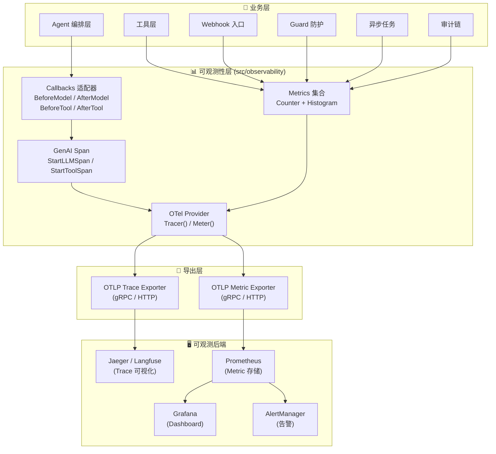
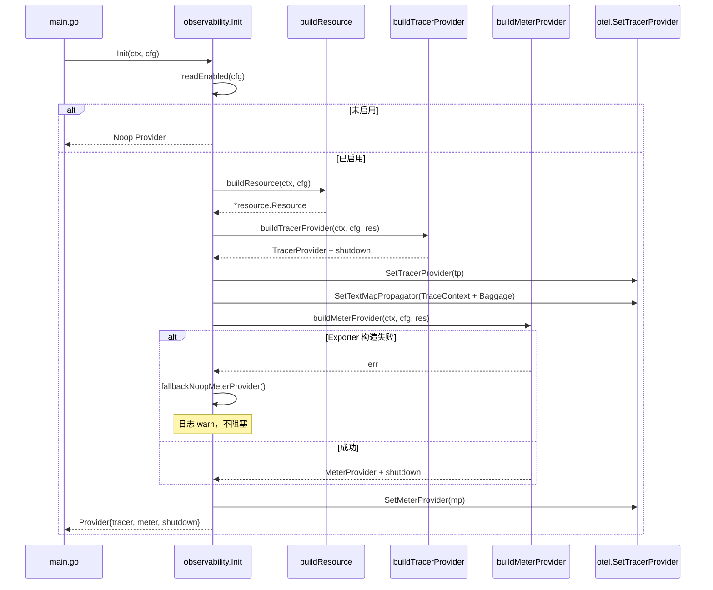
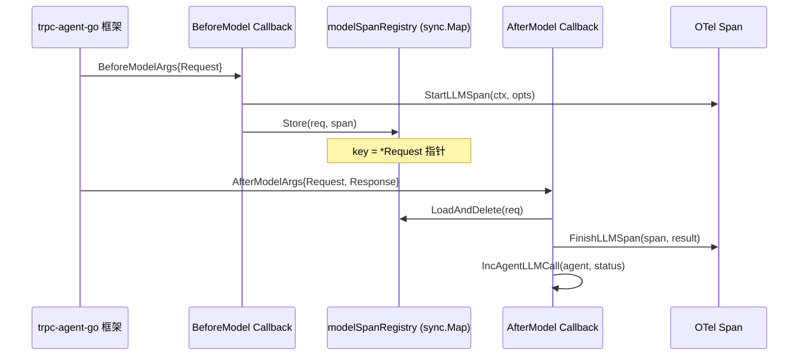
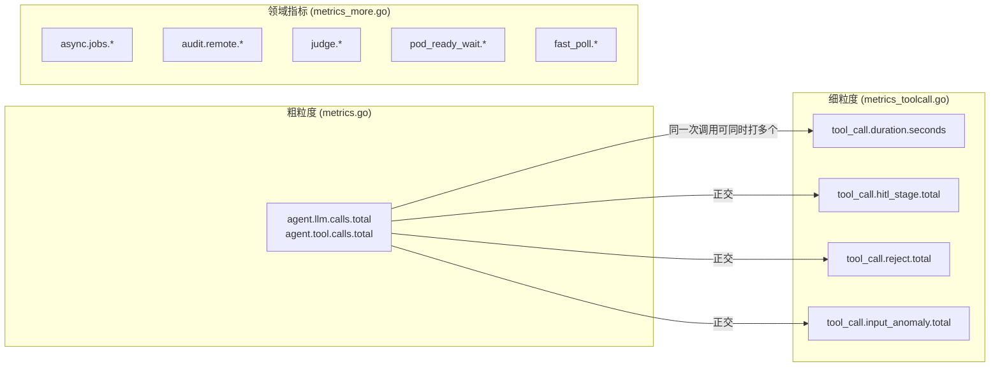
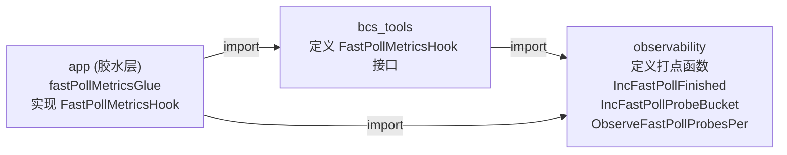
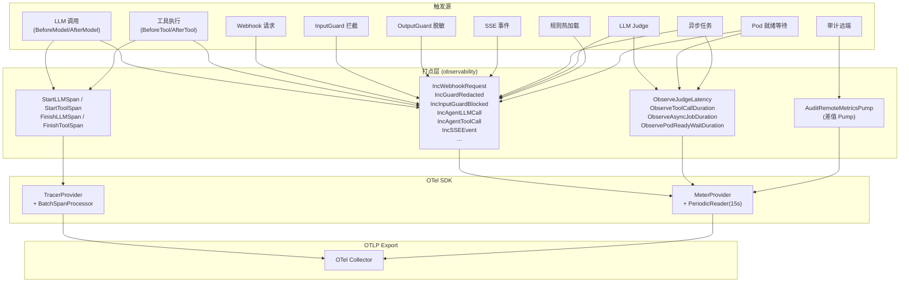
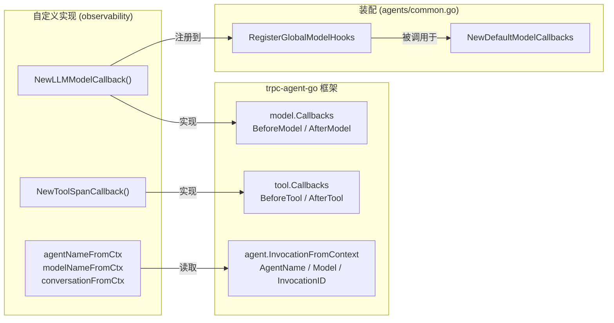

---

# 07 — 可观测性

## 一、模块定位

**可观测性层**是 GameOps Agent 的"运行时透视镜"：通过 OpenTelemetry 标准协议，将 LLM 调用、工具执行、安全防护、异步任务等全链路事件以 **Trace + Metrics** 两种信号形式导出，供 Jaeger/Langfuse（Trace）和 Prometheus/Grafana（Metrics）消费。

核心目标：

| 维度 | 要求 |
|------|------|
| **零依赖可运行** | 默认 Noop Provider，`go run .` 本地即跑，不强依赖 Collector |
| **GenAI 语义对齐** | 遵循 OTel GenAI Semantic Conventions v1.30，后端自动聚合 LLM 会话视图 |
| **观测不反压业务** | Metric Exporter 初始化失败自动降级 Noop + 日志 warn，不拖垮 Agent |
| **集中管理** | 指标/Span 定义集中在 observability 包，业务侧只调 `Tracer()` / `Meter()` |
| **生产告警就绪** | 配套 Prometheus 告警规则，覆盖 8 大告警组 20+ 条规则 |

---

## 二、文件清单与职责

| 文件 | 行数 | 核心职责 |
|------|------|---------|
| [`otel.go`](/D:/UGit/Go-Agent/project-agent/src/observability/otel.go) | 592 | OTel Provider 初始化（Tracer/Meter）、Sampler 解析、Metric Exporter 构建、生命周期管理 |
| [`genai_span.go`](/D:/UGit/Go-Agent/project-agent/src/observability/genai_span.go) | 223 | GenAI Semantic Conv 属性键定义、LLM Span / Tool Span 的 Start/Finish |
| [`callbacks.go`](/D:/UGit/Go-Agent/project-agent/src/observability/callbacks.go) | 228 | 框架回调适配器：把 OTel Span/Counter 接入 trpc-agent-go 的 model.Callbacks / tool.Callbacks |
| [`metrics.go`](/D:/UGit/Go-Agent/project-agent/src/observability/metrics.go) | 160 | 基础 Counter 集合（6 条）：Webhook/Guard/LLM/Tool/SSE |
| [`metrics_more.go`](/D:/UGit/Go-Agent/project-agent/src/observability/metrics_more.go) | 510 | 扩展指标集合：审计远端/Judge/规则热加载/异步任务/PodReady/FastPoll |
| [`metrics_toolcall.go`](/D:/UGit/Go-Agent/project-agent/src/observability/metrics_toolcall.go) | 193 | 工具调用细粒度指标：耗时分布/HITL漏斗/拒绝原因/入参异常 |
| [`async_adapter.go`](/D:/UGit/Go-Agent/project-agent/src/observability/async_adapter.go) | 58 | AsyncRunner 的 OTel 适配器（实现 async.MetricsHook 接口） |
| [`ready_waiter_adapter.go`](/D:/UGit/Go-Agent/project-agent/src/observability/ready_waiter_adapter.go) | 43 | FastPollReadyWaiter 的架构决策文档（解释为何不在此定义 adapter） |
| [`testing_support.go`](/D:/UGit/Go-Agent/project-agent/src/observability/testing_support.go) | 57 | 测试辅助：ManualReader 注入 + 全局 Provider 替换 |

**配套文件**：

| 文件 | 职责 |
|------|------|
| [`deploy/alerts/prometheus_rules.yaml`](/D:/UGit/Go-Agent/project-agent/deploy/alerts/prometheus_rules.yaml) | 生产 Prometheus 告警规则（8 组 20+ 条） |
| [`deploy/prometheus/prometheus.yml`](/D:/UGit/Go-Agent/project-agent/deploy/prometheus/prometheus.yml) | Prometheus 采集配置 |
| [`src/app/ready_waiter_glue.go`](/D:/UGit/Go-Agent/project-agent/src/app/ready_waiter_glue.go) | app 层胶水：桥接 bcs_tools ↔ observability（避免循环 import） |
| [`src/agents/common.go`](/D:/UGit/Go-Agent/project-agent/src/agents/common.go) | 全局 Model Callbacks 注册机制 |

---

## 三、架构总览



---

## 四、OTel Provider 初始化（otel.go）

### 4.1 设计原则

| 原则 | 实现方式 |
|------|---------|
| **默认 Noop** | `OTEL_ENABLED` 未设置时返回 Noop Provider，所有 Span/Counter 调用为空操作 |
| **Provider 封装** | 业务侧只调 `observability.Tracer()` / `observability.Meter()`，不感知底层 |
| **观测故障不反压** | Metric Exporter 构造失败 → 降级 Noop + 日志 warn，Init 不返回 error |
| **双通道独立** | Trace 和 Metric 可配独立 endpoint/protocol，支持非对称止血 |

### 4.2 环境变量配置

```
┌─────────────────────────────────────────┬──────────────────────────────────────────┐
│ 环境变量                                 │ 说明                                      │
├─────────────────────────────────────────┼──────────────────────────────────────────┤
│ OTEL_ENABLED                            │ true/false（默认 false）                   │
│ OTEL_EXPORTER_OTLP_ENDPOINT             │ gRPC/HTTP endpoint                        │
│ OTEL_EXPORTER_OTLP_PROTOCOL             │ grpc / http/protobuf（默认 http/protobuf） │
│ OTEL_SERVICE_NAME                       │ 服务名（默认 gameops-agent）               │
│ OTEL_SERVICE_VERSION                    │ 服务版本（默认 dev）                       │
│ OTEL_DEPLOYMENT_ENVIRONMENT             │ 部署环境（默认 local）                     │
│ OTEL_TRACES_SAMPLER                     │ 采样策略（默认 parentbased_always_on）     │
│ OTEL_TRACES_SAMPLER_ARG                 │ 采样比（0.0～1.0）                         │
│ OTEL_METRICS_DISABLED                   │ 1/true 时强制关闭 metric 导出             │
│ OTEL_METRICS_INTERVAL                   │ metric 采集间隔（默认 15s）               │
│ OTEL_EXPORTER_OTLP_METRICS_ENDPOINT     │ metric 独立 endpoint（可选）              │
│ OTEL_EXPORTER_OTLP_METRICS_PROTOCOL     │ metric 独立 protocol（可选）              │
└─────────────────────────────────────────┴──────────────────────────────────────────┘
```

### 4.3 初始化时序



### 4.4 采样器策略（6 种）

```go
// resolveSampler 根据 OTEL_TRACES_SAMPLER 环境变量返回采样器
func resolveSampler() sdktrace.Sampler {
    switch name {
    case "always_on":           return sdktrace.AlwaysSample()
    case "always_off":          return sdktrace.NeverSample()
    case "traceidratio":        return sdktrace.TraceIDRatioBased(ratio)
    case "parentbased_always_on", "":
                                return sdktrace.ParentBased(sdktrace.AlwaysSample())
    case "parentbased_always_off":
                                return sdktrace.ParentBased(sdktrace.NeverSample())
    case "parentbased_traceidratio":
                                return sdktrace.ParentBased(sdktrace.TraceIDRatioBased(ratio))
    default:                    return sdktrace.ParentBased(sdktrace.AlwaysSample()) // 兜底
    }
}
```

**生产推荐**：`parentbased_traceidratio` + `ARG=0.1`（10% 采样），平衡成本与可观测性。

### 4.5 Metric Provider 构建

三条路径：

| 条件 | 行为 |
|------|------|
| `OTEL_METRICS_DISABLED=1` | 直接返回 Noop MeterProvider |
| endpoint 为空 | 返回 Noop MeterProvider（合法路径，不报错） |
| endpoint 有值 | 构建 OTLP Exporter → PeriodicReader(interval=15s) → MeterProvider |

**关键设计**：`composeShutdown` 合并 trace 与 metric 的关闭回调，先 flush metric（可能积累了 15s 数据点），再关 trace。

### 4.6 全局 API

```go
// 业务侧使用方式（零配置，未 Init 时自动 Noop）
observability.Tracer()    // → trace.Tracer
observability.Meter()     // → metric.Meter
observability.IsEnabled() // → bool
observability.ShutdownGlobal(ctx) // 进程退出时调用
```

---

## 五、GenAI Semantic Conventions（genai_span.go）

### 5.1 规范对齐

本项目遵循 **OpenTelemetry GenAI Semantic Conventions v1.30（Draft）**，确保在 Langfuse / Jaeger / Datadog 等 GenAI 感知型后端能直接聚合成"LLM 会话视图"。

### 5.2 属性键定义

**标准 GenAI 属性**（`gen_ai.*` 前缀）：

| 常量 | 属性键 | 说明 |
|------|--------|------|
| `AttrGenAISystem` | `gen_ai.system` | LLM 系统（hunyuan/openai/unknown） |
| `AttrGenAIOperationName` | `gen_ai.operation.name` | 操作类型（chat/agent/execute_tool） |
| `AttrGenAIRequestModel` | `gen_ai.request.model` | 请求模型名 |
| `AttrGenAIResponseModel` | `gen_ai.response.model` | 响应模型名 |
| `AttrGenAIRequestTemperature` | `gen_ai.request.temperature` | 温度参数 |
| `AttrGenAIRequestTopP` | `gen_ai.request.top_p` | TopP 参数 |
| `AttrGenAIRequestMaxTokens` | `gen_ai.request.max_tokens` | 最大 Token 数 |
| `AttrGenAIUsageInputTokens` | `gen_ai.usage.input_tokens` | 输入 Token 用量 |
| `AttrGenAIUsageOutputTokens` | `gen_ai.usage.output_tokens` | 输出 Token 用量 |
| `AttrGenAIResponseFinishReason` | `gen_ai.response.finish_reasons` | 结束原因 |
| `AttrGenAIAgentName` | `gen_ai.agent.name` | Agent 名称 |
| `AttrGenAIToolName` | `gen_ai.tool.name` | 工具名称 |
| `AttrGenAIToolCallID` | `gen_ai.tool.call.id` | 工具调用 ID |
| `AttrGenAIConversationID` | `gen_ai.conversation.id` | 会话 ID |

**业务自定义属性**（`gameops.*` 前缀，避免与 OTel 规范冲突）：

| 常量 | 属性键 | 说明 |
|------|--------|------|
| `AttrGameOpsAgentKind` | `gameops.agent.kind` | Agent 类型 |
| `AttrGameOpsToolTarget` | `gameops.tool.target` | 工具 Target 标签 |
| `AttrGameOpsRedactRule` | `gameops.guard.rule` | 脱敏规则名 |
| `AttrGameOpsRedactHits` | `gameops.guard.redact_hits` | 脱敏命中次数 |
| `AttrGameOpsWebhookSource` | `gameops.webhook.source` | Webhook 来源 |
| `AttrGameOpsWebhookOutcome` | `gameops.webhook.outcome` | Webhook 处理结果 |
| `AttrGameOpsCaseID` | `gameops.case_id` | 案例 ID |
| `AttrGameOpsInjectionSource` | `gameops.input_guard.rule` | 注入检测规则 |

### 5.3 两类 Span

#### LLM Span（`gen_ai.{operation}`）

```go
// Span 名格式："{operation} {model}"，例如 "chat hunyuan-turbo-s"
func StartLLMSpan(ctx context.Context, opts LLMSpanOptions) (context.Context, trace.Span)
func FinishLLMSpan(span trace.Span, result LLMSpanResult)
```

- **SpanKind**: `Client`（向外部 LLM 服务发起请求）
- **属性**：system / operation / model / agent / conversation / temperature / topP / maxTokens
- **结束时写入**：response_model / input_tokens / output_tokens / finish_reasons / error

#### Tool Span（`execute_tool`）

```go
// Span 名格式："execute_tool {toolName}"
func StartToolSpan(ctx context.Context, opts ToolSpanOptions) (context.Context, trace.Span)
func FinishToolSpan(span trace.Span, err error)
```

- **SpanKind**: `Internal`（Agent 内部工具执行）
- **属性**：operation / tool_name / agent / target / call_id

### 5.4 System 推断逻辑

```go
func systemFromModel(model, hint string) string {
    // 优先使用显式 hint
    // 否则按模型名前缀推断：hunyuan* → "hunyuan"，gpt*/o1*/o3* → "openai"
    // 未知 → "unknown"
}
```

---

## 六、Callbacks 适配器（callbacks.go）

### 6.1 设计动机

将 OTel Span/Counter 接入 **trpc-agent-go 框架**的 `model.Callbacks` / `tool.Callbacks` 抽象，实现"框架驱动、业务无感"的自动埋点。

**为什么不在 agents 包里写**：
- 保持 observability 包"可独立禁用"的边界
- 集中 GenAI Semantic Convention 实现，避免各 Agent 重复写 attribute key

### 6.2 LLM Model Callback



**关键实现细节**：

```go
// 由于框架的 BeforeModel 返回的 ctx 不会被 AfterModel 拿到，
// 采用 sync.Map 以 Request 指针为 key 暂存 Span 引用
var modelSpanRegistry sync.Map // key: *agentmodel.Request, value: trace.Span

func NewLLMModelCallback() (before, after) {
    before = func(ctx, args) {
        // 从 ctx 提取 agentName / modelName / conversationID
        // 从 Request.GenerationConfig 提取 temperature / topP / maxTokens
        _, span := StartLLMSpan(ctx, opts)
        modelSpanRegistry.Store(req, span)
    }
    after = func(ctx, args) {
        span := modelSpanRegistry.LoadAndDelete(args.Request)
        // 写入 usage / finish_reason / error
        FinishLLMSpan(span, result)
        IncAgentLLMCall(ctx, agentName, status)
    }
}
```

### 6.3 Tool Callback

```go
var toolSpanRegistry sync.Map // key: toolName string, value: trace.Span

func NewToolSpanCallback() (before, after) {
    before = func(ctx, args) {
        _, span := StartToolSpan(ctx, ToolSpanOptions{...})
        toolSpanRegistry.Store(args.ToolName, span)
    }
    after = func(ctx, args) {
        span := popToolSpan(args) // 兼容 before/after 参数指针不一致
        FinishToolSpan(span, args.Error)
        IncAgentToolCall(ctx, agentName, toolName, status)
    }
}
```

### 6.4 装配流程（app 层）

```go
// src/app/app.go 中的装配代码
beforeLLM, afterLLM := observability.NewLLMModelCallback()
agents.RegisterGlobalModelHooks(
    []model.BeforeModelCallbackStructured{beforeLLM},
    []model.AfterModelCallbackStructured{afterLLM},
)
```

**全局钩子注册机制**（`src/agents/common.go`）：

```go
// 1. app.Init 最早阶段调用 agents.RegisterGlobalModelHooks(before, after)
// 2. 各 Agent 构造 modelCallbacks 时统一走 agents.NewDefaultModelCallbacks()
// 3. 该函数先 Register FillSystemContextInfo，再串入全局 hook
func NewDefaultModelCallbacks() *agentmodel.Callbacks {
    cb := agentmodel.NewCallbacks().
        RegisterBeforeModel(FillSystemContextInfo)  // 时间上下文注入
    // 追加全局 hook（input_guard + output_guard + OTel span）
    for _, h := range globalBeforeModelHooks { cb.RegisterBeforeModel(h) }
    for _, h := range globalAfterModelHooks  { cb.RegisterAfterModel(h) }
    return cb
}
```

---

## 七、Metrics 指标体系

### 7.1 设计模式：集中注册 + 惰性缓存

```go
// countersCache 惰性创建并缓存 Counter 句柄
type countersCache struct {
    mu    sync.Mutex
    cache map[string]metric.Int64Counter
}

func (c *countersCache) get(name, desc string) metric.Int64Counter {
    // 首次调用时创建 Counter，后续复用缓存
    // 创建失败时返回 Noop Counter，保证调用方无 panic
}

// histogramsCache 同理，缓存 Float64Histogram
type histogramsCache struct { ... }
```

**为什么不在业务侧直接 `Meter().Int64Counter(...)`**：
- Counter 只需懒初始化一次，业务侧高频调用会污染后端
- 集中管理便于 SRE 做告警规则（本文件顶部即全量指标清单）

### 7.2 全量指标清单

#### 基础指标（metrics.go）

| 指标名 | 类型 | 维度 | 说明 |
|--------|------|------|------|
| `gameops.webhook.requests.total` | Counter | source, outcome | Webhook 请求计数 |
| `gameops.guard.redacted.total` | Counter | rule | OutputGuard 脱敏命中 |
| `gameops.input_guard.blocked.total` | Counter | rule | InputGuard 拦截 |
| `gameops.agent.llm.calls.total` | Counter | agent, status | Agent LLM 调用 |
| `gameops.agent.tool.calls.total` | Counter | agent, tool, status | Agent 工具调用 |
| `gameops.sse.events.total` | Counter | event | SSE 事件下发 |

#### 扩展指标（metrics_more.go）

| 指标名 | 类型 | 维度 | 说明 |
|--------|------|------|------|
| `gameops.audit.remote.enqueued.total` | Counter | — | 审计入队 |
| `gameops.audit.remote.delivered.total` | Counter | — | 审计投递成功 |
| `gameops.audit.remote.dropped.total` | Counter | — | 审计背压丢弃 ⚠️ |
| `gameops.audit.remote.failed.total` | Counter | — | 审计投递失败 ⚠️ |
| `gameops.judge.calls.total` | Counter | status | LLM Judge 调用 |
| `gameops.judge.latency.seconds` | Histogram | — | Judge 耗时分布 |
| `gameops.rule.reload.total` | Counter | kind, status | 规则热加载 |
| `gameops.async.jobs.submitted.total` | Counter | tool, outcome | 异步任务提交 |
| `gameops.async.jobs.finished.total` | Counter | tool, status | 异步任务完成 |
| `gameops.async.jobs.duration.seconds` | Histogram | tool, status | 异步任务耗时 |
| `gameops.pod_ready_wait.total` | Counter | mode, status | Pod 就绪等待 |
| `gameops.pod_ready_wait.duration.seconds` | Histogram | mode, status | Pod 就绪耗时 |
| `gameops.ready_waiter.fast_poll.finished.total` | Counter | mode, reason | FastPoll 终态 |
| `gameops.ready_waiter.fast_poll.ready_probe.total` | Counter | mode, bucket | FastPoll 首探分桶 |
| `gameops.ready_waiter.fast_poll.probes_per_wait` | Histogram | mode, reason | FastPoll probe 次数 |

#### 工具调用细粒度指标（metrics_toolcall.go）

| 指标名 | 类型 | 维度 | 说明 |
|--------|------|------|------|
| `gameops.tool_call.duration.seconds` | Histogram | tool, status | 工具调用耗时分布 |
| `gameops.tool_call.hitl_stage.total` | Counter | tool, stage | HITL 漏斗计数 |
| `gameops.tool_call.reject.total` | Counter | tool, reason | 工具拒绝原因 |
| `gameops.tool_call.input_anomaly.total` | Counter | tool, anomaly | 入参异常 |

### 7.3 指标分层关系



### 7.4 HITL 漏斗指标详解

```
stage 取值：
  plan       → LLM 第 1 次调用（confirmed=false），返回了 Plan
  confirmed  → LLM 第 2 次调用（confirmed=true），用户确认后执行
  rejected   → Plan 返回后用户拒绝 / 超时未回
  disabled   → HITL_DISABLE=1 直通（测试/CI 模式）

核心公式：
  HITL 首次通过率 = confirmed_count / plan_count
```

### 7.5 Histogram 桶设计

| 指标 | 桶边界（秒） | 设计理由 |
|------|-------------|---------|
| Judge 耗时 | 0.05, 0.1, 0.25, 0.5, 1, 2, 5, 10, 20, 30, 60 | 覆盖 Mock(50ms) ~ 大模型(60s) |
| 异步任务耗时 | 0.05 ~ 300 | 覆盖快工具(50ms) ~ pod重启(5min) |
| Pod 就绪耗时 | 0.5 ~ 300 | 覆盖单Pod(1s) ~ 大Deployment(5min) |
| 工具调用耗时 | 0.001 ~ 60 | 覆盖 Mock(1ms) ~ helm同步等待(60s) |
| FastPoll probe次数 | 1 ~ 200 | 监控 BCS 查询压力 |

---

## 八、AuditRemote Metrics Pump

### 8.1 设计动机

RemoteSink 的 Stats 是 atomic 计数器，不能直接作为 OTel Counter 使用。采用**差值 Pump** 模式：后台 goroutine 周期性读取快照，计算差值后转为 Counter.Add。

**为什么不在 RemoteSink.Write 里直接 Inc**：
- Write 是业务热路径，多一次 Counter.Add 有额外 mutex 开销
- Dropped/Failed 发生在后台 worker 里，在 Write 里拿不到

### 8.2 实现

```go
type AuditRemoteMetricsPump struct {
    provider RemoteSinkStatsProvider  // 抽象接口，避免循环 import
    interval time.Duration            // 默认 15s
    stop     chan struct{}
    done     chan struct{}
    lastEnq, lastDel, lastDrp, lastFail int64  // 上次快照
}

// 主循环：ticker 驱动，ctx cancel 或 Stop() 时退出
func (p *AuditRemoteMetricsPump) run(ctx context.Context) {
    defer close(p.done)
    t := time.NewTicker(p.interval)
    for {
        select {
        case <-p.stop:  p.pumpOnce(ctx); return
        case <-ctx.Done(): p.pumpOnce(ctx); return
        case <-t.C:     p.pumpOnce(ctx)
        }
    }
}

// 差值计算：当前快照 - 上次快照，仅 > 0 时上报
func (p *AuditRemoteMetricsPump) pumpOnce(ctx context.Context) {
    enq, del, drp, fail := p.provider.SnapshotStats()
    if d := enq - p.lastEnq; d > 0 { ctrs.get(...).Add(ctx, d) }
    // ... 同理 delivered / dropped / failed
}
```

---

## 九、Async 适配器（async_adapter.go）

### 9.1 核心能力/观测层分离

```
async 包（核心能力）          observability 包（观测层）
┌─────────────────┐          ┌─────────────────────┐
│ MetricsHook 接口 │◄─────────│ AsyncMetricsAdapter │
│   OnSubmit()    │          │   实现 MetricsHook  │
│   OnFinish()    │          │   桥接到 OTel       │
└─────────────────┘          └─────────────────────┘
```

**设计原则**：async 包保持"零项目内依赖"，通过接口暴露观测点；observability 包提供默认实现。

```go
type AsyncMetricsAdapter struct{} // 无状态，并发安全

func (a *AsyncMetricsAdapter) OnSubmit(tool, outcome string) {
    IncAsyncJobSubmitted(context.Background(), tool, outcome)
}

func (a *AsyncMetricsAdapter) OnFinish(tool, status string, total time.Duration) {
    IncAsyncJobFinished(ctx, tool, status)
    ObserveAsyncJobDuration(ctx, tool, status, total.Seconds())
}
```

**为什么用 `context.Background()`**：hook 调用点在 Runner 内部，业务 ctx 可能已被 cancel（请求已返回），但指标仍应上报成功。

---

## 十、FastPoll 胶水层（避免循环 import）

### 10.1 问题

```
bcs_tools  →（正向 import）→ observability   ✅
observability →（反向 import）→ bcs_tools    ❌ 循环 import！
```

### 10.2 解决方案



**app 层胶水**（`src/app/ready_waiter_glue.go`）：

```go
type fastPollMetricsGlue struct{}

func (fastPollMetricsGlue) OnWaitFinished(mode string, stats bcstools.FastPollStats) {
    ctx := context.Background()
    observability.IncFastPollFinished(ctx, mode, stats.Reason)
    if stats.Reason == "ready" && stats.ProbeIndexWhenReady > 0 {
        observability.IncFastPollProbeBucket(ctx, mode, stats.ProbeIndexWhenReady)
    }
    observability.ObserveFastPollProbesPer(ctx, mode, stats.Reason, stats.TotalProbes)
    // 复用 D19.5 指标，让已部署的 dashboard 自动覆盖新实现
    if stats.Elapsed > 0 {
        observability.ObservePodReadyWaitDuration(ctx, mode, stats.Reason, stats.Elapsed.Seconds())
        observability.IncPodReadyWait(ctx, mode, stats.Reason)
    }
}
```

### 10.3 FastPoll Probe 分桶策略

```
probeIdx == 1        → "first"      首探即命中（目标本来就 ready）
probeIdx ∈ [2, 5]   → "fast_stage"  阶梯退避区间命中（FastPoll 增量价值）
probeIdx > 5         → "steady"     稳态轮询命中（与传统 Poll 等同）

运维判断：
  first + fast_stage 占比 >60% → FastPoll 实质提升用户感知延迟
  steady 占比接近 100%         → 业务普遍是慢场景，FastPoll 无增量价值
```

---

## 十一、Prometheus 告警规则

### 11.1 规则组总览

| # | 规则组 | 告警数 | 覆盖场景 |
|---|--------|--------|---------|
| 1 | `gameops-agent.guard` | 2 | InputGuard 拦截突增 / OutputGuard 脱敏频率偏高 |
| 2 | `gameops-agent.webhook` | 3 | 签名失败 / 拒绝率 >30% / Payload 解析失败 |
| 3 | `gameops-agent.llm` | 2 | LLM 失败率 >10% / 调用归零 |
| 4 | `gameops-agent.tools` | 2 | 工具失败率 >20% / 写操作突增 |
| 5 | `gameops-agent.sse` | 2 | SSE error 频发 / HITL 确认占比过高 |
| 6 | `gameops-agent.async` | 4 | 队列积压 / 限流拒绝 / 超时率 >10% / p95 延迟退化 |
| 7 | `gameops-agent.audit` | 4 | 审计丢弃 / 投递失败 / Judge 错误率 / 规则重载失败 |

### 11.2 关键告警详解

#### Critical 级别

| 告警 | 表达式 | 含义 |
|------|--------|------|
| `GameOpsWebhookSignatureFailures` | `rate(signature_failed) > 1/min` | 可能密钥泄漏/被探测 |
| `GameOpsLLMErrorRatioHigh` | `error_rate > 10%` | LLM 服务故障/鉴权过期 |
| `GameOpsAsyncTimeoutRatioHigh` | `timed_out > 10%` | 工具真的慢，需扩 timeout |
| `GameOpsAuditRemoteDropped` | `dropped > 0` | **合规红线**：审计链完整性被破坏 |

#### Warning 级别

| 告警 | 表达式 | 含义 |
|------|--------|------|
| `GameOpsInputGuardBlockedSpike` | `rate > 10/min` | 可能遭到 Prompt 注入攻击 |
| `GameOpsToolErrorRatioHigh` | `error_rate > 20%` | 后端服务降级 |
| `GameOpsWriteToolBurst` | `write_ok > 3/min` | HITL 闸门可能被关闭 |
| `GameOpsAsyncQueueSaturated` | `submitted - finished > 5/min` | 队列积压 |
| `GameOpsRuleReloadFailed` | `failed > 2 in 30m` | 规则变更不生效的静默事故 |

### 11.3 指标名转换规则

OTel → Prometheus 的自动转换：`.` → `_`

```
gameops.agent.llm.calls.total  →  gameops_agent_llm_calls_total
gameops.async.jobs.duration.seconds  →  gameops_async_jobs_duration_seconds_bucket
```

---

## 十二、测试支持（testing_support.go）

### 12.1 ManualReader 注入

```go
// 典型用法（_test.go 内）
func TestSomeMetric(t *testing.T) {
    reader, restore := observability.SetMeterForTest()
    t.Cleanup(restore)

    // 触发业务逻辑
    observability.IncJudgeCall(context.Background(), "ok")

    // 断言指标
    var rm metricdata.ResourceMetrics
    _ = reader.Collect(context.Background(), &rm)
    // 断言 rm.ScopeMetrics[0].Metrics[0].Data ...
}
```

**为什么独立文件而非 `_test.go`**：其他包（如 audit 测试）也可能需要注入 ManualReader，放在 `_test.go` 外部包无法 import。

### 12.2 缓存重置

```go
ResetMetricsForTest()     // 清空 counter 缓存
ResetHistogramsForTest()  // 清空 histogram 缓存
```

替换全局 Provider 后必须重置缓存，否则旧 counter 不会被新 reader 观察到。

---

## 十三、数据流全景



---

## 十四、关键设计决策总结

| # | 决策 | 理由 |
|---|------|------|
| 1 | 默认 Noop，显式 `OTEL_ENABLED=true` 才启用 | 保证 `go run .` 本地零依赖可跑 |
| 2 | Metric Exporter 失败降级而非 Init 失败 | 观测系统坏了，业务必须继续跑 |
| 3 | `OTEL_METRICS_DISABLED` 独立于 `OTEL_ENABLED` | 支持"trace 保留、metric 关停"非对称止血 |
| 4 | sync.Map 暂存 Span（而非 ctx 传递） | 框架 BeforeModel/AfterModel 的 ctx 不互通 |
| 5 | Counter 惰性缓存 + Noop 兜底 | 避免高频创建 + 保证调用方无 panic |
| 6 | AuditRemote 走差值 Pump 而非直接 Inc | 热路径零开销 + Dropped/Failed 在后台 worker |
| 7 | FastPoll 胶水放 app 层 | 避免 observability ↔ bcs_tools 循环 import |
| 8 | Histogram 显式桶边界 | 精确覆盖各场景的延迟区间，避免默认桶浪费 |
| 9 | composeShutdown 先 metric 后 trace | metric 有 15s 积累数据需先 flush |
| 10 | 指标名 `gameops.*` + snake_case + 点分组 | 与 OTel→Prom 转换规则对齐 |

---

## 十五、与框架的协作关系



**框架提供**：
- `model.Callbacks` / `tool.Callbacks` 回调注册机制
- `agent.InvocationFromContext` 从 ctx 提取运行时信息（AgentName / Model / InvocationID）
- `model.Request` / `model.Response` 结构体（含 Usage / Choices / GenerationConfig）

**自定义实现**：
- GenAI Semantic Conv 属性键定义与 Span 管理
- sync.Map 暂存 Span 的跨回调传递方案
- 全量 Counter/Histogram 指标定义与打点 API
- 差值 Pump、适配器、胶水层等桥接模式
- Prometheus 告警规则

---
