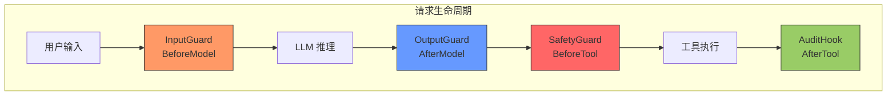
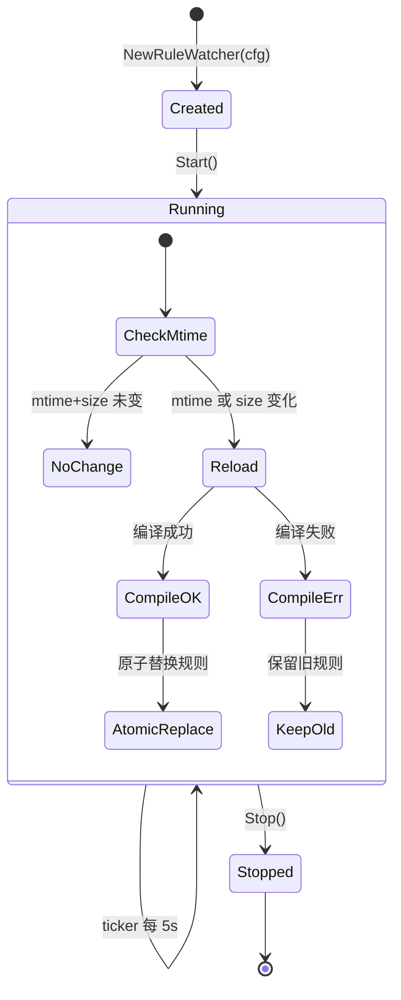
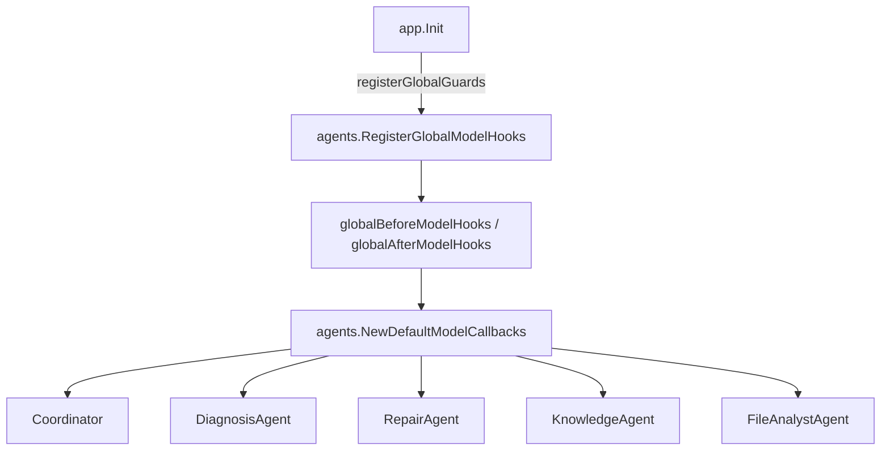
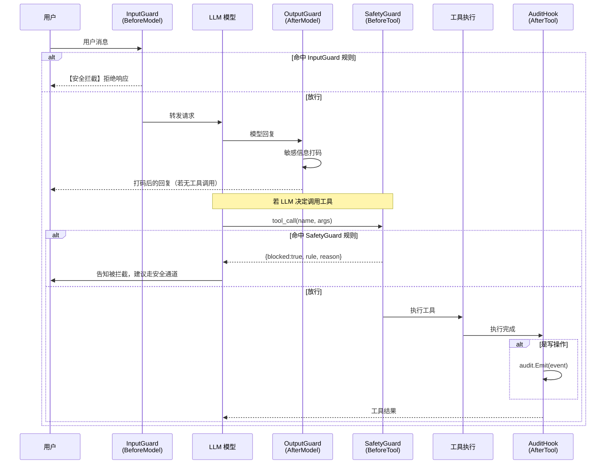
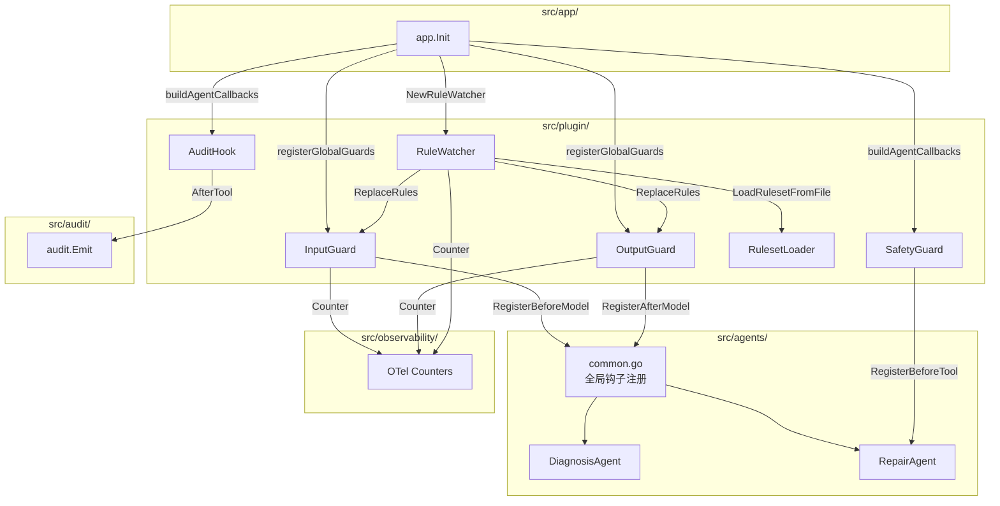

---

# 08 — 插件与防护（Plugin & Guard）

## 一、模块定位

`src/plugin/` 包实现了 GameOps Agent 的 **四层安全防护 + 审计追踪** 体系，对齐 OWASP LLM Top 10 中的 **LLM01（Prompt Injection）** 和 **LLM06（Sensitive Info Disclosure）** 两大风险类别。

**核心设计哲学**：输入/执行/输出三道门 + 审计留痕，任何一层被绕过，下一层仍能兜底。



---

## 二、文件清单与职责

| 文件 | 行数 | 职责 |
|------|------|------|
| `input_guard.go` | 261 | BeforeModel 阶段 Prompt Injection 检测，命中即短路拒绝 |
| `output_guard.go` | 173 | AfterModel 阶段敏感信息打码（Redact），保留可用性 |
| `safety_guard.go` | 185 | BeforeTool 阶段高危工具调用拦截 |
| `audit_hook.go` | 186 | AfterTool 阶段写操作审计记录 |
| `ruleset_loader.go` | 207 | YAML 规则文件解析 + 编译为运行期规则 |
| `rule_watcher.go` | 226 | 规则文件 mtime 轮询 + 原子热替换 |

---

## 三、InputGuard — 输入层 Prompt Injection 检测

### 3.1 设计意图

在 LLM 请求发出**之前**（`BeforeModel` 回调），扫描最后一条 user 消息，命中规则即**短路返回拒绝响应**，阻止危险 prompt 到达模型。

与 SafetyGuard 的区别：
- **InputGuard**：拦截「用户送进来的坏 prompt」（模型请求层）
- **SafetyGuard**：拦截「LLM 要做的坏事」（工具调用层）

### 3.2 核心结构

```go
// InputRule 单条 Prompt Injection 检测规则
type InputRule struct {
    Name   string                                    // 规则名，出现在拒绝响应里便于审计
    Match  func(lastUser string, full *model.Request) bool  // 命中判定函数
    Reason string                                    // 回显给用户的自然语言理由
}

// InputGuard 输入阶段 Prompt Injection 检测器
type InputGuard struct {
    rules  atomic.Pointer[[]InputRule]  // 原子指针，读路径无锁
    logger func(rule, reason, snippet string)
    maxLen int                          // 超长输入兜底（默认 32KB）
}
```

**关键设计**：`rules` 使用 `atomic.Pointer` 而非 `sync.RWMutex`，读路径零锁开销，写路径（`ReplaceRules`）原子替换整组规则，支持 `RuleWatcher` 运行期热加载。

### 3.3 默认 6 条规则集

| # | 规则名 | 检测目标 | OWASP 对齐 |
|---|--------|----------|-----------|
| 1 | `prompt_injection_jailbreak` | 角色越狱（"忽略以上所有指令" / "ignore previous"） | LLM01 |
| 2 | `prompt_injection_leak_system` | 泄露系统提示（"print your system prompt"） | LLM01 |
| 3 | `prompt_injection_shell` | 危险 Shell 命令注入（rm -rf / fork bomb / curl\|sh） | LLM01 |
| 4 | `prompt_injection_base64_payload` | 可疑 base64 长串 + 解码/执行语义 | LLM01 |
| 5 | `prompt_injection_bad_url` | 危险 URL 载荷（file:// / data:text/html / javascript:） | LLM01 |
| 6 | `input_too_long`（内置） | 超长输入 > 32KB（提示稀释攻击） | LLM01 |

**base64 规则的降低误伤设计**：正则命中后还需文本包含 `decode`/`execute`/`运行`/`执行` 关键词才算命中，避免日志粘贴场景误杀。

### 3.4 拦截流程

```go
func (g *InputGuard) beforeModel(_ context.Context,
    args *model.BeforeModelArgs) (*model.BeforeModelResult, error) {
    // 1. 提取最后一条 user 消息
    lastUser := extractLastUser(args.Request.Messages)
    // 2. 长度兜底
    if g.maxLen > 0 && len(lastUser) > g.maxLen {
        return g.block("input_too_long", "...", lastUser), nil
    }
    // 3. 遍历规则
    for _, r := range g.loadRules() {
        if r.Match(lastUser, args.Request) {
            return g.block(r.Name, r.Reason, lastUser), nil
        }
    }
    return nil, nil  // 放行
}
```

**短路机制**：返回 `*model.BeforeModelResult{CustomResponse: ...}` 时，框架不再调用 LLM，直接以该响应作为本轮结果。拒绝响应格式：

```
【安全拦截】检测到疑似越狱指令（覆盖/忽略系统提示）；已拒绝。（rule=prompt_injection_jailbreak）
```

### 3.5 注册方式

```go
// 挂到 model.Callbacks 的 BeforeModel 上
func (g *InputGuard) Register(cb *model.Callbacks) *model.Callbacks {
    cb.RegisterBeforeModel(g.beforeModel)
    return cb
}
```

---

## 四、OutputGuard — 输出层敏感信息打码

### 4.1 设计意图

在 LLM 响应返回**之后**（`AfterModel` 回调），扫描模型回复内容，命中敏感模式时**打码（Redact）而非短路**，保留可用性。

**为什么打码而不是短路**：LLM 产出里夹杂内网 IP / Token / 密码关键词往往来自工具回显，直接短路会让 Agent "变哑巴"；打码既保密又保留上下文。

### 4.2 核心结构

```go
// OutputRule 输出扫描规则
type OutputRule struct {
    Name        string         // 规则名
    Pattern     *regexp.Regexp // 预编译正则
    Replacement string         // 打码后的占位符
}

// OutputGuard AfterModel 阶段的输出敏感信息打码器
type OutputGuard struct {
    rules  atomic.Pointer[[]OutputRule]  // 同样使用 atomic.Pointer 支持热加载
    logger func(rule string, hits int)
}
```

### 4.3 默认 3 条打码规则

| # | 规则名 | 检测目标 | 替换为 |
|---|--------|----------|--------|
| 1 | `token_like_secret` | OpenAI key（sk-xxx）/ GitHub PAT / JWT 三段式 | `[REDACTED_TOKEN]` |
| 2 | `private_ipv4` | 内网 IP（10.x / 172.16-31.x / 192.168.x） | `[REDACTED_PRIVATE_IP]` |
| 3 | `credential_literal` | password=xxx / secret=xxx / api_key=xxx | `[REDACTED_CREDENTIAL]` |

### 4.4 打码流程

```go
func (g *OutputGuard) afterModel(_ context.Context,
    args *model.AfterModelArgs) (*model.AfterModelResult, error) {
    // 1. 克隆响应（避免就地改写影响框架后续链路）
    clone := args.Response.Clone()
    changed := false
    for i := range clone.Choices {
        // 2. 同时覆盖 Message.Content（非流式）和 Delta.Content（流式 chunk）
        if clone.Choices[i].Message.Content != "" {
            redacted, stat := g.Redact(clone.Choices[i].Message.Content)
            if len(stat) > 0 {
                clone.Choices[i].Message.Content = redacted
                changed = true
            }
        }
        // Delta.Content 同理...
    }
    if !changed {
        return nil, nil  // 无命中，不修改
    }
    return &model.AfterModelResult{CustomResponse: clone}, nil
}
```

**关键细节**：`Clone()` 避免就地改写，因为框架后续链路（如 OTel Span 记录原始响应）可能还要消费原响应。

### 4.5 Redact 方法（可独立复用）

```go
func (g *OutputGuard) Redact(s string) (string, map[string]int) {
    stat := map[string]int{}
    for _, r := range g.loadRules() {
        s = r.Pattern.ReplaceAllStringFunc(s, func(_ string) string {
            count++
            return r.Replacement
        })
        if count > 0 { stat[r.Name] = count }
    }
    return s, stat
}
```

---

## 五、SafetyGuard — 工具调用层高危拦截

### 5.1 设计意图

在工具**真正执行之前**（`BeforeTool` 回调），按规则拦截高危工具调用。命中任一规则即以 `CustomResult` 返回拒绝理由，阻止真实工具执行。

**为什么不走全局 plugin.Plugin**：Agent 差异化挂载——RepairAgent 需要 SafetyGuard（写操作多），KnowledgeAgent 则只读、无需拦截。`tool.Callbacks` 贴合按 Agent 配置的场景，与框架 `WithToolCallbacks` 天然配套。

### 5.2 核心结构

```go
// SafetyRule 单条拦截规则
type SafetyRule struct {
    Name     string                                    // 规则名
    ToolName string                                    // 匹配的工具名（空串=任何工具）
    Match    func(raw []byte, args map[string]any) bool // 参数匹配函数
    Reason   string                                    // 拦截时回传给 LLM 的提示
}

// SafetyGuard BeforeTool 阶段按规则拦截
type SafetyGuard struct {
    rules  []SafetyRule
    logger func(toolName, ruleName, reason string)
}
```

### 5.3 默认 4 条拦截规则

| # | 规则名 | 工具 | 拦截条件 | 理由 |
|---|--------|------|----------|------|
| 1 | `block_force_push` | 任何 | `force_push=true` | 必须走普通 push + 人工合并 MR |
| 2 | `block_mr_auto_merge_to_main` | `gongfeng_mr_merge` | `target_branch=master/main` | 禁止自动合并到主分支 |
| 3 | `block_helm_uninstall_without_reason` | `bcs_helm_manage` | `action=uninstall` 且无 `reason` | 防止误删线上集群 |
| 4 | `block_pipeline_rerun_empty_id` | `devops_pipeline_rerun` | `pipeline_id` 为空 | 防止打错流水线 |

### 5.4 拦截流程

```go
func (g *SafetyGuard) before(_ context.Context, args *tool.BeforeToolArgs) (*tool.BeforeToolResult, error) {
    raw := args.Arguments
    parsed := map[string]any{}
    _ = json.Unmarshal(raw, &parsed)  // lazy-unmarshal

    for _, r := range g.rules {
        // 工具名过滤
        if r.ToolName != "" && r.ToolName != args.ToolName { continue }
        // 参数匹配
        if r.Match == nil || !r.Match(raw, parsed) { continue }
        // 命中 → 返回拒绝
        return &tool.BeforeToolResult{
            CustomResult: map[string]any{
                "blocked": true,
                "rule":    r.Name,
                "reason":  r.Reason,
            },
        }, nil
    }
    return nil, nil  // 放行
}
```

**LLM 感知**：拒绝理由以 JSON 形式回传给 LLM，LLM 看到 `blocked=true` 后应改走安全通道（HITL / MR 等）。

---

## 六、AuditHook — 写操作审计记录

### 6.1 设计意图

在工具执行**完成之后**（`AfterTool` 回调），把"写操作"的关键字段落盘到 `audit` 包，形成不可篡改的审计链。

### 6.2 核心结构

```go
type AuditHook struct {
    agentName  string
    writeTools []string           // 视为"写操作"的工具名前缀/全名集合
    severity   func(string) string // 按工具名路由严重度
}
```

### 6.3 默认写操作白名单

| 前缀/全名 | 覆盖工具 |
|-----------|----------|
| `gongfeng_mr_` | mr_create / mr_merge |
| `gongfeng_push` | 直接 push |
| `devops_pipeline_` | pipeline_rerun / pipeline_trigger |
| `devops_build_cancel` | 取消构建 |
| `bcs_helm_manage` | deploy/upgrade/rollback/uninstall |
| `tapd_bug_create` | 创建缺陷单 |
| `tapd_issue_update` | 更新工单 |

### 6.4 严重度分级

```go
func defaultSeverity(toolName string) string {
    switch {
    case strings.Contains(toolName, "uninstall"),
         strings.HasPrefix(toolName, "gongfeng_mr_merge"),
         strings.HasPrefix(toolName, "gongfeng_push"):
        return "critical"
    case strings.Contains(toolName, "helm_manage"),
         strings.HasPrefix(toolName, "devops_pipeline_"):
        return "high"
    default:
        return "medium"
    }
}
```

### 6.5 审计事件结构

```go
ev := audit.Event{
    Agent:    agentName,           // 来自 ctx 或配置兜底
    Action:   "tool." + toolName,  // 如 "tool.bcs_helm_manage"
    Severity: severity,            // critical / high / medium
    Target:   extractTarget(params), // 从 cluster/release/project_id 等字段提取
    Params:   shrinkParams(params),  // 剔除 token/secret/password 字段
    Success:  args.Error == nil,
    Err:      args.Error,
}
audit.Emit(ev)
```

**安全设计**：`shrinkParams` 自动剔除含 `token`/`secret`/`password`/`api_key` 字样的字段，避免审计日志本身成为泄密通道。

---

## 七、RulesetLoader — YAML 规则解析与编译

### 7.1 设计意图

将 InputGuard / OutputGuard 的规则从硬编码扩展为 **YAML 可配置**，让 SRE 能在不重启服务的前提下增删改拦截/打码规则。

### 7.2 YAML 规则语言

```yaml
input:
  max_user_chars: 32768
  rules:
    - name: jailbreak
      pattern: "(?i)ignore..."     # Go regexp 语法
      reason: "越狱指令"
      require_contains:            # 可选二次判定
        - decode
        - execute

output:
  rules:
    - name: token_like_secret
      pattern: "sk-[A-Za-z0-9]{20,}"
      replacement: "[REDACTED_TOKEN]"
```

### 7.3 DTO 结构

```go
type RulesetYAML struct {
    Input  InputRulesetYAML  `yaml:"input"`
    Output OutputRulesetYAML `yaml:"output"`
}

type InputRuleYAML struct {
    Name            string   `yaml:"name"`
    Pattern         string   `yaml:"pattern"`
    Reason          string   `yaml:"reason"`
    RequireContains []string `yaml:"require_contains"`  // 可选二次判定
}

type OutputRuleYAML struct {
    Name        string `yaml:"name"`
    Pattern     string `yaml:"pattern"`
    Replacement string `yaml:"replacement"`
}
```

### 7.4 编译流程

`CompileInputRules` / `CompileOutputRules` 对每条规则做三项校验：

1. **必填校验**：Name / Pattern / Reason(或 Replacement) 非空
2. **正则编译**：`regexp.Compile(pattern)` 失败即报错
3. **唯一性校验**：Name 不可重复

```go
func CompileInputRules(in []InputRuleYAML) ([]InputRule, error) {
    for i, r := range in {
        // 校验 → 编译正则 → 构造闭包
        re, err := regexp.Compile(r.Pattern)
        // ...
        rules = append(rules, InputRule{
            Name: r.Name, Reason: r.Reason,
            Match: func(s string, _ *model.Request) bool {
                if !re.MatchString(s) { return false }
                if len(needles) == 0 { return true }
                // require_contains 二次判定
                lc := strings.ToLower(s)
                for _, n := range needles {
                    if strings.Contains(lc, n) { return true }
                }
                return false
            },
        })
    }
    return rules, nil
}
```

**兼容原则**：
- 已有的 Go 闭包规则形态完全保留（`InputRule.Match` 仍为函数指针）
- YAML 路径只是"另一条通道"，通过编译转为同一份运行时结构
- 解析失败永远不会把 guard 打成"零规则"裸奔状态

---

## 八、RuleWatcher — 规则热加载

### 8.1 设计意图

周期性检查 YAML 文件 `mtime + size`，发生变化即重新加载并原子替换到 guard 里。

**为什么用 mtime 轮询而不是 fsnotify**：
1. 零第三方依赖，与 go.mod 生态零耦合
2. fsnotify 在 Windows/NFS 上对原子保存、重命名的事件丢失问题广为人知
3. 规则变更是低频操作（SRE 手动改），5s 轮询延迟完全可接受

### 8.2 核心结构

```go
type RuleWatcher struct {
    cfg      RuleWatcherConfig
    interval time.Duration      // 默认 5s

    mu       sync.Mutex
    started  bool
    stopped  bool
    cancel   context.CancelFunc
    doneCh   chan struct{}

    lastMod  time.Time  // 上次成功加载的文件 mtime
    lastSize int64      // 上次成功加载的文件 size
}
```

### 8.3 生命周期



### 8.4 热加载核心逻辑

```go
func (w *RuleWatcher) reloadLocked() error {
    // 1. stat 文件获取 mtime + size
    st, err := os.Stat(w.cfg.Path)
    // 2. 比较指纹，未变化则 no-op
    if mt.Equal(w.lastMod) && sz == w.lastSize { return nil }
    // 3. 加载 YAML
    rs, err := LoadRulesetFromFile(w.cfg.Path)
    // 4. 编译 input + output 规则
    inRules, err := CompileInputRules(rs.Input.Rules)
    outRules, err := CompileOutputRules(rs.Output.Rules)
    // 5. 两组都编译通过后再原子替换（避免"半成品"状态）
    w.cfg.InputGuard.ReplaceRules(inRules)
    w.cfg.OutputGuard.ReplaceRules(outRules)
    // 6. 更新指纹
    w.lastMod, w.lastSize = mt, sz
    return nil
}
```

**安全保证**：
- 文件被删：不清空 guard，保留现有规则
- 编译失败：不修改 `lastMod/lastSize`，保证下次继续重试
- 文件存在但内容为空：视为"显式清空"，走默认规则

### 8.5 可观测性集成

每次 reload 事件上报 OTel Counter：

```go
func (w *RuleWatcher) emit(event, msg string) {
    // Logger 回调
    if w.cfg.Logger != nil { w.cfg.Logger(event, msg) }
    // OTel Counter
    observability.IncRuleReload(ctx, "guard_rules", status)
}
```

| event | OTel status | 含义 |
|-------|-------------|------|
| `loaded` | `ok` | 规则编译 + 原子替换成功 |
| `error` | `error` | 任一阶段失败，保留旧规则 |
| `skip` | `unchanged` | 文件未变化（占位） |

---

## 九、装配与注册（App 层集成）

### 9.1 全局 Model Callbacks（InputGuard + OutputGuard）

在 `app.Init` 最早阶段完成，所有 5 个 Agent 自动生效：

```go
// src/app/app.go
func Init(ctx context.Context, cfg *config.Config) (*App, error) {
    // 0. 注册全局 Model Callbacks 钩子
    inGuard, outGuard := registerGlobalGuards()
    // ...
}

func registerGlobalGuards() (*appplugin.InputGuard, *appplugin.OutputGuard) {
    agents.ResetGlobalModelHooks()  // 幂等
    inGuard := appplugin.NewInputGuard(appplugin.InputGuardConfig{
        Logger: func(rule, reason, snippet string) {
            log.Printf("[input_guard] rule=%s ...", rule, reason, snippet)
            observability.IncInputGuardBlocked(ctx, rule)  // OTel Counter
        },
    })
    outGuard := appplugin.NewOutputGuard(appplugin.OutputGuardConfig{
        Logger: func(rule string, hits int) {
            log.Printf("[output_guard] rule=%s redacted_hits=%d", rule, hits)
            observability.IncGuardRedacted(ctx, rule, hits)  // OTel Counter
        },
    })
    // 挂载到 model.Callbacks
    cb := inGuard.Register(nil)
    cb = outGuard.Register(cb)
    agents.RegisterGlobalModelHooks(cb.BeforeModel, cb.AfterModel)
    return inGuard, outGuard
}
```

**传播路径**：



### 9.2 Agent 级 Tool Callbacks（SafetyGuard + AuditHook）

按 Agent 差异化挂载，通过 `buildAgentCallbacks` 统一组装：

```go
// src/app/app.go
func buildAgentCallbacks(agentName string) *tool.Callbacks {
    cb := tool.NewCallbacks()
    // 1. SafetyGuard（BeforeTool）
    appplugin.NewSafetyGuard(appplugin.SafetyConfig{
        Logger: func(toolName, rule, reason string) {
            log.Printf("[safety_guard][%s] blocked tool=%s rule=%s", agentName, toolName, rule)
        },
    }).Register(cb)
    // 2. AuditHook（AfterTool）
    appplugin.NewAuditHook(appplugin.AuditHookConfig{
        AgentName: agentName,
    }).Register(cb)
    // 3. OTel Tool Span + Counter
    beforeTool, afterTool := observability.NewToolSpanCallback()
    cb.RegisterBeforeTool(beforeTool)
    cb.RegisterAfterTool(afterTool)
    return cb
}
```

各 Agent 通过 `llmagent.WithToolCallbacks(cb)` 注入：

```go
// diagnosis_agent/agent.go
opts := []llmagent.Option{
    // ...
    llmagent.WithToolCallbacks(dep.ToolCallbacks),
}
```

### 9.3 RuleWatcher 生命周期管理

```go
// app.Init 中
guardWatcher := appplugin.NewRuleWatcher(appplugin.RuleWatcherConfig{
    Path:        cfg.GuardRulesPath,
    InputGuard:  inGuard,
    OutputGuard: outGuard,
    Logger: func(event, msg string) {
        log.Printf("[rule_watcher] %s: %s", event, msg)
    },
})
guardWatcher.Start()  // 立即首次加载 + 启动后台轮询

// app.Close 中
guardWatcher.Stop()   // 优雅停止
```

---

## 十、YAML 规则配置示例

部署目录 `deploy/guard_rules.yaml`：

```yaml
input:
  max_user_chars: 32768
  rules:
    - name: prompt_injection_jailbreak
      pattern: "(?i)(ignore\\s+(all\\s+|the\\s+)?(previous|above)\\s+(instruction|prompt)s?|...)"
      reason: "检测到疑似越狱指令；已拒绝。"

    - name: prompt_injection_base64_payload
      pattern: "[A-Za-z0-9+/=]{80,}"
      reason: "检测到长 base64 载荷且带解码/执行语义；已拒绝。"
      require_contains:
        - decode
        - execute
        - 运行
        - 执行

output:
  rules:
    - name: token_like_secret
      pattern: "sk-[A-Za-z0-9]{20,}|gh[oupsr]_[A-Za-z0-9]{36,}|eyJ..."
      replacement: "[REDACTED_TOKEN]"

    - name: private_ipv4
      pattern: "\\b(?:10(?:\\.\\d{1,3}){3}|...)\\b"
      replacement: "[REDACTED_PRIVATE_IP]"

    - name: credential_literal
      pattern: "(?i)(password|pwd|secret|api[_-]?key)\\s*[:=]\\s*[^\\s'\"`]{6,}"
      replacement: "[REDACTED_CREDENTIAL]"
```

配置加载方式：在 `config.yaml` 中设置 `guard_rules_path: deploy/guard_rules.yaml`。

---

## 十一、框架接口依赖

### 11.1 model.Callbacks（框架提供）

```go
// trpc.group/trpc-go/trpc-agent-go/model
type Callbacks struct { /* ... */ }

// BeforeModel 签名
type BeforeModelCallbackStructured func(ctx context.Context,
    args *BeforeModelArgs) (*BeforeModelResult, error)

// AfterModel 签名
type AfterModelCallbackStructured func(ctx context.Context,
    args *AfterModelArgs) (*AfterModelResult, error)

// BeforeModelResult.CustomResponse 非 nil 时短路
type BeforeModelResult struct {
    CustomResponse *Response  // 非 nil → 跳过 LLM 调用
}

// AfterModelResult.CustomResponse 非 nil 时替换原响应
type AfterModelResult struct {
    CustomResponse *Response  // 非 nil → 替换原响应
}
```

### 11.2 tool.Callbacks（框架提供）

```go
// trpc.group/trpc-go/trpc-agent-go/tool
type Callbacks struct { /* ... */ }

// BeforeTool 签名
type BeforeToolCallbackStructured func(ctx context.Context,
    args *BeforeToolArgs) (*BeforeToolResult, error)

// AfterTool 签名
type AfterToolCallbackStructured func(ctx context.Context,
    args *AfterToolArgs) (*AfterToolResult, error)

// BeforeToolResult.CustomResult 非 nil 时阻止工具执行
type BeforeToolResult struct {
    CustomResult map[string]any  // 非 nil → 跳过工具执行，直接返回此结果
}
```

### 11.3 Agent 层 Option

```go
// llmagent.WithModelCallbacks — 挂载 model.Callbacks
// llmagent.WithToolCallbacks  — 挂载 tool.Callbacks
```

---

## 十二、完整请求防护时序



---

## 十三、设计亮点总结

| 设计决策 | 理由 |
|----------|------|
| `atomic.Pointer` 无锁读 | 高并发场景下 Guard 在每次 LLM 请求的热路径上，读锁开销不可接受 |
| 打码而非短路（OutputGuard） | 保留 Agent 可用性，避免工具回显导致"变哑巴" |
| 两组规则原子替换 | 避免"半成品"状态（input 新 + output 旧） |
| mtime 轮询而非 fsnotify | 跨平台健壮性 > 毫秒级响应速度 |
| 编译失败保留旧规则 | 永远不会让 guard 降为"零规则裸奔" |
| Agent 差异化挂载 SafetyGuard | 只读 Agent 无需拦截开销 |
| shrinkParams 剔除敏感字段 | 审计日志本身不成为泄密通道 |
| 默认规则集兜底 | 即使 YAML 为空/被删，仍有硬编码规则保护 |
| OTel Counter 埋点 | 拦截/打码/热加载事件全部可观测 |

---

## 十四、与其他模块的协作关系


