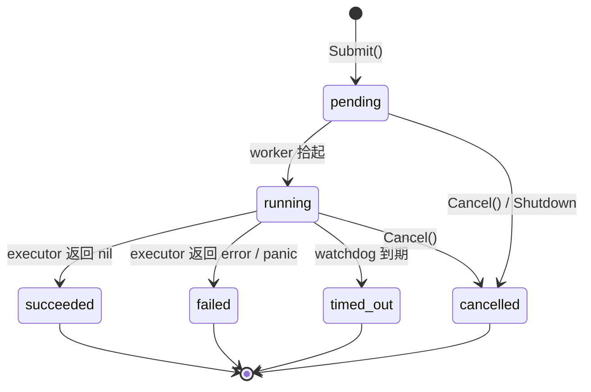
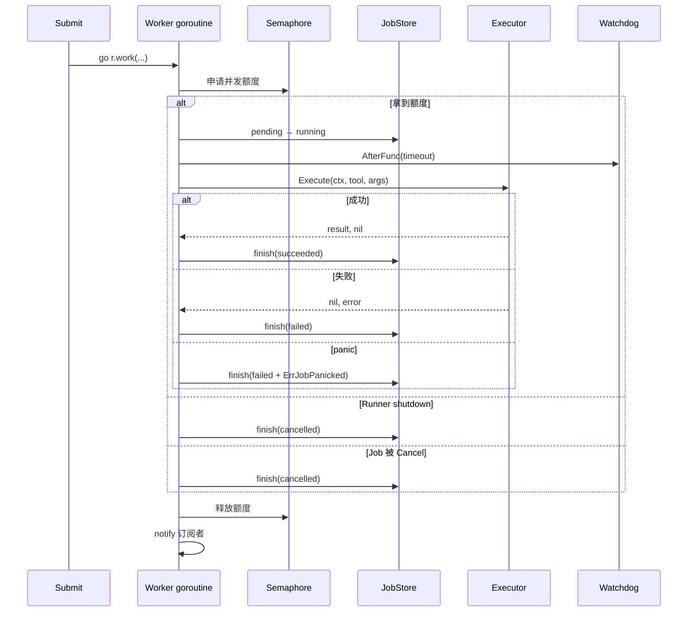
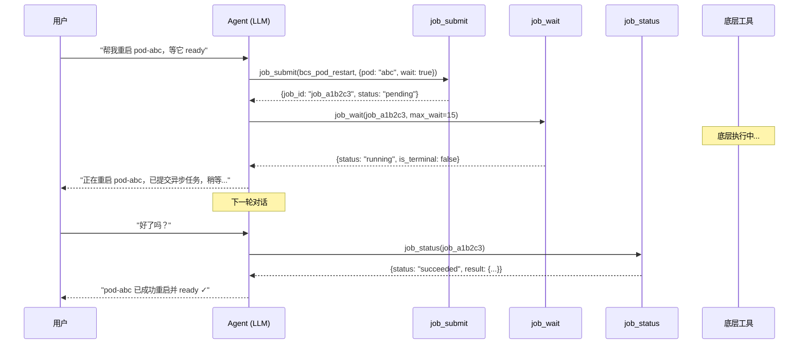
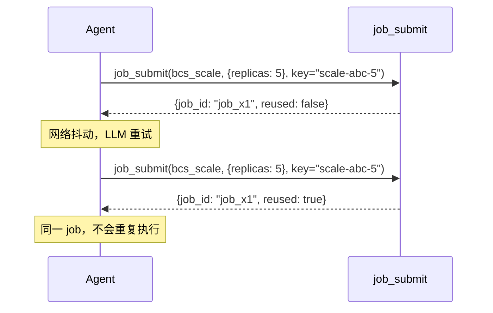
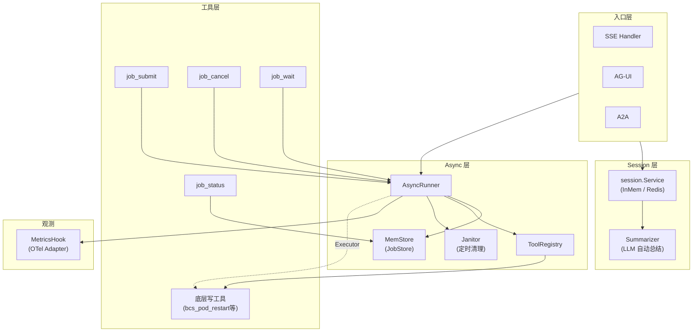

---

# 09 — 会话与异步

> **覆盖范围**：Session 管理、AsyncRunner、Job 生命周期  
> **核心文件**：`src/session/`、`src/async/`、`src/tools/async_tools/`

---

## 一、模块定位与设计动机

### 1.1 会话管理（Session）

LLM Agent 的多轮对话天然需要"记忆"——上一轮用户说了什么、工具返回了什么、Agent 做了什么决策。在 GameOps Agent 中，会话管理承担三重职责：

| 职责 | 场景 |
|------|------|
| **多轮对话记忆** | HITL 场景下"先展示 Plan → 用户确认 → 执行"需要跨回合保持上下文 |
| **长会话自动总结** | 超过阈值时触发 LLM 总结，避免上下文窗口被塞爆 |
| **零凭据降级** | 未配置 LLM 时返回纯内存 session（仍保留多轮记忆，只是不会自动总结） |

### 1.2 异步执行（Async）

LLM 工具调用的底层契约是**同步请求-响应**：LLM 发一条 `tool_call`，等一个 `tool_result`。对于秒级返回的查询类工具这很自然，但对于以下场景就会非常拧巴：

| 场景 | 典型耗时 |
|------|----------|
| `pod_restart` wait_for_ready | 60~120s |
| `helm upgrade --wait` | 最长 5min |
| `scale` 后等副本 ready | 15~60s |
| CI/CD 触发后轮询完成 | 更长 |

同步等待的三重代价：
1. **用户体验灾难**：LLM"像死机了"，用户不知道还要多久
2. **吞吐瓶颈**：单个 Agent 会话同一时刻只能 1 个慢任务
3. **超时误报**：LLM 框架的 `tool_timeout`（常 60s）比真实任务短，频繁误判失败

---

## 二、会话管理详解

### 2.1 文件结构

```
src/session/
├── session.go          # 核心构造函数 + Config
├── backend.go          # Backend 枚举 + NewWithBackend 路由
├── redis_session.go    # Redis 后端真实实现（build tag: redis）
├── redis_stub.go       # 默认构建 stub（返回 nil 降级）
├── session_test.go     # Config + 降级路径测试
└── backend_test.go     # Backend 切换测试
```

### 2.2 Config 配置体系

```go
// src/session/session.go

type Config struct {
    EventThreshold  int           // 事件数量触发阈值（默认 20）
    TokenThreshold  int           // 估算 token 触发阈值（默认 6000）
    TimeThreshold   time.Duration // 距上次事件的时间阈值（默认 10min）
    MaxSummaryWords int           // 摘要最大字数（默认 500）
    EventLimit      int           // session 保留事件上限（默认 EventThreshold*2 = 40）
    AsyncWorkers    int           // 异步摘要 worker 数量（默认 2）
    QueueSize       int           // 摘要任务队列大小（默认 100）
    JobTimeout      time.Duration // 单次摘要任务超时（默认 60s）
}
```

**环境变量覆盖**：

| 环境变量 | 对应字段 | 默认值 |
|----------|----------|--------|
| `SESSION_EVENT_THRESHOLD` | EventThreshold | 20 |
| `SESSION_TOKEN_THRESHOLD` | TokenThreshold | 6000 |
| `SESSION_TIME_THRESHOLD_MIN` | TimeThreshold | 10（分钟） |

### 2.3 核心构造函数 `New()`

```go
// src/session/session.go

func New(cfg Config, model *openaimodel.Model) session.Service {
    if cfg.EventThreshold <= 0 {
        cfg = DefaultConfig()
    }
    if model == nil {
        // 降级路径：不带 summarizer 的纯内存 session
        return inmemory.NewSessionService(
            inmemory.WithSessionEventLimit(cfg.EventLimit),
        )
    }
    // 带 summarizer 的完整版
    sum := summary.NewSummarizer(model,
        summary.WithMaxSummaryWords(cfg.MaxSummaryWords),
        summary.WithChecksAny(
            summary.CheckEventThreshold(cfg.EventThreshold),
            summary.CheckTokenThreshold(cfg.TokenThreshold),
            summary.CheckTimeThreshold(cfg.TimeThreshold),
        ),
    )
    return inmemory.NewSessionService(
        inmemory.WithSummarizer(sum),
        inmemory.WithSessionEventLimit(cfg.EventLimit),
        inmemory.WithAsyncSummaryNum(cfg.AsyncWorkers),
        inmemory.WithSummaryQueueSize(cfg.QueueSize),
        inmemory.WithSummaryJobTimeout(cfg.JobTimeout),
    )
}
```

**设计决策**：
- **永远不返回 error**：降级优于失败，让服务能够在凭据不完整时仍然可启动
- **model == nil 时降级**：纯内存 session 仍保留多轮事件，只是不会生成摘要
- **三维触发条件**：事件数 / Token 数 / 时间间隔，任一满足即触发总结（`ChecksAny`）

### 2.4 Backend 切换机制

```go
// src/session/backend.go

type Backend string

const (
    BackendInMem Backend = "inmem"
    BackendRedis Backend = "redis"
)

func BackendFromEnv() Backend {
    switch os.Getenv("SESSION_BACKEND") {
    case "redis":
        return BackendRedis
    default:
        return BackendInMem
    }
}

func NewWithBackend(cfg Config, model *openaimodel.Model, backend Backend) session.Service {
    switch backend {
    case BackendRedis:
        svc := newRedisSession(cfg, model)
        if svc != nil {
            return svc
        }
        // 降级到 inmem
        return New(cfg, model)
    default:
        return New(cfg, model)
    }
}
```

**设计好处**：
- `app.Init` 不需要按 env 分叉两条装配路径
- 单元测试默认走 inmem，CI 零依赖
- 生产 K8s 通过 env + build tag 切到 redis，源码无需改动

### 2.5 Redis 后端实现（Build Tag 隔离）

```go
// src/session/redis_session.go
//go:build redis

func newRedisSession(cfg Config, model *openaimodel.Model) session.Service {
    addr := os.Getenv("SESSION_REDIS_ADDR")
    if addr == "" {
        return nil  // 必须显式提供地址
    }
    password := os.Getenv("SESSION_REDIS_PASSWORD")
    db := envInt("SESSION_REDIS_DB", 0)

    redisURL := buildRedisURL(addr, password, db)
    opts := []redissess.ServiceOpt{
        redissess.WithRedisClientURL(redisURL),
        redissess.WithSessionEventLimit(cfg.EventLimit),
    }
    if model != nil {
        // 注入 summarizer（与 inmem 版相同逻辑）
        sum := summary.NewSummarizer(model, ...)
        opts = append(opts, redissess.WithSummarizer(sum), ...)
    }
    svc, err := redissess.NewService(opts...)
    if err != nil {
        return nil  // 构造失败降级为 nil
    }
    return svc
}
```

```go
// src/session/redis_stub.go
//go:build !redis

// 默认构建路径：不启用 redis 后端。返回 nil 让 backend.go 走降级。
func newRedisSession(_ Config, _ *openaimodel.Model) session.Service {
    return nil
}
```

**Build Tag 策略**：

| 构建模式 | 行为 |
|----------|------|
| 默认（外网/CI） | `redis_stub.go` 生效，`newRedisSession` 返回 nil → 降级 inmem |
| `-tags redis`（生产） | `redis_session.go` 生效，真正连接 Redis |

### 2.6 框架层 Session 接口

项目使用的是 `trpc-agent-go` 框架提供的 `session.Service` 接口：

```go
// 框架接口（trpc.group/trpc-go/trpc-agent-go/session）
type Service interface {
    // 获取/创建 session
    GetOrCreate(ctx context.Context, sessionID string) (Session, error)
    // ...
}
```

框架提供的实现：
- `inmemory.NewSessionService()` — 内存实现
- `redis.NewService()` — Redis 实现（需 build tag）
- `summary.NewSummarizer()` — 自动总结器

### 2.7 App 层装配

```go
// src/app/app.go 第 301 行

// 6. D11：Session 服务（多轮对话 + 自动总结）。
//    LLM 缺失时自动降级为不带 summarizer 的纯内存 session（仍支持多轮记忆）。
sessSvc := appsession.New(appsession.DefaultConfig(), mdl)

// 后续被 AG-UI / A2A / Webhook / Runner 共享
agentRunner = runner.NewRunner("gameops-agent", entrance, runner.WithSessionService(sessSvc))
```

**共享语义**：SSE / AG-UI / A2A 三个入口通道共享同一 `session.Service` 实例，保证跨通道记忆一致。

---

## 三、异步执行框架详解

### 3.1 文件结构

```
src/async/
├── job.go                   # Job 结构体 + 状态机 + ToolRegistry
├── runner.go                # AsyncRunner 核心引擎
├── store.go                 # JobStore 接口 + MemStore 实现
├── runner_test.go           # Runner 核心路径测试（16 用例）
├── runner_metrics_test.go   # MetricsHook 行为测试
├── store_test.go            # MemStore 并发安全测试
└── job_test.go              # Job 辅助方法测试

src/tools/async_tools/
├── async_tools.go           # 4 件套 LLM 工具封装
└── async_tools_test.go      # 工具层集成测试
```

### 3.2 核心模型：Job + Poll + Callback

采用**提交式异步**（行业标准模型，与 K8s Job / CI pipeline / Celery 一致）：

```
submit(tool, args)   ──>   立即返回 JobID
get_status(JobID)    ──>   pending / running / succeeded / failed / cancelled / timed_out
wait(JobID, max)     ──>   半阻塞等待（带超时上限）
cancel(JobID)        ──>   尽力取消（context.Cancel）
```

**为什么不做 async/await**：Go 的 goroutine 已经是异步原语，LLM 框架的契约依然是同步请求-响应，硬塞 async 会破坏工具调用协议。Job 模型与 LLM 交互友好：LLM 只要记住 JobID，每个 `tool_call` 都是秒级返回。

### 3.3 Job 状态机



**约束**：
- 每个终态都是"一次性转换"；`succeeded` / `failed` / `cancelled` / `timed_out` 不可再流转
- `timed_out` 属于 `failed` 的子类，单列是为了可观测性（告警规则 / 面板区分）

### 3.4 Job 结构体

```go
// src/async/job.go

type Job struct {
    ID             string         `json:"id"`
    ToolName       string         `json:"tool_name"`
    Args           map[string]any `json:"args"`
    IdempotencyKey string         `json:"idempotency_key,omitempty"`

    Status   JobStatus `json:"status"`
    Progress *Progress `json:"progress,omitempty"`

    Result any    `json:"result,omitempty"`
    Err    string `json:"err,omitempty"`

    SubmittedAt time.Time  `json:"submitted_at"`
    StartedAt   *time.Time `json:"started_at,omitempty"`
    FinishedAt  *time.Time `json:"finished_at,omitempty"`
    TimeoutAt   time.Time  `json:"timeout_at"`

    cancelFn func() `json:"-"` // 运行时字段，不序列化
}
```

**设计准则**：
- 字段皆可 JSON 序列化，为后续 FileStore/DB 持久化留口
- `Result` / `Err` 互斥：终态只会有一个非零
- `cancelFn` 不序列化：运行时字段，持久化恢复后 cancel 能力会丢失（符合预期）
- `Clone()` 方法保证 Store 返回的 Job 不会被外部修改

### 3.5 Progress 进度快照

```go
type Progress struct {
    UpdatedAt time.Time      `json:"updated_at"`
    Fields    map[string]any `json:"fields"`
}
```

用 `map` 而不是固定字段是刻意选择：
- 不同工具进度语义差异大（"50 个 pod 已处理 20 个" vs "镜像上传 70%"）
- LLM 读到这些字段会自己择取重点回复给用户

### 3.6 ToolRegistry 工具注册表

```go
// src/async/job.go

type ToolRegistry struct {
    mu    sync.RWMutex
    tools map[string]any // name -> tool.Tool（实际类型）
}
```

**设计决策**：用 `any` 而非直接引 trpc 的 `tool.Tool`，是为了本包完全不依赖具体 tool 接口细节（Runner 调用时再 type-assert），这样 async 包可以被测试独立编译，不把 trpc 生态拖进来。

---

## 四、AsyncRunner 引擎

### 4.1 Runner 结构体

```go
// src/async/runner.go

type Runner struct {
    cfg      Config
    store    JobStore
    executor Executor

    sem         chan struct{}    // 并发闸门（buffered channel 做信号量）
    queuedCount atomic.Int64    // 非终态 Job 计数（用于限流）

    subsMu sync.Mutex
    subs   map[string][]chan struct{} // Wait 订阅表

    ctx        context.Context
    cancel     context.CancelFunc
    workersWG  sync.WaitGroup
    shutdownCh chan struct{}
    shutdonce  sync.Once
}
```

### 4.2 Config 配置

```go
type Config struct {
    MaxConcurrentJobs int           // 同时运行的最大 Job 数（默认 16）
    MaxQueuedJobs     int           // 非终态 Job 数上限（默认 256）
    DefaultTimeout    time.Duration // 默认 timeout（默认 5min）
    MaxTimeout        time.Duration // 最长 timeout（默认 30min）
    JanitorInterval   time.Duration // 清理间隔（默认 1min）
    JanitorRetention  time.Duration // 终态 Job 保留时长（默认 10min）
    Clock             func() time.Time // 时钟抽象（测试可注入假时钟）
    Logger            func(format string, args ...any)
    Metrics           MetricsHook   // 可观测性钩子
}
```

### 4.3 Executor 抽象

```go
// src/async/runner.go

type Executor interface {
    Execute(ctx context.Context, toolName string, args map[string]any) (any, error)
}

// 便捷适配器
type ExecutorFunc func(ctx context.Context, toolName string, args map[string]any) (any, error)
```

**为什么单独抽象**：
1. 测试友好：单测可以用 `ExecutorFunc` 直接塞任意闭包
2. 解耦 tool 框架升级：trpc-agent-go 升级 tool 契约，只改 Executor 实现
3. 可替换：未来想把 Executor 放到远端（RPC 执行），接口都不用改

### 4.4 Submit 流程

```go
func (r *Runner) Submit(ctx context.Context, toolName string, args map[string]any, 
    timeout time.Duration, idempotencyKey string) (string, error) {
    // 1. 幂等检查：同 key 命中已有 Job → 直接返回
    // 2. 限流检查：queuedCount >= MaxQueuedJobs → ErrTooManyJobs
    // 3. 规范化 timeout：超过 MaxTimeout 自动裁剪
    // 4. 构造 Job（pending 状态）→ 入 Store
    // 5. 起 worker goroutine → 立即返回 JobID
}
```

### 4.5 Worker 执行流程



### 4.6 并发控制设计

```
┌─────────────────────────────────────────────────┐
│  MaxQueuedJobs（atomic.Int64 计数）              │
│  ┌───────────────────────────────────────────┐  │
│  │  MaxConcurrentJobs（buffered chan 信号量）  │  │
│  │  ┌─────────────────────────────────────┐  │  │
│  │  │  实际执行中的 Job                    │  │  │
│  │  └─────────────────────────────────────┘  │  │
│  │  排队等待 sem 的 Job                      │  │
│  └───────────────────────────────────────────┘  │
│  pending 但未被 worker 拾起的 Job               │
└─────────────────────────────────────────────────┘
```

- **MaxQueuedJobs**：Store 中非终态 Job 总数上限（`atomic.Int64`，热点路径零锁）
- **MaxConcurrentJobs**：同时运行的 Job 数（`buffered channel` 做信号量）
- 超出即 `ErrTooManyJobs`（拒绝 submit，不入队阻塞）

### 4.7 Cancel 语义

```go
func (r *Runner) Cancel(ctx context.Context, id string) error {
    // 1. Job 不存在 → ErrJobNotFound
    // 2. Job 已终态 → ErrJobAlreadyTerminal
    // 3. 状态转 cancelled + 调 cancelFn + 同步扣减 queuedCount + notify
}
```

**为什么同步扣减 queuedCount**：MaxQueuedJobs 限流是"Submit 即时决定拒不拒"的，调用方 Cancel 后立即 Submit 应该能拿到额度。若依赖 worker 退出才扣减，会出现 race 窗口。

### 4.8 Wait 机制

```go
func (r *Runner) Wait(ctx context.Context, id string) (*Job, error) {
    // 快速路径：直接查一下，已终态立即返回
    // 注册订阅者 chan
    // 订阅后再查一次（避免"订阅前终态就到了"的竞速）
    // select { case <-ch: ... case <-ctx.Done(): ... }
}
```

**订阅-通知模式**：
- `subscribe(id)` 注册一个 `chan struct{}`
- `notify(id)` 终态触达时给所有订阅者发信号（非阻塞）
- 一个 Job 可能被多个 Wait 并发等（用 `[]chan` 支持多订阅）

### 4.9 Janitor 清理

```go
func (r *Runner) janitorLoop() {
    ticker := time.NewTicker(r.cfg.JanitorInterval)
    for {
        select {
        case <-r.ctx.Done(): return
        case <-ticker.C: r.janitorSweep()
        }
    }
}

func (r *Runner) janitorSweep() {
    // 清除 FinishedAt 早于 now - retention 的终态 Job
    // 避免 MemStore 无限增长 → OOM
}
```

### 4.10 Shutdown 优雅关闭

```go
func (r *Runner) Shutdown(ctx context.Context) error {
    r.shutdonce.Do(func() {
        r.cancel()  // 关闭根 context
        // 在 ctx 限定的 timeout 内等待所有 worker 结束
        // 超时则返回 ctx.Err()
    })
    return firstErr
}
```

**幂等**：多次调用只触发一次真实关闭。

### 4.11 MetricsHook 观测性

```go
type MetricsHook interface {
    OnSubmit(tool, outcome string)  // accepted / rejected / dedup_hit
    OnFinish(tool, status string, total time.Duration)
}
```

调用位置：
- `OnSubmit`：Submit() 的每条出口路径
- `OnFinish`：finish() 的终态跳转时（包含 total duration）

App 层注入 `observability.NewAsyncMetricsAdapter()` 将其桥接到 OTel Counter/Histogram。

---

## 五、JobStore 存储层

### 5.1 接口定义

```go
// src/async/store.go

type JobStore interface {
    Put(ctx context.Context, j *Job) error
    Get(ctx context.Context, id string) (*Job, error)
    List(ctx context.Context, f JobFilter) ([]*Job, error)
    Update(ctx context.Context, id string, mutator func(*Job) error) error
    Delete(ctx context.Context, id string) error
    Len() int
}
```

**契约**：
- 并发安全
- Get/List 返回 Clone 而非内部指针
- Update 原子执行 mutator（读-改-写原子性）

### 5.2 MemStore 实现

```go
type MemStore struct {
    mu   sync.RWMutex
    jobs map[string]*Job
}
```

**并发模型**：
- `RWMutex`：查询远多于写入（多次 `job_status` 对应一次 Put + 几次 Update）
- `Update` 用 mutator 回调 pattern，保证"读-改-写"原子性，避免 ABA
- 禁止调用方持有内部指针：Get/List 一律 Clone 外发

**为什么从 MemStore 开局**：
1. Job 是"暂存状态"：典型寿命 10s~10min，进程重启后 context/goroutine 已失效
2. 从 MemStore 平移到 FileStore/DB 只是一个 Put/Get/List/Update 的适配问题
3. 接口打对，持久化留到后续迭代

### 5.3 幂等查找

```go
func (s *MemStore) findByIdempotencyKey(key string) *Job {
    // 按幂等 key 查已有 Job
    // 同一 key 未终态的 Job 直接复用
    // 终态的 Job 也复用（让调用方通过 job_status 看到终态）
}
```

### 5.4 JobFilter 筛选

```go
type JobFilter struct {
    ToolName string      // 仅列出指定工具名的 Job
    Statuses []JobStatus // 仅列出处于这些状态的 Job
    Limit    int         // 返回条数上限
}
```

List 结果按 `SubmittedAt` 降序（新的在前），便于 LLM 看到最近提交。

---

## 六、Async Tools — LLM 工具层封装

### 6.1 4 件套工具

| 工具名 | 功能 | Target |
|--------|------|--------|
| `job_submit` | 异步投递任务，立即返回 JobID | `*` |
| `job_status` | 查询 Job 状态/进度/结果 | `*` |
| `job_cancel` | 取消活动中的 Job | `*` |
| `job_wait` | 半阻塞等待（带超时上限） | `*` |

Target 统一为 `*`：控制流元工具，对所有 Agent 都有用，不应按场景筛选。

### 6.2 job_submit

```go
// src/tools/async_tools/async_tools.go

type JobSubmitInput struct {
    ToolName       string         `json:"tool_name"`        // 要异步执行的工具名（必填）
    Args           map[string]any `json:"args"`             // 传给底层工具的入参
    TimeoutSeconds int            `json:"timeout_seconds"`  // 最长耗时秒数（默认 300，上限 1800）
    IdempotencyKey string         `json:"idempotency_key"`  // 幂等键（可选）
}
```

**白名单校验**：LLM 有时会胡乱填工具名（比如 "restart_pod" 而不是 "bcs_pod_restart"），让错误在 submit 时就返回，避免起空跑的 worker。

### 6.3 job_status

```go
type JobStatusInput struct {
    JobID         string `json:"job_id"`
    IncludeResult bool   `json:"include_result"` // 默认 true；轮询中可传 false 减少 payload
}

type JobStatusOutput struct {
    JobID       string         `json:"job_id"`
    ToolName    string         `json:"tool_name"`
    Status      string         `json:"status"`
    IsTerminal  bool           `json:"is_terminal"`
    DurationSec float64        `json:"duration_sec,omitempty"`
    Progress    map[string]any `json:"progress,omitempty"`
    Err         string         `json:"err,omitempty"`
    Result      any            `json:"result,omitempty"`
}
```

**Result 序列化保护**：终态时对 Result 做一次 `json.Marshal` 验证，失败就给个 `<unserializable: Type>` 字符串，避免 LLM 那头解析失败。

### 6.4 job_wait

```go
type JobWaitInput struct {
    JobID          string `json:"job_id"`
    MaxWaitSeconds int    `json:"max_wait_seconds"` // 默认 10，上限 25
}
```

**上限 25s**（`waitUpperBound`）：避免 LLM 传太大让 `tool_call` 超时。超时未完成不算"失败"，返回当前状态 + `is_terminal=false`，LLM 可继续用 `job_status` 轮询。

### 6.5 job_cancel

```go
type JobCancelInput struct {
    JobID  string `json:"job_id"`
    Reason string `json:"reason"` // 取消原因（可选，用于审计留痕）
}
```

### 6.6 装配入口

```go
// src/tools/async_tools/async_tools.go

func NewAllTargeted(runner *async.Runner, registry *async.ToolRegistry) []tools.TargetedTool {
    if runner == nil || registry == nil {
        return nil  // nil 安全
    }
    return []tools.TargetedTool{
        {Target: "*", Tool: newJobSubmitTool(runner, registry)},
        {Target: "*", Tool: newJobStatusTool(runner)},
        {Target: "*", Tool: newJobCancelTool(runner)},
        {Target: "*", Tool: newJobWaitTool(runner)},
    }
}

func RegisterToolsForAsync(registry *async.ToolRegistry, toolList []tool.Tool) {
    // 把底层工具按 Name 注册到 registry
    // 安全策略：建议只注册"写操作且耗时 > 10s"的工具
}
```

---

## 七、App 层装配全景

### 7.1 Session 装配

```go
// src/app/app.go

sessSvc := appsession.New(appsession.DefaultConfig(), mdl)

// 被以下组件共享：
aguiSrv  → aguisvc.Config{Session: sessSvc}
a2aSrv   → a2asvc.Config{Session: sessSvc}
agentRunner = runner.NewRunner("gameops-agent", entrance, runner.WithSessionService(sessSvc))
```

### 7.2 Async 装配

```go
// src/app/app.go（cfg.Async.Enabled=true 时）

// 1. 构造 ToolRegistry
registry := async.NewToolRegistry()

// 2. 构造 Executor（闭包桥接到 tool.CallableTool.Call）
executor := async.ExecutorFunc(func(ctx context.Context, name string, args map[string]any) (any, error) {
    raw, ok := registry.Lookup(name)
    tl := raw.(tool.Tool)
    callable := tl.(tool.CallableTool)
    payload, _ := json.Marshal(args)
    return callable.Call(ctx, payload)
})

// 3. 构造 Runner
asyncRunner = async.New(async.Config{
    MaxConcurrentJobs: cfg.Async.MaxConcurrent,
    MaxQueuedJobs:     cfg.Async.MaxQueued,
    DefaultTimeout:    time.Duration(cfg.Async.DefaultTimeoutSec) * time.Second,
    MaxTimeout:        time.Duration(cfg.Async.MaxTimeoutSec) * time.Second,
    Metrics:           observability.NewAsyncMetricsAdapter(),
}, async.NewMemStore(), executor)

// 4. 白名单注册
registerAsyncWhitelist(registry, allLocalTools, cfg.Async.AsyncToolNames)

// 5. 追加 job_* 4 件套
allLocalTools = append(allLocalTools, asynctools.NewAllTargeted(asyncRunner, registry)...)
```

**关键设计**：Executor 用闭包桥接到"按名查 allLocalTools 中的 tool.Tool"，这样 Runner 不知道 `tool.Tool` 具体类型，agent 生态升级不影响 async 核心。

### 7.3 AsyncConfig YAML 配置

```yaml
# config.yaml
async:
  enabled: true
  max_concurrent: 16
  max_queued: 256
  default_timeout_sec: 300
  max_timeout_sec: 1800
  janitor_interval_sec: 60
  janitor_retention_sec: 600
  async_tool_names:
    - bcs_pod_restart
    - bcs_scale_deployment
    - bcs_helm_manage
```

```go
// src/config/loader.go

type AsyncConfig struct {
    Enabled             bool     `yaml:"enabled"`
    MaxConcurrent       int      `yaml:"max_concurrent"`
    MaxQueued           int      `yaml:"max_queued"`
    DefaultTimeoutSec   int      `yaml:"default_timeout_sec"`
    MaxTimeoutSec       int      `yaml:"max_timeout_sec"`
    JanitorIntervalSec  int      `yaml:"janitor_interval_sec"`
    JanitorRetentionSec int      `yaml:"janitor_retention_sec"`
    AsyncToolNames      []string `yaml:"async_tool_names"`
}
```

---

## 八、LLM 交互模式

### 8.1 典型对话流程



### 8.2 幂等重试场景



---

## 九、错误处理与降级策略

### 9.1 Session 降级链

```
配置完整 + Redis 可用 → Redis Session + Summarizer
配置完整 + Redis 不可用 → InMem Session + Summarizer
LLM 凭据缺失 → InMem Session（无 Summarizer）
```

**原则**：永远不因 session 初始化失败而阻塞服务启动。

### 9.2 Async 降级

```
cfg.Async.Enabled = false → 不装配 Runner，job_* 工具不注入
                           → LLM 只能同步调用工具（行为与 D19.1 之前一致）
cfg.Async.Enabled = true  → 正常装配
```

### 9.3 错误类型

| 错误 | 含义 | 调用方处理 |
|------|------|-----------|
| `ErrJobNotFound` | 查询/取消不存在的 JobID | LLM 提示"任务不存在或已被清理" |
| `ErrToolNotRegistered` | 工具名不在白名单 | LLM 提示可用工具列表 |
| `ErrTooManyJobs` | 超出并发+队列限制 | LLM 提示"稍后再试或取消已有任务" |
| `ErrJobAlreadyTerminal` | 对已终态 Job 执行 cancel | 可忽略 |
| `ErrJobPanicked` | worker 捕获到 panic | 标记 failed + 错误信息 |

---

## 十、测试覆盖

### 10.1 Session 测试

| 测试文件 | 覆盖内容 |
|----------|----------|
| `session_test.go` | DefaultConfig 默认值 / env 覆盖 / model=nil 降级 / 零值 Config 补全 |
| `backend_test.go` | BackendFromEnv 枚举 / Redis 降级（未编译时自动 fallback） |

### 10.2 Async 测试矩阵

| 类别 | 用例数 | 覆盖场景 |
|------|--------|----------|
| **S: Submit & 幂等** | 5 | 普通 submit / 幂等复用 / 空 tool_name / MaxQueuedJobs / timeout 裁剪 |
| **R: 运行与状态机** | 3 | 成功 / 失败 / panic 恢复 |
| **T: 超时与取消** | 3 | watchdog 触发 / Cancel 活动 Job / Cancel 已终态 |
| **W: Wait** | 4 | 等到终态 / 已终态立即返回 / ctx 过期 / Cancel 唤醒 |
| **L: 生命周期** | 3 | Shutdown 超时 / Shutdown 幂等 / Janitor 清理 |
| **M: Metrics** | 5 | accepted / dedup_hit / rejected / timed_out / nil hook |
| **Store** | ~10 | Put/Get/Update/Delete/List/Filter/Limit/并发/幂等查找 |

---

## 十一、自定义实现 vs 框架实现

### 11.1 自定义实现（项目代码）

| 组件 | 文件 | 自定义原因 |
|------|------|-----------|
| Session Config + 降级逻辑 | `src/session/session.go` | 封装框架 API，提供环境变量驱动 + 零凭据降级 |
| Backend 切换 | `src/session/backend.go` | Build Tag 隔离 Redis，统一装配路径 |
| Redis 实现 | `src/session/redis_session.go` | 生产环境 Redis 连接配置 |
| **整个 async 包** | `src/async/` | 框架不提供异步 Job 模型，完全自研 |
| AsyncRunner | `src/async/runner.go` | 并发控制 + 状态机 + watchdog + 优雅关闭 |
| MemStore | `src/async/store.go` | Job 存储抽象 + 内存实现 |
| 4 件套 LLM 工具 | `src/tools/async_tools/` | 将 Runner 能力暴露为 LLM 可调用的工具 |

### 11.2 框架实现（trpc-agent-go 提供）

| 组件 | 框架包 | 用途 |
|------|--------|------|
| `session.Service` 接口 | `trpc-agent-go/session` | 会话管理统一接口 |
| `inmemory.NewSessionService` | `trpc-agent-go/session/inmemory` | 内存 session 实现 |
| `redis.NewService` | `trpc-agent-go/session/redis` | Redis session 实现 |
| `summary.NewSummarizer` | `trpc-agent-go/session/summary` | LLM 自动总结器 |
| `summary.CheckEventThreshold` | `trpc-agent-go/session/summary` | 事件数触发检查 |
| `summary.CheckTokenThreshold` | `trpc-agent-go/session/summary` | Token 数触发检查 |
| `summary.CheckTimeThreshold` | `trpc-agent-go/session/summary` | 时间间隔触发检查 |
| `runner.NewRunner` | `trpc-agent-go/runner` | Agent 执行器（注入 session） |
| `function.NewFunctionTool` | `trpc-agent-go/tool/function` | 工具构造器 |
| `tool.CallableTool` | `trpc-agent-go/tool` | 工具调用接口 |

---

## 十二、架构关系图



---

## 十三、关键设计总结

### 13.1 Session 设计哲学

| 原则 | 体现 |
|------|------|
| **降级优于失败** | model=nil → 纯内存；Redis 不可用 → inmem；永不返回 error |
| **零依赖可跑** | 默认 inmem，CI 不需要 Redis |
| **环境变量驱动** | 所有阈值可通过 env 覆盖，无需改代码 |
| **Build Tag 隔离** | Redis 实现仅在 `-tags redis` 时编译，外网构建零依赖 |

### 13.2 Async 设计哲学

| 原则 | 体现 |
|------|------|
| **LLM 友好** | Job 模型 + 秒级返回，LLM 只需记住 JobID |
| **非侵入式** | 不改动存量工具代码，LLM 通过双步调用达成伪异步 |
| **零项目内依赖** | async 包不 import 任何项目内包，可独立编译测试 |
| **可观测** | MetricsHook 接口 + OTel 适配器，SRE 告警规则可用 |
| **安全** | 白名单校验 + 并发限流 + 超时裁剪 + 幂等去重 |
| **优雅关闭** | Shutdown 等待 workers + 超时强制 cancel + 幂等 |
