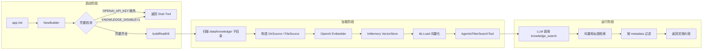
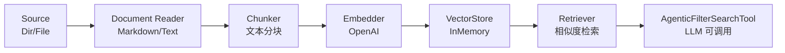
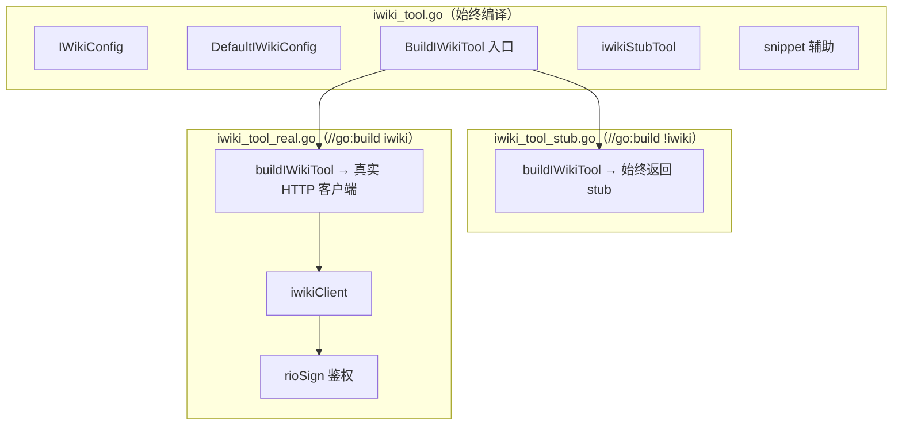
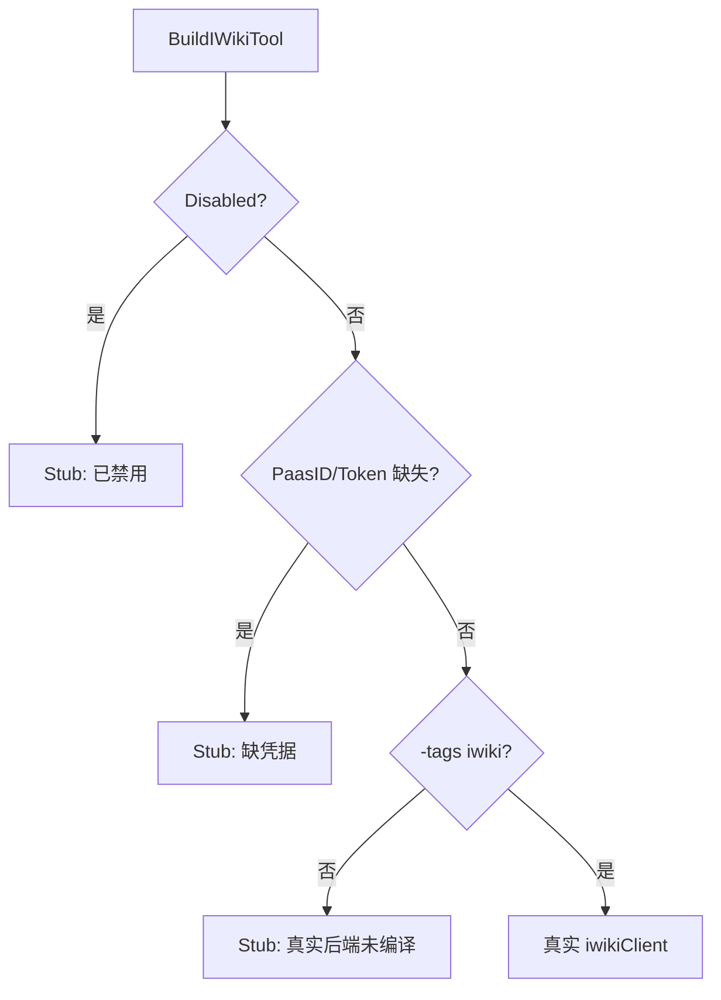
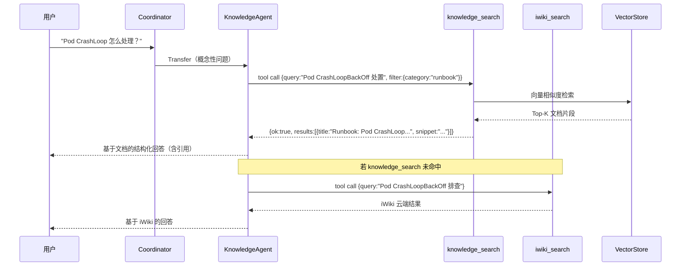

---

# 10 — 知识库与 RAG

## 一、模块概述

知识库模块（`src/knowledge/`）是 GameOps Agent 的 **Agentic RAG（检索增强生成）** 核心，为 KnowledgeAgent 提供两层知识检索能力：

| 层级 | 工具名 | 数据源 | 实现方式 |
|------|--------|--------|---------|
| **本地 RAG** | `knowledge_search` | `data/knowledge/` 目录下的 Markdown/Text 文档 | 框架 `BuiltinKnowledge` + OpenAI Embedding + InMemory 向量库 |
| **云端 RAG** | `iwiki_search` | 公司内 iWiki 平台文档 | 自行实现 HTTP 客户端（Rio 签名鉴权） |

**核心设计原则**：
1. **凭据缺失不阻塞启动** — 无 API Key 时自动降级为 Stub 工具，LLM 可感知并告知用户
2. **本地优先、云端兜底** — system_prompt 约定 LLM 先查本地，未命中再查 iWiki
3. **Build Tag 条件编译** — iWiki 真实客户端通过 `-tags iwiki` 启用，默认构建零内网依赖

---

## 二、文件清单与职责

```
src/knowledge/
├── builder.go              # 本地 RAG 构造器（Builder 模式）
├── iwiki_tool.go           # iWiki 工具公共定义（Config/Stub/辅助函数）
├── iwiki_tool_real.go      # iWiki 真实实现（//go:build iwiki）
├── iwiki_tool_stub.go      # iWiki Stub 实现（//go:build !iwiki）
└── iwiki_tool_test.go      # 单元测试

data/knowledge/             # 本地知识库文档（启动时向量化）
├── architecture/
│   └── overview.md         # 架构概览
├── faq/
│   └── general.md          # 常见问答
├── incident/
│   └── 2026-03-28-game-core-oom.md  # 故障复盘
└── runbook/
    └── pod-crashloop.md    # 操作手册

src/agents/knowledge_agent/
├── agent.go                # KnowledgeAgent 构造
└── system_prompt.md        # Agent 系统提示词
```

---

## 三、本地 RAG — Builder 详解

### 3.1 架构流程



### 3.2 Config 配置

```go
// src/knowledge/builder.go

type Config struct {
    DataDir        string        // 本地知识库根目录，默认 "data/knowledge"
    EmbeddingModel string        // 嵌入模型名，默认 "text-embedding-3-small"
    Disabled       bool          // 强制禁用（KNOWLEDGE_DISABLE 环境变量）
    LoadTimeout    time.Duration // 首次加载超时，默认 2 分钟
}
```

**环境变量映射**：

| 环境变量 | 作用 | 默认值 |
|---------|------|--------|
| `KNOWLEDGE_DATA_DIR` | 知识库文档目录 | `data/knowledge` |
| `OPENAI_EMBEDDING_MODEL` | Embedding 模型 | `text-embedding-3-small` |
| `KNOWLEDGE_DISABLE` | 强制禁用 RAG | 未设置（启用） |
| `OPENAI_API_KEY` | OpenAI API 密钥（Embedder 必需） | — |

### 3.3 Builder 三态模式

```go
// src/knowledge/builder.go

func (b *Builder) Build(ctx context.Context) (tool.Tool, error) {
    // 降级路径 1：强制禁用
    if b.cfg.Disabled {
        return b.stubTool("KnowledgeAgent RAG 已被禁用（KNOWLEDGE_DISABLE=1）。"), nil
    }
    // 降级路径 2：缺少 Embedding 凭据
    if os.Getenv("OPENAI_API_KEY") == "" {
        return b.stubTool("KnowledgeAgent RAG 未就绪：缺少 OPENAI_API_KEY..."), nil
    }
    // 降级路径 3：加载失败（不崩溃，走 stub）
    if b.kb == nil {
        kb, err := b.buildRealKB(ctx)
        if err != nil {
            return b.stubTool(fmt.Sprintf("KnowledgeAgent RAG 加载失败：%v", err)), nil
        }
        b.kb = kb
    }
    // 正常路径：返回 AgenticFilterSearchTool
    metadata := source.GetAllMetadata(b.listSources())
    t := knowledgetool.NewAgenticFilterSearchTool(b.kb, metadata, ...)
    return t, nil
}
```

**设计亮点**：
- **幂等性**：`Build()` 可重复调用，已构造的 `kb` 会被复用
- **永不崩溃**：任何异常路径都走 Stub，保证进程可启动
- **LLM 可感知**：Stub 工具返回结构化 JSON（`ok:false, stub:true, message:...`），LLM 据此调整回答策略

### 3.4 数据源扫描策略（listSources）

```go
// src/knowledge/builder.go — listSources 方法

// 扫描逻辑：
// 1. 遍历 DataDir 一级子目录 → 每个子目录构造一个 DirSource
//    - metadata: category=子目录名, source_type=local_dir
// 2. DataDir 根下的 .md 文件 → 每个文件构造一个 FileSource
//    - metadata: category=general, source_type=local_file
// 3. 若无子目录 → 退化为把 DataDir 整体当作单一 DirSource
```

**目录约定**：

| 子目录 | category 值 | 内容类型 |
|--------|------------|---------|
| `architecture/` | `architecture` | 系统架构文档 |
| `runbook/` | `runbook` | 操作手册 / SOP |
| `faq/` | `faq` | 常见问答 |
| `incident/` | `incident` | 历史故障复盘 |

LLM 可通过 `AgenticFilterSearchTool` 的 `filter` 参数按 `category` 精确过滤，例如：
- 用户问"OOM 回滚步骤" → LLM 生成 `filter: {category: "runbook"}`
- 用户问"上次 game-core 事故" → LLM 生成 `filter: {category: "incident"}`

### 3.5 框架能力依赖

本地 RAG 完全基于 `trpc-agent-go/knowledge` 框架模块，项目**不造轮子**：

| 框架组件 | 导入路径 | 作用 |
|---------|---------|------|
| `knowledge.BuiltinKnowledge` | `trpc-agent-go/knowledge` | RAG 核心引擎（Document→Chunk→Embed→Store→Retrieve） |
| `openaiembedder.New` | `trpc-agent-go/knowledge/embedder/openai` | OpenAI 兼容 Embedding 客户端 |
| `vectorinmemory.New` | `trpc-agent-go/knowledge/vectorstore/inmemory` | 内存向量库（开发/小规模场景） |
| `dirsource.New` | `trpc-agent-go/knowledge/source/dir` | 目录级文档源 |
| `filesource.New` | `trpc-agent-go/knowledge/source/file` | 单文件文档源 |
| `source.GetAllMetadata` | `trpc-agent-go/knowledge/source` | 提取所有 Source 的元数据键值 |
| `knowledgetool.NewAgenticFilterSearchTool` | `trpc-agent-go/knowledge/tool` | 带元数据过滤的 Agentic 检索工具 |
| `reader/markdown` | `trpc-agent-go/knowledge/document/reader/markdown` | Markdown 文档解析器（init 注册） |
| `reader/text` | `trpc-agent-go/knowledge/document/reader/text` | 纯文本文档解析器（init 注册） |

**框架 RAG Pipeline**：



### 3.6 Stub 降级工具

```go
// src/knowledge/builder.go — stubTool 方法

func (b *Builder) stubTool(msg string) tool.Tool {
    type stubInput struct {
        Query string `json:"query" description:"要检索的问题"`
    }
    type stubOutput struct {
        OK      bool   `json:"ok"`
        Stub    bool   `json:"stub"`
        Message string `json:"message"`
        Hint    string `json:"hint"`
    }
    fn := func(_ context.Context, _ stubInput) (*stubOutput, error) {
        return &stubOutput{
            OK:      false,
            Stub:    true,
            Message: msg,
            Hint:    "请直接基于你的通用知识回答，并在回答中向用户说明：知识库当前未加载...",
        }, nil
    }
    return function.NewFunctionTool(fn, ...)
}
```

**Stub 工具特征**：
- 工具名与真实工具相同（`knowledge_search`），对 LLM 透明
- 返回 `stub: true` 标志，system_prompt 约定 LLM 看到此标志后切换回答策略
- `hint` 字段指导 LLM 如何优雅降级

---

## 四、云端 RAG — iWiki 工具详解

### 4.1 Build Tag 条件编译架构



**编译方式**：
- 默认 `go build ./...` → 使用 `iwiki_tool_stub.go`，零内网依赖
- 内网 `go build -tags iwiki ./...` → 使用 `iwiki_tool_real.go`，启用真实 iWiki 客户端

### 4.2 IWikiConfig 配置

```go
// src/knowledge/iwiki_tool.go

type IWikiConfig struct {
    URL        string  // iWiki API 地址
    PaasID     string  // 太湖平台 PaaS ID
    Token      string  // 鉴权 Token
    SpaceIDs   []int   // 可选：限定搜索的 Space ID 列表
    MaxResults int     // 默认 5，范围 1-20
    Disabled   bool    // 强制禁用
}
```

**环境变量映射**：

| 环境变量 | 作用 | 默认值 |
|---------|------|--------|
| `IWIKI_URL` | iWiki API 地址 | `http://api-idc.sgw.woa.com/ebus/iwiki/prod` |
| `IWIKI_PAAS_ID` | 太湖平台 PaaS ID | — |
| `IWIKI_TOKEN` | 鉴权 Token | — |
| `IWIKI_SPACE_IDS` | 搜索空间 ID（逗号分隔） | 全部空间 |
| `IWIKI_MAX_RESULTS` | 返回条数上限 | `5` |
| `IWIKI_DISABLE` | 强制禁用 | 未设置（启用） |

### 4.3 Rio 签名鉴权（自行实现）

```go
// src/knowledge/iwiki_tool_real.go

// rioSign 计算 Rio 签名：SHA256(timestamp + token + nonce + timestamp) 大写
func rioSign(timestamp, token, nonce string) string {
    signStr := timestamp + token + nonce + timestamp
    return fmt.Sprintf("%X", sha256.Sum256([]byte(signStr)))
}
```

**HTTP 请求头**：

| Header | 值 |
|--------|---|
| `X-Rio-Paasid` | PaaS ID |
| `X-Rio-Timestamp` | Unix 时间戳 |
| `X-Rio-Nonce` | 随机数 |
| `X-Rio-Signature` | SHA256 签名（大写十六进制） |

### 4.4 iWiki HTTP 客户端

```go
// src/knowledge/iwiki_tool_real.go

type iwikiClient struct {
    url        string
    paasID     string
    token      string
    spaceIDs   []int
    httpClient *http.Client  // Timeout: 30s
}

// search 执行 iWiki RAG 搜索
func (c *iwikiClient) search(ctx context.Context, query string, topK int) (*iwikiSearchResponse, error) {
    // 1. 构造请求体 {query, top_k, search_conf: {space_ids}}
    // 2. 计算 Rio 签名并设置 HTTP Header
    // 3. POST 到 /tencent/api/openapi/v1/recall
    // 4. 解析响应，处理错误码
    // 5. 返回搜索结果
}
```

**请求/响应结构**：

```go
// 请求
type iwikiSearchRequest struct {
    Query      string           `json:"query"`
    TopK       int              `json:"top_k,omitempty"`
    SearchConf *iwikiSearchConf `json:"search_conf"`
}

// 响应
type iwikiSearchResponse struct {
    Code      string             `json:"code"`       // "Ok" 表示成功
    Msg       string             `json:"msg"`
    Data      []iwikiSearchChunk `json:"data"`       // 检索结果列表
    RequestID string             `json:"request_id"`
}

// 单条结果
type iwikiSearchChunk struct {
    Content  string         `json:"content"`   // 文档内容片段
    Score    float64        `json:"score"`     // 相似度分数
    Title    string         `json:"title"`     // 文档标题
    URL      string         `json:"url"`       // 文档链接
    SpaceID  int            `json:"space_id"`
    DocID    int            `json:"doc_id"`
    Metadata map[string]any `json:"metadata,omitempty"`
}
```

### 4.5 iwiki_search 工具函数

```go
// src/knowledge/iwiki_tool_real.go — newIWikiFuncTool

// 工具入参
type iwikiSearchInput struct {
    Query      string  `json:"query"       description:"检索内容，保留完整的问题或关键词短语"`
    MaxResults int     `json:"max_results" description:"返回条数，范围 1-20，留空默认 5"`
    MinScore   float64 `json:"min_score"   description:"相似度阈值（0-1），低于该分数的结果会被过滤"`
}

// 工具出参
type iwikiSearchOutput struct {
    OK       bool         `json:"ok"`
    Query    string       `json:"query"`
    Count    int          `json:"count"`
    Results  []iwikiEntry `json:"results"`
    Warning  string       `json:"warning,omitempty"`
    ErrorMsg string       `json:"error,omitempty"`
}
```

**工具行为**：
1. 校验 query 非空
2. 调用 `client.search(ctx, query, limit)`
3. 按 `MinScore` 过滤低分结果
4. 对 Content 做 `snippet(content, 400)` 截断（按 rune 安全截断，避免切字符）
5. 检索失败时返回 `ok:false` + `warning` 提示 LLM 降级

### 4.6 Stub 降级链



三种 Stub 场景的提示信息各不相同，便于运维排查：
- `"iWiki 知识库已被禁用（IWIKI_DISABLE=1）。"`
- `"iWiki 知识库未就绪：缺少 IWIKI_PAAS_ID/IWIKI_TOKEN..."`
- `"iWiki 真实后端未编译进当前构建（需 -tags iwiki 才能启用）..."`

---

## 五、KnowledgeAgent 构造与集成

### 5.1 Agent 构造（框架代码）

```go
// src/agents/knowledge_agent/agent.go

func New(dep Dep) (agent.Agent, error) {
    // 1. 加载 system_prompt（支持自定义覆盖）
    prompt := defaultSystemPrompt
    if dep.SystemPrompt != "" {
        prompt = dep.SystemPrompt
    }

    // 2. 加载 MCP 工具集（target="*" 的通用工具）
    var toolSets []tool.ToolSet
    if dep.MCPTool != nil {
        for _, name := range dep.MCPTool.GetMCPListByTarget("*") {
            if ts := dep.MCPTool.GetMCPToolsByName(name); ts != nil {
                toolSets = append(toolSets, ts)
            }
        }
    }

    // 3. 构造 Agent
    return llmagent.New(
        AgentName,
        llmagent.WithModel(dep.Model),
        llmagent.WithInstruction(prompt),
        llmagent.WithTools(dep.LocalTools),        // ← knowledge_search + iwiki_search
        llmagent.WithToolSets(toolSets),           // ← MCP 通用工具
        llmagent.WithEnableParallelTools(true),    // 允许并行工具调用
    ), nil
}
```

### 5.2 App 层装配

```go
// src/app/app.go（第 221-239 行）

// 4.0 KnowledgeAgent RAG 工具
kbBuilder := knowledgekb.NewBuilder(knowledgekb.DefaultConfig())
kbTool, err := kbBuilder.Build(ctx)

// 4.0.1 iWiki 工具
iwikiTool, _ := knowledgekb.BuildIWikiTool(knowledgekb.DefaultIWikiConfig())

// 构造 KnowledgeAgent，注入两个检索工具
knowledgeA, err := knowledgeagent.New(knowledgeagent.Dep{
    Model:      mdl,
    GenConfig:  gen,
    MCPTool:    mcpTool,
    LocalTools: []tool.Tool{kbTool, iwikiTool},  // 本地 + 云端
})
```

### 5.3 System Prompt 检索策略

KnowledgeAgent 的 system_prompt 定义了 **Agentic RAG 回答流程**：

```
1. 判断是否需要检索
   - 概念/配置/流程类 → 需要检索
   - 简单寒暄 → 直接回答

2. 检索文档（knowledge_search）
   - 基于问题生成 query
   - 首轮不相关 → 改写 query 重新检索（CRAG 策略）
   - 可按 category 元数据过滤

3. 基于检索内容回答
   - 必须引用文档原文
   - 未覆盖则诚实告知

4. 工具降级处理
   - stub:true → 告知用户知识库未加载
   - 基于模型常识回答
```

**降级链优先级**：`knowledge_search`（本地）→ `iwiki_search`（云端）→ 模型常识

---

## 六、本地知识库数据样例

### 6.1 架构文档（`data/knowledge/architecture/overview.md`）

描述 5 Agent 分工、典型排障链路、工具分组（target）等系统级知识。当用户问"Agent 怎么分工"、"工具怎么分组"时被检索命中。

### 6.2 操作手册（`data/knowledge/runbook/pod-crashloop.md`）

结构化的 SOP：现象描述 → 快速定位步骤（含具体工具调用示例）→ 常见根因对照表 → 回滚操作（含 HITL 约定）。

### 6.3 常见问答（`data/knowledge/faq/general.md`）

Q&A 格式，覆盖：告警如何给 Agent、Agent 会不会自动回滚、支持哪些数据源、如何添加业务知识等高频问题。

### 6.4 故障复盘（`data/knowledge/incident/2026-03-28-game-core-oom.md`）

标准复盘模板：事件概要 → 时间线 → 根因分析 → 改进项 → Agent 可提供的帮助。当用户问"上次 OOM 事故"时被检索命中。

---

## 七、完整数据流



---

## 八、测试覆盖

### 8.1 测试文件

[iwiki_tool_test.go](/D:/UGit/Go-Agent/project-agent/src/knowledge/iwiki_tool_test.go) 覆盖以下场景：

| 测试用例 | 验证点 |
|---------|--------|
| `TestBuildIWikiTool_DisabledReturnsStub` | Disabled=true 时返回 stub，message 含"禁用" |
| `TestBuildIWikiTool_MissingCredReturnsStub` | 缺凭据时返回 stub，message 含环境变量名 |
| `TestDefaultIWikiConfig_EnvDriven` | 环境变量正确解析（URL/PaasID/Token/MaxResults/SpaceIDs） |
| `TestDefaultIWikiConfig_DisableFlag` | `IWIKI_DISABLE=1` 正确标记 Disabled |
| `TestSnippet_RuneSafeTruncate` | 中文 rune 安全截断 + 短文本透传 + max≤0 透传 |

### 8.2 测试辅助

```go
// invokeTool 通过 tool.CallableTool 接口调用工具，返回 map[string]any
// 统一做 re-marshal 避免框架返回类型差异
func invokeTool(t *testing.T, tl tool.Tool, args map[string]any) map[string]any
```

---

## 九、关键设计决策

### 9.1 为什么不造轮子？

框架 `trpc-agent-go/knowledge` 已提供完整 RAG Pipeline（Document → Chunker → Embedder → VectorStore → Retriever → Tool），直接包装比自实现：
- **成本低**：无需实现分块、向量化、相似度计算
- **能力强**：框架持续迭代（pgvector/tcvector/GraphRAG）
- **一致性**：与其他使用同框架的项目保持 API 兼容

### 9.2 为什么 iWiki 自行实现 HTTP 客户端？

- iWiki SDK 是内网包（`git.woa.com/.../iwiki`），外网 goproxy 取不到
- 自行实现仅需标准库 + `crypto/sha256`，零外部依赖
- 通过 Build Tag 隔离，默认构建不引入任何内网依赖

### 9.3 为什么用 InMemory 向量库？

- **D4 阶段**：文档量小（< 100 篇），InMemory 足够
- **D15+ 规划**：切换到 `tcvector`（腾讯云向量数据库）支撑生产规模
- 切换成本低：只需替换 `vectorinmemory.New()` → `tcvector.New(cfg)`

### 9.4 为什么 Stub 不直接返回 error？

- Agent 框架对工具 error 的处理是「重试 / 报错」，不利于 LLM 优雅降级
- 返回 `ok:false, stub:true` 的结构化 JSON，LLM 可据此切换策略（告知用户 + 基于常识回答）
- 保持工具签名一致，system_prompt 中的降级规则可统一处理

### 9.5 snippet 为什么按 rune 截断？

```go
func snippet(s string, max int) string {
    rs := []rune(s)
    if len(rs) <= max {
        return string(rs)
    }
    return string(rs[:max]) + "…"
}
```

- iWiki 返回的 Content 可能很长（数千字），直接传给 LLM 会浪费 token
- 按 byte 截断可能切断 UTF-8 多字节字符（中文 3 字节），产生乱码
- 按 rune 截断保证字符完整性

---

## 十、演进路线

| 阶段 | 能力 | 状态 |
|------|------|------|
| D4 | 本地 RAG（InMemory + OpenAI Embedding） | ✅ 已完成 |
| D10 | iWiki 云端 RAG（Rio 签名 + Build Tag） | ✅ 已完成 |
| D12+ | Confluence / Wuji Source 接入 | 📋 规划中 |
| D15+ | 切换 tcvector 生产向量库 | 📋 规划中 |
| 未来 | Self-RAG / CRAG / GraphRAG 高级检索策略 | 📋 规划中 |
| 未来 | BGE-M3 三合一混合检索 + BGE-Reranker 重排 | 📋 规划中 |
