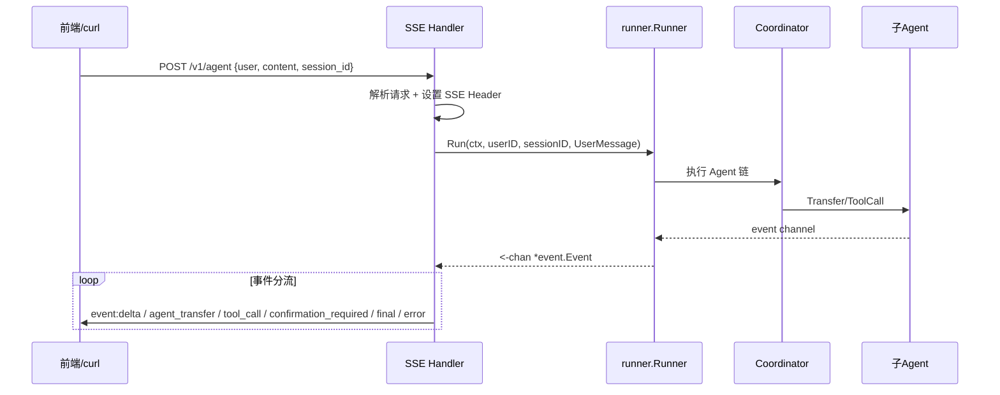
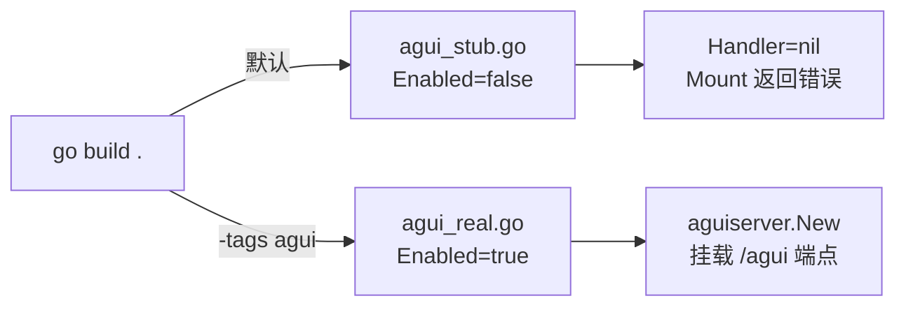
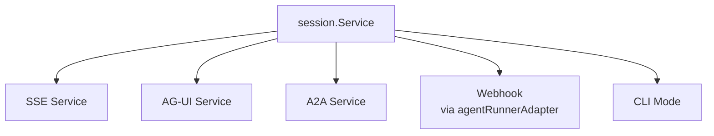

---

# GameOps Agent — 11. 服务接入层

## 一、模块定位

**服务接入层**（`src/services/`）是 GameOps Agent 面向外部流量的"门面"，负责将各种协议的请求统一翻译为框架 `runner.Runner` 的调用，并将 Agent 事件流按协议规范推送给调用方。

**核心职责**：

| 职责 | 说明 |
|------|------|
| 协议适配 | SSE / AG-UI / A2A / Webhook 四种入口，统一接入同一 Coordinator Agent |
| 事件分流 | 将框架 `event.Event` 按语义分类为 delta / transfer / tool_call / confirmation / final / error |
| 会话共享 | 所有通道共享同一 `session.Service`，保证跨通道续写（SSE 发起 → AG-UI 继续） |
| 安全闸门 | Webhook 入口的 HMAC-SHA256 签名校验 + 幂等去重 |
| 异步化 | Webhook 场景 1~3 秒内回 202，Agent 执行放入后台 goroutine |

---

## 二、目录结构

```
src/services/
├── sse/                    # SSE 流式服务（核心入口）
│   ├── sse.go             # Service 实现 + 事件分流逻辑
│   ├── types.go           # Request/Response/Data 类型定义
│   └── sse_test.go        # 单元测试
├── agui/                   # AG-UI Web 前端（build tag 条件编译）
│   ├── agui.go            # Config + 接口定义
│   ├── agui_real.go       # 真实实现（-tags agui）
│   └── agui_stub.go       # Stub 占位（默认构建）
├── a2a/                    # A2A 协议（build tag 条件编译）
│   ├── a2a.go             # Config + 接口定义
│   ├── a2a_real.go        # 真实实现（-tags a2a）
│   ├── a2a_stub.go        # Stub 占位（默认构建）
│   ├── a2a_test.go        # 单元测试
│   └── multi_agent_e2e_test.go  # 多 Agent 协作端到端测试
└── webhook/                # Webhook 告警入口
    ├── webhook.go         # Handler 实现 + 异步分派 + 报告查询
    ├── schema.go          # BKAlarmPayload / TAPDPayload 结构定义
    ├── deduper.go         # 幂等去重器
    ├── deduper_test.go    # 去重器测试
    └── webhook_test.go    # Handler 集成测试
```

---

## 三、SSE 流式服务

### 3.1 架构概览

SSE（Server-Sent Events）是面向前端的**主入口**，提供 `POST /v1/agent` 端点，接收 JSON 请求后通过 Runner 执行 Agent，将事件流按 SSE 协议逐条推送。



### 3.2 核心类型定义

**文件**：[types.go](D:/UGit/Go-Agent/project-agent/src/services/sse/types.go)

```go
// Request SSE 请求参数
type Request struct {
    User      string `json:"user"`       // 用户 ID
    Content   string `json:"content"`    // 用户消息文本
    SessionID string `json:"session_id"` // 会话 ID
}

// Response SSE 响应体
type Response struct {
    EventName string `json:"-"`    // SSE event 名（delta/agent_transfer/tool_call/...）
    Data      Data   `json:"data"`
}

// Data SSE 响应主体
type Data struct {
    Response     string          `json:"response"`
    Finished     bool            `json:"finished"`
    GlobalOutput GlobalOutput    `json:"global_output"`
    EventType    string          `json:"event_type,omitempty"`    // 冗余到 data 内便于前端解析
    Author       string          `json:"author,omitempty"`        // 当前说话的 Agent 名
    ToolCall     *ToolCallInfo   `json:"tool_call,omitempty"`     // 工具调用元信息
    Transfer     *TransferInfo   `json:"transfer,omitempty"`      // Agent 切换元信息
    Confirm      *ConfirmPayload `json:"confirmation,omitempty"`  // HITL 确认请求
}
```

**6 种事件类型**：

| EventName | 触发条件 | 前端行为 |
|-----------|---------|---------|
| `delta` | 流式文本增量 | 追加到对话气泡 |
| `agent_transfer` | Coordinator ↔ 子 Agent 切换 | 显示"🔄 分发给 xxx" |
| `tool_call` | 工具开始执行 | 显示"*开始执行工具: xxx*" |
| `confirmation_required` | HITL 等待人工确认 | 弹出确认 UI |
| `final` | 本轮对话结束 | 标记 finished=true |
| `error` | 出错 | 显示错误信息 |

### 3.3 Service 构造与依赖注入

**文件**：[sse.go](D:/UGit/Go-Agent/project-agent/src/services/sse/sse.go)

```go
// Service SSE 服务实现
type Service struct {
    appName       string
    debug         bool
    entranceAgent agent.Agent    // 入口 Agent（Coordinator）
    agentRunner   runner.Runner  // 框架 Runner
}

// New 构造 SSE 服务
func New(appName string, entrance agent.Agent, sess session.Service, debug bool) *Service {
    var r runner.Runner
    if sess != nil {
        r = runner.NewRunner(appName, entrance, runner.WithSessionService(sess))
    } else {
        r = runner.NewRunner(appName, entrance)
    }
    return &Service{
        appName:       appName,
        debug:         debug,
        entranceAgent: entrance,
        agentRunner:   r,
    }
}
```

**关键设计**：
- `runner.Runner` 是**框架提供**的执行器，封装了 Agent 调度、Session 管理、事件流生成
- `session.Service` 注入后，Runner 自动支持多轮对话记忆
- `entranceAgent` 用于判断"最终事件"——只有入口 Agent 的 Done 才视为整体结束

### 3.4 事件分流引擎（forward）

`forward` 方法是 SSE 服务的**核心自定义逻辑**，将框架的通用 `event.Event` 按语义分流为前端可理解的 SSE 事件：

```go
// forward 事件分流优先级：
//  1. error    → 发 event=error
//  2. transfer → 发 event=agent_transfer
//  3. tool_call→ transfer_to_agent 跳过，其他发 event=tool_call
//  4. tool_response → HITL PendingResult → event=confirmation_required；否则隐藏
//  5. delta    → 发 event=delta（流式文本）
//  6. done     → 发 event=final
func (s *Service) forward(ctx context.Context, w http.ResponseWriter, flusher http.Flusher, ch <-chan *event.Event)
```

**Transfer 事件识别**（兼容框架两种暴露方式）：

```go
func (s *Service) handleTransferEvent(w, flusher, ev) bool {
    // case a: Event.Object == ObjectTypeTransfer（框架显式标记）
    // case b: ToolCalls 中 function.name == "transfer_to_agent"（框架内置工具）
}
```

**HITL 确认事件提取**：

```go
func (s *Service) handleToolResponse(w, flusher, ev) {
    // 从工具响应 content 中检测 "awaiting_confirmation" + "human_prompt"
    // 支持两种 JSON 格式：
    //   1. 平铺：{status, human_prompt, plan}
    //   2. 嵌套：{data: {status, human_prompt, plan}}
    // 命中后发 event=confirmation_required，前端弹确认 UI
}
```

**Final 事件判定**：

```go
func (s *Service) handleFinal(w, flusher, ev) bool {
    // 仅入口 Agent（Coordinator）的 Done 才视为整体结束
    // 子 Agent 的 Done 只是 hand-off 完成，对话继续
    if ev.Author != s.entranceAgent.Info().Name {
        return false
    }
}
```

### 3.5 SSE 协议编码

```go
// String 序列化为 SSE 协议格式
func (r Response) String() string {
    name := r.EventName
    if name == "" {
        name = "delta"  // 默认事件名，兼容旧前端
    }
    r.Data.EventType = name  // 冗余到 data 内
    payload, _ := json.Marshal(r.Data)
    return fmt.Sprintf("event:%s\ndata:%s\n\n", name, string(payload))
}
```

输出示例：
```
event:agent_transfer
data:{"response":"\n🔄 分发给 `diagnosis_agent`：OOM 诊断\n","author":"coordinator","transfer":{"from":"coordinator","to":"diagnosis_agent","reason":"OOM 诊断"}}

event:tool_call
data:{"response":"\n*开始执行工具: bk_query_metrics*\n","author":"diagnosis_agent","tool_call":{"name":"bk_query_metrics"}}

event:confirmation_required
data:{"response":"⚠ 即将执行 bcs.helm.rollback","author":"repair_agent","confirmation":{"action":"bcs.helm.rollback","severity":"high","target":"BCS-K8S-001/letsgo/game-core"}}

event:final
data:{"response":"","finished":true,"author":"coordinator"}
```

### 3.6 框架依赖关系

| 框架包 | 用途 |
|--------|------|
| `trpc-agent-go/runner` | `runner.Runner` / `runner.NewRunner` / `runner.WithSessionService` |
| `trpc-agent-go/agent` | `agent.Agent` 接口 |
| `trpc-agent-go/event` | `event.Event` 事件结构 |
| `trpc-agent-go/model` | `model.NewUserMessage` / `model.RoleTool` / `model.ObjectTypeTransfer` |
| `trpc-agent-go/session` | `session.Service` 会话接口 |

---

## 四、AG-UI Web 前端服务

### 4.1 设计目标

AG-UI 给运维人员提供**零前端开发的 Web 调试入口**——浏览器直接访问 `/agui` 即可与 Agent 对话，无需额外前端代码。

### 4.2 Build Tag 条件编译



**设计动机**：
- 默认构建不引入 `trpc-agent-go/server/agui` 的 Fiber 等重前端依赖
- 外网 CI / 离线环境可编译
- `main.go` 仅在 `Enabled()==true` 时才 Mount，确保 `go run .` 默认路径永不破栈

### 4.3 Config 定义

**文件**：[agui.go](D:/UGit/Go-Agent/project-agent/src/services/agui/agui.go)

```go
type Config struct {
    Path    string          // HTTP 挂载路径，默认 "/agui"
    AppName string          // 应用名，默认 "gameops-agent"
    Agent   agent.Agent     // 入口 Agent（Coordinator）。必填
    Session session.Service // 会话服务；允许为 nil
}
```

### 4.4 真实实现（`-tags agui`）

**文件**：[agui_real.go](D:/UGit/Go-Agent/project-agent/src/services/agui/agui_real.go)

```go
type Server struct {
    cfg Config
    srv *aguiserver.Server  // 框架提供的 AG-UI Server
}

func New(cfg Config) (*Server, error) {
    // 1. 构造 runner（注入 Session 保证跨通道记忆）
    var r runner.Runner
    if cfg.Session != nil {
        r = runner.NewRunner(cfg.AppName, cfg.Agent, runner.WithSessionService(cfg.Session))
    } else {
        r = runner.NewRunner(cfg.AppName, cfg.Agent)
    }

    // 2. 构造框架 AG-UI Server
    opts := []aguiserver.Option{
        aguiserver.WithPath(cfg.Path),
        aguiserver.WithAppName(cfg.AppName),
    }
    if cfg.Session != nil {
        opts = append(opts, aguiserver.WithSessionService(cfg.Session))
    }
    srv, err := aguiserver.New(r, opts...)
    // ...
}

// Mount 把 AG-UI 服务挂到 mux（同时挂 "Path" 与 "Path/"）
func (s *Server) Mount(mux *http.ServeMux) error {
    h := s.srv.Handler()
    mux.Handle(s.cfg.Path, h)
    mux.Handle(s.cfg.Path+"/", h)
    return nil
}
```

### 4.5 Stub 实现（默认构建）

**文件**：[agui_stub.go](D:/UGit/Go-Agent/project-agent/src/services/agui/agui_stub.go)

```go
//go:build !agui

func (s *Server) Enabled() bool { return false }
func (s *Server) Handler() http.Handler { return nil }
func (s *Server) Mount(mux *http.ServeMux) error {
    return fmt.Errorf("agui: real AG-UI link disabled in stub build; rebuild with `-tags agui` to enable")
}
```

### 4.6 框架依赖

| 框架包 | 用途 |
|--------|------|
| `trpc-agent-go/server/agui` | `aguiserver.New` / `aguiserver.Server` / `aguiserver.Option` |
| `trpc-agent-go/runner` | `runner.Runner` / `runner.NewRunner` |
| `trpc-agent-go/session` | `session.Service` |

---

## 五、A2A 协议服务

### 5.1 设计目标

A2A（Agent-to-Agent）协议允许**外部 Agent 通过标准化协议调用本服务的入口 Agent**。基于 A2A v0.2 规范，支持流式事件订阅。

### 5.2 Build Tag 条件编译

与 AG-UI 相同的模式：

| 构建方式 | 文件 | 行为 |
|---------|------|------|
| `go build .` | `a2a_stub.go` | `Enabled()=false`，`Handler()=nil` |
| `go build -tags a2a .` | `a2a_real.go` | 真实 A2A 协议端点 |

### 5.3 Config 定义

**文件**：[a2a.go](D:/UGit/Go-Agent/project-agent/src/services/a2a/a2a.go)

```go
type Config struct {
    ServiceName string          // 服务名标识，默认 "trpc.gameops.agent.A2A"
    Host        string          // 对外暴露 URL（用于 agent card）
    Agent       agent.Agent     // 入口 Agent（Coordinator）。必填
    Session     session.Service // 会话服务；nil 时降级为单轮
    Streaming   bool            // 是否启用流式，默认 true
}
```

### 5.4 真实实现（`-tags a2a`）

**文件**：[a2a_real.go](D:/UGit/Go-Agent/project-agent/src/services/a2a/a2a_real.go)

```go
import (
    a2aserverlib "trpc.group/trpc-go/trpc-a2a-go/server"
    a2a "trpc.group/trpc-go/trpc-agent-go/server/a2a"
)

type Server struct {
    cfg  Config
    name string
    srv  *a2aserverlib.A2AServer  // trpc-a2a-go 提供的 A2A Server
}

func New(cfg Config) (*Server, error) {
    opts := []a2a.Option{
        a2a.WithHost(host),
        a2a.WithAgent(cfg.Agent, cfg.Streaming),
    }
    if cfg.Session != nil {
        opts = append(opts, a2a.WithSessionService(cfg.Session))
    }
    srv, err := a2a.New(opts...)
    // ...
}

// Handler 返回 A2A 协议的 HTTP Handler
func (s *Server) Handler() http.Handler {
    return s.srv.Handler()
}

// Mount 挂到指定 mux 路径
func (s *Server) Mount(mux *http.ServeMux, pattern string) error {
    mux.Handle(pattern, s.srv.Handler())
    return nil
}

// Stop 优雅停止
func (s *Server) Stop(ctx context.Context) error {
    return s.srv.Stop(ctx)
}
```

### 5.5 框架依赖

| 框架包 | 用途 |
|--------|------|
| `trpc-a2a-go/server` | `a2aserverlib.A2AServer` — A2A 协议底层实现 |
| `trpc-agent-go/server/a2a` | `a2a.New` / `a2a.Option` — Agent 框架对 A2A 的封装 |
| `trpc-agent-go/session` | `session.Service` |

---

## 六、Webhook 告警入口

### 6.1 设计目标

Webhook 是**被动触发**的入口，接收外部平台（蓝鲸监控 / TAPD）的 Push 通知，异步触发 Agent 自动处置，并生成可查询的修复报告。

```mermaid
flowchart LR
    BK[蓝鲸监控] -->|POST /webhook/bk_alarm| WH[Webhook Handler]
    TAPD[TAPD] -->|POST /webhook/tapd| WH
    WH -->|HMAC 校验| V{签名有效?}
    V -->|否| R1[401 Unauthorized]
    V -->|是| D{幂等命中?}
    D -->|是| R2[202 返回已有 caseID]
    D -->|否| Dispatch[异步分派]
    Dispatch -->|goroutine| Agent[Coordinator Agent]
    Dispatch -->|立即| R3[202 Accepted + caseID]
    Agent -->|完成| Store[Report Store]
    Client[运维人员] -->|GET /v1/report/{case_id}| Store
```

### 6.2 Handler 构造

**文件**：[webhook.go](D:/UGit/Go-Agent/project-agent/src/services/webhook/webhook.go)

```go
type Config struct {
    Runner       AgentRunner           // Agent 入口（必填）
    Store        ReportStore           // 报告存储（必填）
    Secret       string                // HMAC 签名密钥（可选）
    AsyncTimeout time.Duration         // 后台执行超时（默认 3 分钟）
    Metrics      func(source, outcome string) // OTel 埋点钩子
    Summarizer   report.SummarizerClient      // 报告总结器
    DedupeWindow time.Duration         // 幂等窗口（>0 启用）
}

type Handler struct {
    cfg  Config
    dedu *deduper  // 幂等去重器
}
```

### 6.3 路由注册

```go
func (h *Handler) Mount(mux *http.ServeMux) {
    mux.HandleFunc("/webhook/bk_alarm", h.handleBKAlarm)  // 蓝鲸告警
    mux.HandleFunc("/webhook/tapd", h.handleTAPD)          // TAPD 事件
    mux.HandleFunc("/v1/report/", h.handleGetReport)       // 报告查询
}
```

### 6.4 Payload Schema

**文件**：[schema.go](D:/UGit/Go-Agent/project-agent/src/services/webhook/schema.go)

**蓝鲸告警**：

```go
type BKAlarmPayload struct {
    AlarmID      string  `json:"alarm_id"`       // 告警唯一 ID（去重用）
    AlarmName    string  `json:"alarm_name"`     // 告警策略名
    Severity     string  `json:"severity"`       // critical/high/medium/low
    StartTime    string  `json:"start_time"`     // 首次触发时间
    BizID        int64   `json:"biz_id"`         // 业务 ID
    Module       string  `json:"module"`         // 模块
    Service      string  `json:"service"`        // 服务
    Description  string  `json:"description"`    // 告警文案
    Metric       string  `json:"metric"`         // 触发指标名
    CurrentValue float64 `json:"current_value"`  // 当前值
    Threshold    float64 `json:"threshold"`      // 阈值
    DashboardURL string  `json:"dashboard_url"`  // 大盘链接
}

// Prompt 翻译为 Agent 输入
func (p BKAlarmPayload) Prompt() string {
    return "[蓝鲸告警] " + p.Service + "：" + p.Description
}
```

**TAPD 事件**：

```go
type TAPDPayload struct {
    Event       string   `json:"event"`        // bug_create / bug_update / ...
    WorkspaceID string   `json:"workspace_id"` // 项目 ID
    Bug         *TAPDBug `json:"bug"`          // Bug 结构
}

type TAPDBug struct {
    ID          string `json:"id"`
    Title       string `json:"title"`
    Description string `json:"description"`
    Severity    string `json:"severity"`
    Priority    string `json:"priority"`
    Status      string `json:"status"`
    URL         string `json:"url"`
}
```

### 6.5 HMAC 签名校验

```go
// readAndVerify 读 body 并做 HMAC 校验
func (h *Handler) readAndVerify(w http.ResponseWriter, r *http.Request) ([]byte, bool) {
    body, _ := io.ReadAll(io.LimitReader(r.Body, 1<<20)) // 1MiB 上限
    if !h.verifyEnabled() {
        return body, true  // 未配密钥或 WEBHOOK_VERIFY_SIG=0 时跳过
    }
    sig := r.Header.Get("X-Signature")
    return body, verifyHMACSHA256(h.cfg.Secret, body, sig)
}

// verifyHMACSHA256 校验 "sha256=<hex>" 格式签名
func verifyHMACSHA256(secret string, body []byte, sig string) bool {
    sig = strings.TrimPrefix(sig, "sha256=")
    expected, _ := hex.DecodeString(sig)
    mac := hmac.New(sha256.New, []byte(secret))
    mac.Write(body)
    return hmac.Equal(mac.Sum(nil), expected)
}
```

**校验策略**：
- `WEBHOOK_VERIFY_SIG=0` → 永远放行（demo / 联调）
- `Secret` 为空 → 无法校验，视为关闭
- 其余情况 → 强制校验

### 6.6 异步分派与报告生成

```go
func (h *Handler) dispatch(ctx context.Context, caseID, title string, ...) {
    // 1. 生成初始 Report 骨架入库
    b := report.NewBuilder(caseID).SetTitle(title).SetSeverity(severity)
    h.cfg.Store.Save(caseID, b.Build())

    // 2. 异步执行 Agent
    go func() {
        asyncCtx, cancel := context.WithTimeout(context.Background(), h.cfg.AsyncTimeout)
        defer cancel()
        err := h.cfg.Runner.Run(asyncCtx, "webhook", caseID, prompt)

        // 3. 完成后更新报告
        final := b.AddTimeline(...).Build()
        if err == nil {
            final.Outcome = report.SummarizeOrFallback(asyncCtx, h.cfg.Summarizer, final, fallback, ...)
        }
        h.cfg.Store.Save(caseID, final)
    }()
}
```

### 6.7 幂等去重器

**文件**：[deduper.go](D:/UGit/Go-Agent/project-agent/src/services/webhook/deduper.go)

**问题**：蓝鲸/TAPD 在 HTTP 失败时会指数退避重试，同一告警多次分派会浪费 token + 多下发写操作。

**策略**：基于 `(source, natural_key, bucket_time)` 做幂等键。

```go
type deduper struct {
    window time.Duration       // 幂等窗口
    clock  func() time.Time   // 可注入时钟（测试用）
    mu     sync.Mutex
    cache  map[string]dedupEntry
    stop   chan struct{}       // GC goroutine 退出信号
}

// Lookup 查询已存在的 caseID；miss 时返回空串
func (d *deduper) Lookup(source, natural string) string

// Record 记录一次分派
func (d *deduper) Record(source, natural, caseID string)
```

**Natural Key 构造**：

| 来源 | Natural Key | 示例 |
|------|-------------|------|
| 蓝鲸告警 | `AlarmID + "|" + StartTime` | `alarm-001|2026-06-08T10:00:00Z` |
| TAPD | `Event + "|" + BugID` | `bug_create|12345` |

**GC 机制**：独立 goroutine 每 `window/2`（至少 30s）扫一次，清掉过期条目。`Handler.Shutdown()` 时停止。

### 6.8 报告查询

```
GET /v1/report/{case_id}?format=markdown|json
```

- `format=json`（默认）：返回结构化 JSON
- `format=markdown`：返回人类可读的 Markdown 报告

### 6.9 AgentRunner 适配器

Webhook 需要的是"一次性执行"语义，而框架 `runner.Runner` 返回的是 event channel。通过适配器桥接：

```go
// agentRunnerAdapter 把框架 runner.Runner 适配为 webhook.AgentRunner 接口
type agentRunnerAdapter struct {
    r runner.Runner
}

func (a *agentRunnerAdapter) Run(ctx context.Context, userID, sessionID, prompt string) error {
    ch, err := a.r.Run(ctx, userID, sessionID, model.NewUserMessage(prompt))
    if err != nil {
        return err
    }
    // 消费完 event chan，出现 error 时翻译为 Go error
    var firstErr error
    for ev := range ch {
        if ev != nil && ev.Error != nil && firstErr == nil {
            firstErr = fmt.Errorf("agent error: %s", ev.Error.Message)
        }
    }
    return firstErr
}
```

---

## 七、HTTP 路由总览（main.go 装配）

**文件**：[main.go](D:/UGit/Go-Agent/project-agent/main.go)

```go
func runHTTP(ctx context.Context, a *app.App, addr string, cancelRoot context.CancelFunc) {
    mux := http.NewServeMux()

    // 健康检查
    mux.HandleFunc("/healthz", ...)

    // SSE 流式 Agent 接口（与 AG-UI 共享同一 session）
    sseSvc := sse.New("gameops-agent", a.Entrance, a.Session, a.Cfg.Debug)
    mux.HandleFunc("/v1/agent", sseSvc.HandleSSE)

    // AG-UI Web 前端（-tags agui 时启用）
    if a.AGUI != nil && a.AGUI.Enabled() {
        a.AGUI.Mount(mux)
    }

    // Webhook 入口 + 报告查询
    if a.Webhook != nil {
        a.Webhook.Mount(mux)
    }
}
```

**完整端点列表**：

| 方法 | 路径 | 服务 | 说明 |
|------|------|------|------|
| GET | `/healthz` | 内置 | 健康检查 |
| POST | `/v1/agent` | SSE | 流式对话（主入口） |
| ALL | `/agui` `/agui/` | AG-UI | Web 前端（需 `-tags agui`） |
| POST | `/webhook/bk_alarm` | Webhook | 蓝鲸告警 Push |
| POST | `/webhook/tapd` | Webhook | TAPD 事件 Push |
| GET | `/v1/report/{case_id}` | Webhook | 报告查询 |

---

## 八、DI 装配层（app.go）

**文件**：[app.go](D:/UGit/Go-Agent/project-agent/src/app/app.go)

所有服务在 `app.Init` 中统一构造，共享同一 `session.Service`：

```go
// App 结构体中的服务字段
type App struct {
    Session  frameworksession.Service  // 共享会话
    AGUI     *aguisvc.Server           // AG-UI 服务
    A2A      *a2asvc.Server            // A2A 服务
    Webhook  *webhooksvc.Handler       // Webhook 服务
    Reports  webhooksvc.ReportStore    // 报告存储
}

func Init(ctx context.Context, cfg *config.Config) (*App, error) {
    // ... 构造 Agent ...

    // 6. Session 服务
    sessSvc := appsession.New(appsession.DefaultConfig(), mdl)

    // 7. AG-UI
    aguiSrv, _ := aguisvc.New(aguisvc.Config{Agent: entrance, Session: sessSvc})

    // 8. A2A
    a2aSrv, _ := a2asvc.New(a2asvc.Config{Agent: entrance, Session: sessSvc, Streaming: true})

    // 9. Webhook
    webhookHandler, _ := webhooksvc.New(webhooksvc.Config{
        Runner: &agentRunnerAdapter{r: agentRunner},
        Store:  reports,
        Secret: cfg.Webhook.Secret,
    })
}
```

**会话共享拓扑**：



---

## 九、Graceful Shutdown

```go
// 关闭顺序：
//   1. SIGINT/SIGTERM → srv.Shutdown（拒绝新请求，等 in-flight 完成，30s 超时）
//   2. a.Shutdown → 通知 application 关闭依赖（async runner / audit sink / 缓存）
//   3. main defer → OTel flush

// App.Close 释放后台资源
func (a *App) Close() {
    a.GuardWatcher.Stop()     // 停规则热加载
    a.MetricsPump.Stop()      // 停 metric pump
    a.AuditRemote.Close(5s)   // flush 审计日志
    audit.CloseSigner()       // 持久化链式 state
    a.Webhook.Shutdown()      // 停幂等 GC goroutine
    a.AsyncRunner.Shutdown()  // 停异步执行器
}
```

---

## 十、自定义 vs 框架代码边界

| 层次 | 自定义实现 | 框架提供 |
|------|-----------|---------|
| **SSE** | 事件分流引擎（forward）、HITL 确认检测、Transfer 识别、SSE 编码 | `runner.Runner`、`event.Event`、`session.Service` |
| **AG-UI** | Build tag 条件编译壳、Config 定义 | `aguiserver.New`、`aguiserver.Server`、`aguiserver.Handler` |
| **A2A** | Build tag 条件编译壳、Config 定义 | `a2a.New`、`a2aserverlib.A2AServer`、`a2a.WithAgent` |
| **Webhook** | 全部自定义：签名校验、Schema 解析、异步分派、幂等去重、报告生成 | 仅复用 `runner.Runner` 执行 Agent |
| **路由装配** | `main.go` 中 mux 注册、Graceful Shutdown 编排 | `http.ServeMux`（标准库） |

---

## 十一、测试覆盖

| 测试文件 | 覆盖范围 |
|---------|---------|
| `sse/sse_test.go` | Response 编码、Transfer 参数解析、Transfer 事件识别、HITL PendingResult 检测、ToolCall 过滤、extractPendingResult 双层格式 |
| `a2a/a2a_test.go` | nil Agent 报错、默认 ServiceName、stub Enabled=false、Config 透传 |
| `a2a/multi_agent_e2e_test.go` | 多 Agent 协作：SubAgents 列表、FindSubAgent 定位、事件流透传、顺序 fan-out |
| `webhook/webhook_test.go` | 签名校验、Schema 解析、异步语义、报告查询、幂等去重 |
| `webhook/deduper_test.go` | 窗口过期、GC 清理、并发安全、natural key 构造 |

---

## 十二、关键设计决策

### 12.1 为什么 SSE 是自定义而非框架提供？

框架的 `runner.Runner` 只负责"执行 Agent 并返回 event channel"，不关心传输协议。SSE 服务需要：
- 按业务语义分流事件（Transfer / HITL / ToolCall 各有不同前端渲染）
- 兼容框架两种 Transfer 暴露方式
- 从工具响应中"嗅探"HITL PendingResult
- 控制"最终事件"判定逻辑（只有入口 Agent 的 Done 才结束）

这些都是**业务层决策**，不适合下沉到框架。

### 12.2 为什么 AG-UI / A2A 用 Build Tag？

- **依赖隔离**：`trpc-agent-go/server/agui` 引入 Fiber 等重依赖；`trpc-a2a-go` 引入 A2A 协议栈
- **CI 友好**：外网 CI 无法拉取内网依赖时，默认构建仍可通过
- **渐进式启用**：开发者 `go run .` 默认只有 SSE + Webhook，需要时加 tag 启用

### 12.3 为什么 Webhook 不用 SSE 流式？

Webhook 场景的调用方是**蓝鲸/TAPD 平台**，它们只关心"收到了没有"（202 Accepted），不需要流式输出。Agent 执行结果通过 `/v1/report/{case_id}` 异步拉取。

### 12.4 幂等窗口为什么用内存而非 Redis？

- 单实例 Demo 场景下内存足够
- 避免引入外部依赖（Redis）增加部署复杂度
- 窗口通常 10 分钟，内存占用极小
- 多副本场景可通过 Redis 实现替换（接口已抽象为 `deduper`）

---

## 十三、配置参考

```yaml
# config.yaml 相关配置段
webhook:
  secret: "your-hmac-secret"        # HMAC 签名密钥
  store_file: "/data/reports.jsonl"  # 报告持久化文件（空则用内存）
  summarizer: "mock"                 # 报告总结器（off/mock）
  dedupe_window: "10m"              # 幂等窗口

# 环境变量
WEBHOOK_VERIFY_SIG=0    # 关闭签名校验（调试用）
```

---
