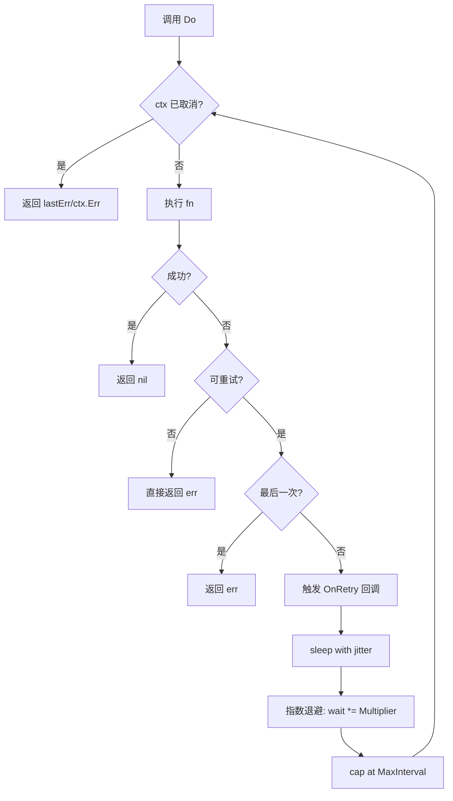
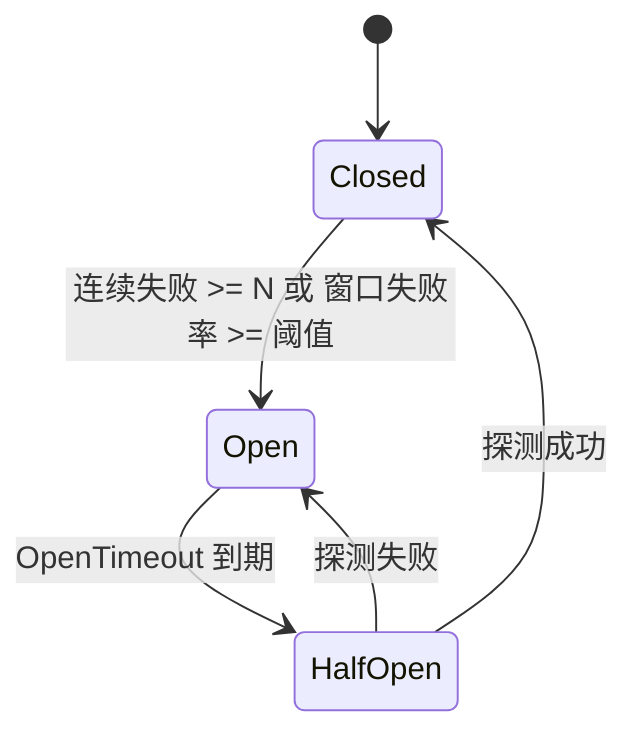
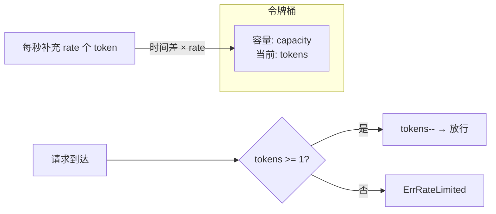
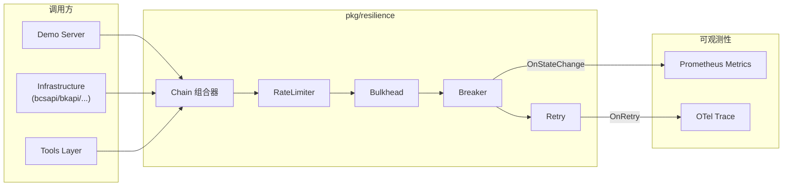

---

# 13 — 韧性原语（Resilience Primitives）

## 一、模块概述

`pkg/resilience/` 是 GameOps Agent 的**通用韧性原语库**，为 Agent 调用外部依赖（LLM / BCS / BK / iWiki / DevOps 等）提供生产级的故障防护能力。

### 1.1 设计哲学

| 原则 | 说明 |
|------|------|
| **零第三方依赖** | 故意不引入 sony/gobreaker、resilience4j 等库，降低依赖足迹并保留对错误语义的完整控制 |
| **彼此独立、可任意组合** | 4 个原语各自独立，可单独使用，也可通过 `Chain` 组合器串联 |
| **统一接口签名** | 所有原语的核心方法均为 `Do(ctx, fn) error`，便于嵌套和组合 |
| **可测试性** | 时间源（`Now func() time.Time`）可注入，支持 fakeClock 精确控制测试时序 |
| **参考实现** | sony/gobreaker、resilience4j（Java）、Polly（.NET） |

### 1.2 推荐组合顺序

```
RateLimit → Bulkhead → Breaker → Retry → 真实调用
```

顺序原则：
1. **RateLimit 最外层**：超过预算的请求最先被丢，不消耗其他资源
2. **Bulkhead 次外层**：限制单依赖在飞数，避免下游卡顿吃掉所有 goroutine
3. **Breaker 中间**：依据近期成功率快速失败，减少无谓重试
4. **Retry 最内层**：仅对真实调用包裹，避免重试时穿透限流/隔板

### 1.3 文件清单

| 文件 | 行数 | 职责 |
|------|------|------|
| [doc.go](../pkg/resilience/doc.go) | 14 | 包级文档，设计说明 |
| [retry.go](../pkg/resilience/retry.go) | 145 | 指数退避 + jitter + 错误分类重试 |
| [breaker.go](../pkg/resilience/breaker.go) | 280 | 三态熔断器（Closed/Open/HalfOpen） |
| [bulkhead.go](../pkg/resilience/bulkhead.go) | 95 | 信号量隔板，限制并发上限 |
| [ratelimit.go](../pkg/resilience/ratelimit.go) | 157 | 令牌桶限流（单 key + 多 key） |
| [chain.go](../pkg/resilience/chain.go) | 54 | 组合器，按既定顺序串联多个原语 |

---

## 二、Retry — 指数退避重试

### 2.1 核心设计



### 2.2 配置参数（RetryConfig）

```go
type RetryConfig struct {
    MaxAttempts     int           // 最大尝试次数（含首次），>=1。默认 3
    InitialInterval time.Duration // 初始等待时间。默认 100ms
    MaxInterval     time.Duration // 最大单次等待时间。默认 5s
    Multiplier      float64       // 指数退避倍数。默认 2.0
    JitterFraction  float64       // 抖动比例 [0,1]。默认 0.2 表示 ±20%
    Retryable       Retryable     // 自定义错误判定。nil 用 DefaultRetryable
    OnRetry         func(attempt int, err error, nextWait time.Duration)
}
```

### 2.3 错误分类（Retryable）

```go
// DefaultRetryable — 保守判定：
//   - context.Canceled 不重试（上游主动取消）
//   - context.DeadlineExceeded 不重试（已超总预算）
//   - 其他 error 都重试
func DefaultRetryable(err error) bool {
    if err == nil {
        return false
    }
    if errors.Is(err, context.Canceled) || errors.Is(err, context.DeadlineExceeded) {
        return false
    }
    return true
}
```

业务方可注入自定义判定，例如：
- HTTP 5xx / RST / 网络超时 → 可重试
- HTTP 4xx（Bad Request）→ 不可重试

### 2.4 Jitter 抗雷鸣群

```go
func withJitter(base time.Duration, frac float64) time.Duration {
    delta := float64(base) * frac
    jitter := (rand.Float64()*2 - 1) * delta  // ±delta 均匀分布
    return time.Duration(float64(base) + jitter)
}
```

当大量客户端同时重试时，jitter 将等待时间打散到 `[base*(1-frac), base*(1+frac)]` 区间，避免"雷鸣群效应"（Thundering Herd）。

### 2.5 关键行为

| 行为 | 说明 |
|------|------|
| **ctx 提前检查** | 每次尝试前检查 `ctx.Err()`，避免做无意义的调用 |
| **最后一次不 sleep** | 达到 MaxAttempts 后直接返回，不浪费等待时间 |
| **sleep 期间响应取消** | 使用 `select` 同时监听 timer 和 ctx.Done |
| **错误原样返回** | 不可重试错误和最终错误均原样返回，便于上游 `errors.Is/As` |

---

## 三、Breaker — 三态熔断器

### 3.1 状态机



| 状态 | 行为 |
|------|------|
| **Closed** | 正常放行，统计失败率 |
| **Open** | 拒绝所有请求（返回 `ErrCircuitOpen`），避免雪崩 |
| **HalfOpen** | 允许少量探测请求，按结果决定恢复或退回 |

### 3.2 配置参数（BreakerConfig）

```go
type BreakerConfig struct {
    Name                string        // 名称（metrics/log 用）
    Window              time.Duration // 滑动窗口长度。默认 30s
    MinRequests         uint64        // 触发判定的最小请求数。默认 20
    FailureRate         float64       // 失败率阈值 [0,1]。默认 0.5
    ConsecutiveFailures uint64        // 连续失败立即熔断。默认 5
    OpenTimeout         time.Duration // Open 持续时间。默认 10s
    HalfOpenMaxCalls    uint64        // HalfOpen 最大并发探测数。默认 1
    IsFailure           func(err error) bool  // 自定义"失败"判定
    OnStateChange       func(name string, from, to State)  // 状态变化回调
    Now                 func() time.Time  // 时间源（测试用）
}
```

### 3.3 双触发条件

熔断器从 Closed → Open 有**两条独立路径**：

1. **连续失败**：`consecFailures >= ConsecutiveFailures` → 立即开断（快速响应突发故障）
2. **窗口失败率**：窗口内 `total >= MinRequests && fails/total >= FailureRate` → 按比例开断（应对渐进劣化）

### 3.4 滑动窗口实现

```go
// 简易实现：每秒一个 bucket，环形数组
type bucket struct {
    tsSec uint64          // 桶的秒时间戳
    total atomic.Uint64   // 该秒内总请求数
    fails atomic.Uint64   // 该秒内失败数
}
```

- 窗口大小 = `Window.Seconds()` 个 bucket
- 使用 `tsSec % len(buckets)` 做环形索引
- 当 bucket 的时间戳过期时，自动清零复用
- `windowStats()` 遍历所有 bucket，累加 cutoff 时间内的统计

### 3.5 HalfOpen 并发控制

```go
case StateHalfOpen:
    if b.halfOpenInFlight >= b.cfg.HalfOpenMaxCalls {
        return ErrCircuitOpen  // 超出探测并发上限，拒绝
    }
    b.halfOpenInFlight++
    return nil  // 放行探测
```

默认只允许 1 个并发探测请求，避免半开状态下大量请求涌入尚未恢复的下游。

### 3.6 状态变化回调

```go
func (b *Breaker) transition(to State) {
    from := b.state
    b.state = to
    if b.cfg.OnStateChange != nil {
        go b.cfg.OnStateChange(b.cfg.Name, from, to)  // 异步回调，不阻塞调用方
    }
}
```

回调用于接入 Metrics/告警系统，例如：熔断器打开时触发 PagerDuty 告警。

---

## 四、Bulkhead — 信号量隔板

### 4.1 核心概念

| 对比 | RateLimit | Bulkhead |
|------|-----------|----------|
| 控制维度 | 每秒 N 次（吞吐量） | 同时 N 个在飞（并发数） |
| 解决问题 | 防止超过下游容量 | 防止慢依赖拖垮整个进程 |
| 典型场景 | API 配额限制 | 下游卡顿时快速失败 |

### 4.2 实现原理

```go
type Bulkhead struct {
    name    string
    sem     chan struct{}   // 有缓冲 channel 作为信号量
    timeout time.Duration  // 等待槽位的超时
}
```

使用 Go 的 **buffered channel** 作为信号量：
- `sem <- struct{}{}`：获取槽位（进入）
- `<-sem`：释放槽位（退出）
- `cap(sem)` = MaxConcurrent

### 4.3 两种获取模式

```go
func (b *Bulkhead) acquire(ctx context.Context) error {
    // 模式 1：Fail-Fast（timeout <= 0）
    if b.timeout <= 0 {
        select {
        case b.sem <- struct{}{}:
            return nil       // 获取成功
        case <-ctx.Done():
            return ctx.Err() // 上游取消
        default:
            return ErrBulkheadFull  // 立即失败
        }
    }
    // 模式 2：带超时等待
    t := time.NewTimer(b.timeout)
    select {
    case b.sem <- struct{}{}:
        return nil
    case <-ctx.Done():
        return ctx.Err()
    case <-t.C:
        return ErrBulkheadFull  // 超时失败
    }
}
```

| 配置 | 行为 |
|------|------|
| `AcquireTimeout = 0` | Fail-Fast：满了立即返回 `ErrBulkheadFull` |
| `AcquireTimeout > 0` | 等待指定时间，超时后返回 `ErrBulkheadFull` |

### 4.4 观测接口

```go
func (b *Bulkhead) InFlight() int  // 当前在飞数
func (b *Bulkhead) Capacity() int  // 最大并发数
```

---

## 五、RateLimit — 令牌桶限流

### 5.1 算法原理



### 5.2 核心实现

```go
type RateLimiter struct {
    mu       sync.Mutex
    capacity float64        // 桶容量（最大爆发）
    rate     float64        // tokens per second
    tokens   float64        // 当前 token 数
    last     time.Time      // 上次补桶时间
    now      func() time.Time
}

func (r *RateLimiter) refill() {
    now := r.now()
    delta := now.Sub(r.last).Seconds()
    r.tokens += delta * r.rate
    if r.tokens > r.capacity {
        r.tokens = r.capacity
    }
    r.last = now
}
```

**惰性补桶**：不依赖时间轮/后台 goroutine，每次 `Allow()`/`Wait()` 时按时间差计算应补充的 token 数。

### 5.3 三种使用方式

| 方法 | 行为 | 适用场景 |
|------|------|----------|
| `Allow() bool` | 立即判定，不阻塞 | 高频检查 |
| `Wait(ctx) error` | 阻塞等待直到获取 token 或 ctx 取消 | 需要保证最终执行 |
| `Do(ctx, fn) error` | Fail-Fast 包装（内部调用 Allow） | 与其他原语组合 |

### 5.4 多 Key 限流器（KeyedRateLimiter）

```go
type KeyedRateLimiter struct {
    cfg     RateLimitConfig
    limiter sync.Map  // map[string]*RateLimiter
}
```

按 key 维度独立限流（如按 `user_id` / `cluster` / `tool_name`），每个 key 拥有独立的令牌桶。

| 方法 | 说明 |
|------|------|
| `Allow(key) bool` | 对指定 key 判定 |
| `Do(ctx, key, fn) error` | 对指定 key fail-fast 包装 |
| `Forget(key)` | 移除某 key 的限流器（释放内存） |

> ⚠️ 注意：内部使用 `sync.Map`，长期不活跃的 key 不会自动回收，业务方应在合适时机调用 `Forget` 或重启进程。

---

## 六、Chain — 组合器

### 6.1 设计思路

`Chain` 将 4 个原语按**固定最优顺序**组合成一个调用链，避免使用方自行嵌套时顺序出错。

```go
type Chain struct {
    Limiter *RateLimiter   // 最外层
    Bulk    *Bulkhead      // 次外层
    Breaker *Breaker       // 中间
    Retry   *RetryConfig   // 最内层
}
```

### 6.2 组装逻辑

```go
func (c Chain) Do(ctx context.Context, fn func(ctx context.Context) error) error {
    call := fn
    // 从内到外包装（代码顺序 = 执行时从内到外）
    if c.Retry != nil   { /* wrap retry */ }
    if c.Breaker != nil { /* wrap breaker */ }
    if c.Bulk != nil    { /* wrap bulkhead */ }
    if c.Limiter != nil { /* wrap ratelimit */ }
    return call(ctx)
}
```

**关键设计**：任意一层未配置（nil）则跳过该层，实现灵活的"按需组合"。

### 6.3 执行时调用栈

```
RateLimit.Do
  └── Bulkhead.Do
        └── Breaker.Do
              └── Retry.Do (可能多次调用 fn)
                    └── fn (真实业务调用)
```

### 6.4 错误优先级

由于从外到内逐层判定，错误优先级为：

```
ErrRateLimited > ErrBulkheadFull > ErrCircuitOpen > 业务 error（可能被 retry）
```

---

## 七、实际使用场景

### 7.1 Demo Server 中的使用

[main.go](../src/cmd/demo/main.go) 中展示了完整的 Chain 组装：

```go
func newDemoServer() *demoServer {
    rl := resilience.NewRateLimiter(resilience.RateLimitConfig{
        Capacity:      10,
        RatePerSecond: 50,
    })
    br := resilience.NewBreaker(resilience.BreakerConfig{
        Name:                "demo",
        MinRequests:         5,
        FailureRate:         0.6,
        ConsecutiveFailures: 5,
        OpenTimeout:         2 * time.Second,
    })
    chain := resilience.Chain{
        Limiter: rl,
        Breaker: br,
        Retry: &resilience.RetryConfig{
            MaxAttempts:     3,
            InitialInterval: 10 * time.Millisecond,
            MaxInterval:     100 * time.Millisecond,
        },
    }
    // ...
}
```

在告警处理 handler 中通过 Chain 保护外部调用：

```go
err := s.chain.Do(r.Context(), func(ctx context.Context) error {
    // 模拟 30% 失败概率触发重试/熔断
    if time.Now().UnixNano()%10 < 3 {
        return fmt.Errorf("transient: bcs api 503")
    }
    return nil
})
```

### 7.2 集成测试（Chaos Test）

[chaos_test.go](../src/integration/chaos_test.go) 提供了 4 个故障注入场景：

| 测试用例 | 验证目标 |
|----------|----------|
| `TestChaos_BulkheadProtectsFromSlowUpstream` | 慢响应下 Bulkhead 限制并发，多余请求快速失败 |
| `TestChaos_BreakerOpensThenRecovers` | 持续错误 → 熔断打开 → 自动半开探测恢复 |
| `TestChaos_FullChainErrorPriority` | Chain 组合下错误优先级：限流 > 熔断 > 重试 |
| `TestChaos_RetryDoesNotAmplifyOnNonRetryable` | 不可重试错误不会被 retry 放大 |

---

## 八、测试策略

### 8.1 单元测试

每个原语都有独立的 `*_test.go`，使用 **fakeClock** 精确控制时间：

```go
type fakeClock struct {
    mu  sync.Mutex
    now time.Time
}

func (c *fakeClock) Now() time.Time { ... }
func (c *fakeClock) Advance(d time.Duration) { ... }
```

通过注入 `Now: clock.Now` 到配置中，测试可以：
- 精确推进时间验证 OpenTimeout
- 避免 `time.Sleep` 导致的测试不稳定
- 在毫秒级完成需要"等待秒级"的场景验证

### 8.2 测试覆盖矩阵

| 原语 | 测试文件 | 核心场景 |
|------|----------|----------|
| Retry | `retry_test.go` | 首次成功 / 重试恢复 / 耗尽次数 / 不可重试 / ctx 取消 / 最后一次不 sleep / OnRetry 回调 |
| Breaker | `breaker_test.go` | 连续失败开断 / HalfOpen 成功闭合 / HalfOpen 失败退回 / HalfOpen 并发限制 / 状态变化回调 |
| Bulkhead | `bulkhead_test.go` | 容量内放行 / 满时 Fail-Fast / 带超时等待 / ctx 取消 |
| RateLimit | `ratelimit_test.go` | 爆发后补桶 / Do Fail-Fast / 多 Key 独立 / Wait 响应 ctx |
| Chain | `chain_test.go` | 限流优先 / Retry 在 Breaker 内部 / nil 层跳过 |

---

## 九、架构决策与权衡

### 9.1 为什么不用第三方库？

| 考量 | 说明 |
|------|------|
| **依赖足迹** | Agent 部署在 K8s Pod 中，二进制体积敏感 |
| **错误语义控制** | 需要精确区分"被限流"vs"被熔断"vs"业务错误"，第三方库的错误类型不一定满足 |
| **可测试性** | 需要注入 fakeClock，部分库不支持 |
| **代码量可控** | 4 个原语 + 1 个组合器，总计 ~730 行，维护成本低 |

### 9.2 滑动窗口 vs 固定窗口

选择**每秒一个 bucket 的环形数组**（简易滑动窗口）：
- 优点：O(1) 记录、O(N) 统计（N = 窗口秒数），内存固定
- 缺点：精度为秒级，不如真正的滑动窗口（如 ring buffer per request）精确
- 权衡：对于 Agent 场景（QPS 通常 < 100），秒级精度足够

### 9.3 Retry 放在最内层的原因

```
❌ 错误做法：Retry → RateLimit → fn
   问题：每次重试都消耗一个 rate limit token，3 次重试 = 3 倍限流消耗

✅ 正确做法：RateLimit → Retry → fn
   效果：一次请求只消耗一个 rate limit 配额，重试在内部完成
```

### 9.4 Bulkhead 使用 channel 而非 semaphore 包

Go 标准库的 `golang.org/x/sync/semaphore` 需要额外依赖，且 API 不如 channel 直观。
buffered channel 天然支持：
- `len(ch)` = 当前在飞数
- `cap(ch)` = 最大容量
- `select` + `default` = fail-fast

---

## 十、与项目其他模块的关系



| 调用方 | 使用方式 |
|--------|----------|
| `src/cmd/demo/` | 完整 Chain 演示（限流 + 熔断 + 重试） |
| `src/infrastructure/` | HTTP Client 内部包裹 Retry + Breaker |
| `src/integration/` | Chaos 测试验证组合行为 |

---

## 十一、总结

`pkg/resilience/` 以 **~730 行纯 Go 代码**实现了 4 个生产级韧性原语 + 1 个组合器，核心特点：

1. **零依赖**：不引入任何第三方韧性库
2. **统一接口**：`Do(ctx, fn) error` 贯穿所有原语
3. **可组合**：Chain 按最优顺序自动串联
4. **可测试**：fakeClock 注入，测试确定性强
5. **错误语义清晰**：`ErrRateLimited` / `ErrBulkheadFull` / `ErrCircuitOpen` 三种标记错误，上游可精确判断失败原因

这套设计使得 GameOps Agent 在面对 LLM API 抖动、BCS 集群故障、蓝鲸平台限流等生产场景时，能够**优雅降级而非级联崩溃**。
