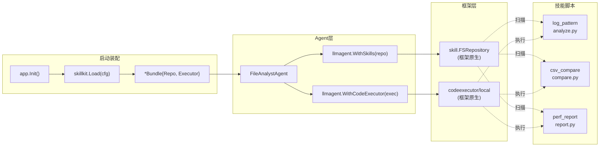
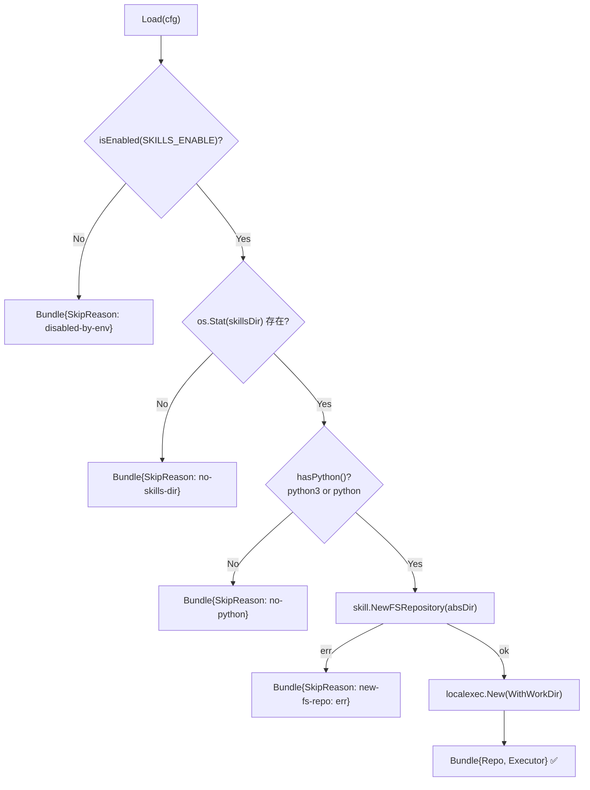
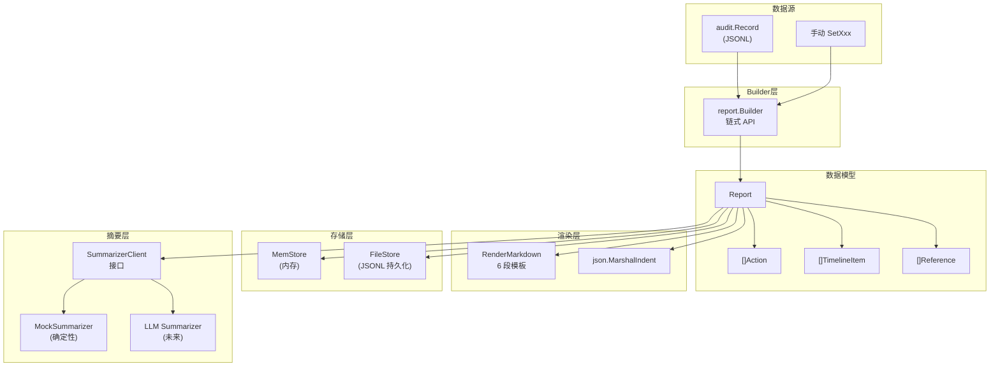
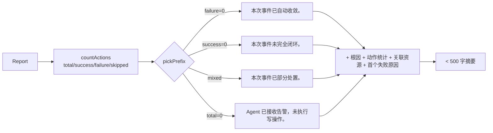
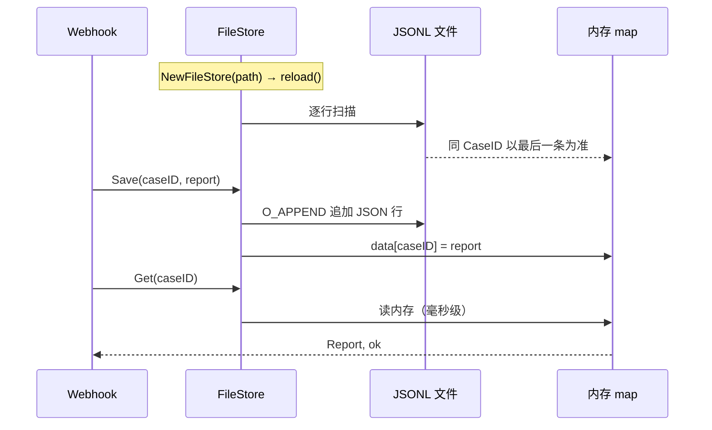
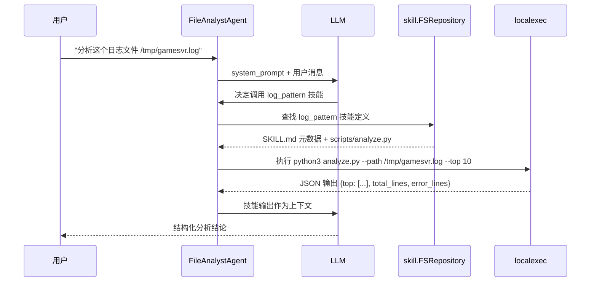
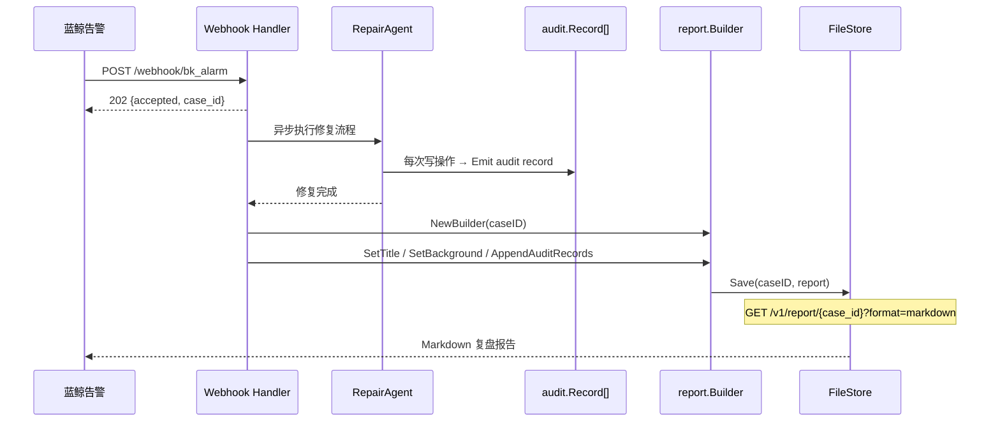

---

# 14 — 技能系统与报告

> 对应索引：`src/skillkit/`、`src/report/`、`skills/`
> 涉及框架能力：`skill.FSRepository`、`codeexecutor/local`、`llmagent.WithSkills`、`llmagent.WithCodeExecutor`

---

## 一、模块定位

| 子模块 | 目录 | 核心职责 |
|--------|------|---------|
| **技能系统** | `src/skillkit/` + `skills/` | 将 Python 脚本封装为可被 Agent 调用的"技能"，提供本地代码执行能力 |
| **修复报告** | `src/report/` | 将修复闭环（Repair Flow）的全过程聚合为结构化报告，支持 Markdown/JSON 双格式渲染 |

两者的关系：
- **技能系统**服务于 `FileAnalystAgent`，为其提供"超越 FunctionTool"的脚本执行能力
- **修复报告**服务于 `RepairAgent` + `Webhook`，将审计链（audit）的写操作时间轴聚合为可消费的复盘文档

---

## 二、技能系统（Skills）

### 2.1 整体架构



### 2.2 自定义实现：`src/skillkit/skillkit.go`

#### 核心设计

| 设计要点 | 说明 |
|---------|------|
| **永不报错** | `Load()` 返回 `*Bundle` 而非 `(*Bundle, error)`，三档降级都只打日志 |
| **显式开关** | 默认关闭，`SKILLS_ENABLE=1/true/on` 才启用，避免生产意外 fork Python |
| **三档降级** | `disabled-by-env` → `no-skills-dir` → `no-python` |
| **调用方零心智负担** | 判 `bundle.Enabled()` 即可决定是否挂载 |

#### 数据结构

```go
// Config 技能装配配置
type Config struct {
    SkillsDir    string // 技能仓库根目录，默认 "./skills"
    WorkspaceDir string // 脚本运行工作区，默认 "./.skill_workspaces"
    EnableEnv    string // 环境变量名，默认 "SKILLS_ENABLE"
}

// Bundle 装配完成的技能套件
type Bundle struct {
    Repo       *skill.FSRepository        // 框架原生：技能仓库
    Executor   codeexecutor.CodeExecutor   // 框架原生：代码执行器
    SkillsDir  string
    SkipReason string // 非空 = 未启用，取值：disabled-by-env / no-skills-dir / no-python
}
```

#### 装配流程（`Load` 函数）



#### 关键代码

```go
func Load(cfg Config) *Bundle {
    // 1) 显式开关检查
    if !isEnabled(cfg.EnableEnv) {
        return &Bundle{SkipReason: "disabled-by-env", SkillsDir: cfg.SkillsDir}
    }
    // 2) 目录存在性检查
    absDir, err := filepath.Abs(cfg.SkillsDir)
    // ...
    // 3) Python 可用性检查
    if !hasPython() {
        return &Bundle{SkipReason: "no-python", SkillsDir: absDir}
    }
    // 4) 构造 FSRepository（框架原生）
    repo, err := skill.NewFSRepository(absDir)
    // 5) 构造 localexec（框架原生）
    exec := localexec.New(localexec.WithWorkDir(absWork))
    return &Bundle{Repo: repo, Executor: exec, SkillsDir: absDir}
}
```

### 2.3 框架能力复用

| 框架组件 | 包路径 | 作用 |
|---------|--------|------|
| `skill.FSRepository` | `trpc.group/trpc-go/trpc-agent-go/skill` | 从文件系统扫描 `SKILL.md` 元数据，构建技能注册表 |
| `codeexecutor.CodeExecutor` | `trpc.group/trpc-go/trpc-agent-go/codeexecutor` | 代码执行器接口 |
| `localexec.New` | `trpc.group/trpc-go/trpc-agent-go/codeexecutor/local` | 本地进程执行器，fork Python 子进程 |
| `llmagent.WithSkills(repo)` | Agent 构造选项 | 将技能仓库注入 Agent |
| `llmagent.WithCodeExecutor(exec)` | Agent 构造选项 | 将执行器注入 Agent |

### 2.4 Agent 挂载（`file_analyst_agent/agent.go`）

```go
type Dep struct {
    // ...
    SkillRepo    *skill.FSRepository        // D13 注入
    CodeExecutor codeexecutor.CodeExecutor   // D13 注入
    ToolCallbacks *tool.Callbacks            // D13 注入
}

func New(dep Dep) (agent.Agent, error) {
    opts := []llmagent.Option{...}
    // 两者必须同时非 nil 才启用
    if dep.SkillRepo != nil && dep.CodeExecutor != nil {
        opts = append(opts,
            llmagent.WithSkills(dep.SkillRepo),
            llmagent.WithCodeExecutor(dep.CodeExecutor),
        )
    }
    return llmagent.New(AgentName, opts...), nil
}
```

### 2.5 App 层装配（`app.go` L243）

```go
// 4.1 D13：技能系统装配；环境不具备时静默降级
skillBundle := skillkit.Load(skillkit.DefaultConfig())
if skillBundle.SkipReason != "" {
    log.Printf("[app] skills disabled: %s (dir=%s)", skillBundle.SkipReason, skillBundle.SkillsDir)
}

fileA, err := fileanalyst.New(fileanalyst.Dep{
    Model: mdl, GenConfig: gen,
    LocalTools:   filetools.NewAll(filetools.DefaultConfig()),
    SkillRepo:    skillBundle.Repo,      // nil 时 New 内部跳过
    CodeExecutor: skillBundle.Executor,  // nil 时 New 内部跳过
})
```

### 2.6 技能脚本（`skills/` 目录）

#### 目录结构

```
skills/
├── README.md
├── log_pattern/
│   ├── SKILL.md          # 元数据（name/description/inputs/outputs）
│   └── scripts/
│       └── analyze.py    # 入口脚本
├── csv_compare/
│   ├── SKILL.md
│   └── scripts/
│       └── compare.py
└── perf_report/
    ├── SKILL.md
    └── scripts/
        └── report.py
```

#### SKILL.md 元数据格式（以 `log_pattern` 为例）

```yaml
---
name: log_pattern
description: 从日志文件中提取错误模式和频率统计...
version: 0.1.0
inputs:
  - name: path
    type: string
    required: true
    description: 日志文件路径
  - name: top
    type: int
    required: false
    default: 10
    description: 返回频率前 N 的错误模式
---
```

#### 三个已落地技能

| 技能 | 入口脚本 | 功能 | 触发场景 | 核心算法 |
|------|---------|------|---------|---------|
| `log_pattern` | `analyze.py` | 正则提取错误模式 + 频率统计 | 大段日志初筛（>1MB） | 10 类正则 → 归一化 → Counter 聚合 → Top-N |
| `csv_compare` | `compare.py` | 两份 CSV 按 Key 对齐输出差异 | 性能压测前后对比 | 首列 Key 对齐 → added/removed/changed/unchanged |
| `perf_report` | `report.py` | 统计摘要 + 突增点检测 | 性能数据分析 | percentile 计算 + 相邻变化率 ≥1.5× 检测 |

**共同特征**：
- 全部 Python 3.6+ **标准库实现**，零三方依赖
- 刻意避开 pandas/numpy，降低部署负担
- 输入输出均为 JSON，便于 Agent 解析

#### `log_pattern/scripts/analyze.py` 核心逻辑

```python
ERROR_PATTERNS = [
    (re.compile(r"panic:\s*(.+)"),                     "panic"),
    (re.compile(r"fatal(?:\s+error)?:\s*(.+)", re.I),  "fatal"),
    (re.compile(r"runtime\s+error:\s*(.+)", re.I),     "runtime_error"),
    (re.compile(r"\[error\]\s*(.+)", re.I),            "error_tag"),
    (re.compile(r"ERROR\s+(.+)"),                      "error"),
    (re.compile(r"\bexception\b[:\s]+(.+)", re.I),     "exception"),
    (re.compile(r"failed\s+to\s+(.+)", re.I),          "failed_to"),
    (re.compile(r"cannot\s+(.+)", re.I),               "cannot"),
    (re.compile(r"connection\s+(?:refused|reset|timeout)", re.I), "conn_err"),
    (re.compile(r"OOM|out\s+of\s+memory", re.I),       "oom"),
]

def normalize(line: str) -> str:
    """归一化：数字→<n>、十六进制→<hex>、时间戳→<ts>"""
    s = re.sub(r"0x[0-9a-fA-F]+", "<hex>", s)
    s = re.sub(r"\b\d{10,}\b",    "<ts>",  s)
    s = re.sub(r"\b\d+(\.\d+)?\b","<n>",   s)
    return s[:200]
```

输出格式：
```json
{
  "top": [{"tag": "panic", "pattern": "...", "count": 12, "sample_line": "..."}],
  "total_lines": 1024,
  "error_lines": 19
}
```

#### `csv_compare/scripts/compare.py` 核心逻辑

```python
def diff(before_rows, after_rows):
    added = sorted(a_keys - b_keys)     # 新增行
    removed = sorted(b_keys - a_keys)   # 删除行
    changed = []                         # 值变化行（逐列对比）
    unchanged = 0
    # ...
    return {"added": ..., "removed": ..., "changed": ..., "summary": {...}}
```

#### `perf_report/scripts/report.py` 核心逻辑

```python
def percentile(sorted_values, p):
    """线性插值百分位数计算"""
    k = (len(sorted_values) - 1) * (p / 100.0)
    # ...

def analyze(path, metric):
    # 统计：count/min/max/mean/p50/p90/p95/p99
    # 突增点：相邻变化率 ≥ 1.5 或 ≤ 0.5
    spikes = [{"idx": i, "prev": prev, "cur": cur, "ratio": ratio}]
```

### 2.7 测试覆盖（`skillkit_test.go`）

| 测试用例 | 验证点 |
|---------|--------|
| `TestLoad_DisabledByDefault` | 默认未启用 → `SkipReason = "disabled-by-env"` |
| `TestLoad_NoSkillsDir` | 目录不存在 → `SkipReason = "no-skills-dir"` |
| `TestLoad_DirExists` | 目录存在 → 按 Python 可用性二分（Enabled 或 no-python） |

---

## 三、修复报告（Report）

### 3.1 整体架构



### 3.2 数据模型（`report.go`）

#### 四级结构

```go
// Report 修复报告完整数据模型
type Report struct {
    CaseID      string         `json:"case_id"`       // 唯一 ID
    Title       string         `json:"title"`         // 标题
    Severity    Severity       `json:"severity"`      // 整体定级
    Background  string         `json:"background"`    // 背景/现象
    Diagnosis   string         `json:"diagnosis"`     // 诊断结论
    Actions     []Action       `json:"actions"`       // 修复动作列表
    Timeline    []TimelineItem `json:"timeline"`      // 时间轴
    Outcome     string         `json:"outcome"`       // 最终结论
    References  []Reference    `json:"references"`    // 关联资源
    GeneratedAt string         `json:"generated_at"`  // 生成时间
    Version     string         `json:"version"`       // Schema 版本
}

// Action 一条修复动作
type Action struct {
    Action      string   `json:"action"`       // 动作名
    Description string   `json:"description"`  // 人类可读说明
    Target      string   `json:"target"`       // 作用对象
    Severity    Severity `json:"severity"`     // 破坏等级
    Result      string   `json:"result"`       // success/failure/skipped
    Operator    string   `json:"operator"`     // 操作人
    TS          string   `json:"ts"`           // 执行时间
    ErrorMsg    string   `json:"error"`        // 失败原因
    Mock        bool     `json:"mock"`         // 是否 Mock
}

// TimelineItem 时间轴节点
type TimelineItem struct {
    TS       string   `json:"ts"`
    Actor    string   `json:"actor"`    // coordinator/diagnosis_agent/repair_agent/user/system
    Kind     string   `json:"kind"`     // alarm/diagnosis/action/gate/outcome/note
    Message  string   `json:"message"`
    Severity Severity `json:"severity"`
}

// Reference 外部资源引用
type Reference struct {
    Kind  string `json:"kind"`   // mr/pipeline/tapd/dashboard/knowledge
    Title string `json:"title"`
    URL   string `json:"url"`
}
```

#### Severity 等级（与 audit/hitl 对齐）

| 等级 | 含义 |
|------|------|
| `critical` | 极高风险（如 MR 合并到 master） |
| `high` | 高风险（如 Helm 升级） |
| `medium` | 中等风险 |
| `low` | 低风险 |

### 3.3 Builder 链式 API

```go
b := report.NewBuilder("case-20260421-oom-01")
b.SetTitle("game-core OOM 重启事件").
    SetSeverity(report.SeverityHigh).
    SetBackground("凌晨 03:12—03:41 gamesvr Pod 连续重启 3 次").
    SetDiagnosis("Old Gen 内存持续攀升至 95%，Full GC 停顿超 30s").
    AddAction(report.Action{
        Action: "bcs.helm.upgrade", Description: "提升 -Xmx 至 12G",
        Target: "BCS-K8S-001/ns-letsgo/game-core",
        Severity: report.SeverityHigh, Result: "success",
    }).
    SetOutcome("重启消除，RT 恢复基线").
    AddReference(report.Reference{Kind: "mr", Title: "fix-oom#42", URL: "https://..."}).
    AppendTimelineFromAudit(memSink.Snapshot())

md, _ := b.Render(report.FormatMarkdown)
js, _ := b.Render(report.FormatJSON)
```

#### Builder 方法一览

| 方法 | 作用 |
|------|------|
| `NewBuilder(caseID)` | 创建 Builder，空 caseID 自动生成 `case-<unix>` |
| `SetTitle(s)` | 设置标题 |
| `SetSeverity(s)` | 设置整体定级 |
| `SetBackground(s)` | 设置背景 |
| `SetDiagnosis(s)` | 设置诊断结论 |
| `SetOutcome(s)` | 设置最终结论 |
| `AddAction(a)` | 追加修复动作（同时入 Timeline） |
| `AddTimeline(item)` | 追加非 action 类时间轴 |
| `AddReference(ref)` | 追加外部资源引用 |
| `AppendAuditRecords(recs)` | 从 `[]audit.Record` 聚合 |
| `AppendTimelineFromAudit(lines)` | 从 JSONL 字节流聚合（脏数据静默跳过） |
| `Build()` | 冻结并返回排序后的 Report 副本 |
| `Render(format)` | 以指定格式输出 |

### 3.4 Markdown 渲染（`templates.go`）

#### 6 段模板结构

| 段落 | 标题 | 内容 |
|------|------|------|
| 1 | `# 修复报告 — {Title}` | 基本信息表（CaseID / 定级 / 生成时间 / Schema 版本） |
| 2 | `## 一、背景` | Background 文本 |
| 3 | `## 二、诊断结论` | Diagnosis 文本 |
| 4 | `## 三、修复动作` | Actions 表格（# / 时间 / Action / Target / Result / Operator / 备注） |
| 5 | `## 四、时间轴` | Timeline 列表（时间 + Actor + Severity + Message） |
| 6 | `## 五、结论` + `## 六、关联资源` | Outcome 文本 + References 链接列表 |

#### 安全处理

```go
// sanitizeInline 去除破坏 Markdown 行内渲染的字符
func sanitizeInline(s string) string {
    s = strings.ReplaceAll(s, "\r\n", " ")
    s = strings.ReplaceAll(s, "\n", " ")
    s = strings.ReplaceAll(s, "|", "\\|")  // 防止表格错位
    return s
}

// sanitizeBlock 保留换行，仅统一 CRLF → LF
func sanitizeBlock(s string) string {
    s = strings.ReplaceAll(s, "\r\n", "\n")
    return strings.TrimRight(s, "\n")
}

// renderResult 可视化标记
// success → ✅ success
// failure → ❌ failure
// skipped → ⚠ skipped
```

### 3.5 Summarizer 摘要生成器（`summarizer.go`）

#### 接口设计

```go
// SummarizerClient 把 Report 总结为人话 Outcome 文本
type SummarizerClient interface {
    Summarize(ctx context.Context, r Report) (string, error)
}
```

#### MockSummarizer（确定性实现）

策略：**分类 Actions → 统计动词频次 → 拼装模板**



#### 安全调用入口

```go
// SummarizeOrFallback — Webhook 场景零心智负担
func SummarizeOrFallback(ctx, client, r, fallback, logger) string {
    // client 为 nil → fallback
    // client.Summarize 报错 → 打日志 + fallback
    // 返回空串 → fallback
}
```

### 3.6 FileStore 持久化（`filestore.go`）

#### 设计目标

| 目标 | 实现 |
|------|------|
| 进程重启可恢复 | JSONL 追加写 + 启动时 reload |
| 零外部依赖 | 只用标准库 `os/bufio/encoding/json` |
| 与 MemStore 接口同构 | `Save(caseID, Report) error` + `Get(caseID) (Report, bool)` |
| 并发安全 | File-level Mutex + RWMutex 保护内存快照 |

#### 核心流程



### 3.7 与 Webhook 的集成

```go
// Webhook Handler 中的报告生成流程
func (h *Handler) handleBKAlarm(w, r) {
    // 1. 解析告警 payload
    // 2. 异步启动 Agent 处理
    // 3. Agent 完成后：
    b := report.NewBuilder(caseID)
    b.SetTitle(payload.CaseTitle()).
        SetBackground(payload.Prompt()).
        AppendAuditRecords(auditRecords)
    r := b.Build()
    store.Save(caseID, r)
}

// GET /v1/report/{case_id}?format=markdown|json
func (h *Handler) handleGetReport(w, r) {
    rec, ok := h.cfg.Store.Get(caseID)
    body, _ := report.Render(rec, format)
    w.Write(body)
}
```

### 3.8 测试覆盖

#### `report_test.go`（8 组）

| # | 测试用例 | 验证点 |
|---|---------|--------|
| 1 | `TestRender_EmptyReport` | 空 Report 也能渲染合法 Markdown/JSON |
| 2 | `TestBuilder_Fluent` | 链式 API 各字段正确写入 |
| 3 | `TestRenderMarkdown_Sections` | Markdown 包含全部 6 段标题 |
| 4 | `TestRenderJSON_Roundtrip` | JSON 可被再次 Unmarshal |
| 5 | `TestAppendAuditRecords` | audit.Record 聚合 + 排序 + mock/error 透传 |
| 6 | `TestTimeline_SortedAscending` | 乱序插入后 Build 稳定排序 |
| 7 | `TestAppendTimelineFromAudit_JSONLResilient` | JSONL 脏数据静默跳过 |
| 8 | `TestRender_UnsupportedFormat` | 未知格式返回错误 |

#### `summarizer_test.go`（10 组）

| # | 测试用例 | 验证点 |
|---|---------|--------|
| 1 | `TestMockSummarizer_Empty` | 空 Actions → EmptyPrefix |
| 2 | `TestMockSummarizer_AllSuccess` | 全成功 → SuccessPrefix + 动作统计 |
| 3 | `TestMockSummarizer_AllFailure` | 全失败 → FailurePrefix + first error |
| 4 | `TestMockSummarizer_Partial` | 混合 → PartialPrefix |
| 5 | `TestMockSummarizer_References` | References 拼接 + 空跳过 |
| 6 | `TestSummarizeOrFallback_NilClient` | nil client → fallback |
| 7 | `TestSummarizeOrFallback_ClientError` | error → fallback + logger |
| 8 | `TestSummarizeOrFallback_EmptyReturn` | 空串 → fallback |
| 9 | `TestMockSummarizer_NilReceiver` | nil receiver → error |
| 10 | `TestTrimTo` | trimTo 边界（ASCII + 中文 rune） |

---

## 四、关键设计决策

### 4.1 技能系统

| 决策 | 理由 |
|------|------|
| **默认关闭** | 技能脚本 fork Python 子进程，生产必须显式开关 |
| **降级优先于报错** | `Load()` 永不返回 error，三档降级只打日志 |
| **复用框架原生能力** | `skill.FSRepository` / `codeexecutor/local.New` / `llmagent.WithSkills` 三项均直接用框架 |
| **标准库 Python** | 零三方依赖，避免 pandas/numpy 的部署负担 |
| **SKILL.md 元数据** | 框架约定格式，FSRepository 自动扫描解析 |

### 4.2 修复报告

| 决策 | 理由 |
|------|------|
| **零 LLM 依赖** | Builder 仅做字段聚合 + 排序，避免 Webhook 场景延迟抖动 |
| **Severity 与 audit/hitl 对齐** | 统一语义，聚合时无需转换 |
| **脏数据静默跳过** | 报告用于复盘，不能因个别脏数据阻塞 |
| **接口 + Mock 分离** | SummarizerClient 接口立约，Mock 保证离线确定性 |
| **FileStore JSONL 追加写** | 零外部依赖 + 进程重启可恢复 + 同 CaseID 覆盖语义 |

---

## 五、文件清单

| 文件 | 行数 | 职责 |
|------|------|------|
| `src/skillkit/skillkit.go` | 140 | 技能系统装配：Config / Bundle / Load / isEnabled / hasPython |
| `src/skillkit/skillkit_test.go` | 74 | 4 组测试（默认禁用 / 目录缺失 / 目录存在 / Python 可用性） |
| `src/report/report.go` | 350 | 数据模型 + Builder 链式 API + Render + audit 聚合 |
| `src/report/templates.go` | 169 | Markdown 6 段渲染 + sanitize 工具函数 |
| `src/report/summarizer.go` | 283 | SummarizerClient 接口 + MockSummarizer + SummarizeOrFallback |
| `src/report/filestore.go` | 184 | JSONL 持久化存储（Save / Get / List / Reload） |
| `src/report/report_test.go` | 205 | 8 组 Report 测试 |
| `src/report/summarizer_test.go` | 182 | 10 组 Summarizer 测试 |
| `src/report/filestore_test.go` | ~150 | FileStore 测试 |
| `skills/log_pattern/SKILL.md` | 52 | 日志模式提取技能元数据 |
| `skills/log_pattern/scripts/analyze.py` | 101 | 10 类正则 + 归一化 + Counter 聚合 |
| `skills/csv_compare/SKILL.md` | 52 | CSV 对比技能元数据 |
| `skills/csv_compare/scripts/compare.py` | 95 | Key 对齐 + 四类差异统计 |
| `skills/perf_report/SKILL.md` | 50 | 性能报告技能元数据 |
| `skills/perf_report/scripts/report.py` | 114 | 百分位统计 + 突增点检测 |

---

## 六、端到端流程

### 6.1 技能执行流程



### 6.2 报告生成流程（Webhook 触发）



---

## 七、扩展规划

| 方向 | 说明 | 状态 |
|------|------|------|
| `container_diagnose` 技能 | K8s Pod 诊断辅助（CrashLoopBackOff / OOMKilled） | 规划中 |
| `code_review` 技能 | 修复代码 Review 辅助 | 规划中 |
| 安全规则外置 | 黑名单从 YAML 热加载 | 规划中 |
| LLM Summarizer | 真实 LLM 总结（OpenAI / 混元），build tag 接入 | 规划中 |
| FileStore Compact | 长期运行 JSONL 膨胀压缩 | 规划中 |
