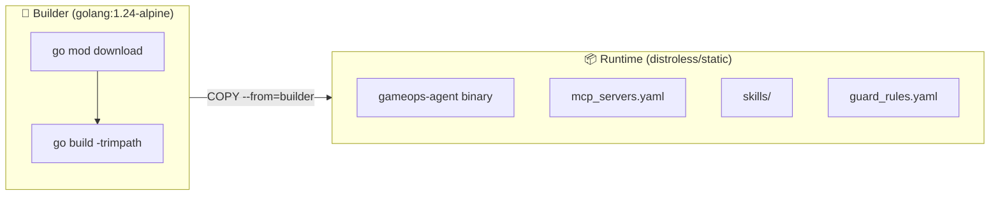
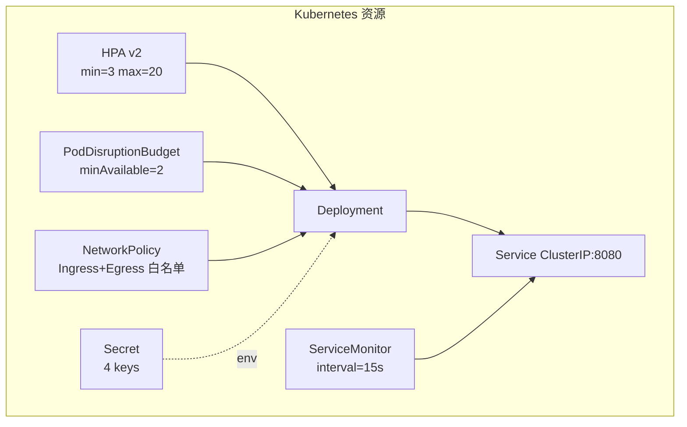
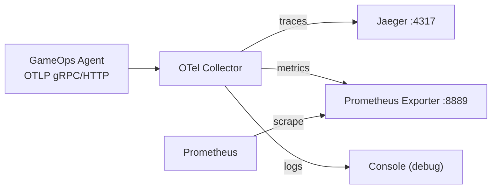
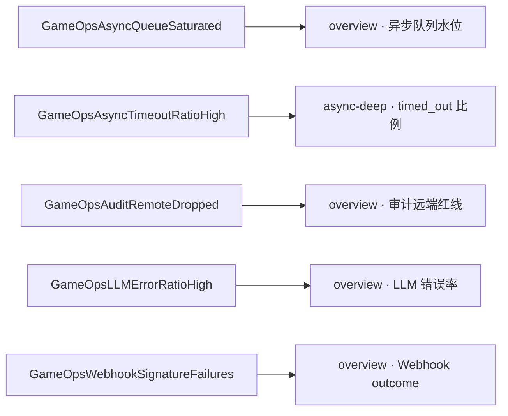
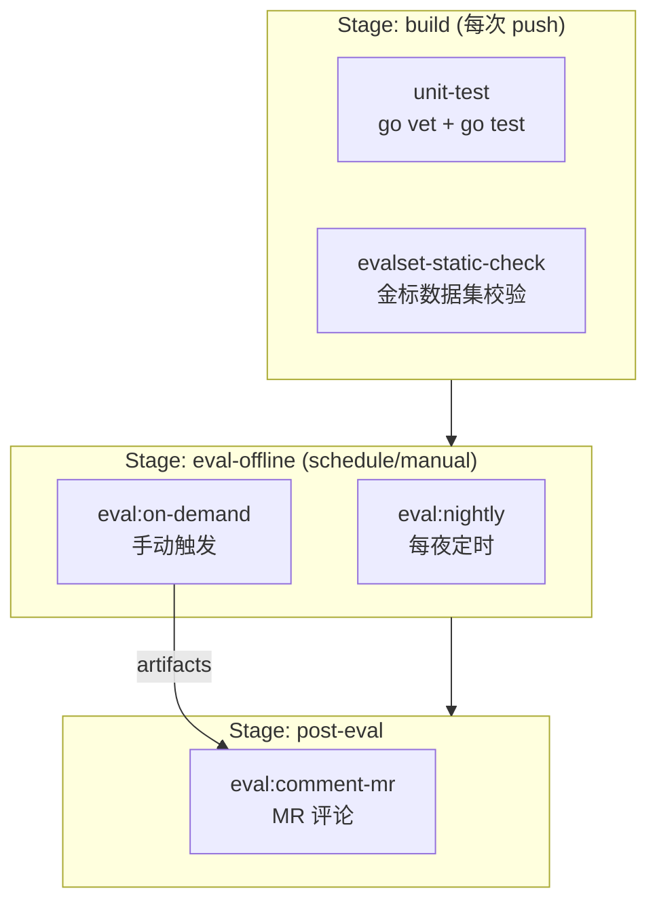
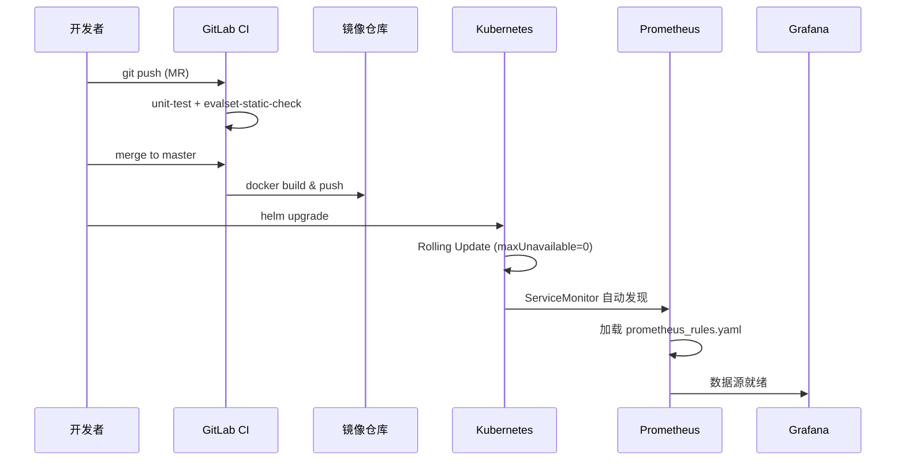

---

# 15 — 部署与 CI/CD

## 一、模块定位

本文档解析 GameOps Agent 的**生产部署体系**与**持续集成/持续交付流水线**，覆盖：

| 关注点 | 核心文件 |
|--------|---------|
| 容器镜像构建 | `Dockerfile` |
| Kubernetes 编排 | `deploy/helm/` 全部 |
| 可观测性采集 | `deploy/otel/collector.yaml`, `deploy/prometheus/prometheus.yml` |
| 告警规则 | `deploy/alerts/prometheus_rules.yaml`, `prometheus_rules_test.yaml` |
| Grafana 面板 | `deploy/grafana/panels.yaml`, `dashboards/gameops-overview.json` |
| 安全防护规则 | `deploy/guard_rules.yaml` |
| CI 流水线 | `.gitlab-ci.yml` |
| CI 辅助脚本 | `scripts/ci/comment-judge-summary.sh` |

---

## 二、目录结构总览

```
project-agent/
├── Dockerfile                          # 多阶段构建
├── .gitlab-ci.yml                      # GitLab CI 3 stage / 5 job
├── scripts/ci/
│   └── comment-judge-summary.sh        # 评测报告 → MR 评论
└── deploy/
    ├── guard_rules.yaml                # InputGuard/OutputGuard 规则集
    ├── helm/
    │   ├── Chart.yaml                  # Chart 元数据
    │   ├── values.yaml                 # 默认配置值
    │   ├── README.md                   # 安装/升级/回滚说明
    │   └── templates/
    │       ├── _helpers.tpl            # 模板辅助函数
    │       ├── all.yaml                # Deployment/Service/HPA/PDB/NetworkPolicy/ServiceMonitor/Secret
    │       └── rbac.yaml               # ServiceAccount/Role/RoleBinding/NetworkPolicy
    ├── alerts/
    │   ├── prometheus_rules.yaml       # 7 组 Prometheus 告警规则
    │   └── prometheus_rules_test.yaml  # promtool 单元测试
    ├── grafana/
    │   ├── README.md                   # 面板使用说明
    │   ├── panels.yaml                 # 意图级面板声明（SSOT）
    │   └── dashboards/
    │       └── gameops-overview.json   # 可直接 Import 的 JSON 骨架
    ├── otel/
    │   └── collector.yaml              # OTel Collector 配置
    └── prometheus/
        └── prometheus.yml              # Prometheus 抓取配置
```

---

## 三、Docker 镜像构建

### 3.1 多阶段构建策略



### 3.2 Dockerfile 关键设计

| 设计决策 | 实现方式 | 原因 |
|---------|---------|------|
| **静态编译** | `CGO_ENABLED=0` | distroless 无 libc，必须纯静态 |
| **层缓存优化** | 先 COPY `go.mod`/`go.sum` → `go mod download` → 再 COPY 源码 | 依赖不变时跳过下载 |
| **BuildKit 缓存** | `--mount=type=cache,target=/go/pkg/mod` | CI 多次构建复用 module cache |
| **版本注入** | `-ldflags "-X main.version=... -X main.commit=..."` | 运行时可查询构建信息 |
| **Build Tags** | `BUILD_TAGS="a2a agui iwiki redis"` | 按需启用功能模块 |
| **最小镜像** | `gcr.io/distroless/static-debian12:nonroot` (~25MB) | 无 shell、无包管理器，攻击面最小 |
| **非 root 运行** | `USER nonroot:nonroot` | 容器安全最佳实践 |

### 3.3 镜像内容物

```
/app/
├── gameops-agent          # 主二进制
├── mcp_servers.yaml       # MCP 工具服务器配置
├── skills/                # Python 技能脚本
└── deploy/
    └── guard_rules.yaml   # 安全防护规则
```

---

## 四、Helm Chart 编排

### 4.1 Chart 元数据

```yaml
apiVersion: v2
name: gameops-agent
version: 1.8.1
appVersion: "1.8.1"
type: application
```

### 4.2 Kubernetes 资源清单

Helm 模板渲染出以下 7 种 K8s 资源：



### 4.3 Deployment 核心配置

| 配置项 | 值 | 设计意图 |
|--------|---|---------|
| `strategy.rollingUpdate.maxUnavailable` | 0 | 滚动升级零中断 |
| `strategy.rollingUpdate.maxSurge` | 1 | 逐个替换，控制资源峰值 |
| `terminationGracePeriodSeconds` | 60 | ≥ HITL 等待 + shutdown 余量 |
| `lifecycle.preStop` | `sleep 5` | 等 Endpoint 摘除后再开始 shutdown |
| `readOnlyRootFilesystem` | true | 安全加固 |
| `runAsNonRoot` / `runAsUser: 65532` | — | 与 distroless nonroot 对齐 |
| `capabilities.drop: ["ALL"]` | — | 最小权限原则 |

### 4.4 环境变量注入

模板通过 `env` 将 `values.yaml` 中的配置映射为环境变量：

| 环境变量 | 来源 | 用途 |
|---------|------|------|
| `MODEL_NAME` | `config.modelName` | LLM 模型选择 |
| `SESSION_BACKEND` / `SESSION_REDIS_ADDR` | `config.session.*` | 会话存储 |
| `IDEMPOTENCY_BACKEND` / `IDEMPOTENCY_REDIS_ADDR` | `config.idempotency.*` | 幂等键存储 |
| `OTEL_ENABLED` / `OTEL_EXPORTER_OTLP_ENDPOINT` | `config.otel.*` | 可观测性 |
| `OTEL_TRACES_SAMPLER` / `OTEL_TRACES_SAMPLER_ARG` | `config.otel.*` | 采样策略 |
| `OPENAI_API_KEY` | Secret | LLM 鉴权 |
| `AUDIT_HMAC_KEY` | Secret | 审计链签名密钥 |
| `LANGFUSE_PUBLIC_KEY` / `LANGFUSE_SECRET_KEY` | Secret (optional) | Langfuse 追踪 |
| `POD_NAME` / `POD_NAMESPACE` | Downward API | 运行时自感知 |

### 4.5 HPA 自动伸缩

```yaml
autoscaling:
  enabled: true
  minReplicas: 3
  maxReplicas: 20
  targetCPUUtilizationPercentage: 70
  targetMemoryUtilizationPercentage: 80
  # 自定义指标：按在飞会话数缩放
  customMetrics:
    enabled: false
    targetSessionsInFlight: 50
```

**伸缩行为**：
- `scaleDown.stabilizationWindowSeconds: 300` — 缩容冷却 5 分钟，防抖动
- `scaleUp.stabilizationWindowSeconds: 30` — 扩容快速响应

**自定义指标**（需 prometheus-adapter）：
- 指标名：`gameops_session_inflight`
- 意义：避免 CPU 指标滞后导致 LLM 请求排队

### 4.6 RBAC 最小权限

```yaml
rules:
  # Pod/Service/ConfigMap 状态查询
  - apiGroups: [""]
    resources: ["pods", "services", "endpoints", "configmaps"]
    verbs: ["get", "list", "watch"]
  # Pod 日志（diagnosis_agent 主用）
  - apiGroups: [""]
    resources: ["pods/log"]
    verbs: ["get", "list"]
  # Event 故障排查
  - apiGroups: [""]
    resources: ["events"]
    verbs: ["get", "list", "watch"]
  # Lease HA leader election
  - apiGroups: ["coordination.k8s.io"]
    resources: ["leases"]
    verbs: ["get", "list", "watch", "create", "update", "patch", "delete"]
```

### 4.7 NetworkPolicy 网络隔离

| 方向 | 策略 |
|------|------|
| **Ingress** | 仅允许 `ingress-nginx` + `monitoring` namespace 访问 8080 |
| **Egress DNS** | 放行 UDP 53 |
| **Egress 内网** | 放行 `10.0.0.0/8`（LLM/BCS/BK/Redis/OTel），排除 `169.254.0.0/16`（防 SSRF 云元数据） |

### 4.8 PodDisruptionBudget

```yaml
podDisruptionBudget:
  enabled: true
  minAvailable: 2   # 至少保留 2 个副本，保证 HITL 不中断
```

### 4.9 反亲和策略

```yaml
affinity:
  podAntiAffinity:
    preferredDuringSchedulingIgnoredDuringExecution:
      - weight: 100
        podAffinityTerm:
          labelSelector:
            matchLabels:
              app.kubernetes.io/name: gameops-agent
          topologyKey: kubernetes.io/hostname
```

**效果**：尽量将 Pod 分散到不同节点，避免单节点故障导致全部副本不可用。

---

## 五、可观测性基础设施

### 5.1 OTel Collector 配置



**关键 Processor**：
- `memory_limiter`：限制 512MiB，防 OOM
- `attributes/redact`：对 `gen_ai.prompt` / `gen_ai.completion` 做 hash，双保险防 PII 泄漏
- `batch`：5s / 1024 条批量发送

### 5.2 Prometheus 抓取配置

```yaml
scrape_configs:
  - job_name: gameops-agent        # 直接抓 Agent /metrics
    targets: ['agent:8080']
  - job_name: otel-collector       # 抓 Collector 暴露的 OTLP metrics
    targets: ['otel-collector:8889']
```

---

## 六、Prometheus 告警规则

### 6.1 规则分组总览

共 **7 组 16 条**告警规则，覆盖系统全链路：

| 组名 | 告警数 | 覆盖场景 |
|------|--------|---------|
| `gameops-agent.guard` | 2 | InputGuard 拦截 spike / OutputGuard 脱敏频率 |
| `gameops-agent.webhook` | 3 | 签名失败 / 拒绝率 / payload 解析失败 |
| `gameops-agent.llm` | 2 | LLM 错误率 / 调用归零 |
| `gameops-agent.tools` | 2 | 工具错误率 / 写操作突增 |
| `gameops-agent.sse` | 2 | SSE error 事件 / HITL 确认占比过高 |
| `gameops-agent.async` | 4 | 队列积压 / 限流拒绝 / 超时率 / p95 退化 |
| `gameops-agent.audit` | 3 | 审计 dropped / failed / Judge 错误率 + 规则热加载失败 |

### 6.2 关键告警详解

#### 安全类（Critical）

| 告警 | 表达式核心 | 阈值 | 含义 |
|------|-----------|------|------|
| `GameOpsWebhookSignatureFailures` | `rate(...{outcome="signature_failed"}[5m]) > 1/60` | 1次/分钟 | 疑似密钥泄漏/攻击探测 |
| `GameOpsAuditRemoteDropped` | `rate(dropped_total[5m]) > 0` | 任何丢弃 | **合规红线**：审计链完整性被破坏 |

#### 可用性类（Critical）

| 告警 | 表达式核心 | 阈值 | 含义 |
|------|-----------|------|------|
| `GameOpsLLMErrorRatioHigh` | `error / total > 0.1` | 10% | LLM 服务侧故障/鉴权过期 |
| `GameOpsAsyncTimeoutRatioHigh` | `timed_out / total > 0.1` | 10% | 异步任务超时，下游服务退化 |

#### 运维类（Warning）

| 告警 | 表达式核心 | 阈值 | 含义 |
|------|-----------|------|------|
| `GameOpsWriteToolBurst` | 写工具成功调用 `> 3/min` | 3次/分钟 | HITL 闸门可能被绕过 |
| `GameOpsAsyncQueueSaturated` | `submitted - finished > 5/min` | 持续积压 | 需扩并发或降频 |
| `GameOpsRuleReloadFailed` | 30min 内失败 > 2 次 | 2次 | 规则变更不生效的静默事故 |

### 6.3 告警规则测试

使用 `promtool test rules` 验证告警正确性：

```bash
promtool test rules deploy/alerts/prometheus_rules_test.yaml
```

测试策略：**每条 alert 至少 1 个正向用例（应触发）+ 1 个反向用例（不应触发）**。

示例（InputGuard spike 正向）：
```yaml
input_series:
  - series: 'gameops_input_guard_blocked_total{rule="prompt_injection"}'
    values: '0 20 40 60 80 100 120'   # 6min 累计 +120 → 速率 24/min >> 阈值 10/min
alert_rule_test:
  - eval_time: 6m
    alertname: GameOpsInputGuardBlockedSpike
    exp_alerts:
      - exp_labels: { severity: warning, rule: prompt_injection }
```

---

## 七、Grafana 面板

### 7.1 双层设计

| 文件 | 角色 | 读者 |
|------|------|------|
| `panels.yaml` | 设计意图 SSOT（可读性优先） | 代码评审人、SRE |
| `dashboards/*.json` | 可直接 Import 的 JSON | 运维初始化脚本 |

**修改流程**：改 YAML → 评审 → 同步 JSON（未来 gen.go 自动化）

### 7.2 Dashboard #1: gameops-overview（总览）

面向日常值班巡检，4 行 7 panels：

| 行 | 面板 | 指标 |
|----|------|------|
| ① 入口压力 | Webhook QPS / outcome 分布 | `gameops_webhook_requests_total` |
| ② LLM 健康 | 调用速率 / 错误率 stat / SSE 事件分布 | `gameops_agent_llm_calls_total`, `gameops_sse_events_total` |
| ③ 安全审计 | Guard 拦截 / 审计远端 dropped/failed | `gameops_input_guard_blocked_total`, `gameops_audit_remote_*` |
| ④ 异步任务 | 队列水位 / 终态分布 | `gameops_async_jobs_*` |

### 7.3 Dashboard #2: gameops-async-deep（深潜）

专供异步任务故障排查，3 行：

| 行 | 面板 | 关键能力 |
|----|------|---------|
| ① 延迟分布 | p50/p95/p99 + 热力图 | `gameops_async_jobs_duration_seconds_bucket` |
| ② 终态构成 | timed_out 比例 / cancelled 区分 | 严格区分"真的慢" vs "用户取消" |
| ③ 背压信号 | rejected / dedup_hit 速率 | 识别上游批量重试 |

### 7.4 告警与面板对应关系



---

## 八、安全防护规则（guard_rules.yaml）

### 8.1 加载机制

- 启动时加载 `guard_rules_path` 指定的 YAML
- `RuleWatcher` 每 5s 轮询 mtime，检测变更则热替换
- 解析/编译失败时**保留旧规则**（fail-safe），不会降为"无规则"状态

### 8.2 Input 规则

| 规则名 | 检测目标 | 特殊机制 |
|--------|---------|---------|
| `prompt_injection_jailbreak` | 越狱指令（忽略系统提示） | 中英文双覆盖 |
| `prompt_injection_leak_system` | 要求输出系统提示 | — |
| `prompt_injection_shell` | 危险 Shell 命令（rm -rf / fork bomb / pipe-to-sh） | — |
| `prompt_injection_base64_payload` | 长 base64 载荷 | `require_contains` 二次判定（需同时含 decode/execute 语义） |
| `prompt_injection_bad_url` | 非常规协议 URL | file:// / data:text/html / javascript: |

**`max_user_chars: 32768`** — 超过即拦截，防提示稀释攻击。

### 8.3 Output 规则

| 规则名 | 匹配模式 | 替换为 |
|--------|---------|--------|
| `token_like_secret` | OpenAI sk- / GitHub PAT / JWT | `[REDACTED_TOKEN]` |
| `private_ipv4` | 10.x / 172.16-31.x / 192.168.x | `[REDACTED_PRIVATE_IP]` |
| `credential_literal` | password=/secret=/api_key= 后跟 ≥6 位 | `[REDACTED_CREDENTIAL]` |

---

## 九、GitLab CI 流水线

### 9.1 流水线架构



### 9.2 三阶段设计

| Stage | 触发条件 | 耗时 | 成本 |
|-------|---------|------|------|
| **build** | 每次 MR push / master push | ~2min | 零 LLM 成本 |
| **eval-offline** | Schedule (每夜) / Manual (按需) | ~10min | ~$0.5/轮 |
| **post-eval** | eval-offline 完成后 | ~10s | 零 |

### 9.3 为什么 eval 不挂每次 push？

> evalrun 会调用真实 LLM（hunyuan/OpenAI），每轮 ~10 分钟 + ~$0.5 开销。
> 挂 every push 会让 MR 作者为跑飞的 prompt/LLM 抖动背锅——噪音 > 信号。

**策略**：每夜自动跑一次（schedule）+ 作者按需手动触发（eval:on-demand）。

### 9.4 Job 详解

#### unit-test

```yaml
script:
  - go vet ./...
  - go test -count=1 -race -timeout 10m ./src/...      # 业务主代码
  - go test -tags eval -count=1 -timeout 5m ./eval/...  # eval 包测试
```

- `-race`：启用竞态检测
- `-count=1`：禁用测试缓存
- 产出 `coverage.out` artifact（7 天过期）

#### evalset-static-check

```yaml
script:
  - go test -tags eval -run TestGolden -count=1 -v ./eval/...
rules:
  - changes: [eval/data/**/*, eval/golden*.go]  # 仅数据集变更时触发
```

**独立 job 的意义**：MR 评论里精准指出"是数据集坏了" vs "是代码坏了"。

#### eval:nightly

```yaml
script:
  - go run -tags eval ./eval/cmd/evalrun \
      --enable-llm-judge \
      --judge-model=hunyuan-turbo-s \
      --judge-include-tool-selection \
      --judge-json-out=./eval/output/judge_report.json
```

- 触发：`$CI_PIPELINE_SOURCE == "schedule" && $EVAL_NIGHTLY == "true"`
- 产出：`judge_report.json` artifact（90 天过期）
- 凭据：通过 CI Variables（Masked + Protected）注入

#### eval:on-demand

- 与 nightly 相同逻辑，但 `when: manual`
- `allow_failure: true` — 不阻塞 MR 合并

#### eval:comment-mr

```yaml
image: alpine:3.19
script:
  - bash scripts/ci/comment-judge-summary.sh \
      judge_report.json "$CI_PROJECT_ID" "$MR_IID" "$GITLAB_TOKEN_COMMENT"
needs:
  - job: eval:on-demand
    artifacts: true
    optional: true
```

### 9.5 缓存策略

```yaml
cache:
  key:
    files: [project-agent/go.sum]   # go.sum 变化时缓存失效
  paths:
    - .go/pkg/mod/                  # module 缓存
    - .gocache/                     # build 缓存
```

使用 `extends: .go-cache` 复用，提高 eval-offline 启动速度。

---

## 十、CI 辅助脚本：comment-judge-summary.sh

### 10.1 定位

将 `judge_report.json` 解析为 Markdown 表格，通过 GitLab API 贴到 MR 评论。

### 10.2 设计决策

| 决策 | 原因 |
|------|------|
| bash + jq 而非完整机器人 | 零额外依赖（alpine + jq + curl 足够），SRE 一眼能读 |
| 任何步骤失败只 warn 不 fail | 评论是旁路增强，绝不拖垮 CI |
| 分数表格按维度字母序 | 利用 `dim_avg_order` 稳定 diff |
| 低分 ❌ / 达标 ✅ / 无数据 ➖ | 一眼看出退步 |

### 10.3 输出格式示例

```markdown
## 🧪 GameOps Agent — 离线评测报告

- **生成时间**：`2026-06-08T03:00:00Z`
- **评测集**：`golden_v1`
- **Pipeline**：[12345](https://git.woa.com/...)

### LLMJudge（质量维度）

**批次汇总**：10 / 12 通过（83.3%）

| 维度 | 均分 |
|---|---|
| accuracy | 0.85 |
| completeness | 0.78 |

<details><summary>❌ 2 个未达标 case</summary>

| Case | 均分 | 失败维度 |
|---|---|---|
| case_003 | 0.62 | completeness |
</details>
```

### 10.4 Schema 版本守护

```bash
SCHEMA_VER=$(jq -r '.schema_version // ""' "$JSON_PATH")
if [ "$SCHEMA_VER" != "v1" ]; then
  warn "schema_version=$SCHEMA_VER 与本脚本预期(v1)不符"
fi
```

DTO 升级时脚本会 warn 但仍尽力解析，保证向前兼容。

---

## 十一、部署流程

### 11.1 完整部署时序



### 11.2 安装命令

```bash
# 创建 namespace
kubectl create namespace gameops

# Helm 安装
helm install gameops-agent ./deploy/helm \
  -n gameops \
  --set image.tag=1.8.1 \
  --set secrets.openaiApiKey="$OPENAI_API_KEY" \
  --set secrets.auditHmacKey="$AUDIT_HMAC_KEY"

# 验证
kubectl -n gameops rollout status deploy/gameops-agent
curl http://localhost:8080/healthz
```

### 11.3 升级与回滚

```bash
# 升级
helm upgrade gameops-agent ./deploy/helm -n gameops --set image.tag=1.9.0

# 回滚
helm rollback gameops-agent 0 -n gameops
```

---

## 十二、故障预案

| 场景 | 预案 |
|------|------|
| **滚动升级 HITL 中断** | `terminationGracePeriod=60s` + `preStop sleep 5` + Redis 持久化会话 |
| **LLM 全集群限速** | 启用 `customMetrics`，按 `gameops_session_inflight` 缩放 |
| **Redis 故障** | Session/Idempotency 自动降级为内存（建议 Redis Sentinel） |
| **审计远端不可达** | 本地 buffer 缓冲 + `GameOpsAuditRemoteDropped` 告警 |
| **规则热加载失败** | 保留旧规则（fail-safe）+ `GameOpsRuleReloadFailed` 告警 |

---

## 十三、本地开发复现

### 13.1 CI 各阶段本地复现

```bash
cd project-agent

# Stage: build
go vet ./...
go test -count=1 -race -timeout 10m ./src/...
go test -tags eval -count=1 -timeout 5m ./eval/...

# Stage: eval-offline
go run -tags eval ./eval/cmd/evalrun \
  --enable-llm-judge --judge-include-tool-selection \
  --judge-json-out=./eval/output/judge_report.json

# Stage: post-eval
bash scripts/ci/comment-judge-summary.sh \
  ./eval/output/judge_report.json $PROJECT_ID $MR_IID $TOKEN
```

### 13.2 本地 Docker 构建

```bash
docker build \
  --build-arg VERSION=dev \
  --build-arg COMMIT=$(git rev-parse --short HEAD) \
  --build-arg BUILD_TIME=$(date -u +%Y-%m-%dT%H:%M:%SZ) \
  -t gameops-agent:dev .
```

### 13.3 告警规则验证

```bash
promtool test rules deploy/alerts/prometheus_rules_test.yaml
```

---

## 十四、设计取舍与决策记录

| 决策 | 选择 | 放弃方案 | 原因 |
|------|------|---------|------|
| CI eval 触发策略 | schedule + manual | every push | LLM 成本高 + 抖动噪音 |
| 镜像基础 | distroless | alpine | 攻击面更小，无 shell |
| Helm 模板组织 | 单 `all.yaml` | 多文件拆分 | 资源少（<10种），单文件更易 review |
| 面板声明 | YAML + JSON 双层 | 纯 JSON | JSON 2000+ 行不可读 |
| CI 评论脚本 | bash + jq | Go 程序 | 零依赖，SRE 可直接调试 |
| 缓存 key | `go.sum` 文件哈希 | branch name | 依赖变化才失效，跨分支复用 |
| RBAC | Namespace Role | ClusterRole | 最小权限，不越界 |
| NetworkPolicy Egress | CIDR 白名单 + 排除元数据 | 全放行 | 防 SSRF 攻击云元数据接口 |

---

## 十五、文件索引

| 文件 | 行数 | 核心职责 |
|------|------|---------|
| [Dockerfile](/D:/UGit/Go-Agent/project-agent/Dockerfile) | 61 | 多阶段构建：builder + distroless runtime |
| [.gitlab-ci.yml](/D:/UGit/Go-Agent/project-agent/.gitlab-ci.yml) | 197 | 3 stage / 5 job CI 流水线 |
| [comment-judge-summary.sh](/D:/UGit/Go-Agent/project-agent/scripts/ci/comment-judge-summary.sh) | 171 | JSON → Markdown MR 评论 |
| [Chart.yaml](/D:/UGit/Go-Agent/project-agent/deploy/helm/Chart.yaml) | 17 | Helm Chart 元数据 |
| [values.yaml](/D:/UGit/Go-Agent/project-agent/deploy/helm/values.yaml) | 158 | 全部可配置项默认值 |
| [all.yaml](/D:/UGit/Go-Agent/project-agent/deploy/helm/templates/all.yaml) | 283 | K8s 资源模板（7 种资源） |
| [rbac.yaml](/D:/UGit/Go-Agent/project-agent/deploy/helm/templates/rbac.yaml) | 88 | ServiceAccount + Role + NetworkPolicy |
| [_helpers.tpl](/D:/UGit/Go-Agent/project-agent/deploy/helm/templates/_helpers.tpl) | 33 | 模板辅助函数 |
| [prometheus_rules.yaml](/D:/UGit/Go-Agent/project-agent/deploy/alerts/prometheus_rules.yaml) | 370 | 7 组 16 条告警规则 |
| [prometheus_rules_test.yaml](/D:/UGit/Go-Agent/project-agent/deploy/alerts/prometheus_rules_test.yaml) | 71 | promtool 告警测试 |
| [panels.yaml](/D:/UGit/Go-Agent/project-agent/deploy/grafana/panels.yaml) | 173 | Grafana 面板意图声明 |
| [gameops-overview.json](/D:/UGit/Go-Agent/project-agent/deploy/grafana/dashboards/gameops-overview.json) | 151 | 可 Import 的 JSON 骨架 |
| [collector.yaml](/D:/UGit/Go-Agent/project-agent/deploy/otel/collector.yaml) | 60 | OTel Collector 配置 |
| [prometheus.yml](/D:/UGit/Go-Agent/project-agent/deploy/prometheus/prometheus.yml) | 23 | Prometheus 抓取配置 |
| [guard_rules.yaml](/D:/UGit/Go-Agent/project-agent/deploy/guard_rules.yaml) | 62 | 安全防护规则集 |
