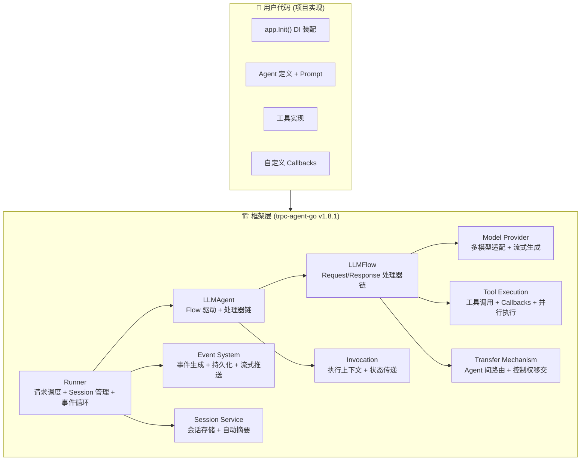
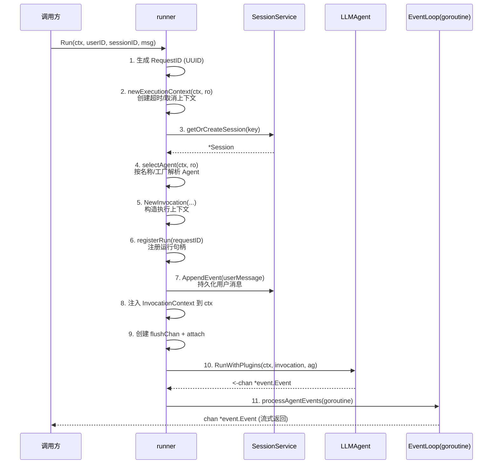
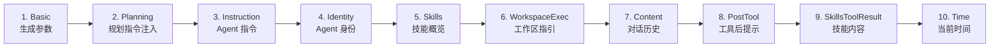
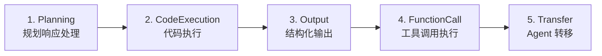
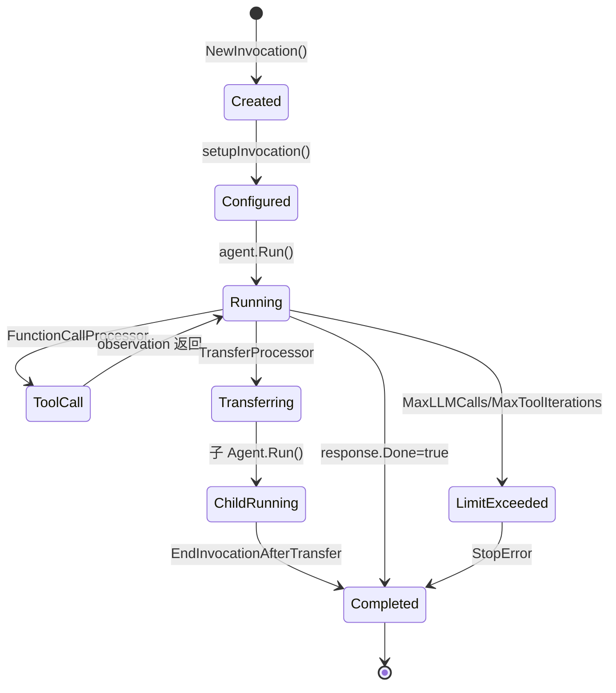
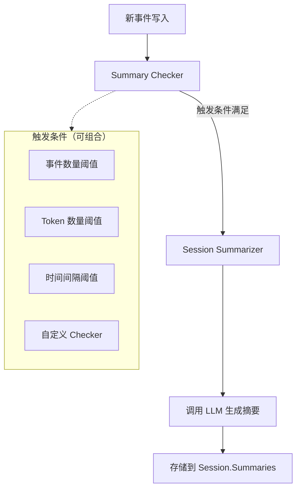
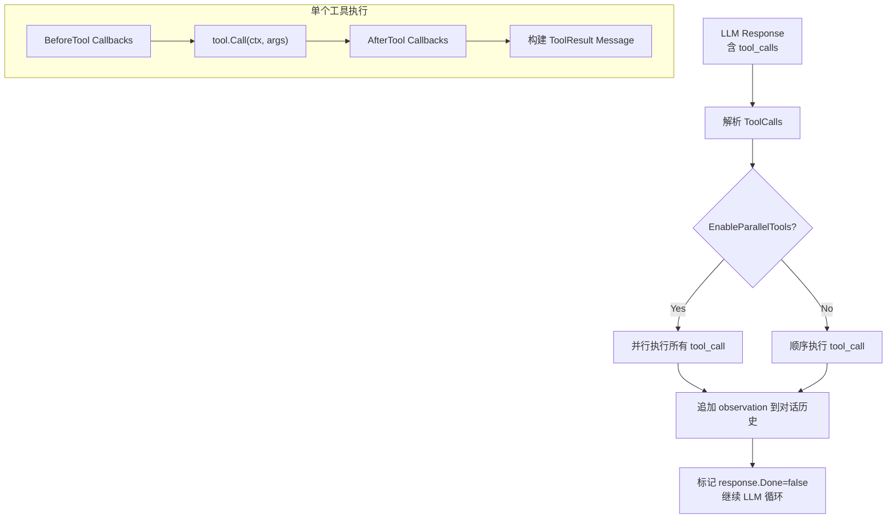
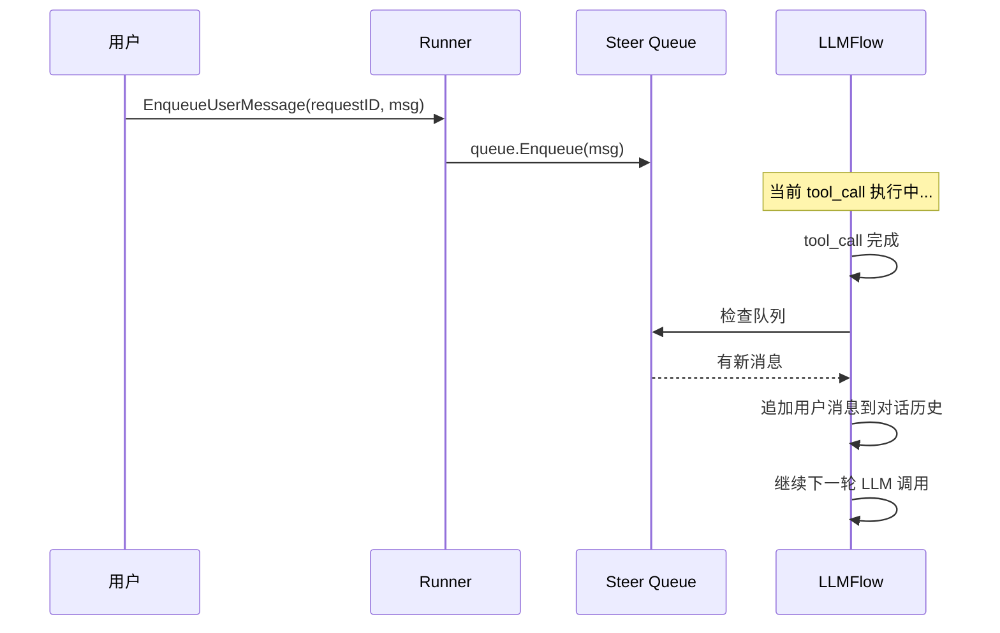

# 16 — 框架核心流程深度解析

> 覆盖范围：`trpc-agent-go v1.8.1` 框架在核心请求链路中完成的所有关键机制  
> 目标：深入解析框架层面的 Runner 调度、LLMAgent 执行循环、Invocation 生命周期、Event 事件系统、Session 管理、Transfer 机制、Tool Callbacks、Model Provider、Planner 处理器链、Session Summary 等  
> 配套阅读：[02-Agent编排层.md](02-Agent编排层.md)、[09-会话与异步.md](09-会话与异步.md)

---

## 一、框架整体架构分层



---

## 二、Runner 调度引擎

### 2.1 Runner 接口体系

框架定义了三级 Runner 接口，逐层增强能力：

```go
// 基础 Runner：执行 Agent 并返回事件流
type Runner interface {
    Run(ctx, userID, sessionID, message, ...runOpts) (<-chan *event.Event, error)
    Close() error
}

// ManagedRunner：增加运行控制（取消、状态查询）
type ManagedRunner interface {
    Runner
    Cancel(requestID string) bool
    RunStatus(requestID string) (RunStatus, bool)
}

// SteerableRunner：增加安全边界用户消息注入
type SteerableRunner interface {
    ManagedRunner
    EnqueueUserMessage(requestID string, message model.Message) error
}
```

### 2.2 Runner.Run 完整流程



### 2.3 执行上下文创建

```go
func (r *runner) newExecutionContext(ctx, ro) (context.Context, context.CancelFunc) {
    // 1. 计算有效超时：取 ro.MaxRunDuration 和 ctx.Deadline 的较小值
    // 2. CloneContext：复制 ctx 的 values 但不继承 cancel
    // 3. 如果 ro.DetachedCancel：使用 context.WithoutCancel 解耦父取消
    // 4. 返回带超时/取消的新 context
}
```

**关键设计**：
- `CloneContext` 确保 Agent 执行不受调用方 context 取消的意外影响
- `DetachedCancel` 模式允许长时间运行的任务独立于 HTTP 请求生命周期
- 超时优先级：`min(MaxRunDuration, ctx.Deadline)`

### 2.4 事件循环（Event Loop）

Runner 启动一个独立 goroutine 驱动事件循环：

```go
func (r *runner) runEventLoop(ctx context.Context, loop *eventLoopContext) {
    defer func() {
        // panic 恢复 + 资源清理
        steer.Close(loop.invocation)
        r.safeEmitRunnerCompletion(ctx, loop)  // 发送最终完成事件
        flush.Clear(loop.invocation)
        appender.Clear(loop.invocation)
        r.unregisterRun(requestID)
        close(loop.processedEventCh)           // 关闭输出通道
    }()

    for {
        select {
        case agentEvent, ok := <-loop.agentEventCh:
            if !ok { return }  // Agent 完成
            r.processSingleAgentEvent(ctx, loop, agentEvent)
        case req, ok := <-loop.flushChan:
            if !ok { loop.flushChan = nil; continue }
            r.handleFlushRequest(ctx, loop, req)
        case <-ctx.Done():
            return  // 超时/取消
        }
    }
}
```

**单事件处理流程**：
1. 应用 Event Plugins（过滤/修改/拦截）
2. 检测 Graph Completion 快照事件
3. StreamMode 过滤（决定是否转发给调用方）
4. 持久化到 Session（AppendEvent）
5. 触发 Summary 检查
6. 转发到输出通道

### 2.5 运行控制

| 能力 | 实现方式 |
|------|---------|
| **取消** | `Cancel(requestID)` → 查找 runHandle → 调用 `cancel()` → ctx.Done 传播 |
| **状态查询** | `RunStatus(requestID)` → 返回 `{RequestID, AgentName, StartedAt, EventCount}` |
| **用户消息注入** | `EnqueueUserMessage` → steer.Queue → 在 tool_call 边界后注入 |
| **并发保护** | `sync.RWMutex` 保护 runs map，同一 requestID 不可重复注册 |

---

## 三、LLMAgent 执行引擎

### 3.1 LLMAgent 结构

```go
type LLMAgent struct {
    name         string
    model        model.Model           // 当前使用的 LLM
    models       map[string]model.Model // 多模型注册表（支持运行时切换）
    instruction  prompt.Text           // Agent 指令
    systemPrompt prompt.Text           // 全局系统提示
    genConfig    model.GenerationConfig // 生成参数
    flow         flow.Flow             // LLMFlow（核心执行引擎）
    tools        []tool.Tool           // 所有工具（用户 + 框架内置）
    planner      planner.Planner       // 规划器（可选）
    subAgents    []agent.Agent         // 子 Agent 列表
    agentCallbacks *agent.Callbacks    // Agent 级回调
    // ... 更多字段
}
```

### 3.2 LLMAgent.Run 执行流程

```go
func (a *LLMAgent) Run(ctx, invocation) (<-chan *event.Event, error) {
    // 1. setupInvocation：设置 Model、MaxLLMCalls、MaxToolIterations
    a.setupInvocation(invocation)

    // 2. 启动 OTel Span
    ctx, span := itrace.StartSpan(ctx, invocation, "agent "+a.name)

    // 3. 执行 Agent 级 BeforeAgent 回调
    result, err := a.agentCallbacks.RunBeforeAgent(ctx, &BeforeAgentArgs{...})
    // 如果回调返回 CustomResponse → 跳过执行直接返回

    // 4. 委托给 Flow 执行
    eventCh, err := a.flow.Run(ctx, invocation)

    // 5. 包装 AfterAgent 回调到事件流
    return wrapAfterAgentCallbacks(ctx, invocation, callbacks, eventCh), nil
}
```

### 3.3 Request 处理器链（10 级流水线）

LLMAgent 构造时按固定顺序组装 Request 处理器，每次调用 LLM 前依次执行：



| # | 处理器 | 职责 | 关键配置 |
|---|--------|------|---------|
| 1 | **BasicRequestProcessor** | 设置 temperature/top_p/max_tokens 等生成参数 | `GenerationConfig` |
| 2 | **PlanningRequestProcessor** | 调用 Planner.BuildPlanningInstruction 注入规划指令 | `Planner` 接口 |
| 3 | **InstructionRequestProcessor** | 注入 Agent instruction + system prompt + output schema | `Instruction`, `GlobalInstruction` |
| 4 | **IdentityRequestProcessor** | 注入 Agent 名称和描述到系统消息 | `Name`, `Description` |
| 5 | **SkillsRequestProcessor** | 注入可用技能列表和已加载技能内容 | `SkillsRepository` |
| 6 | **WorkspaceExecRequestProcessor** | 注入工作区执行器指引 | `CodeExecutor` |
| 7 | **ContentRequestProcessor** | 构建对话历史（含 Summary、Memory、Few-shot） | `MaxHistoryRuns`, `ContextCompaction` |
| 8 | **PostToolRequestProcessor** | 在工具结果后注入动态提示 | `PostToolPrompt` |
| 9 | **SkillsToolResultRequestProcessor** | 将技能加载内容物化为工具结果消息 | `SkillLoadMode` |
| 10 | **TimeRequestProcessor** | 注入当前时间信息（放最后避免缓存失效） | `AddCurrentTime`, `Timezone` |

### 3.4 Response 处理器链

LLM 返回后，按顺序执行 Response 处理器：



| # | 处理器 | 职责 |
|---|--------|------|
| 1 | **PlanningResponseProcessor** | 调用 Planner.ProcessPlanningResponse 处理规划标签 |
| 2 | **CodeExecutionResponseProcessor** | 检测代码块并执行 |
| 3 | **OutputResponseProcessor** | 验证结构化输出 schema |
| 4 | **FunctionCallResponseProcessor** | **核心**：解析 tool_call → 执行工具 → 返回 observation |
| 5 | **TransferResponseProcessor** | 检测 TransferInfo → 执行 Agent 转移 |

### 3.5 LLMFlow 主循环

```
while not done:
    1. 执行所有 RequestProcessors → 构建 model.Request
    2. 调用 model.Generate(ctx, request) → 获取 model.Response
    3. 依次执行 ResponseProcessors：
       - 如果 FunctionCallProcessor 检测到 tool_call：
         a. 执行 BeforeTool callbacks
         b. 调用 tool.Call(ctx, args)
         c. 执行 AfterTool callbacks
         d. 将 observation 追加到对话历史
         e. 标记 response.Done = false → 继续循环
       - 如果 TransferProcessor 检测到 TransferInfo：
         a. 查找目标 Agent
         b. Clone Invocation
         c. 递归调用目标 Agent.Run
         d. 如果 EndInvocationAfterTransfer → 标记结束
    4. 如果 response.Done = true → 退出循环
    5. 检查 MaxLLMCalls / MaxToolIterations 限制
```

---

## 四、Invocation 执行上下文

### 4.1 核心字段

```go
type Invocation struct {
    Agent            Agent              // 当前执行的 Agent
    AgentName        string             // Agent 名称
    InvocationID     string             // 唯一执行 ID (UUID)
    Branch           string             // 执行链路径（如 "coordinator/diagnosis"）
    EndInvocation    bool               // 是否结束当前调用
    Session          *session.Session   // 关联的会话
    SessionService   session.Service    // 会话服务
    Model            model.Model        // 使用的模型
    Message          model.Message      // 用户消息
    RunOptions       RunOptions         // 运行选项
    TransferInfo     *TransferInfo      // 待执行的转移信息
    Plugins          PluginManager      // 插件管理器
    StructuredOutput *model.StructuredOutput // 结构化输出配置
    MemoryService    memory.Service     // 记忆服务
    ArtifactService  artifact.Service   // 制品服务

    // 内部状态
    MaxLLMCalls       int  // LLM 调用次数上限
    MaxToolIterations int  // 工具迭代次数上限
    llmCallCount      int  // 当前 LLM 调用计数
    toolIterationCount int // 当前工具迭代计数
    state             map[string]any  // 调用级状态存储
    noticeChannels    map[string]chan any // 事件通知通道
}
```

### 4.2 Invocation 生命周期



### 4.3 Branch 机制

Branch 记录 Agent 执行链路，用于多 Agent 场景的事件过滤和追踪：

```
Coordinator 执行时：Branch = "coordinator"
Transfer 到 Diagnosis：Branch = "coordinator/diagnosis"
Diagnosis 再 Transfer 到 Knowledge：Branch = "coordinator/diagnosis/knowledge"
```

**用途**：
- 事件过滤：`eventFilterKey` 基于 Branch 过滤子 Agent 事件
- 可观测性：Trace 中记录完整执行路径
- Session 摘要：按 Branch 分别摘要

### 4.4 状态存储（Invocation State）

```go
// 设置状态
invocation.SetState("key", value)

// 获取状态
value, ok := invocation.GetState("key")
```

框架内部使用的保留 key：
| Key | 用途 |
|-----|------|
| `__flush_session__` | Session flush 通道 |
| `__graph_barrier__` | Graph 执行屏障标记 |
| `__append_event__` | 事件追加器 |
| `__graph_stream_hub__` | 流式 Hub |
| `__sync_summary_intra_run__` | 同步摘要标记 |

---

## 五、Event 事件系统

### 5.1 Event 结构

```go
type Event struct {
    *model.Response                    // 嵌入 LLM 响应
    RequestID          string          // 请求 ID
    InvocationID       string          // 调用 ID
    ParentInvocationID string          // 父调用 ID
    Author             string          // 事件作者（Agent 名称 / "user"）
    ID                 string          // 事件唯一 ID (UUID)
    Timestamp          time.Time       // 时间戳
    Branch             string          // 执行链路径
    Tag                string          // 业务标签（分号分隔）
    RequiresCompletion bool            // 是否需要完成信号
    LongRunningToolIDs map[string]struct{} // 长时间运行的工具 ID
    StateDelta         map[string][]byte   // 状态变更增量
    Extensions         map[string]json.RawMessage // 扩展元数据
    StructuredOutput   any             // 结构化输出（内存态）
    ExecutionTrace     *trace.Trace    // 执行追踪（内存态）
    Actions            *EventActions   // 流控提示
    FilterKey          string          // 层级过滤键
    Version            int             // 事件格式版本
}
```

### 5.2 事件类型

| 工厂方法 | 事件类型 | 用途 |
|---------|---------|------|
| `NewResponseEvent` | 响应事件 | LLM 生成的文本/工具调用 |
| `NewErrorEvent` | 错误事件 | 执行错误 |
| `NewToolCallEvent` | 工具调用事件 | 记录工具调用请求 |
| `NewToolResultEvent` | 工具结果事件 | 记录工具返回 |

### 5.3 事件流转路径

```mermaid
flowchart LR
    LLM["LLM 生成"] --> Flow["LLMFlow"]
    Flow --> AgentCh["Agent Event Channel"]
    AgentCh --> Runner["Runner Event Loop"]
    Runner --> Plugins["Event Plugins"]
    Plugins --> Persist["Session 持久化"]
    Persist --> Summary["Summary 检查"]
    Summary --> Filter["StreamMode 过滤"]
    Filter --> Output["输出 Channel"]
    Output --> SSE["SSE/A2A 推送"]
```



### 5.4 事件持久化策略

Runner 对每个事件执行持久化判断：
- **用户消息**：在 Run 开始时立即持久化
- **Assistant 响应**：非 partial 的完整响应持久化
- **工具调用/结果**：全部持久化（用于 replay）
- **错误事件**：持久化（用于审计）
- **Graph Completion**：不持久化（仅用于流控）

---

## 六、Session 管理

### 6.1 Session 结构

```go
type Session struct {
    ID        string                 // 会话 ID
    AppName   string                 // 应用名
    UserID    string                 // 用户 ID
    State     StateMap               // 状态存储 (map[string][]byte)
    Events    []event.Event          // 事件历史
    Tracks    map[Track]*TrackEvents // 追踪事件
    Summaries map[string]*Summary    // 分层摘要
    UpdatedAt time.Time              // 最后更新时间
    CreatedAt time.Time              // 创建时间
    Hash      int                    // 分片哈希（用于异步任务分发）
}
```

### 6.2 Session Service 接口

```go
type Service interface {
    CreateSession(ctx, key, state) (*Session, error)
    GetSession(ctx, key) (*Session, error)
    ListSessions(ctx, appName, userID) ([]*Session, error)
    DeleteSession(ctx, key) error
    AppendEvent(ctx, session, event) error
    Close() error
}
```

框架提供两种实现：
- **InMemory**：开发/测试用，进程内存储
- **Redis**（需外部包）：生产用，支持持久化和分布式

### 6.3 自动摘要机制



**Checker 类型**：
- `CheckEventCount(n)`：事件数超过 n 时触发
- `CheckTokenThreshold(n)`：对话 token 数超过 n 时触发
- `CheckTimeDelta(d)`：距上次摘要超过 d 时间时触发
- 支持 `SetChecksAll`（AND）和 `SetChecksAny`（OR）组合

**摘要流程**：
1. `filterDeltaEvents`：只摘要上次摘要后的新事件
2. 格式化对话文本（含工具调用/结果格式化）
3. 调用 LLM 生成摘要（使用专用 prompt 模板）
4. 存储到 `Session.Summaries[filterKey]`
5. 更新 `lastIncludedTsKey` 状态

### 6.4 Context Compaction（上下文压缩）

当启用 `EnableContextCompaction` 时，ContentRequestProcessor 会：
1. 计算当前上下文 token 数
2. 如果超过 `ContextCompactionThresholdRatio`（如 80%）
3. 对旧的工具结果进行截断（`ContextCompactionToolResultMaxTokens`）
4. 保留最近 N 轮请求完整（`ContextCompactionKeepRecentRequests`）

---

## 七、Transfer 机制（Agent 间路由）

### 7.1 Transfer 工具

框架自动为有 SubAgents 的 Agent 注册 `transfer_to_agent` 工具：

```go
// tool/transfer/transfer_tool.go
type Tool struct {
    availableAgents []agent.Info  // 可转移的目标 Agent 列表
}

func (t *Tool) Call(ctx, jsonArgs) (any, error) {
    // 1. 解析请求：{agent_name, message}
    // 2. 验证目标 Agent 存在
    // 3. 从 ctx 获取 Invocation
    // 4. 设置 invocation.TransferInfo = &TransferInfo{TargetAgentName, Message}
    // 5. 返回成功响应（实际转移由 TransferResponseProcessor 执行）
}
```

### 7.2 TransferResponseProcessor

```go
// 在 FunctionCallResponseProcessor 之后执行
func (p *TransferResponseProcessor) Process(ctx, invocation, response) {
    if invocation.TransferInfo == nil {
        return  // 无转移请求
    }

    // 1. 查找目标 Agent
    targetAgent := invocation.Agent.FindSubAgent(transferInfo.TargetAgentName)

    // 2. Clone Invocation（继承 Session 但重置计数器）
    childInvocation := invocation.Clone()
    childInvocation.Agent = targetAgent
    childInvocation.Branch = invocation.Branch + "/" + targetAgent.Name

    // 3. 执行 TransferController（如果配置了）
    if controller != nil {
        timeout, err := controller.OnTransfer(ctx, fromAgent, toAgent)
        // 可以拒绝转移或设置超时
    }

    // 4. 递归调用目标 Agent
    eventCh, err := RunWithPlugins(ctx, childInvocation, targetAgent)

    // 5. 如果 EndInvocationAfterTransfer：标记当前 Invocation 结束
    if p.endAfterTransfer {
        invocation.EndInvocation = true
    }
}
```

### 7.3 TransferController

```go
type TransferController interface {
    OnTransfer(ctx, fromAgent, toAgent string) (targetTimeout time.Duration, err error)
}
```

**用途**：
- 限制转移深度（防止 A→B→A 死循环）
- 为目标 Agent 设置独立超时
- 基于策略拒绝特定转移

### 7.4 EndInvocationAfterTransfer

```go
// 项目中的使用
llmagent.New("coordinator",
    llmagent.WithEndInvocationAfterTransfer(true),  // Transfer 后立即结束
    llmagent.WithSubAgents(diagnosis, repair, knowledge, file),
)
```

**效果**：Coordinator Transfer 给子 Agent 后，自己的 LLMFlow 循环立即退出，不会继续生成内容。这是防止 multi-agent 死循环的关键机制。

---

## 八、Tool 执行机制

### 8.1 Tool 接口体系

```go
// 基础工具（只有声明）
type Tool interface {
    Declaration() *Declaration
}

// 可调用工具
type CallableTool interface {
    Tool
    Call(ctx context.Context, jsonArgs []byte) (any, error)
}

// 流式工具
type StreamableTool interface {
    Tool
    StreamableCall(ctx context.Context, jsonArgs []byte) (*StreamReader, error)
}
```

### 8.2 FunctionCallResponseProcessor 执行流程



### 8.3 Tool Callbacks（工具回调）

框架提供两级工具回调：

```go
// BeforeToolCallbackStructured：工具执行前
type BeforeToolCallbackStructured = func(ctx, *BeforeToolArgs) (*BeforeToolResult, error)

// BeforeToolArgs 包含：
type BeforeToolArgs struct {
    ToolCallID  string        // 模型生成的调用 ID
    ToolName    string        // 工具名称
    Declaration *Declaration  // 工具声明
    Arguments   []byte        // JSON 参数（可修改）
    ResumeValue any           // 恢复值（HITL 场景）
    ResumeMap   map[string]any // 恢复映射
}

// BeforeToolResult 可以：
type BeforeToolResult struct {
    Context           context.Context // 替换后续 context
    CustomResult      any             // 跳过执行，直接返回此结果
    ModifiedArguments []byte          // 修改参数后再执行
}
```

**项目中的应用**：
- `SafetyGuard`：在 BeforeTool 中拦截高危操作
- `HITL`：在 BeforeTool 中检查 `confirmed` 参数，未确认则返回 Plan

### 8.4 并行工具执行

当 `EnableParallelTools=true` 且 LLM 返回多个 tool_call 时：
1. 为每个 tool_call 启动独立 goroutine
2. 使用 `sync.WaitGroup` 等待全部完成
3. 按原始顺序收集结果
4. 一次性追加所有 observation

---

## 九、Model Provider 多模型适配

### 9.1 Provider 注册机制

```go
// 框架内置注册 5 种 Provider
func init() {
    Register("openai", openaiProvider)      // OpenAI 兼容（含 DeepSeek/混元）
    Register("anthropic", anthropicProvider) // Anthropic Claude
    Register("gemini", geminiProvider)       // Google Gemini
    Register("ollama", ollamaProvider)       // Ollama 本地
    Register("hunyuan", hunyuanProvider)     // 腾讯混元
}

// 使用
model, err := provider.Model("openai", "gpt-4o",
    provider.WithBaseURL("https://api.deepseek.com/v1"),
    provider.WithAPIKey(apiKey),
)
```

### 9.2 Model 接口

```go
type Model interface {
    // Generate 执行 LLM 推理，返回流式 Response channel
    Generate(ctx context.Context, request *Request) <-chan *Response
}
```

所有 Provider 统一实现此接口，框架层无需关心底层差异。

### 9.3 流式生成

所有 Provider 都返回 `<-chan *Response`，支持逐 chunk 流式输出：
- 每个 chunk 的 `Response.IsPartial = true`
- 最后一个 chunk 的 `Response.Done = true`
- 框架的 LLMFlow 消费 channel 并逐步构建完整响应

### 9.4 Token Tailoring（Token 裁剪）

当启用 `EnableTokenTailoring` 时，Provider 层自动：
1. 计算输入 token 数
2. 如果超过 `MaxInputTokens`，执行裁剪策略
3. 支持自定义 `TailoringStrategy`

---

## 十、Planner 规划器

### 10.1 Planner 接口

```go
type Planner interface {
    // 构建规划指令（注入到系统消息）
    BuildPlanningInstruction(ctx, invocation, llmRequest) string

    // 处理规划响应（过滤/修正 LLM 输出）
    ProcessPlanningResponse(ctx, invocation, response) *model.Response
}
```

### 10.2 框架内置 React Planner

框架提供英文版 React Planner（`planner/react`），使用以下标签：

```
/*PLANNING*/    - 规划阶段
/*REASONING*/   - 推理阶段
/*ACTION*/      - 行动阶段
/*REPLANNING*/  - 重新规划
/*FINAL_ANSWER*/ - 最终答案
```

**ProcessPlanningResponse 的关键逻辑**：
1. 过滤空名称的 tool_call
2. 检测"意图描述"（如 "I will..."）但无实际 tool_call → 标记 `Done=false` 继续循环
3. 检测空的 `FINAL_ANSWER` 标签 → 标记 `Done=false` 继续循环
4. 防止模型在中间状态提前终止

### 10.3 项目自定义 React Planner

项目在框架 Planner 接口基础上实现了中文版：

```go
// src/agents/react.go
const (
    PlanningTag    = "\n***规划***\n"
    ReasoningTag   = "\n***推理***\n"
    ActionTag      = "\n***行动***\n"
    FinalAnswerTag = "\n***最终答案***\n"
)
```

**与框架版的差异**：
| 维度 | 框架版 | 项目版 |
|------|--------|--------|
| 语言 | 英文标签 | 中文标签 |
| 标签格式 | `/*TAG*/` | `\n***标签***\n` |
| Few-shot | 通用示例 | 运维场景示例 |
| 终止检测 | 通用模式 | 适配中文输出模式 |

---

## 十一、Plugin 系统

### 11.1 RunWithPlugins 执行流程

```go
func RunWithPlugins(ctx, invocation, ag) (<-chan *event.Event, error) {
    callbacks := invocation.Plugins.AgentCallbacks()
    if callbacks == nil {
        return ag.Run(ctx, invocation)  // 无插件直接执行
    }

    // 1. 执行 BeforeAgent 回调链
    result, err := callbacks.RunBeforeAgent(ctx, &BeforeAgentArgs{...})
    if result.CustomResponse != nil {
        return singleResponseEventChan(result.CustomResponse)  // 短路返回
    }

    // 2. 执行 Agent
    original, err := ag.Run(ctx, invocation)

    // 3. 包装 AfterAgent 回调到事件流
    return wrapAfterAgentCallbacks(ctx, invocation, callbacks, original), nil
}
```

### 11.2 Callbacks 执行策略

```go
type Callbacks struct {
    BeforeAgent     []BeforeAgentCallbackStructured
    AfterAgent      []AfterAgentCallbackStructured
    continueOnError    bool  // 错误时是否继续执行后续回调
    continueOnResponse bool  // 有 CustomResponse 时是否继续
}
```

**执行规则**：
- 默认：遇到第一个错误或 CustomResponse 立即停止
- `continueOnError=true`：收集所有错误，返回第一个
- `continueOnResponse=true`：所有回调都执行，使用最后一个 CustomResponse
- Panic 恢复：每个回调都有 `defer recover()`，panic 转为 error

---

## 十二、Steer 机制（用户消息注入）

### 12.1 设计目的

在 Agent 执行过程中，用户可能发送新消息。Steer 机制允许在**安全边界**（tool_call 完成后、下一次 LLM 调用前）注入用户消息。

### 12.2 工作流程



### 12.3 安全边界

消息注入只在以下时机发生：
- tool_call 执行完毕后
- 下一次 model.Generate 调用前
- **不会**在 LLM 生成过程中注入

---

## 十三、框架 vs 项目实现对照表

| 核心能力 | 框架完成 | 项目自定义 |
|---------|---------|-----------|
| **Runner 调度** | ✅ 完整实现（Session 管理、事件循环、运行控制） | 配置 Agent 注册 |
| **LLMAgent 执行** | ✅ Flow 驱动 + 处理器链 | 配置 Planner/Tools/SubAgents |
| **Invocation 管理** | ✅ 生命周期、状态、Branch | 通过 State 传递业务数据 |
| **Event 系统** | ✅ 生成、持久化、流式推送 | Event Plugins 过滤 |
| **Session 存储** | ✅ InMemory/Redis + 自动摘要 | 配置摘要参数 |
| **Transfer 机制** | ✅ transfer_to_agent 工具 + TransferResponseProcessor | 配置 SubAgents + EndAfterTransfer |
| **Tool 执行** | ✅ 解析 tool_call + 调用 + 并行 | 实现具体工具 + Callbacks |
| **Model Provider** | ✅ 5 种 Provider 适配 | 配置 Provider + BaseURL + APIKey |
| **Planner** | ✅ 接口 + 英文 React Planner | 中文化 React Planner |
| **Tool Callbacks** | ✅ Before/After 回调链 + Panic 恢复 | SafetyGuard/HITL 拦截 |
| **Context Compaction** | ✅ 自动裁剪旧工具结果 | 配置阈值参数 |
| **Steer 消息注入** | ✅ 安全边界注入 | 未使用 |
| **TransferController** | ✅ 接口定义 | 未使用（通过 Prompt 控制） |

---

## 十四、常见面试问题与框架层答案

### Q1：一个用户请求从进入到返回，框架层做了哪些事？

> **完整链路**：
> 1. Runner.Run 接收请求 → 生成 RequestID → 创建执行 Context（含超时）
> 2. 获取/创建 Session → 持久化用户消息
> 3. 选择 Agent（按名称/工厂） → 构造 Invocation
> 4. 注册运行句柄（支持取消/状态查询）
> 5. RunWithPlugins → BeforeAgent 回调 → Agent.Run
> 6. LLMAgent.Run → setupInvocation → 委托 LLMFlow
> 7. LLMFlow 循环：RequestProcessors → model.Generate → ResponseProcessors
> 8. 如果有 tool_call → BeforeTool → tool.Call → AfterTool → 继续循环
> 9. 如果有 Transfer → 查找子 Agent → Clone Invocation → 递归执行
> 10. 事件通过 channel 流回 Runner Event Loop
> 11. Event Loop：应用 Plugins → 持久化 → Summary 检查 → StreamMode 过滤 → 输出
> 12. 最终发送 RunnerCompletion 事件 → 清理资源 → 关闭 channel

### Q2：框架如何防止 Agent 无限循环？

> **四层防护**：
> 1. `MaxLLMCalls`：限制单次 Invocation 的 LLM 调用次数
> 2. `MaxToolIterations`：限制工具调用迭代次数
> 3. `MaxRunDuration`：全局超时（context.WithTimeout）
> 4. `EndInvocationAfterTransfer`：Transfer 后立即结束，防止 A→B→A 循环

### Q3：框架的 Session 摘要是怎么触发的？

> **触发机制**：
> 1. 每次 AppendEvent 后，Runner 调用 Summary Checker
> 2. Checker 支持多种条件组合（事件数/Token 数/时间间隔）
> 3. 条件满足时，异步调用 LLM 生成摘要
> 4. 摘要存储在 `Session.Summaries` 中，按 filterKey 分层
> 5. 下次构建对话历史时，ContentRequestProcessor 用摘要替代旧事件

### Q4：Transfer 机制的完整流程是什么？

> 1. LLM 输出 `tool_call: transfer_to_agent({agent_name: "diagnosis"})`
> 2. FunctionCallResponseProcessor 执行 transfer_tool.Call
> 3. Call 内部设置 `invocation.TransferInfo = {TargetAgentName: "diagnosis"}`
> 4. TransferResponseProcessor 检测到 TransferInfo
> 5. 查找目标 Agent → Clone Invocation（继承 Session，重置计数器）
> 6. 设置 Branch = "coordinator/diagnosis"
> 7. 递归调用 `RunWithPlugins(ctx, childInvocation, targetAgent)`
> 8. 如果 `EndInvocationAfterTransfer=true`：设置 `invocation.EndInvocation=true`
> 9. 当前 Agent 的 LLMFlow 循环检测到 EndInvocation → 退出

### Q5：工具回调（Tool Callbacks）在什么时机执行？

> **执行时序**：
> ```
> LLM 返回 tool_call
>   → FunctionCallResponseProcessor
>     → BeforeTool Callbacks（可修改参数/短路返回/注入 context）
>       → tool.Call(ctx, args)
>         → AfterTool Callbacks（可替换结果/记录审计）
>           → 构建 observation message
> ```
>
> **项目中的应用**：
> - BeforeTool：SafetyGuard 拦截高危操作、HITL 检查确认状态
> - AfterTool：审计记录、结果格式化

### Q6：框架如何处理 LLM 流式输出？

> 1. Model.Generate 返回 `<-chan *Response`
> 2. LLMFlow 消费 channel，逐 chunk 处理
> 3. 每个 partial chunk 通过 Event 发送到 Runner
> 4. Runner Event Loop 根据 StreamMode 决定是否转发
> 5. 最终 `Done=true` 的 Response 触发 ResponseProcessors 链
> 6. 如果检测到 tool_call → 执行工具 → 继续循环

### Q7：Context Compaction 是怎么工作的？

> 1. ContentRequestProcessor 在构建对话历史时计算 token 数
> 2. 如果超过 `ContextCompactionThresholdRatio`（如 80% 窗口）
> 3. 对旧的工具结果进行截断（保留前 N token）
> 4. 保留最近 K 轮请求完整不压缩
> 5. 超大工具结果（如长日志）单独限制为 `OversizedToolResultMaxTokens`

### Q8：框架的 Steer 机制解决什么问题？

> **问题**：Agent 正在执行工具调用时，用户发来新消息，如何安全注入？
>
> **解决**：
> 1. 新消息通过 `EnqueueUserMessage` 放入 Steer Queue
> 2. LLMFlow 在每次 tool_call 完成后检查队列
> 3. 如果有新消息，追加到对话历史
> 4. 下一轮 LLM 调用会看到新消息
> 5. **不会**在 LLM 生成过程中或工具执行过程中注入

---

## 十五、框架关键设计模式总结

| 设计模式 | 框架中的体现 |
|---------|------------|
| **处理器链（Pipeline）** | Request/Response Processors 按序执行 |
| **观察者（Observer）** | Event Channel + Event Plugins |
| **策略（Strategy）** | Planner 接口、TailoringStrategy、Checker |
| **工厂（Factory）** | AgentFactory、Provider 注册表 |
| **装饰器（Decorator）** | wrapAfterAgentCallbacks、RunWithPlugins |
| **命令（Command）** | Tool.Call 统一接口 |
| **中介者（Mediator）** | Runner 协调 Agent/Session/Event |
| **状态机（State Machine）** | Invocation 生命周期、Event Loop |
| **模板方法（Template Method）** | LLMFlow 主循环固定，处理器可插拔 |
