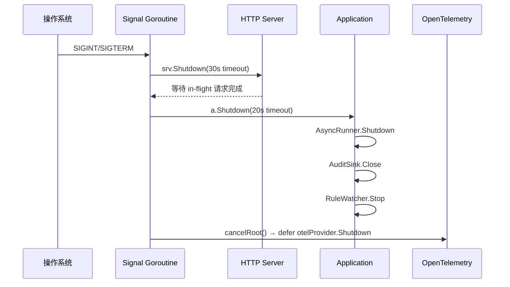
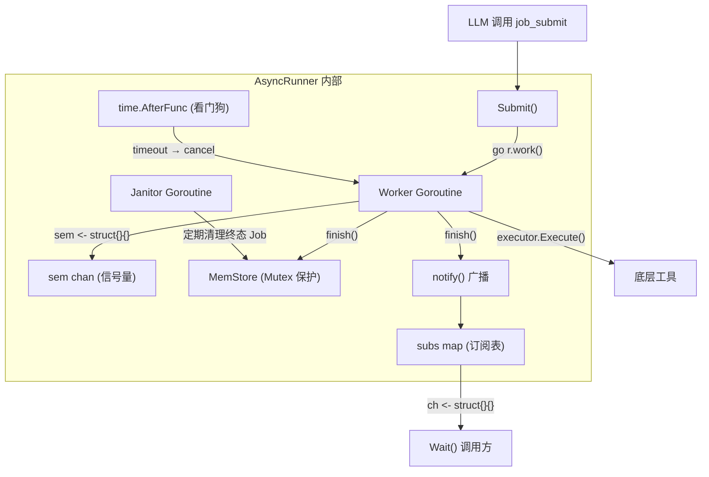
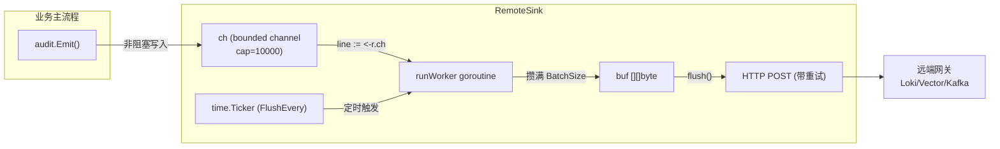

# 17 — Go 并发特性原理与项目实战详解

> 覆盖范围：Goroutine、Channel、Signal、Context、sync 原语在本项目中的系统性运用  
> 目标：先讲清 Go 并发原语的底层原理，再逐模块剖析项目如何利用这些特性实现具体功能  
> 配套阅读：[09-会话与异步.md](09-会话与异步.md)、[16-框架核心流程深度解析.md](16-框架核心流程深度解析.md)

---

## 一、Go 并发特性原理

### 1.1 Goroutine（协程）

**底层原理**：Goroutine 是 Go 运行时管理的轻量级用户态线程，基于 **GMP 调度模型**：

- **G**（Goroutine）：用户态协程，初始栈仅 2-8KB，可动态增长到 GB 级
- **M**（Machine）：OS 线程，真正执行代码的载体
- **P**（Processor）：逻辑处理器，持有本地运行队列，数量默认等于 CPU 核数

```
┌─────────────────────────────────────────────┐
│              Go Runtime Scheduler            │
├─────────────────────────────────────────────┤
│  Global Queue: [G5, G6, G7, ...]            │
│                                             │
│  P0 ─── M0 ─── [G1 running]                │
│  │      Local Queue: [G2, G3]               │
│  │                                          │
│  P1 ─── M1 ─── [G4 running]                │
│  │      Local Queue: [G8, G9]               │
│  │                                          │
│  P2 ─── (idle, waiting for G)               │
└─────────────────────────────────────────────┘
```

**关键特性**：
- **M:N 调度**：M 个 goroutine 映射到 N 个 OS 线程，切换成本 ~200ns（vs 线程切换 ~1-10µs）
- **协作式 + 信号抢占**（Go 1.14+）：函数调用点检查抢占标志 + 异步信号强制抢占
- **Work Stealing**：空闲 P 从其他 P 的本地队列偷取 G，保证负载均衡

```go
go func() {
    // 并发执行的代码，成本极低（~几百纳秒创建）
}()
```

### 1.2 Channel（通道）

**底层原理**：Channel 是 goroutine 间类型安全的通信管道，遵循 **CSP（Communicating Sequential Processes）** 模型。内部结构包含：

- **环形缓冲区**（buffered channel）：`buf` 数组 + `sendx`/`recvx` 游标
- **等待队列**：`sendq`（发送者等待队列）和 `recvq`（接收者等待队列）
- **互斥锁**：保护内部状态

```
┌──────────────────────────────────────┐
│           Channel (hchan)            │
├──────────────────────────────────────┤
│  buf: [elem0, elem1, ..., elemN-1]   │  ← 环形缓冲区
│  sendx: 2    recvx: 0               │  ← 读写游标
│  qcount: 2   dataqsiz: N            │
│  sendq: [G3 → G5 → ...]             │  ← 阻塞的发送者
│  recvq: [G7 → ...]                  │  ← 阻塞的接收者
│  lock: mutex                         │
└──────────────────────────────────────┘
```

**核心语义**：

| 操作 | 无缓冲 `make(chan T)` | 有缓冲 `make(chan T, N)` |
|------|----------------------|--------------------------|
| 发送 `ch <- v` | 阻塞直到有接收者 | 缓冲满时阻塞 |
| 接收 `v := <-ch` | 阻塞直到有发送者 | 缓冲空时阻塞 |
| `close(ch)` | 后续接收返回零值 | 先排空缓冲再返回零值 |
| 向已关闭 channel 发送 | **panic** | **panic** |

**经典模式**：
- **信号量**：`make(chan struct{}, N)` 做并发控制（N 为最大并发数）
- **Done 信号**：`close(ch)` 广播退出通知（所有 `<-ch` 立即返回）
- **扇出/扇入**：多 goroutine 写同一 channel，一个 goroutine 汇总
- **Pipeline**：多级 channel 串联形成数据处理流水线

### 1.3 select 多路复用

**底层原理**：`select` 编译为 `runtime.selectgo`，内部对所有 case 的 channel 加锁后检查就绪状态：

1. 随机打乱 case 顺序（避免饥饿）
2. 遍历所有 case，找到就绪的立即执行
3. 多个就绪时**随机选择**一个（公平性保证）
4. 无就绪 + 有 `default` → 执行 default（非阻塞）
5. 无就绪 + 无 `default` → 当前 G 挂到所有 channel 的等待队列，阻塞

```go
select {
case msg := <-ch1:       // ch1 有数据可读
case ch2 <- data:        // ch2 可写入
case <-time.After(5*s):  // 超时
case <-ctx.Done():       // 上下文取消
default:                 // 非阻塞路径（立即返回）
}
```

### 1.4 OS Signal（系统信号）

**底层原理**：`os/signal` 包通过 `signal.Notify` 将 OS 信号（异步中断）转化为 channel 事件：

1. 注册信号处理器（替换默认的 terminate 行为）
2. 信号到达时，runtime 将信号编号写入内部 pipe
3. 专用 goroutine 从 pipe 读取，分发到用户注册的 channel

```go
sigCh := make(chan os.Signal, 1)  // 必须有缓冲，防止信号丢失
signal.Notify(sigCh, syscall.SIGINT, syscall.SIGTERM)
<-sigCh  // 阻塞等待信号
```

### 1.5 context 上下文

**底层原理**：`context.Context` 形成树状结构，父取消时所有子自动取消（通过 `done` channel 的 close 广播）：

```
Background
├── WithCancel → cancelCtx (手动取消)
│   ├── WithTimeout → timerCtx (超时自动取消)
│   └── WithValue → valueCtx (携带请求级数据)
└── WithDeadline → timerCtx (绝对时间取消)
```

**核心接口**：
```go
type Context interface {
    Deadline() (deadline time.Time, ok bool)  // 截止时间
    Done() <-chan struct{}                     // 取消信号 channel
    Err() error                               // 取消原因
    Value(key any) any                        // 请求级数据
}
```

### 1.6 sync 同步原语

| 原语 | 底层机制 | 适用场景 |
|------|---------|---------|
| `sync.Mutex` | futex（Linux）/ semaphore | 保护共享状态，临界区短 |
| `sync.RWMutex` | 读写分离锁 | 读多写少场景 |
| `sync.WaitGroup` | 内部计数器 + semaphore | 等待一组 goroutine 完成 |
| `sync/atomic` | CPU 原子指令（CAS/XADD） | 无锁计数器、标志位 |
| `sync.Once` | atomic + Mutex 双检锁 | 确保某操作只执行一次 |
| `sync.Map` | 读写分离 map + dirty 提升 | 读多写少的并发 map |
| `sync.Cond` | 条件变量 + Mutex | 等待特定条件满足 |

---

## 二、项目中的实战运用

### 2.1 信号处理 + 优雅关闭

**文件**：`main.go`

**架构图**：



**核心代码**：

```go
go func() {
    sigCh := make(chan os.Signal, 1)
    signal.Notify(sigCh, syscall.SIGINT, syscall.SIGTERM)
    sig := <-sigCh
    fmt.Printf("\n收到信号 %v，开始优雅关闭...\n", sig)

    // Step 1: 停止接受新连接（30s 超时）
    shutdownCtx, shutdownCancel := context.WithTimeout(context.Background(), 30*time.Second)
    defer shutdownCancel()
    _ = srv.Shutdown(shutdownCtx)

    // Step 2: 通知 application 关闭依赖（20s 超时）
    if a != nil {
        appCtx, appCancel := context.WithTimeout(context.Background(), 20*time.Second)
        a.Shutdown(appCtx)
        appCancel()
    }

    // 触发 main 退出（main 中 defer otel shutdown 会随之执行）
    cancelRoot()
}()
```

**运用的并发特性**：

| 特性 | 用法 | 目的 |
|------|------|------|
| Goroutine | 独立协程监听信号 | 不阻塞 HTTP 主循环 |
| Channel | `os.Signal` 通道 | 将异步信号转为同步事件 |
| context.WithTimeout | 每步独立超时 | 防止某步卡住整体关闭 |
| context.WithCancel | cancelRoot | 触发 main 退出 + defer 链执行 |

**设计亮点**：
- 每步关闭都有**独立超时**，互不影响
- 关闭顺序严格：HTTP → App → OTel（从外到内）
- `cancelRoot()` 触发 main 退出后，`defer` 链按 LIFO 顺序执行 OTel flush

---

### 2.2 异步任务引擎（AsyncRunner）

**文件**：`src/async/runner.go`

这是项目中并发特性运用**最密集**的模块，综合使用了 7 种并发原语。

**整体架构**：



#### ① Buffered Channel 做计数信号量

```go
// 并发闸门：cap = MaxConcurrentJobs
sem: make(chan struct{}, cfg.MaxConcurrentJobs),
```

Worker 获取信号量的精妙设计：

```go
// 先尝试非阻塞获取
select {
case r.sem <- struct{}{}:
    defer func() { <-r.sem }()
default:
    // 拿不到才进入三路 select
    select {
    case r.sem <- struct{}{}:
        defer func() { <-r.sem }()
    case <-r.ctx.Done():
        // Runner shutdown
        r.finish(id, StatusCancelled, nil, errors.New("runner shutdown"))
        return
    case <-jobCtx.Done():
        // Job 被外部 Cancel
        r.finish(id, StatusCancelled, nil, errors.New("cancelled before scheduled"))
        return
    }
}
```

**为什么先非阻塞尝试**：避免 `r.ctx.Done()` 与 `sem` 同时 ready 时 select 随机选择导致的语义错误——例如 shutdown 时 worker 还没进 executor 就退出，WaitGroup 提前归零。

#### ② Goroutine 做独立 Worker

```go
r.workersWG.Add(1)
go r.work(jobCtx, jobCancel, id, toolName, args, timeout)
```

每个 Job 对应一个独立 goroutine + 独立 `context.WithCancel`，取消粒度精确到单个任务。

#### ③ Channel 做订阅/通知（Pub-Sub 模式）

```go
// 订阅者注册
func (r *Runner) subscribe(id string) chan struct{} {
    ch := make(chan struct{}, 1)  // 缓冲 1，防止 notify 时 Wait 还没进 select
    r.subsMu.Lock()
    r.subs[id] = append(r.subs[id], ch)
    r.subsMu.Unlock()
    return ch
}

// 终态通知（非阻塞广播）
func (r *Runner) notify(id string) {
    r.subsMu.Lock()
    chs := r.subs[id]
    delete(r.subs, id)  // 一次性消费
    r.subsMu.Unlock()
    for _, ch := range chs {
        select {
        case ch <- struct{}{}:
        default:  // 非阻塞，防止 Wait 已退出导致死锁
        }
    }
}
```

#### ④ Wait 的"订阅后再查一次"防竞速

```go
func (r *Runner) Wait(ctx context.Context, id string) (*Job, error) {
    // 快速路径：已终态直接返回
    if j, _ := r.store.Get(ctx, id); j.Status.IsTerminal() {
        return j, nil
    }

    ch := r.subscribe(id)
    defer r.unsubscribe(id, ch)

    // 关键：订阅后再查一次！
    // 防止"注册 ch 后、进入 select 前"Job 已终态的竞速
    if j, _ := r.store.Get(ctx, id); j.Status.IsTerminal() {
        return j, nil
    }

    select {
    case <-ch:
        return r.store.Get(ctx, id)
    case <-ctx.Done():
        return nil, ctx.Err()
    }
}
```

**竞速场景**：如果不做"订阅后再查"，可能出现：
1. 查询 → 非终态
2. 注册 ch
3. **此时 Job 恰好终态，notify 已发出**
4. 进入 select → 永远收不到通知 → 死等

#### ⑤ atomic 做热点计数

```go
queuedCount atomic.Int64  // 非终态 Job 计数（pending + running）
```

**为什么用 atomic 而非 Mutex**：`queuedCount` 在每次 `Submit` 都要读（与 MaxQueuedJobs 比较），是热点路径。仅 +1/-1 的操作用 atomic 比加锁高效一个数量级。

#### ⑥ time.AfterFunc 做 Watchdog

```go
var timedOut atomic.Bool
watchdog := time.AfterFunc(timeout, func() {
    timedOut.Store(true)  // 原子标记"是超时导致的取消"
    jobCancel()           // 通过 context 取消通知 executor
})
defer watchdog.Stop()
```

**优先级语义**：终态判定时 `timedOut` 必须在 `jobCtx.Err()` 之前检查：

```go
switch {
case timedOut.Load():
    r.finish(id, StatusTimedOut, ...)   // 超时
case jobCtx.Err() != nil:
    r.finish(id, StatusCancelled, ...)  // 用户主动取消
case err != nil:
    r.finish(id, StatusFailed, ...)     // 工具执行失败
default:
    r.finish(id, StatusSucceeded, ...)  // 成功
}
```

#### ⑦ WaitGroup + sync.Once 做优雅关闭

```go
func (r *Runner) Shutdown(ctx context.Context) error {
    var firstErr error
    r.shutdonce.Do(func() {       // sync.Once 保证幂等
        r.cancel()                 // 取消根 context → 所有 worker 感知
        done := make(chan struct{})
        go func() {
            r.workersWG.Wait()     // 等所有 worker 退出
            close(done)
        }()
        select {
        case <-done:               // 全部退出
        case <-ctx.Done():         // 超时
            firstErr = ctx.Err()
        }
    })
    return firstErr
}
```

---

### 2.3 审计日志远端汇聚（RemoteSink）

**文件**：`src/audit/remote_sink.go`

**架构图**：



**核心设计**：

```go
type RemoteSink struct {
    ch     chan []byte      // 有界缓冲通道（生产者-消费者解耦）
    stopCh chan struct{}    // 停止信号（close 广播）
    wg     sync.WaitGroup  // 等待 worker 退出
    // atomic 计数器（可观测性）
    enqueued  atomic.Int64
    dropped   atomic.Int64  // 满了丢弃
    delivered atomic.Int64
    failed    atomic.Int64
    closed    atomic.Bool   // CAS 幂等关闭
}
```

**Write 方法（非阻塞）**：

```go
func (r *RemoteSink) Write(line []byte) error {
    if r.closed.Load() {
        r.dropped.Add(1)
        return nil
    }
    cp := make([]byte, len(line))
    copy(cp, line)  // 复制防 race
    select {
    case r.ch <- cp:
        r.enqueued.Add(1)
    default:
        r.dropped.Add(1)  // 满了就丢，绝不阻塞业务
    }
    return nil
}
```

**Worker 三路 select**：

```go
func (r *RemoteSink) runWorker() {
    defer r.wg.Done()
    ticker := time.NewTicker(r.cfg.FlushEvery)
    defer ticker.Stop()
    for {
        select {
        case <-r.stopCh:
            // 排空 channel 尽力投递
            for { /* drain loop */ }
        case line := <-r.ch:
            buf = append(buf, line)
            if len(buf) >= r.cfg.BatchSize { flush() }
        case <-ticker.C:
            flush()  // 定时刷新（即使没攒满）
        }
    }
}
```

**优雅关闭（Channel + WaitGroup + Timeout）**：

```go
func (r *RemoteSink) Close(timeout time.Duration) error {
    if !r.closed.CompareAndSwap(false, true) { return nil }  // CAS 幂等
    close(r.stopCh)              // 通知 worker 退出
    done := make(chan struct{})
    go func() {
        r.wg.Wait()              // 等 worker 排空并退出
        close(done)
    }()
    select {
    case <-done:     return nil
    case <-time.After(timeout): return fmt.Errorf("timeout")
    }
}
```

---

### 2.4 信号量隔板（Bulkhead）

**文件**：`pkg/resilience/bulkhead.go`

**用途**：限制对单个依赖的并发上限，当依赖卡顿时快速失败，保护进程整体可用性。

```go
type Bulkhead struct {
    sem     chan struct{}     // buffered channel = 计数信号量
    timeout time.Duration    // 等待槽位的最大时间
}

func (b *Bulkhead) acquire(ctx context.Context) error {
    if b.timeout <= 0 {
        // fail-fast 模式：拿不到立即返回
        select {
        case b.sem <- struct{}{}:  return nil
        case <-ctx.Done():         return ctx.Err()
        default:                   return ErrBulkheadFull
        }
    }
    // 带超时等待模式
    t := time.NewTimer(b.timeout)
    defer t.Stop()
    select {
    case b.sem <- struct{}{}:  return nil
    case <-ctx.Done():         return ctx.Err()
    case <-t.C:                return ErrBulkheadFull
    }
}

func (b *Bulkhead) release() {
    <-b.sem  // 释放一个槽位
}
```

---

### 2.5 令牌桶限流（RateLimiter）

**文件**：`pkg/resilience/ratelimit.go`

**用途**：按 QPS 限流，支持 context 取消。

```go
func (r *RateLimiter) Wait(ctx context.Context) error {
    for {
        r.mu.Lock()
        r.refill()  // 按时间差补桶（惰性补充）
        if r.tokens >= 1 {
            r.tokens--
            r.mu.Unlock()
            return nil
        }
        need := (1 - r.tokens) / r.rate  // 计算等待时间
        r.mu.Unlock()

        t := time.NewTimer(time.Duration(need * float64(time.Second)))
        select {
        case <-ctx.Done():
            t.Stop()
            return ctx.Err()  // 取消时立即退出
        case <-t.C:
            // 时间到，重新尝试获取 token
        }
    }
}
```

**设计亮点**：惰性补桶（每次 `refill` 按时间差计算应补充的 token 数），避免后台 goroutine 定时补充的开销。

---

### 2.6 Webhook 幂等去重（Deduper）

**文件**：`src/services/webhook/deduper.go`

**用途**：防止蓝鲸告警/TAPD Webhook 重试导致重复分派。

```go
type deduper struct {
    mu    sync.Mutex           // 保护 cache
    cache map[string]dedupEntry
    stop  chan struct{}         // GC goroutine 停止信号
}

func newDeduper(window time.Duration, clock func() time.Time) *deduper {
    d := &deduper{
        cache: make(map[string]dedupEntry),
        stop:  make(chan struct{}),
    }
    go d.gcLoop()  // 启动后台 GC goroutine
    return d
}

func (d *deduper) gcLoop() {
    t := time.NewTicker(interval)
    defer t.Stop()
    for {
        select {
        case <-t.C:    d.gcOnce()   // 定期清理过期条目
        case <-d.stop: return        // 优雅退出
        }
    }
}

func (d *deduper) Stop() {
    select {
    case <-d.stop: return   // 已关闭，幂等
    default: close(d.stop)  // 广播退出
    }
}
```

---

### 2.7 规则热加载 Watcher

**文件**：`src/plugin/rule_watcher.go`

**用途**：每 5 秒轮询规则文件 mtime，变化时原子替换 guard 规则集。

```go
type RuleWatcher struct {
    mu       sync.Mutex       // 保护 reload 操作
    cancel   context.CancelFunc
    doneCh   chan struct{}     // 等待 goroutine 退出
    lastMod  time.Time        // 文件指纹
    lastSize int64
}

func (w *RuleWatcher) Start() {
    // 首次同步加载（启动期规则就绪）
    w.reloadLocked()
    ctx, cancel := context.WithCancel(context.Background())
    w.cancel = cancel
    w.doneCh = make(chan struct{})
    go w.loop(ctx)
}

func (w *RuleWatcher) loop(ctx context.Context) {
    defer close(w.doneCh)  // 退出时通知 Stop()
    tk := time.NewTicker(w.interval)
    defer tk.Stop()
    for {
        select {
        case <-ctx.Done(): return
        case <-tk.C:
            w.mu.Lock()
            w.reloadLocked()  // 检查 mtime → 加载 → 编译 → 原子替换
            w.mu.Unlock()
        }
    }
}

func (w *RuleWatcher) Stop() {
    w.cancel()    // 通知 loop 退出
    <-w.doneCh   // 等待 goroutine 真正退出
}
```

**为什么用 mtime 轮询而非 fsnotify**：
1. 零第三方依赖
2. fsnotify 在 Windows/NFS 上对原子保存、重命名的事件丢失问题广为人知
3. 规则变更是低频操作（SRE 手动改），5s 延迟完全可接受

---

### 2.8 指标采集 Pump

**文件**：`src/observability/metrics_more.go`

**用途**：周期性从 RemoteSink 的 atomic 计数器拉取差值，转为 OTel Counter.Add。

```go
type AuditRemoteMetricsPump struct {
    cancel context.CancelFunc
    done   chan struct{}
    ticks  atomic.Int64
}

func StartAuditRemoteMetricsPump(ctx context.Context, provider StatsProvider, interval time.Duration) *AuditRemoteMetricsPump {
    ctx, cancel := context.WithCancel(ctx)
    p := &AuditRemoteMetricsPump{cancel: cancel, done: make(chan struct{})}
    go p.loop(ctx, provider, interval)
    return p
}

func (p *AuditRemoteMetricsPump) loop(ctx context.Context, provider StatsProvider, interval time.Duration) {
    defer close(p.done)
    tk := time.NewTicker(interval)
    defer tk.Stop()
    for {
        select {
        case <-ctx.Done(): return
        case <-tk.C:
            p.ticks.Add(1)
            // 拉取 atomic 快照 → 计算差值 → Counter.Add
        }
    }
}

func (p *AuditRemoteMetricsPump) Stop() {
    p.cancel()
    <-p.done
}
```

---

## 三、并发模式总结

### 3.1 特性与功能对照表

| 并发特性 | 项目中的典型用法 | 解决的问题 |
|---------|----------------|-----------|
| **Goroutine** | Worker Pool、后台 GC、信号监听、Janitor、Pump | 非阻塞并发执行 |
| **Buffered Channel** | 信号量（sem）、异步缓冲（RemoteSink.ch）、订阅通知 | 并发控制 + 生产者-消费者解耦 |
| **Unbuffered Channel** | done 信号、stop 信号 | 同步协调 |
| **select** | 多路复用（数据/定时器/取消信号） | 同时响应多个事件源 |
| **context** | 超时控制、取消传播、优雅关闭链 | 请求生命周期管理 |
| **atomic** | queuedCount、dropped/delivered 计数、timedOut 标志 | 热点路径无锁高性能 |
| **sync.WaitGroup** | 等待所有 worker 退出 | 优雅关闭保证 |
| **sync.Once** | Shutdown 幂等 | 防止重复关闭 |
| **sync.Mutex** | 订阅表、规则替换、令牌桶、deduper cache | 保护复杂共享状态 |
| **os/signal** | SIGINT/SIGTERM 捕获 | 进程优雅退出 |
| **time.Ticker** | 定期 flush/GC/reload/pump | 周期性后台任务 |
| **time.AfterFunc** | Watchdog 超时 | 延迟触发的一次性动作 |

### 3.2 核心设计原则

1. **"谁创建谁负责关闭"**：每个 goroutine 都有明确的退出路径（context 取消 / stop channel / WaitGroup）
2. **"非阻塞优先"**：Write/Submit 等热路径绝不阻塞调用方（满了就丢 / 立即返回错误）
3. **"超时兜底"**：所有等待操作都有 context/timeout 保护，防止无限挂起
4. **"原子性状态转换"**：通过 Mutex + `IsTerminal()` 短路防止竞态重复写入
5. **"订阅后再查一次"**：经典竞速防范模式，防止信号在注册前已发出
6. **"CAS 幂等"**：`atomic.CompareAndSwap` 保证 Close/Shutdown 多次调用安全
