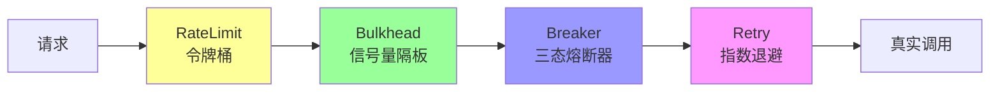
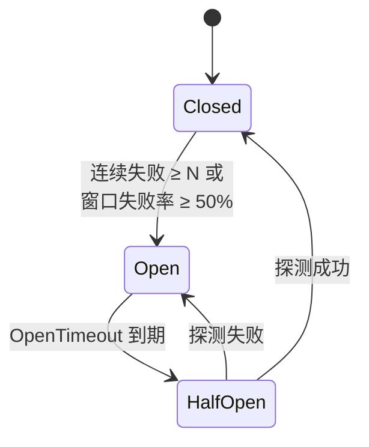
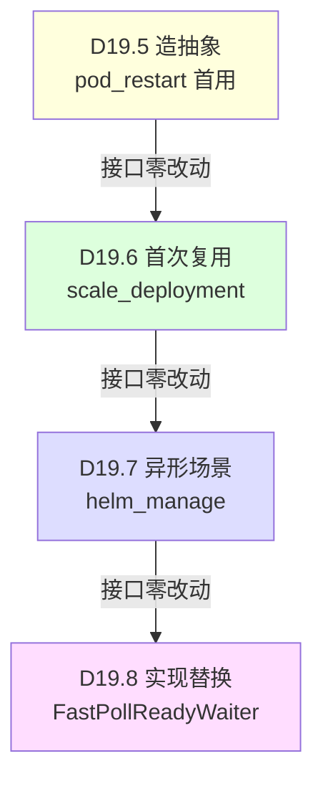
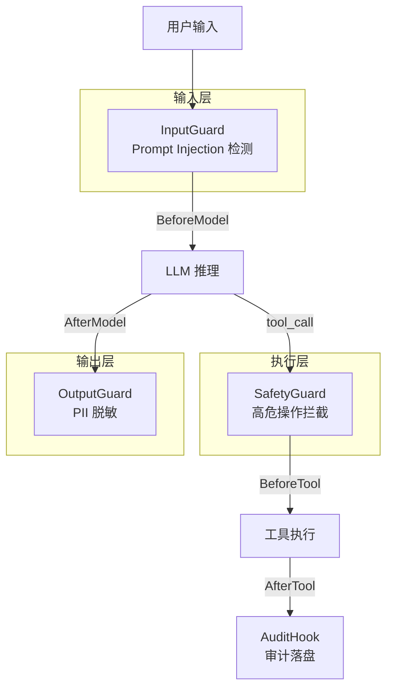
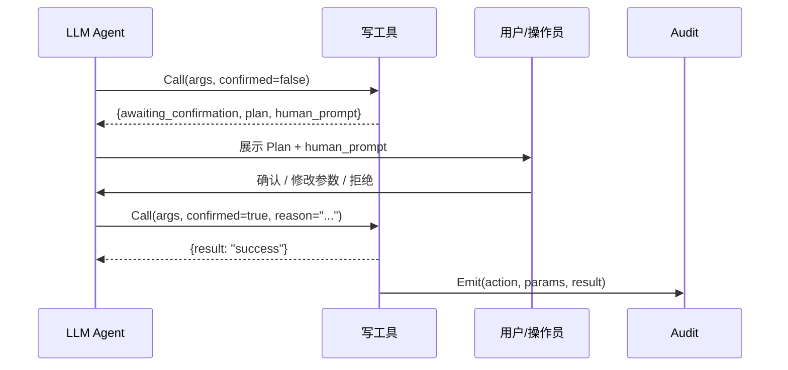

# 18 — 项目技术亮点与高级设计模式

> 覆盖范围：除并发特性外，本项目中其他有特点、有亮点的技术使用与架构设计  
> 目标：深入剖析项目在安全、韧性、抽象设计、可观测性、测试策略等方面的独到实现  
> 配套阅读：[17-Go并发特性原理与项目实战.md](17-Go并发特性原理与项目实战.md)

---

## 一、HMAC 链式审计签名（密码学 + 防篡改）

### 1.1 问题背景

审计日志被集中收集到 Loki/Vector 等后端后，任何拿到网关写入权限的人都能插入伪造记录。需要一种**离线可验证**的防篡改机制。

### 1.2 技术方案

**文件**：`src/audit/hmac.go`

```mermaid
graph LR
    subgraph "签名流程"
        R[Record] -->|"清空 sig 字段"| C[Canonical JSON]
        C -->|"HMAC-SHA256(key, payload)"| S[sig = hex(digest)]
        S -->|"写回 rec.Sig"| Final[带签名的 JSONL]
    end

    subgraph "链式模式"
        R1[Record 1] -->|"sig₁"| R2[Record 2<br/>prev_sig = sig₁]
        R2 -->|"sig₂"| R3[Record 3<br/>prev_sig = sig₂]
    end
```

**核心算法**：

```go
func (s *HMACSigner) Sign(rec *Record) error {
    // 1. 清空旧签名
    rec.Sig = ""
    rec.SigAlg = SigAlgHMACSHA256
    rec.SigKID = s.primaryKID

    // 2. 链式：注入上一条的 sig
    if s.chain {
        s.chainMu.Lock()
        rec.PrevSig = s.lastSig
        s.chainMu.Unlock()
    }

    // 3. Canonical marshal（Go struct 字段按声明序稳定输出）
    payload, _ := json.Marshal(rec)

    // 4. HMAC-SHA256
    mac := hmac.New(sha256.New, key)
    mac.Write(payload)
    sig := hex.EncodeToString(mac.Sum(nil))

    // 5. 写回 + 链式推进
    rec.Sig = sig
    if s.chain {
        s.chainMu.Lock()
        s.lastSig = sig
        s.chainMu.Unlock()
    }
    return nil
}
```

### 1.3 设计亮点

| 亮点 | 说明 |
|------|------|
| **Constant-time 比较** | `hmac.Equal()` 防时序侧信道攻击 |
| **签名覆盖全字段** | 任一业务字段被改都会验签失败（9 类字段篡改测试覆盖） |
| **多 KID 密钥轮换** | 老 key 保留用于验签历史记录，新 key 用于签新记录 |
| **链式防删除** | `prev_sig` 让攻击者无法删除中间记录而不被检出 |
| **跨重启持久化** | 链式状态原子写入磁盘（临时文件 → fsync → rename） |
| **三态装配** | 本地开发无签名 / 生产灰度签名 / 生产合规强制签名 |
| **离线验签 CLI** | 独立二进制，合规方无需 Go 环境即可验证 |

### 1.4 链式签名防删除证明

```
攻击者删除 Record₂，试图让 Record₃.PrevSig 指向 Record₁.Sig：
  → Record₃ 的 HMAC 输入包含 PrevSig 字段
  → 改了 PrevSig 后 HMAC 结果变了
  → 攻击者没有 key，无法重算正确的 sig₃
  → 验签必然失败 ✓
```

---

## 二、韧性原语组合链（Resilience Chain）

### 2.1 四层防御架构

**文件**：`pkg/resilience/chain.go`



**顺序原则**：
1. **RateLimit 最外层**：超过预算的请求最先被丢，不消耗其他资源
2. **Bulkhead 次外层**：限制单依赖在飞数，避免下游卡顿吃掉所有 goroutine
3. **Breaker 中间**：依据近期成功率快速失败，减少无谓重试
4. **Retry 最内层**：仅对真实调用包裹，避免重试时穿透限流/隔板

**实现（函数式组合）**：

```go
func (c Chain) Do(ctx context.Context, fn func(ctx context.Context) error) error {
    call := fn

    // 从内到外包裹（执行时从外到内）
    if c.Retry != nil {
        inner := call
        call = func(ctx context.Context) error {
            return Do(ctx, *c.Retry, inner)
        }
    }
    if c.Breaker != nil {
        inner := call
        call = func(ctx context.Context) error {
            return c.Breaker.Do(ctx, inner)
        }
    }
    if c.Bulk != nil {
        inner := call
        call = func(ctx context.Context) error {
            return c.Bulk.Do(ctx, inner)
        }
    }
    if c.Limiter != nil {
        inner := call
        call = func(ctx context.Context) error {
            return c.Limiter.Do(ctx, inner)
        }
    }
    return call(ctx)
}
```

**设计亮点**：
- **nil 层自动跳过**：任意一层未配置则不参与链路
- **零第三方依赖**：故意不引入 sony/gobreaker 等库，保留对错误语义的完整控制
- **每层独立可测**：每个原语都有独立的单元测试

### 2.2 三态熔断器（状态机模式）

**文件**：`pkg/resilience/breaker.go`



**滑动窗口实现**：

```go
// 每秒一个 bucket，环形数组
type bucket struct {
    tsSec uint64
    total atomic.Uint64
    fails atomic.Uint64
}

func (b *Breaker) windowStats() (total, fails uint64) {
    tsSec := uint64(b.cfg.Now().Unix())
    cutoff := tsSec - uint64(b.cfg.Window.Seconds()) + 1
    for i := range b.buckets {
        bk := &b.buckets[i]
        if bk.tsSec >= cutoff && bk.tsSec <= tsSec {
            total += bk.total.Load()
            fails += bk.fails.Load()
        }
    }
    return
}
```

**亮点**：
- **双触发条件**：连续失败 OR 窗口失败率，两条路径都能触发熔断
- **HalfOpen 并发限制**：半开状态只允许 N 个探测请求通过
- **状态变化回调**：`OnStateChange` 异步通知（用 `go` 避免阻塞调用方）
- **可注入时钟**：`Now func() time.Time` 让测试可以精确控制时间推进

---

## 三、接口抽象的"毕业考"方法论

### 3.1 ReadyWaiter 抽象演进

本项目最值得学习的架构实践之一：**一个接口从诞生到被证明"生产级可用"的完整验证路径**。



| 验证维度 | D19.5 造 | D19.6 首次复用 | D19.7 异形场景 | D19.8 实现替换 |
|---|---|---|---|---|
| ReadyWaiter 接口改动 | **新建** | 0 | 0 | 0 |
| ReadySpec 字段改动 | **新建** | 0 | 0 | 0 |
| 上层工具源代码改动 | 改造 pod_restart | +60 行 scale | +80 行 helm | **0 行** |
| 已有测试改动 | — | 0 | 0 | **0 行** |

**核心原则**：
- **"一个只被调用一次的接口不是接口，是函数"** — 必须被复用才算抽象成功
- **"接口稳定 + 实现可替换"** — 生产级抽象的最高荣誉
- **编译期契合断言**：`var _ ReadyWaiter = (*fastPollReadyWaiter)(nil)`

### 3.2 Executor 接口解耦

**文件**：`src/async/runner.go`

```go
type Executor interface {
    Execute(ctx context.Context, toolName string, args map[string]any) (any, error)
}
```

**为什么 Runner 不直接依赖 `tool.Tool`**：
1. **测试友好**：单测直接塞闭包，不引 trpc 运行时
2. **解耦框架升级**：trpc-agent-go 升级 tool 契约，只改 Executor 实现
3. **可替换**：未来 Executor 做成 RPC 到另一台机器，接口不变

**装配层桥接**（`app.go`）：

```go
executor := async.ExecutorFunc(func(ctx context.Context, name string, args map[string]any) (any, error) {
    // registry 按名查 tool.Tool → type-assert CallableTool → json.Marshal args → Call
    t := registry.Get(name)
    ct := t.(tool.CallableTool)
    argsJSON, _ := json.Marshal(args)
    return ct.Call(ctx, argsJSON)
})
```

### 3.3 MetricsHook 接口（零依赖美学）

```go
// async 包只定义接口，完全不 import observability
type MetricsHook interface {
    OnSubmit(tool, outcome string)
    OnFinish(tool, status string, total time.Duration)
}

// observability 包实现接口
type AsyncMetricsAdapter struct{}
func (a *AsyncMetricsAdapter) OnSubmit(tool, outcome string) { ... }
func (a *AsyncMetricsAdapter) OnFinish(tool, status string, total time.Duration) { ... }
```

**解决的矛盾**：async 包要保持零项目内依赖（干净的工具库包），但又需要打点。通过接口 + 适配器模式，在 app 层一行注入解决。

---

## 四、装饰器模式（Metrics Middleware）

### 4.1 工具调用指标装饰器

**文件**：`src/tools/bcs_tools/metrics_middleware.go`

```go
type metricsMiddleware struct {
    inner    tool.CallableTool  // 被装饰的原始工具
    toolName string
}

func WithMetrics(inner tool.CallableTool, name string) tool.CallableTool {
    return &metricsMiddleware{inner: inner, toolName: name}
}

func (m *metricsMiddleware) Call(ctx context.Context, argsJSON []byte) (any, error) {
    start := time.Now()
    confirmedInInput := extractConfirmed(argsJSON)

    // 透传调用
    result, err := m.inner.Call(ctx, argsJSON)
    elapsed := time.Since(start).Seconds()

    // 指标 1：耗时分布
    observability.ObserveToolCallDuration(ctx, m.toolName, status, elapsed)
    // 指标 2：HITL 漏斗
    if isPendingResult(result) { observability.IncToolHITLStage(...) }
    // 指标 3：拒绝原因分类
    if err != nil { observability.IncToolReject(...) }
    // 指标 4：入参异常检测
    if err != nil { observability.IncToolInputAnomaly(...) }

    return result, err
}
```

**亮点**：
- **透明装饰**：`Declaration()` 直接透传，对 LLM 完全透明
- **HITL 漏斗追踪**：Plan → Confirmed 两阶段独立计数
- **拒绝原因分类**：从 error 文本中模式匹配出 8 类拒绝原因
- **入参异常检测**：识别 LLM 参数构造问题（missing/empty/wrong_type/unknown_field）

---

## 五、安全防护体系（Plugin 架构）

### 5.1 三层防护模型



### 5.2 SafetyGuard 规则引擎

**文件**：`src/plugin/safety_guard.go`

```go
type SafetyRule struct {
    Name     string
    ToolName string
    Match    func(raw []byte, args map[string]any) bool
    Reason   string
}
```

**默认规则**：
1. `force_push=true` → 拦截
2. 合并 MR 到 `master|main` → 拦截
3. `bcs_helm_manage uninstall` 无 reason → 拦截
4. `devops_pipeline_rerun` pipeline_id 为空 → 拦截

**设计决策**：
- 选 `tool.Callbacks`（BeforeTool/AfterTool）而非全局 Plugin：按 Agent 差异化挂载
- 命中时返回 `{blocked:true, rule, reason}` 给 LLM，LLM 可据此改走 HITL 通道

### 5.3 全局 ModelCallbacks 装配线

**文件**：`src/agents/common.go`

```go
// app.Init 最早阶段一次注入
agents.RegisterGlobalModelHooks(beforeHooks, afterHooks)

// 各 Agent 统一入口调用
func NewDefaultModelCallbacks() *agentmodel.Callbacks {
    cb := agentmodel.NewCallbacks().
        RegisterBeforeModel(FillSystemContextInfo)  // 时间上下文注入

    // 串入全局 hook（input_guard / output_guard）
    for _, h := range globalBeforeModelHooks {
        cb.RegisterBeforeModel(h)
    }
    for _, h := range globalAfterModelHooks {
        cb.RegisterAfterModel(h)
    }
    return cb
}
```

**亮点**：5 个 Agent 无感接入安全防护，零新增 Dep 字段、零侵入单个 Agent。

---

## 六、规则热加载（零停机更新）

### 6.1 设计动机

生产环境上线后，一条高误伤率安全规则要回滚，传统路径需要：构建 → 审批 → 发布 → 灰度（2-4 小时）。对抗性 Prompt Injection 的攻防窗口远小于这个周期。

### 6.2 实现方案

**文件**：`src/plugin/rule_watcher.go`

```
┌─────────────────────────────────────────────┐
│  rules.yaml (SRE 编辑)                      │
│  ┌─────────────────────────────────────┐    │
│  │ input:                              │    │
│  │   rules:                            │    │
│  │     - pattern: "ignore.*previous"   │    │
│  │       action: block                 │    │
│  │ output:                             │    │
│  │   rules:                            │    │
│  │     - pattern: "\\d{11}"            │    │
│  │       action: mask                  │    │
│  └─────────────────────────────────────┘    │
└──────────────────────┬──────────────────────┘
                       │ mtime 变化
                       ▼
┌─────────────────────────────────────────────┐
│  RuleWatcher (每 5s 轮询)                    │
│  1. os.Stat → 比较 mtime + size             │
│  2. LoadRulesetFromFile → 解析 YAML          │
│  3. CompileInputRules → 编译正则             │
│  4. CompileOutputRules → 编译正则            │
│  5. guard.ReplaceRules → 原子替换            │
└─────────────────────────────────────────────┘
```

**关键设计**：
- **两组都编译通过后再原子替换**：避免"半成品"状态（input 新规则 + output 旧规则）
- **文件被删不清空 guard**：保留现有规则，只记 error 便于排查
- **错误不打断 watcher 循环**：一次加载失败不影响后续重试

---

## 七、Metrics as Code（可观测性 SSOT）

### 7.1 指标名常量化

**文件**：`src/observability/metrics_more.go`

```go
const (
    MetricAsyncJobsSubmitted = "gameops.async.jobs.submitted.total"
    MetricAsyncJobsFinished  = "gameops.async.jobs.finished.total"
    MetricAsyncJobDuration   = "gameops.async.jobs.duration.seconds"
    MetricPodReadyWaitTotal  = "gameops.pod_ready_wait.total"
    // ...
)
```

**SSOT 链路**：

```
metrics_more.go 常量（编译期检查）
    ├─→ 代码中引用 observability.MetricXxx
    ├─→ deploy/grafana/panels.yaml（面板声明）
    ├─→ deploy/grafana/dashboards/*.json（Grafana Import）
    └─→ deploy/alerts/prometheus_rules.yaml（告警规则）
```

**好处**：重命名指标时编译器会卡住所有代码引用，不会出现"代码改了但面板没改"的漂移。

### 7.2 差值 Pump 模式

**为什么 RemoteSink 不在 Write 里直接 Inc**：
- Write 是业务热路径，多一次 OTel Counter.Add 有额外开销
- Dropped/Failed 发生在后台 worker 里，Write 里根本拿不到

**正确方式**：外部周期性（~10s）拉一次 atomic 快照的"差值"转为 Counter.Add。这是 Prometheus pull / OTel push 模式下与 atomic counter 对接的标准桥接手法。

---

## 八、编译期契约保证

### 8.1 接口契合断言

```go
// 只要编译通过，就证明 AsyncMetricsAdapter 实现了 MetricsHook
var _ async.MetricsHook = (*observability.AsyncMetricsAdapter)(nil)

// 只要编译通过，就证明 fastPollReadyWaiter 实现了 ReadyWaiter
var _ ReadyWaiter = (*fastPollReadyWaiter)(nil)
```

**价值**：接口签名漂移时编译立即失败，不需要等到运行时才发现。

### 8.2 Schema Version 锁定

```go
func TestWriteJudgeReportJSON_SchemaVersionPinned(t *testing.T) {
    dto := readDTO(t, path)
    if dto.SchemaVersion != JudgeReportSchemaVersion {
        t.Errorf("schema_version 漂移")
    }
}
```

**价值**：防止有人改了 DTO 结构但忘了升版本号，导致下游消费方解析失败。

---

## 九、环境变量驱动的实现切换

### 9.1 ReadyWaiter 工厂

**文件**：`src/tools/bcs_tools/ready_waiter.go`

```go
func NewReadyWaiterFromEnv(client *bcsapi.Client, cfg WaiterConfig, hook FastPollMetricsHook) ReadyWaiter {
    switch os.Getenv("GAMEOPS_READY_WAITER") {
    case "fast":
        return NewFastPollReadyWaiter(client, cfg, hook)
    case "poll":
        return NewBCSReadyWaiter(client, cfg)
    case "noop":
        return NewNoopReadyWaiter()
    default:
        return NewFastPollReadyWaiter(client, cfg, hook)  // 默认走 fast
    }
}
```

**运维价值**：
- **线上逃生通道**：FastPoll 出 bug → `export GAMEOPS_READY_WAITER=poll` 重启即回退
- **A/B 对比**：50% 实例 fast、50% poll，对比指标
- **紧急关停**：`export GAMEOPS_READY_WAITER=noop`，wait_for_ready 立刻返回

---

## 十、FastPoll 阶梯退避算法

### 10.1 设计动机

传统轮询（固定 1s 间隔）在 Pod 快速就绪时浪费 ~500ms 平均延迟。阶梯退避让"首探快路径"感知延迟从 ~1s 降到 ~125ms 均值。

### 10.2 退避 Schedule

```
Probe 1: 0ms    (首探，零等待)
Probe 2: 250ms
Probe 3: 500ms
Probe 4: 1000ms
Probe 5: 2000ms
Probe 6+: DefaultInterval + Jitter (稳态)
```

**核心逻辑**：

```go
var fastPollSchedule = []time.Duration{0, 250*ms, 500*ms, 1000*ms, 2000*ms}

for probeIdx := 1; ; probeIdx++ {
    var wait time.Duration
    if probeIdx <= len(fastPollSchedule) {
        wait = fastPollSchedule[probeIdx-1]
    } else {
        wait = withJitter(interval, w.cfg.JitterRatio)  // 稳态 + 抖动
    }
    // 不要睡过 deadline
    if remaining := deadline.Sub(now); wait > remaining {
        wait = remaining
    }
    if wait > 0 {
        if err := w.cfg.SleepFunc(ctx, wait); err != nil {
            return false, err  // ctx 取消时立即退出
        }
    }
    ready, _ := w.probeOnce(ctx, spec)
    if ready { return true, nil }
}
```

**亮点**：
- **首探零等待**：如果 Pod 已经 ready，0ms 就能检测到
- **Jitter 防惊群**：多个 waiter 不会同频打 BCS API
- **不睡过 deadline**：剩余时间不足时截断等待
- **可注入 SleepFunc**：测试时用假 sleep，不真的等待

---

## 十一、HITL（Human-In-The-Loop）两段式确认

### 11.1 架构设计



### 11.2 设计亮点

- **纯函数化 HITL**：`hitl` 包不持有任何状态（Plan 结构 + Require 函数）
- **Severity 分级**：critical/high/medium/low，Prompt 层可根据级别决定确认强度
- **RequireReason**：Critical 级别强制用户提供变更原因，归档到审计日志
- **human_prompt 机制**：工具给 LLM 结构化 Plan，LLM 只需原样展示，避免文案变形
- **HITL_DISABLE 环境变量**：测试/紧急场景可绕过确认

---

## 十二、测试策略金字塔

### 12.1 四层测试体系

```
┌─────────────────────────────────────────┐
│     E2E Golden 剧本（LLM-as-Judge）      │  ← D29
├─────────────────────────────────────────┤
│     集成测试（跨模块真实装配）            │  ← D19.3
├─────────────────────────────────────────┤
│     单元测试（包内完整覆盖）             │  ← 每个 D 阶段
├─────────────────────────────────────────┤
│     编译期断言（接口契合 + Schema）       │  ← 零运行时成本
└─────────────────────────────────────────┘
```

### 12.2 集成测试策略

**文件**：`src/integration/doc.go`

**策略**：场景驱动集成测试 — 装配真实模块，只把最外围（LLM、HTTP 外呼）换成 in-memory 替身。

**五大场景**：
1. `TestIntegration_WebhookDedupePersist` — Deduper + FileStore + Audit
2. `TestIntegration_AsyncSubmitWaitCancel` — AsyncRunner 全生命周期
3. `TestIntegration_AsyncQueueLimitRejects` — 限流边界
4. `TestIntegration_SummarizerGeneratesOutcome` — Webhook + Summarizer + Report
5. `TestIntegration_AuditHMACChainAndVerify` — HMAC 链式签名 + 逐条验证 + 篡改检测

**为什么不做真 E2E**：
- CI 从秒级变分钟级
- 信号噪声比低（失败常是网络抖动）
- 定位成本高

### 12.3 可注入时钟（Testability）

项目中几乎所有涉及时间的模块都支持注入假时钟：

```go
type BreakerConfig struct {
    Now func() time.Time  // 测试可注入 fakeClock
}

type WaiterConfig struct {
    NowFunc   func() time.Time
    SleepFunc func(ctx context.Context, d time.Duration) error
}

type RateLimitConfig struct {
    Now func() time.Time
}
```

**价值**：测试可以精确控制时间推进，不需要 `time.Sleep` 等待，测试从分钟级降到毫秒级。

---

## 十三、Go 包设计的循环依赖解法

### 13.1 问题

`bcs_tools` 包 import `observability`（打点），`observability` 包如果 import `bcs_tools`（定义 adapter），就形成循环 import。

### 13.2 解法：胶水层放 app 包

```
bcs_tools ──import──→ observability (打点函数)
    ↑                       ↑
    │                       │
    └── app (胶水层) ───────┘
         │
         └── 定义 fastPollMetricsGlue 实现 FastPollMetricsHook
```

**原则**：跨两个已成环候选的包的接口实现，必须放在更上层的第三方包。app 是唯一本来就双向依赖的胶水层。

---

## 十四、HPA 感知的增量扩展模式

### 14.1 核心抽象

```go
type HPAInfo struct {
    Found       bool
    Name        string
    MinReplicas int32
    MaxReplicas int32
    CurrentReplicas int32
}

type HPAConflictPolicy int
const (
    PolicyBlock  HPAConflictPolicy = iota  // 拒绝操作
    PolicyWarn                              // 警告但允许
    PolicyIgnore                            // 静默忽略
)
```

### 14.2 增量扩展（不改现有函数）

| 阶段 | 新增 | 改动 |
|------|------|------|
| D20 scale 首用 | `DetectHPAForDeployment` | — |
| D20.1 rollout 复用 | `PolicyIgnore` 枚举值 | **0 行** |
| D20.2 hpa_patch | `GetHPAByName` 新函数 | **0 行** |

**共同模式**：
- ✅ 数据结构最小必要集（不镜像 K8s 原对象）
- ✅ 查询侧容错（查询失败返 Found=false，无感降级）
- ✅ 通过新增函数扩展场景，而非改现有函数

---

## 十五、总结：项目技术特色一览

| 领域 | 技术亮点 | 核心价值 |
|------|---------|---------|
| **安全** | HMAC 链式签名 + constant-time 比较 + 多 KID 轮换 | 防篡改 + 防删除 + 密钥可演进 |
| **韧性** | 四层组合链（Rate→Bulk→Break→Retry） | 级联故障防护 |
| **抽象** | ReadyWaiter 四步毕业考 + 编译期断言 | 可验证的接口稳定性 |
| **可观测** | Metrics as Code + 差值 Pump + 装饰器打点 | 指标 SSOT + 零侵入 |
| **热加载** | mtime 轮询 + 原子替换 + 错误不中断 | 分钟级规则调整 |
| **测试** | 可注入时钟 + 场景驱动集成测试 + Golden 剧本 | 秒级 CI + 高覆盖 |
| **解耦** | Executor 接口 + MetricsHook + 胶水层 | 零循环依赖 + 可替换 |
| **运维** | 环境变量切实现 + 三态装配 + HITL_DISABLE | 线上逃生通道 |
| **算法** | 阶梯退避 + Jitter 防惊群 + 惰性补桶 | 性能与公平性兼顾 |
| **架构** | 全局 Hook 注册 + 按 Agent 差异化挂载 | 5 Agent 无感接入安全防护 |
