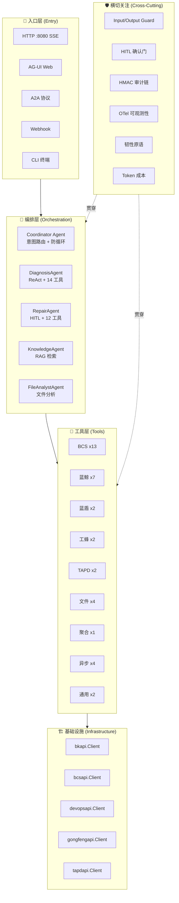
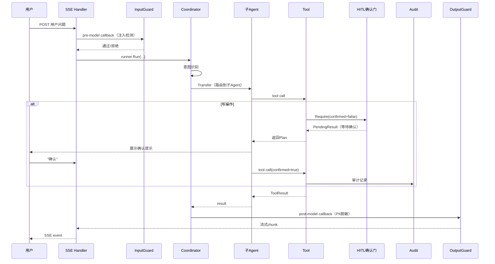
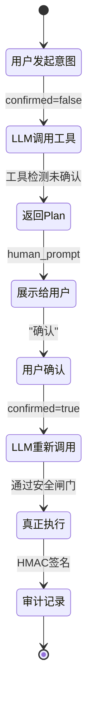

---

# GameOps Agent — 项目解析文档索引

## 一、项目概述

**GameOps Agent** 是一个基于 **tRPC-Agent-Go** 框架构建的 **Multi-Agent + Agentic RAG 智能运维系统**，面向游戏服务器（LetsGo）的运维场景。项目模块名为 `git.woa.com/trpc-go/gameops-agent`，使用 Go 1.24 开发。

**核心定位**：通过 LLM 驱动的多 Agent 协作，实现从「故障诊断 → 知识检索 → 自动修复 → 审计追踪」的全链路智能运维闭环。

---

## 二、解析文档系列索引

以下是计划分步完善的解析文档系列，按模块/主题划分：

| # | 文档主题 | 覆盖范围 | 核心文件 |
|---|---------|---------|---------|
| **1** | **架构总览与启动流程** | 系统分层、启动时序、DI 装配、Graceful Shutdown | `main.go`, `src/app/app.go`, `src/config/loader.go` |
| **2** | **Agent 编排层** | Coordinator 路由、子 Agent 构造、ReAct Planner、Prompt 工程 | `src/agents/` 全部 |
| **3** | **工具层与 Target 分发** | TargetedTool 机制、9 大工具组、MCP 工具管理 | `src/tools/` 全部 |
| **4** | **HITL 两段式确认框架** | Plan→Confirm→Execute 模式、Severity 分级、安全闸门 | `src/tools/hitl/`, 各写工具 |
| **5** | **基础设施层（HTTP Client）** | 5 大平台客户端、Mock/Real 切换、认证鉴权 | `src/infrastructure/` 全部 |
| **6** | **审计链与安全** | HMAC 链式签名、多 kid 轮换、RemoteSink、离线验签 | `src/audit/`, `src/cmd/auditverify/` |
| **7** | **可观测性** | OTel Provider、GenAI Semantic Conv、Metrics、Callbacks | `src/observability/` 全部 |
| **8** | **插件与防护** | InputGuard、OutputGuard、SafetyGuard、规则热加载 | `src/plugin/` 全部 |
| **9** | **会话与异步** | Session 管理、AsyncRunner、Job 生命周期 | `src/session/`, `src/async/` |
| **10** | **知识库与 RAG** | BuiltinKnowledge、iWiki 工具、Stub 降级 | `src/knowledge/`, `data/knowledge/` |
| **11** | **服务接入层** | SSE 流式、AG-UI Web、A2A 协议、Webhook | `src/services/` 全部 |
| **12** | **评测体系** | Golden Set、LLM-as-Judge、Tool Selection Judge、CI 集成 | `eval/` 全部 |
| **13** | **韧性原语** | Retry、Breaker、Bulkhead、RateLimit、Chain 组合 | `pkg/resilience/` 全部 |
| **14** | **技能系统与报告** | Skills 加载执行、修复报告生成 | `src/skillkit/`, `src/report/`, `skills/` |
| **15** | **部署与 CI/CD** | Helm Chart、Docker、Prometheus 规则、Grafana、GitLab CI | `deploy/`, `.gitlab-ci.yml`, `scripts/ci/` |
| **16** | **框架核心流程深度解析** | Runner 调度、LLMAgent 执行循环、Invocation 生命周期、Event 系统、Session 管理、Transfer 机制、Tool Callbacks、Model Provider、Planner 处理器链 | 框架源码 `trpc-agent-go@v1.8.1` |
| **17** | **Go 并发特性原理与项目实战** | Goroutine/Channel/Signal/Context/sync 原语的原理与项目中的系统性运用 | `src/async/runner.go`, `src/audit/remote_sink.go`, `pkg/resilience/`, `main.go` |
| **18** | **项目技术亮点与高级设计模式** | HMAC 链式签名、韧性组合链、接口抽象方法论、装饰器模式、安全防护体系、热加载、测试策略 | `src/audit/hmac.go`, `pkg/resilience/chain.go`, `src/plugin/`, `src/tools/bcs_tools/metrics_middleware.go` |

---

## 三、系统分层架构

---

## 四、核心模块基本介绍

### 4.1 启动与装配（DI）

| 文件 | 职责 |
|------|------|
| [main.go](/D:/UGit/Go-Agent/project-agent/main.go) | 程序入口，支持 HTTP/CLI 双模式，flag 解析 → config 加载 → OTel 初始化 → app.Init → 启动服务 |
| [app.go](/D:/UGit/Go-Agent/project-agent/src/app/app.go) | **核心装配器**：构建 LLM Model → 加载 MCP → 构造 5 Agent → 注册插件 → 组装 Session/Audit/Async |
| [loader.go](/D:/UGit/Go-Agent/project-agent/src/config/loader.go) | YAML + 环境变量配置加载，支持 Model/Gen/Webhook/Audit/Async 等配置段 |

**启动时序**：`flag.Parse` → `config.Load` → `observability.Init` → `app.Init`（DI 全部完成）→ HTTP/CLI 启动

### 4.2 Agent 编排层

**自定义实现**：
- **中文化 ReAct Planner**（[react.go](/D:/UGit/Go-Agent/project-agent/src/agents/react.go)）：将框架英文标签替换为中文（规划/推理/行动/最终答案），面向中文运维工程师
- **全局 Model Callbacks**（[common.go](/D:/UGit/Go-Agent/project-agent/src/agents/common.go)）：时间上下文注入 + 全局 InputGuard/OutputGuard 钩子注册

**框架实现**：
- 使用 `llmagent.New()` 构造 Agent，通过 `WithSubAgents` / `WithEndInvocationAfterTransfer` 等框架选项配置
- Transfer/Handoff 机制由框架原生提供

| Agent | 文件 | 核心特征 |
|-------|------|---------|
| Coordinator | [coordinator/agent.go](/D:/UGit/Go-Agent/project-agent/src/agents/coordinator/agent.go) | 无工具、纯路由、防循环（Transfer 后结束本轮） |
| DiagnosisAgent | `diagnosis_agent/agent.go` | ReAct Planner + 14 只读工具 |
| RepairAgent | `repair_agent/agent.go` | ReAct Planner + 12 写工具 + 强制 HITL |
| KnowledgeAgent | `knowledge_agent/agent.go` | RAG 检索（本地 + iWiki） |
| FileAnalystAgent | `file_analyst_agent/agent.go` | 沙盒文件分析 + Skills |

### 4.3 工具层与 Target 分发

**自定义实现**：
- **TargetedTool 分发器**（[targeted.go](/D:/UGit/Go-Agent/project-agent/src/tools/targeted.go)）：每个工具带 `target` 标签（如 `bcs-read`/`bcs-write`/`bk-monitor`），Agent 通过 `FilterByTargets` 按需获取可见工具集
- **HITL 两段式框架**（[hitl.go](/D:/UGit/Go-Agent/project-agent/src/tools/hitl/hitl.go)）：统一的 Plan→Confirm→Execute 模式，4 级 Severity 分级

**9 大工具组**：

| 工具组 | 数量 | Target | 关键能力 |
|--------|------|--------|---------|
| `bcs_tools` | 13 | `bcs-read` / `bcs-write` | Pod/Helm/HPA/ConfigMap/Secret/Network/Scale |
| `bk_tools` | 7 | `bk-monitor` / `bk-write` | 告警/日志/事件/指标/Trace/元数据/告警静默 |
| `devops_tools` | 2 | `devops` | 流水线重跑/构建取消 |
| `gongfeng_tools` | 2 | `gongfeng` | MR 创建/MR 合并 |
| `tapd_tools` | 2 | `tapd-read` / `tapd` | 缺陷查询/缺陷创建 |
| `file_tools` | 4 | 独立 | detect/read/json/log |
| `composite_tools` | 1 | `bcs-read` | logs_unified 跨源聚合 |
| `async_tools` | 4 | `*` | job_submit/status/cancel/wait |
| `util_tools` | 2 | `*` | time/base64 |

### 4.4 基础设施层

5 大平台 HTTP 客户端，统一设计模式：
- **Mock/Real 双模式**：未配凭据自动 Mock，`*_API_MOCK=1` 强制 Mock
- **安全闸门**：高危操作（如 MR 合并）默认不真实下发，需显式开关
- **统一 Envelope 解析**：各平台响应格式归一化处理

### 4.5 横切关注

| 模块 | 核心能力 |
|------|---------|
| **审计链** | HMAC-SHA256 链式签名 + 多 kid 轮换 + prev_sig 链接 + 跨重启持久化 + RemoteSink 远端汇聚 |
| **可观测性** | OTel TracerProvider/MeterProvider + GenAI Semantic Conv v1.30 + 6 种 Sampler + Prometheus 规则 |
| **插件防护** | InputGuard（Prompt 注入检测）+ OutputGuard（PII 脱敏）+ SafetyGuard（高危拦截）+ 规则 YAML 热加载 |
| **韧性原语** | Retry（指数退避+jitter）+ Breaker（三态熔断）+ Bulkhead（信号量隔板）+ RateLimit（令牌桶） |
| **成本统计** | Token 用量追踪与限额控制 |
| **幂等键** | Webhook/工具调用幂等（Redis/InMem） |

### 4.6 评测体系

- **Golden Set**：12 条金标用例，覆盖诊断/修复/检索/查询等场景
- **双 Judge 机制**：
    - Tool Selection Judge（算法 Judge，零 LLM 成本）
    - LLM-as-Judge（结构化 JSON 打分）
- **CI 集成**：GitLab CI 3 stage / 5 job + MR 自动评论

### 4.7 技能系统

基于框架 `skill.FSRepository` + `codeexecutor/local`，支持 Python 脚本执行：
- `log_pattern`：正则提取错误模式
- `csv_compare`：CSV 差异对比
- `perf_report`：性能数据统计

---

## 五、核心流程概览

### 5.1 单次请求处理流程

### 5.2 HITL 两段式确认流程

---

## 六、技术栈与依赖

| 类别 | 技术选型 |
|------|---------|
| **语言** | Go 1.24 |
| **Agent 框架** | trpc-agent-go v1.8.1 |
| **LLM 协议** | OpenAI 兼容（混元/DeepSeek/Anthropic/Gemini/Ollama） |
| **可观测性** | OpenTelemetry v1.38 + Prometheus + Grafana |
| **会话存储** | InMem / Redis (go-redis v9) |
| **协议** | SSE / A2A / AG-UI / Webhook |
| **部署** | Docker + Helm + K8s HPA |
| **CI/CD** | GitLab CI |

---
