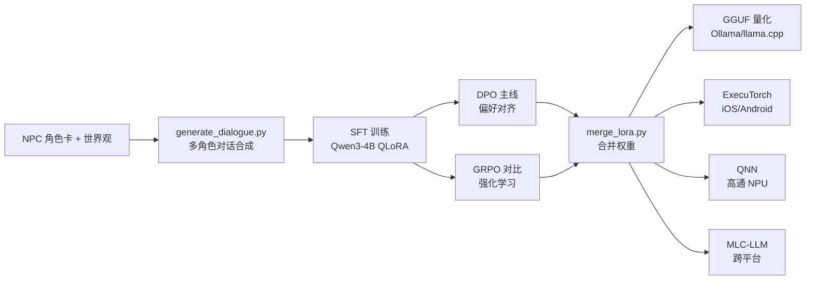
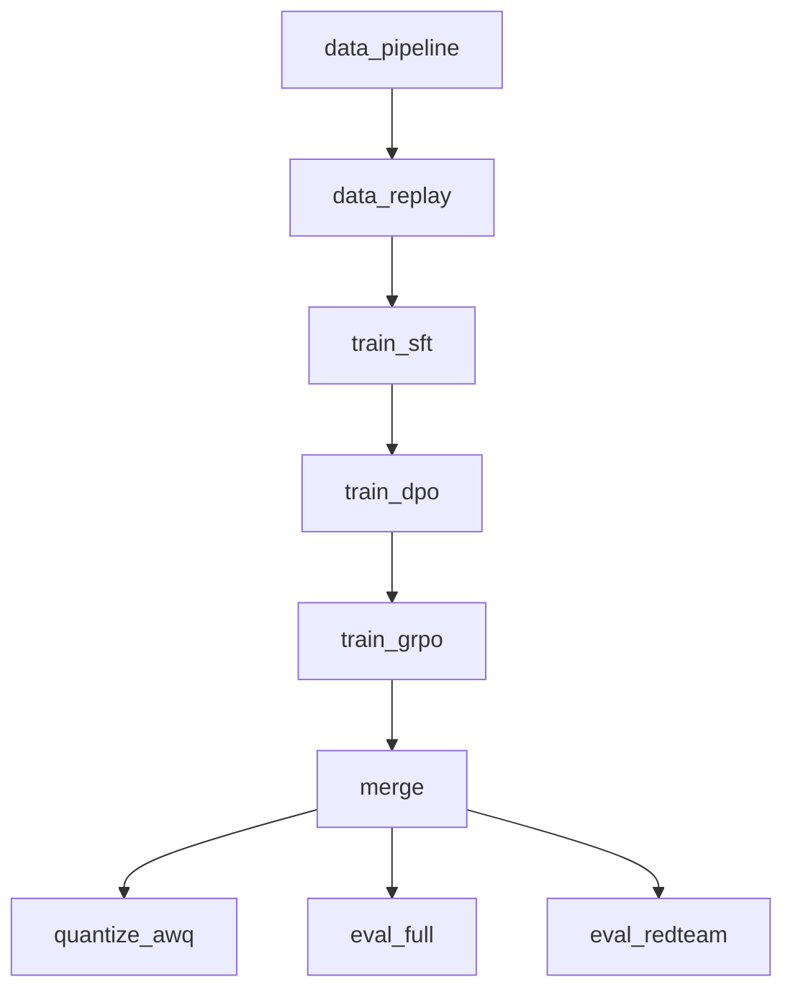

# project-llm 项目解析文档索引

> **文档定位**：本系列文档对 `project-llm` 项目进行完整的技术解析，覆盖核心功能、模块架构、数据流程、依赖框架、自定义实现等维度。
>
> **适用读者**：项目维护者、新成员 onboarding、面试复盘参考。

---

## 一、项目定位与核心目标

`project-llm` 是一个基于 **Qwen3 系列**的双方向 LLM 微调项目，目标是从数据合成到端侧部署的全链路落地：

| 方向 | 基座模型 | 核心能力 | 部署形态 |
|------|---------|---------|---------|
| **知识库专家** | Qwen3-8B | Agentic RAG + 运维知识问答 | vLLM V1 + EAGLE-3（GPU 服务端） |
| **游戏 AINPC** | Qwen3-4B / 1.7B / 0.6B | 多角色对话 + 情绪切换 + Thinking Mode | Ollama / ExecuTorch / QNN / MLC（端侧） |

---

## 二、模块总览（架构地图）

```
┌─────────────────────────────────────────────────────────────────────────┐
│                        project-llm 全链路架构                            │
├─────────────────────────────────────────────────────────────────────────┤
│                                                                         │
│  ┌──────────┐    ┌──────────┐    ┌──────────┐    ┌──────────┐          │
│  │ 数据合成  │ →  │ 数据质量  │ →  │ 模型训练  │ →  │ 模型评估  │          │
│  │ (scripts) │    │ (scripts) │    │ (configs) │    │ (eval)   │          │
│  └──────────┘    └──────────┘    └──────────┘    └──────────┘          │
│       │                                │               │                │
│       ▼                                ▼               ▼                │
│  ┌──────────┐                    ┌──────────┐    ┌──────────┐          │
│  │ 数据存储  │                    │ 模型量化  │    │ 安全评测  │          │
│  │ (data/)  │                    │ (scripts) │    │ (eval/)  │          │
│  └──────────┘                    └──────────┘    └──────────┘          │
│                                        │                                │
│                                        ▼                                │
│                    ┌─────────────────────────────────────┐              │
│                    │           部署层 (deploy/)           │              │
│                    ├─────────┬─────────┬────────┬────────┤              │
│                    │ vLLM V1 │ SGLang  │ Ollama │ 端侧   │              │
│                    │+EAGLE-3 │         │        │ET/QNN  │              │
│                    └────┬────┴────┬────┴────────┴────────┘              │
│                         │         │                                      │
│                         ▼         ▼                                      │
│                    ┌──────────────────────┐                              │
│                    │  RAG 服务 + MCP 接口  │                              │
│                    │  (rag_serve.py)       │                              │
│                    └──────────┬───────────┘                              │
│                               │                                          │
│                               ▼                                          │
│                    ┌──────────────────────┐                              │
│                    │  GameOps Agent (Go)   │ ← project-agent             │
│                    │  MCP 协议对接         │                              │
│                    └──────────────────────┘                              │
│                                                                         │
│  ┌──────────────────────────────────────────────────────────────┐       │
│  │              横切面：可观测性 (observability/)                  │       │
│  │  Langfuse Trace │ OTel GenAI │ Prometheus │ Grafana           │       │
│  └──────────────────────────────────────────────────────────────┘       │
│                                                                         │
│  ┌──────────────────────────────────────────────────────────────┐       │
│  │              AI Infra 补充 (infra/)                            │       │
│  │  CUDA 算子 │ 分布式训练 │ 推理优化 │ 性能报告                   │       │
│  └──────────────────────────────────────────────────────────────┘       │
│                                                                         │
└─────────────────────────────────────────────────────────────────────────┘
```

---

## 三、核心模块划分

### 3.1 数据层（Data Layer）

| 模块 | 路径 | 核心职责 | 关键技术 |
|------|------|---------|---------|
| 数据合成 | `scripts/generate_qa.py` | Wiki → QA 对合成 | DeepSeek-V3.2 + Magpie self-instruct |
| 对话合成 | `scripts/generate_dialogue.py` | NPC 多角色多场景对话生成 | Kimi-K2 / DeepSeek 多温度采样 |
| 偏好数据 | `scripts/generate_preference.py` | DPO 偏好对构造 | 双温度采样 + 异源 LLM Judge |
| GRPO 数据 | `scripts/generate_grpo_prompts.py` | GRPO 训练 prompt 集 | 角色一致性场景设计 |
| 数据质量 | `scripts/data_quality.py` | 五步质量管道 | 规则/SimHash/Embedding/LLM-Judge/RAGAS |
| 数据格式化 | `scripts/format_data.py` | 格式互转 | Alpaca / ShareGPT / messages |
| 数据飞轮 | `scripts/data_replay_buffer.py` | 防遗忘混合 | 旧 80% + 新 20% replay |
| 索引构建 | `scripts/build_index.py` | 向量索引 | BGE-M3 + Qdrant |

### 3.2 训练层（Training Layer）

| 模块 | 路径 | 核心职责 | 关键技术 |
|------|------|---------|---------|
| 知识库 SFT | `configs/knowledge_sft.yaml` | Qwen3-8B QLoRA 微调 | LoRA r=64 + RSLoRA + Liger Kernel |
| 知识库 DPO | `configs/knowledge_dpo.yaml` | 可选偏好对齐 | SimPO / Sigmoid DPO |
| NPC SFT | `configs/npc_sft.yaml` | Qwen3-4B QLoRA 微调 | LoRA r=32 + Thinking Mode |
| NPC DPO | `configs/npc_dpo.yaml` | NPC 偏好对齐（主线） | TRL DPO + LLaMAFactory |
| NPC GRPO | `configs/npc_grpo.yaml` | 强化学习对比实验 | 5 种组合奖励函数 |
| GRPO 奖励 | `scripts/grpo_rewards.py` | 自定义 reward | format/scenario/action/length/role_consistency |
| 量化配置 | `configs/quantize.yaml` | 统一量化参数 | FP8/AWQ/GPTQ-Marlin |

### 3.3 量化层（Quantization Layer）

| 模块 | 路径 | 核心职责 | 目标硬件 |
|------|------|---------|---------|
| FP8 量化 | `scripts/quantize_fp8.py` | FP8 W8A8 | H100 / H200 |
| AWQ 量化 | `scripts/quantize_awq.py` | AWQ-W4A16 | A10 / L20 / 4090 |
| GPTQ-Marlin | `scripts/quantize_gptq_marlin.py` | GPTQ + Marlin 加速 | A100 / L40S |
| GGUF 量化 | `scripts/quantize_gguf.sh` | 多精度 GGUF | CPU / 端侧 |

### 3.4 部署层（Deployment Layer）

| 模块 | 路径 | 核心职责 | 关键技术 |
|------|------|---------|---------|
| vLLM V1 | `deploy/vllm_v1_server.sh` | GPU 高吞吐推理 | EAGLE-3 投机解码 + PagedAttention |
| SGLang | `deploy/sglang_server.sh` | 多轮对话优化 | RadixAttention + EAGLE-3 |
| llama.cpp | `deploy/llamacpp_server.sh` | CPU 推理 | GGUF 格式 |
| Ollama | `deploy/Modelfile` | 端侧快速部署 | Modelfile 定义 |
| ExecuTorch | `deploy/executorch/` | iOS/Android 端侧 | CoreML / XNNPACK |
| QNN | `deploy/qnn/` | 高通 NPU | QNN SDK |
| MLC-LLM | `deploy/mlc/` | 跨平台端侧 | Vulkan / Metal / OpenCL |
| RAG 服务 | `deploy/rag_serve.py` | Agentic RAG | FastAPI + BGE-M3 + Reranker |
| MCP 服务 | `deploy/mcp_expert_server.py` | Agent 工具接口 | MCP Streamable HTTP |
| LoRA 多租户 | `deploy/vllm_lora_multi.sh` | 多模型共存 | vLLM LoRA 热加载 |

### 3.5 评估层（Evaluation Layer）

| 模块 | 路径 | 核心职责 | 关键技术 |
|------|------|---------|---------|
| 综合评估 | `scripts/evaluate.py` | G-Eval + RAGAS + Langfuse | HF/vLLM/SGLang/OpenAI 四后端 |
| RAGAS 评估 | `scripts/ragas_eval.py` | RAG 专项评估 | Faithfulness / Relevancy |
| 红队评测 | `scripts/red_team_eval.py` | 安全门禁 | 越狱/注入检测 |
| 性能基准 | `scripts/benchmark_serving.py` | 推理吞吐/延迟 | 异步并发压测 |

### 3.6 可观测性（Observability）

| 模块 | 路径 | 核心职责 |
|------|------|---------|
| Langfuse | `observability/langfuse_tracing.py` | LLM 调用链追踪 |
| OTel | `observability/otel_genai_config.yaml` | OpenTelemetry GenAI 语义约定 |
| Prometheus | `observability/prometheus.yml` | 指标采集 |
| Grafana | `observability/grafana_dashboard.json` | 可视化面板 |

### 3.7 AI Infra 补充（infra/）

| 模块 | 路径 | 核心职责 |
|------|------|---------|
| CUDA 算子 | `infra/cuda/` | Triton RMSNorm 融合算子 + FlashAttention Bench |
| 分布式训练 | `infra/distributed/` | DDP/FSDP/ZeRO/TP 实战 Demo |
| 推理优化 | `infra/inference/` | EAGLE-3 压测 + PD 分离 + 引擎选型 |
| 性能报告 | `infra/reports/` | 5 份实测报告 + 面试速查卡 |

---

## 四、核心技术栈

### 4.1 依赖框架（训练 & 微调）

| 框架 | 版本要求 | 用途 |
|------|---------|------|
| **LLaMAFactory** | ≥0.9.0 | 主训练框架，原生支持 Qwen3/GRPO/Liger Kernel |
| **TRL** | ≥0.12.0 | DPO/SimPO/GRPO/ORPO/KTO 原生实现 |
| **PEFT** | ≥0.13.0 | LoRA/QLoRA 参数高效微调 |
| **Transformers** | ≥4.45.0 | Qwen3 模型支持 |
| **Accelerate** | ≥1.0.0 | 分布式训练加速 |
| **BitsAndBytes** | ≥0.44.0 | NF4 双重量化 |
| **Liger-Kernel** | ≥0.4.0 | 融合算子（显存 -20%，速度 +15%） |
| **DeepSpeed** | ≥0.15.0 | ZeRO-1/2/3 + Offload |

### 4.2 依赖框架（推理 & 部署）

| 框架 | 版本要求 | 用途 |
|------|---------|------|
| **vLLM** | ≥0.7.0 | V1 引擎 + EAGLE-3 投机解码 |
| **SGLang** | ≥0.4.0 | RadixAttention + 多轮优化 |
| **ExecuTorch** | ≥0.5.0 | PyTorch 官方端侧方案 |
| **MLC-LLM** | ≥0.18.0 | 跨平台端侧推理 |
| **LLMCompressor** | ≥0.3.0 | FP8 + GPTQ-Marlin 量化 |
| **AutoAWQ** | ≥0.2.6 | AWQ 量化 |

### 4.3 依赖框架（评估 & 观测）

| 框架 | 版本要求 | 用途 |
|------|---------|------|
| **DeepEval** | ≥2.0.0 | G-Eval 评估 |
| **RAGAS** | ≥0.2.0 | RAG 质量指标 |
| **Langfuse** | ≥2.60.0 | 在线 Trace + 评估 |
| **OpenTelemetry** | ≥1.27.0 | GenAI Semantic Conv v1.30 |
| **Sentence-Transformers** | ≥3.0.0 | BGE-M3 / GTE-Qwen2 Embedding |

### 4.4 自定义实现

| 实现 | 路径 | 说明 |
|------|------|------|
| GRPO 5 种组合奖励函数 | `scripts/grpo_rewards.py` | format/scenario/action/length/role_consistency |
| Triton RMSNorm 融合算子 | `infra/cuda/triton_rmsnorm.py` | 对 PyTorch 原生 2.2x 加速 |
| 手写 TP Column/Row Parallel | `infra/distributed/tp_column_row.py` | 张量并行原理实现 |
| 数据质量五步管道 | `scripts/data_quality.py` | 规则→SimHash→Embedding→LLM-Judge→RAGAS |
| DPO 偏好对构造 | `scripts/generate_preference.py` | 双温度采样 + 异源 Judge |
| RAG 服务（含降级） | `deploy/rag_serve.py` | 检索→精排→生成→引用，自动 fallback |
| MCP Expert Server | `deploy/mcp_expert_server.py` | 封装 RAG 为 MCP 工具 |
| EAGLE-3 四档并发压测 | `infra/inference/bench_speculative.py` | 端到端投机解码性能对比 |
| 数据飞轮 Replay Buffer | `scripts/data_replay_buffer.py` | 防遗忘混合策略 |

---

## 五、核心流程概览

### 5.1 知识库专家模型流程

```mermaid
graph LR
    A[Wiki 文档] --> B[generate_qa.py<br/>QA 对合成]
    B --> C[data_quality.py<br/>五步质量过滤]
    C --> D[format_data.py<br/>格式化 Alpaca]
    D --> E[LLaMAFactory SFT<br/>Qwen3-8B QLoRA]
    E --> F[可选 DPO]
    F --> G[FP8/AWQ 量化]
    G --> H[vLLM V1 + EAGLE-3<br/>GPU 部署]
    H --> I[rag_serve.py<br/>RAG 服务]
    I --> J[mcp_expert_server.py<br/>MCP 接口]
    J --> K[GameOps Agent<br/>Agentic RAG]
```



### 5.2 AINPC 对话模型流程



### 5.3 DVC 流水线（可复现化）



---

## 六、解析文档系列规划

以下为后续分步完善的文档清单，每篇聚焦一个核心主题：

| 编号 | 文档名 | 主题 | 状态 |
|------|--------|------|------|
| 00 | `00_INDEX.md` | **本文件** — 总索引与项目概览 | ✅ 已完成 |
| 01 | `01_DATA_PIPELINE.md` | 数据合成与质量管道详解 | ✅ 已完成 |
| 02 | `02_TRAINING_SYSTEM.md` | 训练体系详解（SFT/DPO/GRPO） | ✅ 已完成 |
| 03 | `03_QUANTIZATION.md` | 量化方案全解析（FP8/AWQ/GPTQ/GGUF） | ✅ 已完成 |
| 04 | `04_INFERENCE_DEPLOY.md` | 推理部署架构（vLLM/SGLang/端侧） | ✅ 已完成 |
| 05 | `05_RAG_SYSTEM.md` | Agentic RAG 系统详解 | ✅ 已完成 |
| 06 | `06_AGENT_INTEGRATION.md` | Agent 集成与 MCP 协议 | ✅ 已完成 |
| 07 | `07_EVALUATION.md` | 评估体系详解（G-Eval/RAGAS/红队） | ✅ 已完成 |
| 08 | `08_OBSERVABILITY.md` | 可观测性体系（Langfuse/OTel/Prometheus） | ✅ 已完成 |
| 09 | `09_AI_INFRA.md` | AI Infra 深度解析（CUDA/分布式/推理优化） | ✅ 已完成 |
| 10 | `10_DEPENDENCY_MAP.md` | 依赖关系与框架版本矩阵 | ✅ 已完成 |
| 11 | `11_FRAMEWORK_INTERNALS.md` | 框架内部原理深度解析（LLaMAFactory/vLLM/PEFT/Qdrant 等） | ✅ 已完成 |

---

## 七、快速导航

### 按角色导航

- **想了解项目全貌** → 本文件 + README.md
- **想跑通训练** → `01_DATA_PIPELINE.md` → `02_TRAINING_SYSTEM.md` → [DEPLOY.md](../DEPLOY.md)
- **想部署服务** → `04_INFERENCE_DEPLOY.md` → `05_RAG_SYSTEM.md`
- **想接入 Agent** → `06_AGENT_INTEGRATION.md` → [agent_integration.md](../agent_integration.md)
- **想准备面试** → `09_AI_INFRA.md` → `11_FRAMEWORK_INTERNALS.md` → [infra/reports/infra_interview_cheatsheet.md](../../infra/reports/infra_interview_cheatsheet.md)

### 按技术栈导航

- **LLaMAFactory 相关** → `02_TRAINING_SYSTEM.md`（configs 详解）+ `11_FRAMEWORK_INTERNALS.md`（内部原理）
- **vLLM / EAGLE-3** → `04_INFERENCE_DEPLOY.md` + `11_FRAMEWORK_INTERNALS.md`（PagedAttention/投机解码原理）
- **RAG / Qdrant / BGE-M3** → `05_RAG_SYSTEM.md` + `11_FRAMEWORK_INTERNALS.md`（HNSW/Sparse Head 原理）
- **Triton / CUDA** → `09_AI_INFRA.md`
- **DPO / GRPO / TRL** → `02_TRAINING_SYSTEM.md` + `11_FRAMEWORK_INTERNALS.md`（Trainer 内部机制）
- **框架底层原理（面试深追）** → `11_FRAMEWORK_INTERNALS.md`

---

## 八、项目关键数据

| 指标 | 数值 |
|------|------|
| Python 脚本数 | 30+ |
| 训练配置文件 | 7 个 YAML |
| 部署方案 | 7 种（vLLM/SGLang/llama.cpp/Ollama/ExecuTorch/QNN/MLC） |
| 量化方案 | 4 种（FP8/AWQ/GPTQ-Marlin/GGUF） |
| 评估维度 | 精确指标 + G-Eval + RAGAS + 红队 |
| 可观测组件 | 4 个（Langfuse/OTel/Prometheus/Grafana） |
| AI Infra 实测报告 | 5 份 + 面试速查卡 |
| DVC 流水线阶段 | 9 个 stage |
| 核心依赖包 | 40+ |

---

> **下一步**：按照上表编号，逐篇完善各模块的深度解析文档。每篇文档将包含：模块职责、核心代码走读、配置详解、流程图、依赖关系、面试要点。
