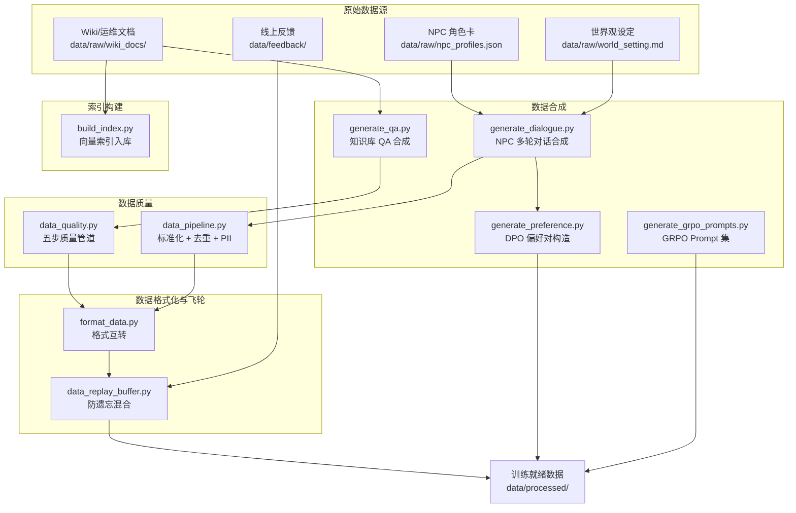
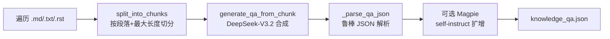
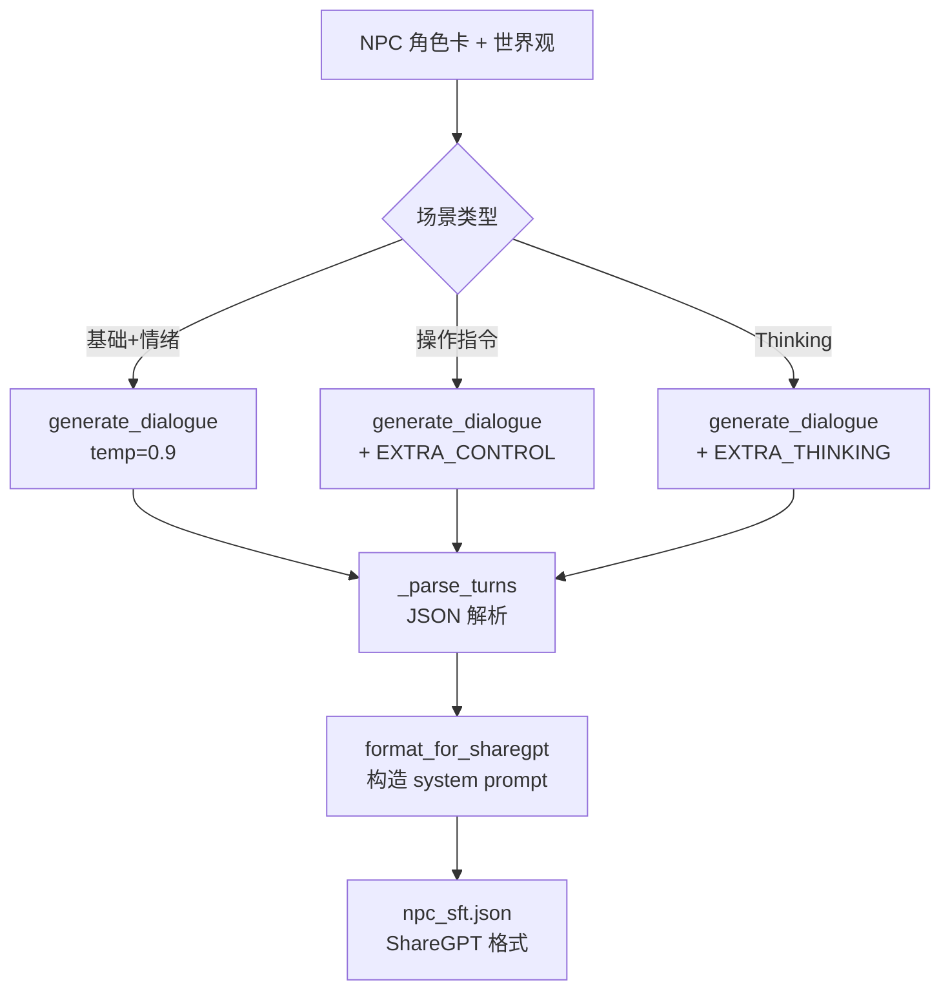
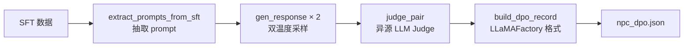
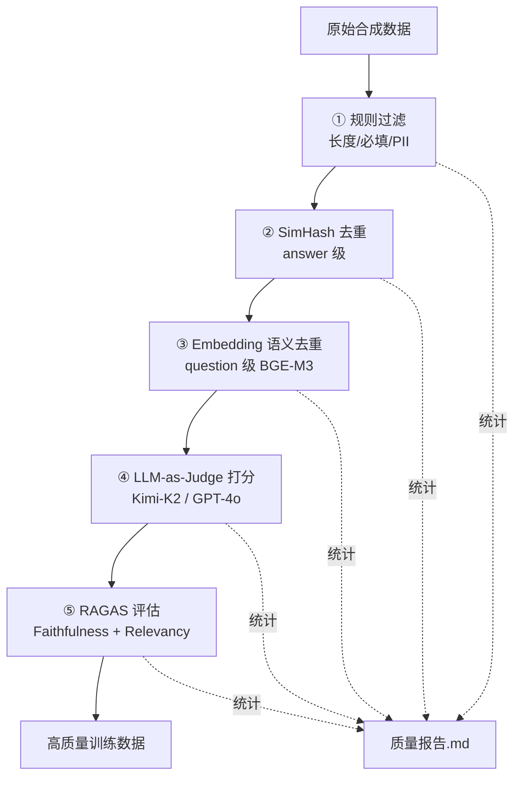
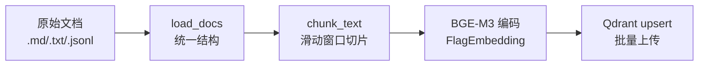
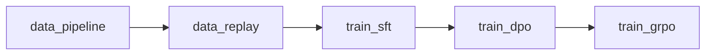

# 01 数据合成与质量管道详解

> **文档定位**：深度解析 `project-llm` 数据层（Data Layer）的完整实现，覆盖从原始文档到高质量训练数据的全链路。
>
> **前置阅读**：[00_INDEX.md](./00_INDEX.md)（项目总览）

---

## 一、数据层架构总览



---

## 二、知识库 QA 合成（`generate_qa.py`）

### 2.1 模块职责

将 Wiki / 运维文档自动转化为高质量 QA 训练对，用于知识库专家模型（方向一）的 SFT 训练。

### 2.2 核心流程



### 2.3 关键技术实现

#### 2.3.1 Markdown Chunking 策略

```python
def split_into_chunks(text: str, max_len: int = 4000) -> list[str]:
    """按空行切段落，再按 max_len 累计聚合成 chunk。"""
    paragraphs = [p for p in text.split("\n\n") if p.strip()]
    chunks: list[str] = []
    current = ""
    for p in paragraphs:
        if len(p) > max_len:          # 单段超长直接独立成 chunk
            if current:
                chunks.append(current)
                current = ""
            chunks.append(p[:max_len])
            continue
        if len(current) + len(p) > max_len:
            if current:
                chunks.append(current)
            current = p
        else:
            current += "\n\n" + p if current else p
    if current:
        chunks.append(current)
    return chunks
```

**设计要点**：
- 以空行（`\n\n`）为自然段落边界，保持语义完整性
- 累计聚合直到超过 `max_len`（默认 4000 字符），避免过短 chunk 导致合成质量下降
- 单段超长时截断独立成 chunk，防止丢失内容

#### 2.3.2 QA 合成 Prompt 工程

```python
GENERATE_QA_PROMPT = """你是一个资深运维数据标注专家。请基于以下文档内容，合成高质量的问答对用于 SFT 训练。

要求：
1. 每个问题必须能仅通过文档内容回答，不允许引入文档外知识
2. 问题要多样化：包含 what / why / how / when / troubleshoot 五类
3. 答案要准确、完整、专业，保留关键代码/命令/指标阈值
4. 生成 {n_qa} 个问答对，其中至少 2 个是"多跳推理"类
5. 为每条标注 difficulty: easy / medium / hard
6. 只输出 JSON 数组
"""
```

**Prompt 设计亮点**：
- 强制"仅基于文档"约束，防止幻觉
- 五类问题类型覆盖（what/why/how/when/troubleshoot）
- 要求多跳推理样本，提升模型深层理解能力
- 难度标注便于后续分层训练

#### 2.3.3 Magpie Self-Instruct（可选扩增）

```python
MAGPIE_PROMPT_TEMPLATE = """<|im_start|>system
你是游戏服务器运维领域的专家，熟悉 LetsGo 项目与 tRPC-Go 框架。
<|im_end|>
<|im_start|>user
"""
```

**原理**：利用 Qwen3 chat template 的截断特性，让本地基座模型在 `<|im_start|>user\n` 后自发生成问题（无需人工 seed），再由合成主模型（DeepSeek-V3.2）给出高质量答案。

**流程**：
1. 本地 vLLM 服务加载 Qwen3-8B 基座，以 `temperature=1.0` 自发生成问题
2. 过滤过短问题（< 10 字符）
3. 合成主模型以 `temperature=0.3` 生成稳定答案

#### 2.3.4 鲁棒 JSON 解析

```python
def _parse_qa_json(text: str) -> list[dict]:
    """三级容错：直接解析 → 字典内查找 → 截取数组片段"""
    text = text.strip()
    # 去除 markdown code fence
    if text.startswith("```"):
        text = text.split("\n", 1)[1]
        text = text.rsplit("```", 1)[0]
    # 尝试直接解析
    try:
        data = json.loads(text)
        if isinstance(data, list): return data
        if isinstance(data, dict):
            for key in ("qa_pairs", "data", "results", "items"):
                if key in data and isinstance(data[key], list):
                    return data[key]
    except json.JSONDecodeError: pass
    # 兜底：截取数组片段
    start, end = text.find("["), text.rfind("]") + 1
    if start >= 0 and end > start:
        try: return json.loads(text[start:end])
        except: pass
    return []
```

### 2.4 依赖框架

| 依赖 | 版本 | 用途 |
|------|------|------|
| `openai` | ≥1.50.0 | OpenAI 兼容客户端（DeepSeek/Moonshot/OpenAI） |
| `python-dotenv` | ≥1.0.0 | 环境变量加载 |

### 2.5 配置参数

| 参数 | 默认值 | 说明 |
|------|--------|------|
| `--provider` | deepseek | 合成模型提供商 |
| `--n_per_chunk` | 8 | 每个 chunk 合成 QA 对数 |
| `--max_len` | 4000 | chunk 最大字符数 |
| `--max_chunks` | 0（不限） | 用于 smoke test |
| `--enable_magpie` | 0 | 是否启用 Magpie 扩增 |
| `--magpie_n` | 100 | Magpie 采样数 |

---

## 三、NPC 多轮对话合成（`generate_dialogue.py`）

### 3.1 模块职责

为游戏 AINPC（方向二）生成多角色、多场景、多情绪的多轮对话训练数据，输出 ShareGPT 格式。

### 3.2 场景体系设计

```
┌─────────────────────────────────────────────────────────┐
│                    场景分层体系                            │
├─────────────────────────────────────────────────────────┤
│                                                         │
│  基础场景（8 类）                                        │
│  ├── greet          首次问候                             │
│  ├── quest_give     发布任务                             │
│  ├── quest_progress 任务进度                             │
│  ├── quest_complete 任务完成                             │
│  ├── trade          交易对话                             │
│  ├── lore           世界观问答                           │
│  ├── idle_chat      闲聊                                │
│  └── farewell       告别                                │
│                                                         │
│  情绪场景（3 类）                                        │
│  ├── emotion_angry  愤怒状态                             │
│  ├── emotion_happy  高兴状态                             │
│  └── emotion_sad    悲伤状态                             │
│                                                         │
│  操作指令场景（3 类，进阶）                               │
│  ├── action_trade   输出 [TRADE:xxx]                    │
│  ├── action_give    输出 [GIVE_ITEM:xxx]                │
│  └── action_quest   输出 [START_QUEST:xxx]              │
│                                                         │
│  Thinking 剧情场景（3 类，高阶）                          │
│  ├── thinking_dilemma  两难选择                          │
│  ├── thinking_deduce   推理真相                          │
│  └── thinking_judge    判断真假                          │
│                                                         │
└─────────────────────────────────────────────────────────┘
```

### 3.3 核心流程



### 3.4 关键技术实现

#### 3.4.1 System Prompt 动态构建

```python
def build_system_prompt(npc: dict, extra_state: str | None = None,
                        enable_thinking: bool = False) -> str:
    lines = [
        f"你是游戏中的NPC「{npc['name']}」。",
        f"身份：{npc['identity']}",
        f"性格：{npc['personality']}",
        f"说话风格：{npc['speaking_style']}",
        f"背景：{npc['background']}",
        f"专业领域：{'、'.join(npc.get('knowledge', []))}",
        "请始终以该角色的身份和风格回复玩家。",
    ]
    if extra_state:
        lines.append(extra_state)  # 如 "当前情绪：[angry]"
    if enable_thinking:
        lines.append("每次回复前先在 <think>...</think> 中思考，再给出回答。")
    return "\n".join(lines)
```

**设计要点**：
- 角色卡字段完整注入（名字/身份/性格/说话风格/背景/知识领域）
- 情绪状态动态注入（`extra_state`），训练模型感知情绪切换
- Thinking Mode 通过 system prompt 指令触发 `<think>...</think>` 格式

#### 3.4.2 操作指令训练

```python
EXTRA_CONTROL = """
# 操作指令要求（重要）
NPC 在合适的时机**必须**输出以下操作指令中的一个（作为回复的最后一行）：
- [GIVE_ITEM:物品名]     # 给玩家物品
- [START_QUEST:任务名]   # 发布任务
- [TRADE:商品类别]        # 打开交易
- [END_QUEST:任务名]     # 结束任务
"""
```

**目的**：训练 NPC 模型在对话中输出结构化操作指令，供游戏引擎解析执行。

#### 3.4.3 Thinking Mode 训练

```python
EXTRA_THINKING = """
# Thinking Mode 要求（重要）
NPC 的**每一次**回复都必须先产出思考链，再给出最终回答，格式：
<think>
（内心推理过程，2-3 句话）
</think>
（说给玩家听的回答）
"""
```

**目的**：训练模型在复杂剧情场景下先推理再回答，提升逻辑一致性。

### 3.5 依赖框架

| 依赖 | 版本 | 用途 |
|------|------|------|
| `openai` | ≥1.50.0 | Kimi-K2 / DeepSeek API 调用 |
| `python-dotenv` | ≥1.0.0 | 环境变量 |

### 3.6 配置参数

| 参数 | 默认值 | 说明 |
|------|--------|------|
| `--provider` | moonshot | 合成模型（Kimi-K2-0905） |
| `--n_per_pair` | 2 | 每个 (NPC, 场景) 生成条数 |
| `--include_control` | 1 | 是否加入操作指令场景 |
| `--include_thinking` | 0 | 是否加入 Thinking 场景 |
| `--include_emotion` | 1 | 是否加入情绪场景 |

---

## 四、DPO 偏好对构造（`generate_preference.py`）

### 4.1 模块职责

为 DPO（Direct Preference Optimization）训练构造 chosen/rejected 偏好对数据。

### 4.2 核心流程



### 4.3 关键技术实现

#### 4.3.1 双温度采样策略

```python
# 回复 A：低温（稳定、高质量）
resp_a = gen_response(client, model, msgs, temperature=0.3)
# 回复 B：高温（随机、更容易产生较差回复）
resp_b = gen_response(client, model, msgs, temperature=1.1)
```

**原理**：同一模型不同温度采样，低温回复通常质量更高（更稳定），高温回复更随机（可能出现角色偏离、逻辑跳跃）。通过 Judge 确认偏好方向后构造训练对。

#### 4.3.2 异源 LLM Judge

```python
DPO_JUDGE_PROMPT = """你是游戏对话质量评审专家。请对比以下两个 NPC 回复，选出更好的一个。

评判标准（按优先级）：
1. 角色一致性（是否完全符合角色设定与说话风格）
2. 对话趣味性（是否有代入感，不是 AI 腔）
3. 世界观一致性（用词/背景是否符合游戏设定）
4. 玩家体验（是否让玩家想继续互动）
"""
```

**"异源"设计**：生成用 Moonshot（Kimi-K2），评审用 OpenAI（GPT-4o），避免同源偏见。

#### 4.3.3 输出格式（LLaMAFactory pairwise）

```json
{
  "system": "你是游戏中的NPC「铁匠老王」...",
  "conversations": [
    {"from": "human", "value": "老王，这把剑能修吗？"}
  ],
  "chosen":   {"from": "gpt", "value": "（高质量回复）"},
  "rejected": {"from": "gpt", "value": "（较差回复）"},
  "_judge_reason": "A 更符合角色粗犷的说话风格..."
}
```

### 4.4 依赖框架

| 依赖 | 版本 | 用途 |
|------|------|------|
| `openai` | ≥1.50.0 | 双模型调用（生成 + Judge） |
| `generate_qa.build_client` | 内部复用 | 客户端构造 |

---

## 五、数据质量五步管道（`data_quality.py`）

### 5.1 模块职责

对合成数据进行多层级质量过滤，确保进入训练的数据高质量、无重复、无 PII 泄露。

### 5.2 五步管道流程



### 5.3 各步骤详解

#### 5.3.1 规则过滤

```python
_PII_PATTERNS = [
    (re.compile(r"1[3-9]\d{9}"), "<PHONE>"),                    # 手机号
    (re.compile(r"\b\d{15,18}[0-9Xx]?\b"), "<ID>"),             # 身份证
    (re.compile(r"\b[A-Za-z0-9._%+-]+@[A-Za-z0-9.-]+\.[A-Z|a-z]{2,}\b"), "<EMAIL>"),
    (re.compile(r"\b(?:\d{1,3}\.){3}\d{1,3}\b"), "<IP>"),       # IP 地址
]
```

**过滤规则**：
| 规则 | 默认阈值 | 说明 |
|------|---------|------|
| 问题最短 | 5 字符 | 过短无训练价值 |
| 答案最短 | 10 字符 | 过短无训练价值 |
| 问题最长 | 512 字符 | 防止异常长文 |
| 答案最长 | 4096 字符 | 防止异常长文 |
| PII 脱敏 | 默认开启 | 手机/身份证/邮箱/IP |

#### 5.3.2 SimHash 去重（Answer 级）

```python
def simhash_dedupe(items: list[dict], distance: int = 3) -> tuple[list[dict], int]:
    from simhash import Simhash
    seen: list = []
    kept: list[dict] = []
    for it in items:
        sig = Simhash(it.get("answer", ""))
        if any(sig.distance(s) <= distance for s in seen):
            drop += 1
            continue
        seen.append(sig)
        kept.append(it)
    return kept, drop
```

**设计考量**：
- 针对 **answer** 去重，因为长文档 chunk 重叠容易产生相似答案
- 汉明距离阈值 ≤ 3 视为重复（SimHash 64-bit 指纹）
- 时间复杂度 O(n²)，适合万级数据量

#### 5.3.3 Embedding 语义去重（Question 级）

```python
def embedding_dedupe(items: list[dict], sim_threshold: float = 0.9):
    from sentence_transformers import SentenceTransformer
    encoder = SentenceTransformer("BAAI/bge-m3")
    emb = encoder.encode(questions, normalize_embeddings=True)
    # 逐条与已保留集合计算余弦相似度
    for i in range(len(items)):
        kept_mat = emb[kept_idx]
        sims = kept_mat @ emb[i]  # 归一化后点积 = 余弦相似度
        if float(sims.max()) >= sim_threshold:
            drop += 1
            continue
        kept_idx.append(i)
```

**设计考量**：
- 针对 **question** 去重，防止语义相同但表述不同的重复问题
- 使用 BGE-M3 模型（支持 8K 长文本，多语言）
- 余弦相似度 ≥ 0.9 视为语义重复
- 归一化后直接矩阵乘法计算，高效

#### 5.3.4 LLM-as-Judge 打分

```python
JUDGE_PROMPT = """请对以下问答对从 5 个维度打分（每项 1-5 整数）：
1. 准确性（答案是否基于事实、无幻觉）
2. 完整性（是否覆盖问题所有关键信息）
3. 清晰度（表达是否清晰，结构是否合理）
4. 专业性（术语是否规范，领域深度是否足够）
5. 可训练价值（该样本是否对模型学习有用）
"""
```

**设计要点**：
- 5 维度评分 + 综合分，阈值默认 3.5（满分 5）
- 异源评审：合成用 DeepSeek，Judge 用 Moonshot/GPT-4o
- 保留 `_judge.reason` 字段便于人工抽检

#### 5.3.5 RAGAS 评估（可选）

```python
from ragas import evaluate
from ragas.metrics import answer_relevancy, faithfulness

result = evaluate(ds, metrics=[faithfulness, answer_relevancy])
```

**前提条件**：样本需包含 `context` 字段（检索上下文）
- **Faithfulness**：答案是否忠实于上下文（防幻觉）
- **Answer Relevancy**：答案是否与问题相关
- 双指标均 ≥ 0.7 才保留

### 5.4 依赖框架

| 依赖 | 版本 | 用途 |
|------|------|------|
| `simhash` | ≥2.1.0 | SimHash 指纹去重 |
| `sentence-transformers` | ≥3.0.0 | BGE-M3 语义编码 |
| `numpy` | ≥2.0.0 | 向量运算 |
| `openai` | ≥1.50.0 | LLM Judge 调用 |
| `ragas` | ≥0.2.0 | RAG 质量指标 |
| `datasets` | ≥3.0.0 | RAGAS 数据格式 |

### 5.5 配置参数

| 参数 | 默认值 | 说明 |
|------|--------|------|
| `--simhash_distance` | 3 | 汉明距离阈值 |
| `--sim_threshold` | 0.9 | 语义相似度阈值 |
| `--judge_threshold` | 3.5 | Judge 综合分阈值 |
| `--judge_provider` | moonshot | Judge 模型提供商 |
| `--ragas_threshold` | 0.7 | RAGAS 指标阈值 |

---

## 六、数据格式转换（`format_data.py`）

### 6.1 模块职责

在三种主流 SFT 数据格式之间互转，适配不同训练框架的输入要求。

### 6.2 支持格式

| 格式 | 结构 | 适用框架 |
|------|------|---------|
| **Alpaca** | `{instruction, input, output}` | LLaMAFactory（alpaca 模式） |
| **ShareGPT** | `{conversations: [{from, value}], system}` | LLaMAFactory（sharegpt 模式） |
| **Messages** | `[{role, content}]` | OpenAI / TRL / 通用 |

### 6.3 转换架构

```
任意格式 → Messages（中间表示） → 任意格式
```

```python
def convert(item: dict, src: str, dst: str):
    # 先转成 messages 再转出
    if src == "alpaca":
        messages = alpaca_to_messages(item)
    elif src == "sharegpt":
        messages = sharegpt_to_messages(item)
    elif src == "messages":
        messages = item.get("messages", item)

    if dst == "alpaca":
        return messages_to_alpaca(messages)
    if dst == "sharegpt":
        return messages_to_sharegpt(messages)
    if dst == "messages":
        return {"messages": messages}
```

### 6.4 角色映射

```python
_ROLE_MAP = {"human": "user", "gpt": "assistant", "system": "system"}
_ROLE_MAP_REV = {v: k for k, v in _ROLE_MAP.items()}
```

---

## 七、数据管道编排（`data_pipeline.py`）

### 7.1 模块职责

将多种原始数据源统一为 LLaMAFactory ShareGPT 格式的标准化训练集。

### 7.2 数据源处理

| 数据源 | 处理方式 | 输出 |
|--------|---------|------|
| `npc_profiles.json` | 角色卡 → system + greeting 对话 | ShareGPT |
| `wiki_docs/*.md` | 文档首段 → 问答对 | ShareGPT |
| `*.jsonl`（已有产物） | 直接合并 | ShareGPT |

### 7.3 标准化流程

```python
def normalize(item: dict) -> dict | None:
    """统一为 LlamaFactory ShareGPT。"""
    # 支持三种输入格式自动识别
    if "conversations" in item:     # ShareGPT
        conv = item["conversations"]
    elif "messages" in item:        # OpenAI messages
        conv = [{"from": role_map[m["role"]], "value": m["content"]} for m in item["messages"]]
    elif "instruction" in item:     # Alpaca
        conv = [{"from": "human", "value": item["instruction"]},
                {"from": "gpt", "value": item["output"]}]
    else:
        return None  # 无法识别，丢弃

    # PII 脱敏
    for turn in conv:
        turn["value"], hits = strip_pii(turn["value"])

    # 长度过滤（8 ~ 8000 字符）
    text_total = sum(len(t["value"]) for t in conv)
    if text_total < 8 or text_total > 8000:
        return None
    return {"conversations": conv}
```

---

## 八、数据飞轮 Replay Buffer（`data_replay_buffer.py`）

### 8.1 模块职责

防止灾难性遗忘：每次新增数据上线后，按比例混合历史与新数据，形成下一轮训练集。

### 8.2 核心策略

```
┌─────────────────────────────────────────┐
│         数据飞轮混合策略                   │
├─────────────────────────────────────────┤
│                                         │
│  目标总量 = 25000                        │
│  ┌─────────────────────────────────┐    │
│  │  旧数据 80%（分层等比抽样）       │    │
│  │  ├── domain_A: 按原始占比保留    │    │
│  │  ├── domain_B: 按原始占比保留    │    │
│  │  └── domain_C: 按原始占比保留    │    │
│  └─────────────────────────────────┘    │
│  ┌─────────────────────────────────┐    │
│  │  新数据 20%（跨轮去重后全收）     │    │
│  └─────────────────────────────────┘    │
│                                         │
└─────────────────────────────────────────┘
```

### 8.3 关键技术实现

#### 8.3.1 跨轮去重

```python
def signature(rec: dict) -> str:
    """简单 normalize + sha1，足以挡掉大部分重复。"""
    msgs = rec.get("messages") or []
    body = "\n".join(m.get("content", "")[:512] for m in msgs)
    return hashlib.sha1(body.encode("utf-8", errors="ignore")).hexdigest()

# 以 base 的签名为基准，过滤 new 中的重复
base_sig = {signature(r) for r in base}
new_dedup = [r for r in new if signature(r) not in base_sig]
```

#### 8.3.2 分层等比抽样

```python
def stratified_sample(items: List[dict], target_total: int, rng: random.Random):
    """按 domain 分层等比抽样，保证每类样本占比不被新数据冲击。"""
    by_domain = defaultdict(list)
    for r in items:
        by_domain[domain_of(r)].append(r)
    for d, lst in by_domain.items():
        share = max(1, int(target_total * len(lst) / total))
        out.extend(lst[:share])
```

#### 8.3.3 审计 Manifest

每次输出附带 `.manifest.json`，记录：
- 实际总量、旧/新数据条数、实际比例
- 按 domain 分布统计
- 随机种子（可复现）

### 8.4 配置参数

| 参数 | 默认值 | 说明 |
|------|--------|------|
| `--ratio` | 0.2 | 新数据占比 |
| `--total` | 25000 | 目标总样本量 |
| `--seed` | 42 | 随机种子 |

---

## 九、向量索引构建（`build_index.py`）

### 9.1 模块职责

将原始文档切片、编码、上传到 Qdrant 向量数据库，供 RAG 服务检索使用。

### 9.2 核心流程



### 9.3 关键技术实现

#### 9.3.1 滑动窗口切片

```python
def chunk_text(text: str, size: int, overlap: int) -> list[str]:
    """滑动窗口切片（按字符切，中文场景比按词更稳）"""
    out, i = [], 0
    while i < len(text):
        out.append(text[i:i + size])
        if i + size >= len(text): break
        i += size - overlap
    return out
```

**配置**（来自 `knowledge_rag.yaml`）：
- `chunk_size`: 512 字符
- `chunk_overlap`: 64 字符

#### 9.3.2 稳定 ID 生成

```python
def stable_id(source: str, idx: int) -> str:
    """基于 source+idx 生成稳定 UUID，便于增量更新"""
    h = hashlib.md5(f"{source}::{idx}".encode("utf-8")).hexdigest()
    return str(uuid.UUID(h))
```

**目的**：同一文档同一位置的 chunk 始终映射到相同 UUID，支持 `upsert` 增量更新而非全量重建。

#### 9.3.3 BGE-M3 编码

```python
from FlagEmbedding import BGEM3FlagModel

model = BGEM3FlagModel("BAAI/bge-m3", use_fp16=True)
enc = model.encode(texts, return_dense=True,
                   return_sparse=False, return_colbert_vecs=False,
                   max_length=8192, batch_size=32)
```

**BGE-M3 特性**：
- 支持 8192 token 长文本
- 三合一：稠密向量 + 稀疏向量（类 BM25）+ ColBERT 向量
- 本项目仅使用稠密向量（dim=1024）

### 9.4 RAG 配置详解（`knowledge_rag.yaml`）

```yaml
retriever:
  vector_store:
    type: qdrant
    collection: "gameops_kb"
  embedding:
    model: "BAAI/bge-m3"
    max_length: 8192
    dense_weight: 1.0
    sparse_weight: 0.3       # 混合检索
  reranker:
    model: "BAAI/bge-reranker-v2-m3"
    top_k: 5
    score_threshold: 0.3
  top_k: 20                  # 粗排召回
  hybrid_search: true        # 稠密+稀疏混合
  mmr_enabled: true          # 多样性
  mmr_lambda: 0.7
```

### 9.5 依赖框架

| 依赖 | 版本 | 用途 |
|------|------|------|
| `FlagEmbedding` | - | BGE-M3 模型加载与编码 |
| `qdrant-client` | - | Qdrant 向量数据库客户端 |
| `PyYAML` | - | 配置文件解析 |

---

## 十、GRPO Prompt 集构造（`generate_grpo_prompts.py`）

### 10.1 模块职责

为 GRPO（Group Relative Policy Optimization）强化学习训练构造 prompt-only 数据集。

### 10.2 设计思路

GRPO 不需要 pairwise 数据（区别于 DPO），只需要：
1. **一批 prompt**：触发剧情推理 / 复杂决策的场景
2. **组合 reward 函数**：在线评估模型 rollout 质量（见 `grpo_rewards.py`）

### 10.3 输出格式

```json
[
  {
    "instruction": "玩家说：老王，听说北边的矿洞出了怪物？",
    "input": "NPC 设定：铁匠老王，性格粗犷...",
    "expected_keywords": ["矿洞", "怪物", "装备"]
  }
]
```

### 10.4 当前状态

> ⚠️ 该模块为 Phase-3 规划，当前为 `NotImplementedError` 占位。设计方向：
> - 每个 NPC 设计 3~5 个需要推理的剧情场景
> - 标注 `expected_keywords` 供 `scenario_coherence_reward` 使用

---

## 十一、数据集注册（`data/dataset_info.json`）

### 11.1 LLaMAFactory 数据集注册表

```json
{
  "knowledge_qa": {
    "file_name": "processed/knowledge_qa.json",
    "formatting": "alpaca",
    "columns": {"prompt": "instruction", "query": "input", "response": "output"}
  },
  "npc_dialogues": {
    "file_name": "processed/npc_dialogues.json",
    "formatting": "sharegpt",
    "tags": {
      "role_tag": "from", "content_tag": "value",
      "user_tag": "human", "assistant_tag": "gpt", "system_tag": "system"
    }
  },
  "npc_dpo": {
    "file_name": "processed/npc_dpo.json",
    "formatting": "sharegpt",
    "ranking": true,
    "columns": {"messages": "conversations", "chosen": "chosen", "rejected": "rejected"}
  },
  "npc_grpo_prompts": {
    "file_name": "processed/npc_grpo_prompts.json",
    "formatting": "alpaca",
    "columns": {"prompt": "prompt"}
  }
}
```

### 11.2 格式映射关系

| 数据集 | 格式 | 训练阶段 | 特殊字段 |
|--------|------|---------|---------|
| `knowledge_qa` | Alpaca | SFT | - |
| `knowledge_dpo` | ShareGPT + ranking | DPO | chosen/rejected |
| `npc_dialogues` | ShareGPT | SFT | system prompt |
| `npc_dpo` | ShareGPT + ranking | DPO | chosen/rejected + system |
| `npc_grpo_prompts` | Alpaca (prompt-only) | GRPO | - |

---

## 十二、DVC 流水线集成

### 12.1 数据层相关 Stage

```yaml
stages:
  data_pipeline:
    cmd: python scripts/data_pipeline.py --in data/raw --out data/processed
    deps: [scripts/data_pipeline.py, data/raw]
    outs: [data/processed/sft_demo.jsonl]

  data_replay:
    cmd: python scripts/data_replay_buffer.py
         --base data/processed/sft_demo.jsonl
         --new data/feedback
         --out data/processed/replay.jsonl
         --ratio 0.2 --total 25000
    deps: [scripts/data_replay_buffer.py, data/processed/sft_demo.jsonl]
    outs: [data/processed/replay.jsonl]
```

### 12.2 DAG 依赖关系



---

## 十三、完整依赖矩阵

### 13.1 数据层核心依赖

| 包名 | 版本要求 | 用途 | 使用模块 |
|------|---------|------|---------|
| `openai` | ≥1.50.0 | LLM API 调用（合成/Judge） | generate_qa, generate_dialogue, generate_preference, data_quality |
| `python-dotenv` | ≥1.0.0 | .env 环境变量加载 | 所有 generate_* |
| `simhash` | ≥2.1.0 | SimHash 指纹去重 | data_quality |
| `sentence-transformers` | ≥3.0.0 | BGE-M3 语义编码 | data_quality, build_index |
| `FlagEmbedding` | - | BGE-M3 模型（FlagEmbedding 版） | build_index |
| `qdrant-client` | - | Qdrant 向量数据库 | build_index |
| `numpy` | ≥2.0.0 | 向量运算 | data_quality |
| `datasets` | ≥3.0.0 | RAGAS 数据格式 | data_quality |
| `ragas` | ≥0.2.0 | RAG 质量评估 | data_quality |
| `PyYAML` | - | 配置解析 | build_index |

### 13.2 可选依赖

| 包名 | 用途 | 启用条件 |
|------|------|---------|
| `presidio-analyzer` | 高级 PII 检测 | `--enable_presidio` |
| `rouge-score` | ROUGE 指标 | 评估时使用 |
| `nltk` | 分词 | 评估时使用 |

---

## 十四、面试要点

### Q1: 数据合成为什么选择 DeepSeek-V3.2 而不是直接用目标模型？

**答**：避免"自我强化"偏见。用强模型（DeepSeek-V3.2 / Kimi-K2）合成数据训练弱模型（Qwen3-8B/4B），相当于知识蒸馏。如果用目标模型自己生成数据再训练自己，容易放大已有偏见。

### Q2: 五步质量管道的顺序为什么是这样？

**答**：按计算成本递增排列：
1. 规则过滤（O(n)，纯正则）→ 快速剔除明显垃圾
2. SimHash（O(n²)，但常数小）→ 去除文本级重复
3. Embedding（O(n²)，需 GPU）→ 去除语义级重复
4. LLM Judge（O(n)，但每条需 API 调用）→ 质量打分
5. RAGAS（O(n)，需 API + 计算）→ 最终质量门禁

越往后成本越高，前面的步骤先过滤掉大量低质数据，减少后续 API 调用量。

### Q3: 数据飞轮的 80/20 比例依据是什么？

**答**：经验值 + 实验验证。新数据占比过高（>30%）容易导致旧能力退化；过低（<10%）则新能力学习不充分。20% 是平衡点，配合分层抽样保证各 domain 不被冲击。

### Q4: Magpie self-instruct 的优势是什么？

**答**：
- 无需人工设计 seed 问题，模型自发生成领域相关问题
- 利用 chat template 截断的特性，成本极低（本地推理）
- 生成的问题更贴近真实用户提问分布

### Q5: 为什么 DPO 偏好对用"双温度"而不是"强弱模型"？

**答**：双温度方案更简单、成本更低（只需一个模型），且能保证 chosen/rejected 来自同一分布（同一模型），减少分布偏移。强弱模型方案作为可选项保留，适用于有明确质量差异的场景。

---

> **下一篇**：[02_TRAINING_SYSTEM.md](./02_TRAINING_SYSTEM.md) — 训练体系详解（SFT/DPO/GRPO）
