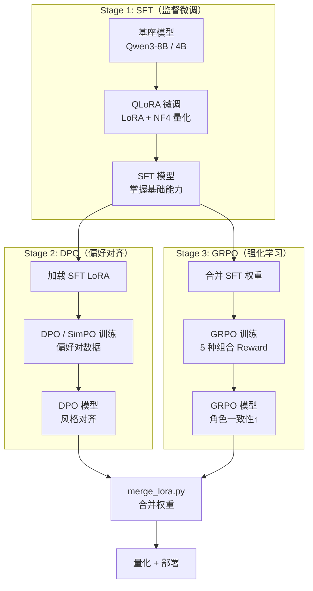
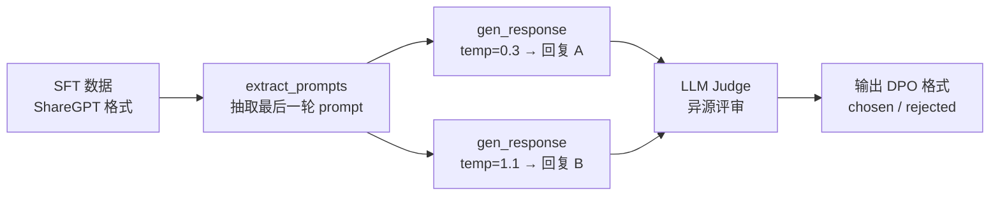
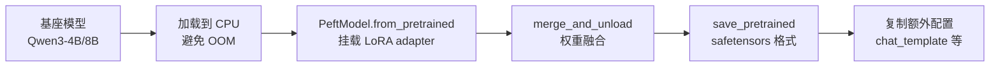
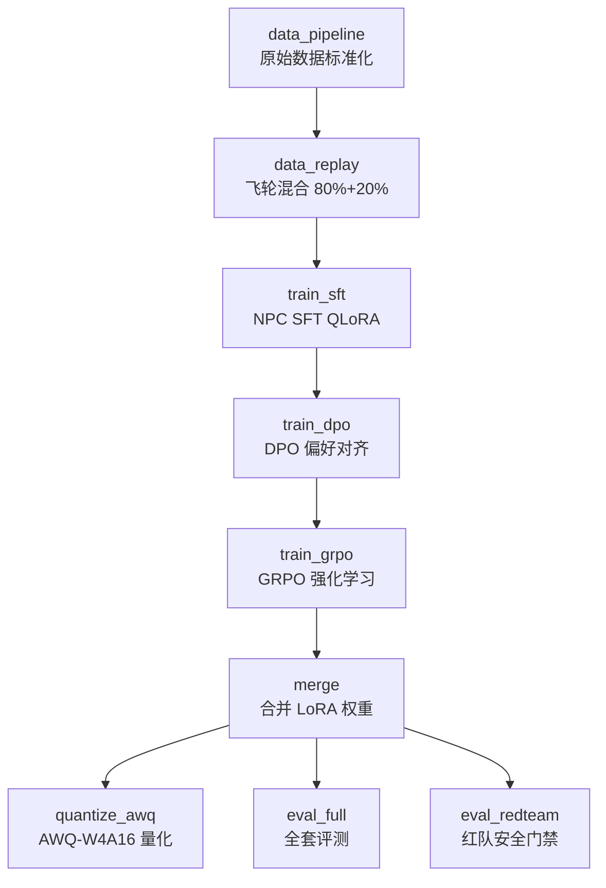

# 02 训练体系详解（SFT / DPO / GRPO）

> **文档定位**：深度解析 `project-llm` 训练层（Training Layer）的完整实现，覆盖三阶段对齐训练、配置设计、自定义奖励函数、显存优化、分布式策略等维度。
>
> **前置阅读**：[00_INDEX.md](./00_INDEX.md)（项目总览）→ [01_DATA_PIPELINE.md](./01_DATA_PIPELINE.md)（数据管道）

---

## 一、训练体系架构总览

### 1.1 三阶段对齐训练范式



### 1.2 双方向训练路线

| 方向 | 基座模型 | SFT 目标 | 对齐策略 | 部署形态 |
|------|---------|---------|---------|---------|
| **知识库专家** | Qwen3-8B | 运维 QA 问答 | DPO（可选） | vLLM + EAGLE-3 |
| **游戏 AINPC** | Qwen3-4B / 1.7B / 0.6B | 多角色对话 + Thinking | DPO（主线）+ GRPO（对比） | Ollama / 端侧 |

### 1.3 训练框架选型

本项目采用 **双轨制**：

| 框架 | 角色 | 优势 | 使用场景 |
|------|------|------|---------|
| **LLaMAFactory** ≥0.9.0 | 主训练框架 | 一键 SFT/DPO/GRPO，原生 Qwen3 + Liger Kernel | 日常训练、生产环境 |
| **TRL** ≥0.12.0 | 备选/自定义 | 灵活控制训练 loop，支持自定义 callback | 需要深度定制时 |
| **PEFT** ≥0.13.0 | LoRA 实现 | QLoRA / DoRA / RSLoRA | 参数高效微调 |
| **DeepSpeed** ≥0.15.0 | 分布式加速 | ZeRO-1/2/3 + Offload | 多卡/大模型场景 |

---

## 二、SFT 监督微调详解

### 2.1 知识库 SFT（`configs/knowledge_sft.yaml`）

#### 2.1.1 配置全解析

```yaml
# ===== 模型配置 =====
model_name_or_path: Qwen/Qwen3-8B    # 2026 主流：Apache 2.0，原生 thinking mode
trust_remote_code: true

# ===== 微调方法 =====
stage: sft
do_train: true
finetuning_type: lora

# ===== QLoRA 量化（24GB 显卡必需）=====
quantization_bit: 4                    # 4-bit 量化
quantization_method: bitsandbytes      # BitsAndBytes 后端
double_quantization: true              # 双重量化，再省 ~0.4bit
quantization_type: nf4                 # NF4 优于 FP4（正态分布友好）

# ===== LoRA 超参 =====
lora_rank: 16                          # 知识注入任务，rank 16 足够
lora_alpha: 32                         # 通常设为 2 * rank
lora_target: all                       # Qwen3 推荐 all 全模块注入（含 MLP）
lora_dropout: 0.05
use_rslora: true                       # Rank-Stabilized LoRA，训练更稳定
use_dora: false                        # DoRA 效果略好但训练慢 30%

# ===== 数据配置 =====
dataset: knowledge_qa                  # 对应 dataset_info.json 中的注册名
dataset_dir: ./data
template: qwen3                        # Qwen3 专用模板（含 thinking block 处理）
cutoff_len: 4096                       # 运维 QA 取 4K 够用
max_samples: 3000
neat_packing: true                     # 样本紧凑打包，吞吐量 +30%

# ===== 训练超参 =====
num_train_epochs: 3
per_device_train_batch_size: 4
gradient_accumulation_steps: 4         # 有效 batch = 4 × 4 = 16
learning_rate: 1.0e-4                  # Qwen3 建议比 Qwen2.5 略低
lr_scheduler_type: cosine
warmup_ratio: 0.1

# ===== Thinking Mode =====
enable_thinking: false                 # 知识库 QA 关闭 thinking，保持答案简洁

# ===== 优化器与显存 =====
optim: adamw_torch_fused               # PyTorch 2.3+ fused Adam，速度 +10%
flash_attn: fa2                        # FlashAttention-2
liger_kernel: true                     # Liger Kernel 融合算子，显存 -20% / 速度 +15%
bf16: true                             # BF16 优于 FP16，Qwen3 官方推荐
```

#### 2.1.2 关键设计决策

| 决策点 | 选择 | 理由 |
|--------|------|------|
| rank=16 vs 64 | 16 | 知识注入任务复杂度低，rank 16 已收敛 |
| `lora_target: all` | 全模块注入 | Qwen3 官方推荐，含 Q/K/V/O + MLP（gate/up/down） |
| `use_rslora: true` | RSLoRA | 高 rank 时梯度更稳定，收敛更快 |
| `neat_packing: true` | 紧凑打包 | 避免 padding 浪费，吞吐量提升 30% |
| `enable_thinking: false` | 关闭 | 知识库 QA 不需要推理链，直接输出答案 |

### 2.2 NPC SFT（`configs/npc_sft.yaml`）

#### 2.2.1 与知识库 SFT 的关键差异

```yaml
# ===== 模型选择（端侧优先）=====
model_name_or_path: Qwen/Qwen3-4B       # 端侧部署推荐 4B
# model_name_or_path: Qwen/Qwen3-1.7B   # 手机端
# model_name_or_path: Qwen/Qwen3-0.6B   # 极致轻量

# ===== LoRA 超参（NPC 需要更强拟合能力）=====
lora_rank: 32                            # 对话风格+人设需要更高 rank
lora_alpha: 64

# ===== 数据配置 =====
dataset: npc_dialogues                   # ShareGPT 多轮对话格式
cutoff_len: 2048                         # NPC 对话 + thinking 需要更长
max_samples: 5000
enable_thinking: true                    # 开启 thinking 模式训练

# ===== 训练超参 =====
num_train_epochs: 5                      # 小数据集可多跑几轮
per_device_train_batch_size: 8           # 4B 模型显存占用小，batch 可以更大
```

#### 2.2.2 NPC vs 知识库 SFT 对比

| 维度 | 知识库 SFT | NPC SFT |
|------|-----------|---------|
| 基座模型 | Qwen3-8B | Qwen3-4B（端侧友好） |
| LoRA rank | 16 | 32（风格拟合需要更高容量） |
| Thinking Mode | 关闭 | 开启（复杂剧情推理） |
| cutoff_len | 4096 | 2048（对话较短） |
| epochs | 3 | 5（数据量小，多轮拟合） |
| batch_size | 4 | 8（模型小，显存余量大） |
| 数据格式 | Alpaca | ShareGPT（多轮对话） |

### 2.3 SFT 训练脚本（TRL 备选路径）

当需要脱离 LLaMAFactory 进行自定义训练时，使用 `scripts/train_sft.py`：

```python
# 核心训练逻辑（TRL SFTTrainer）
from trl import SFTConfig, SFTTrainer
from peft import LoraConfig

# LoRA 配置
peft_cfg = LoraConfig(
    r=16,
    lora_alpha=32,
    lora_dropout=0.05,
    target_modules="all-linear",    # 等价于 LLaMAFactory 的 lora_target: all
    bias="none",
    task_type="CAUSAL_LM",
)

# SFT 训练配置
cfg = SFTConfig(
    output_dir=str(out),
    num_train_epochs=1.0,
    per_device_train_batch_size=2,
    gradient_accumulation_steps=4,
    learning_rate=2e-4,
    lr_scheduler_type="cosine",
    warmup_ratio=0.1,
    bf16=True,
    max_seq_length=2048,
    gradient_checkpointing=True,     # 梯度检查点，显存换时间
)

# 启动训练
trainer = SFTTrainer(
    model=model,
    tokenizer=tok,
    train_dataset=ds,
    args=cfg,
    peft_config=peft_cfg,
)
trainer.train()
```

**适用场景**：
- 面试/评审现场无 LLaMAFactory 环境
- 需要自定义训练 loop / metric / callback
- CI 上做 smoke 训练（10 step ≤1min）

---

## 三、DPO 偏好对齐详解

### 3.1 DPO 原理简述

DPO（Direct Preference Optimization）直接从偏好对数据学习，无需训练单独的 reward model：

```
L_DPO = -E[log σ(β · (log π(y_w|x)/π_ref(y_w|x) - log π(y_l|x)/π_ref(y_l|x)))]
```

其中：
- `y_w` = chosen（更好的回复）
- `y_l` = rejected（较差的回复）
- `β` = KL 散度惩罚系数（控制偏离 ref model 的程度）
- `π_ref` = 参考模型（SFT 后的模型）

### 3.2 知识库 DPO 配置（`configs/knowledge_dpo.yaml`）

```yaml
# ===== 基于 SFT 后的模型继续 DPO =====
model_name_or_path: Qwen/Qwen3-8B
adapter_name_or_path: ./output/knowledge_sft   # 加载 SFT LoRA 作为起点

stage: dpo
finetuning_type: lora

# ===== LoRA（DPO 阶段用较小 rank）=====
lora_rank: 8                     # DPO 只做微调对齐，不需要大容量
lora_alpha: 16

# ===== DPO 核心超参 =====
pref_beta: 0.1                   # KL 散度惩罚系数
pref_loss: sigmoid               # 标准 DPO loss
# pref_loss: simpo               # SimPO 无需 ref model，显存减半
# simpo_gamma: 1.5               # SimPO 的 margin 参数

# ===== 训练超参 =====
num_train_epochs: 2
learning_rate: 5.0e-6            # DPO 比 SFT 小一个数量级（关键！）
```

### 3.3 NPC DPO 配置（`configs/npc_dpo.yaml`）

```yaml
model_name_or_path: Qwen/Qwen3-4B
adapter_name_or_path: ./output/npc_sft    # 加载 NPC SFT 的 LoRA

# ===== LoRA =====
lora_rank: 16                    # NPC 风格对齐需要更高容量
lora_alpha: 32

# ===== DPO 超参 =====
pref_beta: 0.1
pref_loss: sigmoid               # 主线用标准 DPO
# pref_loss: simpo               # SimPO 备选：无需 ref model，显存减半

# ===== 训练超参 =====
num_train_epochs: 2
per_device_train_batch_size: 4
gradient_accumulation_steps: 4
learning_rate: 5.0e-6
```

### 3.4 DPO 偏好对数据构造（`scripts/generate_preference.py`）

#### 3.4.1 构造流程



#### 3.4.2 核心设计：双温度采样 + 异源 Judge

```python
# 双温度采样策略
--temp_a 0.3    # 低温度：稳定、高质量回复（大概率成为 chosen）
--temp_b 1.1    # 高温度：随机、可能跑偏（大概率成为 rejected）

# 异源 Judge：避免自我评价偏差
--gen_provider moonshot      # 生成用 Moonshot（Kimi-K2）
--judge_provider openai      # 评审用 GPT-4o（异源，更客观）
```

#### 3.4.3 Judge Prompt 设计

```python
DPO_JUDGE_PROMPT = """你是游戏对话质量评审专家。请对比以下两个 NPC 回复，选出更好的一个。

评判标准（按优先级）：
1. 角色一致性（是否完全符合角色设定与说话风格）
2. 对话趣味性（是否有代入感，不是 AI 腔）
3. 世界观一致性（用词/背景是否符合游戏设定）
4. 玩家体验（是否让玩家想继续互动）

只输出 JSON：{"chosen":"A"或"B","reason":"简短理由"}
"""
```

#### 3.4.4 输出格式（LLaMAFactory pairwise 模板）

```json
{
  "system": "你是游戏中的NPC...",
  "conversations": [
    {"from": "human", "value": "老板，这把剑多少钱？"}
  ],
  "chosen":   {"from": "gpt", "value": "嘿，冒险者！这把「月光之刃」..."},
  "rejected": {"from": "gpt", "value": "这把剑的价格是500金币。"}
}
```

### 3.5 DPO 变体对比

| 变体 | 公式特点 | 优势 | 劣势 | 配置方式 |
|------|---------|------|------|---------|
| **DPO (sigmoid)** | 标准 sigmoid loss | 最稳定，理论保证 | 需要 ref model（显存 ×2） | `pref_loss: sigmoid` |
| **SimPO** | 无 ref model + margin | 显存减半，效果略优 | 超参敏感（γ） | `pref_loss: simpo` |
| **IPO** | 正则化 DPO | 防止过拟合 | 收敛慢 | `pref_loss: ipo` |
| **ORPO** | SFT + DPO 一步到位 | 省一个阶段 | 效果不如两阶段 | `pref_loss: orpo` |
| **KTO** | 无需 pairwise 数据 | 数据要求低 | 效果略弱 | TRL 原生支持 |

### 3.6 TRL 原生 DPO 训练（备选路径）

`scripts/train_dpo_trl.py` 提供了脱离 LLaMAFactory 的 DPO 训练入口：

```python
# TRL DPOTrainer 核心接口（TODO phase-3 完整实现）
from trl import DPOConfig, DPOTrainer
from peft import LoraConfig

# 量化配置
bnb = BitsAndBytesConfig(
    load_in_4bit=True,
    bnb_4bit_quant_type="nf4",
    bnb_4bit_use_double_quant=True
)

# DPO 训练配置
cfg = DPOConfig(
    output_dir=args.output_dir,
    beta=0.1,                    # KL 惩罚
    loss_type="sigmoid",         # sigmoid / hinge / ipo / simpo / orpo
    learning_rate=5e-6,
    num_train_epochs=2,
    per_device_train_batch_size=4,
    gradient_accumulation_steps=4,
    max_length=2048,
    max_prompt_length=1024,
)

# LoRA 配置
peft_cfg = LoraConfig(
    r=16, lora_alpha=32,
    target_modules="all-linear",
    task_type="CAUSAL_LM",
    use_rslora=True
)

trainer = DPOTrainer(
    model=model, args=cfg,
    train_dataset=ds,
    tokenizer=tokenizer,
    peft_config=peft_cfg
)
trainer.train()
```

---

## 四、GRPO 强化学习详解

### 4.1 GRPO 原理

GRPO（Group Relative Policy Optimization）是 DeepSeek-R1 同款 RL 算法，核心思想：

1. 对每个 prompt 生成一组（group）rollout
2. 组内相对排序，无需绝对 reward model
3. 用 rule-based reward 替代 LLM reward model，可验证性更强

```
L_GRPO = -E_group[ Σ_i (r_i - mean(r)) / std(r) · log π(y_i|x) - β · KL(π||π_ref) ]
```

### 4.2 GRPO 配置（`configs/npc_grpo.yaml`）

```yaml
# ===== 前置：需先 merge npc_sft 得到完整权重 =====
model_name_or_path: ./output/npc_sft_merged

stage: grpo                      # LLaMAFactory 0.9+ 原生支持
finetuning_type: lora

# ===== LoRA =====
lora_rank: 16
lora_alpha: 32
use_rslora: true

# ===== GRPO 核心超参 =====
num_generations: 8               # 每个 prompt 生成 8 个 rollout 形成 group
max_new_tokens: 512              # 每个 rollout 最大生成长度
beta: 0.04                       # KL 惩罚，比 DPO 更小（鼓励探索）

# ===== 自定义 reward 函数 =====
reward_funcs:
  - role_consistency_reward      # 角色一致性（LLM Judge）
  - scenario_coherence_reward    # 剧情关键词覆盖
  - format_reward                # 格式奖励（<think>...</think>）

# ===== 训练超参 =====
num_train_epochs: 1
per_device_train_batch_size: 1   # GRPO 显存占用高（8 个 rollout）
gradient_accumulation_steps: 8
learning_rate: 5.0e-6
```

### 4.3 自定义奖励函数（`scripts/grpo_rewards.py`）⭐ 核心亮点

#### 4.3.1 设计原则

参考 DeepSeek-R1 / DeepSeekMath 的 rule-based reward 设计：

1. **可组合**：每个 reward 函数独立返回 `list[float]`，训练器自动加权平均
2. **可验证**：优先用规则 reward（format / scenario_keyword），LLM reward 作为补充
3. **接口统一**：`(completions, prompts=None, **kwargs) -> list[float]`

#### 4.3.2 五种奖励函数详解

##### ① format_reward — 格式奖励（最有效的 rule-based reward）

```python
_THINK_PATTERN = re.compile(r"<think>(.*?)</think>", re.DOTALL)

def format_reward(completions: Sequence[str], **kwargs) -> list[float]:
    """thinking 场景必须产出 <think>...</think> 后再回答。
    1.0 = 有 think 且后续有 answer
    0.5 = 只有 think 无 answer
    0.2 = think 内容过短
    0.0 = 无 think"""
    rewards: list[float] = []
    for c in completions:
        m = _THINK_PATTERN.search(c or "")
        if not m:
            rewards.append(0.0)
            continue
        think_body = m.group(1).strip()
        rest = (c[: m.start()] + c[m.end():]).strip()
        if len(think_body) >= 10 and len(rest) >= 5:
            rewards.append(1.0)
        elif len(think_body) >= 10:
            rewards.append(0.5)
        else:
            rewards.append(0.2)
    return rewards
```

##### ② scenario_coherence_reward — 剧情关键词覆盖

```python
def scenario_coherence_reward(
    completions: Sequence[str],
    scenario_expected: Sequence[Sequence[str]] | None = None,
    **kwargs,
) -> list[float]:
    """NPC 回复是否触发了期望的关键词集合。
    奖励 = 命中关键词数 / 总关键词数"""
    for c, expected in zip(completions, scenario_expected):
        hit = sum(1 for kw in expected if kw in (c or ""))
        rewards.append(hit / max(len(expected), 1))
    return rewards
```

##### ③ action_format_reward — 操作指令合规

```python
_ACTION_PATTERN = re.compile(r"\[(GIVE_ITEM|START_QUEST|TRADE|END_QUEST):([^\]]+)\]")

def action_format_reward(completions, expected_action=None, **kwargs):
    """操作指令奖励：
    - 未要求指令 + 未输出指令      → 1.0（正确抑制）
    - 未要求指令 + 乱输出指令       → 0.0（幻觉惩罚）
    - 要求指令 + 输出对应指令       → 1.0（正确触发）
    - 要求指令 + 输出其他指令       → 0.3（部分正确）
    - 要求指令 + 未输出指令         → 0.0（遗漏惩罚）"""
```

##### ④ length_penalty_reward — 长度惩罚

```python
def length_penalty_reward(completions, min_len=20, max_len=500, **kwargs):
    """长度合规奖励：[min_len, max_len] 区间内线性过渡。
    sweet spot: [min_len+20, max_len-100] 区间得满分 1.0
    超出 [min_len, max_len] 直接 0.0"""
```

##### ⑤ role_consistency_reward — 角色一致性（LLM Judge）

```python
def role_consistency_reward(completions, prompts=None, npc_profiles=None, **kwargs):
    """角色一致性（LLM Judge）。
    - 延迟初始化 Judge 客户端（优先 Kimi-K2，回退 GPT-4o-mini）
    - 评判要点：性格/说话风格、用词得体、角色专业知识
    - 输出 0.0~1.0 浮点分数
    - 占训练中 ~40% API cost（重量级）"""
```

Judge Prompt 设计：
```python
_ROLE_JUDGE_PROMPT = """你是游戏 NPC 质量评审。请给以下 NPC 回复按"角色一致性"打 0-1 分。

评判要点：
- 是否符合角色的性格/说话风格
- 是否用词得体，无 AI 腔
- 是否体现角色专业知识

只输出 JSON：{"score": 0.0 到 1.0 的浮点数}"""
```

#### 4.3.3 组合器与权重分配

```python
# 默认权重分配
default_weights = {
    "format_reward": 0.3,              # 格式最重要（可验证）
    "length_penalty_reward": 0.1,      # 长度辅助
    "action_format_reward": 0.2,       # 指令合规
    "scenario_coherence_reward": 0.2,  # 剧情覆盖
    "role_consistency_reward": 0.2,    # LLM Judge（成本高）
}

def combined_reward(completions, weights=None, **kwargs):
    """把多个 reward 加权求和（用于不支持多 reward_funcs 的后端）"""
```

#### 4.3.4 GRPO vs DPO 对比

| 维度 | DPO | GRPO |
|------|-----|------|
| 数据需求 | pairwise 偏好对 | 仅需 prompt 列表 |
| Reward | 隐式（从偏好对学习） | 显式（自定义 reward 函数） |
| 可解释性 | 低（黑盒偏好） | 高（每个 reward 可独立观测） |
| 训练成本 | 低（一次前向） | 高（N 次 rollout + reward 计算） |
| 适用场景 | 风格对齐 | 规则可验证的任务（格式/指令） |
| 本项目定位 | 主线（NPC 风格） | 对比实验（角色一致性） |

---

## 五、LoRA 权重合并（`scripts/merge_lora.py`）

### 5.1 合并流程



### 5.2 核心代码

```python
from peft import PeftModel
from transformers import AutoModelForCausalLM, AutoTokenizer

# [1] 加载基座（CPU，避免 GPU OOM）
base = AutoModelForCausalLM.from_pretrained(
    args.base,
    torch_dtype=torch.bfloat16,
    device_map="cpu",
    low_cpu_mem_usage=True,
)

# [2] 挂载 LoRA adapter
model = PeftModel.from_pretrained(base, args.lora)

# [3] 合并权重（W_merged = W_base + α/r × B×A）
merged = model.merge_and_unload()

# [4] 保存为标准 HF 格式（可被 vLLM / SGLang / llama.cpp 直接加载）
merged.save_pretrained(out, max_shard_size="4GB", safe_serialization=True)
```

### 5.3 使用方式

```bash
# 合并 NPC GRPO 训练后的 LoRA
python scripts/merge_lora.py \
    --base Qwen/Qwen3-4B \
    --lora output/npc_grpo \
    --out  output/npc_merged \
    --dtype bfloat16
```

---

## 六、数据集注册与管理

### 6.1 LLaMAFactory 数据集注册（`data/dataset_info.json`）

```json
{
    "knowledge_qa": {
        "file_name": "processed/knowledge_qa.json",
        "formatting": "alpaca",
        "columns": {
            "prompt": "instruction",
            "query": "input",
            "response": "output"
        }
    },
    "npc_dialogues": {
        "file_name": "processed/npc_dialogues.json",
        "formatting": "sharegpt",
        "columns": {
            "messages": "conversations",
            "system": "system"
        },
        "tags": {
            "role_tag": "from",
            "content_tag": "value",
            "user_tag": "human",
            "assistant_tag": "gpt"
        }
    },
    "npc_dpo": {
        "file_name": "processed/npc_dpo.json",
        "formatting": "sharegpt",
        "ranking": true,
        "columns": {
            "messages": "conversations",
            "chosen": "chosen",
            "rejected": "rejected",
            "system": "system"
        }
    },
    "npc_grpo_prompts": {
        "file_name": "processed/npc_grpo_prompts.json",
        "formatting": "alpaca",
        "columns": { "prompt": "prompt" }
    }
}
```

### 6.2 数据格式对照

| 数据集 | 格式 | 用途 | 关键字段 |
|--------|------|------|---------|
| `knowledge_qa` | Alpaca | 知识库 SFT | instruction / input / output |
| `knowledge_dpo` | ShareGPT + ranking | 知识库 DPO | conversations / chosen / rejected |
| `npc_dialogues` | ShareGPT | NPC SFT | conversations / system |
| `npc_dpo` | ShareGPT + ranking | NPC DPO | conversations / chosen / rejected / system |
| `npc_grpo_prompts` | Alpaca (prompt-only) | NPC GRPO | prompt（+ 额外列传给 reward） |

---

## 七、DVC 流水线（可复现化）

### 7.1 流水线 DAG



### 7.2 DVC 配置（`dvc.yaml`）

```yaml
stages:
  train_sft:
    cmd: llamafactory-cli train configs/npc_sft.yaml
    deps:
      - configs/npc_sft.yaml
      - data/processed/replay.jsonl
    outs:
      - output/npc_sft

  train_dpo:
    cmd: llamafactory-cli train configs/npc_dpo.yaml
    deps:
      - configs/npc_dpo.yaml
      - output/npc_sft              # 依赖 SFT 产物
    outs:
      - output/npc_dpo

  train_grpo:
    cmd: llamafactory-cli train configs/npc_grpo.yaml
    deps:
      - configs/npc_grpo.yaml
      - output/npc_dpo              # 依赖 DPO 产物
      - data/processed/npc_grpo_prompts.json
    outs:
      - output/npc_grpo

  merge:
    cmd: python scripts/merge_lora.py --base Qwen/Qwen3-4B --lora output/npc_grpo --out output/npc_merged
    deps:
      - scripts/merge_lora.py
      - output/npc_grpo
    outs:
      - output/npc_merged
```

### 7.3 使用方式

```bash
dvc init                    # 初始化 DVC
dvc repro                   # 全链路重跑（自动跳过未变更的阶段）
dvc repro train_sft         # 单跑某阶段
dvc dag                     # 查看依赖图
```

---

## 八、显存优化策略

### 8.1 显存组成分析

```
单卡显存 = 模型参数 + 梯度 + 优化器状态 + 激活值 + KV Cache

Qwen3-8B BF16 全参训练（不开 ZeRO）：
  参数:     16 GB
  梯度:     16 GB
  Adam:     64 GB  ← 占大头（m + v + fp32 master copy）
  激活值:  ~10 GB
  合计:   ~106 GB  → 单卡 A100 80GB 都装不下！
```

### 8.2 QLoRA 显存节省原理

```
QLoRA 显存 = NF4 量化参数 + LoRA 参数(BF16) + LoRA 梯度 + LoRA Adam 状态 + 激活值

Qwen3-8B QLoRA (rank=16, all-linear):
  NF4 参数:    ~4.5 GB（8B × 4bit / 8 + 双重量化开销）
  LoRA 参数:   ~0.1 GB（可训练参数仅 ~50M）
  LoRA 梯度:   ~0.1 GB
  LoRA Adam:   ~0.4 GB
  激活值:      ~4-8 GB（取决于 seq_len 和 batch）
  合计:       ~9-13 GB  → 24GB 单卡轻松搞定！
```

### 8.3 优化技术栈

| 技术 | 效果 | 配置方式 |
|------|------|---------|
| **QLoRA (NF4)** | 参数显存 -75% | `quantization_bit: 4` |
| **双重量化** | 再省 ~0.4bit | `double_quantization: true` |
| **Liger Kernel** | 显存 -20%，速度 +15% | `liger_kernel: true` |
| **FlashAttention-2** | 注意力显存 O(N) → O(√N) | `flash_attn: fa2` |
| **Gradient Checkpointing** | 激活值显存 -60%（换时间） | `gradient_checkpointing: true` |
| **neat_packing** | 减少 padding 浪费 | `neat_packing: true` |
| **Fused Adam** | 优化器速度 +10% | `optim: adamw_torch_fused` |
| **BF16** | 避免 FP16 溢出 | `bf16: true` |

### 8.4 显存实测数据

| 配置 | 单卡显存峰值 | 单步耗时 | 有效 batch |
|------|-----------|---------|-----------|
| QLoRA（无 ZeRO） | 19.2 GB | 0.85s | 16 |
| QLoRA + ZeRO-2 (optim offload) | **14.8 GB** | 1.02s | 16 |
| QLoRA + ZeRO-3 (param+optim offload) | **9.5 GB** | 1.45s | 16 |
| QLoRA + GradCkpt + Liger + FA3 | **10.8 GB** | 1.10s | 16 |
| 上 + ZeRO-3（双卡） | **6.1 GB** | 0.95s | 32 |

### 8.5 显存监控工具（`scripts/memory_profile.py`）

```python
from scripts.memory_profile import MemoryProfiler

# 作为 callback 嵌入训练
profiler = MemoryProfiler("logs/memory_knowledge_sft.csv")
for step, batch in enumerate(loader):
    # ... 训练逻辑 ...
    if step % 10 == 0:
        profiler.log(step)  # 记录 allocated / reserved / peak
profiler.summary()          # 输出峰值统计

# CLI 分析历史 log
python scripts/memory_profile.py --log logs/memory_knowledge_sft.csv --plot
```

---

## 九、分布式训练策略

### 9.1 选型决策树

```
模型规模 → 推荐策略：
  < 7B    → 单卡 / 梯度累积（本项目 QLoRA 场景）
  7B-30B  → FSDP / ZeRO-3
  30B-100B → FSDP + TP（需 NVLink）
  100B+   → 3D 并行（TP + PP + ZeRO-1）
```

### 9.2 本项目实际使用

| 场景 | 策略 | 配置 |
|------|------|------|
| Qwen3-8B QLoRA（24GB 单卡） | 无 ZeRO | 默认配置即可 |
| Qwen3-8B QLoRA（16GB 单卡） | ZeRO-2 + Offload | DeepSpeed ds_zero2.json |
| Qwen3-8B 全参（多卡） | ZeRO-3 / FSDP | DeepSpeed ds_zero3.json |
| Qwen3-4B QLoRA（端侧验证） | 单卡 | 默认配置 |

### 9.3 DeepSpeed 配置示例

```json
// infra/distributed/ds_zero2.json
{
  "zero_optimization": {
    "stage": 2,
    "offload_optimizer": { "device": "cpu" },
    "allgather_partitions": true,
    "reduce_scatter": true,
    "overlap_comm": true
  },
  "bf16": { "enabled": true },
  "gradient_accumulation_steps": 4,
  "train_micro_batch_size_per_gpu": 4
}
```

---

## 十、端到端训练流水线

### 10.1 知识库方向（`scripts/run_knowledge_pipeline.sh`）

```bash
# 六步流水线
Step 1: generate_qa.py          # Wiki → QA 合成
Step 2: data_quality.py         # 五步质量过滤
Step 3: format_data.py          # 格式化为 Alpaca
Step 4: llamafactory-cli train  # QLoRA-SFT 训练
Step 5: llamafactory-cli export # 合并 LoRA
Step 6: evaluate.py             # 全套评测

# 使用
bash scripts/run_knowledge_pipeline.sh              # 完整流程
SMOKE=1 bash scripts/run_knowledge_pipeline.sh      # 快速验证
SKIP_TRAIN=1 bash scripts/run_knowledge_pipeline.sh # 只跑数据+评估
```

### 10.2 NPC 方向（`scripts/run_npc_pipeline.sh`）

```bash
# 五步流水线（含 DPO/GRPO 双分支）
Step 1: generate_dialogue.py    # 多角色对话合成
Step 2: llamafactory-cli train  # NPC SFT (QLoRA)
Step 3: llamafactory-cli export # 合并 SFT LoRA
Step 4a: generate_preference.py + DPO 训练  # DPO 分支
Step 4b: llamafactory-cli train npc_grpo    # GRPO 分支
Step 5: evaluate.py × 3        # 三路对比评估（SFT / DPO / GRPO）

# 使用
bash scripts/run_npc_pipeline.sh                    # 完整
SMOKE=1 bash scripts/run_npc_pipeline.sh            # 数据链路验证
SKIP_GRPO=1 bash scripts/run_npc_pipeline.sh        # 只 SFT + DPO
```

### 10.3 Makefile 快捷命令

```bash
make train-sft                  # SFT 训练（DOMAIN=npc|knowledge）
make train-dpo                  # DPO 偏好对齐
make train-grpo                 # GRPO 强化学习
DOMAIN=knowledge make train-sft # 切换到知识库域
```

---

## 十一、依赖框架深度解析

### 11.1 LLaMAFactory（主训练框架）

| 特性 | 说明 |
|------|------|
| 版本要求 | ≥0.9.0 |
| 核心能力 | 一键 SFT / DPO / GRPO / ORPO / KTO |
| Qwen3 支持 | 原生模板 + thinking mode 处理 |
| Liger Kernel | 内置集成，`liger_kernel: true` 即可 |
| 数据格式 | Alpaca / ShareGPT / pairwise 全支持 |
| 量化 | BitsAndBytes NF4 / GPTQ / AWQ |
| 分布式 | DeepSpeed ZeRO / FSDP 透明集成 |
| 导出 | `llamafactory-cli export` 一键合并 LoRA |

### 11.2 TRL（Transformer Reinforcement Learning）

| 特性 | 说明 |
|------|------|
| 版本要求 | ≥0.12.0 |
| 核心能力 | SFTTrainer / DPOTrainer / GRPOTrainer |
| DPO 变体 | sigmoid / hinge / ipo / simpo / orpo / kto |
| GRPO | 原生支持自定义 reward_funcs |
| 优势 | 灵活控制训练 loop，支持自定义 callback |
| 本项目用途 | 备选训练路径 + 自定义实验 |

### 11.3 PEFT（Parameter-Efficient Fine-Tuning）

| 特性 | 说明 |
|------|------|
| 版本要求 | ≥0.13.0 |
| 支持方法 | LoRA / QLoRA / DoRA / RSLoRA / AdaLoRA |
| 关键 API | `LoraConfig` / `PeftModel.from_pretrained` / `merge_and_unload` |
| target_modules | `"all-linear"` = Q/K/V/O + gate/up/down（Qwen3 推荐） |
| RSLoRA | `use_rslora=True`，高 rank 时梯度更稳定 |

### 11.4 Liger Kernel

| 特性 | 说明 |
|------|------|
| 版本要求 | ≥0.4.0 |
| 原理 | Triton 实现的融合算子（RMSNorm + SwiGLU + CrossEntropy + Rope） |
| 效果 | 显存 -20%，训练速度 +15% |
| 使用 | `liger_kernel: true`（LLaMAFactory 一行配置） |
| 兼容性 | 支持 Qwen3 / LLaMA3 / Mistral 等主流架构 |

### 11.5 BitsAndBytes

| 特性 | 说明 |
|------|------|
| 版本要求 | ≥0.44.0 |
| 核心能力 | NF4 / FP4 量化 + 双重量化 |
| NF4 vs FP4 | NF4 对正态分布权重更友好，精度损失更小 |
| 双重量化 | 对量化常数再量化，额外节省 ~0.4bit/param |
| 使用 | `quantization_bit: 4` + `quantization_type: nf4` |

---

## 十二、关键超参调优指南

### 12.1 学习率选择

| 阶段 | 推荐学习率 | 理由 |
|------|-----------|------|
| SFT | 1e-4 | 标准 LoRA 微调学习率 |
| DPO | 5e-6 | 比 SFT 小一个数量级，避免偏离 ref model |
| GRPO | 5e-6 | 与 DPO 相当，KL 惩罚已限制偏离 |

### 12.2 LoRA rank 选择

| 任务复杂度 | 推荐 rank | 示例 |
|-----------|-----------|------|
| 简单知识注入 | 8-16 | 知识库 QA |
| 风格/人设拟合 | 32-64 | NPC 对话 |
| DPO 微调对齐 | 8-16 | 偏好对齐（变化小） |
| GRPO 强化 | 16 | 角色一致性强化 |

### 12.3 batch size 与梯度累积

```
有效 batch = per_device_batch × gradient_accumulation × num_gpus

知识库 SFT: 4 × 4 × 1 = 16
NPC SFT:    8 × 2 × 1 = 16
NPC DPO:    4 × 4 × 1 = 16
NPC GRPO:   1 × 8 × 1 = 8（GRPO 显存高，batch 小）
```

---

## 十三、面试要点速查

### 13.1 高频问题

> **Q：为什么选 QLoRA 而不是全参微调？**
>
> A：Qwen3-8B 全参 BF16 训练需要 ~106GB 显存（参数 16G + 梯度 16G + Adam 64G + 激活 10G），单卡 A100 80GB 都装不下。QLoRA 通过 NF4 量化基座 + 只训练 LoRA 参数（~50M），把显存压到 ~10GB，24GB 消费级显卡就能跑。精度损失在 0.5% 以内（QLoRA 论文实测）。

> **Q：DPO 和 GRPO 怎么选？**
>
> A：看任务特点。DPO 适合「风格对齐」——有明确的好坏偏好但难以用规则量化（如 NPC 说话风格）。GRPO 适合「规则可验证」的任务——能写出 reward 函数（如格式是否正确、关键词是否覆盖）。我项目里 DPO 是主线（NPC 风格），GRPO 是对比实验（验证 rule-based reward 的效果）。

> **Q：Liger Kernel 为什么能省显存？**
>
> A：Liger Kernel 用 Triton 实现了 RMSNorm + SwiGLU + CrossEntropy + RoPE 的融合算子。融合的好处是减少中间激活值的 materialization——原本每个算子都要把中间结果写回 HBM，融合后在 SRAM 里直接流转，省了大量显存带宽和存储。实测 Qwen3-8B 训练显存 -20%、速度 +15%。

> **Q：RSLoRA 是什么？为什么用它？**
>
> A：RSLoRA（Rank-Stabilized LoRA）在标准 LoRA 的 scaling factor `α/r` 基础上改为 `α/√r`。当 rank 较高时（如 32/64），标准 LoRA 的梯度会随 rank 增大而缩小，导致训练不稳定。RSLoRA 通过 √r 归一化让不同 rank 的梯度量级一致，收敛更快更稳。

> **Q：GRPO 的 reward 函数怎么设计？**
>
> A：遵循三个原则：① 可组合（每个 reward 独立，训练器加权平均）；② 优先 rule-based（format/keyword 可验证，不依赖 LLM）；③ LLM Judge 作为补充（角色一致性难以规则化，用 Kimi-K2 打分）。我设计了 5 种 reward：格式(0.3) + 长度(0.1) + 指令(0.2) + 剧情(0.2) + 角色(0.2)，权重按可验证性分配。

### 13.2 技术亮点总结

| 亮点 | 描述 |
|------|------|
| 三阶段对齐 | SFT → DPO → GRPO 渐进式训练 |
| 双温度 + 异源 Judge | DPO 数据构造的核心创新 |
| 5 种组合 Reward | GRPO 的 rule-based + LLM Judge 混合设计 |
| QLoRA + Liger + FA2 | 24GB 单卡跑 8B 模型的显存优化组合 |
| DVC 可复现 | 9 阶段流水线，一键 `dvc repro` |
| 双轨训练框架 | LLaMAFactory（生产）+ TRL（自定义） |
| Thinking Mode | NPC 开启、知识库关闭的差异化策略 |

---

## 十四、文件索引

| 文件 | 路径 | 职责 |
|------|------|------|
| 知识库 SFT 配置 | `configs/knowledge_sft.yaml` | Qwen3-8B QLoRA 微调 |
| 知识库 DPO 配置 | `configs/knowledge_dpo.yaml` | 可选偏好对齐 |
| NPC SFT 配置 | `configs/npc_sft.yaml` | Qwen3-4B QLoRA + Thinking |
| NPC DPO 配置 | `configs/npc_dpo.yaml` | NPC 偏好对齐（主线） |
| NPC GRPO 配置 | `configs/npc_grpo.yaml` | 强化学习对比实验 |
| GRPO 奖励函数 | `scripts/grpo_rewards.py` | 5 种组合 reward |
| SFT 训练脚本 | `scripts/train_sft.py` | TRL 备选路径 |
| DPO 训练脚本 | `scripts/train_dpo_trl.py` | TRL DPO 备选 |
| LoRA 合并 | `scripts/merge_lora.py` | 权重融合 |
| 偏好对构造 | `scripts/generate_preference.py` | DPO 数据生成 |
| GRPO Prompt 构造 | `scripts/generate_grpo_prompts.py` | GRPO 数据生成 |
| 显存监控 | `scripts/memory_profile.py` | 训练显存 Profiler |
| 数据集注册 | `data/dataset_info.json` | LLaMAFactory 数据集配置 |
| DVC 流水线 | `dvc.yaml` | 可复现化流水线定义 |
| 知识库流水线 | `scripts/run_knowledge_pipeline.sh` | 方向一端到端 |
| NPC 流水线 | `scripts/run_npc_pipeline.sh` | 方向二端到端 |
| 分布式策略 | `infra/distributed/parallelism_matrix.md` | 并行策略对照表 |

---

> **下一篇**：[03_QUANTIZATION.md](./03_QUANTIZATION.md) — 量化方案全解析（FP8 / AWQ / GPTQ / GGUF）
