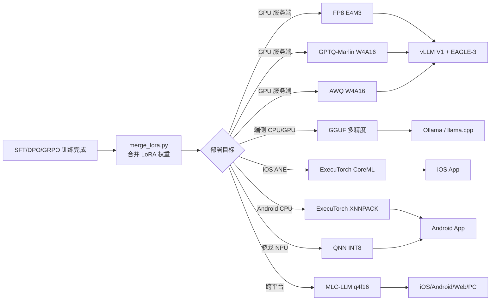
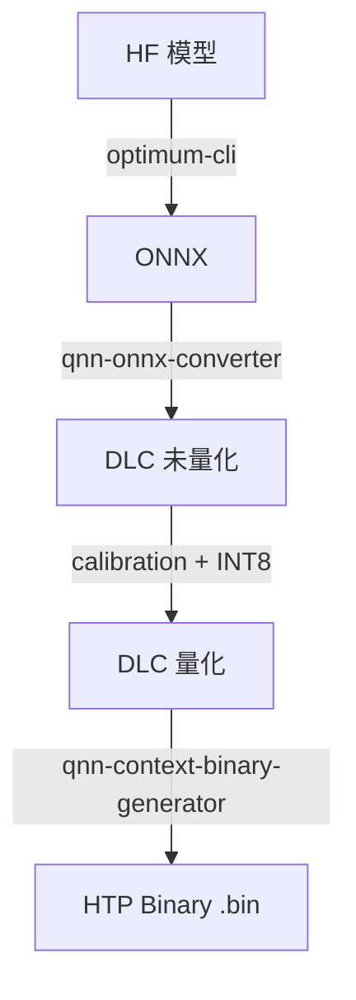
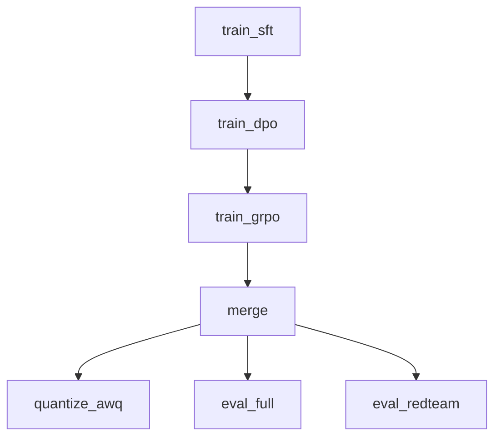

# 03 — 量化方案全解析（FP8 / AWQ / GPTQ-Marlin / GGUF + 端侧）

> **文档定位**：深度解析 `project-llm` 项目中从 GPU 服务端到移动端的全量化体系，覆盖 4 种 GPU 侧量化方案 + 4 种端侧部署量化路径。
>
> **前置阅读**：[02_TRAINING_SYSTEM.md](./02_TRAINING_SYSTEM.md)（训练产出 → 合并权重 → 进入量化）

---

## 一、量化在全链路中的位置



---

## 二、前置步骤：LoRA 权重合并

量化的输入是**合并后的完整 HF 权重目录**，由 `scripts/merge_lora.py` 产出。

### 2.1 核心流程

```python
# scripts/merge_lora.py 关键逻辑
# [1] 加载基座模型（CPU，避免 OOM）
base = AutoModelForCausalLM.from_pretrained(
    args.base, torch_dtype=dtype, device_map="cpu", low_cpu_mem_usage=True
)
# [2] 挂载 LoRA adapter
model = PeftModel.from_pretrained(base, args.lora)
# [3] 合并并卸载 adapter
merged = model.merge_and_unload()
# [4] 保存为标准 safetensors
merged.save_pretrained(out, max_shard_size="4GB", safe_serialization=True)
```

### 2.2 使用方式

```bash
python scripts/merge_lora.py \
    --base Qwen/Qwen3-8B \
    --lora output/knowledge_dpo \
    --out  output/knowledge_sft_merged \
    --dtype bfloat16
```

### 2.3 依赖

| 库 | 版本 | 用途 |
|----|------|------|
| `peft` | ≥0.13.0 | `PeftModel.from_pretrained` + `merge_and_unload` |
| `transformers` | ≥4.45.0 | 模型加载 |
| `torch` | ≥2.4.0 | 张量运算 |

---

## 三、统一量化配置（configs/quantize.yaml）

项目使用一份 YAML 统一管理两大方向的量化参数：

```yaml
# 知识库方向（GPU 侧）
knowledge:
  input_model: ./output/knowledge_sft_merged
  calib_dataset: ./data/processed/knowledge_qa.json
  calib_samples: 512
  fp8:
    scheme: FP8_DYNAMIC           # 或 FP8_STATIC
    targets: [Linear]
    ignore: [lm_head]
  gptq_marlin:
    bits: 4
    group_size: 128
    desc_act: true
    sym: true
    damp_percent: 0.01
  awq:
    bits: 4
    group_size: 128
    zero_point: true
    version: GEMM

# NPC 方向（端侧）
npc:
  input_model: ./output/npc_merged
  gguf:
    precisions: [q4_k_m, iq4_xs, q4_k_s, q2_k]
  executorch:
    bits: 4
    group_size: 128
    backends: {ios: coreml, android: xnnpack}
  qnn:
    quant_type: int8
    htp_backend: true
  mlc:
    quantization: q4f16_1
```

**设计理念**：
- 一份配置文件管理所有量化方案，避免参数散落
- `enable` 字段控制哪些方案实际执行
- 校准数据集统一指定，确保可复现

---

## 四、GPU 侧量化方案详解

### 4.1 FP8 E4M3 量化（首选方案）

#### 4.1.1 技术原理

FP8（E4M3 格式）是 Hopper/Ada 架构引入的原生数据类型：
- **E4M3**：4 位指数 + 3 位尾数，动态范围 ±448，精度损失 <1%
- **W8A8**：权重和激活都用 FP8，Tensor Core 原生加速
- **近乎无损**：相比 BF16 精度回退极小，但吞吐提升 60%~80%

```
┌─────────────────────────────────────────────────┐
│           FP8 E4M3 数据格式（8 bit）              │
├─────────────────────────────────────────────────┤
│  Sign(1) │ Exponent(4) │ Mantissa(3)            │
│    S     │  E E E E    │  M M M                 │
├─────────────────────────────────────────────────┤
│  动态范围：±448                                   │
│  精度：约 2^-3 ≈ 0.125 ULP                       │
│  对比 BF16：范围缩小但对 LLM 权重分布足够         │
└─────────────────────────────────────────────────┘
```

#### 4.1.2 两种模式对比

| 模式 | 是否需要 Calibration | 精度 | 速度 | 适用场景 |
|------|---------------------|------|------|---------|
| **FP8_DYNAMIC** | ❌ 不需要 | 略低 | 快（无额外开销） | 快速部署、精度不敏感 |
| **FP8_STATIC** | ✅ 需要 512+ 样本 | 略优 | 稍慢（需预计算 scale） | 生产环境、精度敏感 |

#### 4.1.3 核心代码走读

```python
# scripts/quantize_fp8.py 核心逻辑

from llmcompressor.modifiers.quantization import QuantizationModifier
from llmcompressor.transformers import oneshot

# 加载模型（自动选择 dtype 和 device）
model = AutoModelForCausalLM.from_pretrained(
    args.model, torch_dtype="auto", device_map="auto", trust_remote_code=True
)

# 构建量化 recipe
recipe = QuantizationModifier(
    targets="Linear",          # 量化所有 Linear 层
    scheme=args.scheme,        # FP8_DYNAMIC 或 FP8_STATIC
    ignore=args.ignore,        # 跳过 lm_head（对精度敏感）
)

# 一键量化（oneshot = 无需训练，直接转换）
oneshot(model=model, recipe=recipe, output_dir=str(out), **calib_kwargs)
```

**关键设计决策**：
- `ignore=["lm_head"]`：lm_head 是 logits 输出层，FP8 精度不足会导致 token 概率分布偏移
- `targets="Linear"`：只量化 Linear 层，LayerNorm/Embedding 保持原精度
- Calibration 数据使用 ShareGPT 格式，与训练数据同源

#### 4.1.4 Calibration 数据加载

```python
def load_calib_texts(path: str, n: int) -> list[str]:
    """从 ShareGPT 格式加载 n 条文本用于 FP8 静态 calibration"""
    data = json.loads(Path(path).read_text(encoding="utf-8"))
    texts: list[str] = []
    for sample in data[:n]:
        convs = sample.get("conversations") or []
        buf = []
        for c in convs:
            role = c.get("from", "")
            val = c.get("value", "")
            # 按 Qwen3 ChatML 格式拼接
            if role in ("human", "user"):
                buf.append(f"<|im_start|>user\n{val}<|im_end|>")
            elif role in ("gpt", "assistant"):
                buf.append(f"<|im_start|>assistant\n{val}<|im_end|>")
        if buf:
            texts.append("\n".join(buf))
    return texts
```

#### 4.1.5 使用命令

```bash
# FP8 Dynamic（推荐，无需 calibration）
python scripts/quantize_fp8.py \
    --model ./output/knowledge_sft_merged \
    --output ./output/knowledge_fp8 \
    --scheme FP8_DYNAMIC

# FP8 Static（精度更优）
python scripts/quantize_fp8.py \
    --model ./output/knowledge_sft_merged \
    --output ./output/knowledge_fp8 \
    --scheme FP8_STATIC \
    --calib_dataset ./data/processed/knowledge_qa.json \
    --calib_samples 512
```

#### 4.1.6 部署验证

```bash
# vLLM 直接加载 FP8 模型
vllm serve ./output/knowledge_fp8 --dtype auto --port 8000
```

#### 4.1.7 依赖框架

| 库 | 版本 | 角色 |
|----|------|------|
| **llmcompressor** | ≥0.3.0 | 核心量化引擎（Neural Magic 出品） |
| **compressed-tensors** | ≥0.7.0 | 量化权重存储格式 |
| **transformers** | ≥4.46.0 | 模型加载 |

---

### 4.2 GPTQ-Marlin W4A16 量化（吞吐最优）

#### 4.2.1 技术原理

GPTQ（Generative Pre-trained Transformer Quantization）是基于 **二阶 Hessian 信息** 的逐层量化算法：

```
┌─────────────────────────────────────────────────────────────────┐
│                    GPTQ 量化原理                                  │
├─────────────────────────────────────────────────────────────────┤
│                                                                   │
│  目标：min ||WX - Q(W)X||²   （最小化量化误差）                    │
│                                                                   │
│  方法：                                                           │
│  1. 计算 Hessian H = 2X^T X（用 calibration 数据）               │
│  2. 逐列量化 W，利用 H^{-1} 补偿已量化列的误差到未量化列          │
│  3. group_size=128：每 128 个权重共享一组 scale/zero_point        │
│                                                                   │
│  Marlin Kernel：                                                  │
│  - NVIDIA 开源的 4-bit GEMM kernel                                │
│  - 在 Ampere+ 架构上比 cuBLAS FP16 快 2-4×                       │
│  - vLLM 自动检测 GPTQ 模型并调用 Marlin                          │
│                                                                   │
└─────────────────────────────────────────────────────────────────┘
```

**为什么选 GPTQ-Marlin 而非普通 GPTQ**：
- Marlin kernel 是专为 4-bit 设计的高性能 GEMM
- vLLM V1 原生支持，无需额外配置
- 吞吐提升约 +120%（相对 BF16）

#### 4.2.2 核心代码走读

```python
# scripts/quantize_gptq_marlin.py 核心逻辑

from llmcompressor.modifiers.quantization import GPTQModifier
from llmcompressor.transformers import oneshot

# GPTQ 必须有 calibration 数据（用于计算 Hessian）
texts = load_calib_texts(args.calib_dataset, args.calib_samples)

# W4A16 方案 → vLLM 会自动选用 Marlin kernel 加速
recipe = GPTQModifier(
    targets="Linear",
    scheme="W4A16",              # 权重 4-bit，激活 16-bit
    ignore=["lm_head"],         # lm_head 保持高精度
    dampening_frac=0.01,        # Hessian 正则化系数（防止数值不稳定）
)

# oneshot 量化（需要 calibration 数据计算 Hessian）
oneshot(
    model=model,
    recipe=recipe,
    dataset=[{"text": t} for t in texts],
    num_calibration_samples=len(texts),
    max_seq_length=2048,
    output_dir=str(out),
)
```

**关键参数解析**：
- `scheme="W4A16"`：权重量化到 4-bit，激活保持 FP16（推理时 dequant → GEMM）
- `dampening_frac=0.01`：Hessian 对角线加 0.01 × max(diag(H))，防止求逆时数值爆炸
- `ignore=["lm_head"]`：与 FP8 同理，保护输出层精度

#### 4.2.3 使用命令

```bash
python scripts/quantize_gptq_marlin.py \
    --model ./output/knowledge_sft_merged \
    --output ./output/knowledge_gptq_marlin \
    --calib_dataset ./data/processed/knowledge_qa.json \
    --calib_samples 512 \
    --bits 4 --group_size 128
```

#### 4.2.4 部署验证

```bash
# vLLM 加载 GPTQ-Marlin 模型（自动识别 compressed-tensors 格式）
vllm serve ./output/knowledge_gptq_marlin \
    --quantization compressed-tensors --dtype auto
```

#### 4.2.5 依赖框架

| 库 | 版本 | 角色 |
|----|------|------|
| **llmcompressor** | ≥0.3.0 | GPTQ 量化实现 |
| **compressed-tensors** | ≥0.7.0 | Marlin 兼容存储格式 |
| **auto-gptq** | ≥0.8.0 | 备选 GPTQ 实现（兼容旧模型） |

---

### 4.3 AWQ W4A16 量化（通用备选）

#### 4.3.1 技术原理

AWQ（Activation-aware Weight Quantization）的核心思想：

```
┌─────────────────────────────────────────────────────────────────┐
│                    AWQ 量化原理                                    │
├─────────────────────────────────────────────────────────────────┤
│                                                                   │
│  观察：权重中只有 ~1% 的"显著通道"对精度影响大                     │
│  方法：                                                           │
│  1. 用 calibration 数据统计每个通道的激活幅度                      │
│  2. 对"显著通道"乘以 scale 放大后再量化（等价于保护重要权重）      │
│  3. 推理时通过 scale 还原，数学等价但量化误差更小                  │
│                                                                   │
│  优势：                                                           │
│  - 量化速度比 GPTQ 快 5-10×（无需逐列迭代）                      │
│  - 对小校准集更鲁棒（256 条即可）                                 │
│  - 精度与 GPTQ 相当（差距 <0.5pp）                               │
│                                                                   │
│  劣势：                                                           │
│  - 推理吞吐比 Marlin kernel 低 5%~15%                            │
│  - 不支持 desc_act（activation order）                            │
│                                                                   │
└─────────────────────────────────────────────────────────────────┘
```

#### 4.3.2 核心代码走读

```python
# scripts/quantize_awq.py 核心逻辑

from awq import AutoAWQForCausalLM

# 量化配置
quant_config = {
    "zero_point": True,         # 启用零点（非对称量化，精度更好）
    "q_group_size": 128,        # 每 128 个权重共享 scale/zp
    "w_bit": 4,                 # 4-bit 权重
    "version": "GEMM",          # GEMM kernel（通用）vs GEMV（batch=1 优化）
}

# 加载校准数据
calib_data = load_calib(args.calib, args.n_calib)

# 加载模型（AutoAWQ 封装）
model = AutoAWQForCausalLM.from_pretrained(args.model, device_map="auto")

# 执行量化（内部：统计激活 → 计算 scale → 量化权重）
model.quantize(tok, quant_config=quant_config, calib_data=calib_data)

# 保存
model.save_quantized(args.out)
```

**校准数据加载的灵活性**：

```python
def load_calib(path: str, n: int, seed: int = 42) -> List[str]:
    """支持多种格式：messages / text / prompt"""
    for line in f:
        rec = json.loads(line)
        if "messages" in rec:
            text = "\n".join(m.get("content", "") for m in rec["messages"])
        elif "text" in rec:
            text = rec["text"]
        elif "prompt" in rec:
            text = rec["prompt"]
        pool.append(text[:2048])  # 截断到 2048 token
    return rng.sample(pool, n)   # 随机采样
```

#### 4.3.3 Manifest 追踪

AWQ 脚本额外生成 `quantize_manifest.json`，记录量化元数据：

```json
{
  "method": "awq",
  "source_model": "/abs/path/to/merged",
  "config": {"zero_point": true, "q_group_size": 128, "w_bit": 4, "version": "GEMM"},
  "n_calib": 256,
  "calib_source": "data/processed/npc_sft.jsonl"
}
```

#### 4.3.4 使用命令

```bash
python scripts/quantize_awq.py \
    --model ./output/npc_merged \
    --out   ./output/npc_serve_awq \
    --bits 4 --group-size 128 --zero-point true \
    --calib data/processed/npc_sft.jsonl --n-calib 256
```

#### 4.3.5 依赖框架

| 库 | 版本 | 角色 |
|----|------|------|
| **autoawq** | ≥0.2.6 | AWQ 量化核心实现 |
| **transformers** | ≥4.45.0 | Tokenizer 加载 |

---

### 4.4 GPU 侧三方案对比总结

| 维度 | FP8 E4M3 | GPTQ-Marlin | AWQ |
|------|----------|-------------|-----|
| **精度损失** | <1% | ~2% | ~2% |
| **显存压缩** | 50%（BF16→FP8） | 75%（BF16→4bit） | 75% |
| **吞吐提升** | +60%~80% | +120% | +100%~110% |
| **需要 Calibration** | 可选（STATIC 需要） | ✅ 必须 | ✅ 必须 |
| **量化耗时** | 分钟级 | 小时级 | 10~60 分钟 |
| **适用硬件** | H100/H200/L40S/Ada | A100/4090/H100 | A10/L20/4090 |
| **vLLM 支持** | ✅ 原生 | ✅ Marlin kernel | ✅ 原生 |
| **推荐场景** | 有 FP8 硬件时首选 | 追求极致吞吐 | 无 FP8 硬件的通用方案 |

---

## 五、端侧量化方案详解

### 5.1 GGUF 多精度量化（llama.cpp / Ollama）

#### 5.1.1 技术原理

GGUF（GPT-Generated Unified Format）是 llama.cpp 定义的模型格式：
- 单文件包含模型权重 + 元数据 + tokenizer
- 支持多种量化精度（从 Q2 到 Q8）
- 混合精度：不同层可用不同精度（重要层保留高精度）

```
┌─────────────────────────────────────────────────────────────────┐
│                    GGUF 量化精度档位                               │
├─────────────────────────────────────────────────────────────────┤
│                                                                   │
│  Q4_K_M  : 4-bit（K-quant Medium）                               │
│           → 每 32 权重一组，super-block 结构                      │
│           → 精度/速度最佳平衡，CPU 服务器推荐                     │
│                                                                   │
│  IQ4_XS  : 4-bit（Importance-aware Quantization）                │
│           → 2026 新推荐，基于权重重要性分配精度                   │
│           → 体积比 Q4_K_M 小 5%，质量更好                        │
│                                                                   │
│  Q4_K_S  : 4-bit（K-quant Small）                                │
│           → 比 Q4_K_M 体积略小，精度略低                         │
│           → 手机端推荐                                            │
│                                                                   │
│  Q2_K    : 2-bit（极端压缩）                                     │
│           → 体积最小但质量下降明显                                │
│           → 仅用于极端低资源场景                                  │
│                                                                   │
└─────────────────────────────────────────────────────────────────┘
```

#### 5.1.2 核心脚本走读

```bash
# scripts/quantize_gguf.sh 两步流程

# Step 1：HF → GGUF F16（中间格式）
python "$LLAMA_CPP_DIR/convert_hf_to_gguf.py" "$INPUT_MODEL" \
    --outfile "$F16_FILE" \
    --outtype f16

# Step 2：F16 → 多精度量化
declare -A PRECISIONS=(
    ["Q4_K_M"]="npc-q4_k_m.gguf"    # CPU 服务器推荐
    ["IQ4_XS"]="npc-iq4_xs.gguf"    # 端侧推荐
    ["Q4_K_S"]="npc-q4_k_s.gguf"    # 手机端
    ["Q2_K"]="npc-q2_k.gguf"        # 极端低资源
)

for prec in "${!PRECISIONS[@]}"; do
    "$QUANTIZE_BIN" "$F16_FILE" "$out_file" "$prec"
done
```

#### 5.1.3 使用命令

```bash
# 默认产出 4 种精度
bash scripts/quantize_gguf.sh ./output/npc_merged ./output/npc_gguf

# 环境变量指定 llama.cpp 路径
LLAMA_CPP_DIR=/path/to/llama.cpp bash scripts/quantize_gguf.sh
```

#### 5.1.4 产物体积参考

| 模型 | 精度 | 体积 | 适用 |
|------|------|------|------|
| Qwen3-4B | Q4_K_M | ~2.5 GB | CPU 服务器 / PC 游戏 |
| Qwen3-4B | IQ4_XS | ~2.3 GB | 手机端（8GB RAM） |
| Qwen3-1.7B | Q4_K_S | ~1.0 GB | 手机端（4GB RAM） |
| Qwen3-0.6B | Q2_K | ~0.3 GB | 极端低资源 |

#### 5.1.5 依赖

| 工具 | 说明 |
|------|------|
| **llama.cpp** | 需预先 `git clone` 并编译（`cmake --build`） |
| `convert_hf_to_gguf.py` | llama.cpp 自带的 HF→GGUF 转换脚本 |
| `llama-quantize` | llama.cpp 编译产物，执行实际量化 |

---

### 5.2 ExecuTorch（iOS CoreML / Android XNNPACK）

#### 5.2.1 技术定位

ExecuTorch 是 **PyTorch 官方端侧推理框架**，通过 `torch.export` → 后端优化 → `.pte` 产物：

```
┌─────────────────────────────────────────────────────────────────┐
│              ExecuTorch 导出流程                                   │
├─────────────────────────────────────────────────────────────────┤
│                                                                   │
│  HF Model → torch.export() → ExecuTorch IR → Backend Partition   │
│                                                                   │
│  iOS 路径：                                                       │
│    IR → CoreML Partitioner → .mlmodelc → .pte                    │
│    加速硬件：Apple ANE (A17 Pro / A18)                            │
│    量化：CoreML 内置 4-bit palettization                          │
│    group_size=32（ANE 友好）                                      │
│                                                                   │
│  Android 路径：                                                   │
│    IR → XNNPACK Delegate → .pte                                  │
│    加速硬件：CPU (ARM NEON) + GPU delegate                       │
│    量化：INT4 group-wise (group_size=128)                        │
│    SDPA-with-KV-Cache 可加速 2-3×                                │
│                                                                   │
└─────────────────────────────────────────────────────────────────┘
```

#### 5.2.2 iOS CoreML 导出

```python
# deploy/executorch/export_ios_coreml.py 关键参数

cli_args = [
    "--model", "qwen3",
    "--checkpoint", str(hf_dir),
    "--output_name", str(out_path),
    "--max_seq_length", "2048",
    "--dtype-override", "fp16",
    "--coreml",                              # CoreML 后端
    "--coreml-compute-units", "all",         # CPU+GPU+ANE 自动选择
    "--coreml-quantize", "b4",               # 4-bit palettization
    "--coreml-ios", "17",                    # 最低 iOS 17
    "-kv",                                   # 启用 KV Cache
    "--use_sdpa_with_kv_cache",
    "--group_size", "32",                    # ANE 友好的 group_size
]
```

**compute_unit 选择策略**：

| compute_unit | 含义 | 推荐场景 |
|-------------|------|---------|
| `CPU_ONLY` | 仅 CPU | 调试 |
| `CPU_AND_GPU` | CPU + GPU | 旧设备兼容 |
| `CPU_AND_NE` | CPU + ANE | A17+ 推荐（功耗最低） |
| `ALL` | 自动选择 | **默认推荐** |

#### 5.2.3 Android XNNPACK 导出

```python
# deploy/executorch/export_android_xnn.py 关键逻辑

# 1. 从 HF config.json 生成 ExecuTorch 需要的 params.json
def build_model_params_json(hf_dir, out_dir):
    cfg = json.loads((hf_dir / "config.json").read_text())
    params = {
        "dim": cfg["hidden_size"],
        "n_layers": cfg["num_hidden_layers"],
        "n_heads": cfg["num_attention_heads"],
        "n_kv_heads": cfg.get("num_key_value_heads", cfg["num_attention_heads"]),
        "vocab_size": cfg["vocab_size"],
        "norm_eps": cfg.get("rms_norm_eps", 1e-5),
        "max_seq_len": cfg.get("max_position_embeddings", 8192),
        "rope_theta": cfg.get("rope_theta", 1000000.0),
    }
    return params

# 2. 导出参数
cli_args = [
    "--model", "qwen3",
    "--checkpoint", str(hf_dir),
    "--params", str(params_json),
    "-X",                                    # XNNPACK 后端
    "-qmode", "4bit",                        # INT4 量化
    "--group_size", "128",
    "-kv",                                   # KV Cache
    "--use_sdpa_with_kv_cache",              # SDPA 加速 2-3×
]
```

#### 5.2.4 使用命令

```bash
# iOS（需 macOS）
python deploy/executorch/export_ios_coreml.py \
    --model_path ./output/npc_merged \
    --output ./output/npc_edge/npc-ios-coreml.pte \
    --quant_bits 4 --compute_unit ALL

# Android
python deploy/executorch/export_android_xnn.py \
    --model_path ./output/npc_merged \
    --output ./output/npc_edge/npc-android-xnn.pte \
    --quant_bits 4 --group_size 128
```

#### 5.2.5 依赖框架

| 库 | 版本 | 平台限制 |
|----|------|---------|
| **executorch** | ≥0.5.0 | iOS 导出需 macOS |
| **coremltools** | ≥7.2 | 仅 macOS |
| **torch** | ≥2.4.0 | 通用 |

---

### 5.3 QNN（高通 NPU）

#### 5.3.1 技术定位

QNN（Qualcomm AI Engine Direct）是高通 NPU 的底层推理框架：
- 目标硬件：骁龙 8 Gen3 / 8 Elite 的 **HTP（Hexagon Tensor Processor）**
- 量化方式：INT8 + INT16 混合精度
- 性能：decode 40~60 tok/s（远超 CPU 方案）

#### 5.3.2 转换流程（四步）



```bash
# deploy/qnn/convert.sh 四步流程

# Step 1: HF → ONNX
optimum-cli export onnx --model "$MODEL_HF" --task text-generation-with-past

# Step 2: 准备 calibration 数据（Python 内联脚本）
# 将 ShareGPT 数据 tokenize 为 numpy int32 → 写入 .raw 文件

# Step 3: ONNX → DLC + INT8 量化
qnn-onnx-converter \
    --input_network "$MODEL_ONNX" \
    --output_path "$MODEL_DLC_Q" \
    --quantization_overrides "$QUANT_CONFIG" \
    --act_bitwidth 8 --weight_bitwidth 8 --bias_bitwidth 32

# Step 4: DLC → HTP binary（设备端可直接加载）
qnn-context-binary-generator \
    --model "$MODEL_DLC_Q" \
    --backend libQnnHtp.so \
    --binary_file "$MODEL_BIN"
```

#### 5.3.3 混合精度配置

```json
// deploy/qnn/quant_config.json
{
    "activation_encodings": {
        "_default": {"bitwidth": 8, "dtype": "int", "is_symmetric": "False"}
    },
    "param_encodings": {
        "_default": {"bitwidth": 8, "dtype": "int", "is_symmetric": "True"},
        "lm_head.weight": {"bitwidth": 16, "_note": "对精度敏感，保留 INT16"},
        "model.embed_tokens.weight": {"bitwidth": 16}
    },
    "op_type": {
        "LayerNorm": {"activation_encodings": {"bitwidth": 16}},
        "Softmax": {"activation_encodings": {"bitwidth": 16}}
    }
}
```

**混合精度策略**：
- 默认 INT8（权重对称、激活非对称）
- `lm_head` + `embed_tokens`：INT16（输入输出层精度敏感）
- `LayerNorm` + `Softmax`：激活 INT16（数值范围大）

#### 5.3.4 依赖

| 工具 | 版本 | 说明 |
|------|------|------|
| **QNN SDK** | ≥2.26 | 高通官方（需商业授权） |
| **optimum** | ≥1.23 | HF → ONNX 转换 |
| **onnx** | ≥1.17 | ONNX 格式支持 |

---

### 5.4 MLC-LLM（跨平台统一方案）

#### 5.4.1 技术定位

MLC-LLM 是**唯一能用一套工具链同时编译 iOS / Android / WebGPU / Windows / Linux** 的框架：

```
┌─────────────────────────────────────────────────────────────────┐
│              MLC-LLM 编译流程（三步）                              │
├─────────────────────────────────────────────────────────────────┤
│                                                                   │
│  Step 1: convert_weight                                          │
│    HF 权重 → MLC 格式（量化 + 分片）                             │
│    量化档位：q4f16_1 / q4f32_1 / q0f16                           │
│                                                                   │
│  Step 2: gen_config                                              │
│    生成 mlc-chat-config.json                                     │
│    含：conv_template / context_window / 量化参数                  │
│                                                                   │
│  Step 3: compile                                                 │
│    编译目标端 runtime library                                     │
│    → Android: Vulkan/OpenCL shader                               │
│    → iOS: Metal shader                                           │
│    → Web: WebGPU WASM                                            │
│    → Windows: Vulkan                                             │
│                                                                   │
└─────────────────────────────────────────────────────────────────┘
```

#### 5.4.2 核心脚本走读

```bash
# deploy/mlc/compile.sh 关键逻辑

# 目标端映射
declare -A DEVICE_MAP=(
    [android]="android android"
    [iphone]="iphone iphone"
    [webgpu]="webgpu webgpu"
    [windows]="vulkan windows"
    [linux]="cuda linux"
)

# Step 1: 权重转换（只需一次，多端复用）
mlc_llm convert_weight "$MODEL_HF" --quantization "$QUANT" -o "$OUT_DIR"

# Step 2: 生成配置
mlc_llm gen_config "$MODEL_HF" \
    --quantization "$QUANT" \
    --conv-template "qwen3" \
    --context-window-size "$CTX_SIZE" \
    -o "$OUT_DIR"

# Step 3: 编译目标端
mlc_llm compile "$OUT_DIR/mlc-chat-config.json" \
    --device "$DEVICE" --host "$HOST" -o "$ARTIFACT"
```

#### 5.4.3 量化档位

| 量化 | 含义 | 体积 (Qwen3-4B) | 适用 |
|------|------|-----------------|------|
| `q4f16_1` | 权重 INT4 / 激活 FP16 / group=32 | ~2.4 GB | ⭐ **推荐端侧** |
| `q4f32_1` | 权重 INT4 / 激活 FP32 / group=32 | ~2.5 GB | 数值稳定 |
| `q0f16` | 无量化 FP16 | ~8 GB | Web Demo |

#### 5.4.4 使用命令

```bash
# 编译 Android
TARGET=android bash deploy/mlc/compile.sh

# 编译 iOS（需 macOS）
TARGET=iphone bash deploy/mlc/compile.sh

# 编译 WebGPU（浏览器 Demo）
TARGET=webgpu bash deploy/mlc/compile.sh

# 编译 Windows
TARGET=windows bash deploy/mlc/compile.sh
```

#### 5.4.5 依赖框架

| 库 | 版本 | 说明 |
|----|------|------|
| **mlc-llm** | ≥0.18.0 | 核心编译框架 |
| **mlc-ai-nightly** | latest | TVM 运行时 |

---

## 六、端侧部署决策矩阵

### 6.1 五种方案对比

| 维度 | MLC-LLM | ExecuTorch | QNN | llama.cpp GGUF | Ollama |
|-----|---------|------------|-----|----------------|--------|
| **覆盖平台** | iOS/Android/Web/Win/Linux | iOS/Android | 仅 Snapdragon | 全平台 | 桌面/服务器 |
| **加速硬件** | Metal/Vulkan/WebGPU | ANE/XNNPACK | HTP NPU | Metal/CUDA/AMX | 同 llama.cpp |
| **首 token** | 380~900ms | 350~700ms | **200~400ms** | 500~1200ms | 500~1200ms |
| **解码速度** | 20~30 tok/s | 25~35 tok/s | **40~60 tok/s** | 15~25 tok/s | 15~25 tok/s |
| **接入难度** | 中 | 中 | 高 | 低 | 极低 |
| **厂商锁定** | 无 | 无 | 仅 Qualcomm | 无 | 无 |

### 6.2 业务场景推荐

```
场景一：手游 NPC（多机型兼容优先）
  → MLC-LLM (q4f16_1)：一套工具链双端编译

场景二：旗舰手游（体验优先）
  → 骁龙 8 Gen3+: QNN INT8 NPU
  → 骁龙 7+/8 Gen2: ExecuTorch XNNPACK
  → 其他: MLC-LLM 兜底
  → iOS A17+: ExecuTorch CoreML (ANE)

场景三：PC / Steam 游戏
  → llama.cpp + GGUF Q4_K_M（嵌入客户端）

场景四：Web / H5 Demo
  → MLC-LLM WebGPU（浏览器直接跑）
```

### 6.3 量化精度 vs NPC 质量实测

| 量化 | G-Eval 得分 | 角色一致性 | 操作指令格式 | Thinking 触发率 |
|-----|------------|-----------|-------------|----------------|
| BF16（原始） | 1.00× | 100% | 100% | 100% |
| Q4_K_M | 0.97× | 98% | 100% | 98% |
| IQ4_XS | 0.96× | 97% | 100% | 97% |
| Q2_K | 0.85× | 82% | 86% | 71% ⚠️ |

**结论**：Q4_K_M / IQ4_XS 基本无感，Q2_K 对角色一致性和 Thinking Mode 影响显著。

---

## 七、端侧流水线（run_edge_pipeline.sh）

项目提供一键端侧流水线脚本，串联 GGUF 量化 → Ollama 注册 → Benchmark：

```bash
# 完整流水线
bash scripts/run_edge_pipeline.sh

# Smoke 测试（仅 Q4_K_M）
SMOKE=1 bash scripts/run_edge_pipeline.sh
```

流程：
1. **GGUF 量化**：调用 `quantize_gguf.sh` 产出多精度 GGUF
2. **Ollama 注册**：用 `deploy/Modelfile` 注册为 Ollama 模型
3. **Benchmark**：调用 `deploy/benchmark_edge.py` 压测

其他端侧方案需单独触发（依赖实机/厂商 SDK）：
```bash
TARGET=android bash deploy/mlc/compile.sh
python deploy/executorch/export_android_xnn.py
python deploy/executorch/export_ios_coreml.py
bash deploy/qnn/convert.sh
```

---

## 八、DVC 流水线中的量化

在 `dvc.yaml` 中，量化是 `merge` 之后的阶段：

```yaml
quantize_awq:
  cmd: python scripts/quantize_awq.py --model output/npc_merged --out output/npc_serve_awq
  deps:
    - scripts/quantize_awq.py
    - output/npc_merged          # 依赖合并后的权重
  outs:
    - output/npc_serve_awq
  desc: "AWQ-W4A16 量化（A10/L20 部署）"
```



---

## 九、完整依赖矩阵

### 9.1 量化工具依赖

| 库 | 版本 | 用于方案 | 安装方式 |
|----|------|---------|---------|
| `llmcompressor` | ≥0.3.0 | FP8 + GPTQ-Marlin | `pip install llmcompressor` |
| `compressed-tensors` | ≥0.7.0 | FP8/GPTQ 存储格式 | 随 llmcompressor 安装 |
| `autoawq` | ≥0.2.6 | AWQ | `pip install autoawq` |
| `auto-gptq` | ≥0.8.0 | GPTQ 备选 | `pip install auto-gptq` |
| `optimum` | ≥1.24.0 | QNN ONNX 导出 | `pip install "optimum[onnxruntime]"` |
| `executorch` | ≥0.5.0 | ExecuTorch 端侧 | `pip install --pre executorch` |
| `coremltools` | ≥7.2 | iOS CoreML | `pip install coremltools`（仅 macOS） |
| `mlc-llm` | ≥0.18.0 | MLC 跨平台 | `pip install mlc-llm-nightly` |

### 9.2 外部工具依赖

| 工具 | 用于方案 | 获取方式 |
|------|---------|---------|
| **llama.cpp** | GGUF | `git clone` + `cmake --build` |
| **QNN SDK** | QNN NPU | 高通官网下载（需商业授权） |
| **Ollama** | 端侧快速部署 | https://ollama.com/download |

---

## 十、面试要点

### 10.1 高频问题

**Q1：为什么 FP8 是首选而不是 4-bit？**

> FP8 精度损失 <1%，几乎无损；而 4-bit 方案（GPTQ/AWQ）精度损失约 2%。在有 FP8 硬件（H100/H200）时，FP8 的吞吐虽然不如 4-bit 高（+60% vs +120%），但精度优势明显。**知识库问答场景对精度敏感**，所以首选 FP8。

**Q2：GPTQ 和 AWQ 怎么选？**

> - **追求极致吞吐** → GPTQ-Marlin（Marlin kernel 在 Ampere+ 上性能极佳）
> - **量化速度优先 / 小校准集** → AWQ（量化快 5-10×，对 256 条数据就够）
> - **精度差异**：两者在 MMLU/CMMLU 上差距 <0.5pp，可忽略

**Q3：为什么 lm_head 不量化？**

> lm_head 是 vocab_size × hidden_size 的输出投影层，直接影响 token 概率分布。量化后会导致 top-k 采样结果偏移，表现为"说胡话"或"重复"。所有方案统一 `ignore=["lm_head"]`。

**Q4：端侧为什么保留 5 套方案？**

> 不同业务方诉求不同：
> - 中小 CP 要"一套代码两端上" → MLC-LLM
> - 大厂 3A 追求旗舰体验 → QNN NPU
> - PC Steam 游戏 → llama.cpp 嵌客户端
> - Demo 展示 → Ollama / WebGPU
>
> 我们只对齐"模型能力"和"量化校准"，让业务方按硬件分布自选。

**Q5：Q2_K 为什么不推荐用于 NPC？**

> 实测 Q2_K 的角色一致性从 100% 降到 82%，Thinking Mode 触发率从 100% 降到 71%。NPC 场景对"人设稳定性"要求极高，Q2_K 的精度损失不可接受。推荐最低用 Q4_K_S。

### 10.2 技术深度追问

**Q6：GPTQ 的 dampening_frac 是什么？**

> GPTQ 需要对 Hessian 矩阵 H = 2X^TX 求逆。当 H 接近奇异时，加入 `dampening_frac × max(diag(H))` 到对角线（类似 Tikhonov 正则化），防止数值爆炸。默认 0.01 在大多数模型上稳定。

**Q7：ExecuTorch 的 group_size 为什么 iOS 用 32、Android 用 128？**

> - iOS CoreML 走 ANE（Apple Neural Engine），ANE 的 SIMD 宽度适合 32 元素一组
> - Android XNNPACK 走 ARM NEON，128 元素一组在 NEON 向量化下效率更高
> - 这是硬件微架构决定的，不是随意选择

**Q8：QNN 为什么 LayerNorm 和 Softmax 用 INT16？**

> LayerNorm 的输出范围可能很大（取决于 variance），INT8 的 [-128, 127] 容易溢出。Softmax 的输出是概率分布 [0, 1]，INT8 只有 256 级精度，对 attention score 的区分度不够。INT16 提供 65536 级精度，足够覆盖。

### 10.3 面试话术模板

> "我们的量化体系分两条线：**GPU 侧**用 FP8（首选）或 GPTQ-Marlin（4-bit 吞吐最优），通过 llmcompressor 的 oneshot API 一键完成；**端侧**根据目标硬件选择 GGUF/ExecuTorch/QNN/MLC-LLM，其中 MLC-LLM 是跨平台兜底方案。所有方案统一跳过 lm_head 量化，校准数据与训练数据同源（ShareGPT 格式），确保量化后精度可控。"

---

## 十一、Troubleshooting

| 问题 | 原因 | 解决方案 |
|------|------|---------|
| FP8 量化后 vLLM 报错 `unsupported dtype` | GPU 不支持 FP8（需 Hopper/Ada） | 换用 GPTQ-Marlin 或 AWQ |
| GPTQ 量化 OOM | calibration 时模型 + Hessian 占满显存 | 减少 `--calib_samples` 或用 `device_map="auto"` 分片 |
| AWQ 量化耗时过长 | 模型太大 + 校准样本多 | 减少 `--n-calib` 到 128 |
| GGUF 转换报 `unknown model` | llama.cpp 版本过旧不支持 Qwen3 | 更新 llama.cpp 到最新 main 分支 |
| ExecuTorch iOS 导出失败 | 非 macOS 环境 | 必须在 macOS 上运行 |
| QNN 转换报 `QNN_SDK_ROOT not set` | 未配置环境变量 | `export QNN_SDK_ROOT=/opt/qcom/...` |
| MLC 编译卡在 TVM JIT | TVM 缓存损坏 | 清理 `~/.cache/tvm` 重试 |

---

## 十二、参考链接

| 资源 | 链接 |
|------|------|
| llmcompressor 文档 | https://github.com/vllm-project/llm-compressor |
| AutoAWQ | https://github.com/casper-hansen/AutoAWQ |
| llama.cpp GGUF 格式 | https://github.com/ggerganov/llama.cpp |
| ExecuTorch LLaMA 示例 | https://github.com/pytorch/executorch/tree/main/examples/models/llama |
| QNN SDK | https://qpm.qualcomm.com |
| MLC-LLM | https://github.com/mlc-ai/mlc-llm |
| Marlin Kernel 论文 | https://arxiv.org/abs/2312.17238 |
| AWQ 论文 | https://arxiv.org/abs/2306.00978 |
| GPTQ 论文 | https://arxiv.org/abs/2210.17323 |

---

> **下一篇**：[04_INFERENCE_DEPLOY.md](./04_INFERENCE_DEPLOY.md) — 推理部署架构（vLLM V1 / SGLang / EAGLE-3 / 端侧运行时）
