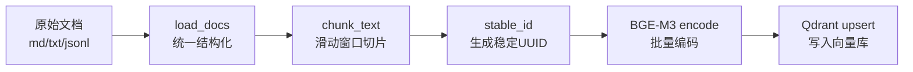
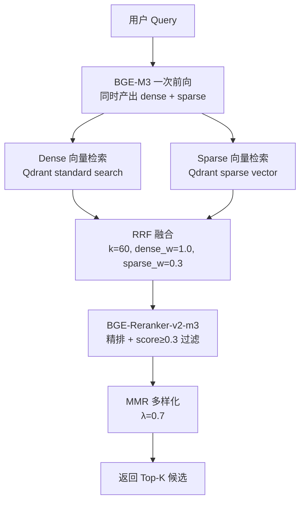
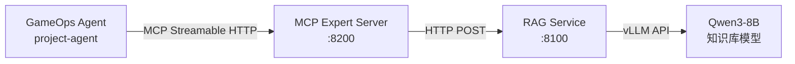
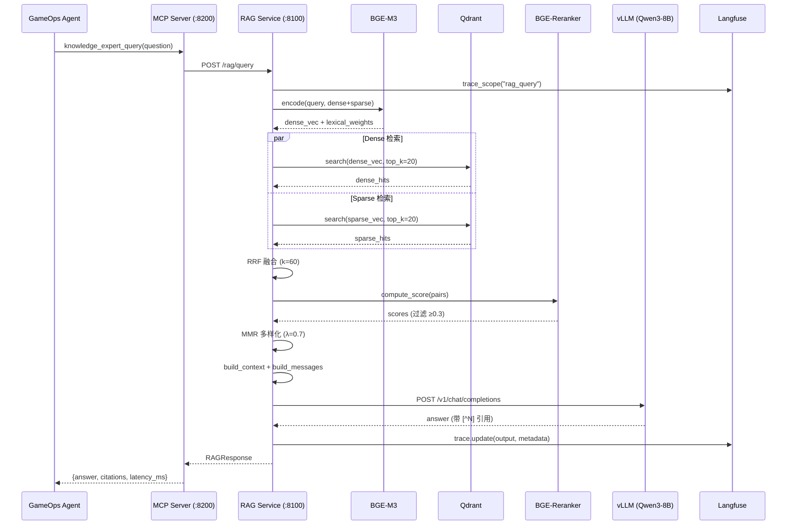
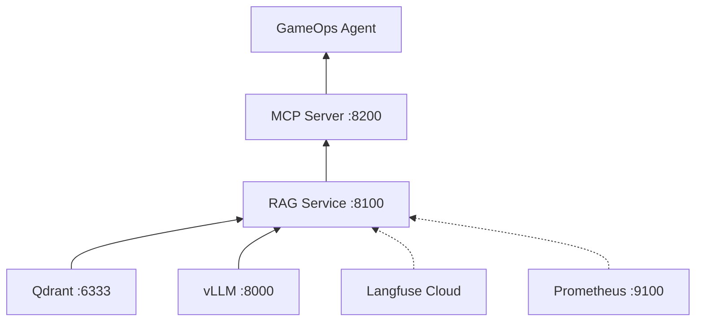

# Agentic RAG 系统详解

> **文档定位**：本文档对 `project-llm` 项目的 Agentic RAG 系统进行完整技术解析，覆盖索引构建、混合检索、RRF 融合、精排重排、MMR 多样化、融合生成、MCP 封装、可观测性集成等全链路。
>
> **前置阅读**：`04_INFERENCE_DEPLOY.md`（vLLM 服务是 RAG 的生成后端）

---

## 一、RAG 系统全景架构

```
┌─────────────────────────────────────────────────────────────────────────────┐
│                      Agentic RAG 系统全链路                                   │
├─────────────────────────────────────────────────────────────────────────────┤
│                                                                             │
│  ┌─────────────────── 离线索引层 ───────────────────┐                       │
│  │                                                   │                       │
│  │  ┌──────────┐   ┌──────────┐   ┌──────────┐     │                       │
│  │  │ 原始文档  │ → │ 滑动窗口  │ → │ BGE-M3   │     │                       │
│  │  │ md/txt/  │   │ 切片     │   │ 编码     │     │                       │
│  │  │ jsonl    │   │ 512+64   │   │ dense    │     │                       │
│  │  └──────────┘   └──────────┘   └──────────┘     │                       │
│  │                                       │           │                       │
│  │                                       ▼           │                       │
│  │                              ┌──────────────┐     │                       │
│  │                              │   Qdrant     │     │                       │
│  │                              │ (向量数据库)  │     │                       │
│  │                              └──────────────┘     │                       │
│  └───────────────────────────────────────────────────┘                       │
│                                                                             │
│  ┌─────────────────── 在线检索层 ───────────────────┐                       │
│  │                                                   │                       │
│  │  query → [BGE-M3 dense+sparse 一次前向编码]       │                       │
│  │       → [Dense 召回 ∥ Sparse 召回]  (并行)        │                       │
│  │       → [RRF 加权融合 (k=60)]                     │                       │
│  │       → [BGE-Reranker-v2-m3 精排]                 │                       │
│  │       → [score ≥ 0.3 阈值过滤]                    │                       │
│  │       → [MMR 多样化 (λ=0.7)]                      │                       │
│  └───────────────────────────────────────────────────┘                       │
│                                                                             │
│  ┌─────────────────── 融合生成层 ───────────────────┐                       │
│  │                                                   │                       │
│  │  [检索结果 + Prompt 模板]                          │                       │
│  │       → [Qwen3-8B-knowledge-sft via vLLM]         │                       │
│  │       → [带 [^N] 引用的结构化回答]                 │                       │
│  │       → [stream / json 返回]                       │                       │
│  └───────────────────────────────────────────────────┘                       │
│                                                                             │
│  ┌─────────────────── 对外接口层 ───────────────────┐                       │
│  │                                                   │                       │
│  │  ┌──────────────┐  ┌──────────────┐              │                       │
│  │  │ POST         │  │ POST         │              │                       │
│  │  │ /rag/query   │  │ /v1/chat/    │              │                       │
│  │  │ (原生端点)   │  │ completions  │              │                       │
│  │  └──────┬───────┘  └──────┬───────┘              │                       │
│  │         │                  │                       │                       │
│  │         ▼                  ▼                       │                       │
│  │  ┌──────────────────────────────┐                 │                       │
│  │  │  MCP Expert Server (:8200)   │                 │                       │
│  │  │  knowledge_expert_query      │                 │                       │
│  │  └──────────────┬───────────────┘                 │                       │
│  │                  │                                 │                       │
│  │                  ▼                                 │                       │
│  │  ┌──────────────────────────────┐                 │                       │
│  │  │  GameOps Agent (Go)          │                 │                       │
│  │  │  project-agent               │                 │                       │
│  │  └──────────────────────────────┘                 │                       │
│  └───────────────────────────────────────────────────┘                       │
│                                                                             │
│  ┌─────────────────── 可观测性 ─────────────────────┐                       │
│  │  Langfuse Trace │ Prometheus Metrics │ 降级告警   │                       │
│  └───────────────────────────────────────────────────┘                       │
│                                                                             │
└─────────────────────────────────────────────────────────────────────────────┘
```

---

## 二、离线索引构建

### 2.1 索引构建脚本

**文件**：`scripts/build_index.py`

#### 2.1.1 核心流程



#### 2.1.2 文档加载

支持三种输入格式，统一转换为 `{title, content, source}` 结构：

| 格式 | 处理方式 |
|------|---------|
| `.md` / `.txt` | 整文件读入，`title` = 文件名（去后缀） |
| `.jsonl` | 逐行解析 JSON，字段映射：`title` / `content` / `source` |

```python
def load_docs(source_dir: str) -> list[dict[str, str]]:
    """读取原始文档，统一为 {title, content, source} 结构"""
    docs: list[dict[str, str]] = []
    for p in src.rglob("*"):
        if p.suffix.lower() in (".md", ".txt"):
            text = p.read_text(encoding="utf-8", errors="ignore")
            docs.append({"title": p.stem, "content": text, "source": rel})
        elif p.suffix.lower() == ".jsonl":
            for line in p.read_text(encoding="utf-8").splitlines():
                obj = json.loads(line)
                docs.append({...})
    return docs
```

#### 2.1.3 滑动窗口切片

采用**字符级滑动窗口**（非词级），对中文场景更稳定：

```python
def chunk_text(text: str, size: int, overlap: int) -> list[str]:
    """滑动窗口切片（简单按字符切，中文场景比按词更稳）"""
    if len(text) <= size:
        return [text]
    out, i = [], 0
    while i < len(text):
        out.append(text[i:i + size])
        if i + size >= len(text):
            break
        i += size - overlap
    return out
```

**默认参数**：
- `chunk_size = 512` 字符
- `chunk_overlap = 64` 字符（约 12.5% 重叠率）

#### 2.1.4 稳定 ID 生成

基于 `source + chunk_idx` 生成确定性 UUID，支持**增量更新**（同一文档重新索引不会产生重复 point）：

```python
def stable_id(source: str, idx: int) -> str:
    """基于 source+idx 生成稳定 UUID，便于增量更新"""
    h = hashlib.md5(f"{source}::{idx}".encode("utf-8")).hexdigest()
    return str(uuid.UUID(h))
```

#### 2.1.5 批量编码与上传

```python
# 批量编码 + upload
for i in range(0, len(chunks), bs):
    batch = chunks[i:i + bs]
    enc = model.encode(texts, return_dense=True,
                       return_sparse=False, return_colbert_vecs=False,
                       max_length=8192, batch_size=bs)
    points = [
        qm.PointStruct(
            id=c["id"], vector=v.tolist(),
            payload={"text": ..., "title": ..., "source": ..., "chunk_idx": ...},
        )
        for c, v in zip(batch, vecs)
    ]
    client.upsert(collection_name=collection, points=points)
```

#### 2.1.6 使用方式

```bash
python scripts/build_index.py \
    --config configs/knowledge_rag.yaml \
    --source_dir data/raw/kb \
    --recreate          # 重建 collection（清空旧数据）
    --batch_size 32     # 编码批大小
```

---

## 三、在线检索链路

### 3.1 Retriever 类设计

**文件**：`deploy/rag_serve.py` → `class Retriever`

#### 3.1.1 懒加载初始化

```python
class Retriever:
    """BGE-M3 稠密检索 + BGE-Reranker 重排"""

    def __init__(self, cfg: dict[str, Any]):
        self.cfg = cfg
        self._embed = None    # 延迟加载
        self._rerank = None
        self._qdrant = None

    def lazy_init(self):
        if self._embed is not None:
            return
        from FlagEmbedding import BGEM3FlagModel, FlagReranker
        from qdrant_client import QdrantClient

        self._embed = BGEM3FlagModel(model, use_fp16=True)
        self._rerank = FlagReranker(model, use_fp16=True)
        self._qdrant = QdrantClient(url=url, timeout=30)
```

**设计意图**：
- 懒加载避免 import 时阻塞（模型加载耗时 5~10s）
- `use_fp16=True` 在 GPU 上减半显存占用

#### 3.1.2 检索主流程（5 步）



### 3.2 BGE-M3 混合编码

BGE-M3 的核心优势是**一次前向推理同时产出三种表示**：

| 表示类型 | 维度 | 用途 | 本项目使用 |
|---------|------|------|-----------|
| Dense | 1024 | 语义相似度检索 | ✅ 主力 |
| Sparse (Lexical Weights) | 稀疏 | 精确词匹配（类 BM25） | ✅ 辅助 |
| ColBERT | 1024×N | token 级精排 | ❌ 关闭（开销大） |

```python
enc = self._embed.encode(
    [query],
    return_dense=True,
    return_sparse=use_sparse,       # 由 sparse_weight > 0 控制
    return_colbert_vecs=False,      # 关闭 ColBERT
    max_length=8192,                # 支持 8K 长文
)
qvec = enc["dense_vecs"][0].tolist()
```

### 3.3 Dense 检索

标准 Qdrant 向量检索，使用 Cosine 距离：

```python
dense_hits = self._qdrant.search(
    collection_name=vs["collection"],
    query_vector=qvec,
    limit=top_k,          # 默认 20
    with_payload=True,
)
```

### 3.4 Sparse 检索

利用 BGE-M3 的 `lexical_weights` 输出构造稀疏向量，等价于**学习型 BM25**：

```python
from qdrant_client import models as qm

lw = enc["lexical_weights"][0]  # dict[token_id -> weight]
indices = [int(k) for k in lw.keys()]
values = [float(v) for v in lw.values()]

sparse_hits = self._qdrant.search(
    collection_name=vs["collection"],
    query_vector=qm.NamedSparseVector(
        name="sparse",
        vector=qm.SparseVector(indices=indices, values=values),
    ),
    limit=top_k,
    with_payload=True,
)
```

**降级策略**：若 collection 未建 sparse 索引，捕获异常后优雅降级为纯 dense，不影响主链路。

### 3.5 RRF 融合（Reciprocal Rank Fusion）

**核心算法**：将 N 路检索结果按排名倒数加权求和。

$$score(d) = \sum_{i=1}^{N} \frac{w_i}{k + rank_i(d)}$$

其中 $k=60$（来自 Cormack 2009 论文，业界默认值）。

```python
@staticmethod
def _rrf_merge(hit_lists, weights, limit: int, k_const: int = 60):
    """
    Reciprocal Rank Fusion：把 N 路检索结果按 rank 倒数加权求和。
    """
    bucket: dict[Any, dict[str, Any]] = {}
    for hits, w in zip(hit_lists, weights):
        if not hits or w <= 0:
            continue
        for rank, h in enumerate(hits, start=1):
            key = getattr(h, "id", None) or id(h)
            payload = h.payload or {}
            contrib = w / (k_const + rank)
            if key in bucket:
                bucket[key]["fusion_score"] += contrib
            else:
                bucket[key] = {
                    "fusion_score": contrib,
                    "score": float(getattr(h, "score", 0.0)),
                    **payload,
                }
    merged = sorted(bucket.values(),
                    key=lambda x: x["fusion_score"], reverse=True)
    return merged[:limit]
```

**配置参数**：
| 参数 | 默认值 | 说明 |
|------|--------|------|
| `dense_weight` | 1.0 | 稠密检索权重 |
| `sparse_weight` | 0.3 | 稀疏检索权重 |
| `k_const` | 60 | RRF 常量 |
| `top_k` | 20 | 粗排召回条数 |

### 3.6 BGE-Reranker 精排

使用 **BGE-Reranker-v2-m3** 对 RRF 融合后的候选进行交叉编码精排：

```python
if rer.get("enabled") and self._rerank and candidates:
    pairs = [[query, c["text"]] for c in candidates]
    scores = self._rerank.compute_score(pairs, normalize=True)
    # 阈值过滤
    threshold = rer.get("score_threshold", 0.0)  # 默认 0.3
    candidates = [c for c in candidates if c["rerank_score"] >= threshold]
    # 按精排分数降序
    candidates.sort(key=lambda x: x["rerank_score"], reverse=True)
    candidates = candidates[:top_k]  # 精排后保留 5 条
```

**精排参数**：
| 参数 | 默认值 | 说明 |
|------|--------|------|
| `model` | `BAAI/bge-reranker-v2-m3` | 精排模型 |
| `top_k` | 5 | 精排后保留条数 |
| `score_threshold` | 0.3 | 低于此分数直接丢弃 |

### 3.7 MMR 多样化（Maximal Marginal Relevance）

**目标**：在相关性与多样性之间取平衡，避免返回大量同源重复内容。

$$MMR(d) = \lambda \cdot rel(q, d) - (1-\lambda) \cdot \max_{d' \in S} sim(d, d')$$

```python
@staticmethod
def _mmr(query_vec, candidates, lambda_: float = 0.7):
    """
    Maximal Marginal Relevance：在相关性与多样性之间取平衡。
    """
    remaining = list(candidates)
    selected: list[dict[str, Any]] = []
    seen_sources: set[str] = set()
    while remaining and len(selected) < len(candidates):
        best_idx, best_score = 0, -1e9
        for i, c in enumerate(remaining):
            rel = float(c.get("rerank_score", c.get("fusion_score", ...)))
            if not selected:
                diversity = 0.0
            else:
                a = _vec(c)
                if a is not None:
                    diversity = max(_cos(a, _vec(s)) for s in selected)
                else:
                    # 退化策略：同 source 视为 1.0 相似
                    diversity = 1.0 if c.get("source") in seen_sources else 0.0
            mmr = lambda_ * rel - (1 - lambda_) * diversity
            if mmr > best_score:
                best_score, best_idx = mmr, i
        picked = remaining.pop(best_idx)
        selected.append(picked)
    return selected
```

**设计亮点**：
- 优先使用 `dense_vec`（payload 中可选存储）计算余弦相似度
- 缺失向量时**退化为 source 去重**：同来源文档视为相似度 1.0
- `λ=0.7` 偏重相关性，适合知识问答场景

---

## 四、融合生成层

### 4.1 Generator 类设计

**文件**：`deploy/rag_serve.py` → `class Generator`

#### 4.1.1 核心特性

| 特性 | 实现 |
|------|------|
| 异步 HTTP | `httpx.AsyncClient` 直连 vLLM |
| 流式输出 | SSE `data:` 格式逐 chunk 返回 |
| 自动降级 | 主模型失败 → fallback 到 DeepSeek-V3.2 |
| 超时控制 | 默认 120s，可配置 |

#### 4.1.2 Fallback 降级机制

```python
async def complete(self, messages, *, stream=False, extra=None):
    try:
        # 尝试主模型（Qwen3-8B-knowledge-sft via vLLM）
        r = await client.post(url, headers=headers, json=payload)
        r.raise_for_status()
        return r.json()
    except Exception as e:
        fb = self.cfg.get("fallback") or {}
        if not fb.get("enabled"):
            raise
        print(f"[gen] 主模型失败，降级到 {fb.get('model')}: {e}")
        # 切换到 DeepSeek-V3.2
        payload["model"] = fb["model"]
        r = await client.post(f"{fb_base}/chat/completions", ...)
        return r.json()
```

**降级场景**：
- vLLM 服务未启动 / 重启中
- GPU OOM / 推理超时
- 网络抖动

### 4.2 Prompt 工程

#### 4.2.1 System Prompt

```yaml
system: |
  你是 GameOps 运维知识库专家，请严格基于【参考资料】回答用户问题。
  要求：
  1. 回答必须有出处，在关键结论后用 [^N] 标注引用的资料编号
  2. 若【参考资料】无法回答，明确说"资料不足"并给出可能的排查方向
  3. 对于操作指令类问题，按"步骤 1 / 步骤 2 / 步骤 3"结构化输出
  4. 禁止编造不存在的命令、告警码、服务名
```

#### 4.2.2 User Template

```yaml
user_template: |
  【参考资料】
  {context}

  【用户问题】
  {question}

  请作答：
```

#### 4.2.3 Context 构建

将检索结果格式化为带编号的参考资料：

```python
def build_context(chunks: list[dict]) -> tuple[str, list[Citation]]:
    lines = []
    citations: list[Citation] = []
    for i, c in enumerate(chunks, 1):
        lines.append(
            f"[{i}] 标题: {c.get('title','')}\n"
            f"来源: {c.get('source','')}\n"
            f"内容: {c.get('text','')}\n"
        )
        citations.append(Citation(index=i, title=..., source=..., score=...))
    return "\n".join(lines), citations
```

### 4.3 生成参数

| 参数 | 值 | 说明 |
|------|-----|------|
| `temperature` | 0.1 | 低温保证事实性 |
| `top_p` | 0.9 | 核采样 |
| `max_tokens` | 1024 | 最大生成长度 |
| `model` | `qwen3-8b-knowledge-sft` | 微调后的知识库模型 |

---

## 五、API 端点设计

### 5.1 端点总览

| 端点 | 方法 | 用途 | 返回格式 |
|------|------|------|---------|
| `/rag/query` | POST | 原生 RAG 问答 | `RAGResponse` JSON |
| `/v1/chat/completions` | POST | OpenAI 兼容 | OpenAI Chat 格式 |
| `/healthz` | GET | 健康检查 | `{"status": "ok"}` |
| `/metrics` | GET | Prometheus 指标 | text/plain |

### 5.2 原生端点 `/rag/query`

**请求 Schema**：

```python
class RAGRequest(BaseModel):
    query: str                    # 用户问题
    top_k: int | None = None     # 可选覆盖检索条数
    stream: bool = False         # 是否流式
    session_id: str | None = None  # 会话 ID（关联 Langfuse trace）
```

**响应 Schema**：

```python
class RAGResponse(BaseModel):
    answer: str                   # 带 [^N] 引用的回答
    citations: list[Citation]     # 引用详情列表
    latency_ms: int              # 端到端延迟
    trace_id: str                # 追踪 ID
```

**Citation 结构**：

```python
class Citation(BaseModel):
    index: int      # 引用编号 [^N]
    title: str      # 文档标题
    source: str     # 文档来源路径
    score: float    # 精排分数
```

### 5.3 OpenAI 兼容端点 `/v1/chat/completions`

- 提取最后一条 `user` 消息作为 query 触发 RAG
- 支持 `stream=true` 流式返回
- 流式末尾附加 `citations` 扩展字段（非标准，客户端可选忽略）
- 支持 `temperature` / `max_tokens` 覆盖

### 5.4 空结果处理

当检索无结果时，返回预设的安全回答：

```python
if not chunks:
    answer = "资料不足，暂无法回答该问题。建议排查方向：检查日志 / 查询监控面板 / 联系值班。"
    return RAGResponse(answer=answer, citations=[], ...)
```

---

## 六、MCP Expert Server

### 6.1 架构定位

**文件**：`deploy/mcp_expert_server.py`

MCP Expert Server 将 RAG 服务封装为 **MCP 工具**，供 GameOps Agent（project-agent）调用：



### 6.2 暴露的 MCP 工具

| 工具名 | 功能 | 参数 |
|--------|------|------|
| `knowledge_expert_query` | 运维/游戏知识库专家问答 | `question: str`, `top_k: int = 5` |
| `knowledge_expert_health` | 检查 RAG 后端健康状态 | 无 |

### 6.3 工具定义代码

```python
from mcp.server.fastmcp import FastMCP

mcp = FastMCP("llm_knowledge_expert")

@mcp.tool()
async def knowledge_expert_query(question: str, top_k: int = 5) -> dict:
    """
    运维/游戏知识库专家问答。

    何时调用：
      - 用户询问需要参考内部文档的问题
      - 其他 MCP 工具拿不到结论，需要结合知识库解释现象时

    Returns:
        {"answer": "...", "citations": [...], "latency_ms": 420, "trace_id": "..."}
    """
    async with httpx.AsyncClient(timeout=timeout) as client:
        r = await client.post(f"{rag_url}/rag/query",
                              json={"query": question, "top_k": top_k, "stream": False})
        r.raise_for_status()
        return r.json()
```

### 6.4 传输协议

- **协议版本**：MCP Streamable HTTP (2025-03)
- **端口**：默认 8200
- **路径**：`/mcp`
- **与 Agent 对接配置**：

```yaml
# project-agent/conf/mcp_servers.yaml
- name: llm_knowledge_expert
  target: "*"
  url: http://localhost:8200/mcp
  transport: streamable
  timeout: 60
```

### 6.5 启动方式

```bash
python deploy/mcp_expert_server.py \
    --rag_url http://localhost:8100 \
    --host 0.0.0.0 \
    --port 8200 \
    --timeout 60
```

---

## 七、可观测性集成

### 7.1 Langfuse 追踪

**文件**：`observability/langfuse_tracing.py`

#### 7.1.1 设计原则

| 原则 | 实现 |
|------|------|
| 零侵入 | 未配置环境变量时所有装饰器降级为 no-op |
| 隐私保护 | `REDACT_PROMPT=1` 时脱敏 prompt 内容 |
| OTel 兼容 | Langfuse client 同时上报 OTLP |
| 端到端链路 | `link_agent_trace()` 关联 Agent ↔ RAG ↔ 训练 |

#### 7.1.2 trace_scope 上下文管理器

RAG 服务中使用 `trace_scope` 包裹每次请求：

```python
@contextmanager
def trace_scope(name: str, *, user_id=None, session_id=None, metadata=None):
    """创建一个 trace 上下文；未配置 Langfuse 时返回 no-op object。"""
    client = init_langfuse()
    if client is None:
        yield _NoOp()
        return
    trace = client.trace(name=name, user_id=user_id,
                         session_id=session_id, metadata=metadata or {})
    try:
        yield trace
    finally:
        client.flush()
```

#### 7.1.3 RAG 请求中的埋点

```python
with trace_scope("rag_query", session_id=session_id,
                 metadata={"query_len": len(req.query)}) as tr:
    chunks = await asyncio.to_thread(RETRIEVER.search, req.query)
    # ... 生成 ...
    tr.update(
        input=req.query,
        output=answer[:500],
        metadata={
            "latency_ms": latency_ms,
            "n_citations": len(citations),
            "top_score": citations[0].score if citations else 0.0,
            "trace_id": trace_id,
        },
    )
```

#### 7.1.4 Agent 链路关联

```python
def link_agent_trace(session_id: str, agent_trace_id: str, extra=None):
    """
    Agent 侧把 session_id 透传进来后，登记关联事件，
    Langfuse UI 即可通过 session 视图看到 Agent ↔ RAG 全链路。
    """
    client.event(
        name="agent_trace_link",
        metadata={"agent_trace_id": agent_trace_id, **(extra or {})},
        session_id=session_id,
    )
```

### 7.2 Prometheus 指标

| 指标名 | 类型 | 说明 |
|--------|------|------|
| `rag_requests_total` | Counter | RAG 请求总数（按 endpoint + status 分标签） |
| `rag_latency_seconds` | Histogram | 端到端延迟分布 |
| `rag_citation_count` | Histogram | 每次查询的引用数分布 |
| `rag_retrieved_chunks_total` | Counter | 检索到的 chunk 总数 |

**Histogram Buckets**：`(0.1, 0.3, 0.5, 1, 2, 3, 5, 8, 13, 21)` 秒

---

## 八、配置文件详解

**文件**：`configs/knowledge_rag.yaml`

### 8.1 配置结构总览

```yaml
retriever:          # 检索器配置
  vector_store:     #   向量数据库
  embedding:        #   Embedding 模型
  reranker:         #   精排模型
  # 检索参数
generator:          # 生成模型配置
  fallback:         #   降级配置
prompt:             # Prompt 模板
service:            # 服务配置
observability:      # 可观测性配置
```

### 8.2 环境变量支持

配置文件支持 `${VAR:-default}` 语法，运行时自动展开：

```python
def _expand(v: str) -> str:
    """支持 ${VAR:-default} 语法"""
    if not isinstance(v, str) or not v.startswith("${"):
        return v
    body = v[2:-1]
    if ":-" in body:
        name, default = body.split(":-", 1)
        return os.getenv(name, default)
    return os.getenv(body, "")
```

### 8.3 关键环境变量

| 变量 | 默认值 | 说明 |
|------|--------|------|
| `QDRANT_URL` | `http://localhost:6333` | Qdrant 地址 |
| `LLM_BASE_URL` | `http://localhost:8000/v1` | vLLM 服务地址 |
| `LLM_API_KEY` | `EMPTY` | LLM API Key |
| `DEEPSEEK_API_KEY` | - | DeepSeek 降级 Key |
| `LANGFUSE_PUBLIC_KEY` | - | Langfuse 公钥 |
| `LANGFUSE_SECRET_KEY` | - | Langfuse 私钥 |
| `LANGFUSE_HOST` | `https://cloud.langfuse.com` | Langfuse 地址 |
| `RAG_CONFIG` | `configs/knowledge_rag.yaml` | 配置文件路径 |
| `REDACT_PROMPT` | - | 设为 `1` 脱敏 prompt |

---

## 九、依赖框架矩阵

### 9.1 核心依赖

| 框架 | 版本要求 | 用途 | 层级 |
|------|---------|------|------|
| **FastAPI** | ≥0.100.0 | Web 框架，异步路由 | 服务层 |
| **Uvicorn** | ≥0.24.0 | ASGI 服务器 | 服务层 |
| **Pydantic** | ≥2.0.0 | 请求/响应 Schema 校验 | 服务层 |
| **httpx** | ≥0.25.0 | 异步 HTTP 客户端（连接 vLLM） | 生成层 |
| **FlagEmbedding** | ≥1.2.0 | BGE-M3 编码 + BGE-Reranker 精排 | 检索层 |
| **qdrant-client** | ≥1.7.0 | Qdrant 向量数据库客户端 | 检索层 |
| **PyYAML** | ≥6.0 | 配置文件解析 | 基础 |
| **numpy** | ≥1.24.0 | MMR 余弦相似度计算 | 检索层 |

### 9.2 可选依赖

| 框架 | 版本要求 | 用途 | 缺失行为 |
|------|---------|------|---------|
| **langfuse** | ≥2.60.0 | LLM 调用链追踪 | 降级为 no-op |
| **prometheus-client** | ≥0.20.0 | 指标采集 | `/metrics` 返回提示文本 |
| **mcp[server]** | ≥1.0.0 | MCP Server SDK | MCP 服务无法启动 |

### 9.3 模型依赖

| 模型 | 用途 | 参数量 | 特点 |
|------|------|--------|------|
| **BAAI/bge-m3** | Embedding | 568M | 8K 长文 + dense/sparse/colbert 三合一 |
| **BAAI/bge-reranker-v2-m3** | 精排 | 568M | 交叉编码，精度高 |
| **qwen3-8b-knowledge-sft** | 生成 | 8B | 项目微调的知识库专家模型 |
| **deepseek-chat** | 降级生成 | - | DeepSeek-V3.2 API |

### 9.4 基础设施依赖

| 组件 | 用途 | 部署方式 |
|------|------|---------|
| **Qdrant** | 向量数据库 | Docker / 本地二进制 |
| **vLLM** | LLM 推理引擎 | GPU 服务器 |
| **Langfuse** | 观测平台 | Cloud / Self-hosted |
| **Prometheus** | 指标采集 | Docker |

---

## 十、自定义实现深度解析

### 10.1 RRF 融合算法

**位置**：`deploy/rag_serve.py` → `Retriever._rrf_merge()`

**为什么自己实现而非用 Qdrant 内置**：
1. Qdrant 的 `query_batch` 不支持自定义权重
2. 需要在融合后保留完整 payload 供后续精排
3. 可灵活扩展为 3 路以上融合（如加入 ColBERT）

**算法复杂度**：O(N·M)，N = 路数，M = 每路 top_k

### 10.2 MMR 多样化算法

**位置**：`deploy/rag_serve.py` → `Retriever._mmr()`

**双重退化策略**：
1. 有 `dense_vec` → 余弦相似度计算多样性
2. 无向量 → 按 `source` 字段去重（同来源 = 相似度 1.0）

**为什么不用 Qdrant 内置 MMR**：
- Qdrant 的 MMR 只能在单路检索上做，无法在 RRF 融合后再做
- 需要结合 rerank_score 作为相关性度量

### 10.3 环境变量展开器

**位置**：`deploy/rag_serve.py` → `_expand()` + `load_config()`

支持递归展开嵌套配置中的 `${VAR:-default}` 占位符，实现：
- 开发环境用默认值零配置启动
- 生产环境通过环境变量注入敏感信息
- 不依赖额外的配置管理库

### 10.4 稳定 ID 生成器

**位置**：`scripts/build_index.py` → `stable_id()`

基于 `source::chunk_idx` 的 MD5 生成确定性 UUID：
- 同一文档重新索引 → 同 ID → Qdrant upsert 覆盖（增量更新）
- 不同文档 → 不同 ID → 不会冲突
- 避免了随机 UUID 导致的重复 point 问题

### 10.5 Langfuse 零侵入集成

**位置**：`observability/langfuse_tracing.py`

**核心设计**：
- 所有函数在 `import` 时不触发网络请求
- `init_langfuse()` 懒加载，首次调用时才初始化
- 未配置环境变量 → 返回 `_NoOp` 对象，所有方法为空操作
- `trace_scope` 上下文管理器确保 `flush()` 被调用

---

## 十一、端到端数据流

### 11.1 完整请求链路



### 11.2 延迟分布（典型值）

| 阶段 | 耗时 | 说明 |
|------|------|------|
| BGE-M3 编码 | 15~30ms | GPU FP16，单条 query |
| Qdrant 检索（双路） | 5~15ms | 本地部署，20 条 |
| RRF 融合 | <1ms | 纯内存计算 |
| BGE-Reranker 精排 | 50~100ms | 20 对交叉编码 |
| MMR 多样化 | <5ms | 5 条候选 |
| LLM 生成 | 200~800ms | Qwen3-8B + EAGLE-3 |
| **端到端** | **300~1000ms** | P95 |

---

## 十二、部署与运维

### 12.1 快速启动

```bash
# 1. 启动 Qdrant
docker run -d -p 6333:6333 qdrant/qdrant

# 2. 构建索引
python scripts/build_index.py \
    --config configs/knowledge_rag.yaml \
    --source_dir data/raw/kb \
    --recreate

# 3. 启动 vLLM（知识库模型）
bash deploy/vllm_v1_server.sh

# 4. 启动 RAG 服务
uvicorn deploy.rag_serve:app --host 0.0.0.0 --port 8100

# 5. 启动 MCP Server
python deploy/mcp_expert_server.py --rag_url http://localhost:8100
```

### 12.2 健康检查

```bash
# RAG 服务
curl http://localhost:8100/healthz
# {"status": "ok", "collection": "gameops_kb"}

# MCP Server（通过 RAG 工具）
# Agent 调用 knowledge_expert_health()
```

### 12.3 服务依赖关系



---

## 十三、面试要点

### 13.1 高频问题

**Q1：为什么选择 BGE-M3 而非其他 Embedding 模型？**

> BGE-M3 的核心优势是**一次前向同时产出 dense + sparse + colbert 三种表示**，省去了单独部署 BM25 的运维成本。8K 长文支持覆盖大部分运维文档，且中英文效果均衡。

**Q2：RRF 的 k=60 是怎么来的？**

> 来自 Cormack et al. 2009 论文《Reciprocal Rank Fusion outperforms Condorcet and individual Rank Learning Methods》。k=60 在大量实验中表现稳定，过小会让排名靠前的结果权重过大，过大则趋于均匀。

**Q3：为什么精排后还要做 MMR？**

> 精排只保证每条结果与 query 的相关性，但可能返回同一文档的多个相邻切片（内容高度重复）。MMR 通过惩罚与已选结果相似的候选，确保返回的 5 条结果覆盖不同信息源。

**Q4：Fallback 降级的触发条件和影响？**

> 任何导致主模型请求失败的异常（超时、5xx、连接拒绝）都会触发。降级到 DeepSeek-V3.2 后，回答质量可能略降（未经领域微调），但保证了服务可用性。Langfuse 会记录降级事件便于后续分析。

**Q5：如何保证索引的增量更新不产生重复？**

> 使用 `stable_id(source, chunk_idx)` 生成确定性 UUID。同一文档同一切片位置永远映射到同一 ID，Qdrant 的 `upsert` 语义保证覆盖而非追加。

### 13.2 架构决策记录

| 决策 | 选择 | 备选 | 理由 |
|------|------|------|------|
| 向量库 | Qdrant | Milvus / Weaviate | 轻量、Rust 实现、原生 sparse vector 支持 |
| Embedding | BGE-M3 | GTE-Qwen2 / E5 | 三合一编码、8K 长文、中文优秀 |
| 精排 | BGE-Reranker-v2-m3 | Cohere Rerank | 开源可控、与 BGE-M3 同系列 |
| 融合策略 | RRF | 线性加权 / 学习排序 | 无需训练、鲁棒性强、业界验证 |
| 多样化 | MMR | DPP / 聚类 | 实现简单、效果可控、λ 可调 |
| Web 框架 | FastAPI | Flask / Starlette | 原生异步、自动文档、Pydantic 集成 |
| MCP 传输 | Streamable HTTP | stdio / SSE | 网络部署友好、与 Agent 默认一致 |

---

## 十四、扩展方向

| 方向 | 描述 | 优先级 |
|------|------|--------|
| ColBERT 精排 | 启用 BGE-M3 的 ColBERT 向量做 token 级精排 | P1 |
| 多轮对话 | 引入 session memory，支持追问 | P1 |
| Query Rewrite | LLM 改写模糊 query 后再检索 | P2 |
| Hybrid Index | Qdrant 原生 hybrid search（待 API 稳定） | P2 |
| 文档级权重 | 按文档新鲜度/权威度加权 | P3 |
| 多模态 | 支持图片/表格的 OCR + 索引 | P3 |

---

> **下一篇**：`06_AGENT_INTEGRATION.md` —— Agent 集成与 MCP 协议详解
