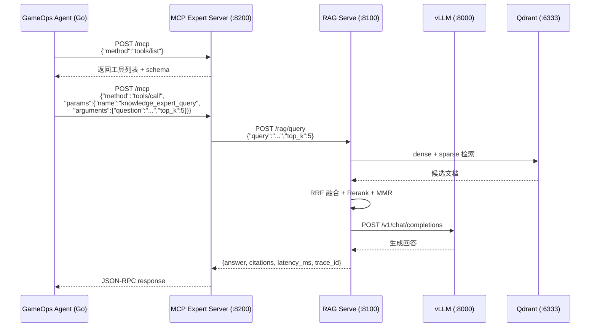
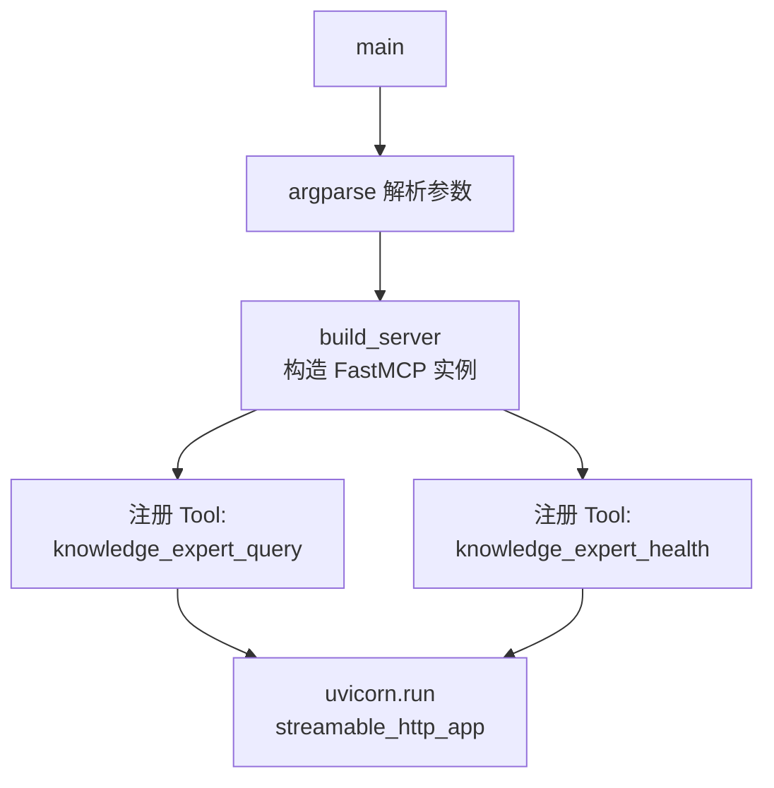
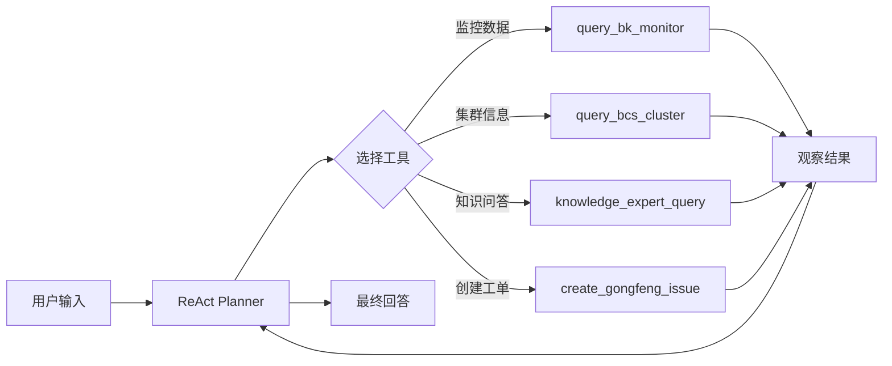
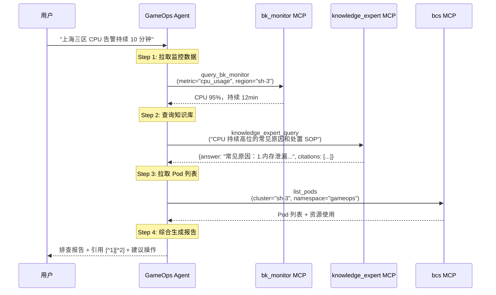
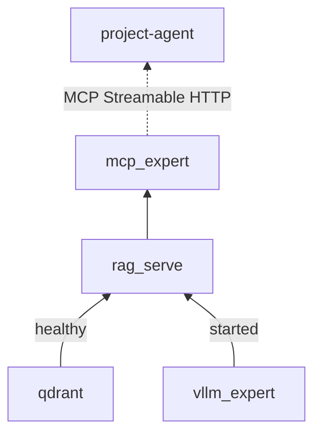
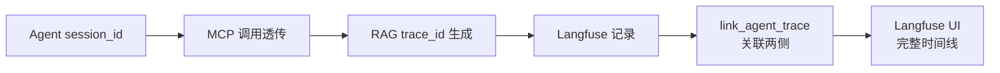
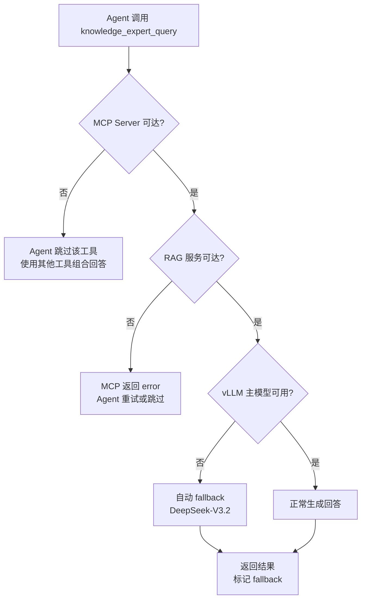

# Agent 集成与 MCP 协议详解

> **文档定位**：本文档对 `project-llm` 项目的 Agent 集成层进行完整技术解析，覆盖 MCP 协议封装、FastMCP Server 实现、与 GameOps Agent（Go）的对接机制、端到端调用链路、可观测性关联、降级策略等维度。
>
> **前置阅读**：`05_RAG_SYSTEM.md`（RAG 服务是 Agent 集成的上游依赖）

---

## 一、Agent 集成全景架构

```
┌─────────────────────────────────────────────────────────────────────────────┐
│                    Agent 集成全链路架构                                       │
├─────────────────────────────────────────────────────────────────────────────┤
│                                                                             │
│  ┌─────────────────── Agent 层（Go） ──────────────────┐                    │
│  │                                                      │                    │
│  │  ┌──────────────────────────────────────────────┐    │                    │
│  │  │         GameOps Agent (project-agent)         │    │                    │
│  │  │                                              │    │                    │
│  │  │  ReAct Planner                               │    │                    │
│  │  │   ├─ Tool: query_bk_monitor  (MCP)           │    │                    │
│  │  │   ├─ Tool: query_bcs_cluster (MCP)           │    │                    │
│  │  │   ├─ Tool: knowledge_expert_query ← 本项目   │    │                    │
│  │  │   ├─ Tool: knowledge_expert_health            │    │                    │
│  │  │   └─ Tool: create_gongfeng_issue (MCP)       │    │                    │
│  │  │                                              │    │                    │
│  │  │  mcp_servers.yaml 动态加载工具列表            │    │                    │
│  │  └──────────────────────┬───────────────────────┘    │                    │
│  └─────────────────────────┼────────────────────────────┘                    │
│                            │                                                 │
│                            │ MCP Streamable HTTP (2025-03)                   │
│                            │ JSON-RPC 2.0                                    │
│                            ▼                                                 │
│  ┌─────────────────── MCP 封装层（Python） ─────────┐                       │
│  │                                                   │                       │
│  │  ┌──────────────────────────────────────────┐     │                       │
│  │  │  mcp_expert_server.py  :8200             │     │                       │
│  │  │  FastMCP("llm_knowledge_expert")         │     │                       │
│  │  │                                          │     │                       │
│  │  │  @mcp.tool()                             │     │                       │
│  │  │  knowledge_expert_query(question, top_k) │     │                       │
│  │  │  → {answer, citations, latency_ms,       │     │                       │
│  │  │     trace_id}                            │     │                       │
│  │  │                                          │     │                       │
│  │  │  @mcp.tool()                             │     │                       │
│  │  │  knowledge_expert_health()               │     │                       │
│  │  │  → {status, collection}                  │     │                       │
│  │  └──────────────────┬───────────────────────┘     │                       │
│  └─────────────────────┼────────────────────────────┘                       │
│                        │                                                     │
│                        │ HTTP POST /rag/query                                │
│                        ▼                                                     │
│  ┌─────────────────── RAG 服务层 ──────────────────┐                        │
│  │                                                  │                        │
│  │  rag_serve.py  :8100  (FastAPI)                  │                        │
│  │  Retrieve → Rerank → Generate → Citations        │                        │
│  └──────┬──────────────────────────┬────────────────┘                        │
│         │                          │                                         │
│         ▼                          ▼                                         │
│    Qdrant :6333              vLLM V1 :8000                                   │
│    (向量检索)                (知识库专家模型)                                  │
│                                                                             │
│  ┌─────────────────── 可观测性关联 ────────────────┐                        │
│  │                                                  │                        │
│  │  Agent session_id ←→ RAG trace_id                │                        │
│  │  Langfuse 端到端链路可视化                        │                        │
│  │  Prometheus 指标采集                              │                        │
│  └──────────────────────────────────────────────────┘                        │
│                                                                             │
└─────────────────────────────────────────────────────────────────────────────┘
```

---

## 二、MCP 协议概述

### 2.1 什么是 MCP

**MCP（Model Context Protocol）** 是 Anthropic 于 2024 年底提出的开放协议，旨在标准化 LLM 应用与外部工具/数据源之间的通信方式。核心理念：

| 概念 | 说明 |
|------|------|
| **Server** | 提供工具（Tool）和资源（Resource）的服务端 |
| **Client** | 调用工具的 Agent / LLM 应用 |
| **Transport** | 通信层，支持 stdio / SSE / Streamable HTTP |
| **Tool** | 可被 LLM 调用的函数，带有结构化输入/输出 schema |
| **Resource** | 可被 LLM 读取的上下文数据（本项目未使用） |

### 2.2 为什么选择 MCP Streamable HTTP

本项目选择 **MCP Streamable HTTP (2025-03)** 作为传输协议，原因：

| 对比维度 | stdio | SSE | Streamable HTTP |
|---------|-------|-----|-----------------|
| 部署形态 | 本地进程 | HTTP 长连接 | HTTP 短连接 + 可选流 |
| 跨网络 | ❌ | ✅ | ✅ |
| 负载均衡 | ❌ | 困难 | ✅ 原生支持 |
| 容器化 | 困难 | 一般 | ✅ 天然适配 |
| project-agent 默认 | ❌ | ❌ | ✅ |

### 2.3 MCP 通信流程



---

## 三、MCP Expert Server 实现详解

### 3.1 文件概览

**文件**：`deploy/mcp_expert_server.py`（107 行）

**职责**：将 RAG 服务封装为标准 MCP Server，对 GameOps Agent 暴露工具接口。

### 3.2 核心依赖

| 依赖包 | 版本要求 | 用途 |
|--------|---------|------|
| `mcp[server]` | ≥1.0.0 | FastMCP 框架，MCP 协议实现 |
| `httpx` | ≥0.27.0 | 异步 HTTP 客户端，调用 RAG 后端 |
| `uvicorn` | ≥0.30.0 | ASGI 服务器，承载 Streamable HTTP |
| `argparse` | stdlib | 命令行参数解析 |

### 3.3 架构设计



### 3.4 Server 构造函数

```python
def build_server(rag_url: str, timeout: float = 60.0):
    """构造 FastMCP Server 实例"""
    from mcp.server.fastmcp import FastMCP

    mcp = FastMCP("llm_knowledge_expert")
    # ... 注册工具 ...
    return mcp
```

**设计要点**：
- 使用 `FastMCP` 高层 API，自动处理 JSON-RPC 2.0 协议细节
- Server 名称 `"llm_knowledge_expert"` 与 Agent 侧 `mcp_servers.yaml` 中的 `name` 对应
- 延迟导入 `mcp.server.fastmcp`，未安装时给出友好错误提示

### 3.5 核心工具：knowledge_expert_query

```python
@mcp.tool()
async def knowledge_expert_query(question: str, top_k: int = 5) -> dict:
    """
    运维/游戏知识库专家问答。

    何时调用：
      - 用户询问"为什么告警 XX / 如何扩容 / xx 指标什么意思"等需要参考内部文档的问题
      - 其他 MCP 工具拿不到结论，需要结合知识库解释现象时

    Args:
        question: 用户原始问题（建议保留完整上下文）
        top_k:    检索保留条数（默认 5，复杂问题可设 8-10）

    Returns:
        {
          "answer": "...",           # 带 [^N] 引用编号
          "citations": [...],        # 引用详情
          "latency_ms": 420,
          "trace_id": "a1b2c3d4"
        }
    """
    async with httpx.AsyncClient(timeout=timeout) as client:
        r = await client.post(
            f"{rag_url.rstrip('/')}/rag/query",
            json={"query": question, "top_k": top_k, "stream": False},
        )
        r.raise_for_status()
        return r.json()
```

**设计要点**：

| 设计决策 | 说明 |
|---------|------|
| docstring 即 schema | FastMCP 自动从 docstring 提取工具描述，Agent 的 LLM 据此决定何时调用 |
| `question` 保留完整上下文 | 不做截断，让 RAG 层的 embedding 模型自行处理（BGE-M3 支持 8K） |
| `top_k` 可调 | 简单问题 5 条足够，复杂问题可设 8-10 提高召回率 |
| `stream=False` | MCP 工具调用是同步语义，不走流式 |
| 返回 `trace_id` | 供 Agent 侧关联 Langfuse 链路 |

### 3.6 健康检查工具：knowledge_expert_health

```python
@mcp.tool()
async def knowledge_expert_health() -> dict:
    """检查 RAG 后端是否就绪，返回 collection 名"""
    async with httpx.AsyncClient(timeout=5.0) as client:
        try:
            r = await client.get(f"{rag_url.rstrip('/')}/healthz")
            return r.json()
        except Exception as e:
            return {"status": "down", "error": str(e)}
```

**用途**：Agent 在首次调用前可先探活，避免超时等待。

### 3.7 启动入口

```python
def main():
    parser = argparse.ArgumentParser()
    parser.add_argument("--rag_url", default=os.getenv("RAG_URL", "http://localhost:8100"))
    parser.add_argument("--host", default="0.0.0.0")
    parser.add_argument("--port", type=int, default=8200)
    parser.add_argument("--timeout", type=float, default=60.0)
    args = parser.parse_args()

    mcp = build_server(args.rag_url, args.timeout)

    # FastMCP 2025-03 streamable transport
    try:
        import uvicorn
        uvicorn.run(mcp.streamable_http_app(), host=args.host, port=args.port)
    except AttributeError:
        # 旧版 API 兼容
        asyncio.run(mcp.run_streamable_http_async(host=args.host, port=args.port))
```

**兼容性处理**：
- 优先使用 `streamable_http_app()` 返回 ASGI app，由 uvicorn 托管
- 旧版 FastMCP 无此方法时，fallback 到 `run_streamable_http_async()`

---

## 四、Agent 侧对接机制

### 4.1 project-agent 架构简述

`project-agent` 是基于 Go 实现的 GameOps Agent，采用 **ReAct（Reasoning + Acting）** 范式：



### 4.2 MCP 工具注册配置

在 `project-agent/conf/mcp_servers.yaml` 中注册：

```yaml
mcp_servers:
  # ---------- 知识库专家 ----------
  - name: llm_knowledge_expert
    target: "*"                    # 所有场景可见
    url: http://localhost:8200/mcp
    transport: streamable
    timeout: 60
    allowed_tools:
      - knowledge_expert_query
      - knowledge_expert_health
    enabled: true
```

**配置字段说明**：

| 字段 | 说明 |
|------|------|
| `name` | MCP Server 标识，需与 FastMCP 构造参数一致 |
| `target` | 场景过滤器，`"*"` 表示所有场景均可调用 |
| `url` | MCP Server 的 Streamable HTTP 端点 |
| `transport` | 传输协议类型：`streamable` / `sse` / `stdio` |
| `timeout` | 单次工具调用超时（秒） |
| `allowed_tools` | 白名单，限制可调用的工具子集 |
| `enabled` | 开关，可热关闭而不删配置 |

### 4.3 target 机制与工具选择优化

`target` 字段是 project-agent 的**工具可见性控制**机制：

```yaml
# 仅在故障排查场景加载
- name: bk_monitor
  target: bk-monitor        # 仅 bk-monitor 场景可见

# 所有场景都可调用
- name: llm_knowledge_expert
  target: "*"               # 全局可见
```

**设计意义**：
- 当 Agent 注册了 40+ MCP 工具时，全部暴露给 LLM 会**污染工具选择准确率**
- 通过 `target` 按场景过滤，每次 ReAct 循环只看到 5-8 个相关工具
- 知识库专家设为 `"*"` 是因为**任何场景都可能需要查阅文档**

### 4.4 Agent 调用时序

一个典型的故障排查场景：



---

## 五、Docker 容器编排

### 5.1 四件套拓扑

```
Qdrant (6333) ← rag_serve (8100) ← mcp_expert (8200) ← project-agent
                       ↓
               vLLM (8000) [知识库专家模型]
```

### 5.2 docker-compose 配置

**文件**：`deploy/rag_docker-compose.yaml`

```yaml
version: "3.9"

services:
  qdrant:
    image: qdrant/qdrant:v1.12.0
    ports:
      - "6333:6333"
      - "6334:6334"   # gRPC
    volumes:
      - ./output/qdrant_storage:/qdrant/storage
    healthcheck:
      test: ["CMD", "curl", "-f", "http://localhost:6333/healthz"]
      interval: 10s

  vllm_expert:
    image: vllm/vllm-openai:v0.10.1.1
    runtime: nvidia
    volumes:
      - ./output/knowledge_merged:/models/knowledge-expert
    ports:
      - "8000:8000"
    command: >
      --model /models/knowledge-expert
      --served-model-name qwen3-8b-knowledge-sft
      --tensor-parallel-size 1
      --max-model-len 32768
      --quantization fp8
      --enable-prefix-caching

  rag_serve:
    environment:
      - QDRANT_URL=http://qdrant:6333
      - LLM_BASE_URL=http://vllm_expert:8000/v1
    command: >
      uvicorn deploy.rag_serve:app
      --host 0.0.0.0 --port 8100 --workers 2
    ports:
      - "8100:8100"
    depends_on:
      qdrant: { condition: service_healthy }
      vllm_expert: { condition: service_started }

  mcp_expert:
    environment:
      - RAG_URL=http://rag_serve:8100
    command: python deploy/mcp_expert_server.py --host 0.0.0.0 --port 8200
    ports:
      - "8200:8200"
    depends_on:
      - rag_serve
```

### 5.3 服务依赖关系



### 5.4 启动命令

```bash
# 一键启动四件套
docker compose -f deploy/rag_docker-compose.yaml up -d

# 查看状态
docker compose -f deploy/rag_docker-compose.yaml ps

# 查看日志
docker compose -f deploy/rag_docker-compose.yaml logs -f mcp_expert
```

---

## 六、端到端可观测性关联

### 6.1 Trace 关联机制

Agent 集成的核心挑战之一是**跨服务链路追踪**。本项目通过 `trace_id` + `session_id` 实现端到端关联：



### 6.2 Langfuse 关联实现

**文件**：`observability/langfuse_tracing.py`

```python
def link_agent_trace(session_id: str, agent_trace_id: str,
                      extra: dict | None = None) -> None:
    """
    当 Agent 侧把 session_id 透传进来后，调用本函数登记一条关联事件，
    Langfuse UI 即可通过 session 视图看到 Agent ↔ RAG ↔ 训练 全链路。
    """
    client = init_langfuse()
    if client is None:
        return
    client.event(
        name="agent_trace_link",
        metadata={"agent_trace_id": agent_trace_id, **(extra or {})},
        session_id=session_id,
    )
```

### 6.3 RAG 侧 Trace 记录

每次 RAG 调用通过 `trace_scope` 上下文管理器记录：

```python
@contextmanager
def trace_scope(name: str, *, session_id=None, metadata=None):
    """创建一个 trace 上下文；未配置 Langfuse 时返回 no-op object。"""
    client = init_langfuse()
    if client is None:
        # 降级为 no-op，不影响主流程
        yield _NoOp()
        return

    trace = client.trace(name=name, session_id=session_id, metadata=metadata or {})
    try:
        yield trace
    finally:
        client.flush()
```

### 6.4 观测数据流

| 层级 | 记录内容 | 存储 |
|------|---------|------|
| Agent | session_id / 工具选择 / ReAct 步骤 | Agent 自身日志 |
| MCP | 调用耗时 / 参数 / 返回状态 | Prometheus |
| RAG | query / 召回数 / rerank 分数 / 生成耗时 | Langfuse + Prometheus |
| LLM | prompt / response / token 消耗 | Langfuse |

### 6.5 Prometheus 指标

RAG 服务暴露的关键指标（供 Grafana 面板使用）：

| 指标名 | 类型 | 说明 |
|--------|------|------|
| `rag_requests_total` | Counter | 请求总数（按 endpoint + status 分标签） |
| `rag_latency_seconds` | Histogram | 端到端延迟分布 |
| `rag_citation_count` | Histogram | 每次查询的引用数分布 |
| `rag_retrieved_chunks_total` | Counter | 检索到的文档块总数 |

---

## 七、降级与容错策略

### 7.1 多层降级设计



### 7.2 各层降级细节

| 层级 | 故障场景 | 降级策略 | 用户感知 |
|------|---------|---------|---------|
| **MCP 层** | Server 不可达 / 超时 | Agent 跳过该工具，用其他工具组合 | 回答可能缺少知识库引用 |
| **RAG 层** | 检索无结果 | 返回"资料不足"+ 排查建议 | 明确告知无法回答 |
| **生成层** | vLLM 主模型故障 | 自动切换 DeepSeek-V3.2 | 无感，延迟略增 |
| **Sparse 检索** | collection 无 sparse 索引 | 降级为纯 dense 检索 | 无感，召回率略降 |
| **Langfuse** | 未配置 / 服务不可达 | 所有装饰器降级为 no-op | 完全无感 |

### 7.3 Generator Fallback 实现

```python
class Generator:
    async def complete(self, messages, *, stream=False, extra=None):
        try:
            # 尝试主模型（vLLM + Qwen3-8B）
            r = await client.post(url, headers=headers, json=payload)
            r.raise_for_status()
            return r.json()
        except Exception as e:
            fb = self.cfg.get("fallback") or {}
            if not fb.get("enabled"):
                raise
            # 降级到 DeepSeek-V3.2
            print(f"[gen] 主模型失败，降级到 {fb.get('model')}: {e}")
            payload["model"] = fb["model"]
            r = await client.post(f"{fb_base}/chat/completions", ...)
            return r.json()
```

**配置**（`configs/knowledge_rag.yaml`）：

```yaml
generator:
  base_url: "${LLM_BASE_URL:-http://localhost:8000/v1}"
  model: "qwen3-8b-knowledge-sft"
  fallback:
    enabled: true
    base_url: "https://api.deepseek.com/v1"
    model: "deepseek-chat"
    api_key: "${DEEPSEEK_API_KEY}"
```

---

## 八、FastMCP 框架深度解析

### 8.1 FastMCP 核心概念

`FastMCP` 是 MCP Python SDK 提供的高层封装，类似于 FastAPI 之于 Starlette：

| 概念 | FastAPI 类比 | 说明 |
|------|-------------|------|
| `FastMCP(name)` | `FastAPI(title)` | 创建 Server 实例 |
| `@mcp.tool()` | `@app.post()` | 注册工具（自动推断 schema） |
| `@mcp.resource()` | — | 注册资源（本项目未使用） |
| `streamable_http_app()` | `app` | 返回 ASGI 应用 |

### 8.2 工具 Schema 自动推断

FastMCP 从函数签名 + docstring 自动生成 JSON Schema：

```python
@mcp.tool()
async def knowledge_expert_query(question: str, top_k: int = 5) -> dict:
    """运维/游戏知识库专家问答。..."""
```

自动生成的 MCP Tool Schema：

```json
{
  "name": "knowledge_expert_query",
  "description": "运维/游戏知识库专家问答。...",
  "inputSchema": {
    "type": "object",
    "properties": {
      "question": {"type": "string", "description": "用户原始问题"},
      "top_k": {"type": "integer", "default": 5, "description": "检索保留条数"}
    },
    "required": ["question"]
  }
}
```

### 8.3 Streamable HTTP Transport

MCP 2025-03 规范定义的 Streamable HTTP 传输：

| 特性 | 说明 |
|------|------|
| 端点 | 单一 `/mcp` 路径 |
| 协议 | JSON-RPC 2.0 over HTTP POST |
| 请求 | `Content-Type: application/json` |
| 响应 | 普通 JSON 或 `text/event-stream`（流式） |
| 会话 | 无状态（每次请求独立） |

**请求示例**：

```json
// tools/list
{"jsonrpc": "2.0", "id": 1, "method": "tools/list"}

// tools/call
{
  "jsonrpc": "2.0", "id": 2,
  "method": "tools/call",
  "params": {
    "name": "knowledge_expert_query",
    "arguments": {"question": "CPU 告警怎么排查？", "top_k": 5}
  }
}
```

### 8.4 FastMCP 与 uvicorn 集成

```python
# 获取 ASGI app
asgi_app = mcp.streamable_http_app()

# 由 uvicorn 托管（支持多 worker、graceful shutdown）
uvicorn.run(asgi_app, host="0.0.0.0", port=8200)
```

---

## 九、RAG 配置与 Agent 集成参数

### 9.1 完整配置文件

**文件**：`configs/knowledge_rag.yaml`

### 9.2 Agent 相关关键配置

| 配置路径 | 默认值 | 对 Agent 的影响 |
|---------|--------|----------------|
| `retriever.top_k` | 20 | 粗排召回数，影响答案覆盖面 |
| `retriever.reranker.top_k` | 5 | 精排保留数，影响 citations 数量 |
| `retriever.reranker.score_threshold` | 0.3 | 低分过滤，影响"资料不足"判定 |
| `generator.temperature` | 0.1 | 低温度 = 确定性回答，适合知识问答 |
| `generator.max_tokens` | 1024 | 回答长度上限 |
| `generator.timeout` | 120 | 生成超时，需小于 MCP timeout |
| `generator.fallback.enabled` | true | 降级开关 |
| `service.return_citations` | true | 是否返回引用详情 |
| `prompt.system` | 见下文 | 控制回答风格和约束 |

### 9.3 Prompt 模板

```yaml
prompt:
  system: |
    你是 GameOps 运维知识库专家，请严格基于【参考资料】回答用户问题。
    要求：
    1. 回答必须有出处，在关键结论后用 [^N] 标注引用的资料编号
    2. 若【参考资料】无法回答，明确说"资料不足"并给出可能的排查方向
    3. 对于操作指令类问题，按"步骤 1 / 步骤 2 / 步骤 3"结构化输出
    4. 禁止编造不存在的命令、告警码、服务名

  user_template: |
    【参考资料】
    {context}

    【用户问题】
    {question}

    请作答：
```

**Prompt 设计要点**：
- **强制引用**：`[^N]` 标注确保答案可溯源
- **拒绝幻觉**：明确禁止编造
- **结构化输出**：操作类问题按步骤输出，Agent 可直接执行
- **优雅拒绝**：资料不足时给出排查方向而非胡编

---

## 十、端到端验证

### 10.1 直连 MCP Server 验证

```bash
# 列出工具
curl -X POST http://localhost:8200/mcp \
  -H "Content-Type: application/json" \
  -d '{"jsonrpc":"2.0","id":1,"method":"tools/list"}'

# 调用工具
curl -X POST http://localhost:8200/mcp \
  -H "Content-Type: application/json" \
  -d '{
    "jsonrpc":"2.0","id":2,
    "method":"tools/call",
    "params":{
      "name":"knowledge_expert_query",
      "arguments":{"question":"CPU 告警怎么排查？","top_k":5}
    }
  }'

# 健康检查
curl -X POST http://localhost:8200/mcp \
  -H "Content-Type: application/json" \
  -d '{
    "jsonrpc":"2.0","id":3,
    "method":"tools/call",
    "params":{"name":"knowledge_expert_health","arguments":{}}
  }'
```

### 10.2 通过 Agent 端到端验证

```bash
# 假设 project-agent 已监听 8080
curl -X POST http://localhost:8080/api/chat \
  -H "Content-Type: application/json" \
  -d '{
    "query": "上海三区 CPU 告警持续 10 分钟，先看下是怎么回事",
    "session_id": "test-001"
  }'
```

**预期 ReAct 链路**：

```
Step 1: query_bk_monitor(metric="cpu_usage", region="sh-3")
        → 拿到监控数据：CPU 95%，持续 12min
Step 2: knowledge_expert_query("CPU 持续高位的常见原因和处置 SOP")
        → 知识库给出排查思路 + 引用
Step 3: bcs.list_pods(cluster="sh-3", namespace="gameops")
        → 拉出疑似 Pod 列表
Step 4: 生成最终报告 + 引用编号 [^1][^2] + 建议操作
```

### 10.3 RAG 直连验证

```bash
# 原生端点
curl -X POST http://localhost:8100/rag/query \
  -H "Content-Type: application/json" \
  -d '{"query": "如何处理内存泄漏告警？", "top_k": 5}'

# OpenAI 兼容端点
curl -X POST http://localhost:8100/v1/chat/completions \
  -H "Content-Type: application/json" \
  -d '{
    "model": "knowledge-rag",
    "messages": [{"role": "user", "content": "扩容操作步骤是什么？"}],
    "stream": false
  }'

# 健康检查
curl http://localhost:8100/healthz

# Prometheus 指标
curl http://localhost:8100/metrics
```

---

## 十一、依赖框架总览

### 11.1 MCP 封装层依赖

| 包名 | 版本 | 用途 | 安装 |
|------|------|------|------|
| `mcp[server]` | ≥1.0.0 | MCP 协议 Server 端实现 | `pip install 'mcp[server]'` |
| `httpx` | ≥0.27.0 | 异步 HTTP 客户端 | `pip install httpx` |
| `uvicorn` | ≥0.30.0 | ASGI 服务器 | `pip install uvicorn` |

### 11.2 RAG 服务层依赖

| 包名 | 版本 | 用途 | 安装 |
|------|------|------|------|
| `fastapi` | ≥0.115.0 | Web 框架 | `pip install fastapi` |
| `FlagEmbedding` | ≥1.2.0 | BGE-M3 编码 + BGE-Reranker | `pip install FlagEmbedding` |
| `qdrant-client` | ≥1.12.0 | Qdrant 向量数据库客户端 | `pip install qdrant-client` |
| `pydantic` | ≥2.0.0 | 数据校验 | `pip install pydantic` |
| `pyyaml` | ≥6.0 | YAML 配置解析 | `pip install pyyaml` |
| `numpy` | ≥1.24.0 | MMR 向量计算 | `pip install numpy` |

### 11.3 可观测性依赖（可选）

| 包名 | 版本 | 用途 | 安装 |
|------|------|------|------|
| `langfuse` | ≥2.60.0 | LLM 调用链追踪 | `pip install langfuse` |
| `prometheus-client` | ≥0.20.0 | 指标暴露 | `pip install prometheus-client` |

### 11.4 基础设施依赖

| 组件 | 版本 | 用途 |
|------|------|------|
| Qdrant | v1.12.0 | 向量数据库（dense + sparse） |
| vLLM | v0.10.1+ | LLM 推理引擎（FP8 量化） |
| Docker Compose | v3.9 | 容器编排 |
| NVIDIA Container Toolkit | — | GPU 容器支持 |

---

## 十二、自定义实现亮点

### 12.1 MCP 工具 docstring 即 Agent 提示

```python
@mcp.tool()
async def knowledge_expert_query(question: str, top_k: int = 5) -> dict:
    """
    运维/游戏知识库专家问答。

    何时调用：
      - 用户询问"为什么告警 XX / 如何扩容 / xx 指标什么意思"等需要参考内部文档的问题
      - 其他 MCP 工具拿不到结论，需要结合知识库解释现象时
    """
```

docstring 中的"何时调用"部分会被 FastMCP 提取为工具描述，直接影响 Agent 的 LLM 在 ReAct 循环中**何时选择调用此工具**。这是一种"Prompt as Code"的设计模式。

### 12.2 零代码接入 Agent

整个集成过程**不修改任何 Go 代码**：

1. 部署 MCP Server（Python 容器）
2. 在 `mcp_servers.yaml` 加一条配置
3. 重启 Agent

这得益于 project-agent 的**动态工具发现**机制：启动时读取 yaml → 连接各 MCP Server → `tools/list` 获取工具 schema → 注入 ReAct Planner。

### 12.3 Langfuse 优雅降级

所有观测代码遵循"**未配置则 no-op**"原则：

```python
try:
    from observability.langfuse_tracing import init_langfuse, trace_scope
except Exception:
    init_langfuse = lambda: None
    @contextmanager
    def trace_scope(*_a, **_kw):
        class _N:
            def update(self, **_): pass
        yield _N()
```

- 未安装 `langfuse` 包 → 不报错
- 未配置环境变量 → 打印提示后正常运行
- Langfuse 服务不可达 → flush 静默失败

### 12.4 环境变量占位符展开

配置文件支持 `${VAR:-default}` 语法，运行时自动展开：

```python
def _expand(v: str) -> str:
    """支持 ${VAR:-default} 语法"""
    if not isinstance(v, str) or not v.startswith("${"):
        return v
    body = v[2:-1]
    if ":-" in body:
        name, default = body.split(":-", 1)
        return os.getenv(name, default)
    return os.getenv(body, "")
```

这使得同一份 `knowledge_rag.yaml` 可在开发/测试/生产环境无修改使用。

---

## 十三、面试要点

### 13.1 核心问题与回答

**Q1：你是怎么让专家模型在 Agent 里真正起作用的？**

> 我把 RAG 服务**直接封装成 MCP 工具**，Agent 完全无感接入——只需要在 `mcp_servers.yaml` 加一条配置，不改任何 Go 代码。好处是：
> 1. **工具选择器权重可控**：通过 `target` 机制按场景过滤工具，避免 40+ 工具污染选择准确率
> 2. **可独立迭代**：模型升级、RAG 策略调整、prompt 改动都不触达 Go 代码
> 3. **统一观测**：RAG 返回的 `trace_id` 可与 Agent 的 `session_id` 关联，在 Langfuse 里串起端到端链路
> 4. **天然降级**：主模型失败自动 fallback 到 DeepSeek-V3.2，Agent 侧完全无感

**Q2：为什么选 MCP 而不是直接 HTTP API？**

> 1. **标准化**：MCP 定义了工具发现（`tools/list`）+ 调用（`tools/call`）的标准协议，Agent 无需为每个后端写适配代码
> 2. **Schema 自描述**：工具的输入/输出 schema 自动暴露给 LLM，LLM 可以自主决定何时调用、传什么参数
> 3. **生态兼容**：project-agent 已原生支持 MCP Streamable HTTP，新增工具零开发成本
> 4. **可组合**：多个 MCP Server 可并行注册，Agent 在 ReAct 循环中自由组合调用

**Q3：如何保证 Agent 调用知识库的准确性？**

> 三层保障：
> 1. **工具描述精准**：docstring 中明确写了"何时调用"，引导 LLM 正确选择
> 2. **RAG 质量保证**：混合检索 + RRF 融合 + Reranker 精排 + MMR 去冗余，确保召回质量
> 3. **Prompt 约束**：强制引用 `[^N]`、禁止编造、资料不足时明确拒绝

**Q4：端到端延迟怎么控制？**

> | 环节 | 典型耗时 | 优化手段 |
> |------|---------|---------|
> | BGE-M3 编码 | 20-50ms | GPU FP16 + 批处理 |
> | Qdrant 检索 | 5-15ms | HNSW 索引 + 内存映射 |
> | Reranker | 50-100ms | FP16 + top-20 限制 |
> | vLLM 生成 | 200-500ms | FP8 + EAGLE-3 投机解码 + Prefix Caching |
> | MCP 网络开销 | 5-10ms | 容器内网通信 |
> | **总计** | **300-700ms** | — |

### 13.2 技术亮点总结

| 亮点 | 说明 |
|------|------|
| MCP 标准化封装 | RAG → MCP Tool，Agent 零代码接入 |
| 多层降级 | vLLM → DeepSeek / sparse → dense / Langfuse → no-op |
| 端到端可观测 | trace_id + session_id 关联，Langfuse 全链路 |
| Prompt as Code | docstring 即工具描述，控制 Agent 调用时机 |
| 环境变量模板 | `${VAR:-default}` 一份配置多环境 |
| 容器化编排 | 四件套 docker-compose 一键部署 |
| target 场景过滤 | 避免工具过多污染 LLM 选择 |

---

## 十四、文件清单

| 文件 | 行数 | 职责 |
|------|------|------|
| `deploy/mcp_expert_server.py` | 107 | MCP Server 主入口 |
| `deploy/rag_serve.py` | 555 | RAG 服务（FastAPI） |
| `configs/knowledge_rag.yaml` | 97 | RAG 统一配置 |
| `scripts/build_index.py` | 179 | 向量索引构建 |
| `deploy/rag_docker-compose.yaml` | 112 | 四件套容器编排 |
| `observability/langfuse_tracing.py` | 222 | Langfuse 埋点工具 |
| `docs/agent_integration.md` | 185 | 接入指南（面向使用者） |

---

> **下一篇**：`07_EVALUATION.md` — 评估体系详解（G-Eval / RAGAS / 红队评测）
