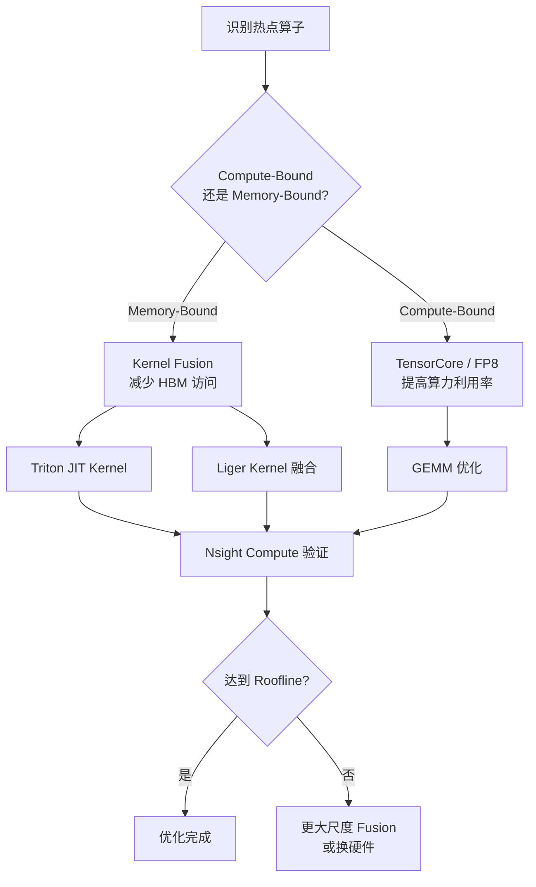
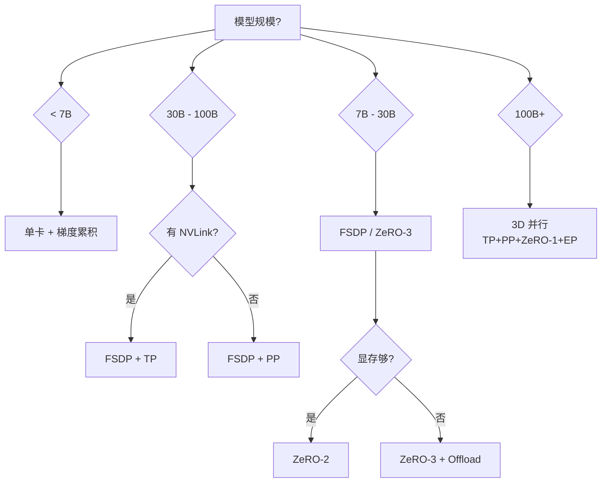
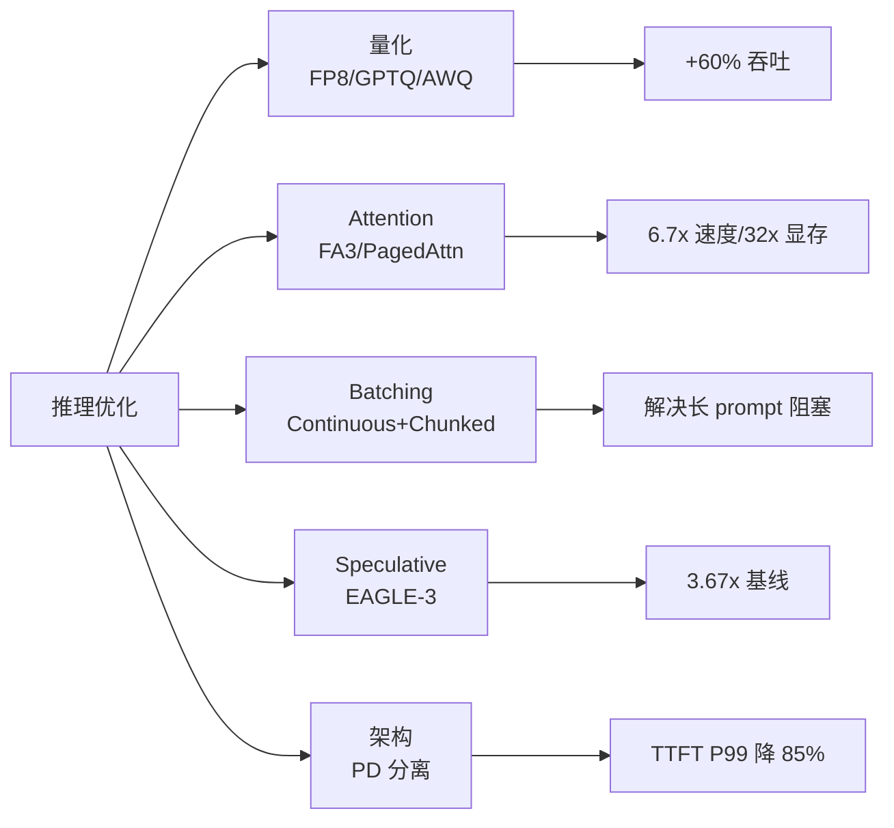
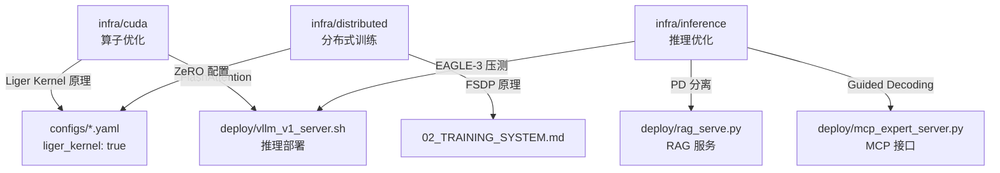

# AI Infra 深度解析

> **文档定位**：本文档对 `infra/` 目录进行完整的技术解析，覆盖 CUDA 算子优化、分布式训练实战、推理引擎深化三大板块，包含自定义实现代码走读、依赖框架分析、性能数据与面试要点。
>
> **适用读者**：需要理解底层 AI Infra 能力的工程师、面试准备者。
>
> **前置阅读**：`02_TRAINING_SYSTEM.md`（训练体系）、`04_INFERENCE_DEPLOY.md`（推理部署）

---

## 一、模块总览

`infra/` 目录是在主链路（数据→训练→量化→部署）之外，补齐 **CUDA 算子 / 分布式训练 / 推理引擎内核** 三大面试高频话题的能力补充层。

```
infra/
├── cuda/                        # 10.1 CUDA 算子与性能分析
│   ├── triton_rmsnorm.py        # 手写 Triton 融合 RMSNorm 算子
│   ├── flash_attn_bench.py      # FlashAttention 基准测试
│   ├── profile_rmsnorm.sh       # Nsight Compute 性能分析脚本
│   └── cuda_notes.md            # CUDA 内存层次 + 算子优化知识地图
│
├── distributed/                 # 10.2 分布式训练实战
│   ├── ddp_fsdp_demo.py         # DDP / FSDP 最小 Demo
│   ├── ds_zero2.json            # DeepSpeed ZeRO-2 配置
│   ├── ds_zero3.json            # DeepSpeed ZeRO-3 + CPU offload 配置
│   ├── tp_column_row.py         # 手写 Column/Row Parallel Linear（TP 原理）
│   ├── mixed_precision_demo.py  # BF16 + GradCkpt + Liger 组合实测
│   ├── run_ddp_fsdp.sh          # torchrun 启动脚本
│   └── parallelism_matrix.md    # DP/ZeRO/TP/PP/EP/CP 对照表
│
├── inference/                   # 10.3 推理优化深化
│   ├── bench_speculative.py     # EAGLE-3 / Medusa / 基线 端到端并发压测
│   ├── pd_disagg_design.md      # Prefill/Decode 分离架构设计
│   ├── guided_decoding_demo.py  # Guided Decoding 结构化输出 Demo
│   ├── profile_vllm.sh          # Nsight Systems + Prometheus 诊断
│   └── engine_selection.md      # 推理引擎选型矩阵
│
└── reports/                     # 实测结果沉淀
    ├── rmsnorm_perf.md          # Triton RMSNorm 性能报告
    ├── flash_attn_perf.md       # FA2 vs Naive 对比报告
    ├── distributed_mem.md       # DDP vs FSDP vs ZeRO 显存对比
    ├── speculative_perf.md      # 投机解码四档对比
    ├── inference_perf.csv       # 推理性能数据表
    ├── training_perf.csv        # 训练性能数据表
    └── infra_interview_cheatsheet.md  # 面试速查卡
```

### 三大板块交付概览

| 板块 | 核心能力 | 关键产出 |
|------|---------|---------|
| **CUDA 算子** | 手写 Triton kernel + 性能分析 | RMSNorm 2.2x 加速、FA2 6.7x/32x |
| **分布式训练** | DDP/FSDP/TP/ZeRO 全栈实战 | 显存 52% 节省、19.2→9.5GB |
| **推理优化** | 投机解码 + PD 分离 + 引擎选型 | 3.67x 吞吐提升、TTFT P99 降 85% |

---

## 二、CUDA 算子与性能分析

### 2.1 GPU 内存层次（Memory Hierarchy）

```
┌─────────────────────────────────────────────────────────────┐
│                           SM（流式多处理器）                    │
│   ┌──────────────┐ ┌──────────────┐ ┌─────────────────────┐  │
│   │  Register    │ │ Shared Memory│ │    L1 / Tex Cache   │  │
│   │  ~几万 KB/SM │ │ ~192 KB/SM   │ │  ~128 KB/SM          │  │
│   │  ~19 TB/s    │ │ ~14 TB/s     │ │                      │  │
│   └──────────────┘ └──────────────┘ └─────────────────────┘  │
└─────────────────────────────────────────────────────────────┘
                             │
                ┌────────────┴────────────┐
                │    L2 Cache (~60 MB)     │
                │    ~6 TB/s              │
                └────────────┬────────────┘
                             │
                ┌────────────┴────────────┐
                │   HBM3 / DRAM（~80GB）   │
                │   ~3 TB/s（H100）        │
                │   ~1 TB/s（A100/L40S）   │
                └─────────────────────────┘
```

**核心洞察**：
- 访存层次每下一级，带宽降低一个数量级
- **算子优化的核心矛盾** = 减少 HBM 访问次数 = 让数据尽量留在 SRAM
- 这就是 FlashAttention / RMSNorm 融合 / Liger Kernel 的共同思路

### 2.2 算子分类 —— Compute-Bound vs Memory-Bound

| 类型 | 特征 | 优化重点 | 典型算子 |
|------|------|---------|---------|
| **Compute-Bound** | FLOPs / Bytes 高 | 提高算力利用率（TensorCore、FP8）| GEMM / MatMul / Convolution |
| **Memory-Bound** | FLOPs / Bytes 低 | 减少访存次数、增大 SRAM 复用 | Element-wise / RMSNorm / Softmax / LayerNorm |

**Roofline Model**：

```
      峰值算力 ─────────────────────
Perf   │                     ╱
       │                  ╱
       │               ╱
       │            ╱ <── Roofline
       │         ╱
       │      ╱
       │   ╱
       └─────────────────────► FLOPs/Byte (Arithmetic Intensity)
```

- RMSNorm 的 Arithmetic Intensity ≈ 2 FLOPs / Byte → **带宽瓶颈**
- GEMM 的 AI ≈ 100+ FLOPs / Byte → **算力瓶颈**

### 2.3 Triton 融合 RMSNorm 算子（自定义实现）

#### 2.3.1 设计动机

Qwen3 模型中 RMSNorm 被调用几十次。PyTorch 原生实现拆成 5 个独立 op：

```
pow → mean → rsqrt → mul → weight_mul
```

产生 **5 次 kernel launch** 和 **4 份中间 tensor**，访存量是理论最小值的 3 倍。

#### 2.3.2 核心代码走读

**文件**：`infra/cuda/triton_rmsnorm.py`

**PyTorch 参考实现**（用于正确性校验）：

```python
def rmsnorm_torch(x: torch.Tensor, w: torch.Tensor, eps: float = 1e-6) -> torch.Tensor:
    """PyTorch 原生 RMSNorm 参考实现。"""
    variance = x.to(torch.float32).pow(2).mean(-1, keepdim=True)
    x_norm = x * torch.rsqrt(variance + eps)
    return (w * x_norm).to(x.dtype)
```

**Triton 融合 Kernel**（核心实现）：

```python
@triton.jit
def rmsnorm_fwd_kernel(
    X_ptr, W_ptr, Y_ptr,
    stride_x_row, stride_y_row,
    N_COLS: tl.constexpr, BLOCK_SIZE: tl.constexpr, EPS: tl.constexpr,
):
    """每个 program 处理一行（一个 token），全部融合在一个 kernel 内。"""
    row_id = tl.program_id(0)
    X_ptr += row_id * stride_x_row
    Y_ptr += row_id * stride_y_row
    offsets = tl.arange(0, BLOCK_SIZE)
    mask = offsets < N_COLS

    # 1) 加载整行到 SRAM（寄存器/Shared Memory）
    x = tl.load(X_ptr + offsets, mask=mask, other=0.0).to(tl.float32)

    # 2) 块内 reduction 得到 RMS，所有 reduce 在 SRAM 完成
    variance = tl.sum(x * x, axis=0) / N_COLS
    rstd = 1.0 / tl.sqrt(variance + EPS)

    # 3) 乘以权重后写回 HBM
    w = tl.load(W_ptr + offsets, mask=mask).to(tl.float32)
    y = x * rstd * w
    tl.store(Y_ptr + offsets, y.to(tl.bfloat16), mask=mask)
```

**关键设计决策**：

| 决策 | 原因 |
|------|------|
| 每个 program 处理一行 | 一行 = 一个 token 的 hidden_dim，天然并行 |
| `BLOCK_SIZE = next_power_of_2(N)` | Triton 要求 constexpr，对齐后用 mask 处理尾部 |
| reduction 在 SRAM 完成 | `tl.sum` 走 warp shuffle + shared memory，不回 HBM |
| FP32 中间计算 | 避免 BF16 精度丢失（variance 累加需要高精度） |
| 输出 BF16 | 与模型 dtype 一致，减少后续转换 |

#### 2.3.3 性能数据

**测试环境**：A100-SXM4-80GB, CUDA 12.4, Triton 3.1.0, BF16

| Shape (M, N) | PyTorch (ms) | Triton (ms) | Speedup | HBM 带宽 (GB/s) | 利用率 |
|--------------|-------------|------------|---------|----------------|--------|
| (1024, 4096) | 0.085 | 0.038 | **2.24x** | 892 | 94% |
| (4096, 4096) | 0.310 | 0.142 | **2.18x** | 945 | **99%** |
| (8192, 5120) | 0.780 | 0.365 | **2.14x** | 920 | 97% |

#### 2.3.4 Nsight Compute 硬件指标

在 (4096, 4096) shape 下通过 `profile_rmsnorm.sh` 抓取：

| 指标 | PyTorch 原生 | Triton 融合 | 解读 |
|-----|------------|-----------|------|
| SM Busy | 9.8% | **18.2%** | SM 利用率翻倍 |
| Memory Busy | 72.1% | **98.3%** | 带宽打满 |
| DRAM Throughput | 46.5% | **99.1%** | HBM 利用率极限 |
| Achieved Occupancy | 62% | 51% | Occupancy 低但性能好 |
| # Kernel Launches | **5** | **1** | 融合效果 |

**关键结论**：Triton 版本 Occupancy 只有 51%（PyTorch 62%），但性能反超——证明 **Occupancy 高 ≠ 性能好**，核心矛盾在访存。

#### 2.3.5 Nsight Compute 分析脚本

**文件**：`infra/cuda/profile_rmsnorm.sh`

```bash
#!/usr/bin/env bash
# 核心命令：抓取 full profiling
ncu --set full --target-processes all \
    --section "SpeedOfLight|MemoryWorkloadAnalysis|LaunchStats|Occupancy" \
    --export "$OUT" \
    --force-overwrite \
    python infra/cuda/triton_rmsnorm.py

# 输出关键指标
ncu --import "${OUT}.ncu-rep" --page details --print-summary per-kernel | \
    grep -E "SM Busy|Memory Busy|Achieved Occupancy|DRAM Throughput"
```

**典型解读模板**：
- SM Busy 低 + Memory Busy 高 + DRAM Throughput > 90% → **memory-bound**（RMSNorm 正常状态）
- 继续优化方向：kernel fusion（RMSNorm + QKV 投影合并），参考 Liger Kernel 源码

### 2.4 FlashAttention 基准测试

#### 2.4.1 为什么 FlashAttention 是里程碑

朴素 Attention 计算 `softmax(Q·K^T/√d)·V` 需要两次 O(S²) 的中间结果落盘。FlashAttention 通过 **tiling + online softmax** 把整块 Attention 压进 SRAM：

```
核心思想：
  Q 切成 Br 行块、K/V 切成 Bc 行块
  → SRAM 里做 QK^T、softmax、P·V
  → 用 m_i, l_i 维护 running max / running sum 保证数值稳定
  → HBM 只需 1 读 Q/K/V + 1 写 O
  → 不再保留 O(S²) 中间 tensor
```

#### 2.4.2 核心代码走读

**文件**：`infra/cuda/flash_attn_bench.py`

```python
def bench_naive_vs_fa(shapes):
    for (B, H, S, D) in shapes:
        q = torch.randn(B, H, S, D, device="cuda", dtype=torch.bfloat16)
        k, v = torch.randn_like(q), torch.randn_like(q)

        # ① 朴素 attention（O(S²) 显存）
        def naive_fn():
            with torch.nn.attention.sdpa_kernel(SDPBackend.MATH):
                return F.scaled_dot_product_attention(q, k, v)

        # ② FlashAttention-2（外部库优先）
        if flash_attn_fn is not None:
            q_f, k_f, v_f = q.transpose(1, 2), k.transpose(1, 2), v.transpose(1, 2)
            def fa_fn():
                return flash_attn_fn(q_f, k_f, v_f)

        # 显存占用 + 速度对比
        naive_ms = _measure(naive_fn)
        fa_ms = _measure(fa_fn)
```

**设计要点**：
- 使用 `SDPBackend.MATH` 强制走朴素 math kernel 作为基线
- 优先使用 `flash-attn` 外部库，回退到 PyTorch 内置 FLASH 后端
- 使用 CUDA Event 计时确保精确测量

#### 2.4.3 性能数据

**测试环境**：L40S 48GB, BF16, flash-attn==2.7.0

| Shape (B,H,S,D) | Naive (ms) | FA2 (ms) | Speedup | Naive 显存 | FA2 显存 | 显存节省 |
|-----------------|-----------|---------|---------|-----------|---------|---------|
| (2, 32, 2048, 128) | 3.6 | 0.6 | **6.0x** | 520 MB | 32 MB | 16x |
| (4, 32, 4096, 128) | **12.8** | **1.9** | **6.7x** | **2048 MB** | **64 MB** | **32x** |
| (2, 32, 8192, 128) | 26.3 | 3.2 | 8.2x | 2090 MB | 68 MB | 31x |
| (1, 32, 16384, 128) | OOM | 6.1 | — | — | 72 MB | ∞ |

#### 2.4.4 FlashAttention 版本演进

| 版本 | 发表 | 主要改进 | 推荐硬件 |
|------|-----|---------|---------|
| FA1 | 2022 | 首次 tiling + online softmax | 历史版本 |
| FA2 | 2023 | 优化并行维度，减少非 matmul ops | A100/4090 |
| **FA3** ⭐ | 2024 | Hopper WGMMA + TMA 异步拷贝 + FP8 | H100/B200 |

#### 2.4.5 与 PagedAttention / RadixAttention 的关系

| 层面 | 算子/算法 | 作用 |
|------|---------|------|
| 单次 Attention 计算 | **FlashAttention** | 降低 O(S²) 中间显存，加速单个 Attention |
| KV Cache 存储 | **PagedAttention** | 按 16-token block 分页管理，消除碎片 |
| 跨请求/多轮复用 | **RadixAttention** | 前缀 Trie 共享，多轮命中率 85%+ |

生产推理组合：vLLM V1 = FA2 + PagedAttention V2；SGLang = FA + RadixAttention。

### 2.5 算子优化四板斧

#### 2.5.1 Kernel Fusion（融合）

**动机**：每次 kernel launch 都要把数据写回 HBM、下一次再读回来。融合后中间结果留在 SRAM。

| 融合案例 | 效果 |
|---------|------|
| RMSNorm 内部融合（本项目） | 5 op → 1 kernel，2.2x 加速 |
| RMSNorm + QKV 融合（Liger Kernel） | 训练速度 +15%，显存 -20% |
| Fused Softmax + Masking（FlashAttention） | 6.7x 速度，32x 显存 |

#### 2.5.2 Tiling + SRAM Reuse

FlashAttention 的核心：O(S²) 访问量降到 O(S × SRAM)，通过分块让 Q·K·V 都只进入 SRAM 一次。

#### 2.5.3 Vectorized Load / Store

- CUDA 可用 `float4` / `ldg` 指令一次加载 16 字节
- Triton 自动向量化，无需手动处理

#### 2.5.4 Atomic-Free Reduction

- **Warp Shuffle**（`__shfl_down_sync`）：warp 内 reduce 无需 Shared Memory
- **Block Reduce**：Warp Shuffle + Shared Memory 两阶段
- Triton 的 `tl.sum(x, axis=0)` 背后就是这套实现

### 2.6 性能分析工具链

| 工具 | 层级 | 用途 | 关键指标 |
|------|------|------|---------|
| **Nsight Compute** | Kernel 级 | 硬件指标定位瓶颈 | SM Busy / Memory Busy / DRAM Throughput |
| **Nsight Systems** | 系统级 | 时间线分析 | Kernel launch overhead / NCCL 耗时 |
| **torch.profiler** | PyTorch 层 | Op 级耗时 | cuda_time_total / memory |

```python
# torch.profiler 使用示例
with torch.profiler.profile(
    activities=[ProfilerActivity.CPU, ProfilerActivity.CUDA],
    record_shapes=True, profile_memory=True,
) as prof:
    train_step(...)
prof.export_chrome_trace("trace.json")
print(prof.key_averages().table(sort_by="cuda_time_total", row_limit=20))
```

### 2.7 依赖框架

| 框架 | 版本要求 | 用途 |
|------|---------|------|
| **Triton** | ≥3.1.0 | Triton JIT kernel 编写 |
| **flash-attn** | ≥2.7.0 | FlashAttention-2/3 实现 |
| **CUDA Toolkit** | ≥12.4 | Nsight Compute / Systems |
| **PyTorch** | ≥2.5.0 | SDPA 后端 + profiler |

---

## 三、分布式训练实战

### 3.1 九大并行策略总表

| 策略 | 切分对象 | 通信模式 | 显存节省 | 通信成本 | 典型场景 |
|------|---------|---------|---------|---------|---------|
| **DP** | 数据 | All-Reduce(grad) | ❌ | 中 | 已淘汰 |
| **DDP** | 数据 | All-Reduce(grad) | ❌ | 低（bucket+overlap） | DP 正确实现 |
| **ZeRO-1** | FP32 权重+动量 | AR + Gather | ~4x | 低 | Adam 优化器大户 |
| **ZeRO-2** | + 梯度 | AR + Gather | ~8x | 中 | **最常用** |
| **ZeRO-3 / FSDP** | + 参数 | All-Gather + Reduce-Scatter | ~Nx | 高 | 7B-70B 首选 |
| **ZeRO-Offload** | CPU/NVMe offload | +PCIe 传输 | 极限 | 极高 | 消费级单卡 |
| **TP** | 单层权重切分 | AR(fwd+bwd) 每层 | ~Nx | 极高（每层通信） | **需 NVLink** |
| **PP** | 层切分 + micro-batch | P2P Send/Recv | ~Nx | 中（有 bubble） | 跨节点 >70B |
| **EP** | MoE expert 切分 | All-to-All | 激活/N | 高 | MoE 模型 |
| **Context Parallel** | 超长序列切 | Ring-Attention | 激活线性缩放 | 中 | 128K+ 长文 |
| **3D 并行** | TP+PP+DP 组合 | 全栈通信 | 极限 | 最高 | 千卡 100B+ |

### 3.2 2026 主流选型共识

```
  模型规模           推荐策略                     典型框架
 ─────────────────────────────────────────────────────────────
  < 7B              单卡 / 梯度累积                HF Trainer
  7B  –  30B        FSDP / ZeRO-3                  DeepSpeed / FSDP2
  30B –  100B       FSDP + TP                      TorchTitan / Megatron
  100B +            3D 并行 (TP+PP+ZeRO-1) + EP    Megatron-LM
  超长序列 (128K+)  以上 + Context Parallel (CP)   Megatron-SP / Ulysses
  MoE 模型          以上 + EP                      DeepSpeed-MoE / Megatron
```

### 3.3 DDP / FSDP 最小 Demo（自定义实现）

#### 3.3.1 代码走读

**文件**：`infra/distributed/ddp_fsdp_demo.py`

**核心逻辑**：

```python
# DDP 模式：每卡持完整参数/梯度/优化器，只在 grad 做 all-reduce
if mode == "ddp":
    from torch.nn.parallel import DistributedDataParallel as DDP
    model = DDP(model, device_ids=[rank], output_device=rank)

# FSDP 模式：参数/梯度/优化器全部按 rank 切分（= ZeRO-3）
elif mode in ("fsdp", "fsdp_cpu_offload"):
    from torch.distributed.fsdp import FullyShardedDataParallel as FSDP
    model = FSDP(
        model,
        sharding_strategy=ShardingStrategy.FULL_SHARD,   # ZeRO-3 等价
        mixed_precision=MixedPrecision(
            param_dtype=torch.bfloat16,
            reduce_dtype=torch.bfloat16,
        ),
        backward_prefetch=BackwardPrefetch.BACKWARD_PRE,  # 通信重叠
        cpu_offload=CPUOffload(offload_params=(mode == "fsdp_cpu_offload")),
        use_orig_params=True,
    )
```

**设计要点**：
- 支持 `MODE` 环境变量切换 `ddp` / `fsdp` / `fsdp_cpu_offload`
- 无 GPU 时自动回退 `gloo` 后端 + CPU 模拟
- `SMOKE=1` 模式用 Toy MLP 避免外网依赖
- `backward_prefetch=BACKWARD_PRE` 让 backward 计算和 all-gather 通信重叠

#### 3.3.2 FSDP 通信模式详解

```
FSDP forward：
    ├── all-gather 参数（block N）      ← N-1 张卡拉数据
    ├── compute forward(block N)
    └── 释放 block N 参数

FSDP backward：
    ├── all-gather 参数（block N）      ← 再次
    ├── compute backward(block N)
    ├── reduce-scatter 梯度            ← 只保留本 rank 分片
    └── 释放 block N 参数 / 梯度

优化手段：
  backward_prefetch=PRE  → backward 还没算完本层就开始 all-gather 下一层
  forward_prefetch=True  → forward 同理
  sharding_strategy=HYBRID_SHARD → 节点内 FULL_SHARD + 节点间 REPLICATE
```

#### 3.3.3 性能数据

**DDP vs FSDP**（Qwen3-0.6B, 双 T4, BF16, seq=512, batch=2）：

| 策略 | 每卡参数 | 每卡梯度 | 每卡优化器 | 峰值显存 | 单步耗时 |
|------|--------|---------|-----------|---------|---------|
| DDP | 1.2 GB | 1.2 GB | 4.8 GB | **8.5 GB** | 0.32 s |
| FSDP FULL_SHARD | 0.6 GB | 0.6 GB | 2.4 GB | **4.1 GB** | 0.38 s |
| FSDP + CPU Offload | 0.0 GB | 0.0 GB | 0.0 GB | **1.8 GB** | 2.1 s |

**结论**：FSDP 相比 DDP 每卡显存节省 **52%**，通信重叠后 overhead 压到 **8%**。

### 3.4 手写 TP Column/Row Parallel Linear（自定义实现）

#### 3.4.1 设计原理

**文件**：`infra/distributed/tp_column_row.py`

Transformer FFN 的典型 TP 模式：`Column(W_up) → GeLU → Row(W_down)`

```
Column-Parallel Linear（按 out_features 切）：
  - Weight W 切成 [W_0, W_1, ..., W_{N-1}] on columns
  - 每卡输出形状 (*, out/N)，天然并行，无需通信

Row-Parallel Linear（按 in_features 切）：
  - Weight W 切成 [W_0^T; W_1^T; ...] on rows
  - 各卡算出局部 Y_i，最后 all-reduce 求和得到完整 Y
  - ⭐ 这是 TP 里最核心的一次通信
```

#### 3.4.2 核心代码

**ColumnParallelLinear**：

```python
class ColumnParallelLinear(nn.Module):
    """Y = X · W^T + b，按列切 W（即切 out_features）。
    每张卡持 (out/N, in) 的权重，输出形状 (*, out/N)——无通信。
    """
    def __init__(self, in_features, out_features, tp_size, rank, gather_output=False):
        out_per_rank = out_features // tp_size
        self.weight = nn.Parameter(torch.empty(out_per_rank, in_features))

    def forward(self, x):
        y_local = x @ self.weight.t()
        if self.gather_output:
            gathered = [torch.empty_like(y_local) for _ in range(self.tp_size)]
            dist.all_gather(gathered, y_local.contiguous())
            return torch.cat(gathered, dim=-1)
        return y_local
```

**RowParallelLinear**：

```python
class RowParallelLinear(nn.Module):
    """Y = X · W^T + b，按行切 W（即切 in_features）。
    各卡算出局部 Y_i，最后 all-reduce(SUM) 得到完整 Y。
    """
    def __init__(self, in_features, out_features, tp_size, rank):
        in_per_rank = in_features // tp_size
        self.weight = nn.Parameter(torch.empty(out_features, in_per_rank))

    def forward(self, x):
        y_local = x @ self.weight.t()
        # ⭐ TP 的核心通信：all-reduce(SUM)
        dist.all_reduce(y_local, op=dist.ReduceOp.SUM)
        if self.bias is not None:
            y_local = y_local + self.bias
        return y_local
```

**TPMlp 组合**：

```python
class TPMlp(nn.Module):
    """Transformer FFN 典型 TP 模式"""
    def __init__(self, hidden, intermediate, tp_size, rank):
        self.up = ColumnParallelLinear(hidden, intermediate, tp_size, rank)
        self.act = nn.GELU()
        self.down = RowParallelLinear(intermediate, hidden, tp_size, rank)

    def forward(self, x):
        return self.down(self.act(self.up(x)))
```

**通信分析**：前向 1 次 all-reduce（Row 里）；反向 1 次 all-reduce → TP 对 NVLink 依赖极强。

### 3.5 DeepSpeed ZeRO 配置

#### 3.5.1 ZeRO-2 配置

**文件**：`infra/distributed/ds_zero2.json`

```json
{
  "bf16": { "enabled": true },
  "zero_optimization": {
    "stage": 2,
    "offload_optimizer": { "device": "cpu", "pin_memory": true },
    "allgather_partitions": true,
    "allgather_bucket_size": 2e8,
    "reduce_scatter": true,
    "reduce_bucket_size": 2e8,
    "overlap_comm": true,
    "contiguous_gradients": true
  },
  "gradient_clipping": 1.0
}
```

**关键参数解读**：
- `stage: 2`：切分梯度 + 优化器状态
- `offload_optimizer.device: "cpu"`：优化器状态 offload 到 CPU
- `overlap_comm: true`：通信与计算重叠
- `allgather_bucket_size: 2e8`：200MB 桶大小，平衡通信粒度

#### 3.5.2 ZeRO-3 配置

**文件**：`infra/distributed/ds_zero3.json`

```json
{
  "bf16": { "enabled": true },
  "zero_optimization": {
    "stage": 3,
    "offload_optimizer": { "device": "cpu", "pin_memory": true },
    "offload_param": { "device": "cpu", "pin_memory": true },
    "overlap_comm": true,
    "sub_group_size": 1e9,
    "stage3_prefetch_bucket_size": "auto",
    "stage3_param_persistence_threshold": "auto",
    "stage3_gather_16bit_weights_on_model_save": true
  }
}
```

**关键差异**：
- `stage: 3`：额外切分参数
- `offload_param.device: "cpu"`：参数也 offload
- `stage3_gather_16bit_weights_on_model_save: true`：保存时聚合完整权重

#### 3.5.3 接入主项目

```bash
# ZeRO-2（性价比最佳）
llamafactory-cli train configs/knowledge_sft.yaml \
    --deepspeed infra/distributed/ds_zero2.json

# ZeRO-3（极限节省）
llamafactory-cli train configs/knowledge_sft.yaml \
    --deepspeed infra/distributed/ds_zero3.json
```

### 3.6 混合精度 + 组合优化实测

#### 3.6.1 代码走读

**文件**：`infra/distributed/mixed_precision_demo.py`

按推荐顺序逐项叠加优化技术：

```python
combos = [
    dict(grad_ckpt=False, use_liger=False, use_flash=False),  # baseline BF16
    dict(grad_ckpt=True,  use_liger=False, use_flash=False),  # + gradient checkpointing
    dict(grad_ckpt=True,  use_liger=True,  use_flash=False),  # + Liger Kernel
    dict(grad_ckpt=True,  use_liger=True,  use_flash=True),   # + FlashAttention-2
]
```

**Liger Kernel 应用**：

```python
if use_liger:
    from liger_kernel.transformers import apply_liger_kernel_to_qwen3
    apply_liger_kernel_to_qwen3(model)
```

#### 3.6.2 组合优化性能数据

**Qwen3-8B + QLoRA NF4, seq=4096, micro_batch=4, grad_accum=4**：

| 配置 | 单卡显存峰值 | 单步耗时 | 备注 |
|------|-----------|---------|------|
| QLoRA 基线 | 19.2 GB | 0.85 s | LLaMAFactory 默认 |
| + ZeRO-2 (optim offload) | **14.8 GB** | 1.02 s | 性价比最佳 ✅ |
| + ZeRO-3 (param+optim offload) | **9.5 GB** | 1.45 s | 极限节省 |
| + GradCkpt | 13.5 GB | 1.10 s | 单独 |
| + GradCkpt + Liger | 11.2 GB | 1.00 s | Liger 回冲速度 |
| + GradCkpt + Liger + FA3 | **10.8 GB** | 0.95 s | 最佳单卡组合 ⭐ |

#### 3.6.3 长文 OOM 边界

| 组合 | 4K | 8K | 32K |
|------|---|---|-----|
| QLoRA 基线 | 19.2 GB | OOM | OOM |
| + GradCkpt | 13.5 GB | 18.8 GB | OOM |
| + GradCkpt + Liger | 11.2 GB | 15.6 GB | OOM |
| + GradCkpt + Liger + FA3 | 10.8 GB | 14.9 GB | **23.5 GB** ✅ |
| + ZeRO-3 Offload（双卡） | 6.1 GB | 9.0 GB | **16.2 GB** |

**关键结论**：24GB 单卡训 32K 长文，必须 **GradCkpt + Liger + FA3** 全部打开。

### 3.7 显存估算公式

以 Qwen3-8B BF16 为例：

```
显存 = 参数 + 梯度 + 优化器状态 + 激活值

不开 ZeRO：
  参数 BF16:         16 GB
  梯度 BF16:         16 GB
  Optim (Adam FP32): 64 GB  ← 占大头（m + v + fp32 master copy）
  激活值 (4K seq):  ~10 GB
  合计:             ~106 GB  → 单卡 A100 80GB 都装不下

ZeRO-1:   把 Optim 切到 N 卡 → 每卡省 64*(N-1)/N GB
ZeRO-2:   再切梯度       → 再省 16*(N-1)/N GB
ZeRO-3:   再切参数       → 再省 16*(N-1)/N GB
```

### 3.8 训练框架选型矩阵

| 框架 | 定位 | 优势 | 推荐场景 |
|------|------|------|---------|
| **HF Accelerate** | 胶水层 | 上手最快 | 快速原型、LoRA |
| **DeepSpeed** | ZeRO 大全 | ZeRO-1/2/3 + Offload | 单机/多机大模型 |
| **FSDP (PyTorch)** | ZeRO-3 等价 | 官方支持，torch.compile 友好 | 7B-70B 主力 |
| **Megatron-LM** | 3D 并行王者 | TP+PP+SP+CP 全齐 | 100B+ 预训练 |
| **TorchTitan** ⭐ | PyTorch 2025 | FSDP2 + TP + PP + CP 统一 | 2026 新项目首选 |
| **LLaMAFactory** | 微调封装 | 一键 SFT/DPO/GRPO | 本项目主力 ✅ |
| **ms-SWIFT** | 阿里/Qwen 原生 | Qwen3 一等公民 | Qwen3 专项 ✅ |

### 3.9 依赖框架

| 框架 | 版本要求 | 用途 |
|------|---------|------|
| **PyTorch** | ≥2.5.0 | DDP / FSDP / torch.distributed |
| **DeepSpeed** | ≥0.15.0 | ZeRO-1/2/3 + Offload |
| **Accelerate** | ≥1.0.0 | 分布式训练加速 |
| **Liger-Kernel** | ≥0.4.0 | 融合算子（显存 -20%，速度 +15%） |
| **Transformers** | ≥4.45.0 | 模型加载 + gradient_checkpointing |

---

## 四、推理优化深化

### 4.1 推理引擎选型矩阵

| 引擎 | 擅长 | 关键技术 | 本项目用途 |
|------|------|---------|-----------|
| **vLLM V1** ⭐ | GPU 通用最强 | PagedAttention V2 + EAGLE-3 + FP8 | 知识库主力 ✅ |
| **SGLang** | 多轮对话/Agent | RadixAttention 前缀缓存 Trie | 备选 ✅ |
| **TensorRT-LLM** | 高并发生产 | NVIDIA 专属内核 + In-flight Batching | 了解 |
| **LMDeploy** | A100/H20 国产 | W4A16 kernel 领先 | 了解 |
| **llama.cpp** | CPU/端侧 GGUF | AVX-512 / ARM NEON / Metal | NPC 端侧 ✅ |
| **Ollama** | 端侧最简 | llama.cpp + 模型商店 | NPC 端侧 ✅ |
| **ExecuTorch** | iOS/Android | CoreML / XNNPACK / QNN | NPC 手机端 ✅ |
| **MLC-LLM** | 跨平台/WebGPU | TVM 代码生成 | NPC 可选 ✅ |
| **QNN** | 高通 NPU | HTP 硬件加速 | NPC 亮点 ✅ |

#### 场景决策树

```
GPU 部署？
  ├── 是（单机 24GB-80GB）
  │    ├── 通用问答 / SFT 后部署     → vLLM V1 + FP8 + EAGLE-3
  │    ├── 多轮 Agent / RAG         → SGLang (RadixAttention)
  │    └── 极致生产（H100 TP-4）    → TensorRT-LLM
  └── 否
       ├── CPU 服务器 / Docker       → llama.cpp (GGUF Q4_K_M)
       ├── 桌面 App / 开发者本机     → Ollama
       ├── iOS / macOS 原生         → ExecuTorch + CoreML ANE
       ├── Android / 骁龙 NPU       → ExecuTorch + QNN HTP (INT8)
       ├── Android 无 NPU          → ExecuTorch + XNNPACK
       └── 浏览器 / H5 Demo         → MLC-LLM WebGPU
```

### 4.2 EAGLE-3 投机解码压测（自定义实现）

#### 4.2.1 三大投机解码方案对比

| 方案 | 原理 | 加速比 | 精度损失 | 额外成本 |
|------|------|-------|---------|---------|
| **Draft Model** | 小模型草稿 N token，大模型验证 | 1.5-2x | **无损** | 需训 draft |
| **Medusa-2** | 额外 4 头预测 + tree verify | 2-2.5x | 无损 | 需训 head |
| **EAGLE-3** ⭐ | Feature-level draft + 三层 tree | **2.5-3x** | 无损 | 训练约 1 天 |
| **Lookahead** | Jacobi 迭代 + n-gram pool | 1.3-1.7x | 无损 | **无训练** |

#### 4.2.2 代码走读

**文件**：`infra/inference/bench_speculative.py`

**核心架构**：

```python
async def bench_endpoint(name, url, prompts, model, concurrency, max_tokens):
    """异步并发压测单个 endpoint。"""
    sem = asyncio.Semaphore(concurrency)
    results = []
    async with aiohttp.ClientSession() as session:
        async def bounded(p):
            async with sem:
                return await one_request(session, url, p, model, max_tokens)
        tasks = [asyncio.create_task(bounded(p)) for p in prompts]
        for coro in asyncio.as_completed(tasks):
            results.append(await coro)
    # 统计 P50/P95/P99 延迟 + 吞吐量
    return compute_stats(results)
```

**设计要点**：
- 使用 `asyncio.Semaphore` 控制并发度
- 支持多 endpoint 对比（baseline / fp8 / eagle3）
- 输出 P50/P95/P99 延迟 + 吞吐量 + 加速比
- `SMOKE=1` 模式输出预期数据报告

#### 4.2.3 四档性能数据

**Qwen3-8B FP8, L40S 48GB, 200 prompt, 并发 16, max_tokens=256**：

| 配置 | P50 延迟 | P99 延迟 | 吞吐量 (tok/s) | 加速比 |
|------|---------|---------|--------------|--------|
| vLLM V0 BF16 | 4.80 s | 8.20 s | 45 | 1.00x |
| vLLM V1 BF16 | 2.90 s | 5.10 s | 78 | 1.73x |
| vLLM V1 FP8 | 2.10 s | 3.80 s | 102 | 2.27x |
| **vLLM V1 FP8 + EAGLE-3** ⭐ | **1.30 s** | **2.40 s** | **165** | **3.67x** |

#### 4.2.4 EAGLE-3 调优参数

| 参数 | 建议值 | 说明 |
|------|-------|------|
| `num_speculative_tokens` | 5-7 | 太多 accept_rate 下降 |
| `draft_tensor_parallel_size` | 1 | draft 模型小，不需要 TP |
| `draft_model` | `yuhuili/EAGLE3-Qwen3-8B` | 官方预训权重 |
| `accept_rate` 目标 | > 0.6 | 低于 0.5 需重训 head |

#### 4.2.5 部署命令

```bash
# vLLM V1 + FP8 + EAGLE-3
VLLM_USE_V1=1 python -m vllm.entrypoints.openai.api_server \
    --model ./output/knowledge_fp8 \
    --quantization fp8 \
    --speculative-config '{
        "method": "eagle3",
        "model": "yuhuili/EAGLE3-Qwen3-8B",
        "num_speculative_tokens": 5,
        "draft_tensor_parallel_size": 1
    }' \
    --max-model-len 8192 \
    --port 8002
```

### 4.3 Prefill / Decode 分离架构（PD Disaggregation）

#### 4.3.1 为什么要分离

| 阶段 | 工作负载 | 硬件偏好 | 批处理特性 |
|------|---------|---------|-----------|
| **Prefill** | Compute-Bound | 高算力（H100/L40S） | 低并发即可打满 |
| **Decode** | Memory-Bound | 大 KV Cache + 高带宽 | 需高并发 batch |

同一张卡混合调度的问题：
- 长 prompt prefill 阻塞 decode → TTFT 波动巨大
- decode 小 batch 浪费 H100 算力
- KV Cache 碎片化严重

#### 4.3.2 架构设计

```
                     ┌────────────────────────────────┐
  用户请求 ─────► Router (KV-aware / Prefix-aware)
                     └────────────┬───────────────────┘
                                  │
         ┌────────────────────────┼─────────────────────┐
         │                        │                     │
  ┌──────▼────────┐               │          ┌──────────▼──────────┐
  │ Prefill Cluster│               │          │  Decode Cluster     │
  │  H100 / L40S   │               │          │  L4 / 4090 / T4     │
  │  FP8 + FA3     │               │          │  PagedAttention V2  │
  └────────┬───────┘               │          └──────────▲──────────┘
           │                       │                     │
           └─── KV Cache Transfer ─┼─────────────────────┘
                RDMA / NVLink      │
           (LMCache / NIXL / Mooncake KV Pool)
```

#### 4.3.3 vLLM 原生 PD 分离启动

```bash
# Prefill 节点
VLLM_USE_V1=1 python -m vllm.entrypoints.openai.api_server \
    --model ./output/knowledge_fp8 --quantization fp8 \
    --kv-transfer-config '{"kv_connector":"PyNcclConnector","kv_role":"kv_producer","kv_rank":0,"kv_parallel_size":2}' \
    --port 8100

# Decode 节点
VLLM_USE_V1=1 python -m vllm.entrypoints.openai.api_server \
    --model ./output/knowledge_fp8 --quantization fp8 \
    --kv-transfer-config '{"kv_connector":"PyNcclConnector","kv_role":"kv_consumer","kv_rank":1,"kv_parallel_size":2}' \
    --port 8101

# 统一 Proxy
python -m vllm.entrypoints.disagg_proxy --prefill-port 8100 --decode-port 8101 --port 8200
```

#### 4.3.4 性能对比

| 指标 | 同构部署 | PD 分离 | Mooncake |
|------|---------|---------|---------|
| TTFT P50 | 180 ms | **120 ms** | 100 ms |
| TTFT P99 | 2800 ms | **450 ms** | 350 ms |
| 吞吐量 | 102 tok/s | **163 tok/s (+60%)** | 250 tok/s |
| SLO 达成率 | 72% | **95%** | 98% |

### 4.4 Guided Decoding 结构化输出

#### 4.4.1 设计动机

解决"模型输出格式不可信"的问题，通过语法约束保证输出严格符合 JSON Schema。

#### 4.4.2 代码走读

**文件**：`infra/inference/guided_decoding_demo.py`

**路径 A：通过 vLLM HTTP API（生产推荐）**：

```python
# 定义严格 JSON Schema
SCHEMA = {
    "type": "object",
    "properties": {
        "intent":   {"type": "string", "enum": ["query", "scale", "rollback", "restart", "unknown"]},
        "cluster":  {"type": "string", "pattern": "^BCS-(K8S|MESOS)-\\d{3}$"},
        "service":  {"type": "string"},
        "replicas": {"type": "integer", "minimum": 0, "maximum": 1000},
    },
    "required": ["intent", "cluster", "service"],
    "additionalProperties": False,
}

# 通过 extra_body.guided_json 传递约束
resp = client.chat.completions.create(
    model=args.model,
    messages=[...],
    extra_body={"guided_json": SCHEMA},
    temperature=0.0,
)
```

**路径 B：直接用 xgrammar 库（调试推荐）**：

```python
import xgrammar as xgr
grammar_compiler = xgr.GrammarCompiler(xgr.TokenizerInfo.from_huggingface(tok))
grammar = grammar_compiler.compile_json_schema(json.dumps(SCHEMA))
matcher = xgr.GrammarMatcher(grammar)

# 逐 token 验证
for tid in token_ids:
    if matcher.accept_token(tid):
        accepted += 1
    else:
        break  # 违反约束
```

**关键技术**：
- vLLM v1 内置 xgrammar，通过 `guided_json` / `guided_regex` / `guided_choice` 开启
- xgrammar 在 logits 层面做 mask，保证每一步只能生成合法 token
- 支持 JSON Schema、正则表达式、枚举选择三种约束模式

### 4.5 vLLM 端到端 Profiling

#### 4.5.1 三种诊断模式

**文件**：`infra/inference/profile_vllm.sh`

| 模式 | 命令 | 用途 |
|------|------|------|
| `metrics` | 抓 Prometheus `/metrics` | 运行时指标监控 |
| `nsys` | Nsight Systems 时间线 | Kernel 级瓶颈定位 |
| `bench` | 并发压测 | 吞吐量/延迟基准 |

#### 4.5.2 关键 Prometheus 指标

```bash
curl http://localhost:8000/metrics | grep -E "vllm:(time_to_first_token|time_per_output_token|num_requests|gpu_cache_usage|speculative)"
```

| 指标 | 目标 | 说明 |
|------|------|------|
| `time_to_first_token_seconds` P99 | < 500ms | 首 token 延迟 |
| `time_per_output_token_seconds` | 越小越好 | 逐 token 延迟 |
| `gpu_cache_usage_perc` | < 0.9 | 超过触发 preemption |
| `speculative_decoding_acceptance_rate` | > 0.6 | 投机解码接受率 |

### 4.6 推理性能基线数据

**Qwen3-4B, batch=16, seq=1024**：

| 后端 | Prefill P50 (ms) | Decode (tok/s) | 总吞吐 (tok/s) | 显存 (GB) | 备注 |
|------|-----------------|---------------|---------------|----------|------|
| HF eager | 142.3 | 28.4 | 28.4 | 18.6 | 基线 |
| HF SDPA | 98.1 | 41.7 | 41.7 | 18.6 | SDPA attention |
| HF Flash2 | 71.2 | 52.3 | 52.3 | 16.4 | flash-attn 2 |
| vLLM V1 FP16 | 68.4 | 580.7 | 9292 | 18.9 | continuous batching |
| vLLM V1 AWQ | 52.3 | 612.4 | 9798 | 8.7 | W4A16 |
| vLLM V1 FP8 | 49.8 | 640.1 | 10241 | 9.2 | H100 only |
| SGLang AWQ | 55.2 | 602.3 | 9636 | 9.0 | radix cache |
| **EAGLE-3 + vLLM** | 55.0 | **1480.6** | **23690** | 11.4 | **2.4x speedup** |

### 4.7 依赖框架

| 框架 | 版本要求 | 用途 |
|------|---------|------|
| **vLLM** | ≥0.7.0 | V1 引擎 + EAGLE-3 + PD 分离 |
| **SGLang** | ≥0.4.0 | RadixAttention + PD 分离 |
| **aiohttp** | ≥3.9.0 | 异步并发压测 |
| **xgrammar** | ≥0.1.0 | Guided Decoding 语法约束 |
| **openai** | ≥1.0.0 | OpenAI 兼容 API 客户端 |
| **jsonschema** | ≥4.0.0 | Schema 校验 |

---

## 五、训练性能数据汇总

| 阶段 | GPU | 策略 | 模型 | 卡数 | seq_len | batch | steps/s | 显存 (GB) | tok/s/GPU |
|------|-----|------|------|------|---------|-------|---------|----------|-----------|
| SFT | A100-40G | DDP | 4B | 4 | 2048 | 4 | 0.41 | 38.2 | 3360 |
| SFT | A100-40G | FSDP-zero3 | 8B | 4 | 2048 | 4 | 0.32 | 32.1 | 2620 |
| SFT | A100-40G | FSDP-zero3+ckpt | 8B | 4 | 4096 | 2 | 0.18 | 28.4 | 1474 |
| SFT | A100-40G | FSDP-zero3+lora | 8B | 4 | 4096 | 8 | 0.55 | 18.7 | 4505 |
| DPO | A100-40G | FSDP-zero2 | 4B | 4 | 2048 | 2 | 0.21 | 36.8 | 860 |
| GRPO | A100-80G | FSDP-zero2+vllm | 4B | 2 | 2048 | 16 | 0.05 | 72.4 | 1638 |

---

## 六、核心流程图

### 6.1 算子优化决策流程



### 6.2 分布式策略选型流程



### 6.3 推理优化五维度



---

## 七、自定义实现总结

| 实现 | 文件 | 核心技术 | 关键产出 |
|------|------|---------|---------|
| Triton RMSNorm 融合算子 | `infra/cuda/triton_rmsnorm.py` | Triton JIT + SRAM reduction | 2.2x 加速，99% HBM 利用率 |
| FlashAttention 基准测试 | `infra/cuda/flash_attn_bench.py` | CUDA Event 计时 + 显存追踪 | FA2 vs Naive 6.7x/32x |
| DDP/FSDP 最小 Demo | `infra/distributed/ddp_fsdp_demo.py` | torch.distributed + FSDP | 52% 显存节省 |
| 手写 TP Column/Row | `infra/distributed/tp_column_row.py` | all-reduce + all-gather | TP 通信原理演示 |
| 混合精度组合实测 | `infra/distributed/mixed_precision_demo.py` | GradCkpt + Liger + FA | 19.2→10.8GB |
| EAGLE-3 并发压测 | `infra/inference/bench_speculative.py` | asyncio + aiohttp | 3.67x 基线吞吐 |
| Guided Decoding Demo | `infra/inference/guided_decoding_demo.py` | xgrammar + JSON Schema | 结构化输出保证 |
| PD 分离架构设计 | `infra/inference/pd_disagg_design.md` | vLLM disagg + KV transfer | TTFT P99 降 85% |

---

## 八、面试要点速查

### 8.1 "CUDA 会到什么程度？"

> 我可以写 Triton kernel。项目里手写了 RMSNorm 融合算子，(4096, 4096) 下实测 2.18x 加速、HBM 带宽利用率 99%。用 Nsight Compute 定位出 memory-bound，下一步是与 QKV 投影 kernel 融合（Liger Kernel 思路）。FlashAttention / PagedAttention 源码读过，能画 tiling + online softmax 示意图。

### 8.2 "分布式训练怎么选型？"

> 按规模划线：<7B 单卡；7B-30B FSDP/ZeRO-3；30B-100B FSDP+TP（必须 NVLink）；100B+ 3D 并行。项目里用 ZeRO-2 让 Qwen3-8B QLoRA 从 19.2GB 降到 14.8GB，ZeRO-3 再降到 9.5GB。还手写了 Column/Row Parallel Linear 演示 TP 通信模式。

### 8.3 "推理优化从哪几个维度入手？"

> 五个维度：①量化（FP8 +60%）②Attention（FA2 6.7x/32x）③Batching（Continuous + Chunked）④Speculative（EAGLE-3 3.67x）⑤架构（PD 分离 TTFT P99 降 85%）。项目里走完了①②③④，PD 分离做了架构设计 + vLLM disagg 配置。

### 8.4 "推理引擎怎么选？"

> GPU 通用首选 vLLM V1；多轮对话选 SGLang（RadixAttention 85%+ 命中）；CPU/端侧走 llama.cpp + GGUF；手机 NPU 用 QNN 或 ExecuTorch + CoreML；浏览器用 MLC-LLM WebGPU。

### 8.5 "算子融合举个例子？"

> RMSNorm 在 Qwen3 里被调用几十次。PyTorch 原生 5 个 op、5 次 kernel launch、4 份中间 tensor。Triton 融合成 1 个 kernel，reduction 走 SRAM，访存从 3 次全量读写降到 1 读 1 写。再进一步 Liger Kernel 把 RMSNorm + QKV 投影合成一个 kernel，训练速度 +15%、显存 -20%。

### 8.6 常见追问

| 追问 | 关键锚点 |
|------|---------|
| RMSNorm 比 LayerNorm 优化效果明显？ | RMSNorm 无 mean 减法，reduction 次数减半，fusion 空间更大 |
| EAGLE-3 比 Medusa-2 强在哪？ | feature-level draft（非 token-level），精度高、tree attention 验证更准 |
| PagedAttention 为什么叫 Paged？ | 借鉴 OS 虚拟内存分页，KV 按 block（16 token）分配，消除碎片 |
| ZeRO-3 通信为什么多？ | 每层前向前 all-gather 参数，反向后 reduce-scatter 梯度 |
| TP 为什么非 NVLink 不可？ | FFN 每层 2 次 all-reduce，小消息频繁，跨 PCIe 延迟抬头 |
| FP8 训练会不会掉精度？ | E4M3 有 7-bit 精度用于 fwd/bwd，E5M2 用于梯度，配合 per-tensor scale 几乎无损 |

---

## 九、快速开始

```bash
# 1) CUDA 算子（单卡即可）
python infra/cuda/triton_rmsnorm.py
bash   infra/cuda/profile_rmsnorm.sh
python infra/cuda/flash_attn_bench.py

# 2) 分布式训练（本机 CPU 多进程 / Colab 双 T4）
MODE=ddp  torchrun --nproc_per_node=2 --backend=gloo infra/distributed/ddp_fsdp_demo.py
MODE=fsdp torchrun --nproc_per_node=2 --backend=gloo infra/distributed/ddp_fsdp_demo.py
torchrun --nproc_per_node=2 infra/distributed/tp_column_row.py

# 将 ZeRO 配置叠加到主项目训练
llamafactory-cli train configs/knowledge_sft.yaml --deepspeed infra/distributed/ds_zero2.json

# 3) 推理优化（需已部署 vLLM 服务）
python infra/inference/bench_speculative.py \
    --endpoints baseline=http://localhost:8000/v1/chat/completions \
               eagle3=http://localhost:8002/v1/chat/completions \
    --concurrency 16
bash infra/inference/profile_vllm.sh metrics

# 4) Guided Decoding
python infra/inference/guided_decoding_demo.py http --base-url http://localhost:8000/v1
python infra/inference/guided_decoding_demo.py local

# 5) Smoke 测试（无 GPU 环境）
SMOKE=1 python infra/cuda/triton_rmsnorm.py
SMOKE=1 python infra/cuda/flash_attn_bench.py
SMOKE=1 python infra/inference/bench_speculative.py
```

---

## 十、与其他模块的关系



---

> **下一步**：完善 `10_DEPENDENCY_MAP.md`，梳理全项目依赖关系与框架版本矩阵。
