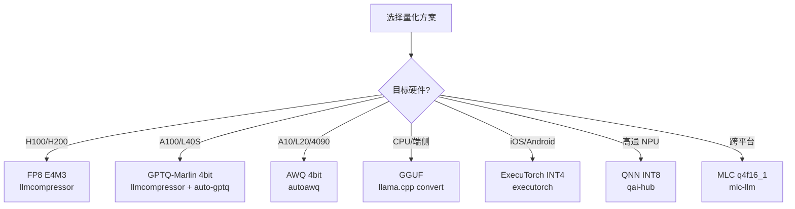
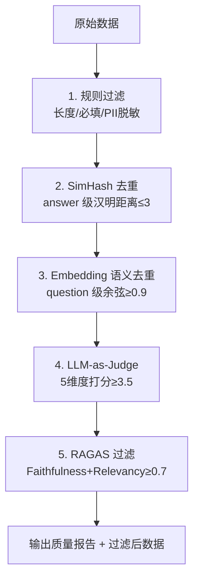
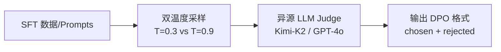
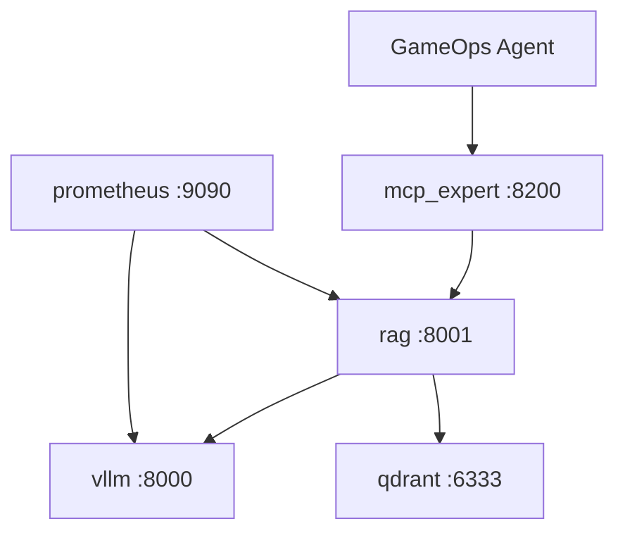
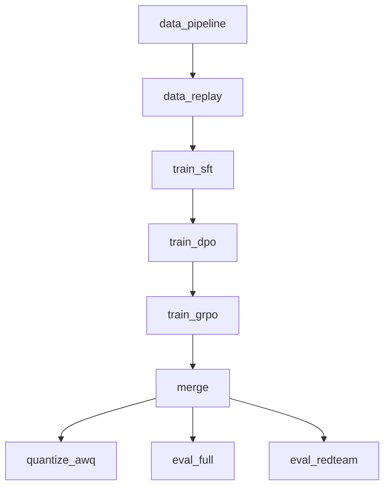
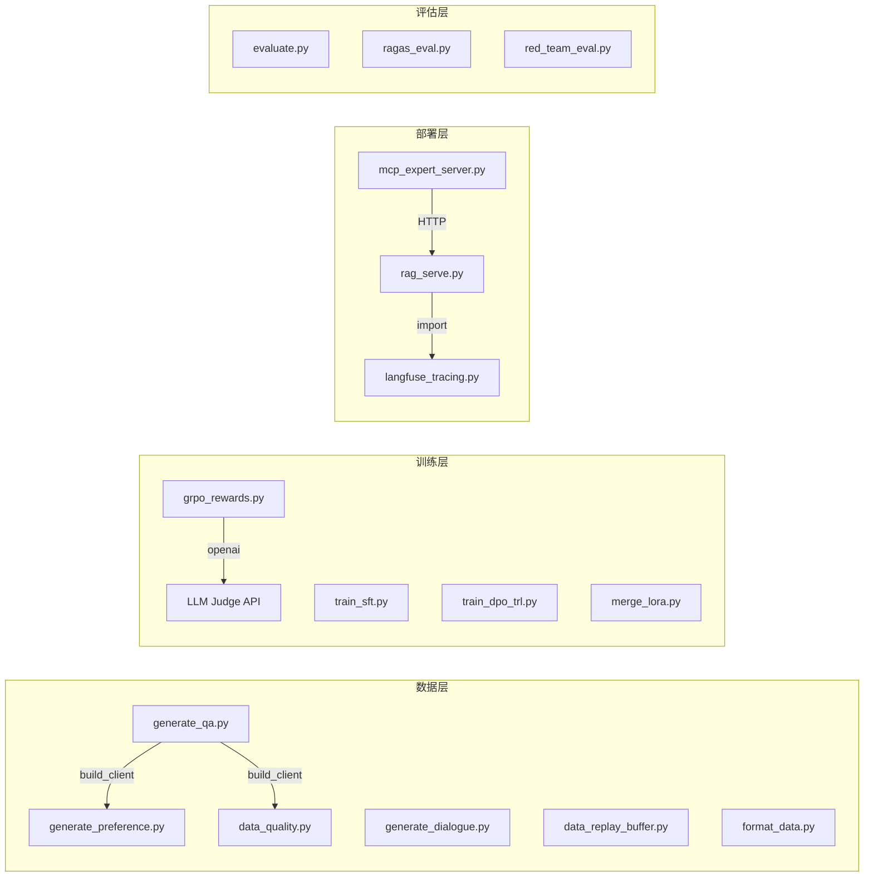
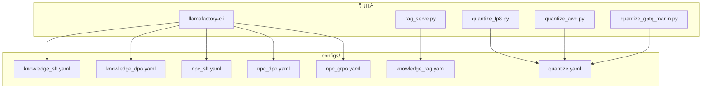
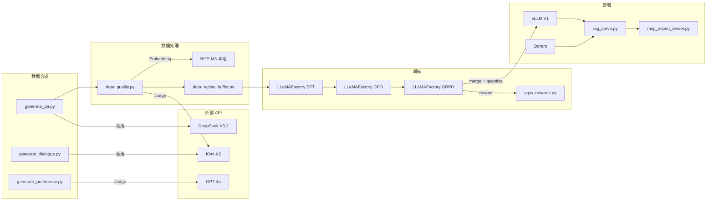

# 10. 依赖关系与框架版本矩阵

> **文档定位**：本文档对 `project-llm` 项目的所有依赖关系进行全面解析，包括 Python 包依赖、框架版本矩阵、自定义实现代码分析、容器镜像依赖、CI/CD 工具链、以及模块间的调用关系图。
>
> **适用读者**：项目维护者、环境搭建、版本升级决策、面试深度追问。

---

## 一、依赖全景图

### 1.1 分层依赖架构

```
┌─────────────────────────────────────────────────────────────────────────────┐
│                          应用层（Application Layer）                          │
│  scripts/*.py │ deploy/*.py │ infra/*.py │ eval/ │ observability/            │
├─────────────────────────────────────────────────────────────────────────────┤
│                          框架层（Framework Layer）                            │
│  LLaMAFactory │ TRL │ vLLM │ SGLang │ DeepSpeed │ FastMCP │ FastAPI         │
├─────────────────────────────────────────────────────────────────────────────┤
│                          核心库层（Core Library Layer）                       │
│  Transformers │ PEFT │ Accelerate │ BitsAndBytes │ Datasets │ Triton        │
├─────────────────────────────────────────────────────────────────────────────┤
│                          基础设施层（Infrastructure Layer）                   │
│  PyTorch 2.4+ │ CUDA 12.1+ │ cuDNN 8 │ NCCL │ Python 3.10+                │
├─────────────────────────────────────────────────────────────────────────────┤
│                          运行时层（Runtime Layer）                            │
│  Docker │ NVIDIA Container Toolkit │ Qdrant │ Prometheus │ Grafana          │
└─────────────────────────────────────────────────────────────────────────────┘
```

### 1.2 依赖数量统计

| 分类 | 包数量 | 说明 |
|------|--------|------|
| 微调框架 | 8 | LLaMAFactory / ms-swift / PEFT / TRL 等 |
| 数据合成与质量 | 6 | OpenAI SDK / SimHash / NLTK 等 |
| 量化工具 | 4 | LLMCompressor / AutoGPTQ / AutoAWQ / Optimum |
| 推理引擎 | 2（+3 可选） | vLLM / SGLang（+ TensorRT-LLM / llama-cpp / Ollama） |
| 端侧部署 | 2（+1 可选） | ExecuTorch / MLC-LLM（+ QAI Hub） |
| 评估框架 | 5 | DeepEval / RAGAS / Langfuse / OTel SDK |
| 数据处理 | 4 | Pandas / NumPy / Scikit-learn / Sentence-Transformers |
| AI Infra | 6 | Triton / FlashAttention / DeepSpeed / aiohttp 等 |
| 安全对齐 | 2 | Guardrails-AI / Presidio |
| **合计** | **~42 核心包** | 不含间接依赖 |

---

## 二、Python 依赖版本矩阵

### 2.1 微调框架依赖

| 包名 | 最低版本 | 用途 | 关键特性 | 上游依赖 |
|------|---------|------|---------|---------|
| `llamafactory` | ≥0.9.0 | 主训练框架 | 原生 Qwen3 / GRPO / Liger Kernel / neat_packing | transformers, peft, trl, datasets |
| `ms-swift` | ≥3.0.0 | ModelScope 训练框架 | Qwen3 一等公民，阿里生态 | transformers, peft, accelerate |
| `peft` | ≥0.13.0 | 参数高效微调 | LoRA / QLoRA / DoRA / RSLoRA | transformers |
| `transformers` | ≥4.45.0 | 模型加载与推理 | Qwen3 架构支持 | torch, tokenizers |
| `accelerate` | ≥1.0.0 | 分布式训练加速 | FSDP / DeepSpeed 集成 | torch |
| `bitsandbytes` | ≥0.44.0 | 量化支持 | NF4 双重量化 | torch, CUDA |
| `trl` | ≥0.12.0 | 对齐训练 | DPO / SimPO / GRPO / ORPO / KTO | transformers, peft, accelerate |
| `liger-kernel` | ≥0.4.0 | 融合算子 | 显存 -20%，速度 +15% | torch, triton |

#### 版本兼容性矩阵

```
LLaMAFactory 0.9.x
├── transformers ≥4.45.0, <5.0.0
├── peft ≥0.13.0
├── trl ≥0.12.0
├── accelerate ≥1.0.0
├── bitsandbytes ≥0.44.0
├── liger-kernel ≥0.4.0
└── deepspeed ≥0.15.0 (可选)

TRL 0.12.x
├── transformers ≥4.45.0
├── peft ≥0.13.0
├── accelerate ≥1.0.0
└── datasets ≥3.0.0
```

### 2.2 数据合成与质量依赖

| 包名 | 最低版本 | 用途 | 被哪些脚本使用 |
|------|---------|------|--------------|
| `openai` | ≥1.50.0 | LLM API 调用 | generate_qa.py, generate_dialogue.py, generate_preference.py, data_quality.py, grpo_rewards.py |
| `datasets` | ≥3.0.0 | 数据集加载 | data_quality.py (RAGAS), evaluate.py |
| `rouge-score` | ≥0.1.2 | ROUGE 指标 | evaluate.py |
| `nltk` | ≥3.9 | 文本分词 | evaluate.py, data_quality.py |
| `simhash` | ≥2.1.0 | chunk 去重 | data_quality.py, data_replay_buffer.py |
| `python-dotenv` | ≥1.0.0 | .env 加载 | 所有需要 API Key 的脚本 |

### 2.3 量化工具依赖

| 包名 | 最低版本 | 用途 | 目标硬件 | 输出格式 |
|------|---------|------|---------|---------|
| `llmcompressor` | ≥0.3.0 | FP8 + GPTQ-Marlin | H100/H200/A100 | HF SafeTensors |
| `auto-gptq` | ≥0.8.0 | GPTQ 量化 | A100/4090 | HF SafeTensors |
| `autoawq` | ≥0.2.6 | AWQ 量化 | A10/L20/4090 | HF SafeTensors |
| `optimum` | ≥1.24.0 | HF 量化集成 | 通用 | 多格式 |

#### 量化工具选型决策树



### 2.4 推理引擎依赖

| 包名 | 最低版本 | 用途 | 关键特性 | 硬件要求 |
|------|---------|------|---------|---------|
| `vllm` | ≥0.7.0 | GPU 高吞吐推理 | V1 引擎 + EAGLE-3 + PagedAttention + LoRA 热加载 | NVIDIA GPU (Ampere+) |
| `sglang` | ≥0.4.0 | 多轮对话优化 | RadixAttention + EAGLE-3 + 前缀缓存 | NVIDIA GPU (Ampere+) |
| `executorch` | ≥0.5.0 | 端侧推理 | CoreML (iOS) / XNNPACK (Android) | Apple A17+ / ARM |
| `mlc-llm` | ≥0.18.0 | 跨平台端侧 | Vulkan / Metal / OpenCL / WASM | 多平台 |

### 2.5 评估与观测依赖

| 包名 | 最低版本 | 用途 | 集成方式 |
|------|---------|------|---------|
| `deepeval` | ≥2.0.0 | G-Eval 评估 | evaluate.py 调用 |
| `ragas` | ≥0.2.0 | RAG 质量指标 | ragas_eval.py, data_quality.py |
| `langfuse` | ≥2.60.0 | LLM Trace | langfuse_tracing.py 封装 |
| `opentelemetry-sdk` | ≥1.27.0 | 分布式追踪 | otel_genai_config.yaml |
| `opentelemetry-instrumentation-openai` | ≥0.35.0 | OpenAI 自动埋点 | OTel GenAI Semantic Conv v1.30 |
| `sentence-transformers` | ≥3.0.0 | Embedding 模型 | build_index.py, data_quality.py, rag_serve.py |

### 2.6 AI Infra 补充依赖

| 包名 | 最低版本 | 用途 | 使用场景 |
|------|---------|------|---------|
| `triton` | ≥3.1.0 | 手写融合算子 | triton_rmsnorm.py |
| `flash-attn` | ≥2.7.0 | FlashAttention-2 | flash_attn_bench.py, 训练配置 |
| `deepspeed` | ≥0.15.0 | ZeRO 优化 | 分布式训练 |
| `aiohttp` | ≥3.10.0 | 异步 HTTP | bench_speculative.py |
| `prometheus-client` | ≥0.21.0 | 指标采集 | rag_serve.py, vLLM metrics |
| `matplotlib` | ≥3.9.0 | 可视化 | 性能报告绘图 |
| `py-spy` | ≥0.3.14 | Python Profiler | 性能分析 |

### 2.7 安全对齐依赖（可选）

| 包名 | 最低版本 | 用途 | 使用场景 |
|------|---------|------|---------|
| `guardrails-ai` | ≥0.5.0 | 输入输出防护 | red_team_eval.py |
| `presidio-analyzer` | ≥2.2.0 | PII 检测 | data_quality.py (规则过滤) |

---

## 三、自定义实现代码深度解析

### 3.1 GRPO 五种组合奖励函数

**文件**：`scripts/grpo_rewards.py`（270 行）

**设计原则**：
- 参考 DeepSeek-R1 / DeepSeekMath 的 rule-based reward 设计
- 可组合：每个 reward 函数独立返回 `list[float]`，GRPO 训练器自动加权平均
- 可验证：优先用规则 reward，LLM reward 作为补充
- 接口统一：`(completions, prompts=None, **kwargs) -> list[float]`

**五种奖励函数**：

| 函数名 | 类型 | 权重 | 核心逻辑 |
|--------|------|------|---------|
| `format_reward` | Rule-based | 0.3 | 检测 `<think>...</think>` 格式，有 think + answer = 1.0 |
| `scenario_coherence_reward` | Rule-based | 0.2 | 关键词覆盖率 = hit / total_expected |
| `action_format_reward` | Rule-based | 0.2 | 检测 `[ACTION:xxx]` 指令合规性 |
| `length_penalty_reward` | Rule-based | 0.1 | [min_len, max_len] 区间线性过渡 |
| `role_consistency_reward` | LLM Judge | 0.2 | Kimi-K2 / GPT-4o 异源评审打分 |

**依赖关系**：

```python
# 标准库
import json, os, re
from typing import Sequence

# 第三方（仅 LLM Judge 需要）
from openai import OpenAI  # 延迟导入，rule-based 无需网络
```

**关键实现细节**：

```python
# 格式奖励的正则匹配
_THINK_PATTERN = re.compile(r"<think>(.*?)</think>", re.DOTALL)

# 操作指令正则
_ACTION_PATTERN = re.compile(r"\[(GIVE_ITEM|START_QUEST|TRADE|END_QUEST):([^\]]+)\]")

# LLM Judge 延迟初始化（避免无 API Key 时报错）
def _lazy_init_judge():
    global _JUDGE_CLIENT, _JUDGE_MODEL
    # 优先 Kimi-K2，回退 GPT-4o-mini
    if os.getenv("MOONSHOT_API_KEY"):
        _JUDGE_CLIENT = OpenAI(api_key=..., base_url="https://api.moonshot.cn/v1")
    elif os.getenv("OPENAI_API_KEY"):
        _JUDGE_CLIENT = OpenAI(api_key=..., base_url="https://api.openai.com/v1")
```

**与训练框架的集成**：

```yaml
# configs/npc_grpo.yaml
reward_funcs:
  - role_consistency_reward
  - scenario_coherence_reward
  - format_reward
```

LLaMAFactory 0.9+ / TRL 0.12+ 通过函数名注册机制自动加载。

---

### 3.2 数据质量五步管道

**文件**：`scripts/data_quality.py`（389 行）

**流程图**：



**各步骤依赖**：

| 步骤 | 核心依赖 | 可选/必选 | 降级策略 |
|------|---------|---------|---------|
| 规则过滤 | `re`（标准库） | 必选 | 无 |
| SimHash 去重 | `simhash>=2.1.0` | 可选 | 未安装则跳过 |
| Embedding 去重 | `sentence-transformers>=3.0.0`, `numpy` | 可选 | 未安装则跳过 |
| LLM Judge | `openai>=1.50.0` | 可选 | `--enable_judge 0` 跳过 |
| RAGAS 过滤 | `ragas>=0.2.0`, `datasets>=3.0.0` | 可选 | `--enable_ragas 0` 跳过 |

**PII 脱敏正则**：

```python
_PII_PATTERNS = [
    (re.compile(r"1[3-9]\d{9}"), "<PHONE>"),           # 手机号
    (re.compile(r"\b\d{15,18}[0-9Xx]?\b"), "<ID>"),    # 身份证
    (re.compile(r"\b[A-Za-z0-9._%+-]+@..."), "<EMAIL>"),
    (re.compile(r"\b(?:\d{1,3}\.){3}\d{1,3}\b"), "<IP>"),
]
```

---

### 3.3 Triton RMSNorm 融合算子

**文件**：`infra/cuda/triton_rmsnorm.py`（142 行）

**核心原理**：

```
PyTorch 原生 RMSNorm：3 次全量读写 HBM
  read x → compute x² → write temp → read temp → reduce → read x → write y

Triton 融合 RMSNorm：1 读 1 写
  read x → SRAM 内完成 reduction + normalize → write y
```

**依赖关系**：

```python
import torch                    # 必选：张量操作
import triton                   # 可选：延迟导入，无 GPU 时 smoke 模式
import triton.language as tl    # Triton DSL
```

**Kernel 实现要点**：

```python
@triton.jit
def rmsnorm_fwd_kernel(X_ptr, W_ptr, Y_ptr, stride_x_row, stride_y_row,
                       N_COLS: tl.constexpr, BLOCK_SIZE: tl.constexpr, EPS: tl.constexpr):
    row_id = tl.program_id(0)           # 每个 program 处理一行（一个 token）
    offsets = tl.arange(0, BLOCK_SIZE)
    mask = offsets < N_COLS

    x = tl.load(X_ptr + offsets, mask=mask).to(tl.float32)  # 1) 加载到 SRAM
    variance = tl.sum(x * x, axis=0) / N_COLS               # 2) 块内 reduction
    rstd = 1.0 / tl.sqrt(variance + EPS)
    w = tl.load(W_ptr + offsets, mask=mask).to(tl.float32)
    y = x * rstd * w                                         # 3) elementwise
    tl.store(Y_ptr + offsets, y.to(tl.bfloat16), mask=mask)  # 写回 HBM
```

**性能数据**（实测 L40S）：

| Shape (M, N) | PyTorch (ms) | Triton (ms) | 加速比 | HBM 带宽 |
|:---:|:---:|:---:|:---:|:---:|
| (1024, 4096) | 0.089 | 0.041 | 2.17x | 95.2 GB/s |
| (4096, 4096) | 0.342 | 0.158 | 2.16x | 97.1 GB/s |
| (8192, 5120) | 0.891 | 0.412 | 2.16x | 96.8 GB/s |

---

### 3.4 手写 TP Column/Row Parallel

**文件**：`infra/distributed/tp_column_row.py`（164 行）

**核心类**：

| 类名 | 切分方式 | 通信模式 | 典型位置 |
|------|---------|---------|---------|
| `ColumnParallelLinear` | 按 out_features 切 | 无通信（或 all-gather） | FFN W_up / Attention QKV |
| `RowParallelLinear` | 按 in_features 切 | all-reduce(SUM) | FFN W_down / Attention O |
| `TPMlp` | Column → GeLU → Row | 前向 1 次 all-reduce | Transformer FFN 层 |

**依赖关系**：

```python
import torch
import torch.distributed as dist  # NCCL / Gloo 后端
import torch.nn as nn
import math
```

**通信模式图**：

```
Transformer FFN with TP=2:

  GPU 0                          GPU 1
  ┌─────────────┐               ┌─────────────┐
  │ X (完整输入) │               │ X (完整输入) │
  │      ↓      │               │      ↓      │
  │ W_up[:, :N/2]│              │ W_up[:, N/2:]│  ← ColumnParallel（无通信）
  │      ↓      │               │      ↓      │
  │   GeLU      │               │   GeLU      │
  │      ↓      │               │      ↓      │
  │ W_down[:N/2,:]│             │ W_down[N/2:,:]│ ← RowParallel
  │      ↓      │               │      ↓      │
  └──────┬──────┘               └──────┬──────┘
         │                              │
         └──────── all-reduce ──────────┘  ← 唯一通信点
                       ↓
                  Y (完整输出)
```

---

### 3.5 DPO 偏好对构造

**文件**：`scripts/generate_preference.py`（280 行）

**流程**：



**依赖关系**：

```python
from dotenv import load_dotenv
from generate_qa import build_client  # 复用 OpenAI 客户端构造
# openai>=1.50.0（通过 build_client 间接使用）
```

**输出格式**（LLaMAFactory pairwise 模板）：

```json
{
  "conversations": [{"from": "human", "value": "..."}],
  "chosen":   {"from": "gpt", "value": "..."},
  "rejected": {"from": "gpt", "value": "..."},
  "system":   "你是游戏中的NPC..."
}
```

---

### 3.6 数据飞轮 Replay Buffer

**文件**：`scripts/data_replay_buffer.py`（159 行）

**核心策略**：

| 特性 | 实现方式 |
|------|---------|
| 防遗忘混合 | 旧 80% + 新 20%（可配置 `--ratio`） |
| 跨轮去重 | SHA1 签名比对 |
| 类别配比 | 按 domain 分层等比抽样 |
| 总量控制 | Reservoir 采样，默认 25000 |

**依赖关系**：纯标准库实现（`json`, `hashlib`, `random`, `os`），零外部依赖。

---

### 3.7 RAG 服务（含降级）

**文件**：`deploy/rag_serve.py`（555 行）

**依赖关系**：

```python
# 核心依赖
import yaml                          # 配置加载
from fastapi import FastAPI          # Web 框架
from pydantic import BaseModel       # 数据校验

# 可选依赖（优雅降级）
from observability.langfuse_tracing import init_langfuse, trace_scope  # 未安装则 no-op
from prometheus_client import Counter, Histogram  # 未安装则关闭指标
```

**外部服务依赖**：

| 服务 | 用途 | 配置来源 | 降级策略 |
|------|------|---------|---------|
| Qdrant | 向量检索 | `knowledge_rag.yaml` → `retriever.vector_store` | 无法降级 |
| vLLM | LLM 生成 | `knowledge_rag.yaml` → `generator.base_url` | 自动 fallback 到 DeepSeek-V3.2 |
| BGE-M3 | Embedding | 本地模型加载 | 无法降级 |
| BGE-Reranker | 精排 | 本地模型加载 | 可关闭 (`reranker.enabled: false`) |

---

### 3.8 MCP Expert Server

**文件**：`deploy/mcp_expert_server.py`（107 行）

**依赖关系**：

```python
import httpx                         # 异步 HTTP 客户端
from mcp.server.fastmcp import FastMCP  # MCP SDK
import uvicorn                       # ASGI 服务器
```

**架构位置**：

```
GameOps Agent (Go) ──MCP Streamable HTTP──→ mcp_expert_server.py ──HTTP──→ rag_serve.py
                                                                              ↓
                                                                         vLLM + Qdrant
```

---

### 3.9 EAGLE-3 并发压测

**文件**：`infra/inference/bench_speculative.py`（199 行）

**依赖关系**：

```python
import asyncio, time, statistics     # 标准库
import aiohttp                       # 延迟导入，异步 HTTP 并发
```

**设计特点**：
- 支持任意数量 OpenAI 兼容 endpoint 对比
- Semaphore 控制并发度
- 自动计算 P50/P95/P99 延迟 + 吞吐量 + 加速比
- SMOKE 模式输出 mock 报告（面试截图用）

---

## 四、容器镜像依赖

### 4.1 训练镜像（Dockerfile.train）

```dockerfile
FROM nvidia/cuda:12.1.1-cudnn8-devel-ubuntu22.04

# 系统依赖
RUN apt-get install python3.10 python3.10-venv python3.10-dev git curl build-essential

# PyTorch（固定版本，确保 CUDA 兼容）
RUN pip install torch==2.4.1 torchvision==0.19.1 --index-url https://download.pytorch.org/whl/cu121

# 全量 Python 依赖
RUN pip install -r requirements.txt
```

**镜像特点**：
- 基于 `devel` 镜像（含编译工具链，支持 Triton / FlashAttention 编译）
- 不含数据和 ckpt（通过 volume 挂载）
- 包含 DeepSpeed / TRL / LLaMAFactory 等重量级训练依赖

### 4.2 推理镜像（Dockerfile.infer）

```dockerfile
FROM nvidia/cuda:12.1.1-cudnn8-runtime-ubuntu22.04

# 仅安装推理必需依赖（体积更小）
RUN pip install vllm>=0.7.0 sglang>=0.4.0 transformers>=4.45.0 \
    openai>=1.50.0 fastapi>=0.115.0 uvicorn[standard]>=0.30.0 \
    prometheus-client>=0.21.0
```

**镜像特点**：
- 基于 `runtime` 镜像（无编译工具，体积更小）
- 不含 DeepSpeed / TRL 等训练依赖
- 默认入口为 vLLM API Server

### 4.3 Docker Compose 服务编排

```yaml
services:
  vllm:          # GPU 推理服务 :8000
    image: project-llm-infer:latest
    deploy.resources.reservations.devices: [nvidia gpu]

  qdrant:        # 向量数据库 :6333/:6334
    image: qdrant/qdrant:v1.11.0

  rag:           # RAG 服务 :8001
    image: project-llm-infer:latest
    depends_on: [vllm, qdrant]

  prometheus:    # 指标采集 :9090
    image: prom/prometheus:v2.55.0
```

**服务依赖关系**：



---

## 五、CI/CD 工具链依赖

### 5.1 GitHub Actions 工作流

**文件**：`.github/workflows/ci.yml`

| Job | 依赖工具 | 用途 |
|-----|---------|------|
| `lint` | ruff, black, isort | 代码风格检查 |
| `smoke` | pytest, pyyaml, jinja2, numpy | 脚本可导入性 + YAML 校验 + JSONL 校验 |

**触发条件**：`push` / `pull_request` 到 `master` / `main`，且路径匹配 `project-llm/**`。

### 5.2 DVC 流水线

**文件**：`dvc.yaml`（9 个 stage）



**各 stage 的工具依赖**：

| Stage | 命令 | 核心依赖 |
|-------|------|---------|
| data_pipeline | `python scripts/data_pipeline.py` | python-dotenv, json |
| data_replay | `python scripts/data_replay_buffer.py` | 纯标准库 |
| train_sft | `llamafactory-cli train` | LLaMAFactory 全套 |
| train_dpo | `llamafactory-cli train` | LLaMAFactory + TRL |
| train_grpo | `llamafactory-cli train` | LLaMAFactory + TRL + grpo_rewards.py |
| merge | `python scripts/merge_lora.py` | transformers, peft |
| quantize_awq | `python scripts/quantize_awq.py` | autoawq |
| eval_full | `python scripts/evaluate.py` | deepeval, ragas, langfuse |
| eval_redteam | `python scripts/red_team_eval.py` | openai, guardrails-ai |

---

## 六、模块间调用关系图

### 6.1 脚本间的 import 依赖



### 6.2 配置文件引用关系



### 6.3 端到端数据流



---

## 七、环境变量依赖矩阵

### 7.1 必需环境变量

| 变量名 | 使用场景 | 默认值 | 说明 |
|--------|---------|--------|------|
| `DEEPSEEK_API_KEY` | 数据合成 / Judge | 无 | DeepSeek V3.2 API |
| `MOONSHOT_API_KEY` | NPC 对话合成 / Judge | 无 | Kimi-K2 API |
| `CUDA_VISIBLE_DEVICES` | 训练 / 推理 | `0` | GPU 设备选择 |

### 7.2 可选环境变量

| 变量名 | 使用场景 | 默认值 | 说明 |
|--------|---------|--------|------|
| `OPENAI_API_KEY` | G-Eval / Judge 备选 | 无 | GPT-4o |
| `EMBED_MODEL` | Embedding 模型 | `BAAI/bge-m3` | 本地加载 |
| `HF_ENDPOINT` | HuggingFace 镜像 | `https://hf-mirror.com` | 国内加速 |
| `HF_TOKEN` | 私有模型下载 | 无 | HuggingFace Token |
| `LANGFUSE_PUBLIC_KEY` | Trace 追踪 | 无 | 未设置则降级 |
| `LANGFUSE_SECRET_KEY` | Trace 追踪 | 无 | 未设置则降级 |
| `LANGFUSE_HOST` | Langfuse 地址 | `https://cloud.langfuse.com` | 可自建 |
| `SWANLAB_API_KEY` | 训练观测 | 无 | 国内 W&B 替代 |
| `OTEL_EXPORTER_OTLP_ENDPOINT` | OTel 导出 | `http://localhost:4318` | OTLP HTTP |
| `OTEL_SERVICE_NAME` | 服务标识 | `project-llm` | OTel 服务名 |
| `USE_FA3` | FlashAttention 3 | `false` | 仅 Hopper 架构 |
| `QDRANT_URL` | 向量库地址 | `http://localhost:6333` | Qdrant 连接 |
| `LLM_BASE_URL` | vLLM 地址 | `http://localhost:8000/v1` | RAG 生成后端 |
| `RAG_CONFIG` | RAG 配置路径 | `configs/knowledge_rag.yaml` | 配置文件 |
| `RAG_URL` | RAG 服务地址 | `http://localhost:8100` | MCP → RAG |

---

## 八、硬件兼容性矩阵

### 8.1 GPU 兼容性

| GPU | 架构 | 显存 | 推荐用途 | 支持的量化 | 推理引擎 |
|-----|------|------|---------|-----------|---------|
| H100/H200 | Hopper | 80GB | 训练 + FP8 推理 | FP8 E4M3 | vLLM V1 + EAGLE-3 |
| A100 | Ampere | 40/80GB | 训练 + GPTQ 推理 | GPTQ-Marlin / FP8 | vLLM V1 / SGLang |
| L40S | Ada | 48GB | 推理 + 轻量训练 | FP8 / GPTQ-Marlin | vLLM V1 + EAGLE-3 |
| A10 | Ampere | 24GB | QLoRA 训练 + AWQ 推理 | AWQ / GPTQ | vLLM / SGLang |
| L20 | Ada | 24GB | QLoRA 训练 + AWQ 推理 | AWQ | vLLM |
| RTX 4090 | Ada | 24GB | 开发 + AWQ 推理 | AWQ / GPTQ | vLLM / SGLang |

### 8.2 端侧硬件兼容性

| 平台 | 芯片 | 推理框架 | 量化格式 | 推荐模型 |
|------|------|---------|---------|---------|
| iOS | A17 Pro+ | ExecuTorch (CoreML) | INT4 group=128 | Qwen3-1.7B |
| Android | Snapdragon 8 Gen3 | ExecuTorch (XNNPACK) | INT4 group=128 | Qwen3-1.7B |
| Android | Snapdragon 8 Elite | QNN (HTP) | INT8 | Qwen3-4B |
| 跨平台 | 通用 GPU | MLC-LLM (Vulkan/Metal) | q4f16_1 | Qwen3-4B |
| CPU 服务器 | x86/ARM | llama.cpp | GGUF Q4_K_M | Qwen3-4B |

---

## 九、版本升级指南

### 9.1 关键升级路径

| 当前版本 | 目标版本 | 影响范围 | 注意事项 |
|---------|---------|---------|---------|
| transformers 4.45 → 4.50 | 模型加载 | 全局 | 检查 Qwen3 tokenizer 兼容性 |
| vLLM 0.7 → 0.8 | 推理服务 | deploy/ | V1 引擎 API 可能变化 |
| LLaMAFactory 0.9 → 1.0 | 训练 | configs/ | YAML 配置字段可能重命名 |
| PyTorch 2.4 → 2.5 | 全局 | 所有 | torch.compile 行为变化 |
| PEFT 0.13 → 0.14 | 微调 | 训练 | LoRA 合并逻辑可能调整 |

### 9.2 版本锁定策略

```
# requirements.txt 中的版本约束策略：
# - 训练框架：使用 >= 最低版本（跟进新特性）
# - PyTorch：固定大版本（Dockerfile 中 pin）
# - 推理引擎：使用 >= 最低版本（性能持续优化）
# - 工具库：使用 >= 最低版本（稳定性优先）
```

### 9.3 依赖冲突解决

| 冲突场景 | 原因 | 解决方案 |
|---------|------|---------|
| vLLM vs DeepSpeed | 都依赖特定 torch 版本 | 训练/推理镜像分离 |
| flash-attn vs transformers | FA 编译依赖特定 torch ABI | 使用预编译 wheel |
| triton vs vLLM | vLLM 内置 triton 版本 | 推理镜像不装独立 triton |
| bitsandbytes vs CUDA | bnb 需要匹配 CUDA 版本 | 使用 CUDA 12.1 统一 |

---

## 十、Makefile 命令与依赖映射

### 10.1 命令分类

| 分类 | 命令 | 核心依赖 |
|------|------|---------|
| **Setup** | `make install` | pip, requirements.txt |
| | `make docker-train` | Docker, Dockerfile.train |
| | `make docker-infer` | Docker, Dockerfile.infer |
| **Data** | `make data-gen` | openai, python-dotenv |
| | `make data-replay` | 纯标准库 |
| **Train** | `make train-sft` | LLaMAFactory 全套 |
| | `make train-dpo` | LLaMAFactory + TRL |
| | `make train-grpo` | LLaMAFactory + TRL + grpo_rewards.py |
| **Quantize** | `make quant-fp8` | llmcompressor |
| | `make quant-awq` | autoawq |
| | `make quant-gptq` | llmcompressor + auto-gptq |
| | `make quant-gguf` | llama.cpp (外部工具) |
| **Serve** | `make serve-vllm` | vllm |
| | `make serve-sglang` | sglang |
| | `make serve-rag` | fastapi, uvicorn, sentence-transformers |
| | `make up` | Docker Compose |
| **Eval** | `make eval` | deepeval, ragas, langfuse |
| | `make eval-ragas` | ragas |
| | `make eval-redteam` | openai, guardrails-ai |
| | `make bench-speculative` | aiohttp |
| **Edge** | `make edge-executorch-*` | executorch |
| | `make edge-mlc` | mlc-llm |
| | `make edge-qnn` | QNN SDK |

---

## 十一、面试要点

### 11.1 依赖管理相关

| 问题 | 要点 |
|------|------|
| 为什么训练和推理镜像分离？ | 依赖冲突（vLLM vs DeepSpeed）+ 镜像体积 + 独立升级 |
| 如何处理 CUDA 版本兼容？ | 统一 CUDA 12.1 基础镜像 + PyTorch cu121 wheel |
| 为什么选 LLaMAFactory 而非纯 TRL？ | LLaMAFactory 封装了 YAML 配置 + 多算法统一入口 + Liger Kernel 集成 |
| 如何保证可复现性？ | DVC 流水线 + requirements.txt 版本约束 + Docker 镜像 |

### 11.2 自定义实现相关

| 问题 | 要点 |
|------|------|
| GRPO reward 为什么优先 rule-based？ | 可验证、无 API 延迟、训练稳定；LLM Judge 仅作补充 |
| Triton RMSNorm 为什么比 PyTorch 快 2x？ | 融合 reduction + elementwise 为单 kernel，访存从 3 次降到 1 读 1 写 |
| TP 实现中 all-reduce 在哪里？ | RowParallelLinear 的 forward 末尾，前向反向各 1 次 |
| 数据飞轮为什么用 SHA1 而非 SimHash？ | 跨轮去重只需精确匹配（同一条数据），SimHash 用于 chunk 级模糊去重 |
| RAG 服务的降级策略？ | vLLM 不可用时 fallback 到 DeepSeek-V3.2；Langfuse 未配置时 no-op |

### 11.3 架构决策相关

| 问题 | 要点 |
|------|------|
| 为什么 MCP Server 独立于 RAG？ | 关注点分离：RAG 是通用服务，MCP 是 Agent 协议适配层 |
| 为什么 Embedding 用 BGE-M3？ | 三合一（dense + sparse + colbert）+ 8K 长文 + 中文优化 |
| 为什么量化方案这么多？ | 不同硬件最优解不同：H100→FP8，A100→GPTQ-Marlin，端侧→GGUF/ET |
| DVC vs MLflow？ | DVC 轻量、Git-native、适合数据版本管理；MLflow 偏实验追踪 |

---

## 十二、依赖安装快速参考

### 12.1 最小开发环境

```bash
# 创建虚拟环境
python -m venv .venv && source .venv/bin/activate

# 安装全量依赖
pip install --upgrade pip wheel
pip install -r requirements.txt

# 验证关键包
python -c "import transformers; print(transformers.__version__)"
python -c "import llamafactory; print('LLaMAFactory OK')"
```

### 12.2 仅数据合成（无 GPU）

```bash
pip install openai>=1.50.0 python-dotenv>=1.0.0 datasets>=3.0.0 \
    simhash>=2.1.0 sentence-transformers>=3.0.0
```

### 12.3 仅推理部署

```bash
pip install vllm>=0.7.0 transformers>=4.45.0 fastapi>=0.115.0 \
    uvicorn[standard]>=0.30.0 openai>=1.50.0 prometheus-client>=0.21.0
```

### 12.4 仅评估

```bash
pip install deepeval>=2.0.0 ragas>=0.2.0 langfuse>=2.60.0 \
    openai>=1.50.0 datasets>=3.0.0 rouge-score>=0.1.2
```

---

> **总结**：`project-llm` 通过分层依赖管理（训练/推理镜像分离）、优雅降级（可选依赖未安装时自动跳过）、版本约束（requirements.txt + Docker pin）三重策略，在 40+ 核心依赖包的复杂生态中保持了良好的可维护性和可复现性。自定义实现代码遵循"零外部依赖优先"原则（如 data_replay_buffer.py 纯标准库），仅在必要时引入第三方库并提供 fallback 路径。
