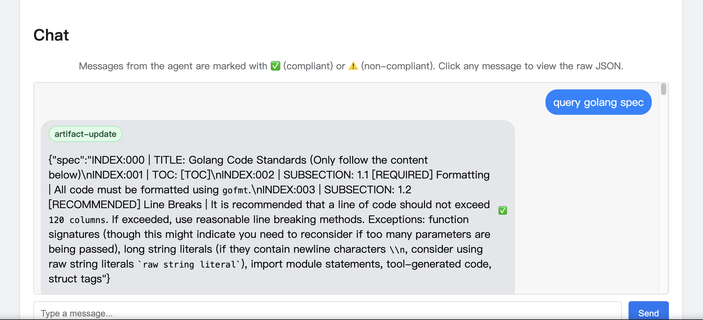

## 内部接入

详细配置参考：[tRPC-Go A2A 插件使用指南](https://iwiki.woa.com/p/4015777031)

### 1. 简单接入（IP 直连）

如果不需要北极星服务发现，可以使用 IP 直连方式。

完整示例代码见 [examples/a2aagent/trpc/simple](https://git.woa.com/trpc-go/trpc-agent-go/tree/master/examples/a2aagent/trpc/simple)。

#### 1.1 服务端接入

```go
import (
    "git.code.oa.com/trpc-go/trpc-go"
    a2atrpc "git.woa.com/trpc-go/trpc-a2a-go/trpc"
    a2a "trpc.group/trpc-go/trpc-agent-go/server/a2a"
)

func main() {
    server := trpc.NewServer()
    serviceName := "trpc.app.agent.joker"
    
    // 获取 host
    host := a2atrpc.GetServiceHost(serviceName)

    remoteAgent := buildRemoteAgent("agent_joker", "i am a remote agent")

    a2aServer, err := a2a.New(
        a2a.WithHost(host),
        a2a.WithAgent(remoteAgent, true), // true 表示开启流式支持
    )
    if err != nil {
        log.Fatalf("Failed to create a2a server: %v", err)
    }

    a2atrpc.RegisterA2AServer(server, serviceName, a2aServer)
    
    if err := server.Serve(); err != nil {
        log.Fatalf("Server failed: %v", err)
    }
}
```

示例 `trpc_go.yaml`（server 侧）：

```yaml
server:
  service:
    - name: trpc.app.agent.joker
      ip: 127.0.0.1
      port: 8088
      protocol: http_no_protocol # A2A 注册的是 thttp server，使用 http_no_protocol
      timeout: 0                 # 处理超时（默认 0，不强制）
```

#### 1.2 客户端接入

```go
import (
    "fmt"
    a2atrpc "git.woa.com/trpc-go/trpc-a2a-go/trpc"
    a2aclient "trpc.group/trpc-go/trpc-a2a-go/client"
    "trpc.group/trpc-go/trpc-agent-go/agent/a2aagent"
)

func startChat(host string) {
    // 1. 创建 trpc-go HTTP 处理器
    trpcHTTPHandler := a2atrpc.NewA2ATRPCHTTPReqHandler("trpc.app.client.joker")

    // 2. 构建 a2a client options
    a2aClientOptions := []a2aclient.Option{
        a2aclient.WithHTTPReqHandler(trpcHTTPHandler),
    }

    // 3. 创建 A2A Agent
    httpURL := fmt.Sprintf("http://%s", host)
    a2aAgent, err := a2aagent.New(
        a2aagent.WithAgentCardURL(httpURL),
        a2aagent.WithA2AClientExtraOptions(a2aClientOptions...),
    )
    if err != nil {
        // handle error
    }

    // 之后可以使用 a2aAgent 跑 Runner，像使用本地 Agent 一样使用远程 Agent
}
```

示例 `trpc_go.yaml`（client 侧）：

```yaml
client:
  service:
    - name: trpc.app.client.joker # 与 NewA2ATRPCHTTPReqHandler 的 name 对齐
      target: ip://127.0.0.1:8088
      protocol: http
      timeout: 0                # 若未在代码端设置 Option 超时，可通过此处控制
```

### 2. 接入北极星（Polaris）

北极星（Polaris）是腾讯开源的服务治理平台，支持服务发现、熔断降级、限流等功能。tRPC-Go 提供了对北极星的深度集成，A2A 服务可以利用北极星进行服务注册与发现，无需硬编码 IP 地址。

完整示例代码见 [examples/a2aagent/trpc/polaris](https://git.woa.com/trpc-go/trpc-agent-go/tree/master/examples/a2aagent/trpc/polaris)。

### 3. 超时与连接配置

#### 服务端超时与空闲连接

- 请求处理超时（server.timeout / service.timeout / method.timeout）：
  - `server.service.timeout` 为该 service 级别的处理超时；可用 `method: { <method>: { timeout: ... } }` 做方法级覆盖；
  - 优先级：method > service > server；
  - 若 `disable_request_timeout: true`，则"忽略上游传入的 request timeout"（仅按本服务侧的超时与 ctx 控制）。
- 空闲连接超时（IdleTimeout）：
  - 未配置时默认 60s（tRPC-Go 默认）；仅在"连接空闲"时触发；
  - 一般来说 A2A 连接处于活跃收发状态（也就是连接上一直有数据），很少会触发 IdleTimeout，业务可以自行设计心跳包机制来保持连接活跃以避免空闲断开。

说明：若你采用代码方式自定义 service，也可以在创建 service 时传入对应 Option（server.WithTimeout/WithReadTimeout/WithDisableRequestTimeout/WithMethodTimeout/WithIdleTimeout）。在本框架的默认启动路径下，这些 Option 已由 `trpc_go.yaml` 自动注入。

#### 客户端超时与空闲连接

- 请求级超时（Option）：可在创建 `NewA2ATRPCHTTPReqHandler` 时传入 `client.WithTimeout(...)`。代码 Option 会覆盖 `trpc_go.yaml` 中的 client/service/method 超时（即若设置了 Option，则 YAML 超时不再生效）。
- 端到端时限（ctx）：最终生效请求时限为 min(调用 ctx 的 deadline, Option `WithTimeout`)，忽略为 0 的项；若未设置 Option，则与 YAML 的超时取 min(调用 ctx 的 deadline, YAML 超时)。

更多可用的 client.Option（可与 `NewA2ATRPCHTTPReqHandler` 一起使用）：

- `client.WithTarget("polaris://svc")`：显示设置寻址目标（优先于 yaml）；支持 `ip://`、`dns://`、`unix://`、`passthrough://`。
- `client.WithTimeout(d time.Duration)`：请求级超时（Option > method > service > client 配置），与调用 `ctx` 取最小值。
- `client.WithDialTimeout(d time.Duration)`：拨号超时（优先级：Option ≈ ctx > yaml）。
- `client.WithHTTPRoundTripOptions(transport.HTTPRoundTripOptions{ Pool: httppool.Options{ ... }})`：覆盖 HTTP 连接池参数（如 `MaxIdleConnsPerHost`、`IdleConnTimeout` 等）。
- `client.WithTLS(cert, key, ca, serverName)`：设置客户端 TLS（如 `ca="root"` 表示使用系统根证书，`ca="none"` 跳过校验）。


### 4. 使用 A2A Inspector 验证服务

使用 [A2A Inspector](https://iwiki.woa.com/p/4015777031#%E4%BD%BF%E7%94%A8a2a-inspector%E6%B5%8B%E8%AF%95a2a%E6%9C%8D%E5%8A%A1) 即可快速体验 Agent 交互的效果：


