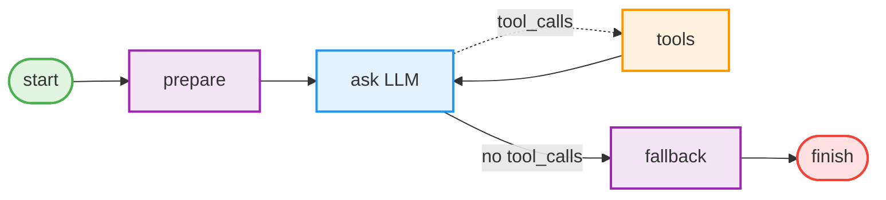
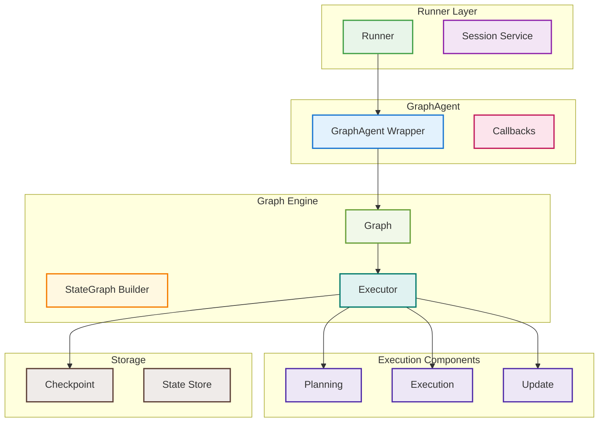
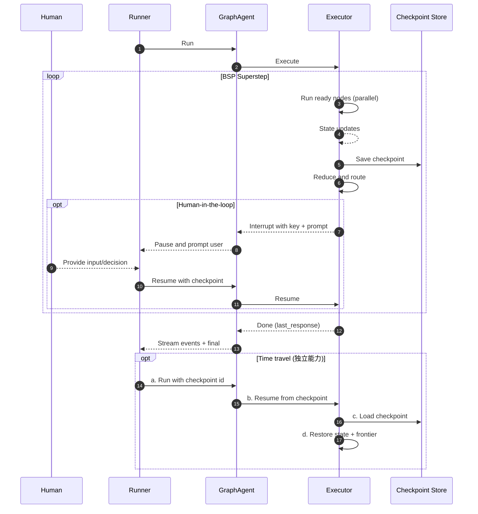
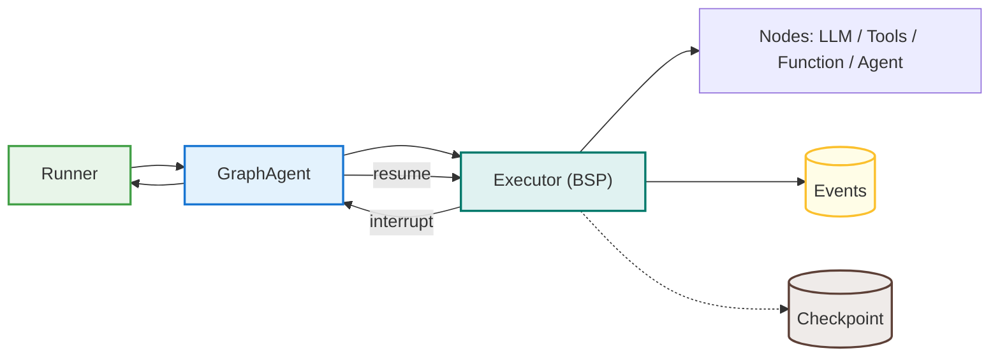
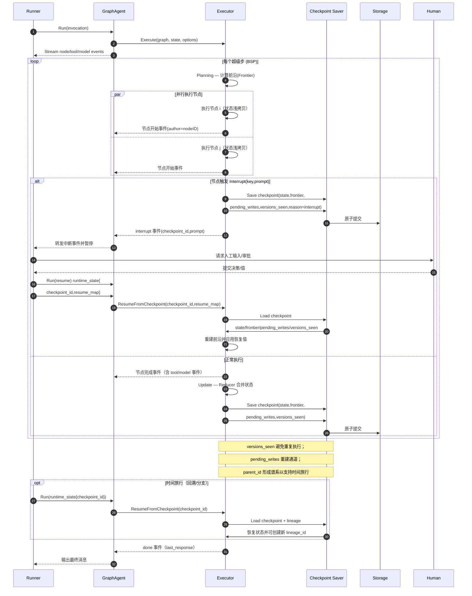
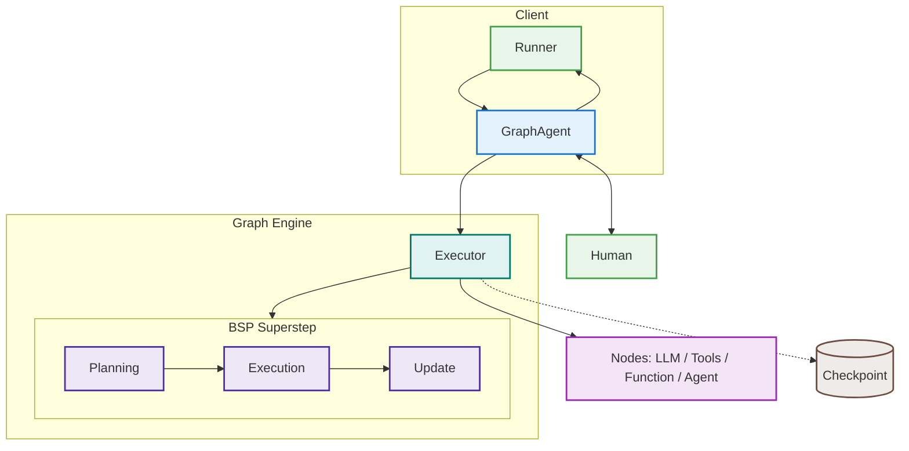
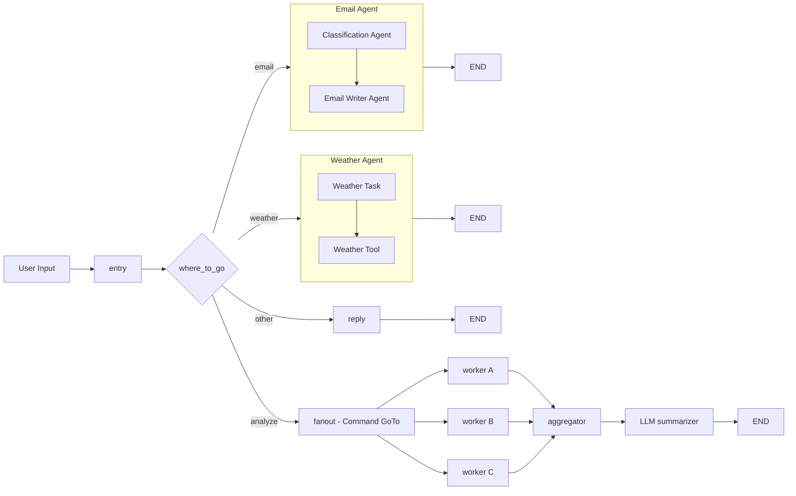
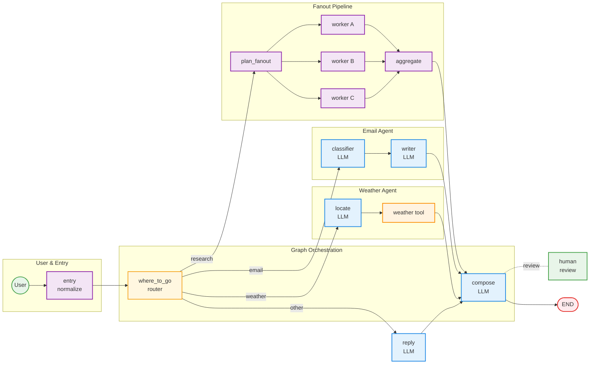
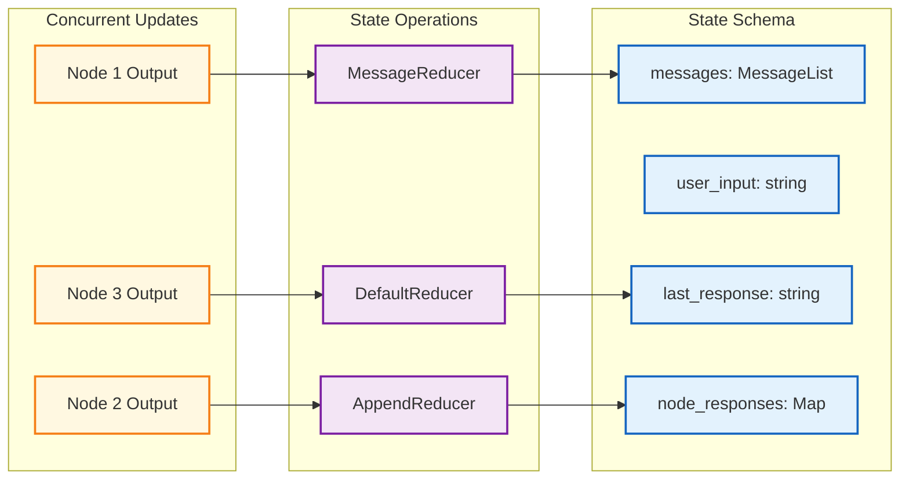

[](https://km.woa.com/group/51889/)

## 背景

围绕 AI Agent 的实践，这几年大体分成两条路线：
- 工作流编排：用节点和边显式控制流程（代表：[LangGraph](https://github.com/langchain-ai/langgraph)、[LangChain](https://github.com/langchain-ai/langchain)、[Eino](https://github.com/cloudwego/eino)）。优点是可控、可调试；不足是灵活性有限。
- 自主协作：把 LLM 作为最小原子让其自主决策（代表：[Microsoft AutoGen](https://github.com/microsoft/autogen)、[Google ADK](https://github.com/google/adk-python)、[Agno](https://github.com/agno-agi/agno)）。优点是简单、自适应；不足是行为不可预测、难审计。

我们最初发布的 [tRPC‑Agent‑Go](https://git.woa.com/trpc-go/trpc-agent-go)（[KM 文章](https://km.woa.com/articles/show/634645)） 更偏向“自主协作”。随着首批用户在真实业务中落地，我们陆续收到大量关于“图编排（Graph）”的需求：希望具备可控的执行路径、完整的可观测性与可恢复能力（审计/合规、人工把关、精确恢复等），同时又不丢失 LLM 的智能决策优势。

基于这些反馈，我们推出了 GraphAgent——它既不是单独的工作流引擎，也不是纯 Agent，而是把两者融合到一起：
- 作为 Graph：BSP 执行模型、条件/工具路由、天然并行。
- 作为 Agent：实现统一接口，既能被上层调用，也能在图内调用子 Agent。
- 附加能力：检查点时间旅行、Human‑in‑the‑Loop、A2A 集成。

下面从“如何使用”到“设计实现”逐层展开。

## 快速开始

### 环境准备

tRPC-Agent-Go 在内外网均有仓库，内网使用时只需要添加以下匿名 import，其余代码均使用外网 github 开源代码：

```go
// 内网版本额外添加（仅内网环境生效）
import _ "git.woa.com/trpc-go/trpc-agent-go/trpc"
```

**仓库地址**：
* 内网仓库：[git.woa.com/trpc-go/trpc-agent-go](https://git.woa.com/trpc-go/trpc-agent-go)  
* GitHub 开源仓库：[github.com/trpc-group/trpc-agent-go](https://github.com/trpc-group/trpc-agent-go)

### 第一个例子

先看一个最简单却完整的工作流：



用代码把这个图变成 tRPC-Agent-Go 的 GraphAgent 实现：

```go
package main

import (
    "context"
    "fmt"
    "strings"
    
    // 内网版本额外添加（仅内网环境生效）
    _ "git.woa.com/trpc-go/trpc-agent-go/trpc"

    "trpc.group/trpc-go/trpc-agent-go/agent/graphagent"
    "trpc.group/trpc-go/trpc-agent-go/graph"
    "trpc.group/trpc-go/trpc-agent-go/model"
    "trpc.group/trpc-go/trpc-agent-go/model/openai"
    "trpc.group/trpc-go/trpc-agent-go/runner"
    "trpc.group/trpc-go/trpc-agent-go/session/inmemory"
    "trpc.group/trpc-go/trpc-agent-go/tool"
    "trpc.group/trpc-go/trpc-agent-go/tool/function"
)

func main() {
    ctx := context.Background()
    
    // 推荐：先定义 Schema，再构建图
    // 对话类应用可直接复用消息模式（包含 messages/user_input/last_response/node_responses 等）
    // 非对话/结构化任务可使用 NewStateSchema 显式定义字段与 Reducer
    // 这里使用内置的消息模式
    sg := graph.NewStateGraph(graph.MessagesStateSchema())
    
    // 常量定义（避免魔法字符串）
    const (
        NodePrepare  = "prepare"
        NodeAsk      = "ask"
        NodeTools    = "tools"
        NodeFallback = "fallback"
        NodeFinish   = "finish"

        ModelName           = "gpt-4o-mini"
        SystemPromptGeneral = "你是一个助手，可以使用计算器工具"
        OutputKeyFinal      = "final_output"
        ToolNameCalculator  = "calculator"
    )

    // prepare 节点：清洗输入
    sg.AddNode(NodePrepare, func(ctx context.Context, s graph.State) (any, error) {
        input := s[graph.StateKeyUserInput].(string)
        return graph.State{graph.StateKeyUserInput: strings.TrimSpace(input)}, nil
    })
    
    // LLM 节点：智能决策
    model := openai.New(ModelName)
    
    // 定义工具（注意泛型和 context）
    type CalcInput struct {
        Expression string `json:"expression"`
    }
    type CalcOutput struct {
        Result float64 `json:"result"`
    }
    
    calcTool := function.NewFunctionTool[CalcInput, CalcOutput](
        func(ctx context.Context, in CalcInput) (CalcOutput, error) {
            // 简单计算器实现
            return CalcOutput{Result: 42}, nil  // 示例
        },
        function.WithName(ToolNameCalculator),
        function.WithDescription("计算数学表达式"),
    )
    
    tools := map[string]tool.Tool{ToolNameCalculator: calcTool}
    sg.AddLLMNode(NodeAsk, model, SystemPromptGeneral, tools)
    
    // 工具执行节点
    sg.AddToolsNode(NodeTools, tools)
    
    // fallback 节点：无需工具时的处理
    sg.AddNode(NodeFallback, func(ctx context.Context, s graph.State) (any, error) {
        return graph.State{graph.StateKeyLastResponse: "已直接回答"}, nil
    })
    
    // finish 节点：汇总输出
    sg.AddNode(NodeFinish, func(ctx context.Context, s graph.State) (any, error) {
        response := s[graph.StateKeyLastResponse].(string)
        return graph.State{OutputKeyFinal: response}, nil
    })
    
    // 配置路由
    sg.SetEntryPoint(NodePrepare)
    sg.AddEdge(NodePrepare, NodeAsk)
    // AddToolsConditionalEdges 用于从 LLM 节点根据是否有 tool_calls 跳转到 tools 或 fallback 节点
    // 工具选择由 LLM 决定，tools 节点可注册多个工具并执行调用
    // LLM 和 tools 可循环，未调用工具时走 fallback 路径
    sg.AddToolsConditionalEdges(NodeAsk, NodeTools, NodeFallback)  // 条件路由
    sg.AddEdge(NodeTools, NodeAsk)
    sg.AddEdge(NodeFallback, NodeFinish)
    sg.SetFinishPoint(NodeFinish)
    
    // 编译图
    g, err := sg.Compile()
    if err != nil {
        panic(err)
    }
    
    // 创建 GraphAgent（使用不同变量名避免与 agent 包冲突）
    graphAgent, err := graphagent.New("demo", g)
    if err != nil {
        panic(err)
    }
    
    // 创建 Runner 并执行
    r := runner.NewRunner("app", graphAgent)
    
    // 运行并处理事件流
    const (
        UserID      = "user1"
        SessionID   = "session1"
        UserMessage = "1+1等于多少？"
    )
    eventCh, err := r.Run(ctx, UserID, SessionID, model.NewUserMessage(UserMessage))
    if err != nil {
        panic(err)
    }
    
    // 消费事件流（流式增量 + 最终消息）
    for ev := range eventCh {
        if ev.Error != nil {
            fmt.Printf("错误: %s\n", ev.Error.Message)
            continue
        }
        if ev.Response == nil || len(ev.Response.Choices) == 0 {
            continue
        }
        ch := ev.Response.Choices[0]
        // 流式增量
        if ev.Response.IsPartial && ch.Delta.Content != "" {
            fmt.Print(ch.Delta.Content)
            continue
        }
        // 最终消息
        if !ev.Response.IsPartial && ch.Message.Content != "" {
            fmt.Println("\n输出:", ch.Message.Content)
        }
    }
}
```

在上述例子中我们可以看到使用 Graph Agent 需要显式建立各种节点，并对这些节点进行连边操作，接下来我们就详细介绍一下 Graph Agent 的各个核心概念。

## 核心概念

### 状态管理

GraphAgent 采用 Schema + Reducer 模式管理状态。先明确状态结构与合并规则，后续节点输入/输出的 key 就有了清晰来源与生命周期约定。

#### 使用内置 Schema

```go
import (
    // 内网版本额外添加（仅内网环境生效）
    _ "git.woa.com/trpc-go/trpc-agent-go/trpc"

    "trpc.group/trpc-go/trpc-agent-go/graph"
)

schema := graph.MessagesStateSchema()

// 预定义字段（键名常量）与语义：
// - graph.StateKeyMessages       ("messages")        对话历史（[]model.Message；MessageReducer + MessageOp 原子合并）
// - graph.StateKeyUserInput      ("user_input")      用户输入（string；一次性，成功执行后清空）
// - graph.StateKeyLastResponse   ("last_response")   最后响应（string）
// - graph.StateKeyNodeResponses  ("node_responses")  各节点输出（map[string]any；并行汇总读取）
// - graph.StateKeyMetadata       ("metadata")        元数据（map[string]any；MergeReducer 合并）

// 其他一次性/系统键（按需使用）：
// - graph.StateKeyOneShotMessages ("one_shot_messages")  一次性覆盖本轮输入（[]model.Message）
// - graph.StateKeySession         ("session")            会话对象（系统使用）
// - graph.StateKeyExecContext     ("exec_context")       执行上下文（事件流等，系统使用）
```

#### 自定义 Schema

```go
import (
    "reflect"

    // 内网版本额外添加（仅内网环境生效）
    _ "git.woa.com/trpc-go/trpc-agent-go/trpc"

    "trpc.group/trpc-go/trpc-agent-go/graph"
)

schema := graph.NewStateSchema()

// 添加自定义字段
schema.AddField("counter", graph.StateField{
    Type:    reflect.TypeOf(0),
    Default: func() any { return 0 },
    Reducer: func(old, new any) any {
        return old.(int) + new.(int)  // 累加
    },
})

// 字符串列表使用内置 Reducer
schema.AddField("items", graph.StateField{
    Type:    reflect.TypeOf([]string{}),
    Default: func() any { return []string{} },
    Reducer: graph.StringSliceReducer,
})
```

Reducer 机制确保状态字段按预定义规则安全合并，这在并发执行时尤其重要。

提示：建议为业务键定义常量，避免散落魔法字符串。

### 节点类型

GraphAgent 提供了四种内置节点类型：

#### Function 节点
最基础的节点，执行自定义逻辑：

```go
import (
    "context"

    // 内网版本额外添加（仅内网环境生效）
    _ "git.woa.com/trpc-go/trpc-agent-go/trpc"

    "trpc.group/trpc-go/trpc-agent-go/graph"
)

const (
    StateKeyInput  = "input"
    StateKeyOutput = "output"
)

sg.AddNode("process", func(ctx context.Context, state graph.State) (any, error) {
    data := state[StateKeyInput].(string)
    processed := transform(data)
    // Function 节点需显式指定输出 key
    return graph.State{StateKeyOutput: processed}, nil
})
```

#### LLM 节点
集成语言模型，自动管理对话历史：

```go
import (
    // 内网版本额外添加（仅内网环境生效）
    _ "git.woa.com/trpc-go/trpc-agent-go/trpc"

    "trpc.group/trpc-go/trpc-agent-go/graph"
    "trpc.group/trpc-go/trpc-agent-go/model/openai"
)

const (
    LLMModelName     = "gpt-4o-mini"
    LLMSystemPrompt  = "系统提示词"
    LLMNodeAssistant = "assistant"
)

model := openai.New(LLMModelName)
sg.AddLLMNode(LLMNodeAssistant, model, LLMSystemPrompt, tools)

// LLM 节点的输入输出规则：
// 输入优先级: one_shot_messages > user_input > messages
// 输出: last_response、messages(原子更新)、node_responses（包含当前节点输出，便于并行汇总）
```

#### Tools 节点
执行工具调用，注意是**顺序执行**：

```go
import (
    // 内网版本额外添加（仅内网环境生效）
    _ "git.woa.com/trpc-go/trpc-agent-go/trpc"

    "trpc.group/trpc-go/trpc-agent-go/graph"
)

const nodeTools = "tools"

sg.AddToolsNode(nodeTools, tools)
// 多个工具会按 LLM 返回的顺序依次执行
// 如需并行，应该使用多个节点 + 并行边
```

#### Agent 节点
嵌入子 Agent，实现多 Agent 协作：

```go
import (
    // 内网版本额外添加（仅内网环境生效）
    _ "git.woa.com/trpc-go/trpc-agent-go/trpc"

    "trpc.group/trpc-go/trpc-agent-go/agent"
    "trpc.group/trpc-go/trpc-agent-go/agent/graphagent"
)

const (
    SubAgentNameAnalyzer = "analyzer"
    GraphAgentNameMain   = "main"
)

// 重要：节点 ID 必须与子 Agent 名称一致
sg.AddAgentNode(SubAgentNameAnalyzer)

// Agent 实例在 GraphAgent 创建时注入
analyzer := createAnalyzer()  // 名称必须是 "analyzer"
graphAgent, _ := graphagent.New(GraphAgentNameMain, g,
    graphagent.WithSubAgents([]agent.Agent{analyzer}))
```

### 边与路由

边定义了节点间的执行流转：

```go
import (
    "context"

    // 内网版本额外添加（仅内网环境生效）
    _ "git.woa.com/trpc-go/trpc-agent-go/trpc"

    "trpc.group/trpc-go/trpc-agent-go/graph"
)

// 常量集中管理，提升可读性
const (
    NodeA        = "nodeA"
    NodeB        = "nodeB"
    NodeDecision = "decision"
    NodePathA    = "pathA"
    NodePathB    = "pathB"

    RouteToPathA = "route_to_pathA"
    RouteToPathB = "route_to_pathB"
    StateKeyFlag = "flag"
)

// 普通边：顺序执行
sg.AddEdge(NodeA, NodeB)

// 条件边：动态路由（第三个参数为路径映射，建议显式提供以做静态校验）
// 先定义目标节点
sg.AddNode(NodePathA, handlerA)
sg.AddNode(NodePathB, handlerB)
// 再添加条件路由
sg.AddConditionalEdges(NodeDecision, 
    func(ctx context.Context, s graph.State) (string, error) {
        if s[StateKeyFlag].(bool) {
            return RouteToPathA, nil
        }
        return RouteToPathB, nil
    }, map[string]string{
        RouteToPathA: NodePathA,
        RouteToPathB: NodePathB,
    })

// 工具条件边：处理 LLM 工具调用
const (
    NodeLLM      = "llm"
    NodeToolsUse = "tools"
    NodeFallback = "fallback"
)
sg.AddToolsConditionalEdges(NodeLLM, NodeToolsUse, NodeFallback)

// 并行边：自动并行执行
const (
    NodeSplit   = "split"
    NodeBranch1 = "branch1"
    NodeBranch2 = "branch2"
)
sg.AddEdge(NodeSplit, NodeBranch1)
sg.AddEdge(NodeSplit, NodeBranch2)  // branch1 和 branch2 会并行执行
```

## 架构设计

### 整体架构

GraphAgent 的架构设计体现了我们对复杂系统的理解：通过清晰的分层来管理复杂性。每一层都有明确的职责，层与层之间通过标准接口通信。



### 核心模块解析

每个核心文件都体现了我们对业界最佳实践的学习和创新：

**`graph/state_graph.go`** - StateGraph 构建器  
提供链式声明式 Go API 来构建图结构，通过 fluent 方法链（AddNode → AddEdge → Compile）定义节点、边和条件路由。

**`graph/graph.go`** - 编译后的运行时  
实现基于通道（Channel）的事件触发式执行机制。节点执行结果合并入 State；通道仅用于触发路由，写入哨兵值（sentinel value）而非业务数据。

**`graph/executor.go`** - Pregel/BSP 执行器  
这是系统心脏，借鉴了 [Google Pregel](https://research.google/pubs/pub37252/) 论文。实现 BSP（Bulk Synchronous Parallel）风格的三阶段循环：Planning → Execution → Update。

**`graph/checkpoint/*`** - 检查点和恢复机制  
通过 SQLite 事务实现原子落盘，保存状态快照和 PendingWrites（待执行的通道写入）。支持父子关系的检查点分支，实现基础的时间旅行和分支管理功能。

**`agent/graphagent/graph_agent.go`** - 生态融合的桥梁  
GraphAgent 外壳负责会话注入、回调透传，让 Graph 能够无缝融入到 tRPC-Agent-Go 的生态中。

### 执行模型（简化版）

下面给出两张“简化版”图示，只保留关键模块与路径，便于快速理解：





### 执行模型

GraphAgent 借鉴了 Google Pregel 的 BSP（Bulk Synchronous Parallel）模型，但适配到了单进程环境；在此基础上还支持检查点、HITL 中断/恢复与时间旅行：





执行过程的关键点：

1. **Planning Phase**: 基于通道状态确定本步要执行的节点
2. **Execution Phase**: 每个节点获得状态的浅拷贝（maps.Copy），并行执行
3. **Update Phase**: 通过 Reducer 合并各节点的状态更新，保证并发安全

这种设计让每一步都能被清晰观测、安全中断和恢复。

### 复杂编排示意图

下面示意 Graph 进行较为复杂的编排，包含条件路由、子 Agent、工具调用，以及基于 Command 的并行 fanout + 聚合：



要点：`where_to_go` 可由 LLM 决策或函数节点返回；fanout 由节点返回多条 Command 动态并发到多个 worker，再经 aggregator 汇合。

## 与多 Agent 系统集成

GraphAgent 的设计初衷就是成为 tRPC-Agent-Go 多 Agent 生态的一部分，而不是独立存在。它实现了标准的 Agent 接口，可以和其他 Agent 类型无缝协作。

### 高级编排

下图展示复杂业务编排：入口清洗 → 智能路由 → 多子编队（Email、Weather、Research）→ 并行 fanout/聚合 → 最终合成与发布



要点：
- 智能路由 where_to_go 可由 LLM 决策或函数节点实现（条件边）。
- Fanout Pipeline 使用 Command GoTo 进行运行时 fanout，三路并行后在 aggregate 节点聚合。
- 可选的人机把关位于聚合之后，确保关键输出经人工确认。
- 仅在 Compose 处展示一次保存检查点，既不喧宾夺主，又能体现可恢复能力。

### GraphAgent 作为 Agent

GraphAgent 实现了标准 Agent 接口：

```go
import (
    "trpc.group/trpc-go/trpc-agent-go/agent"
    "trpc.group/trpc-go/trpc-agent-go/agent/chainagent"

    // 内网版本额外添加（仅内网环境生效）
    _ "git.woa.com/trpc-go/trpc-agent-go/trpc"
)

// 可以直接在 ChainAgent, ParallelAgent, CycleAgent 中使用
chain := chainagent.New("chain",
    chainagent.WithSubAgents([]agent.Agent{
        graphAgent1,  // 结构化流程1
        graphAgent2,  // 结构化流程2
    }))
```

### 在图中嵌入 Agent

在图内部，我们也可以把已有的子 Agent 作为一个节点来调用。下面的示例展示了如何创建子 Agent、声明对应节点，并在 GraphAgent 构造时注入。

```go
import (
    "trpc.group/trpc-go/trpc-agent-go/agent"
    "trpc.group/trpc-go/trpc-agent-go/agent/graphagent"

    // 内网版本额外添加（仅内网环境生效）
    _ "git.woa.com/trpc-go/trpc-agent-go/trpc"
)

// 创建子 Agent
const (
    SubAgentAnalyzer = "analyzer"
    SubAgentReviewer = "reviewer"
)
analyzer := createAnalyzer()  // 名称必须是 "analyzer"
reviewer := createReviewer()  // 名称必须是 "reviewer"

// 在图中声明 Agent 节点
sg.AddAgentNode(SubAgentAnalyzer)
sg.AddAgentNode(SubAgentReviewer)

// 创建 GraphAgent 时注入子 Agent
graphAgent, _ := graphagent.New("workflow", g,
    graphagent.WithSubAgents([]agent.Agent{
        analyzer,
        reviewer,
    }))

// 注意：子 Agent 只接收 user_input，输出写入 node_responses[nodeID]
```

### 混合模式示例

结构化流程中嵌入动态决策：

```go
import (
    "trpc.group/trpc-go/trpc-agent-go/agent"
    "trpc.group/trpc-go/trpc-agent-go/agent/chainagent"
    "trpc.group/trpc-go/trpc-agent-go/agent/graphagent"
    "trpc.group/trpc-go/trpc-agent-go/graph"
    
    // 内网版本额外添加（仅内网环境生效）
    _ "git.woa.com/trpc-go/trpc-agent-go/trpc"
)

sg := graph.NewStateGraph(schema)

// 结构化的数据准备
sg.AddNode("prepare", prepareData)

// 动态决策点 - 使用 ChainAgent
dynamicAgent := chainagent.New("analyzer",
    chainagent.WithSubAgents([]agent.Agent{...}))
sg.AddAgentNode("analyzer")

// 继续结构化流程
sg.AddNode("finalize", finalizeResults)

// 连接流程
sg.SetEntryPoint("prepare")
sg.AddEdge("prepare", "analyzer")     // 交给动态 Agent
sg.AddEdge("analyzer", "finalize")    // 回到结构化流程
sg.SetFinishPoint("finalize")

// 创建时注入
graphAgent, _ := graphagent.New("hybrid", g,
    graphagent.WithSubAgents([]agent.Agent{dynamicAgent}))
```

## 核心机制详解

### 状态管理：Schema + Reducer 模式

状态管理是图工作流的核心挑战之一。我们设计了一套基于 Schema + Reducer 的状态管理机制，既保证了类型安全，又支持高并发的原子更新。



Graph 的状态底层是 `map[string]any`，通过 `StateSchema` 提供运行时类型校验和字段验证。Reducer 机制确保状态字段按预定义规则安全合并，避免并发更新冲突。

### LLM 输入规则：三段式设计

LLM 节点的输入处理是我们花了很多时间打磨的功能。看起来简单的三段式规则，实际上解决了 AI 应用中最常见的上下文管理问题。

LLM 节点内置了一套固定的输入选择逻辑（无需额外配置）：

1. **优先用 `one_shot_messages`**：完全覆盖本轮输入（含 system/user），执行后清空
2. **其次用 `user_input`**：在 `messages` 基础上追加本轮 user，再把 assistant 回答一起原子写回，随后清空 `user_input`
3. **否则仅用 `messages`**：常见于工具回路二次进 LLM（`user_input` 已被清空）

这套规则的精妙之处在于，它既保证了"预处理节点可以改写 `user_input` 并在同一轮生效"，又与工具循环（tool_calls → tools → LLM）自然衔接。

示例（技术解析级别的小片段，演示三种输入路径）：

```go
// OneShot：完全覆盖本轮输入（包含 system/user），适合“前置节点构造完整 prompt”
import (
    "trpc.group/trpc-go/trpc-agent-go/graph"
    "trpc.group/trpc-go/trpc-agent-go/model"
    
    // 内网版本额外添加（仅内网环境生效）
    _ "git.woa.com/trpc-go/trpc-agent-go/trpc"
)

const (
    SystemPrompt = "你是审慎可靠的助手"
    UserPrompt   = "请用要点总结这段文本"
)

sg.AddNode("prepare_prompt", func(ctx context.Context, s graph.State) (any, error) {
    oneShot := []model.Message{
        model.NewSystemMessage(SystemPrompt),
        model.NewUserMessage(UserPrompt),
    }
    return graph.State{graph.StateKeyOneShotMessages: oneShot}, nil
})
// 后续进入 LLM 节点时将仅使用 one_shot_messages，并在执行后清空
```

```go
// UserInput：在历史 messages 基础上附加本轮用户输入
import (
    "strings"

    "trpc.group/trpc-go/trpc-agent-go/graph"
    
    // 内网版本额外添加（仅内网环境生效）
    _ "git.woa.com/trpc-go/trpc-agent-go/trpc"
)

const (
    StateKeyCleanedInput = "cleaned_input"
)

sg.AddNode("clean_input", func(ctx context.Context, s graph.State) (any, error) {
    in := strings.TrimSpace(s[graph.StateKeyUserInput].(string))
    return graph.State{
        graph.StateKeyUserInput: in,                // 将清洗后的输入写回，LLM 节点会把 user+assistant 原子写入 messages
        StateKeyCleanedInput:    in,                // 同时保留业务自定义键
    }, nil
})
```

```go
// Messages-only：工具回路返回后，user_input 已清空；LLM 仅基于 messages（含 tool 响应）继续推理
import (
    "trpc.group/trpc-go/trpc-agent-go/graph"
    
    // 内网版本额外添加（仅内网环境生效）
    _ "git.woa.com/trpc-go/trpc-agent-go/trpc"
)

sg.AddToolsNode("exec_tools", tools)
sg.AddToolsConditionalEdges("ask", "exec_tools", "fallback")
// 再次回到 "ask"（或下游 LLM 节点）时，由于 user_input 已清空，将走 messages-only 分支
```

### 并发执行和状态安全

当一个节点有多条出边时，会自动触发并行执行：

```go
import (
    "trpc.group/trpc-go/trpc-agent-go/graph"
    
    // 内网版本额外添加（仅内网环境生效）
    _ "git.woa.com/trpc-go/trpc-agent-go/trpc"
)

// 这样的图结构会自动并行执行
stateGraph.
    AddNode("analyze", analyzeData).
    AddNode("generate_report", generateReport). 
    AddNode("call_external_api", callAPI).
    AddEdge("analyze", "generate_report").    // 这两个会并行执行
    AddEdge("analyze", "call_external_api")   // 
```

内部实现保证了并发安全：执行器为每个任务构造浅拷贝（maps.Copy）并在合并时加锁，同时通过 Reducer 机制来安全地合并并发更新。

## 高级特性

### 检查点与恢复

为了支持时间旅行与可靠恢复，可以为执行器配置检查点保存器。下面的示例演示如何使用 SQLite Saver 持久化检查点，并在后续运行中从特定检查点恢复。

```go
import (
    "database/sql"

    _ "github.com/mattn/go-sqlite3"
    
    // 内网版本额外添加（仅内网环境生效）
    _ "git.woa.com/trpc-go/trpc-agent-go/trpc"
    
    "trpc.group/trpc-go/trpc-agent-go/agent"            // 用于 WithRuntimeState
    "trpc.group/trpc-go/trpc-agent-go/agent/graphagent" // 发布为可执行 Agent
    "trpc.group/trpc-go/trpc-agent-go/graph"            // 恢复配置键
    "trpc.group/trpc-go/trpc-agent-go/graph/checkpoint/sqlite"
    "trpc.group/trpc-go/trpc-agent-go/model"
)

// 配置检查点
db, _ := sql.Open("sqlite3", "./checkpoints.db")
saver, _ := sqlite.NewSaver(db)

graphAgent, _ := graphagent.New("workflow", g,
    graphagent.WithCheckpointSaver(saver))

// 执行时自动保存检查点（默认每步保存）

// 从检查点恢复
eventCh, err := r.Run(ctx, userID, sessionID,
    model.NewUserMessage("resume"),
    agent.WithRuntimeState(map[string]any{
        graph.CfgKeyCheckpointID: "ckpt-123",
    }),
)
```

### Human-in-the-Loop

在关键路径上引入人工确认（HITL）能够显著提升可控性。下面的示例展示一个“中断—恢复”的基本流程：

```go
import (
    "context"
    "fmt"

    // 内网版本额外添加（仅内网环境生效）
    _ "git.woa.com/trpc-go/trpc-agent-go/trpc"
    
    "trpc.group/trpc-go/trpc-agent-go/agent"
    "trpc.group/trpc-go/trpc-agent-go/graph"
    "trpc.group/trpc-go/trpc-agent-go/model"
)

const (
    StateKeyContent      = "content"
    StateKeyDecision     = "decision"
    InterruptKeyReview   = "review_key"
)

sg.AddNode("review", func(ctx context.Context, s graph.State) (any, error) {
    content := s[StateKeyContent].(string)

    // 中断并等待人工输入
    result, err := graph.Interrupt(ctx, s, InterruptKeyReview,
        fmt.Sprintf("请审核: %s", content))
    if err != nil {
        return nil, err
    }

    return graph.State{StateKeyDecision: result}, nil
})

// 恢复执行（需要 import agent 包）
eventCh, err := r.Run(ctx, userID, sessionID,
    model.NewUserMessage("resume"),
    agent.WithRuntimeState(map[string]any{
        graph.CfgKeyCheckpointID: checkpointID,
        graph.StateKeyResumeMap: map[string]any{
            "review_key": "approved",
        },
    }),
)
```

### 事件监控

事件流承载了整个图的执行过程与增量输出。下面的示例展示了如何遍历事件并区分图事件与模型增量：

```go
import (
    "fmt"

    // 内网版本额外添加（仅内网环境生效）
    _ "git.woa.com/trpc-go/trpc-agent-go/trpc"
    
    "trpc.group/trpc-go/trpc-agent-go/graph"
)

for ev := range eventCh {
    if ev.Response == nil {
        continue
    }
    // 按对象类型分流（Graph 扩展事件类型见 graph/events.go）
    switch ev.Response.Object {
    case graph.ObjectTypeGraphNodeStart:
        fmt.Println("节点开始")
    case graph.ObjectTypeGraphNodeComplete:
        fmt.Println("节点完成")
    case graph.ObjectTypeGraphChannelUpdate:
        fmt.Println("通道更新")
    case graph.ObjectTypeGraphCheckpoint, graph.ObjectTypeGraphCheckpointCommitted:
        fmt.Println("检查点事件")
    }
    // 同时处理模型增量/最终输出
    if len(ev.Response.Choices) > 0 {
        ch := ev.Response.Choices[0]
        if ev.Response.IsPartial && ch.Delta.Content != "" {
            fmt.Print(ch.Delta.Content)
        } else if !ev.Response.IsPartial && ch.Message.Content != "" {
            fmt.Println("\n输出:", ch.Message.Content)
        }
    }
}
```

在实际使用中，建议结合 Event 的 `Author` 字段进行过滤：

- 节点级事件（模型、工具、节点起止）：`Author = <nodeID>`（若无法获取 nodeID，则为 `graph-node`）
- Pregel（规划/执行/更新/错误）：`Author = graph-pregel`
- 执行器级别事件（状态更新/检查点等）：`Author = graph-executor`
- 用户输入事件（Runner 写入）：`Author = user`

利用这一约定，你可以精准订阅某个节点的流式输出，而无需在节点之间传递流式上下文（流式由事件通道统一承载，状态仍按 LangGraph 风格以结构化 State 传递）。

示例：仅消费节点 `ask` 的流式输出，并在完成时打印最终消息。

```go
import (
    "fmt"

    // 内网版本额外添加（仅内网环境生效）
    _ "git.woa.com/trpc-go/trpc-agent-go/trpc"
    
    "trpc.group/trpc-go/trpc-agent-go/graph"
)

const NodeIDWatch = "ask"

for ev := range eventCh {
    // 仅关注来自指定节点的事件
    if ev.Author != NodeIDWatch {
        continue
    }
    if ev.Response == nil || len(ev.Response.Choices) == 0 {
        continue
    }
    choice := ev.Response.Choices[0]

    // 节点的流式增量（Delta）
    if ev.Response.IsPartial && choice.Delta.Content != "" {
        fmt.Print(choice.Delta.Content)
        continue
    }

    // 节点的最终完整消息
    if !ev.Response.IsPartial && choice.Message.Content != "" {
        fmt.Println("\n[ask] 最终输出:", choice.Message.Content)
    }
}
```

也可以在 Agent 级别配置回调：

```go
import (
    "trpc.group/trpc-go/trpc-agent-go/agent"
    "trpc.group/trpc-go/trpc-agent-go/model"
    
    // 内网版本额外添加（仅内网环境生效）
    _ "git.woa.com/trpc-go/trpc-agent-go/trpc"
)

// 方式一：构造回调并注册（推荐）
cb := agent.NewCallbacks().
    RegisterBeforeAgent(func(ctx context.Context, inv *agent.Invocation) (*model.Response, error) {
        // 返回非空 *model.Response 可直接短路此轮执行
        return nil, nil
    }).
    RegisterAfterAgent(func(ctx context.Context, inv *agent.Invocation, runErr error) (*model.Response, error) {
        // 可对最终响应做统一修改/替换
        return nil, nil
    })

graphAgent, _ := graphagent.New("workflow", g,
    graphagent.WithAgentCallbacks(cb),
)
```

## 实际案例

### 审批工作流

```go
import (
    "context"
    "fmt"
    "strings"

    "trpc.group/trpc-go/trpc-agent-go/graph"
    "trpc.group/trpc-go/trpc-agent-go/model/openai"
    
    // 内网版本额外添加（仅内网环境生效）
    _ "git.woa.com/trpc-go/trpc-agent-go/trpc"
)

func buildApprovalWorkflow() (*graph.Graph, error) {
    sg := graph.NewStateGraph(graph.MessagesStateSchema())

    // AI 初审（定义 LLM 模型）
    const (
        ModelNameApprove      = "gpt-4o-mini"
        PromptApproveDecision = "判断申请是否符合要求，回复 approve 或 reject"

        NodeAIReview   = "ai_review"
        NodeHumanReview = "human_review"
        NodeApprove    = "approve"
        NodeReject     = "reject"

        RouteHumanReview = "route_human_review"
        RouteReject      = "route_reject"
        RouteApprove     = "route_approve"

        StateKeyApplication = "application"
        StateKeyDecision    = "decision"
    )

    llm := openai.New(ModelNameApprove)
    sg.AddLLMNode(NodeAIReview, llm, PromptApproveDecision, nil)

    // 条件路由到人工审核或拒绝
    sg.AddConditionalEdges(NodeAIReview,
        func(ctx context.Context, s graph.State) (string, error) {
            resp := s[graph.StateKeyLastResponse].(string)
            if strings.Contains(resp, "approve") {
                return RouteHumanReview, nil
            }
            return RouteReject, nil
        }, map[string]string{
            RouteHumanReview: NodeHumanReview,
            RouteReject:      NodeReject,
        })

    // 人工审核节点
    sg.AddNode(NodeHumanReview, func(ctx context.Context, s graph.State) (any, error) {
        app := s[StateKeyApplication].(string)
        decision, err := graph.Interrupt(ctx, s, "approval",
            fmt.Sprintf("请审批: %s", app))
        if err != nil {
            return nil, err
        }
        return graph.State{StateKeyDecision: decision}, nil
    })

    // 结果处理
    sg.AddNode(NodeApprove, func(ctx context.Context, s graph.State) (any, error) {
        // 执行批准逻辑
        return graph.State{"status": "approved"}, nil
    })
    sg.AddNode(NodeReject, func(ctx context.Context, s graph.State) (any, error) {
        return graph.State{"status": "rejected"}, nil
    })

    // 配置流程
    sg.SetEntryPoint(NodeAIReview)
    sg.AddConditionalEdges(NodeHumanReview,
        func(ctx context.Context, s graph.State) (string, error) {
            if s[StateKeyDecision] == "approve" {
                return RouteApprove, nil
            }
            return RouteReject, nil
        }, map[string]string{
            RouteApprove: NodeApprove,
            RouteReject:  NodeReject,
        })

    return sg.Compile()
}
```

## 总结

本文介绍了 tRPC-Agent-Go 的 GraphAgent 模块，详细阐述了其用法、设计理念与实现方式。GraphAgent 将图编排与 Agent 形态有机融合，既能满足工程上对确定性工作流的需求，又兼顾了智能决策的灵活性。它既是一个具备 BSP 超级步、条件和工具路由、并行等特性的 Graph，也实现了统一接口、支持嵌套子 Agent 的 Agent 能力。状态管理方面，GraphAgent 采用 Schema 与 Reducer 机制来维护共享 State，并通过 MessageOp 实现消息历史的原子更新，有效避免并发和重复问题。事件系统则统一承载流式增量与过程信息，结合 author 字段（如 nodeID、graph-pregel、graph-executor、user）可以精准过滤所需事件。此外，GraphAgent 还具备检查点时间旅行（支持谱系和原子持久化）、Human-in-the-Loop 中断与恢复、A2A 集成等可控能力。

GraphAgent 特别适用于审批与合规、内容审核、分步数据处理、人机协同等需要完整审计和精确恢复的关键业务场景，或者需要将多个 Agent 以结构化方式编排的复杂流程。而对于开放式对话、单步任务或主要依赖自主探索的场景，直接使用 LLMAgent 或 ChainAgent 往往更加轻便。

在实际落地时，建议对话式应用优先采用 `MessagesStateSchema()`，而非对话场景则可以用 `NewStateSchema()` 显式定义字段和 Reducer。节点名、路由标签和状态键建议用常量统一管理，并结合 `AddConditionalEdges(..., map[string]string{...})` 明确静态可达性。通过事件流可以驱动 UI 或日志系统，按 `Response.Object` 区分事件类型，按 `Author` 精确过滤到具体节点的增量和最终结果。需要可恢复能力时可启用检查点，涉及关键决策时可引入中断与恢复机制，复杂流程下还可以嵌入子 Agent。

值得强调的是 GraphAgent 与 tRPC-Agent-Go 多 Agent 系统生态的完美融合：GraphAgent 与 ChainAgent/ParallelAgent/CycleAgent/LLMAgent 等可以灵活组合，你既可以在图中嵌入决策 Agent，也可以让 ChainAgent/ParallelAgent/CycleAgent 调度多个 GraphAgent，从而将结构化与智能化的优势结合起来，更好地服务于业务目标。

## 参考资料

- [tRPC-Agent-Go: Get-Started](https://iwiki.woa.com/p/4015792358)
- [tRPC-Agent-Go: Graph](https://iwiki.woa.com/p/4015792386)
- [tRPC-Agent-Go: A2A 协议](https://iwiki.woa.com/p/4015812269)
- [tRPC-Agent-Go: Event 系统](https://iwiki.woa.com/p/4015814247)
- [tRPC-Agent-Go: 框架设计方案](https://doc.weixin.qq.com/doc/w3_AMMAiwagAAkCNfQGMNN5bSdCYs0te?scode=AJEAIQdfAAoz6Di1ayAMMAiwagAAk&sid=AGlTMQDGX1IGTkFIAFM4eAAA)

**代码仓库**：
- 内网: [git.woa.com/trpc-go/trpc-agent-go](https://git.woa.com/trpc-go/trpc-agent-go)
- GitHub: [github.com/trpc-group/trpc-agent-go](https://github.com/trpc-group/trpc-agent-go)

**外部参考**：
- [Google Pregel](https://research.google/pubs/pub37252/) - BSP 模型论文
- [Building effective agents](https://www.anthropic.com/engineering/building-effective-agents) - Anthropic 的 Agent 设计指南

## 使用与交流

欢迎大家使用 tRPC-Agent-Go 框架！如需详细的使用文档和示例，请访问： [使用文档](https://iwiki.woa.com/p/4015773479)

我们建立了技术交流群，欢迎加入讨论框架使用经验、分享最佳实践、提出改进建议。让我们一起推动 Go 语言在 AI Agent 领域的发展！


