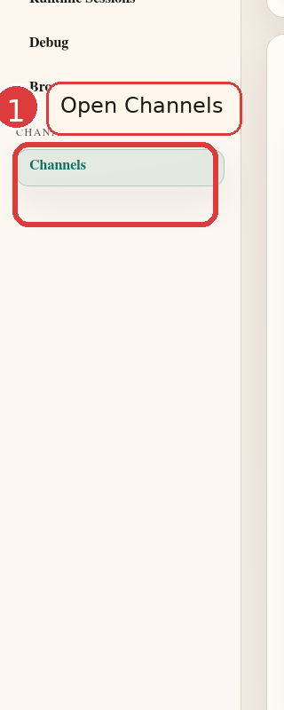
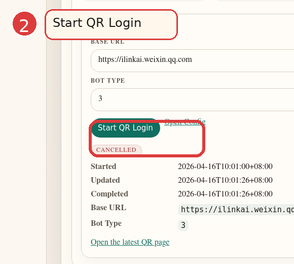
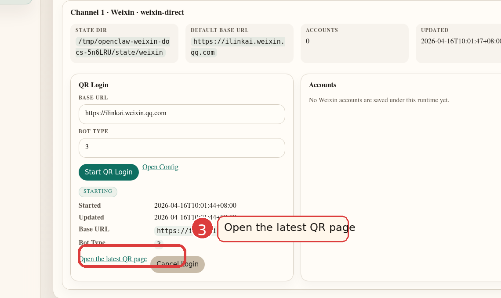
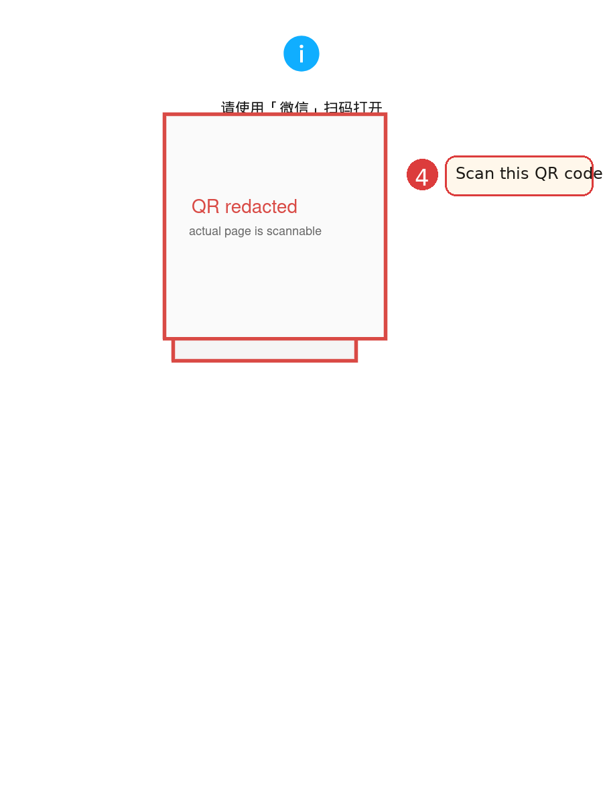
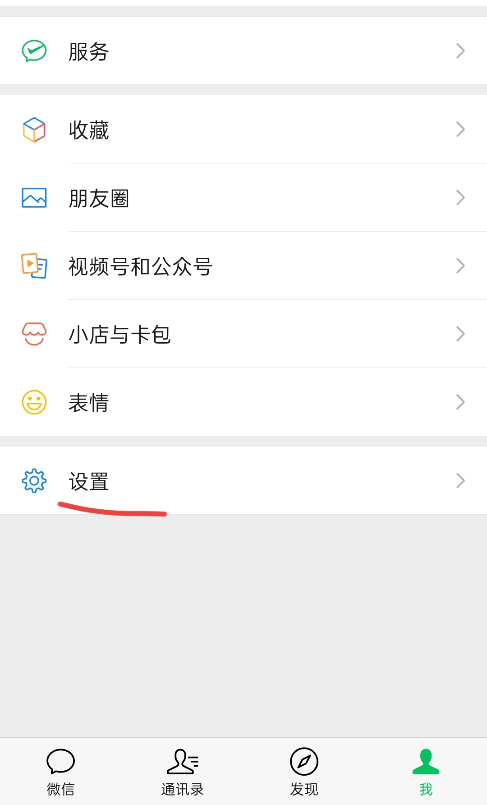
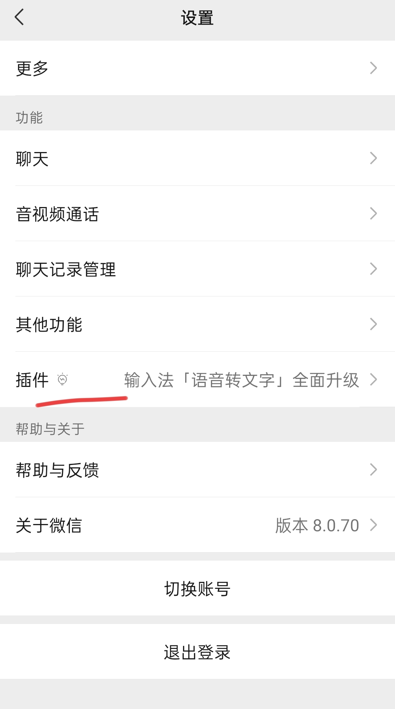
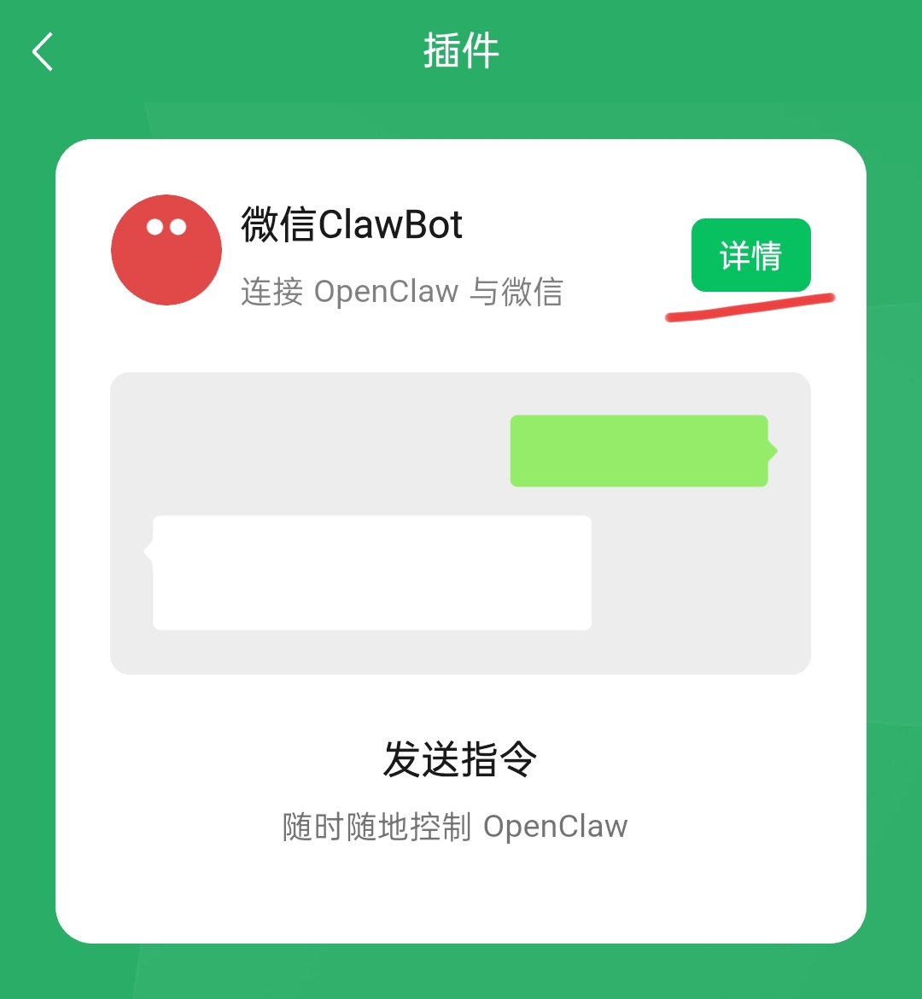
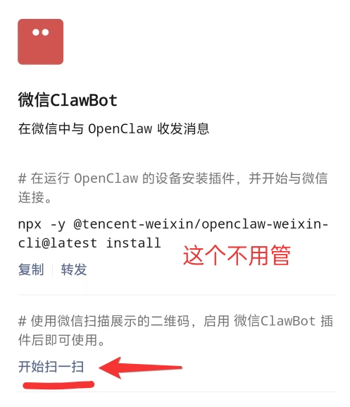
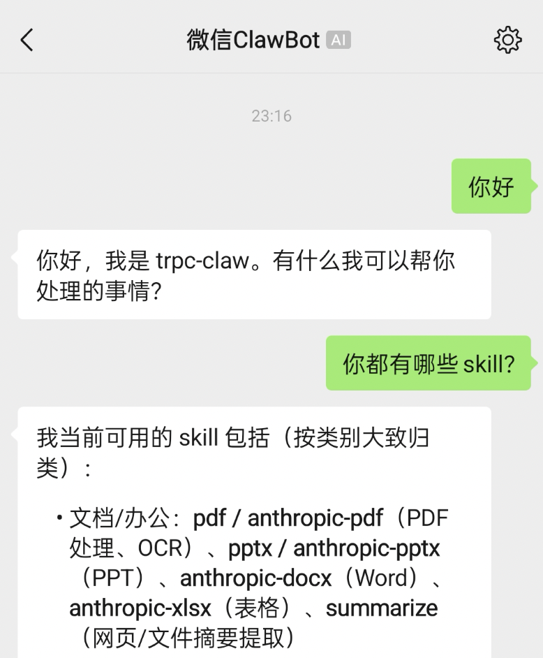

# Weixin Quick Start

这份文档的目标只有一件事：把 `trpc-claw` 切到微信 profile，
打开 admin，扫二维码登录微信，然后直接开始聊天。

如果你已经装过 `trpc-claw`，可以直接从第 2 步开始。

## 1. 下载 `trpc-claw`

先把当前最新 release 的二进制和安装器装到本机：

```bash
curl -fsSL \
  'https://mirrors.tencent.com/repository/generic/trpc-agent-go/trpc-claw/latest/install.sh' \
  | bash
```

默认安装位置：

- 二进制：`~/.local/bin/trpc-claw`
- 主配置：`~/.trpc-agent-go/openclaw/openclaw.yaml`
- profile 模板目录：`~/.trpc-agent-go/openclaw/profiles/`

如果你执行 `trpc-claw` 时提示 `command not found`，
先执行一次：

```bash
export PATH="$HOME/.local/bin:$PATH"
```

或者直接用绝对路径运行：

```bash
~/.local/bin/trpc-claw
```

## 2. 把当前主配置切到 Weixin profile

执行：

```bash
trpc-claw upgrade -f --profile weixin
```

这条命令会直接把当前实际使用的主配置切成
`openclaw.weixin.yaml`，也就是：

- `~/.trpc-agent-go/openclaw/openclaw.yaml`
- `~/.trpc-agent-go/openclaw/trpc_go.yaml`

会被覆盖成最新 release 里的 Weixin 版本。

这个 profile 和当前标准 `openclaw` 分发版的其他默认行为保持一致：

- 同样使用 `openai` 模式
- 同样保留 session / memory / tools / skills 默认配置
- 主要区别就是 `channels:` 切成了 `weixin`

如果你想把“下载 + 切 profile”合成一条命令，也可以直接：

```bash
curl -fsSL \
  'https://mirrors.tencent.com/repository/generic/trpc-agent-go/trpc-claw/latest/install.sh' \
  | bash -s -- -f --profile weixin
```

## 3. 准备模型环境变量

启动前至少要先配好这两个环境变量：

- `OPENAI_API_KEY`
- `OPENAI_BASE_URL`

如果你还没有单独指定模型名，也一起把 `OPENAI_MODEL` 设上去。

Weixin profile 默认读取这几个环境变量：

```bash
export OPENAI_MODEL='gpt-5.2'
export OPENAI_API_KEY='replace-with-your-api-key'
export OPENAI_BASE_URL='https://your-openai-compatible-endpoint/v1'
```

如果你平时就是把这些变量写在 `~/.bashrc` 或 `~/.zshrc`，
这里不需要重复设置。
如果没配好 `OPENAI_API_KEY` 或 `OPENAI_BASE_URL`，
`trpc-claw` 启动时会直接因为缺少环境变量而报错。
如果你刚把这些变量写进 `~/.bashrc`，记得先执行：

```bash
source ~/.bashrc
```

或者重新开一个终端，再继续下一步。

## 4. 直接启动 `trpc-claw`

执行：

```bash
trpc-claw
```

这条进程要保持运行。
如果你把这个终端直接关掉，微信 bot 也会跟着离线。

默认 admin 地址是：

```text
http://127.0.0.1:19789
```

如果 `19789` 已被占用，admin 会自动换端口。
这时直接看启动日志里打印出来的 `Admin UI:` 地址即可。

## 5. 在 admin 里开始二维码登录

打开浏览器进入：

```text
http://127.0.0.1:19789/channels
```

如果你不是手工点页面，而是想给前端一个稳定入口，
也可以直接打开：

```text
http://127.0.0.1:19789/channels/wx_qr
```

这个固定入口会在当前实例里只有一个 Weixin runtime、
并且还没有保存账号时，自动开始二维码登录。
如果同一个实例里配了多个 Weixin runtime，
可以显式打开：

```text
http://127.0.0.1:19789/channels/wx_qr?runtime_key=weixin-1
```

如果你要把这条链路接给 AGUI 之类的前端，
看 [`frontend_qr_entry.md`](frontend_qr_entry.md)。

### 5.1 点击左侧 `Channels`



### 5.2 在 `Weixin Runtime` 里点 `Start QR Login`



### 5.3 点 `Open the latest QR page`



### 5.4 浏览器会打开一个二维码页面

保持这个二维码页面开着，用手机微信去扫它：
下面这张文档截图里的二维码已经做了打码处理；
你实际打开的页面里会看到可扫码的真实二维码。



扫码成功后，再回到 `Channels` 页面看一眼：

- `Accounts` 数量会从 `0` 变成 `1`
- 新账号状态会显示成 `Ready`

看到这两个变化，就说明当前运行中的 `trpc-claw`
已经接住这个微信账号了。

## 6. 手机微信里怎么找到扫码入口

手机微信里按下面顺序走：

1. `我`
2. `设置`
3. `插件`
4. 找到 `微信ClawBot`
5. 点进去后再点 `开始扫一扫`

### 6.1 `我 -> 设置`



### 6.2 `设置 -> 插件`



### 6.3 找到 `微信ClawBot`



### 6.4 点 `开始扫一扫`

注意图里那个 `npx ... install` 提示不用管，
这里真正要点的是底部的 `开始扫一扫`。



## 7. 扫码后就可以开始聊天

扫码成功后，运行中的 Weixin channel 会自动保存账号并开始收消息。
不需要手动重启 `trpc-claw`。

你可以直接在微信里发一句：

```text
你好
```

或者继续追问它支持哪些技能。

下面这张图就是已经登录并正常开始聊天的状态：



## 8. 常见补充

- 如果 `Channels` 页里已经看到 `Open the latest QR page`，
  说明二维码登录会话已经创建成功。
- 如果你走的是固定入口 `/channels/wx_qr`，
  浏览器会先经过这个 admin URL，
  再自动跳到当前最新的微信二维码页面。
- 如果页面上没有二维码链接，先刷新一次 `Channels` 页。
- 如果你之后想重新把当前机器切回默认企微长连接模板，
  直接执行：

```bash
trpc-claw upgrade -f --profile wecom-ai-websocket
```

- 如果你想删掉某个已保存的微信账号，也可以直接执行：

```bash
trpc-claw weixin list
trpc-claw weixin remove <ACCOUNT_ID>
```
