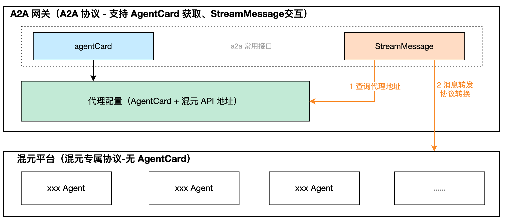
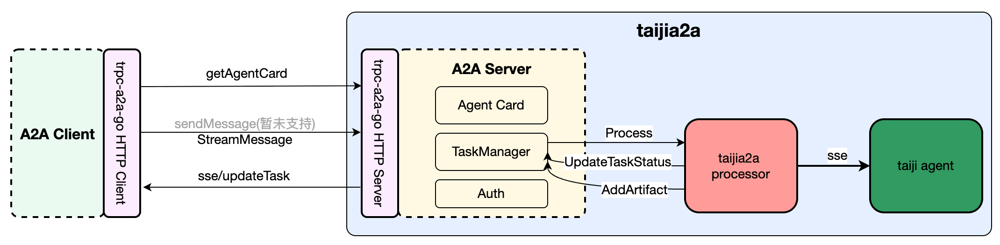

这是专为混元平台 Agent 支持的 A2A 代理服务，方便 trpc-agent-go 与混元平台交互。

# 概述

该版本提供了注册太极 Agent 代理. 
```text
          stream                      stream
|client| --------> |taijia2a-proxy| ----------> |taiji-agent|
业务实现                框架实现                    taiji agent 
```

## 方案设计





## 安装

```bash
go get git.woa.com/trpc-go/trpc-agent-go
```

## 快速开始

### 基本用法

> 详见 examples/taiji2a-proxy

```go
package main

import (
    taiji "trpc.group/trpc-go/trpc-agent-go/server/taijia2a"
    taijiconf "git.woa.com/trpc-go/trpc-agent-go/trpc/server/taijia2a/config"
    "git.code.oa.com/trpc-go/trpc-go"
)

func main() {
	// New一个server, 增加被调日志 filter
    s := trpc.NewServer()

	// 注册配置（也可使用默认本地配置, 但需要使用 CoverLocalConfig、
	// UpdateLocalConfig、DeleteLocalConfig 来更新本地配置）
	taijiconf.RegisterConfiger(&configImpl{})
	
	name := "trpc.group.trpc-go.trpc-agent-go.taijia2a" // 服务名.业务可替换
	if err := taiji.RegisterTaijiA2AProxyServer(s, name, "api/v2/agent/"); err != nil {
		log.Fatalf("Failed to register Taiji A2A proxy server: %v", err)
	}
}

type configImpl struct {}

func (c *configImpl) GetProxyConfig(name string) (*taijiconf.ProxyConfig, bool) {
	// todo 获取代理配置
}
```

### 框架配置
```yaml
server:
  service:  
    - name: trpc.group.trpc-go.trpc-agent-go.taijia2a
      network: tcp  
      protocol: http_no_protocol  
      timeout: -1  
      registry: polaris  
      ip: ${ip} 

```