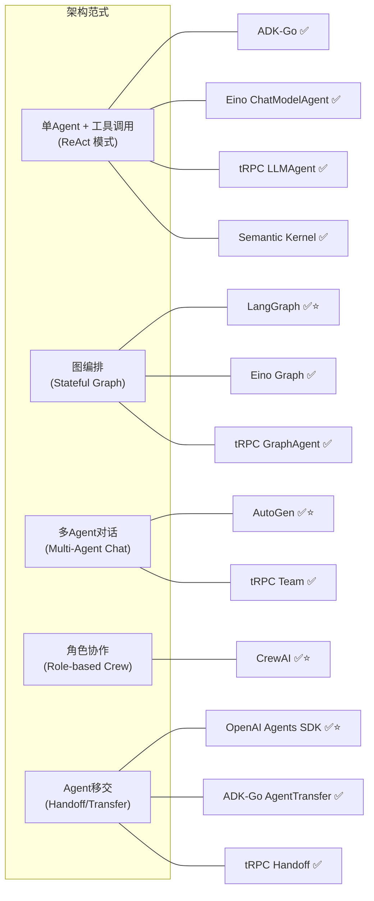
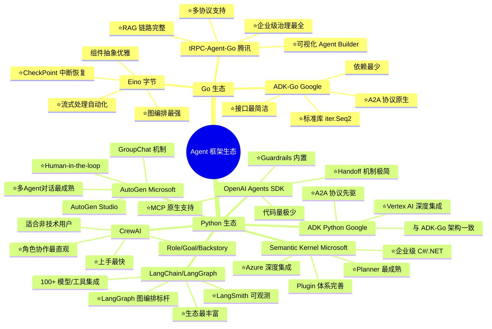

# 全面 Agent 框架对比（Go 三框架 + 业界主流框架）

## 一、纳入对比的框架全景

| 类别 | 框架 | 语言 | 开发方 |
|------|------|------|--------|
| **Go 生态** | Eino | Go | 字节跳动 (CloudWeGo) |
| **Go 生态** | Google ADK-Go | Go | Google |
| **Go 生态** | tRPC-Agent-Go | Go | 腾讯 (tRPC) |
| **Python 生态** | LangChain / LangGraph | Python/JS | LangChain Inc. |
| **Python 生态** | CrewAI | Python | CrewAI Inc. |
| **Python 生态** | AutoGen | Python | Microsoft |
| **Python 生态** | OpenAI Agents SDK (原Swarm) | Python | OpenAI |
| **Python 生态** | Google ADK Python | Python | Google |
| **C#/Python 生态** | Semantic Kernel | C#/Python | Microsoft |

---

## 二、核心架构理念对比

---

## 三、多维度详细对比表

### 3.1 基础能力对比

| 维度 | Eino | ADK-Go | tRPC-Agent-Go | LangChain/LangGraph | CrewAI | AutoGen | OpenAI Agents SDK | ADK Python | Semantic Kernel |
|------|------|--------|---------------|---------------------|--------|---------|-------------------|------------|-----------------|
| **语言** | Go | Go | Go | Python/JS | Python | Python | Python | Python | C#/Python |
| **GitHub Stars** | ~2.5k | ~2k | 内部开源 | ~100k / ~10k | ~25k | ~40k | ~15k | ~10k | ~25k |
| **成熟度** | 🟡 成长期 | 🟡 早期 | 🟡 成长期 | 🟢 成熟 | 🟡 成长期 | 🟢 成熟 | 🟡 成长期 | 🟡 成长期 | 🟢 成熟 |
| **学习曲线** | 中等 | 低 | 中高 | 中高 | 低 | 中等 | 极低 | 中等 | 中等 |
| **最小示例行数** | ~30 | ~25 | ~40 | ~10 | ~15 | ~20 | ~10 | ~15 | ~20 |

### 3.2 Agent 模式对比

| Agent 模式 | Eino | ADK-Go | tRPC-Agent-Go | LangChain/LangGraph | CrewAI | AutoGen | OpenAI Agents SDK | ADK Python | Semantic Kernel |
|------------|------|--------|---------------|---------------------|--------|---------|-------------------|------------|-----------------|
| **单Agent ReAct** | ✅ ChatModelAgent | ✅ LLMAgent | ✅ LLMAgent/ReAct | ✅ AgentExecutor | ✅ Agent | ✅ AssistantAgent | ✅ Agent | ✅ LLMAgent | ✅ Agent |
| **Sequential链** | ✅ WorkflowAgent | ✅ SequentialAgent | ✅ ChainAgent | ✅ Chain/LCEL | ✅ Sequential Process | ❌ | ❌ | ✅ SequentialAgent | ✅ Kernel Chain |
| **Parallel并行** | ✅ WorkflowAgent | ✅ ParallelAgent | ✅ ParallelAgent | ✅ RunnableParallel | ❌ | ❌ | ❌ | ✅ ParallelAgent | ❌ |
| **Loop循环** | ✅ WorkflowAgent | ✅ LoopAgent | ✅ CycleAgent | ✅ Graph Cycle | ❌ | ❌ | ❌ | ✅ LoopAgent | ❌ |
| **Graph图编排** | ✅⭐ compose.Graph | ❌ | ✅ GraphAgent | ✅⭐ LangGraph | ❌ | ❌ | ❌ | ❌ | ❌ |
| **多Agent对话** | ✅ DeepAgent | ✅ SubAgent树 | ✅ Team | ✅ MultiAgent | ✅⭐ Crew | ✅⭐ GroupChat | ✅ Handoff | ✅ SubAgent | ✅ AgentGroupChat |
| **Agent移交/Handoff** | ✅ AgentTool | ✅ AgentTransfer | ✅ Handoff | ✅ 自定义 | ❌ | ✅ HandOff | ✅⭐ 核心机制 | ✅ AgentTransfer | ❌ |
| **远程Agent** | ❌ | ✅ A2A | ✅ A2A | ❌ | ❌ | ❌ | ❌ | ✅ A2A | ❌ |
| **层级式多Agent** | ✅ DeepAgent | ✅ SubAgent嵌套 | ✅ Coordinator | ✅ AgentSupervisor | ✅ Hierarchical | ✅ Manager | ❌ | ✅ | ❌ |

### 3.3 核心基础设施对比

| 基础设施 | Eino | ADK-Go | tRPC-Agent-Go | LangChain/LangGraph | CrewAI | AutoGen | OpenAI Agents SDK | ADK Python | Semantic Kernel |
|----------|------|--------|---------------|---------------------|--------|---------|-------------------|------------|-----------------|
| **工具系统** | BaseTool + compose | FunctionTool + MCP | FunctionTool + MCP + OpenAPI | Tool + Toolkit | Tool + MCP | FunctionCall | function_tool + MCP⭐ | FunctionTool + MCP | KernelFunction |
| **流式输出** | ✅⭐ 自动流合并 | ✅ iter.Seq2 | ✅ EventChannel | ✅ astream | ❌ | ✅ stream | ✅ stream | ✅ | ✅ |
| **Session管理** | 🟡 轻量 SessionValues | ✅ SessionService | ✅⭐ 多后端 | ✅ Memory | ✅ Memory | ✅ | ✅ context | ✅ SessionService | ✅ ChatHistory |
| **长期记忆** | ❌ | ✅ MemoryService | ✅ MemoryService | ✅ Memory模块 | ✅ Long-term | ✅ Teachability | ❌ | ✅ MemoryService | ✅ Memory |
| **RAG/知识库** | ✅ Retriever+Indexer | ❌ | ✅⭐ 完整RAG链路 | ✅⭐ 丰富生态 | ✅ Knowledge | ✅ RAG | ❌ | ❌ | ✅ Memory+Connector |
| **中断/恢复 (HIL)** | ✅⭐ CheckPoint持久化 | ✅ ToolConfirmation | ✅ ToolInterrupt | ✅⭐ LangGraph Interrupt | ❌ | ✅⭐ Human-in-the-loop | ❌ | ✅ | ❌ |
| **Guardrails** | ❌ | ❌ | ❌ | ✅ Guard | ❌ | ❌ | ✅⭐ input/output guardrails | ✅ before_model callback | ✅ Filters |
| **Planner** | ❌ | ❌ | ✅ Planner | ✅ Plan-and-Execute | ✅ Task Planner | ❌ | ❌ | ❌ | ✅⭐ Planner |
| **可观测性** | ✅ 回调切面 | ✅ OpenTelemetry | ✅ 伽利略+智研+OTel | ✅⭐ LangSmith | ❌ | ✅ AutoGenBench | ✅ Tracing | ✅ OTel | ✅ OTel |
| **Artifact/文件管理** | ❌ | ✅ ArtifactService | ❌ | ❌ | ❌ | ❌ | ❌ | ✅ ArtifactService | ❌ |

### 3.4 生态与部署对比

| 维度 | Eino | ADK-Go | tRPC-Agent-Go | LangChain/LangGraph | CrewAI | AutoGen | OpenAI Agents SDK | ADK Python | Semantic Kernel |
|------|------|--------|---------------|---------------------|--------|---------|-------------------|------------|-----------------|
| **模型支持** | OpenAI/Claude/Gemini/Ollama | 模型无关(Gemini优化) | OpenAI/Hunyuan/Taiji/Venus | ✅⭐ 100+模型 | OpenAI/Claude/Ollama | OpenAI/Azure/Local | ✅ OpenAI系列 | Gemini优化 | Azure OpenAI优化 |
| **服务治理** | ❌ | ❌ | ✅⭐ tRPC-Go全栈 | ❌ | ❌ | ❌ | ❌ | ❌ | ❌ |
| **部署形态** | 库引用 | 库/CloudRun/A2A | tRPC服务/AG-UI/A2A | 库/LangServe/Cloud | 库/CrewAI+ | 库/AutoGen Studio | 库 | 库/CloudRun/A2A | 库/Azure |
| **可视化/Low-Code** | EinoDevops | ADK Web | ✅⭐ Agent Builder | LangGraph Studio | CrewAI Studio | AutoGen Studio | ❌ | ADK Web | ❌ |
| **脚手架工具** | ❌ | ❌ | ✅ `trpc agent` CLI | langchain CLI | crewai CLI | ❌ | ❌ | adk CLI | ❌ |
| **社区生态** | 🟡 | 🟡 | 🟡(内部丰富) | ✅⭐ 最活跃 | ✅ 活跃 | ✅ 活跃 | 🟡 | 🟡 | ✅ 活跃 |
| **插件市场** | EinoExt | ❌ | 多平台适配器 | ✅⭐ LangChain Hub | CrewAI Tools | ❌ | ❌ | ❌ | ✅ Plugins |
| **A2A协议** | ❌ | ✅ | ✅ | ❌ | ❌ | ❌ | ❌ | ✅ | ❌ |
| **MCP协议** | ❌ | ❌ | ✅ | ✅ | ✅ | ❌ | ✅ | ❌ | ✅ |

---

## 四、各框架差异化优势总结

---

## 五、架构范式维度的横向对比

| 架构范式 | 代表框架 | 优势 | 劣势 | 适用场景 |
|----------|---------|------|------|---------|
| **ReAct 循环** (思考→行动→观察) | 所有框架基本都支持 | 简单直观，LLM 原生能力 | 单 Agent 能力瓶颈 | 简单工具调用场景 |
| **图编排** (StateGraph + 条件路由) | LangGraph⭐, Eino, tRPC-Agent-Go | 精确控制流程，可调试 | 复杂度高，需手动编排 | 复杂业务流程、需要精确控制的场景 |
| **多 Agent 对话** (Agent 间消息传递) | AutoGen⭐, tRPC Team | 灵活，适合开放式任务 | 对话控制困难，token 消耗大 | 头脑风暴、代码审查、辩论 |
| **角色协作** (Role/Goal/Task) | CrewAI⭐ | 最符合直觉，低门槛 | 灵活度不够 | 内容生产、研究报告 |
| **Agent 移交** (Handoff/Transfer) | OpenAI Agents SDK⭐, ADK-Go, tRPC | 极简，适合客服场景 | 线性流转，不适合复杂编排 | 客服路由、领域专家分流 |
| **Plan & Execute** (先规划后执行) | Semantic Kernel Planner, tRPC Planner | 复杂任务分解能力强 | 规划可能出错，额外 LLM 调用 | 多步骤复杂任务 |

---

## 六、选型建议矩阵

| 你的场景 | 首选 | 备选 | 原因 |
|----------|------|------|------|
| **Go 技术栈 + 轻量快速启动** | Google ADK-Go | Eino | ADK-Go 接口最简洁，依赖最少 |
| **Go 技术栈 + 复杂编排** | Eino | tRPC-Agent-Go | Eino 的图编排和流式处理最强 |
| **Go 技术栈 + 企业级生产** | tRPC-Agent-Go | Eino | tRPC 服务治理+可视化+RAG 全栈 |
| **快速原型验证** | OpenAI Agents SDK | CrewAI | 代码量最少，上手最快 |
| **复杂业务流编排** | LangGraph | Eino | LangGraph 是图编排标杆 |
| **多 Agent 协作/对话** | AutoGen | CrewAI | AutoGen 的 GroupChat 最成熟 |
| **内容生产/角色扮演** | CrewAI | AutoGen | 角色定义最直观 |
| **企业级 .NET/Azure** | Semantic Kernel | — | 微软亲儿子，Azure 深度集成 |
| **Google Cloud / Gemini** | ADK Python/Go | — | Google 原生，A2A 协议先驱 |
| **需要 Guardrails** | OpenAI Agents SDK | ADK Python | 内置 input/output guardrails |
| **需要最丰富的生态集成** | LangChain | — | 100+ 模型、工具、向量库集成 |

**一句话总结**：

> - **Go 三框架**各有侧重：Eino 编排最强、ADK-Go 最简洁、tRPC-Agent-Go 企业级最全
> - **Python 生态**依然最丰富：LangGraph 是图编排标杆，CrewAI/AutoGen 是多 Agent 协作标杆，OpenAI Agents SDK 是极简标杆
> - **选框架的本质是选架构范式**：先确定你的场景需要 ReAct、图编排、多 Agent 对话还是 Handoff，再在对应范式下选框架