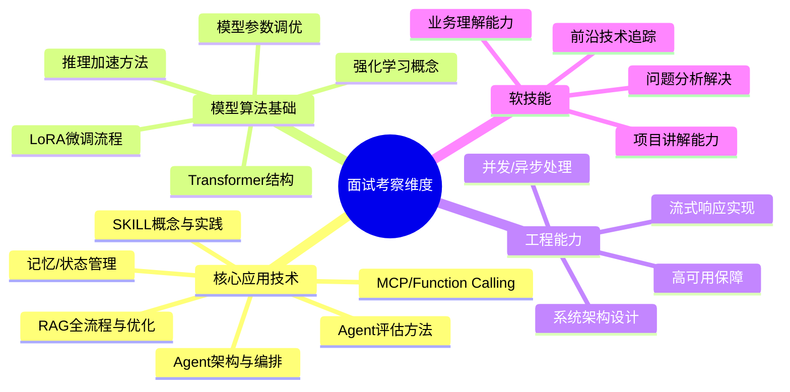

# 大模型应用面试准备归纳总结

> 本文档是对学习路线、八股知识、面试实战、能力要求分析等多份资料的**精华归纳**，帮助快速把握全局。

---

## 一、需要准备的东西

### 1.1 项目准备（最关键）

| 准备项 | 说明 |
|-------|------|
| **1个完整的 RAG-Agent 项目** | 必须包含：RAG全流程（切块→向量化→召回→重排→生成）+ Agent编排 + 工具调用。建议用真实的向量数据库（Weaviate/Milvus/FAISS），不要用SQLite这类简单数据库 |
| **项目要有深度** | 切块策略（语义切块、重叠窗口）、召回优化（查询改写、混合检索 BM25+Dense、RRF融合）、精排重排（Cross-Encoder / LLM Rerank）、评测体系（RAGAS）都要体现 |
| **项目要结合工作/实验室** | 社招：结合公司产品做（如内部文档问答Agent、智能客服）。校招：结合实验室/比赛。避免看起来像纯个人练手项目 |
| **微调经验** | 至少跑通一次 LoRA 微调全流程（数据准备→训练→评估→部署），能讲清楚"你是怎么做微调的" |
| **强化学习经验** | 至少跑通一次 DPO 流程，串到项目里（如：量化→LoRA→DPO） |
| **推理加速经验** | 至少掌握一种压缩方法（推荐量化），能结合项目讲"怎么做的推理优化" |
| **端侧部署经验（加分项）** | GGUF量化+llama.cpp/MLC-LLM部署到CPU服务器或手机端，展示完整的 SFT→DPO→量化→端侧 链路 |

**项目设计三原则**：
1. **技术点全覆盖**：RAG / Agent / MCP / LoRA / DPO / 推理加速 / 端侧部署 / 评测，都要涉及
2. **有深度**：海量文档而非几个文件、有切块策略和召回优化、有评测体系、微调+RAG协同优化
3. **能包装**：结合业务场景，面试时让面试官觉得是真实落地项目

**推荐项目组合**（两条项目线覆盖所有技术点）：
- 🔧 **Agent 工程线**：GameOps Agent（智能运维）—— 展示 Agent/RAG/MCP/Multi-Agent/Skills
- 🧠 **模型算法线**：知识库微调 + 游戏AINPC —— 展示 LoRA/DPO/量化/端侧部署
- 详细方案见：[GameOps Agent 完整执行方案.md](D:/UGit/Go-Agent/GameOps%20Agent%20完整执行方案.md) 和 [模型算法微调项目执行方案.md](D:/UGit/Go-Agent/模型算法微调项目执行方案.md)

### 1.2 知识储备

| 类别 | 需要准备的内容 |
|------|-------------|
| **核心八股** | Agent框架、RAG全流程、MCP协议、Function Calling、记忆机制、Multi-Agent架构、Agent评估方法 |
| **模型基础** | Transformer结构、注意力机制、词嵌入、编码器vs解码器、自回归生成 |
| **微调/训练** | LoRA原理及超参设置、SFT流程、DPO/RLHF概念、训练数据准备 |
| **推理部署** | 量化/蒸馏/剪枝概念、KV Cache、常见推理引擎（vLLM、TensorRT） |
| **前沿知识** | 至少准备2-3篇可讲的论文（推荐：美团龙猫VitaBench、Google多Agent论文、Deepseek训练方法） |
| **提示词工程** | 基本原则和策略即可，面试考得不多 |

### 1.3 工具链准备

| 类别 | 推荐工具 |
|------|---------|
| **Agent框架** | LangChain + LangGraph（最主流）、了解 AutoGen/CrewAI/Dify 概念 |
| **向量数据库** | Weaviate / Milvus / FAISS / Chroma（至少精通一个） |
| **微调工具** | LLaMAFactory / PEFT / HuggingFace Transformers |
| **评测框架** | RAGAS（RAG评测）、LLM-as-Judge（Agent评测） |
| **AI Coding** | GitHub Copilot / Cursor（多个JD明确要求AI Coding能力） |

### 1.4 参考资料清单

| 资料 | 用途 |
|------|------|
| 《Agentic Design Pattern》 | Agent设计范式、评估、记忆、反思、Multi-Agent，**面试核心参考书** |
| 《大模型RAG实战》 | RAG全流程深入理解，面试查询参考 |
| 美团龙猫论文（VitaBench） | Agent评估方法论，可用于回答"看了什么论文" |
| Google《Towards a Science of Scaling Agent Systems》 | Multi-Agent架构选型，25年12月发布，时效性+权威性 |
| Anthropic Skills官方文档 | SKILL概念和最佳实践 |

---

## 二、需要具备的技能经验

### 2.1 技能优先级排序

```
⭐⭐⭐⭐⭐ 必须精通（面试必考）
├── Agent 架构设计（框架选型、LangChain/LangGraph、编排模式）
├── RAG 全流程（切块→召回→优化→评测，每一步都要深入）
├── MCP 协议（概念、本地/远端区别、传输协议、vs Function Calling）
├── Agent 性能评估（理论+你的项目如何做的）
└── Agent 记忆机制（短期/长期、LangChain/LangGraph实现）

⭐⭐⭐⭐ 必须掌握（高频考点）
├── Function Calling（训练原理、调用失败处理）
├── Multi-Agent 架构（5种架构特点、设计原则、何时用单/多Agent）
├── 微调经验（LoRA原理、超参设置、完整流程）
├── Transformer 模型基础（结构、注意力机制、编解码）
├── SKILL 概念（2026年新热点，vs MCP、vs Prompts、运行模式）
└── A2A 协议概念

⭐⭐⭐ 需要了解（中频考点）
├── 推理加速（量化/蒸馏/剪枝概念，至少精通一种）
├── 模型参数设置（temperature、top-p、penalty）
├── 幻觉问题解决方案
├── LangChain 版本差异与不便之处
├── 常见模型对比（GPT vs 千问 vs DeepSeek）
└── 并发/异步/流式响应（传统后端知识）

⭐⭐ 了解即可（低频但加分）
├── 强化学习（DPO/RLHF，准备一套流程即可）
├── 后端架构（Docker/K8s/Redis/MQ，应用岗非必须但加分）
├── 多模态（目前面试考得极少）
└── 深度学习数学基础（应用岗不要求推导公式）
```

### 2.2 编程语言要求

| 语言 | 优先级 | 说明 |
|------|--------|------|
| **Python** | ⭐⭐⭐ 必备 | 大模型生态第一语言，训练/评测/数据处理/Agent开发 |
| **Go** | ⭐⭐⭐ 高频 | 后端工程岗几乎必备，尤其是大厂Agent后端岗 |
| Java/C++ | ⭐⭐ 加分 | 部分岗位提及 |

---

## 三、面试重点与高频考点

### 3.1 必考题TOP 10（几乎每场面试都会遇到）

| 排名 | 题目 | 对应知识 |
|------|------|---------|
| 1 | 你的项目是怎么做的？讲讲架构 | 项目深度理解 |
| 2 | RAG的召回如何优化？切块策略？ | RAG全流程 |
| 3 | 如何评估Agent的性能？ | Agent评估（理论+实践） |
| 4 | 常见Agent框架有哪些？区别？ | Agent框架（LangChain/LangGraph必须精通） |
| 5 | Agent的记忆机制如何实现？ | 短期/长期记忆 |
| 6 | MCP是什么？和Function Calling区别？ | MCP协议 |
| 7 | 你是怎么做微调的？ | LoRA全流程 |
| 8 | 单Agent和多Agent怎么选？ | Multi-Agent架构 |
| 9 | 你项目遇到的最难的问题？如何解决？ | 项目深度+问题解决能力 |
| 10 | 最近看了什么论文/前沿技术？ | 前沿知识追踪能力 |

### 3.2 面试考察维度（从面试实战总结）



### 3.3 不同公司面试侧重（从面试实战提炼）

| 公司类型 | 侧重点 | 典型代表 |
|---------|--------|---------|
| **大厂应用岗** | Agent/RAG深度 + 系统设计 + 算法广度 | 阿里、字节、小红书 |
| **大厂算法岗** | 模型基础 + 训练微调 + Agent工程也会问 | 京东（算法工程） |
| **中厂/创业公司** | 全栈能力 + 落地经验 + 快速上手 | 滴滴、网龙、盛大 |
| **金融/传统行业** | 业务理解 + 稳定性 + 合规安全 | 平安证券、华林证券 |

---

## 四、学习路线与时间分配建议

### 4.1 推荐学习顺序

```
阶段一（核心，60%时间）
│
├── 1. Agent 入门 → 了解概念 → 跑通简单Agent代码
├── 2. Agent 框架 → LangChain/LangGraph 深入学习
├── 3. RAG 全流程 → 切块/召回/优化/评测
├── 4. MCP / Function Calling / SKILL
├── 5. Multi-Agent 架构
└── 6. Agent 评估方法（必考！要反复练习）

阶段二（算法基础，25%时间）
│
├── 7. 深度学习入门 → Transformer结构
├── 8. LoRA 微调（跑通全流程）
├── 9. 量化/推理加速（至少掌握一种）
└── 10. 强化学习 DPO（跑通流程即可）

阶段三（拓展加分，15%时间）
│
├── 11. 前沿论文（准备2-3篇）
├── 12. 项目打磨与面试模拟
└── 13. 后端知识补充（按需）
```

### 4.2 关键心态建议

1. **精而专，不要大而全**：面试考的越多就越深入复习，不考的就不必死磕
2. **项目是王道**：所有知识最终都要体现在项目里，面试官通过项目考察你的深度
3. **学会包装**：项目要和工作/业务结合，让面试官觉得是真实落地项目
4. **复合型人才更吃香**：懂算法 + 精工程 + 善部署，上限更高
5. **面试是迭代的**：每次面试后分析不足，针对性加强，笔记持续更新

---

## 五、面试技巧速查

### 5.1 自我介绍要点
- 控制在2-3分钟
- 突出AI相关经验，展示项目广度和深度
- 避免流水账，按"项目1→项目2→核心优势"结构组织
- 展示对目标公司/业务的了解（体现意向度）

### 5.2 项目讲解策略
- 先讲架构全貌，再讲技术亮点
- 主动引导面试官到你准备好的知识点
- 对于"你项目最难的问题"，提前准备2-3个有深度的例子
- 对于"项目浅"的反馈：找到具体哪里浅，针对性加深

### 5.3 反问环节策略
- **技术面**：问业务场景、技术栈、团队架构
- **主管面**：问部门发展方向、AI战略规划
- **HR面**：问薪酬结构、福利、晋升机制

### 5.4 面试心态
- **不要露怯**：即使某块不深入，也要自信回答"我做过，是这样做的"
- **主管面不怕**：级别越高的面试官越不会深入技术细节，重点展示经验广度
- **压力测试**：有些面试官追问到底是常态，不代表你答得不好

---

## 六、速查清单：面试前一天快速复习

- [ ] Agent 5大框架特点与区别
- [ ] LangChain 核心模块 + LangGraph 核心组件
- [ ] RAG 全流程（切块→向量化→召回→重排→生成）
- [ ] RAG 召回优化策略（至少5种）
- [ ] MCP 概念 + 本地/远端区别 + 传输协议
- [ ] MCP vs Function Calling vs A2A
- [ ] Agent 记忆（短期/长期 + LangChain/LangGraph实现）
- [ ] Agent 评估（3.1理论 + 3.2美团龙猫 + 3.3你的项目实践）
- [ ] Multi-Agent 5种架构 + 设计原则
- [ ] LoRA 微调全流程 + 超参设置
- [ ] 推理加速方法（至少能讲清楚量化）
- [ ] SKILL 概念 + vs MCP + vs Prompts
- [ ] 幻觉解决方案（4种方法）
- [ ] "你项目遇到最难的问题"（准备2-3个）
- [ ] "最近看的论文"（准备2-3篇）
- [ ] 模型参数设置（temperature/top-p/penalty）
- [ ] 自我介绍（控制2-3分钟，突出AI经验）