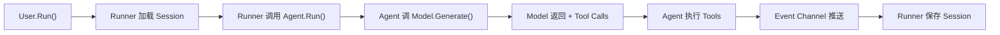
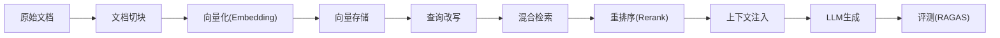

# AI Agent 后端工程师 完整学习路径（1-2月版）

---

> 基于 [大模型应用面试准备归纳总结.md](D:/UGit/Go-Agent/大模型应用面试准备归纳总结.md) 的能力要求、JD 分析、框架对比，按**面试 ROI**排序的完整学习+实践路径。
>
> **总时长**：6-8 周（可根据实际情况伸缩）
>
> **两大项目线**：
> - 🔧 **Agent 工程线**：GameOps Agent（智能运维）—— 见 [GameOps Agent 完整执行方案.md](D:/UGit/Go-Agent/GameOps%20Agent%20完整执行方案.md)
> - 🧠 **模型算法线**：知识库微调 + 游戏 AINPC —— 见 [模型算法微调项目执行方案.md](D:/UGit/Go-Agent/模型算法微调项目执行方案.md)

---

## 📅 总体时间规划（6-8 周）

```mermaid
gantt
    title 完整学习路径时间分配（6-8周）
    dateFormat  X
    axisFormat 第%s周

    section 第一阶段：Agent核心（2周）
    Runner+Agent接口+跑通示例         :a1, 0, 1
    Graph图编排+Tool/MCP系统           :a2, 1, 2
    
    section 第二阶段：Agent深入+RAG（2周）
    Multi-Agent+Session/Memory         :a3, 2, 3
    RAG全流程深入+评测体系             :a4, 3, 4
    
    section 第三阶段：模型算法基础（1.5周）
    Transformer+LoRA微调实操           :a5, 4, 5
    量化推理+DPO强化学习               :a6, 5, 6
    
    section 第四阶段：项目实战+打磨（1.5周）
    GameOps Agent 开发                 :a7, 6, 7
    模型微调项目+面试准备              :a8, 7, 8
    
    section 持续进行
    前沿论文阅读+框架对比              :a9, 0, 8
```



---

## 🔥 第一阶段（第1-2周）：Agent 核心框架精通

> **目标**：精通 tRPC-Agent-Go 核心骨架，能讲清完整执行链路，跑通所有核心示例

### 1.1 Runner 执行引擎 + Agent 接口 + 事件流（第1周前半）

> **对应面试**：Agent 架构设计、任务规划、Agent 调度系统（必考TOP 4）



| 要做的事 | 源码/文件 | 关注点 | 预计耗时 |
|---------|----------|--------|---------|
| **⭐ 阅读 Agent 接口定义** | [docs/agent.md](D:/UGit/Go-Agent/trpc-agent-go/docs/agent.md) | 6 种 Agent 类型的使用场景选型 | 2h |
| **⭐ 阅读 Runner 文档** | [docs/runner.md](D:/UGit/Go-Agent/trpc-agent-go/docs/runner.md) | Runner.Run 方法、Invocation 上下文、事件流消费 | 2h |
| **⭐ 跑通最简 Agent** | `examples/llmagent/main.go` | 理解 openai.New → llmagent.New → runner.Run 完整链路 | 2h |
| 跑通带工具的 Agent | `examples/runner/main.go` | FunctionTool + 事件流完整消费 | 2h |
| 看 ReAct 示例 | `examples/react/` | Thought-Action-Observation 循环 | 1h |
| **⭐ 精读核心源码** | `runner/runner.go` → `agent/agent.go` → `llmagent/llmagent.go` → `llmflow/flow.go` → `event/event.go` | 顺着调用链从外到内 | 3h |

**面试高频问题**：
- "Runner 和 Agent 之间是什么关系？" → Runner 是协调器，管理 Agent 生命周期 + Session + Memory
- "事件流是怎么实现的？" → Channel 推送，支持流式/非流式
- "6 种 Agent 类型怎么选？" → 简单对话用 LLMAgent，串行用 Chain，并行用 Parallel，复杂工作流用 Graph

### 1.2 Graph 图编排（第1周后半）

> **对应面试**：Agent 架构设计、流程编排（高区分度，对标 LangGraph）

| 要做的事 | 源码/文件 | 关注点 | 预计耗时 |
|---------|----------|--------|---------|
| **⭐ 精读 Graph 设计文档** | [docs/graph_km.md](D:/UGit/Go-Agent/trpc-agent-go/docs/graph_km.md) (47KB) | StateGraph + Schema + 条件边 + 中断恢复 | 3h |
| 跑通基础 Graph | `examples/graph/basic/` | 最小 StateGraph 用法 | 1h |
| 看并行/扇出 | `examples/graph/fanout/` `examples/graph/diamond/` | 并行节点 + 汇聚 | 1h |
| 看中断恢复 | `examples/graph/interrupt/` | Human-in-the-Loop | 1h |
| 看 DAG 引擎 | `examples/graph/dag_engine/` | DAG 编排实现 | 1h |
| **⭐ 精读 Graph 核心源码** | `graph/state_graph.go` → `graph/graph.go` → `graph/executor.go` → `agent/graphagent/graph_agent.go` | 构建→编译→运行→集成 | 3h |

**面试高频问题**：
- "StateGraph 和 LangGraph 有什么区别？" → Go 实现，channel 事件流，支持节点重试/缓存
- "如何实现条件路由？" → 条件边 + 状态判断
- "如何在 Graph 中实现 Human-in-the-Loop？" → 中断节点 + 状态持久化 + Resume

### 1.3 Tool 系统 + MCP 协议（第2周前半）

> **对应面试**：Function Calling / Tool Use、MCP 协议（必考 TOP 6）

| 要做的事 | 源码/文件 | 关注点 | 预计耗时 |
|---------|----------|--------|---------|
| **⭐ 读 Tool 文档** | [docs/tool.md](D:/UGit/Go-Agent/trpc-agent-go/docs/tool.md) | FunctionTool / MCP / OpenAPI 三种工具类型 | 2h |
| 跑通 MCP 示例 | `examples/mcptool/` | MCP 工具集成 | 2h |
| 跑通多工具示例 | `examples/multitools/` | 多工具注册 + LLM 自动选择 | 1h |
| 看 OpenAPI 工具 | `examples/openapitool/` | 从 OpenAPI spec 自动生成工具 | 1h |
| **⭐ 精读 Tool 源码** | `tool/tool.go` → `tool/function/function.go` → `tool/mcp/mcp.go` | 接口 → FunctionTool → MCP | 2h |
| 深入理解 MCP 协议 | 官方 MCP 规范文档 | 三步协议 initialize→tools/list→tools/call，本地/远端区别，SSE/Streamable HTTP | 2h |

**面试高频问题**：
- "MCP 是什么？和 Function Calling 的区别？" → MCP 管"从哪获取工具"，Function Calling 管"何时调用"，互补关系
- "FunctionTool 的 JSON Schema 是怎么生成的？" → Go reflect 读 struct tag → JSON Schema
- "MCP 的三种传输协议？" → STDIO（本地）、SSE（远端流式）、Streamable HTTP

### 1.4 多 Agent 协作 + Transfer/Handoff（第2周后半）

> **对应面试**：Multi-Agent 架构（必考 TOP 8）

| 要做的事 | 源码/文件 | 关注点 | 预计耗时 |
|---------|----------|--------|---------|
| **⭐ 跑通 Team 示例** | `examples/team/` | Coordinator + Worker 模式 | 2h |
| Transfer 示例 | `examples/transfer/` | Agent 间任务移交（类似 OpenAI Swarm） | 1h |
| AgentTool 示例 | `examples/agenttool/` | Agent 封装为 Tool 被调用 | 1h |
| 多 Agent 示例 | `examples/multiagent/` | SubAgent 嵌套 | 1h |
| **深入理解 5 种 Multi-Agent 架构** | Google 论文 + 《Agentic Design Pattern》 | Sequential / Parallel / Hierarchical / Swarm / Mesh | 3h |
| **⭐ 精读 Transfer 源码** | `agent/transfer.go` + `agent/teamagent/` | Handoff 机制 + Team 协作 | 2h |

**面试高频问题**：
- "单 Agent 和多 Agent 怎么选？" → 简单任务单 Agent，需要专业分工/并行/互审用多 Agent
- "你项目用了哪种 Multi-Agent 架构？" → Hierarchical（Coordinator + Workers）
- "Agent 之间怎么通信？" → Transfer/Handoff 机制 + 共享 Session State

---

## ⚡ 第二阶段（第3-4周）：Agent 深入 + RAG 全流程

> **目标**：掌握 Session/Memory/RAG 生产级能力，能讲清 RAG 优化策略和评测体系

### 2.1 Session + Memory（第3周前半）

> **对应面试**：Agent 记忆机制（必考 TOP 5）

| 要做的事 | 文件 | 关注点 | 预计耗时 |
|---------|------|--------|---------|
| **⭐ 读 Session 文档** | [docs/session.md](D:/UGit/Go-Agent/trpc-agent-go/docs/session.md) | InMemory/Redis/PG/MySQL 四种后端 | 1.5h |
| **⭐ 读 Memory 文档** | [docs/memory.md](D:/UGit/Go-Agent/trpc-agent-go/docs/memory.md) | Auto Memory / Session Memory / Long-term Memory | 1.5h |
| 浏览存储适配器 | `trpc/storage/` | Redis/MySQL/Postgres 实现 | 1h |
| 精读源码 | `session/session.go` + `memory/memory.go` | 四级状态隔离、Auto Memory Extractor | 2h |
| 跑通示例 | `examples/session/` + `examples/memory/` | 实际使用方式 | 1h |

**面试必答要点**：
- **Session vs Memory**：Session 存业务状态 KV，Memory 存对话历史/用户画像。分开因为生命周期、存储需求、管理方式不同
- **四级状态隔离**：`{key}` 会话级 / `{user:key}` 用户级 / `{app:key}` 应用级 / `{temp:key}` 临时
- **Auto Memory**：后台 Extractor 模型自动从对话中提取关键信息
- **LangChain 记忆 vs LangGraph 记忆**：LangChain 用 ConversationBufferMemory 等，LangGraph 用 CheckPoint 持久化状态

### 2.2 RAG 全流程深入（第3周后半 + 第4周前半）⭐⭐⭐ 面试重点

> **对应面试**：RAG 召回优化（必考 TOP 2）、幻觉解决方案

这是面试考察**最深入**的领域之一，必须能讲清每一步的优化策略。

| 要做的事 | 来源 | 关注点 | 预计耗时 |
|---------|------|--------|---------|
| **⭐ 读 tRAG 文档** | [docs/knowledge/trag.md](D:/UGit/Go-Agent/trpc-agent-go/docs/knowledge/trag.md) | tRPC-Agent-Go 的 RAG 链路 | 2h |
| 了解 Knowledge 接口 | `trpc/knowledge/` | Load/Search/Delete 统一接口 | 1h |
| 浏览向量存储 | `docs/knowledge/vectorstore/` | Milvus/PGVector/ES 等 | 1h |
| **⭐⭐ 深入 RAG 全流程** | 《大模型RAG实战》 | 下方详细展开 | 6h |
| **⭐ RAG 评测** | RAGAS 框架 | 四大指标：Faithfulness/Answer Relevancy/Context Precision/Context Recall | 2h |

#### RAG 全流程深入知识点（面试必答）



| 环节 | 必须掌握的优化策略 |
|------|------------------|
| **切块策略** | ① 固定大小切块 ② 语义切块（按段落/标题） ③ 递归字符切块 ④ **重叠窗口**（overlap）防止语义截断 ⑤ 父子文档（Parent-Child）策略 |
| **向量化** | ① Embedding 模型选择（BGE/text-embedding-3） ② 维度对比 ③ 中文 vs 英文模型选择 |
| **查询改写** | ① HyDE（假设性文档嵌入） ② Multi-Query（多角度重写） ③ Step-back Prompting ④ Query Decomposition |
| **混合检索** | ① Dense（向量检索） ② Sparse（BM25 关键词检索） ③ **RRF 融合算法**（Reciprocal Rank Fusion） ④ 向量+关键词混合权重 |
| **重排序** | ① Cross-Encoder Rerank ② LLM Rerank ③ Cohere Rerank API ④ 重排 vs 精排区别 |
| **上下文注入** | ① 相关性阈值过滤 ② Top-K 选择 ③ Context Compression（上下文压缩） |
| **幻觉解决** | ① RAG 注入真实数据 ② 要求引用来源 ③ Self-Consistency（多次生成投票） ④ 后处理 Fact-Check |

### 2.3 Agent 评估方法（第4周后半）⭐⭐⭐ 面试重点

> **对应面试**：如何评估 Agent 的性能（必考 TOP 3）

| 要做的事 | 来源 | 关注点 | 预计耗时 |
|---------|------|--------|---------|
| **⭐ 理论框架** | 《Agentic Design Pattern》 | Agent 评估的维度和方法论 | 2h |
| **⭐ 美团龙猫 VitaBench** | 论文阅读 | 工具调用准确率、任务完成率、对话质量 —— 面试"看了什么论文"的最佳答案 | 2h |
| RAG 评测 RAGAS | RAGAS 官方文档 | Faithfulness / Answer Relevancy / Context Precision / Context Recall | 2h |
| LLM-as-Judge | 实践 | 用 LLM 评估 Agent 的回答质量 | 1h |
| **自定义评估指标** | 结合项目 | 工具调用成功率、路由准确率、端到端任务完成率 | 1h |

**面试必答框架**：
```
Agent 评估三层体系：
├── 单步评估：Tool Call 准确率、参数正确率
├── 流程评估：任务完成率、步骤合理性、回退次数
└── 端到端评估：用户满意度、响应时间、成本
```

### 2.4 服务暴露协议 + SKILL 概念（第4周穿插）

| 要做的事 | 文件 | 预计耗时 |
|---------|------|---------|
| 读 A2A 文档 | [docs/a2a.md](D:/UGit/Go-Agent/trpc-agent-go/docs/a2a.md) | 1h |
| 读 AG-UI 文档 | [docs/agui.md](D:/UGit/Go-Agent/trpc-agent-go/docs/agui.md) | 1h |
| 看 OpenAI Server 示例 | `examples/openaiserver/` | 0.5h |
| **SKILL 概念理解** | Anthropic Skills 文档 | 1.5h |
| 读 Observability 文档 | [docs/observability.md](D:/UGit/Go-Agent/trpc-agent-go/docs/observability.md) | 1h |
| 看 Plugin 示例 | `examples/plugin/` + `examples/callbacks/` | 1h |

**SKILL 面试要点**：
- SKILL vs Tool：Tool 是原子函数调用，SKILL 是 SKILL.md 文档指令 + 脚本执行的复合能力
- SKILL vs Prompts：Prompts 是静态模板，SKILL 是可执行的完整能力包
- SKILL 两步执行：`skill_load`（加载能力文档） → `skill_run`（执行脚本）

---

## 🧠 第三阶段（第5-6周）：模型算法基础

> **目标**：跑通 LoRA 微调、量化推理、DPO 强化学习完整流程，能在面试中讲清"你是怎么做的"

### 3.1 Transformer 模型基础（第5周前半）

> **对应面试**：Transformer 结构、注意力机制

| 要做的事 | 关注点 | 预计耗时 |
|---------|--------|---------|
| **Transformer 整体架构** | 编码器-解码器结构、自注意力、前馈网络、残差连接、LayerNorm | 3h |
| **注意力机制深入** | Self-Attention 公式 Q·K·V、Multi-Head Attention、注意力分数计算 | 2h |
| **编码器 vs 解码器** | BERT(编码器) vs GPT(解码器) vs T5(编码器-解码器)、自回归生成 | 1.5h |
| **位置编码** | 绝对位置编码 vs 旋转位置编码(RoPE) vs ALiBi | 1h |
| **词嵌入** | Token化(BPE/SentencePiece) → Embedding → 位置编码 | 1h |
| **KV Cache** | 自回归生成为什么需要 KV Cache、内存占用计算 | 1h |

**面试高频问题**：
- "Transformer 的核心创新是什么？" → 自注意力机制，允许序列中任意位置直接交互
- "为什么用 Multi-Head 而不是单个 Attention？" → 多头捕捉不同维度的语义关系
- "GPT 为什么只用 Decoder？" → 自回归生成只需要看前文，Causal Mask 实现

### 3.2 LoRA 微调实操（第5周后半）⭐⭐⭐

> **对应面试**：你是怎么做微调的（必考 TOP 7）

| 要做的事 | 工具 | 关注点 | 预计耗时 |
|---------|------|--------|---------|
| **⭐ LoRA 原理理解** | 论文/教程 | 低秩分解 A·B 矩阵、为什么有效、秩 r 的选择 | 2h |
| **⭐ LLaMAFactory 跑通全流程** | LLaMAFactory | 数据准备→配置→训练→评估→导出 | 4h |
| 数据准备 | 自定义 | Alpaca 格式 / ShareGPT 格式、数据清洗策略 | 2h |
| 超参调优 | 实践 | r=8/16/32、alpha=16/32、target modules、learning rate | 2h |
| QLoRA 实践 | bitsandbytes | 4-bit 量化 + LoRA，24GB 显卡能跑 7B-14B 模型 | 2h |
| 模型合并与导出 | PEFT | LoRA 权重合并到基座模型、GGUF 导出 | 1h |

**面试必答**：
```
LoRA 微调完整流程：
1. 数据准备：收集/清洗/标注 → Alpaca/ShareGPT 格式
2. 基座选择：Qwen2.5-7B-Instruct（24GB 显卡可跑 QLoRA）
3. 超参设置：r=16, alpha=32, target=q_proj,v_proj, lr=2e-4
4. 训练：3 epoch，batch_size=4，gradient_accumulation=4
5. 评估：Loss 曲线 + 人工评测 + 自动指标
6. 部署：合并权重 → 量化 → vLLM 部署
```

### 3.3 推理加速 —— 量化（第6周前半）

> **对应面试**：推理加速方法

| 要做的事 | 工具 | 关注点 | 预计耗时 |
|---------|------|--------|---------|
| **量化基础** | 理论 | FP32→FP16→INT8→INT4，精度 vs 速度权衡 | 1.5h |
| **GPTQ 量化** | AutoGPTQ | 训练后量化(PTQ)、校准数据集 | 2h |
| **AWQ 量化** | AutoAWQ | 激活感知量化、比 GPTQ 更快 | 1.5h |
| **GGUF 格式** | llama.cpp | CPU 推理格式、适合端侧部署 | 1.5h |
| **vLLM 部署** | vLLM | PagedAttention、连续批处理、吞吐量对比 | 2h |
| 蒸馏/剪枝概念 | 理论 | 知识蒸馏(Teacher-Student)、结构化剪枝，了解概念即可 | 1h |

**面试必答**：
```
推理加速方案：
├── 量化：GPTQ/AWQ (GPU) 或 GGUF (CPU)，INT4 精度损失 <3%
├── KV Cache 优化：PagedAttention (vLLM) 减少显存碎片
├── 批处理优化：连续批处理 Continuous Batching
└── 端侧部署：GGUF Q4_K_M 格式，7B 模型可在 CPU 运行
```

### 3.4 DPO 强化学习（第6周后半）

> **对应面试**：强化学习经验

| 要做的事 | 工具 | 关注点 | 预计耗时 |
|---------|------|--------|---------|
| **RLHF vs DPO 概念** | 理论 | RLHF 需要 Reward Model + PPO，DPO 直接优化偏好数据 | 1.5h |
| **DPO 数据准备** | 自定义 | chosen/rejected 配对数据格式 | 1.5h |
| **DPO 训练实操** | LLaMAFactory/TRL | 在 SFT 基础上做 DPO | 3h |
| 评估对比 | 人工/自动 | SFT vs SFT+DPO 效果对比 | 1h |

**面试必答**：
```
完整训练链路：
基座模型 → SFT (LoRA微调) → DPO (偏好对齐) → 量化 → 部署
- SFT：让模型学会任务格式和知识
- DPO：让模型的回答风格更符合人类偏好
- 量化：减小模型体积、加速推理
```

### 3.5 模型参数调优（穿插学习）

| 参数 | 作用 | 常用值 |
|------|------|--------|
| **temperature** | 控制生成随机性，越高越随机 | 0.1-0.3（严谨任务）/ 0.7-1.0（创意任务） |
| **top_p** | 核采样，累积概率截断 | 0.9-0.95 |
| **top_k** | 前K个token采样 | 40-50 |
| **frequency_penalty** | 抑制重复词频 | 0-1.0 |
| **presence_penalty** | 鼓励新话题 | 0-1.0 |
| **max_tokens** | 最大生成长度 | 根据任务设定 |

---

## 🛠️ 第四阶段（第7-8周）：项目实战 + 面试打磨

### 4.1 GameOps Agent 开发实战（第7周）

详细方案见 [GameOps Agent 完整执行方案.md](D:/UGit/Go-Agent/GameOps%20Agent%20完整执行方案.md)，核心任务：

| 天数 | 任务 |
|------|------|
| D1-D2 | 项目骨架 + 模型接入 + 蓝鲸 MCP 接入 |
| D3-D4 | RAG 知识库 + Multi-Agent 协作 |
| D5-D6 | 文件上传 + Skills + AG-UI 服务化 |
| D7 | 端到端测试 + Prompt 打磨 + Demo 场景验证 |

**项目能展示的技术点**：
- ✅ Multi-Agent 架构（Coordinator + Diagnosis + Knowledge + FileAnalyst）
- ✅ RAG 全流程（运维文档向量化 + 语义检索 + 重排）
- ✅ MCP 协议（蓝鲸 6 个 MCP 原生接入）
- ✅ Function Calling（自建 FunctionTool）
- ✅ Skills 技能系统
- ✅ Session/Memory 管理
- ✅ 服务化（AG-UI / OpenAI API / A2A）
- ✅ 可观测性（Plugin + 伽利略监控）

### 4.2 模型算法微调项目（第7-8周并行）

详细方案见 [模型算法微调项目执行方案.md](D:/UGit/Go-Agent/模型算法微调项目执行方案.md)，两个方向：

**方向一：知识库专家模型** → 融合到 GameOps 项目
- 收集 Wiki 文档 → 构造 QA 对 → LoRA 微调 Qwen2.5-7B → 量化部署
- 目标：让模型内化运维知识，减少 RAG 检索依赖

**方向二：游戏 AINPC 对话模型** → 独立展示项目 + 端侧部署亮点
- 收集游戏文案/对话/背景 → 微调 + DPO → 量化 → 端侧部署
- 目标：展示完整 SFT→DPO→量化→端侧部署链路

### 4.3 面试准备打磨（第8周后半）

| 准备项 | 行动 |
|--------|------|
| **自我介绍** | 2-3分钟，突出 AI Agent 经验 + 两个项目 |
| **项目讲解** | 先讲架构全貌 → 技术亮点 → 难点与解决 |
| **难点准备** | 每个项目准备 2-3 个有深度的技术难题 |
| **论文准备** | 美团龙猫 VitaBench + Google Multi-Agent + DeepSeek 训练方法 |
| **八股速查** | 按"六、速查清单"每天过一遍 |

---

## 🔍 框架源码阅读清单（按优先级递减）

> 核心框架源码在 `trpc.group/trpc-go/trpc-agent-go` Go 模块中

### Tier 1：核心骨架（必须精读，2-3h）

| 源码文件 | 关注重点 |
|---------|---------| 
| **`runner/runner.go`** ~400行 | **框架入口**：Runner.Run() 全流程 |
| **`agent/agent.go`** ~100行 | Agent 接口定义、Invocation 结构体 |
| **`agent/llmagent/llmagent.go`** ~500行 | LLMAgent 实现：New() + Run() |
| **`agent/llmagent/llmflow/flow.go`** ~600行 | **LLMAgent 心脏**：请求构建 → Model.Generate() → Tool Call → 事件推送 |
| **`event/event.go`** ~100行 | Event 类型常量 |

### Tier 2：Graph 图编排（高区分度亮点，2-3h）

| 源码文件 | 关注重点 |
|---------|---------| 
| **`graph/state_graph.go`** ~500行 | StateGraph 构建器 |
| **`graph/executor.go`** ~800行 | **Pregel/BSP 执行器**：Planning → Execution → Update |
| **`graph/graph.go`** ~400行 | 编译后 Graph 运行时 |
| **`graph/state.go`** ~200行 | State + Reducer 机制 |
| **`agent/graphagent/graph_agent.go`** ~300行 | GraphAgent 外壳 |

### Tier 3：Tool / MCP / Model（面试高频，1-2h）

| 源码文件 | 关注重点 |
|---------|---------| 
| **`tool/tool.go`** ~100行 | Tool/CallableTool/ToolSet 接口 |
| **`tool/function/function.go`** ~300行 | FunctionTool：反射 + JSON Schema |
| **`tool/mcp/mcp.go`** ~400行 | MCPToolSet：三种传输 |
| **`model/model.go`** ~100行 | Model 接口 |
| **`agent/transfer.go`** ~200行 | Transfer/Handoff 机制 |

### Tier 4：RAG / Knowledge（1h）

| 源码文件 | 关注重点 |
|---------|---------| 
| **`knowledge/knowledge.go`** | Knowledge 接口：Load / Search / Close |
| **`knowledge/vectorstore/`** | 向量存储抽象 |

### Tier 5：Session / Memory / Skills（0.5-1h）

| 源码文件 | 关注重点 |
|---------|---------| 
| **`session/session.go`** | Session Service 接口 |
| **`memory/memory.go`** | 三种 Memory 类型 |
| **`skill/skill.go`** + **`skill/tool.go`** | Skill 两步执行 |

**⏰ 时间极有限只看这 5 个文件**：`runner/runner.go` → `llmflow/flow.go` → `graph/executor.go` → `graph/state_graph.go` → `tool/function/function.go`

---

## 📌 Eino 框架差异化亮点（穿插学习，约 3-4h）

Eino 的重点在于**编排能力和流式处理**，面试时作为对比素材使用：

| 要做的事 | 源码 | 面试价值 |
|---------|------|---------| 
| **⭐ 读 Agent 接口** | [eino/adk/interface.go](D:/UGit/Go-Agent/eino/adk/interface.go) | 对比 tRPC 的 Agent 接口设计 |
| **⭐ 读 Runner** | [eino/adk/runner.go](D:/UGit/Go-Agent/eino/adk/runner.go) | AsyncIterator vs Channel 事件流对比 |
| 看 ChatModelAgent | [eino/adk/chatmodel.go](D:/UGit/Go-Agent/eino/adk/chatmodel.go) | ReAct 循环实现 |
| 看中断机制 | [eino/adk/interrupt.go](D:/UGit/Go-Agent/eino/adk/interrupt.go) | CheckPoint 持久化 |
| 看 Graph 编排 | [eino/compose/graph.go](D:/UGit/Go-Agent/eino/compose/graph.go) | DAG 编排对比 |

**面试对比素材**：

| 维度 | tRPC-Agent-Go | Eino | 见解 |
|------|--------------|------|---------| 
| 事件流 | Channel | AsyncIterator | Channel 更 Go 范式 |
| 编排 | StateGraph (对标 LangGraph) | compose.Graph (DAG) | tRPC 状态管理更完整 |
| 中断恢复 | Tool Interrupt | CheckPoint 持久化 | Eino CheckPoint 更完善 |
| 企业级能力 | ⭐ 完整 | 轻量 | tRPC 全栈能力是核心竞争力 |

---

## 📎 Google ADK-Go 快速浏览（约 1h）

| 对比点 | ADK-Go |
|--------|--------|
| 事件流 | `iter.Seq2` (Go 1.22+ range-over-func) |
| 特色 | A2A 原生支持、Artifact 管理、最轻量 |
| 核心接口 | [adk-go/agent/agent.go](D:/UGit/Go-Agent/adk-go/agent/agent.go) |

---

## 📋 面试知识速查清单

### 必考 TOP 10

| # | 题目 | 准备要求 |
|---|------|---------|
| 1 | 你的项目是怎么做的？讲讲架构 | 两个项目都能讲清架构全貌 + 技术亮点 |
| 2 | RAG的召回如何优化？切块策略？ | 至少能讲 5 种优化策略 |
| 3 | 如何评估Agent的性能？ | 三层评估体系 + VitaBench + 自定义指标 |
| 4 | 常见Agent框架有哪些？区别？ | tRPC/LangChain/LangGraph/Eino/ADK-Go 对比 |
| 5 | Agent的记忆机制如何实现？ | Session vs Memory + 四级隔离 + Auto Memory |
| 6 | MCP是什么？和Function Calling区别？ | 三步协议 + 互补关系 |
| 7 | 你是怎么做微调的？ | LoRA 完整流程 + QLoRA + 超参设置 |
| 8 | 单Agent和多Agent怎么选？ | 5种架构 + 选型原则 |
| 9 | 你项目遇到的最难的问题？ | 每个项目准备 2-3 个 |
| 10 | 最近看了什么论文/前沿技术？ | VitaBench + Google Multi-Agent + DeepSeek |

### 额外高频题

| 题目 | 要点 |
|------|------|
| SKILL 是什么？vs MCP？ | SKILL = 能力文档 + 脚本，MCP = 工具发现协议 |
| A2A 协议概念 | Agent-to-Agent 通信协议 |
| 幻觉问题怎么解决？ | RAG + 引用来源 + Self-Consistency + Fact-Check |
| 模型参数设置 | temperature/top_p/penalty 的作用和取值 |
| Function Calling 训练原理 | 模型 SFT 时加入工具调用格式的训练数据 |
| 量化方法 | GPTQ/AWQ/GGUF 区别和适用场景 |

### 面试前一天快速复习

- [ ] Agent 6种类型特点与选型
- [ ] LangChain 核心模块 + LangGraph 核心组件
- [ ] RAG 全流程（切块→向量化→查询改写→混合检索→重排→生成）
- [ ] RAG 召回优化策略（HyDE/Multi-Query/BM25+Dense/RRF/Cross-Encoder Rerank）
- [ ] MCP 概念 + 三步协议 + 本地/远端区别 + 传输协议
- [ ] MCP vs Function Calling vs A2A vs SKILL
- [ ] Agent 记忆（Session vs Memory + 四级隔离 + Auto Memory）
- [ ] Agent 评估（三层体系 + VitaBench + RAGAS + 自定义指标）
- [ ] Multi-Agent 5种架构 + 设计原则
- [ ] LoRA 微调全流程 + QLoRA + 超参设置
- [ ] 推理加速（GPTQ/AWQ/GGUF + vLLM + KV Cache）
- [ ] DPO 强化学习（vs RLHF + 数据格式 + 训练流程）
- [ ] SKILL 概念 + 两步执行
- [ ] 幻觉解决方案（4种方法）
- [ ] Transformer 结构（注意力 + 编解码 + 位置编码）
- [ ] "你项目遇到最难的问题"（每项目准备 2-3 个）
- [ ] "最近看的论文"（准备 3 篇）
- [ ] 模型参数设置（temperature/top_p/penalty）
- [ ] 自我介绍（控制 2-3 分钟，突出 AI 经验 + 两个项目线）

---

## 🎯 面试「亮点」总结

结合 JD 高频要求，准备以下 **8 个核心话题**：

1. **Agent 架构设计**：能讲清 Runner → Agent → Model → Tool 完整链路 + 6 种 Agent 类型选型
2. **Graph 图编排**：StateGraph 条件路由/并行/中断恢复 + vs LangGraph 对比
3. **Tool / MCP 系统**：FunctionTool / MCP / OpenAPI 三种集成 + MCP 三步协议
4. **多 Agent 协作**：Team / Transfer / AgentTool 三种模式 + 5 种架构选型
5. **RAG 全流程优化**：切块→查询改写→混合检索→重排→评测，每步都有优化策略
6. **事件流设计**：Channel(tRPC) vs AsyncIterator(Eino) vs iter.Seq2(ADK-Go) 对比
7. **模型微调全链路**：SFT(LoRA) → DPO → 量化 → 端侧部署 完整闭环
8. **企业级生产能力**：Session 多后端 / Plugin 拦截 / 可观测性 / 多协议暴露

---

## 📊 模块面试重要度速查

| 模块 | 面试重要度 | 文档 | 核心源码 | 示例 |
|------|-----------|------|---------|------|
| Runner | 10/10 | docs/runner.md | `runner/runner.go` | `examples/runner/` |
| Agent | 10/10 | docs/agent.md | `agent/agent.go` + `agent/llmagent/` | `examples/llmagent/` |
| Graph | 9/10 | docs/graph_km.md | `graph/state_graph.go` + `graph/executor.go` | `examples/graph/` |
| Tool | 10/10 | docs/tool.md | `tool/tool.go` + `tool/function/` | `examples/multitools/` |
| MCP | 9/10 | docs/tool.md | `tool/mcp/mcp.go` | `examples/mcptool/` |
| RAG | 9/10 | docs/knowledge/trag.md | `knowledge/knowledge.go` | `examples/knowledge/` |
| Memory | 9/10 | docs/memory.md | `memory/memory.go` | `examples/memory/` |
| Session | 8/10 | docs/session.md | `session/session.go` | `examples/session/` |
| 评估 | 9/10 | RAGAS + VitaBench | - | - |
| 微调 | 8/10 | - | LLaMAFactory | - |
| 量化 | 7/10 | - | AutoGPTQ/AWQ | - |

> **核心建议**：先跑通 examples 再看源码。`examples/llmagent` → `examples/multitools` → `examples/graph/basic` → `examples/team` → 模型微调实操，这条路径覆盖 90% 面试考察点。
