# tRPC-Agent-Go 第一阶段核心源码精读分析

> **说明**：本文档基于学习路径第一阶段（第1-2周），对 tRPC-Agent-Go 框架的核心源码进行逐文件深度分析。
>
> - **trpc-agent-go**（内网版）：通过 `go.mod` 依赖 `trpc.group/trpc-go/trpc-agent-go` 开源版核心代码，自身主要提供内网特定的 model 适配、knowledge 实现、MCP 封装、存储后端等。
> - **trpc-agent-go-github**（开源版）：包含所有核心框架代码（Runner、Agent、Graph、Tool、Event 等），是阅读源码的主战场。

---

## 📋 仓库关系总览

```
trpc-agent-go (内网版)
├── go.mod  →  依赖 trpc.group/trpc-go/trpc-agent-go (开源版)
├── trpc/
│   ├── agent/     → 内网 Agent 适配（如 knot agent）
│   ├── model/     → 内网模型适配（混元、DeepSeek 等）
│   ├── knowledge/ → 内网知识库实现（iWiki、太极等）
│   ├── tool/      → 内网工具封装
│   ├── storage/   → 内网存储后端（Redis、MySQL 等）
│   └── server/    → 内网服务封装
└── examples/      → 内网示例

trpc-agent-go-github (开源版) ★ 核心代码所在
├── runner/        → Runner 执行引擎
├── agent/         → Agent 接口 + 各 Agent 实现
│   ├── llmagent/  → LLMAgent 实现
│   ├── graphagent/→ GraphAgent 实现
│   ├── chainagent/→ ChainAgent 实现
│   └── ...
├── graph/         → Graph 图编排引擎
├── tool/          → Tool 系统
│   ├── function/  → FunctionTool
│   ├── mcp/       → MCP ToolSet
│   └── transfer/  → Transfer 工具
├── event/         → 事件系统
├── model/         → Model 接口
├── session/       → Session 管理
├── memory/        → Memory 管理
├── internal/      → 内部实现
│   └── flow/
│       └── llmflow/ → LLMAgent 的核心执行流（心脏）
└── ...
```

---

## 🔥 1.1 Runner 执行引擎

> **文件**：`runner/runner.go`（~1363 行）
> **角色**：整个框架的入口和协调器，管理 Agent 生命周期 + Session + Memory + 事件流

### 1.1.1 核心接口定义

```go
// Runner 是运行 Agent 的主接口
type Runner interface {
    Run(ctx context.Context, userID string, sessionID string,
        message model.Message, runOpts ...agent.RunOption,
    ) (<-chan *event.Event, error)
    Close() error
}

// ManagedRunner 扩展了 Runner，支持运行控制（取消、查状态）
type ManagedRunner interface {
    Runner
    Cancel(requestID string) bool
    RunStatus(requestID string) (RunStatus, bool)
}
```

**关键设计**：`Run()` 返回 `<-chan *event.Event`（只读事件通道），这是**整个框架事件驱动**的核心。所有下游消费者（AG-UI、OpenAI Server 等）都通过消费这个 channel 获取结果。

### 1.1.2 runner 结构体

```go
type runner struct {
    appName          string                    // 应用名
    defaultAgentName string                    // 默认 Agent 名
    agents           map[string]agent.Agent    // Agent 注册表（name → Agent）
    agentFactories   map[string]AgentFactory   // Agent 工厂（延迟创建）
    sessionService   session.Service           // Session 存储后端
    memoryService    memory.Service            // Memory 服务
    artifactService  artifact.Service          // Artifact 服务
    pluginManager    agent.PluginManager       // 插件管理器
    runs             map[string]*runHandle     // requestID → 运行句柄
}
```

### 1.1.3 Run() 完整执行流程 ⭐⭐⭐

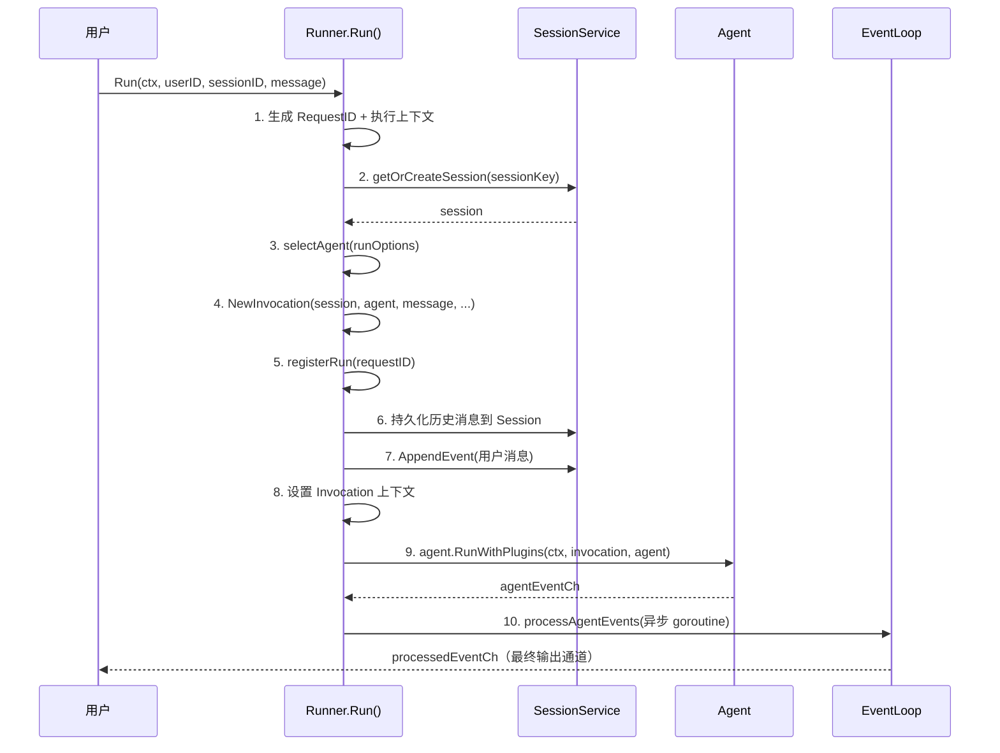

**Step 3：Agent 选择策略**（三级优先级）
```go
// 优先级1：RunOptions 直接指定 Agent 实例
if ro.Agent != nil { return ro.Agent }
// 优先级2：RunOptions 指定 Agent 名 → 从注册表查找
if ro.AgentByName != "" { agentName = ro.AgentByName }
// 优先级3：使用默认 Agent（先查 agents map，再查 agentFactories 延迟创建）
```

**Step 4：创建 Invocation**（核心上下文对象）
```go
invocation := agent.NewInvocation(
    agent.WithInvocationSession(sess),
    agent.WithInvocationMessage(message),
    agent.WithInvocationAgent(ag),
    agent.WithInvocationMemoryService(r.memoryService),
    // ... 更多选项
)
```

### 1.1.4 事件循环 runEventLoop

```go
func (r *runner) runEventLoop(ctx context.Context, loop *eventLoopContext) {
    defer func() {
        r.safeEmitRunnerCompletion(ctx, loop)  // 发送 runner-completion 事件
        close(loop.processedEventCh)            // 关闭输出通道
    }()
    for {
        select {
        case agentEvent, ok := <-loop.agentEventCh:    // Agent 事件
            r.processSingleAgentEvent(ctx, loop, agentEvent)
        case req, ok := <-loop.flushChan:               // Flush 请求
            r.handleFlushRequest(ctx, loop, req)
        case <-ctx.Done():                               // 上下文取消
            return
        }
    }
}
```

**单事件处理流程** `processSingleAgentEvent`：
1. 应用 Plugin 事件拦截器
2. 记录已发送的 Assistant Response ID（防重复）
3. **持久化事件到 Session**（只持久化非 partial 的完整事件）
4. 捕获 Graph 完成快照
5. 通知完成（用于同步等待机制）
6. 应用 StreamMode 过滤
7. 发送到输出通道

### 1.1.5 面试关键总结

| 问题 | 要点 |
|------|------|
| Runner 和 Agent 的关系？ | Runner 是协调器，管理 Agent 的生命周期、Session、Memory；Agent 负责实际的 LLM 调用和工具执行 |
| Runner 做了哪些事？ | Session 管理、Agent 选择、Invocation 创建、事件持久化、事件过滤、Runner Completion |
| 事件流怎么实现？ | Go Channel 单向传递，Agent 产出 → Runner 处理（持久化+插件+过滤）→ 消费者读取 |
| 如何支持取消？ | ManagedRunner.Cancel(requestID) → 查找 runHandle → 调用 context.CancelFunc |

---

## 🔥 1.2 Agent 接口定义

> **文件**：`agent/agent.go`（~105 行）
> **角色**：定义所有 Agent 必须实现的统一接口

### 1.2.1 核心接口

```go
type Agent interface {
    Run(ctx context.Context, invocation *Invocation) (<-chan *event.Event, error)
    Tools() []tool.Tool
    Info() Info
    SubAgents() []Agent
    FindSubAgent(name string) Agent
}
```

### 1.2.2 设计要点

- **接口极简**：只有 5 个方法，任何实现只需关注 `Run()`
- **统一返回类型**：所有 Agent 都返回 `<-chan *event.Event`，Runner 无需关心具体 Agent 类型
- **递归结构**：`SubAgents()` 和 `FindSubAgent()` 支持 Agent 嵌套组合
- **6 种 Agent 实现**：LLMAgent、GraphAgent、ChainAgent、ParallelAgent、CycleAgent、A2AAgent
- **StopError**：使用 `errors.As` 检测的信号式终止 Agent 执行

---

## 🔥 1.3 Invocation — 调用上下文

> **文件**：`agent/invocation.go`（~1234 行）
> **角色**：贯穿整个执行链的上下文对象，携带 Session、Model、Message、状态等一切运行时信息

### 1.3.1 核心结构体

```go
type Invocation struct {
    Agent           Agent              // 当前执行的 Agent
    AgentName       string             // Agent 名称
    InvocationID    string             // 唯一调用 ID（UUID）
    Branch          string             // 执行分支链路（多 Agent 追踪）
    EndInvocation   bool               // 终止标记

    Session         *session.Session   // 当前会话
    Model           model.Model        // 当前使用的 LLM 模型
    Message         model.Message      // 用户消息
    RunOptions      RunOptions         // 运行时选项
    TransferInfo    *TransferInfo      // Agent 转移信息

    MaxLLMCalls       int              // 最大 LLM 调用次数（安全限制）
    MaxToolIterations int              // 最大工具迭代次数

    state           map[string]any     // 调用级 KV 状态存储
    parent          *Invocation        // 父 Invocation（多 Agent 场景）
    noticeChannels  map[string]chan any // 通知通道（同步等待机制）
}
```

### 1.3.2 核心方法

**Clone — 子 Invocation 创建**：
```go
func (inv *Invocation) Clone(opts ...InvocationOptions) *Invocation {
    newInv := &Invocation{
        InvocationID: uuid.NewString(),  // 新 ID
        Session:      inv.Session,        // 共享 Session
        parent:       inv,                // 记录父级
        state:        inv.cloneState(),   // 继承内部状态
    }
    // Branch 链路追加：parentBranch/childAgentName
    newInv.Branch = inv.Branch + "/" + newInv.AgentName
    return newInv
}
```

**通知机制**（基于 Go channel 的同步等待）：
```go
func (inv *Invocation) AddNoticeChannelAndWait(ctx, key, timeout) error  // 创建并等待
func (inv *Invocation) NotifyCompletion(ctx, key) error                  // 触发通知
```

**安全限制**：
```go
func (inv *Invocation) IncLLMCallCount() error    // 超限返回 StopError
func (inv *Invocation) IncToolIteration() bool     // 超限返回 true
```

### 1.3.3 RunOptions 核心字段

```go
type RunOptions struct {
    RuntimeState    map[string]any     // 运行时状态 KV
    Messages        []model.Message    // 完整对话历史
    Resume          bool               // 恢复模式
    RequestID       string             // 请求 ID
    MaxRunDuration  time.Duration      // 最大运行时长
    Model           model.Model        // 运行时模型覆盖
    Instruction     string             // 运行时指令覆盖
    ToolFilter      tool.FilterFunc    // 工具过滤器
    Stream          *bool              // 流式覆盖
}
```

### 1.3.4 面试关键总结

| 问题 | 要点 |
|------|------|
| Invocation 是什么？ | 贯穿整个执行链的上下文对象，携带 Session、Model、状态等信息 |
| Branch 有什么用？ | 记录多 Agent 执行链路，如 `coordinator/diagnosis/knowledge`，用于事件追踪和过滤 |
| 通知机制怎么工作？ | 基于 Go channel 的同步等待：AddNoticeChannel 创建 → NotifyCompletion 关闭 → 等待方解除阻塞 |

---

## 🔥 1.4 Event 事件系统

> **文件**：`event/event.go`（~449 行）+ `event/options.go`
> **角色**：定义事件结构和事件发送机制

### 1.4.1 Event 核心结构

```go
type Event struct {
    *model.Response                    // 内嵌 LLM 响应（核心数据载体）
    RequestID          string          // 请求 ID
    InvocationID       string          // 调用 ID
    Author             string          // 事件作者（Agent 名或 "user"）
    ID                 string          // 事件唯一 ID
    Timestamp          time.Time       // 时间戳
    Branch             string          // 执行分支
    Tag                string          // 业务标签
    StateDelta         map[string][]byte   // 状态变化增量
    StructuredOutput   any              // 结构化输出
    Actions            *EventActions    // 流控制动作
    FilterKey          string           // 层级过滤键
}
```

### 1.4.2 事件流架构图

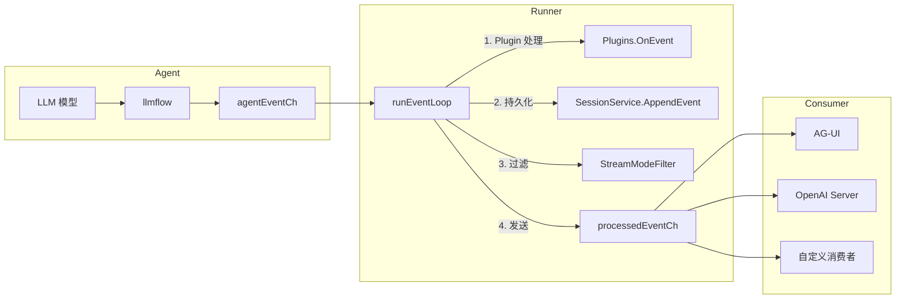

### 1.4.3 关键辅助方法

```go
e.IsRunnerCompletion()  // 判断是否为流结束信号
e.IsError()             // 判断是否为错误事件
e.Filter(filterKey)     // 按 FilterKey 过滤（层级前缀匹配）
e.Clone()               // 深拷贝事件
event.New(invocationID, author, opts...)          // 通用事件
event.NewErrorEvent(invocationID, author, ...)    // 错误事件
event.NewResponseEvent(invocationID, author, ...) // 响应事件（最常用）
```

---

## 🔥 1.5 LLMAgent — 最核心的 Agent 实现

> **文件**：`agent/llmagent/llm_agent.go`（~1271 行）
> **角色**：基于 LLM 的 Agent 实现，是最常用的 Agent 类型

### 1.5.1 LLMAgent 结构体

```go
type LLMAgent struct {
    name              string
    model             model.Model           // 当前模型
    models            map[string]model.Model // 多模型注册表
    description       string
    instruction       string                // Agent 指令（角色设定）
    flow              flow.Flow             // ★ 核心执行流（llmflow）
    tools             []tool.Tool           // 所有工具
    userToolNames     map[string]bool       // 用户注册的工具名
    subAgents         []agent.Agent         // 子 Agent 列表
    structuredOutput  *model.StructuredOutput // 结构化输出
    mu                sync.RWMutex          // 并发安全锁
}
```

### 1.5.2 New() 构造过程

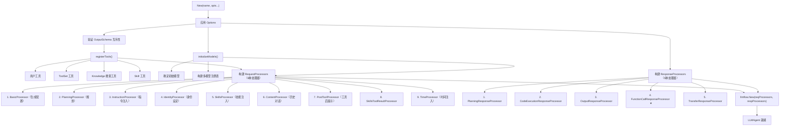

### 1.5.3 Run() 执行流程

```go
func (a *LLMAgent) Run(ctx, invocation) (<-chan *event.Event, error) {
    a.setupInvocation(invocation)          // 1. 设置模型选择、Agent 绑定
    ctx, flowEventChan, err := a.executeAgentFlow(ctx, invocation) // 2. 执行含 BeforeAgent 回调
    return a.wrapEventChannelWithTelemetry(ctx, invocation, flowEventChan, ...), nil // 3. 包装 Telemetry
}
```

**setupInvocation 模型选择**（三级优先级）：
- 优先级1：`RunOptions.Model`（直接指定实例）
- 优先级2：`RunOptions.ModelName`（按名查找）
- 优先级3：Agent 默认模型

### 1.5.4 工具注册机制

```go
func registerTools(options *Options) ([]tool.Tool, map[string]bool) {
    // 1. 收集用户显式注册的工具 → userToolNames
    // 2. 从 ToolSet 中展开工具（静态模式）
    // 3. 添加 Knowledge 搜索工具（框架级，不可过滤）
    // 4. 添加 Skill 工具
    return allTools, userToolNames
}
```

**工具分类**：
- **用户工具**（可被 ToolFilter 过滤）：WithTools、WithToolSets 注册的
- **框架工具**（不可过滤）：knowledge_search、transfer_to_agent
- **Skill 工具**：skill_load、skill_run 等

### 1.5.5 动态更新能力

LLMAgent 支持运行时安全地更新配置（通过 `sync.RWMutex` 保证并发安全）：
```go
a.SetModel(m)              // 切换模型
a.SetInstruction("新指令") // 更新指令
a.SetSubAgents(subAgents)  // 更新子 Agent
a.AddToolSet(toolSet)      // 添加 ToolSet
```

---

## 🔥 1.6 LLMFlow — LLMAgent 的心脏

> **文件**：`internal/flow/llmflow/llmflow.go`（~1044 行）
> **角色**：LLMAgent 的实际执行逻辑，实现 ReAct 循环（LLM → Tool → LLM → ...）

### 1.6.1 Flow 结构

```go
type Flow struct {
    requestProcessors   []flow.RequestProcessor   // 请求预处理器链
    responseProcessors  []flow.ResponseProcessor  // 响应后处理器链
    channelBufferSize   int                       // 事件通道缓冲大小
    modelCallbacks      *model.Callbacks          // 模型回调
}
```

### 1.6.2 Run() — ReAct 循环 ⭐⭐⭐

这是整个框架最核心的执行循环：

```go
func (f *Flow) Run(ctx, invocation) (<-chan *event.Event, error) {
    eventChan := make(chan *event.Event, f.channelBufferSize)
    go func() {
        defer close(eventChan)
        // 可选：恢复待执行的 Tool Calls
        f.maybeResumePendingToolCalls(ctx, invocation, eventChan)

        for {
            f.emitStartEventAndWait(ctx, invocation, eventChan)      // 发送 start 事件
            lastEvent, err := f.runOneStep(ctx, invocation, eventChan) // 运行一步
            if lastEvent == nil || invocation.EndInvocation || lastEvent.IsFinalResponse() {
                break  // 退出循环
            }
            // 否则继续下一轮（Tool 调用后会继续 LLM）
        }
    }()
    return eventChan, nil
}
```

### 1.6.3 runOneStep — 单步执行

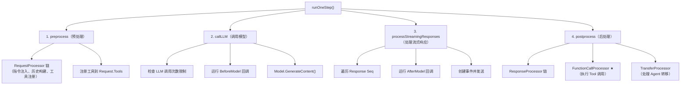

### 1.6.4 ReAct 循环流程图

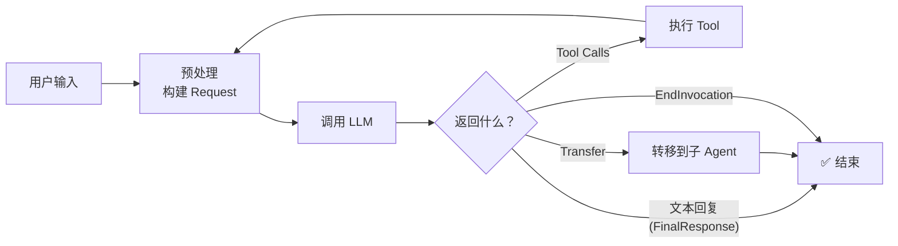

### 1.6.5 关键方法详解

**preprocess（预处理）**：按顺序执行 9 个 RequestProcessor → 获取并注册工具（含过滤）→ 清理历史中无效的 Tool Call 引用

**callLLM（调用模型）**：检查调用次数限制 → BeforeModel 回调 → 支持 IterModel 优化（减少 goroutine）

**工具过滤策略**：
1. 从缓存取（同一 Invocation 内工具列表不变）
2. 区分用户工具 vs 框架工具
3. 只对用户工具应用 ToolFilter
4. **按名称排序**（提升 Prompt Cache 命中率）

---

## 🔥 1.7 Model 接口

> **文件**：`model/model.go`（~75 行）
> **角色**：定义 LLM 模型的统一接口

### 1.7.1 核心接口

```go
type Model interface {
    GenerateContent(ctx context.Context, request *Request) (<-chan *Response, error)
    Info() Info
}

// 可选扩展：迭代器模式（减少 goroutine 开销）
type IterModel interface {
    Model
    GenerateContentIter(ctx context.Context, request *Request) (Seq[*Response], error)
}
```

### 1.7.2 双层错误处理策略

```
错误层级：
├── 函数级错误（error 返回值）：系统级故障（网络、参数等），通道无法创建
└── 响应级错误（Response.Error 字段）：API 级错误（限流、内容过滤等），通过通道传递
```

---

## 🔥 1.8 Tool 系统

> **文件**：`tool/tool.go`（~84 行）+ `tool/toolset.go`（~26 行）+ `tool/function/function_tool.go`（~347 行）+ `tool/mcp/toolset.go`（~614 行）+ `tool/mcp/tool.go`（~113 行）+ `tool/transfer/transfer_tool.go`（~161 行）

### 1.8.1 Tool 接口层次

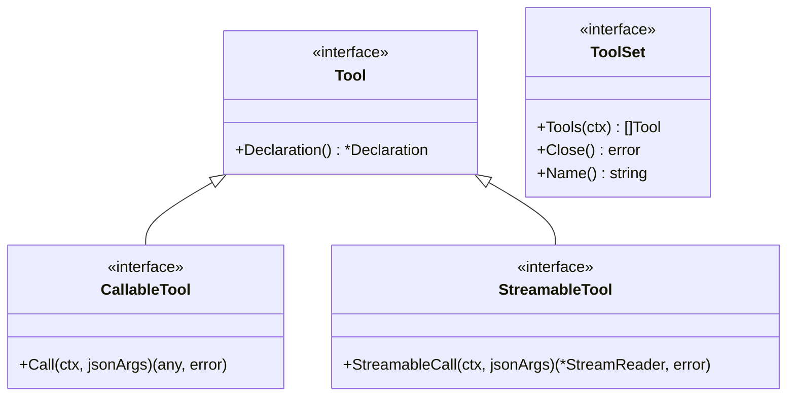

### 1.8.2 Declaration — 工具声明

```go
type Declaration struct {
    Name        string   // 工具名（必须匹配 ^[a-zA-Z0-9_-]+$）
    Description string   // 工具描述
    InputSchema *Schema  // 输入参数 JSON Schema
}

type Schema struct {
    Type       string              `json:"type"`
    Required   []string            `json:"required"`
    Properties map[string]*Schema  `json:"properties"`
    Items      *Schema             `json:"items"`      // 数组元素
    Enum       []any               `json:"enum"`       // 枚举值
    Ref        string              `json:"$ref"`       // JSON Schema 引用
    Defs       map[string]*Schema  `json:"$defs"`      // 可复用定义
}
```

### 1.8.3 FunctionTool — 本地函数工具

```go
// 泛型工具：自动推导 JSON Schema
type FunctionTool[I, O any] struct {
    name        string
    description string
    inputSchema *tool.Schema
    fn          func(context.Context, I) (O, error)  // 实际执行函数
}

// 创建示例
weatherTool := function.NewFunctionTool(
    func(ctx context.Context, input WeatherInput) (WeatherOutput, error) {
        return getWeather(input.City)
    },
    function.WithName("get_weather"),
    function.WithDescription("获取天气信息"),
)
```

**核心特性**：
- **Go 泛型**：`FunctionTool[I, O any]`，编译时类型安全
- **自动 Schema 生成**：通过 `reflect.TypeOf(emptyI)` → `GenerateJSONSchema()` 自动从 Go struct 生成 JSON Schema
- **Call() 流程**：`JSON bytes → Unmarshal → fn(ctx, input) → result`

### 1.8.4 MCP ToolSet — MCP 协议工具集

```go
type ToolSet struct {
    config         toolSetConfig
    sessionManager *mcpSessionManager  // MCP 会话管理
    tools          []tool.Tool         // 缓存的工具列表
    name           string
}
```

**MCP 三步协议**：

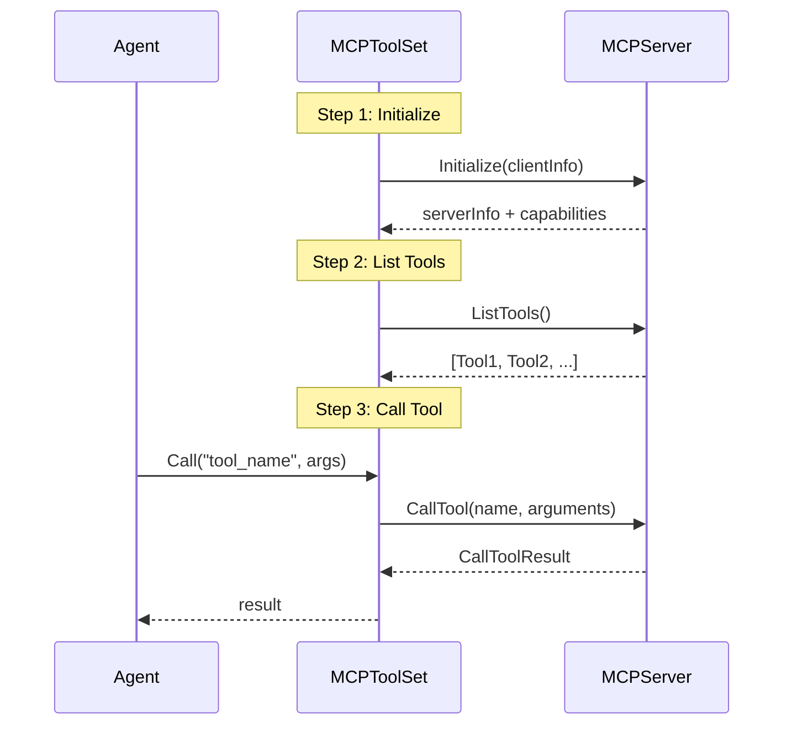

**三种传输协议**：
| 协议 | 适用场景 | 实现 |
|------|---------|------|
| `STDIO` | 本地进程（stdin/stdout） | `mcp.NewStdioClient()` |
| `SSE` | 远端 SSE 流式 | `mcp.NewSSEClient()` |
| `Streamable HTTP` | 远端可流式 HTTP | `mcp.NewClient()` |

**自动重连机制**：
```go
func (m *mcpSessionManager) executeWithSessionReconnect(ctx, operation) error {
    err := operation()
    if m.shouldAttemptSessionReconnect(err) {
        // 使用 singleflight 确保只有一个 goroutine 执行重连
        m.reconnectGroup.Do("reconnect", func() {
            m.doRecreateSession(ctx)  // 关闭旧连接 → 创建新客户端 → 重新初始化
        })
        return operation()  // 重试
    }
}
```

### 1.8.5 Transfer Tool — Agent 转移工具

```go
type Tool struct {
    availableAgents []agent.Info  // 可转移的目标 Agent 列表
}
```

**Transfer 工作机制**：
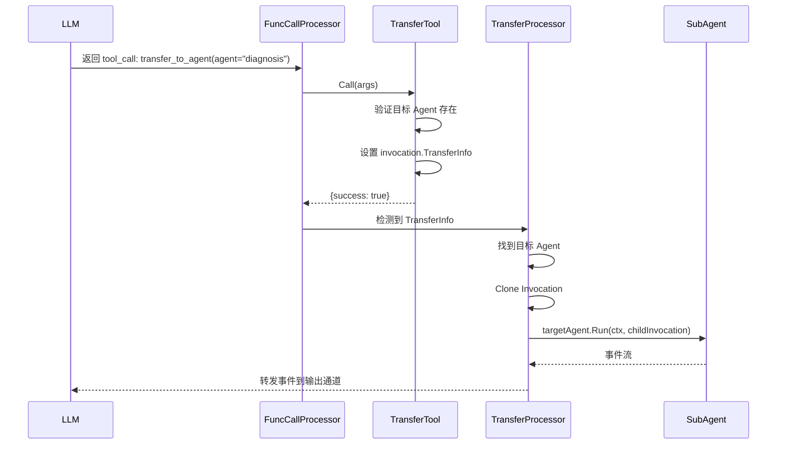

### 1.8.6 TransferController — 转移控制器

```go
type TransferController interface {
    // OnTransfer 在框架运行目标 agent 之前调用
    // 返回 err 非 nil 则拒绝转移
    // 返回 targetTimeout > 0 则限制目标 agent 运行时长
    OnTransfer(ctx context.Context, fromAgent string, toAgent string) (targetTimeout time.Duration, err error)
}
```

通过 `RuntimeStateKeyTransferController` 在 RunOptions.RuntimeState 中安装，实现转移策略控制。

### 1.8.7 面试关键总结

| 问题 | 要点 |
|------|------|
| MCP 是什么？和 Function Calling 区别？ | MCP 管"从哪获取工具"（工具发现协议），Function Calling 管"何时调用"（LLM 自动选择），互补关系 |
| FunctionTool 的 JSON Schema 怎么生成？ | Go reflect 读 struct field+tag → GenerateJSONSchema()，编译时类型安全 |
| MCP 的三种传输协议？ | STDIO（本地进程）、SSE（远端流式）、Streamable HTTP（远端可流式 HTTP） |
| MCP 断连怎么办？ | 自动重连：singleflight 确保单次重连 → 关闭旧连接 → 创建新客户端 → 重新初始化 |
| Transfer 怎么实现？ | LLM 决定调用 transfer_to_agent → 设置 TransferInfo → TransferProcessor 执行子 Agent |

---

## 🔥 1.9 Graph 图编排引擎

> **文件**：`graph/state_graph.go`（~4596 行）+ `graph/graph.go`（~576 行）+ `graph/state.go`（~642 行）+ `graph/executor.go`（~4481 行）+ `graph/static_interrupt.go`（~220 行）+ `graph/checkpoint.go`（~1148 行）
>
> **角色**：实现 LangGraph 风格的有状态图执行引擎，支持条件路由、并行执行、中断恢复、Checkpoint 持久化

### 1.9.1 Graph 系统架构全景

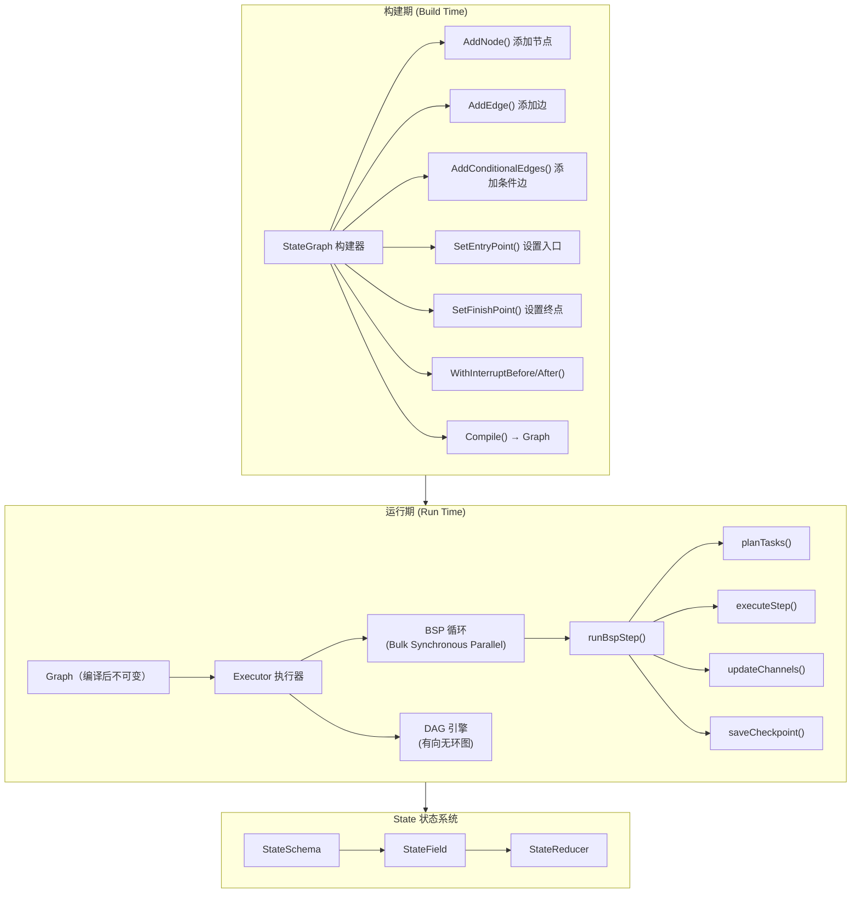

### 1.9.2 StateGraph — 构建器

```go
type StateGraph struct {
    graph       *Graph                  // 底层 Graph 对象
    buildErrors *stateGraphBuildErrors  // 构建错误收集器（延迟报错）
}
```

**核心构建方法**：
```go
// 添加节点 — 注册执行函数 + 自动创建 Trigger Channel
sg.AddNode("nodeA", func(ctx context.Context, state State) (any, error) {
    return map[string]any{"result": "ok"}, nil
}, graph.WithInterruptBefore())  // 可选：执行前中断

// 添加普通边
sg.AddEdge("nodeA", "nodeB")  // nodeA → nodeB

// 添加条件边 ⭐
sg.AddConditionalEdges("nodeA", routerFunc, map[string]string{
    "path1": "nodeB",
    "path2": "nodeC",
    "end":   graph.End,
})

// 设置入口和终点
sg.SetEntryPoint("nodeA")
sg.SetFinishPoint("nodeC")

// 编译 → 不可变 Graph
compiledGraph, err := sg.Compile()
```

**AddNode 内部做了什么**：
1. 创建 `Node` 对象，包装执行函数（加入 Tracing Span）
2. 调用 `graph.addNode(node)` 注册
3. **自动创建 Trigger Channel**：`trigger:{nodeID}` → Pregel 风格的触发机制
4. 关联 Node 与 Trigger Channel

**AddConditionalEdges 内部做了什么**：
1. 包装条件函数 `wrapperCondFunc(condFunc)`（支持多种函数签名）
2. 创建 `ConditionalEdge{From, Condition, PathMap}`
3. 注册到 `graph.conditionalEdges`

**Compile 精简逻辑**：
```go
func (sg *StateGraph) Compile() (*Graph, error) {
    if err := sg.buildErr(); err != nil { return nil, err }   // 检查构建错误
    if err := sg.graph.validate(); err != nil { return nil, err } // 图结构验证
    return sg.graph, nil
}
```

### 1.9.3 Graph — 编译后的图结构

```go
type Graph struct {
    schema           *StateSchema                    // 状态 Schema
    nodes            map[string]*Node                // 节点表
    edges            map[string][]*Edge              // 普通边表
    conditionalEdges map[string]*ConditionalEdge     // 条件边表
    entryPoint       string                          // 入口节点
    channelManager   *channel.Manager                // Pregel Channel 管理器
    triggerToNodes   map[string][]string             // Channel → Node 触发映射
    cache            Cache                           // 可选缓存
    cachePolicy      *CachePolicy                   // 缓存策略
}
```

### 1.9.4 State 状态系统 ⭐

```go
// State 本质上是 map[string]any
type State map[string]any

// 状态 Schema 定义
type StateSchema struct {
    Fields map[string]StateField
}

type StateField struct {
    Type            reflect.Type    // 字段类型（类型安全校验）
    Reducer         StateReducer    // 聚合函数
    Default         func() any      // 默认值工厂
    Required        bool            // 是否必填
    DisableDeepCopy bool            // 是否禁用深拷贝
}

// Reducer：聚合旧值和新值
type StateReducer func(existing, update any) any
```

**预置 State Key**：
| Key | 用途 |
|-----|------|
| `user_input` | 用户输入（消费后清除） |
| `one_shot_messages` | 一次性覆盖消息 |
| `messages` | 对话历史（最常用） |
| `remaining_steps` | 剩余步数限制 |

**Reducer 示例**：
```go
// 追加式 Reducer（用于 messages 字段）
func MessagesReducer(existing, update any) any {
    existingMsgs := existing.([]model.Message)
    updateMsgs := update.([]model.Message)
    return append(existingMsgs, updateMsgs...)
}

// 覆盖式 Reducer（默认行为）
func ReplaceReducer(existing, update any) any {
    return update
}
```

### 1.9.5 Executor — BSP 执行引擎 ⭐⭐⭐

```go
type Executor struct {
    graph                 *Graph
    channelBufferSize     int
    maxSteps              int              // 最大步数限制
    maxConcurrency        int              // 最大并发数
    executionEngine       ExecutionEngine  // BSP 或 DAG
    stepTimeout           time.Duration    // 单步超时
    nodeTimeout           time.Duration    // 单节点超时
    checkpointSaver       CheckpointSaver  // Checkpoint 持久化
    checkpointManager     *CheckpointManager
    defaultRetry          []RetryPolicy    // 默认重试策略
}
```

**Execute() 完整流程**：

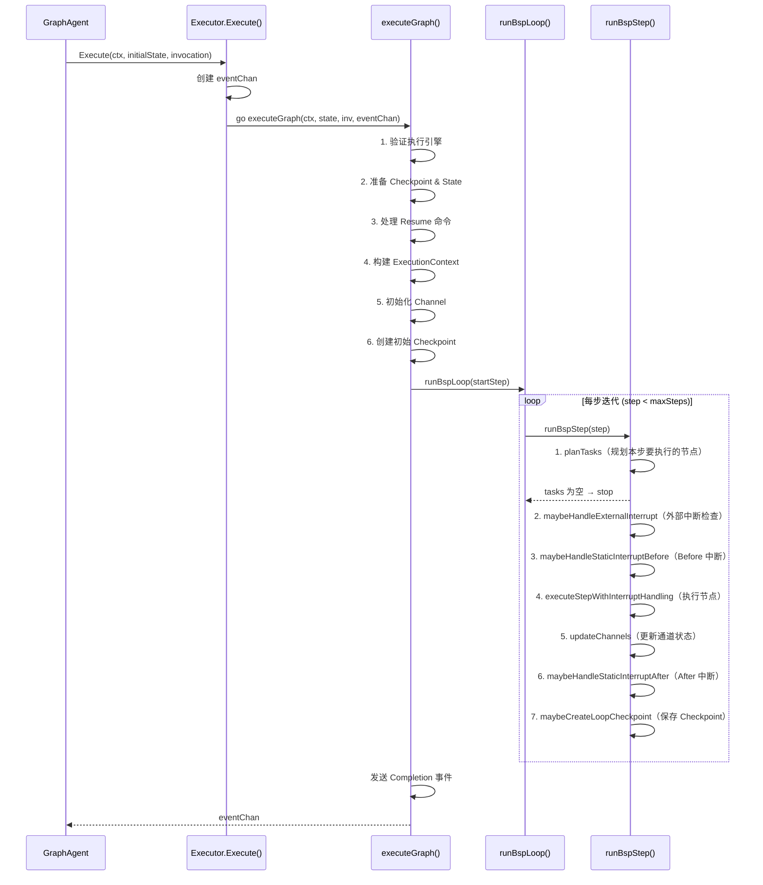

**两种执行引擎**：
| 引擎 | 特点 | 适用场景 |
|------|------|---------|
| **BSP**（默认） | 同步屏障：每步所有节点执行完才进入下一步 | 有状态依赖、需要 Checkpoint |
| **DAG** | 拓扑排序：无依赖的节点立即执行 | 无状态依赖、追求最大并行度 |

### 1.9.6 中断恢复机制 ⭐⭐

**两种中断类型**：

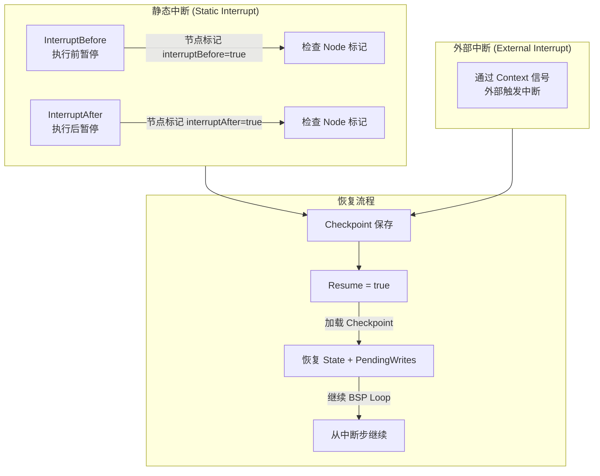

**InterruptBefore 工作原理**：
1. `runBspStep` 规划出待执行 tasks
2. 执行前检查 `node.interruptBefore == true`
3. 如果命中且非恢复跳过：保存 Checkpoint → 抛出 `InterruptError`
4. 恢复时：加载 Checkpoint → 标记 skip → 正常执行

**InterruptAfter 工作原理**：
1. 节点执行完成后
2. 检查 `node.interruptAfter == true`
3. 命中：保存 Checkpoint → 抛出 `InterruptError`（`SkipRerun = true`）
4. 恢复时：跳过已执行的节点 → 从下一步继续

### 1.9.7 Checkpoint 持久化

```go
type CheckpointSaver interface {
    Get(ctx, config) (*Checkpoint, error)       // 获取 Checkpoint
    GetTuple(ctx, config) (*CheckpointTuple, error)
    List(ctx, config, filter) ([]*CheckpointTuple, error)
    Put(ctx, req) (map[string]any, error)       // 保存 Checkpoint
    PutWrites(ctx, req) error                   // 保存中间写入
    PutFull(ctx, req) (map[string]any, error)   // 原子保存
    DeleteLineage(ctx, lineageID) error         // 删除血统线
    Close() error
}
```

### 1.9.8 GraphAgent — Graph 的 Agent 包装

```go
func (ga *GraphAgent) Run(ctx, invocation) (<-chan *event.Event, error) {
    ga.setupInvocation(invocation)          // 设置模型等
    out := make(chan *event.Event)
    go ga.runWithBarrier(ctx, invocation, out) // 或 runWithoutBarrier
    return out, nil
}
```

GraphAgent 内部将 LLMAgent 注册为 Graph 节点，通过 Graph 的条件边实现复杂的多步骤工作流。

### 1.9.9 面试关键总结

| 问题 | 要点 |
|------|------|
| Graph 和 LLMAgent 的区别？ | LLMAgent 是 ReAct 循环（LLM→Tool→LLM），Graph 是图编排（多节点+条件路由+并行+中断恢复） |
| BSP 执行引擎是什么？ | Bulk Synchronous Parallel，每步所有就绪节点并行执行完才进入下一步，支持 Checkpoint |
| 条件边怎么工作？ | 条件函数返回路径名 → PathMap 映射到目标节点 → 激活对应 Trigger Channel |
| 中断恢复怎么实现？ | InterruptBefore/After 标记节点 → 保存 Checkpoint → Resume 加载状态 → 从中断步继续 |
| State 的 Reducer 是什么？ | 控制多节点输出如何合并：覆盖式（默认）vs 追加式（如 messages） |

---

## 🔥 1.10 Multi-Agent 协作机制

> **文件**：`agent/transfer_controller.go` + `tool/transfer/transfer_tool.go` + `agent/graphagent/`

### 1.10.1 三种协作模式

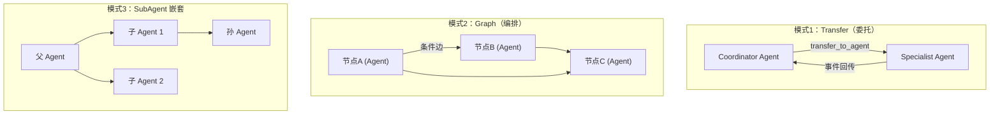

### 1.10.2 Transfer 协作完整链路

```
1. Coordinator Agent 注册子 Agents（SubAgents）
2. 框架自动注册 transfer_to_agent 工具
3. LLM 决定调用 transfer_to_agent(agent="diagnosis")
4. TransferTool.Call()：
   a. 验证目标 Agent 存在
   b. 设置 invocation.TransferInfo = {ToAgent: "diagnosis"}
5. TransferResponseProcessor 检测到 TransferInfo：
   a. 查找目标 Agent
   b. Clone Invocation（新 ID + Branch 追踪）
   c. 可选：TransferController.OnTransfer() 校验
   d. 调用 targetAgent.Run(ctx, childInvocation)
   e. 转发子 Agent 事件到输出通道
```

### 1.10.3 TransferController — 转移策略控制

```go
type TransferController interface {
    OnTransfer(ctx, fromAgent, toAgent string) (targetTimeout time.Duration, err error)
}
```

使用场景：
- 拒绝某些非法转移：返回 error
- 限制子 Agent 执行时长：返回 targetTimeout > 0
- 记录审计日志

---

## 📊 附录：核心文件速查表

| 优先级 | 文件 | 行数 | 核心职责 | 面试重要度 |
|--------|------|------|---------|-----------|
| ⭐⭐⭐ | `runner/runner.go` | ~1363 | 框架入口，Session/事件管理 | 必考 |
| ⭐⭐⭐ | `agent/agent.go` | ~105 | Agent 统一接口 | 必考 |
| ⭐⭐⭐ | `agent/invocation.go` | ~1234 | 调用上下文，状态+通知 | 必考 |
| ⭐⭐⭐ | `event/event.go` | ~449 | 事件系统 | 必考 |
| ⭐⭐⭐ | `agent/llmagent/llm_agent.go` | ~1271 | LLMAgent 实现 | 必考 |
| ⭐⭐⭐ | `internal/flow/llmflow/llmflow.go` | ~1044 | ReAct 循环心脏 | 必考 |
| ⭐⭐ | `graph/state_graph.go` | ~4596 | Graph 构建器 | 高 |
| ⭐⭐ | `graph/executor.go` | ~4481 | BSP/DAG 执行引擎 | 高 |
| ⭐⭐ | `graph/state.go` | ~642 | State + Reducer | 高 |
| ⭐⭐ | `graph/graph.go` | ~576 | Graph 编译后结构 | 高 |
| ⭐⭐ | `graph/checkpoint.go` | ~1148 | Checkpoint 持久化 | 高 |
| ⭐ | `tool/tool.go` | ~84 | Tool 接口 | 中高 |
| ⭐ | `tool/function/function_tool.go` | ~347 | FunctionTool 反射+Schema | 中高 |
| ⭐ | `tool/mcp/toolset.go` | ~614 | MCP 三协议 | 中高 |
| ⭐ | `model/model.go` | ~75 | Model 接口 | 中 |
| ⭐ | `tool/transfer/transfer_tool.go` | ~161 | Transfer 实现 | 中 |

---

## 📊 附录：调用链全景图

```
用户请求
    ↓
Runner.Run()
    ├── getOrCreateSession()     // Session 管理
    ├── selectAgent()            // Agent 选择
    ├── NewInvocation()          // 创建调用上下文
    └── agent.Run()
         ↓
    LLMAgent.Run()
         ├── setupInvocation()   // 模型选择
         └── flow.Run()          // → llmflow
              ↓
         LLMFlow.Run()           // ReAct 循环
              ├── preprocess()   // 9个 RequestProcessor
              │    ├── InstructionProcessor（指令注入）
              │    ├── ContentProcessor（历史对话）
              │    └── ...（工具注册等）
              ├── callLLM()      // Model.GenerateContent()
              ├── processResponses() // 流式事件推送
              └── postprocess()  // 5个 ResponseProcessor
                   ├── FunctionCallProcessor → Tool.Call()
                   └── TransferProcessor → SubAgent.Run()
                        ↓
                   子 Agent 递归执行...
    ↓
Runner.runEventLoop()
    ├── Plugin 处理
    ├── Session 持久化
    ├── StreamMode 过滤
    └── → processedEventCh → 消费者
```