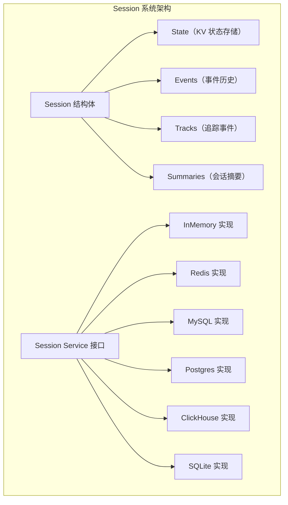
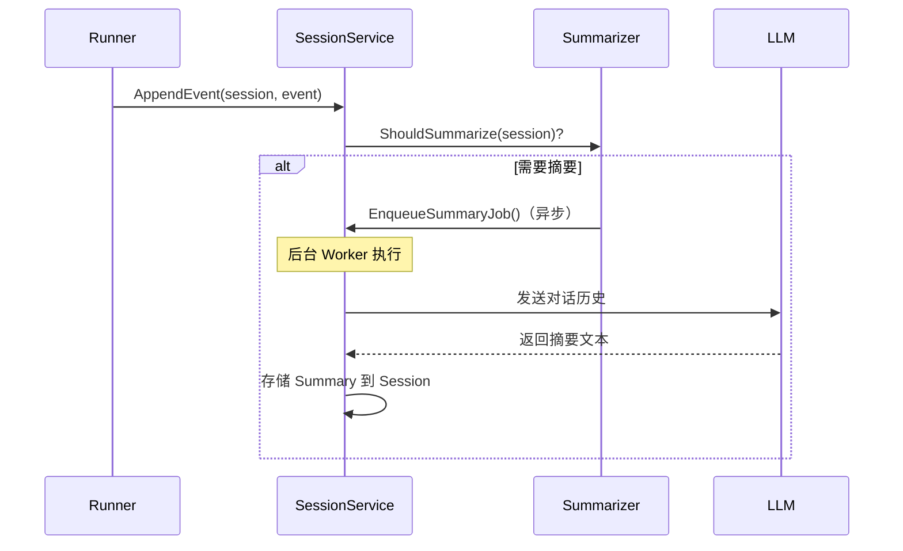
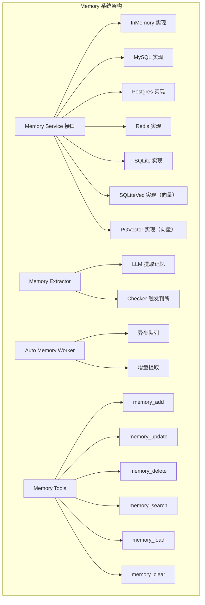
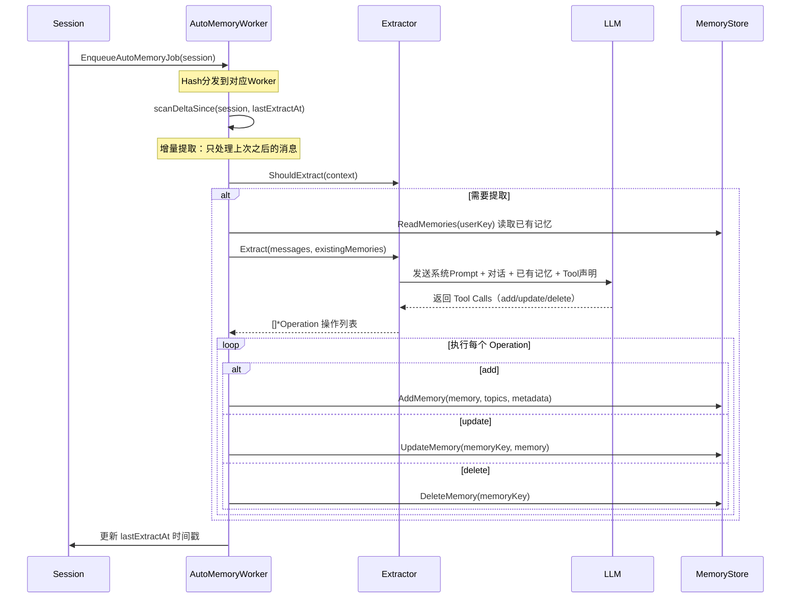
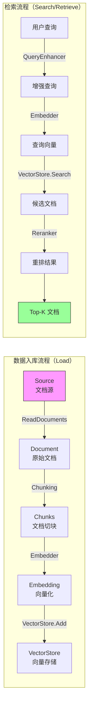
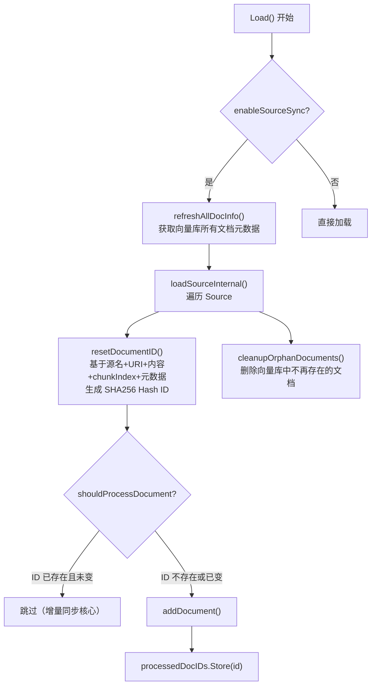
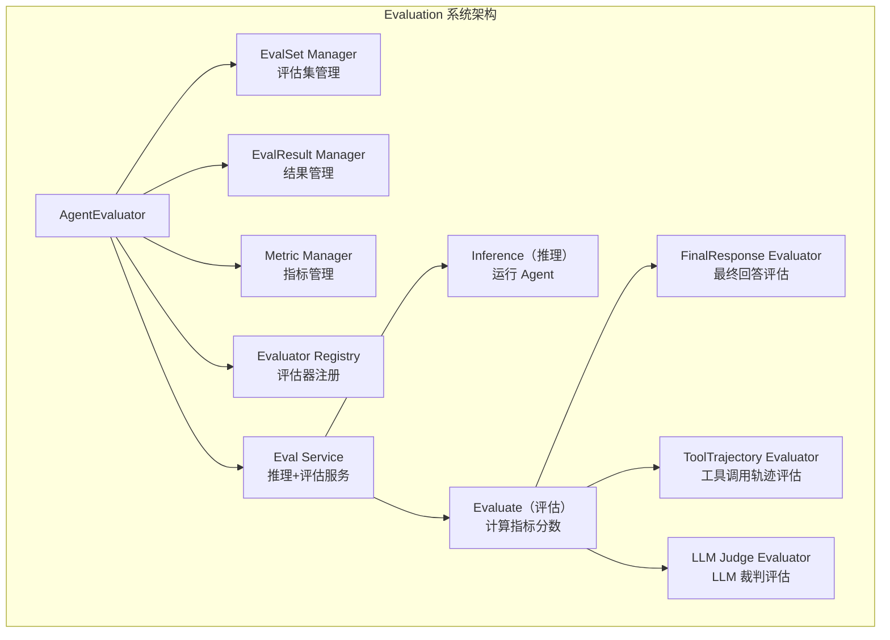
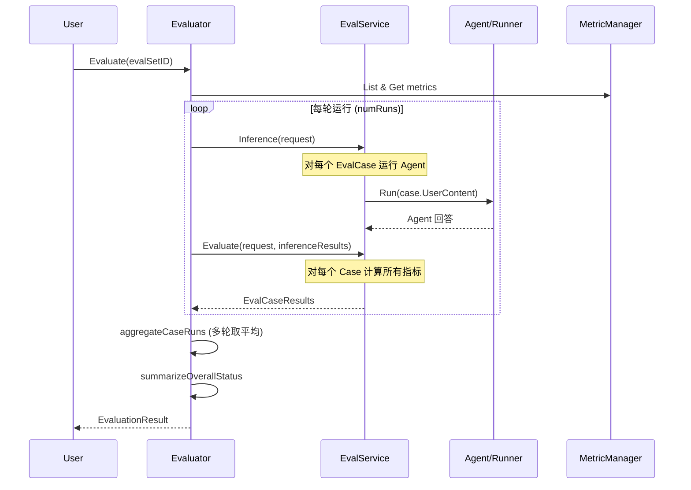
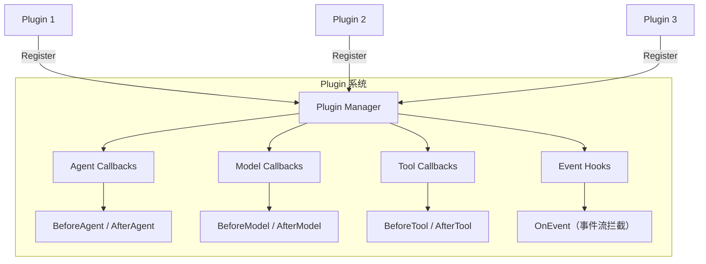
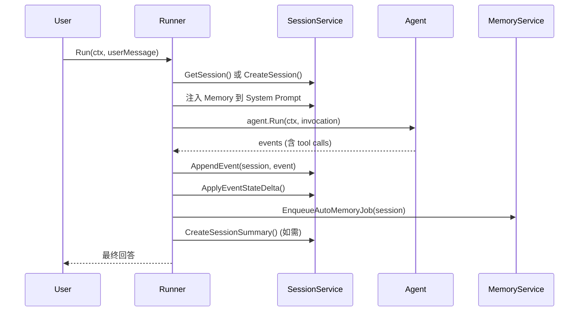

# 第二阶段核心源码精读分析：Agent 深入 + RAG 全流程

> 基于 [时间有限下的重点深入分析路径.md](D:/UGit/Go-Agent/时间有限下的重点深入分析路径.md) 第二阶段要求
>
> **核心仓库**：`trpc-agent-go-github`（开源版，主要核心代码）+ `trpc-agent-go`（内网版，调用开源版）
>
> **目标**：掌握 Session/Memory/RAG 生产级能力，能讲清 RAG 优化策略和评测体系

---

## 📌 第二阶段源码文件清单总览

| 模块 | 核心源码文件（开源版 trpc-agent-go-github） | 行数 | 面试重要度 |
|------|------------------------------------------|------|-----------|
| **Session** | `session/session.go` | ~739行 | 8/10 |
| **Session State** | `session/state.go` | ~54行 | 7/10 |
| **Session Summary** | `session/summary/summary.go` | ~71行 | 7/10 |
| **Memory** | `memory/memory.go` | ~334行 | 9/10 |
| **Memory Extractor** | `memory/extractor/extractor.go` + `memory/extractor/memory.go` | ~106+717行 | 9/10 |
| **Auto Memory Worker** | `memory/internal/memory/auto.go` | ~587行 | 8/10 |
| **Memory Tool** | `memory/tool/types.go` + `memory/tool/tool.go` | ~116+665行 | 7/10 |
| **Knowledge 接口** | `knowledge/knowledge.go` | ~101行 | 9/10 |
| **Knowledge 默认实现** | `knowledge/default.go` | ~1266行 | 9/10 |
| **Retriever 接口+实现** | `knowledge/retriever/retriever.go` + `default.go` | ~87+169行 | 9/10 |
| **VectorStore 接口** | `knowledge/vectorstore/vectorstore.go` | ~319行 | 8/10 |
| **Embedder 接口** | `knowledge/embedder/embedder.go` | ~67行 | 7/10 |
| **Reranker 接口** | `knowledge/reranker/reranker.go` | ~55行 | 8/10 |
| **Query Enhancer** | `knowledge/query/query.go` | ~58行 | 7/10 |
| **Chunking 策略** | `knowledge/chunking/chunking.go` | ~93行 | 8/10 |
| **Source 接口** | `knowledge/source/source.go` | ~164行 | 7/10 |
| **Knowledge SearchTool** | `knowledge/tool/searchtool.go` | ~419行 | 8/10 |
| **Evaluation** | `evaluation/evaluation.go` | ~436行 | 9/10 |
| **Evaluator 接口** | `evaluation/evaluator/evaluator.go` | ~74行 | 8/10 |
| **Plugin Manager** | `plugin/manager.go` | ~325行 | 7/10 |

---

## 一、Session 会话管理系统

### 1.1 核心架构概览



### 1.2 Session 结构体精读

**源码位置**：[session.go](D:/UGit/Go-Agent/trpc-agent-go-github/session/session.go)

```go
type Session struct {
    ID       string                 `json:"id"`      // 会话唯一标识
    AppName  string                 `json:"appName"` // 应用名（多租户隔离）
    UserID   string                 `json:"userID"`  // 用户标识
    State    StateMap               `json:"state"`   // KV 状态存储 map[string][]byte
    Events   []event.Event          `json:"events"`  // 完整事件历史
    Tracks   map[Track]*TrackEvents `json:"tracks"`  // 追踪事件（可观测性）
    Summaries map[string]*Summary   `json:"summaries"` // 分支摘要
    Hash     int                    `json:"-"`        // 槽位哈希（异步任务分发）
    ServiceMeta map[string]string   `json:"-"`        // 服务层元数据（仅内存）
}
```

**关键设计要点**：

1. **三维标识**：`AppName + UserID + SessionID` 组成唯一 Key，支持多租户隔离
2. **并发安全**：`EventMu`、`TracksMu`、`SummariesMu`、`stateMu` 四把读写锁分别保护不同字段，细粒度锁减少竞争
3. **深拷贝设计**：`Clone()` 方法对 Events、State、Tracks、Summaries 全量深拷贝，防止引用泄漏
4. **Hash 分发**：使用 FNV-32a 哈希预计算 `appName:userID:sessionID`，用于异步 Worker 的一致性分发

### 1.3 State 状态管理精读

**源码位置**：[state.go](D:/UGit/Go-Agent/trpc-agent-go-github/session/state.go)

```go
// 三级状态前缀（面试核心考点）
const (
    StateAppPrefix  = "app:"   // 应用级状态 - 所有用户共享
    StateUserPrefix = "user:"  // 用户级状态 - 同一用户跨会话共享
    StateTempPrefix = "temp:"  // 临时状态 - 会话级，不持久化
)
```

**四级状态隔离机制**：

| 前缀 | 作用域 | 生命周期 | 示例 |
|------|--------|---------|------|
| `{key}` | 会话级 | 随会话持久化 | 当前对话的上下文变量 |
| `user:{key}` | 用户级 | 跨会话持久化 | 用户偏好、历史设置 |
| `app:{key}` | 应用级 | 全局持久化 | 应用配置、共享资源 |
| `temp:{key}` | 会话临时 | 不持久化 | 临时计算中间值 |

**State 的 Delta 机制**：
```go
type State struct {
    Value StateMap `json:"value"` // 已提交的状态
    Delta StateMap `json:"delta"` // 未提交的增量
}
```
- `Set()` 同时写入 Value 和 Delta
- `Get()` 优先读 Delta，再读 Value（脏读语义）
- Runner 在 `AppendEvent` 后通过 `ApplyEventStateDelta()` 将 Event 的 `StateDelta` 合并到 Session State

### 1.4 Session Service 接口精读

```go
type Service interface {
    // CRUD 操作
    CreateSession(ctx, key, state, ...Option) (*Session, error)
    GetSession(ctx, key, ...Option) (*Session, error)
    ListSessions(ctx, userKey, ...Option) ([]*Session, error)
    DeleteSession(ctx, key, ...Option) error
    
    // 三级状态管理
    UpdateAppState(ctx, appName, state) error    // 应用级
    UpdateUserState(ctx, userKey, state) error   // 用户级
    UpdateSessionState(ctx, key, state) error    // 会话级
    
    // 事件追加
    AppendEvent(ctx, session, event, ...Option) error
    
    // 摘要管理（重要！）
    CreateSessionSummary(ctx, sess, filterKey, force) error
    EnqueueSummaryJob(ctx, sess, filterKey, force) error  // 非阻塞异步
    GetSessionSummaryText(ctx, sess, ...SummaryOption) (string, bool)
    
    Close() error
}
```

**面试要点**：
- **6 种后端实现**：InMemory / Redis / MySQL / Postgres / ClickHouse / SQLite
- **Event 过滤**：`WithEventNum(n)` 限制最近 N 条、`WithEventTime(t)` 过滤时间之后的事件
- **摘要系统**：支持 `filterKey` 分支摘要，异步队列处理，不阻塞主流程

### 1.5 Session Summary 会话摘要

**源码位置**：[summary.go](D:/UGit/Go-Agent/trpc-agent-go-github/session/summary/summary.go)

```go
type SessionSummarizer interface {
    ShouldSummarize(sess *session.Session) bool                    // 判断是否需要摘要
    Summarize(ctx context.Context, sess *session.Session) (string, error) // 生成摘要
    SetPrompt(prompt string)  // 动态更新 Prompt
    SetModel(m model.Model)   // 动态切换模型
}
```

**摘要触发与存储流程**：


---

## 二、Memory 记忆系统

### 2.1 Memory 核心架构



### 2.2 Memory Service 接口精读

**源码位置**：[memory.go](D:/UGit/Go-Agent/trpc-agent-go-github/memory/memory.go)

```go
type Service interface {
    // 基本 CRUD
    AddMemory(ctx, userKey, memory, topics, ...AddOption) error
    UpdateMemory(ctx, memoryKey, memory, topics, ...UpdateOption) error
    DeleteMemory(ctx, memoryKey) error
    ClearMemories(ctx, userKey) error
    
    // 读取和搜索
    ReadMemories(ctx, userKey, limit) ([]*Entry, error)
    SearchMemories(ctx, userKey, query, ...SearchOption) ([]*Entry, error)
    
    // 工具注册（Agent 可直接调用）
    Tools() []tool.Tool
    
    // 自动记忆提取（核心！）
    EnqueueAutoMemoryJob(ctx, sess *session.Session) error
    
    Close() error
}
```

**Memory vs Session 的核心区别**（面试必答）：

| 维度 | Session | Memory |
|------|---------|--------|
| **存储内容** | 业务状态 KV + 事件历史 | 用户画像、偏好、知识 |
| **生命周期** | 绑定单次会话 | 跨会话持久化 |
| **数据格式** | `StateMap (map[string][]byte)` | 结构化 `Entry{Memory, Topics, Kind}` |
| **检索方式** | Key-Value 直接读取 | 向量语义搜索 + 关键词搜索 |
| **管理方式** | Runner 自动管理 | Extractor 自动提取 / Tool 手动管理 |

### 2.3 Memory Kind 双类型体系

```go
type Kind string
const (
    KindFact    Kind = "fact"     // 事实型：稳定的个人属性、偏好
    KindEpisode Kind = "episode"  // 事件型：特定时间发生的具体事件
)
```

**Entry 结构体**：
```go
type Entry struct {
    ID        string    `json:"id"`
    AppName   string    `json:"app_name"`
    Memory    *Memory   `json:"memory"`    // 包含 Kind、EventTime、Participants、Location
    UserID    string    `json:"user_id"`
    Score     float64   `json:"score"`     // 向量搜索相似度分数 (0-1)
}
```

### 2.4 SearchOptions 高级搜索配置

```go
type SearchOptions struct {
    Query               string     // 语义搜索查询
    Kind                Kind       // 按类型过滤 (fact/episode)
    TimeAfter           *time.Time // 时间范围过滤
    TimeBefore          *time.Time
    MaxResults          int
    SimilarityThreshold float64    // 最低相似度阈值
    OrderByEventTime    bool       // 按事件时间排序（而非相似度）
    KindFallback        bool       // Kind 过滤结果不足时自动回退
    Deduplicate         bool       // 去重（高词重叠的近似记忆）
    HybridSearch        bool       // 混合搜索（向量 + 关键词 BM25）
    HybridRRFK          int        // RRF 融合参数 k（默认 60）
}
```

**面试亮点**：Memory 搜索原生支持 **RRF (Reciprocal Rank Fusion)** 混合搜索，将向量相似度和关键词搜索结果融合排序。

### 2.5 Memory Extractor 自动记忆提取

**源码位置**：[extractor.go](D:/UGit/Go-Agent/trpc-agent-go-github/memory/extractor/extractor.go) + [memory.go](D:/UGit/Go-Agent/trpc-agent-go-github/memory/extractor/memory.go)

```go
type MemoryExtractor interface {
    // 分析对话，返回记忆操作列表（不直接修改存储）
    Extract(ctx, messages []model.Message, existing []*memory.Entry) ([]*Operation, error)
    // 检查是否应该触发提取
    ShouldExtract(ctx *ExtractionContext) bool
    // 动态更新 Prompt / Model
    SetPrompt(prompt string)
    SetModel(m model.Model)
}
```

**提取流程详解**：



**关键设计要点**：

1. **增量提取**：通过 `SessionStateKeyAutoMemoryLastExtractAt` 记录上次提取时间戳，只处理新增消息
2. **Tool Calling 范式**：Extractor 不直接操作存储，而是声明 `memory_add/update/delete` 等 Tool，让 LLM 通过 Tool Calling 决定操作
3. **Checker 机制**：支持多种触发条件（消息数量、时间间隔等），AND/OR 逻辑组合
4. **幂等性**：`AddMemory` 设计为幂等操作，相同内容不会重复添加

### 2.6 Auto Memory Worker 异步架构

**源码位置**：[auto.go](D:/UGit/Go-Agent/trpc-agent-go-github/memory/internal/memory/auto.go)

```go
type AutoMemoryWorker struct {
    config   AutoMemoryConfig
    operator MemoryOperator
    jobChans []chan *MemoryJob  // 多 Channel 并行处理
    wg       sync.WaitGroup
    started  bool
}
```

**Worker 池设计**：
```
                    ┌──────── Worker 0 ◄── jobChans[0] ◄── Hash % N == 0
EnqueueJob ─────────┼──────── Worker 1 ◄── jobChans[1] ◄── Hash % N == 1
(Hash分发)          └──────── Worker 2 ◄── jobChans[2] ◄── Hash % N == 2
```

- **一致性分发**：相同 `appName:userID` 的 Session 总是被分配到同一个 Worker，避免并发冲突
- **默认配置**：`AsyncMemoryNum=1`（Worker 数），`MemoryQueueSize=10`（队列深度），`JobTimeout=30s`
- **优雅关闭**：`Stop()` 关闭所有 Channel，`wg.Wait()` 等待所有 Worker 完成

### 2.7 Memory Tools（Agent 可调用的工具）

**源码位置**：[types.go](D:/UGit/Go-Agent/trpc-agent-go-github/memory/tool/types.go)

| 工具名 | 功能 | 请求结构 |
|--------|------|---------|
| `memory_add` | 添加新记忆 | `{memory, topics, memory_kind, event_time, participants, location}` |
| `memory_update` | 更新已有记忆 | `{memory_id, memory, topics, ...}` |
| `memory_delete` | 删除记忆 | `{memory_id}` |
| `memory_clear` | 清空所有记忆 | `{reason}` |
| `memory_search` | 搜索记忆 | `{query, kind, time_after, time_before, order_by_event_time}` |
| `memory_load` | 加载记忆列表 | `{limit}` |

这些 Tool 通过 `function.NewFunctionTool()` 注册，LLM 通过 Function Calling 自动选择调用。

---

## 三、Knowledge / RAG 知识检索系统 ⭐⭐⭐

### 3.1 RAG 全流程架构



### 3.2 Knowledge 接口精读

**源码位置**：[knowledge.go](D:/UGit/Go-Agent/trpc-agent-go-github/knowledge/knowledge.go)

```go
type Knowledge interface {
    Search(ctx context.Context, req *SearchRequest) (*SearchResult, error)
}

type SearchRequest struct {
    Query      string                // 搜索查询文本
    History    []ConversationMessage // 对话历史（上下文感知）
    UserID     string                // 个性化搜索
    SessionID  string                // 会话上下文
    MaxResults int                   // 最大返回数
    MinScore   float64              // 最低相关度阈值
    SearchFilter *SearchFilter       // 过滤条件
    SearchMode int                   // 搜索模式
}
```

**SearchFilter 过滤体系**：
```go
type SearchFilter struct {
    DocumentIDs     []string                             // 按文档 ID 过滤
    Metadata        map[string]any                       // 元数据 KV 过滤
    FilterCondition *searchfilter.UniversalFilterCondition // 通用条件过滤（支持 AND/OR/IN/LIKE 等）
}
```

### 3.3 BuiltinKnowledge 默认实现精读 ⭐

**源码位置**：[default.go](D:/UGit/Go-Agent/trpc-agent-go-github/knowledge/default.go)（~1266行，最核心文件）

```go
type BuiltinKnowledge struct {
    vectorStore   vectorstore.VectorStore  // 向量存储
    embedder      embedder.Embedder        // 向量化模型
    retriever     retriever.Retriever      // 检索器（组合上述组件）
    queryEnhancer query.Enhancer           // 查询增强
    reranker      reranker.Reranker        // 重排序器
    sources       []source.Source          // 文档源列表
    
    // 增量同步相关
    cacheURIInfo     map[string][]BuiltinDocumentInfo  // URI → 文档信息缓存
    cacheSourceInfo  map[string][]BuiltinDocumentInfo  // 源名 → 文档信息缓存
    cacheMetaInfo    map[string]BuiltinDocumentInfo    // 向量库元数据缓存
    processedDocIDs  sync.Map                          // 已处理文档 ID（去重）
    processingDocIDs sync.Map                          // 处理中文档 ID
    enableSourceSync bool                              // 增量同步开关
}
```

**New() 构造函数关键逻辑**：
```go
func New(opts ...Option) *BuiltinKnowledge {
    dk := &BuiltinKnowledge{}
    for _, opt := range opts { opt(dk) }
    
    if dk.retriever == nil {
        // 自动组装默认 Retriever Pipeline
        if dk.queryEnhancer == nil { dk.queryEnhancer = query.NewPassthroughEnhancer() }
        if dk.reranker == nil { dk.reranker = topk.New() }
        dk.retriever = retriever.New(
            retriever.WithEmbedder(dk.embedder),
            retriever.WithVectorStore(dk.vectorStore),
            retriever.WithQueryEnhancer(dk.queryEnhancer),
            retriever.WithReranker(dk.reranker),
        )
    }
    return dk
}
```

### 3.4 Source 文档源接口

**源码位置**：[source.go](D:/UGit/Go-Agent/trpc-agent-go-github/knowledge/source/source.go)

```go
type Source interface {
    ReadDocuments(ctx context.Context) ([]*document.Document, error)
    Name() string
    Type() string              // "file" / "dir" / "url" / "auto"
    GetMetadata() map[string]any
}
```

**支持的源类型**：
- `file/` - 单文件源
- `dir/` - 目录源（递归读取）
- `url/` - URL 源
- `auto/` - 自动检测类型

**支持的文档格式**：Text / Markdown / JSON / CSV / PDF / DOCX

**元数据键常量**（用于增量同步和过滤）：
```go
const MetaPrefix = "trpc_agent_go_"
// MetaURI / MetaSourceName / MetaChunkIndex / MetaFileName / MetaMarkdownHeaderPath 等
```

### 3.5 Chunking 切块策略

**源码位置**：[chunking.go](D:/UGit/Go-Agent/trpc-agent-go-github/knowledge/chunking/chunking.go)

```go
type Strategy interface {
    Chunk(doc *document.Document) ([]*document.Document, error)
}
```

**内置策略实现**：

| 策略 | 文件 | 说明 |
|------|------|------|
| **Fixed** | `chunking/fixed.go` | 固定大小切块，默认 1024 字符 + 128 重叠 |
| **Recursive** | `chunking/recursive.go` | 递归字符切块，按分隔符层级递归分割 |
| **Markdown** | `chunking/markdown.go`（~22KB） | 按标题层级分割，保留 header path 元数据 |
| **JSON** | `chunking/json.go` | JSON 结构化切块 |

**关键设计**：
- `cleanText()` 自动检测编码并转为 UTF-8
- `createChunk()` 为每个 chunk 生成 `ChunkIndex`、`ChunkSize` 等元数据
- Markdown 切块保留 `MetaMarkdownHeaderPath`（如 "# 标题 > ## 子标题"），用于 Embedding 增强

### 3.6 Embedder 向量化接口

**源码位置**：[embedder.go](D:/UGit/Go-Agent/trpc-agent-go-github/knowledge/embedder/embedder.go)

```go
type Embedder interface {
    GetEmbedding(ctx context.Context, text string) ([]float64, error)
    GetEmbeddingWithUsage(ctx, text) ([]float64, map[string]any, error) // 含 Token 用量
    GetDimensions() int  // 返回向量维度
}
```

**支持的 Embedding 实现**：
- `embedder/openai/` - OpenAI text-embedding-3 系列
- `embedder/gemini/` - Google Gemini Embedding
- `embedder/ollama/` - Ollama 本地模型
- `embedder/huggingface/` - HuggingFace 模型

**Embedding 增强技巧**（`buildEmbeddingText`）：
```go
func buildEmbeddingText(doc *document.Document) string {
    // 在文档内容前添加结构化元数据，提升检索准确率
    // "file: xxx.md | chunk: 3 | section: # 标题 > ## 子标题"
    // + "\n" + doc.Content
}
```

### 3.7 VectorStore 向量存储接口

**源码位置**：[vectorstore.go](D:/UGit/Go-Agent/trpc-agent-go-github/knowledge/vectorstore/vectorstore.go)

```go
type VectorStore interface {
    Add(ctx, doc, embedding) error
    Get(ctx, id) (*document.Document, []float64, error)
    Update(ctx, doc, embedding) error
    Delete(ctx, id) error
    Search(ctx, query *SearchQuery) (*SearchResult, error)
    DeleteByFilter(ctx, ...DeleteOption) error
    UpdateByFilter(ctx, ...UpdateByFilterOption) (int64, error)
    Count(ctx, ...CountOption) (int, error)
    GetMetadata(ctx, ...GetMetadataOption) (map[string]DocumentMetadata, error)
    Close() error
}
```

**SearchMode 搜索模式**：
```go
const (
    SearchModeHybrid  SearchMode = iota  // 混合搜索（默认）
    SearchModeVector                      // 纯向量搜索
    SearchModeKeyword                     // 纯关键词搜索
    SearchModeFilter                      // 纯过滤搜索
)
```

**支持的向量存储实现**：

| 实现 | 文件 | 适用场景 |
|------|------|---------|
| **InMemory** | `vectorstore/inmemory/` | 开发测试 |
| **Milvus** | `vectorstore/milvus/` | 大规模生产环境 |
| **PGVector** | `vectorstore/pgvector/` | PostgreSQL 扩展 |
| **Elasticsearch** | `vectorstore/elasticsearch/` | 混合搜索、全文检索 |
| **Qdrant** | `vectorstore/qdrant/` | 高性能向量搜索 |
| **TCVector** | `vectorstore/tcvector/` | 腾讯云向量数据库 |

### 3.8 DefaultRetriever RAG Pipeline 核心 ⭐⭐⭐

**源码位置**：[default.go](D:/UGit/Go-Agent/trpc-agent-go-github/knowledge/retriever/default.go)

```go
func (dr *DefaultRetriever) Retrieve(ctx context.Context, q *Query) (*Result, error) {
    // Step 1: 查询增强（Query Enhancement）
    finalQuery := q.Text
    if dr.queryEnhancer != nil {
        enhanced, err := dr.queryEnhancer.EnhanceQuery(ctx, &query.Request{
            Query: q.Text, History: q.History, UserID: q.UserID, SessionID: q.SessionID,
        })
        finalQuery = enhanced.Enhanced
    }

    // Step 2: 向量化（Embedding）
    var embedding []float64
    if dr.embedder != nil && finalQuery != "" {
        embedding, err = dr.embedder.GetEmbedding(ctx, finalQuery)
    }

    // Step 3: 向量搜索（Vector Store Search）
    searchResults, err := dr.vectorStore.Search(ctx, &vectorstore.SearchQuery{
        Query: finalQuery, Vector: embedding,
        Limit: q.Limit, MinScore: q.MinScore,
        Filter: convertQueryFilter(q.Filter), SearchMode: q.SearchMode,
    })

    // Step 4: 格式转换
    rerankerResults := make([]*reranker.Result, len(searchResults.Results))
    for i, doc := range searchResults.Results {
        rerankerResults[i] = &reranker.Result{Document: doc.Document, Score: doc.Score}
    }

    // Step 5: 重排序（Rerank）
    if dr.reranker != nil {
        rerankerResults, err = dr.reranker.Rerank(ctx, &reranker.Query{
            Text: q.Text, FinalQuery: finalQuery, History: q.History,
        }, rerankerResults)
    }

    // Step 6: 返回最终结果
    return &Result{Documents: finalResults}, nil
}
```

**面试必答 - RAG 六步流程**：
```
用户查询 → ①查询增强 → ②向量化 → ③向量搜索 → ④格式转换 → ⑤重排序 → ⑥返回结果
```

### 3.9 Query Enhancer 查询增强

**源码位置**：[query.go](D:/UGit/Go-Agent/trpc-agent-go-github/knowledge/query/query.go)

```go
type Enhancer interface {
    EnhanceQuery(ctx context.Context, req *Request) (*Enhanced, error)
}

type Request struct {
    Query     string                // 原始查询
    History   []ConversationMessage // 对话历史
    UserID    string
    SessionID string
}

type Enhanced struct {
    Enhanced string   // 增强后的查询
    Keywords []string // 提取的关键词
}
```

**面试对应优化策略**：
- **Passthrough**：默认直传，不做增强
- **HyDE**：假设性文档嵌入（让 LLM 先生成假设文档再搜索）
- **Multi-Query**：多角度重写查询
- **Step-back**：退一步提问
- **Query Decomposition**：复杂查询分解

### 3.10 Reranker 重排序接口

**源码位置**：[reranker.go](D:/UGit/Go-Agent/trpc-agent-go-github/knowledge/reranker/reranker.go)

```go
type Reranker interface {
    Rerank(ctx context.Context, query *Query, results []*Result) ([]*Result, error)
}
```

**支持的重排序实现**：
- `reranker/topk/` - 简单 Top-K 截断（默认）
- `reranker/cohere/` - Cohere Rerank API（Cross-Encoder）
- `reranker/infinity/` - Infinity Rerank

### 3.11 增量同步机制 ⭐

**源码位置**：[default.go](D:/UGit/Go-Agent/trpc-agent-go-github/knowledge/default.go) 中的增量同步相关方法



**generateDocumentID 核心逻辑**：
```go
func generateDocumentID(sourceName, uri, content string, chunkIndex int, sourceMetadata map[string]any) string {
    hasher := sha256.New()
    hasher.Write([]byte(sourceName + ":" + uri + ":" + content + ":" + chunkIndex + ":" + serializeMetadata(sourceMetadata)))
    return fmt.Sprintf("%x", hasher.Sum(nil))
}
```
- 文档内容不变 → Hash 不变 → 跳过处理
- 文档内容变化 → Hash 变化 → 重新入库
- 孤儿文档清理：不在 `processedDocIDs` 中的旧文档会被删除

### 3.12 并发加载机制

```go
func (dk *BuiltinKnowledge) Load(ctx context.Context, opts ...LoadOption) error {
    // 默认：源级并行 = min(4, len(sources))，文档级并行 = runtime.NumCPU()
    config := dk.buildLoadConfig(len(dk.sources), opts...)
    
    if config.srcParallelism > 1 || config.docParallelism > 1 {
        dk.loadConcurrent(ctx, config, sources)  // ants 协程池
    } else {
        dk.loadSequential(ctx, config, sources)
    }
}
```

- 使用 `panjf2000/ants` 协程池控制并发度
- 支持 `WithRecreate(true)` 全量重建
- 支持 `LoadProgressCallback` 回调监控进度

### 3.13 KnowledgeSearchTool 知识检索工具

**源码位置**：[searchtool.go](D:/UGit/Go-Agent/trpc-agent-go-github/knowledge/tool/searchtool.go)

两种工具变体：

**1. 基础搜索工具**：
```go
func NewKnowledgeSearchTool(kb knowledge.Knowledge, opts ...Option) tool.Tool
// Agent 只能传 query 文本，静态过滤条件在创建时配置
```

**2. Agentic Filter 搜索工具**（高级）：
```go
func NewAgenticFilterSearchTool(kb knowledge.Knowledge, agenticFilterInfo map[string][]any, opts ...Option) tool.Tool
// Agent 可以动态构造过滤条件（AND/OR/IN/LIKE 等），LLM 自主决定过滤策略
```

**过滤条件合并逻辑**：
```
最终过滤 = mergeFilterConditions(
    agentFilterCondition,      // Agent 创建时配置的静态过滤
    opt.conditionedFilter,     // 复杂条件过滤
    runnerFilterCondition,     // Runner 运行时注入的过滤
    runnerConditionedFilter,   // Runner 注入的条件过滤
    req.Filter,                // LLM 动态生成的过滤（仅 Agentic 模式）
)
// 所有非 nil 条件用 AND 连接
```

---

## 四、Evaluation 评估系统

### 4.1 评估架构总览



### 4.2 核心接口精读

**源码位置**：[evaluation.go](D:/UGit/Go-Agent/trpc-agent-go-github/evaluation/evaluation.go)

```go
type AgentEvaluator interface {
    Evaluate(ctx context.Context, evalSetID string, opt ...Option) (*EvaluationResult, error)
    Close() error
}
```

**创建评估器**：
```go
func New(appName string, runner runner.Runner, opt ...Option) (AgentEvaluator, error)
```

**EvaluationResult 结果结构**：
```go
type EvaluationResult struct {
    AppName       string                    // 被评估的 Agent
    EvalSetID     string                    // 评估集 ID
    OverallStatus status.EvalStatus         // 总体状态 (Passed/Failed/NotEvaluated)
    ExecutionTime time.Duration             // 总耗时
    EvalCases     []*EvaluationCaseResult   // 每个 Case 的聚合结果
    EvalResult    *evalresult.EvalSetResult // 原始结果
}
```

### 4.3 评估执行流程



### 4.4 Evaluator 接口

**源码位置**：[evaluator.go](D:/UGit/Go-Agent/trpc-agent-go-github/evaluation/evaluator/evaluator.go)

```go
type Evaluator interface {
    Name() string
    Description() string
    Evaluate(ctx, actuals, expecteds []*evalset.Invocation, evalMetric *metric.EvalMetric) (*EvaluateResult, error)
}
```

**内置 Evaluator 类型**：

| Evaluator | 位置 | 功能 |
|-----------|------|------|
| **FinalResponse** | `evaluator/finalresponse/` | 评估最终回答的质量（精确匹配/包含匹配） |
| **ToolTrajectory** | `evaluator/tooltrajectory/` | 评估工具调用轨迹的正确性 |
| **LLM Judge** | `evaluator/llm/` | 使用 LLM 作为裁判评分 |
| **LLM FinalResponse** | `evaluator/llm/finalresponse/` | LLM 评估最终回答 |
| **LLM RubricResponse** | `evaluator/llm/rubricresponse/` | 基于评分量规 (Rubric) 评估 |
| **LLM RubricKnowledgeRecall** | `evaluator/llm/rubricknowledgerecall/` | 评估知识召回率 |

### 4.5 Metric 评估指标体系

```go
// 评估指标维度
metric/criterion/
├── finalresponse/    // 最终回答指标
├── json/            // JSON 格式匹配指标
├── llm/             // LLM 评判指标
├── rouge/           // ROUGE 文本相似度指标
├── text/            // 文本匹配指标
└── tooltrajectory/  // 工具轨迹指标
```

**面试必答 - Agent 评估三层体系**：
```
Agent 评估三层体系：
├── 单步评估：Tool Call 准确率、参数正确率
│   └── ToolTrajectory Evaluator
├── 流程评估：任务完成率、步骤合理性
│   └── LLM Judge + Rubric 评估
└── 端到端评估：最终回答质量、知识召回率
    └── FinalResponse + ROUGE + LLM Rubric
```

### 4.6 多轮运行聚合

```go
func aggregateCaseRuns(caseID string, runs []*evalresult.EvalCaseResult) (*EvaluationCaseResult, error) {
    // 1. 按 metric name 分组
    // 2. 同一 metric 多轮取平均分
    // 3. 平均分 >= threshold → Pass，否则 Fail
    // 4. 所有 metric Pass → Case Pass
}
```

---

## 五、Plugin 插件系统

### 5.1 Plugin 架构

**源码位置**：[manager.go](D:/UGit/Go-Agent/trpc-agent-go-github/plugin/manager.go)



### 5.2 核心接口

```go
type Plugin interface {
    Name() string             // 唯一插件名
    Register(r *Registry)     // 注册回调钩子
}

// Registry 暴露 6 个注册点 + 1 个事件钩子
type Registry struct {
    BeforeAgent(cb agent.BeforeAgentCallbackStructured)
    AfterAgent(cb agent.AfterAgentCallbackStructured)
    BeforeModel(cb model.BeforeModelCallbackStructured)
    AfterModel(cb model.AfterModelCallbackStructured)
    BeforeTool(cb tool.BeforeToolCallbackStructured)
    AfterTool(cb tool.AfterToolCallbackStructured)
    OnEvent(hook EventHook)  // 事件流拦截
}
```

### 5.3 Manager 设计

```go
type Manager struct {
    plugins        []Plugin
    agentCallbacks *agent.Callbacks
    modelCallbacks *model.Callbacks
    toolCallbacks  *tool.Callbacks
    eventHooks     []namedEventHook
}
```

**关键设计**：
- **唯一性检查**：注册时检查插件名称不重复
- **链式执行**：多个 Plugin 的 OnEvent 按注册顺序链式调用
- **错误包装**：回调错误自动包装插件名称前缀，便于排查
- **优雅关闭**：`Close()` 按注册逆序关闭（LIFO），实现 Closer 接口的 Plugin 会被调用

---

## 六、模块间关系与数据流

### 6.1 Runner 中 Session/Memory 的使用时机



### 6.2 内网版 vs 开源版关系

```
trpc-agent-go (内网版)
├── trpc/knowledge/  → 调用 → trpc-agent-go-github/knowledge/
├── trpc/storage/    → 包装 → trpc-agent-go-github/session/ & memory/
├── trpc/model/      → 包装 → trpc-agent-go-github/model/
├── trpc/agent/      → 扩展 → trpc-agent-go-github/agent/
└── trpc/server/     → 服务化封装（AG-UI / A2A / OpenAI Server）
```

---

## 七、面试高频问题精准答案

### Q1: Session 和 Memory 有什么区别？为什么要分开？

> **Session** 存储业务状态（KV）和事件历史，生命周期绑定单次会话，管理方式是 Runner 自动追加事件。
> 
> **Memory** 存储用户画像和长期记忆，跨会话持久化，支持向量语义搜索，管理方式是 LLM Extractor 自动提取或 Tool 手动操作。
> 
> 分开的原因：生命周期不同（会话级 vs 永久）、存储需求不同（KV vs 向量）、管理方式不同（自动 vs 智能提取）。

### Q2: Auto Memory 是怎么实现的？

> 1. Runner 调用 `EnqueueAutoMemoryJob(session)` 将任务入队
> 2. 基于 Session Hash 一致性分发到固定 Worker，避免并发冲突
> 3. Worker 读取 `lastExtractAt` 时间戳，只提取新增消息（增量）
> 4. Checker 判断是否需要提取（消息数、时间间隔等条件）
> 5. Extractor 通过 LLM Tool Calling 生成 `add/update/delete` 操作
> 6. Worker 执行操作并更新 `lastExtractAt`

### Q3: RAG 的检索流程是怎样的？每一步有什么优化策略？

> 六步流程：
> 1. **查询增强** → HyDE / Multi-Query / Step-back / Query Decomposition
> 2. **向量化** → Embedding 前拼接文件名、chunk索引、标题路径增强
> 3. **向量搜索** → 支持 Hybrid/Vector/Keyword/Filter 四种模式
> 4. **格式转换** → 统一为 Reranker 格式
> 5. **重排序** → TopK / Cohere Cross-Encoder / Infinity
> 6. **返回结果** → MinScore 阈值过滤 + Top-K 截断

### Q4: 知识库的增量同步是怎么实现的？

> 基于内容 Hash 的增量同步：
> 1. Load 前获取向量库所有文档元数据，建立 URI → DocInfo 缓存
> 2. 对每个文档，用 `SHA256(sourceName + URI + content + chunkIndex + metadata)` 生成 ID
> 3. 如果 ID 已存在且未变 → 跳过（增量核心）
> 4. 如果 ID 不存在或变化 → 重新入库
> 5. Load 完成后清理孤儿文档（不在 processedDocIDs 中的旧文档）

### Q5: 四级状态隔离是什么？

> Session State 通过 Key 前缀实现四级隔离：
> - `{key}` → 会话级，随会话持久化
> - `user:{key}` → 用户级，跨会话共享
> - `app:{key}` → 应用级，全局共享
> - `temp:{key}` → 临时级，不持久化
> 
> Service 层根据前缀路由到不同的存储范围。

### Q6: 如何评估 Agent 的性能？

> 框架提供完整的评估体系：
> 1. **评估集** (EvalSet)：定义测试用例（输入 + 期望输出）
> 2. **评估器** (Evaluator)：FinalResponse / ToolTrajectory / LLM Judge
> 3. **指标** (Metric)：ROUGE 文本相似度 / JSON 匹配 / LLM 评分 / 自定义 Rubric
> 4. **多轮聚合**：多次运行取平均分，减少随机性
> 5. **三层评估**：单步（工具调用准确率）→ 流程（任务完成率）→ 端到端（回答质量）

### Q7: Plugin 系统的设计思路？

> Plugin 提供 AOP（面向切面编程）能力：
> - 6 个回调注册点：BeforeAgent/AfterAgent/BeforeModel/AfterModel/BeforeTool/AfterTool
> - 1 个事件钩子：OnEvent 拦截事件流
> - Manager 组合多个 Plugin，链式执行，注册逆序关闭
> - 典型用途：日志记录、Telemetry、Token 统计、审计、缓存

---

## 八、代码量统计与学习建议

### 第二阶段核心代码量

| 模块 | 接口文件 | 核心实现 | 总行数（约） |
|------|---------|---------|-------------|
| Session | ~800行 | ~23K(inmemory) | ~1000行 |
| Memory | ~340行 | ~27K(extractor)+10K(inmemory) | ~1500行 |
| Knowledge/RAG | ~100+320行 | ~1270+170+420行 | ~2300行 |
| Evaluation | ~440+74行 | ~23K(local service) | ~500行核心 |
| Plugin | ~325行 | - | ~325行 |
| **总计** | | | **~5600行核心代码** |

### 推荐阅读顺序

```
1. session/session.go → session/state.go
   （理解 Session 结构和四级状态隔离）

2. memory/memory.go → memory/extractor/extractor.go → memory/internal/memory/auto.go
   （理解 Memory 接口 → Auto Memory 提取 → 异步 Worker 架构）

3. knowledge/knowledge.go → knowledge/retriever/default.go → knowledge/default.go
   （理解 Knowledge 接口 → RAG 六步流程 → 增量同步机制）

4. knowledge/vectorstore/vectorstore.go → knowledge/chunking/chunking.go
   （理解向量存储接口 → 切块策略）

5. evaluation/evaluation.go → evaluation/evaluator/evaluator.go
   （理解评估流程 → 评估器接口）

6. plugin/manager.go
   （理解 Plugin AOP 机制）
```

> **时间极有限只看这 5 个文件**：`memory/memory.go` → `knowledge/retriever/default.go` → `knowledge/default.go` → `session/session.go` → `evaluation/evaluation.go`